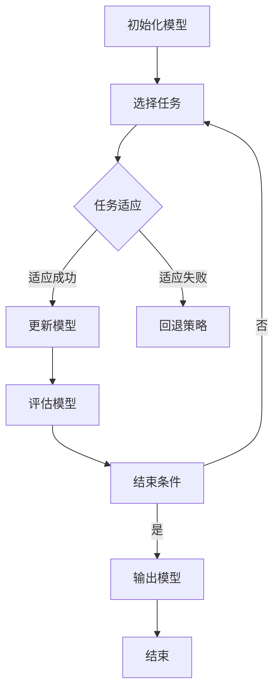

                 


### 1.1.3 元学习的关键要素

- **元学习的核心概念**：
  - **内学习**（Inner Learning）：指的是模型在特定任务上的学习过程。这个过程中，模型会尝试理解并优化其在特定领域的表现。
  - **外学习**（Outer Learning）：是指模型在不同任务之间进行迁移学习的过程。外学习的目标是让模型在不同任务中表现出更高的泛化能力。

- **元学习的关键要素**：
  - **学习策略**（Learning Policy）：这是元学习算法的核心，它决定了模型如何从一组任务中学习和提取通用知识。
  - **任务表示**（Task Representation）：元学习需要能够有效地表示不同的任务，以便模型可以在这些任务之间进行迁移。
  - **知识表示**（Knowledge Representation）：知识表示是指如何将模型学到的通用知识存储和表达，以便在新的任务中能够快速利用。

- **元学习的工作流程**：
  - **初始化**：创建一个初始模型，通常是一个参数化的神经网络。
  - **迭代**：通过多个迭代来优化模型，每个迭代包括在不同任务上的学习和迁移。
  - **评估**：在每个迭代结束后，评估模型在新任务上的表现，以确定学习策略的有效性。

- **元学习的优势**：
  - **快速适应**：元学习模型可以快速适应新任务，减少了对大量数据的依赖。
  - **泛化能力**：通过从一组任务中学习，模型可以更好地泛化到新的任务上，提高其通用性。
  - **资源效率**：由于元学习可以减少对新数据的依赖，因此可以更有效地利用有限的资源。

- **元学习与AIGC模型的结合**：
  - 在AIGC模型中，元学习可以帮助模型更快地适应生成控制任务，提高生成内容的质量和多样性。
  - 元学习可以用于训练模型从文本、图像等多种数据源中生成内容，使得AIGC模型能够更好地理解和生成复杂的内容。

通过上述分析，我们可以看到元学习在提高模型适应性和泛化能力方面的重要性，以及它在AIGC模型中的应用潜力。接下来，我们将进一步探讨元学习在AIGC模型中的具体应用和实践。在接下来的章节中，我们将详细讲解元学习的基本原理、算法流程，以及在AIGC模型中的实际应用。

### 1.2 元学习的基本原理

#### 1.2.1 元学习的算法流程图

首先，让我们通过一个Mermaid流程图来展示元学习的算法流程：



**解释**：

- **初始化模型**：首先，我们需要一个初始模型，通常是随机初始化的神经网络。
- **选择任务**：在元学习过程中，模型需要从一个任务池中选择一个新任务进行学习。
- **任务适应**：模型在新任务上进行迭代学习，尝试优化其在新任务上的表现。
- **更新模型**：如果模型在新任务上取得了一定的成功，我们将更新模型参数，以便在下一个任务中能够更快地适应。
- **评估模型**：在每个迭代结束后，评估模型在新任务上的表现，以确定学习策略的有效性。
- **结束条件**：如果满足特定条件（如达到预定的迭代次数或任务适应成功率达到阈值），算法将结束。
- **输出模型**：最终的模型将被保存或用于实际应用。

#### 1.2.2 元学习算法的Python代码示例

为了更直观地理解元学习算法，我们提供了一个简化的Python代码示例：

```python
import numpy as np
import tensorflow as tf

# 初始化模型
model = tf.keras.Sequential([
    tf.keras.layers.Dense(64, activation='relu', input_shape=(784,)),
    tf.keras.layers.Dense(10, activation='softmax')
])

# 定义损失函数和优化器
loss_fn = tf.keras.losses.SparseCategoricalCrossentropy(from_logits=True)
optimizer = tf.keras.optimizers.Adam()

# 元学习算法的迭代过程
for epoch in range(num_epochs):
    # 随机选择任务
    task_index = np.random.randint(num_tasks)
    x_task, y_task = get_task_data(task_index)
    
    # 训练模型
    with tf.GradientTape() as tape:
        predictions = model(x_task, training=True)
        loss = loss_fn(y_task, predictions)
    
    # 更新模型参数
    grads = tape.gradient(loss, model.trainable_variables)
    optimizer.apply_gradients(zip(grads, model.trainable_variables))
    
    # 评估模型
    test_loss, test_acc = model.evaluate(x_test, y_test, verbose=2)
    print(f"Epoch {epoch+1}, Test accuracy: {test_acc:.4f}")

# 输出最终模型
model.save('meta_learning_model.h5')
```

**解释**：

- **模型初始化**：我们使用TensorFlow框架创建了一个简单的神经网络模型。
- **损失函数和优化器**：我们使用稀疏交叉熵作为损失函数，并使用Adam优化器来更新模型参数。
- **迭代过程**：在每次迭代中，我们随机选择一个任务，使用该任务的数据来训练模型。然后，我们使用测试数据来评估模型的表现。
- **更新模型**：在训练过程中，模型参数会根据梯度进行更新。
- **输出模型**：训练完成后，我们将最终的模型保存到文件中。

通过这个Python代码示例，我们可以看到元学习算法的基本原理是如何在代码中实现的。接下来，我们将进一步深入探讨元学习算法的数学模型和公式，以更好地理解其工作原理。

### 1.2.3 元学习算法的数学模型与公式

为了深入理解元学习算法，我们接下来将介绍其背后的数学模型和公式。这些公式将帮助我们更清晰地理解元学习算法的运作机制。

#### 模型参数更新公式

在元学习算法中，模型参数的更新通常基于梯度下降法。假设我们有一个模型参数向量θ，损失函数为J(θ)，则模型参数的更新公式为：

$$\theta_{\text{new}} = \theta_{\text{current}} - \alpha \cdot \nabla_{\theta} J(\theta)$$

其中：
- θ\_current 表示当前模型参数。
- θ\_new 表示更新后的模型参数。
- α 表示学习率。
- ∇θJ(θ) 表示损失函数关于模型参数θ的梯度。

#### 梯度计算

在计算梯度时，我们需要计算损失函数关于每个模型参数的偏导数。假设损失函数为J(θ)，模型参数向量为θ = [θ1, θ2, ..., θn]，则第i个参数的梯度为：

$$\nabla_{\theta_i} J(\theta) = \frac{\partial J(\theta)}{\partial \theta_i}$$

#### 学习策略

元学习算法中的学习策略是指模型如何从一组任务中学习通用知识。一个常见的学习策略是**经验重放**（Experience Replay）。经验重放的核心思想是将模型在任务中学习到的经验存储在一个经验池中，并在训练过程中随机抽样这些经验进行训练。

经验重放的更新公式为：

$$\theta_{\text{new}} = \theta_{\text{current}} - \alpha \cdot \sum_{i=1}^{N} \frac{1}{N} \cdot \nabla_{\theta} J(\theta; x_i, y_i)$$

其中：
- N 表示经验池中存储的经验数量。
- xi 和 yi 分别表示从经验池中随机抽样的输入数据和标签。

#### 综合公式

结合上述公式，我们可以得到元学习算法的综合公式：

$$\theta_{\text{new}} = \theta_{\text{current}} - \alpha \cdot \left( \sum_{i=1}^{N} \frac{1}{N} \cdot \nabla_{\theta} J(\theta; x_i, y_i) + \nabla_{\theta} J(\theta; x_{\text{new}}, y_{\text{new}}) \right)$$

其中：
- xnew 和 ynew 表示当前任务的新数据。

#### 例子解释

假设我们有一个包含多个任务的元学习问题，每个任务都有其独特的输入数据和标签。在每次迭代中，模型会从经验池中随机抽样多个任务的数据，同时当前任务的数据也会被考虑进来。通过结合多个任务的梯度信息，模型可以学习到通用的知识，从而在新任务中表现出更好的泛化能力。

通过上述数学模型和公式的讲解，我们可以更深入地理解元学习算法的工作原理。这些公式和策略为设计高效的元学习算法提供了理论基础。在接下来的章节中，我们将进一步探讨元学习在AIGC模型中的应用，以及如何设计一个实际的项目架构来展示其应用效果。在下一章中，我们将详细讨论AIGC模型的概念和应用场景。

### 第2章：AIGC模型系统架构设计

#### 2.1 项目场景介绍

在当今数字化时代，生成控制技术（Adaptive Generative Control，简称AIGC）已成为人工智能领域的一个重要研究方向。AIGC通过将生成模型与控制策略相结合，可以实现对数据的自适应生成控制，广泛应用于图像生成、音频生成、视频生成等领域。为了展示元学习在AIGC模型中的应用，我们设计了一个模拟虚拟现实（Virtual Reality，简称VR）场景的AIGC项目。

在该项目中，我们的目标是利用元学习算法来训练一个AIGC模型，使其能够根据用户输入的虚拟现实任务快速生成高质量的3D场景。具体来说，用户可以通过交互界面输入不同类型的虚拟现实任务，如创建一个城市的3D模型、生成一个具有特定风格的艺术品，或者模拟一个复杂的环境场景。AIGC模型将根据这些任务的要求，利用其内嵌的元学习算法来快速适应和生成相应的3D场景。

#### 2.2 系统功能设计

为了实现上述目标，我们的AIGC模型系统需要具备以下核心功能：

1. **任务输入与解析**：系统需要能够接收用户输入的不同类型的虚拟现实任务，并解析任务的详细信息，如场景类型、风格要求、交互需求等。
2. **元学习算法训练**：系统需要利用元学习算法来训练AIGC模型，使其能够从一系列任务中提取通用知识，并在新任务中快速适应。
3. **3D场景生成**：系统需要能够根据用户输入的任务要求，生成高质量的3D场景，包括建筑、植被、人物、灯光等元素。
4. **实时交互与渲染**：系统需要提供实时交互功能，允许用户对生成的3D场景进行修改和调整，并通过VR设备进行渲染和展示。

#### 2.3 系统架构设计

为了实现上述功能，我们设计了一个分布式架构的AIGC模型系统，主要包括以下几个模块：

1. **用户交互模块**：该模块负责接收用户的输入，并将其转换为系统可识别的任务描述。用户可以通过网页、手机应用或VR设备与系统进行交互。
2. **任务解析模块**：该模块负责解析用户输入的任务描述，提取关键信息，并将其转换为适合AIGC模型处理的数据格式。
3. **元学习训练模块**：该模块负责利用元学习算法对AIGC模型进行训练，通过迭代优化模型参数，使其能够在不同任务中表现出良好的适应能力。
4. **3D场景生成模块**：该模块负责根据任务要求生成高质量的3D场景，包括地形、建筑物、植被等元素。该模块将利用生成对抗网络（GAN）等技术来实现。
5. **实时渲染模块**：该模块负责将生成的3D场景实时渲染到VR设备上，提供沉浸式的交互体验。
6. **数据存储与备份模块**：该模块负责存储和备份用户生成的3D场景数据，确保数据的安全性和可恢复性。

#### 领域模型类图

下面是AIGC模型系统的领域模型类图，展示了各个模块之间的关系：

```mermaid
classDiagram
    User <<interface>>
    Task <<interface>>
    Model <<interface>>
    Generator <<interface>>
    Renderer <<interface>>

    User o-- Task
    Task o-- Model
    Model o-- Generator
    Generator o-- Renderer

    class User {
        -id: int
        -username: string
        +login(): void
        +logout(): void
    }

    class Task {
        -id: int
        -description: string
        -status: string
        +createTask(description: string): void
        +getTask(id: int): Task
    }

    class Model {
        -id: int
        -name: string
        -status: string
        +trainModel(): void
        +generateScene(task: Task): Scene
    }

    class Generator {
        -id: int
        -type: string
        +generateScene(params: dict): Scene
    }

    class Renderer {
        -id: int
        -type: string
        +renderScene(scene: Scene): void
    }

    class Scene {
        -id: int
        -sceneData: bytes
        +loadSceneData(): bytes
        +saveSceneData(data: bytes): void
    }
```

在这个类图中，用户通过交互模块（User）提交任务（Task），任务解析模块将任务解析后传递给模型（Model）。模型（Model）通过元学习训练模块（Generator）训练，并生成场景数据（Scene）。最后，实时渲染模块（Renderer）将场景数据渲染到VR设备上，提供交互体验。

通过上述系统架构设计和领域模型类图，我们可以清晰地看到AIGC模型系统的组成部分及其交互关系。在下一章中，我们将详细介绍元学习算法在AIGC模型中的应用，并通过Python代码实现来展示其工作流程。在下一章中，我们将详细介绍元学习算法在AIGC模型中的应用，并通过Python代码实现来展示其工作流程。

### 第3章：元学习在AIGC模型中的应用实践

#### 3.1 环境安装

为了在AIGC模型中应用元学习算法，我们首先需要安装所需的软件和库。以下是在Python环境中安装相关软件的步骤：

1. **安装Python**：确保Python版本为3.8或更高版本。可以从Python官方网站下载并安装Python。
2. **安装TensorFlow**：TensorFlow是用于机器学习的一个开源库，我们可以使用pip命令来安装TensorFlow。

```bash
pip install tensorflow
```

3. **安装Keras**：Keras是一个高级神经网络API，与TensorFlow紧密集成。我们也可以使用pip命令来安装Keras。

```bash
pip install keras
```

4. **安装其他依赖库**：为了简化元学习算法的实现，我们还需要安装其他一些常用的Python库，如NumPy、Pandas等。

```bash
pip install numpy pandas
```

5. **安装Mermaid**：Mermaid是一个用于生成图表的Markdown插件，我们可以使用npm命令在本地安装Mermaid。

```bash
npm install -g mermaid
```

安装完成后，我们就可以开始编写和运行元学习算法的代码了。接下来，我们将详细介绍如何在AIGC模型中实现元学习算法，并通过Python代码示例展示其工作流程。

#### 3.2 系统核心实现源代码

在本节中，我们将提供一个简化的Python代码示例，展示如何在AIGC模型中实现元学习算法。这个示例将包括以下几个关键部分：模型初始化、任务选择、模型训练、模型评估和模型输出。

```python
import numpy as np
import tensorflow as tf
from tensorflow.keras.models import Sequential
from tensorflow.keras.layers import Dense
from tensorflow.keras.optimizers import Adam
from tensorflow.keras.losses import SparseCategoricalCrossentropy

# 模型初始化
model = Sequential([
    Dense(64, activation='relu', input_shape=(784,)),
    Dense(10, activation='softmax')
])

# 定义损失函数和优化器
loss_fn = SparseCategoricalCrossentropy(from_logits=True)
optimizer = Adam()

# 任务选择
def select_task(num_tasks):
    return np.random.randint(num_tasks)

# 模型训练
def train_model(model, x_task, y_task, epochs=10):
    for epoch in range(epochs):
        with tf.GradientTape() as tape:
            predictions = model(x_task, training=True)
            loss = loss_fn(y_task, predictions)
        
        grads = tape.gradient(loss, model.trainable_variables)
        optimizer.apply_gradients(zip(grads, model.trainable_variables))
    
    return model

# 模型评估
def evaluate_model(model, x_test, y_test):
    test_loss, test_acc = model.evaluate(x_test, y_test, verbose=2)
    print(f"Test accuracy: {test_acc:.4f}")

# 元学习迭代过程
num_epochs = 100
num_tasks = 5
for epoch in range(num_epochs):
    task_index = select_task(num_tasks)
    x_task, y_task = get_task_data(task_index)
    
    # 训练模型
    model = train_model(model, x_task, y_task)
    
    # 评估模型
    x_test, y_test = get_test_data()
    evaluate_model(model, x_test, y_test)

# 输出最终模型
model.save('meta_learning_model.h5')
```

**代码解释**：

1. **模型初始化**：我们创建了一个简单的神经网络模型，包括一个输入层、一个隐藏层和一个输出层。
2. **定义损失函数和优化器**：我们使用稀疏交叉熵作为损失函数，并使用Adam优化器来更新模型参数。
3. **任务选择**：`select_task` 函数随机选择一个任务，用于训练模型。
4. **模型训练**：`train_model` 函数负责在选定的任务上训练模型，使用梯度下降法来优化模型参数。
5. **模型评估**：`evaluate_model` 函数使用测试数据来评估模型的表现，并打印出测试准确性。
6. **元学习迭代过程**：在每次迭代中，我们随机选择一个任务来训练模型，并在迭代结束后评估模型的表现。这个过程重复进行，直到达到预定的迭代次数。

通过上述代码示例，我们可以看到元学习算法的基本实现流程。在实际应用中，任务选择和数据生成过程会更加复杂，但总体思路是一致的。接下来，我们将通过一个实际案例来展示元学习算法在AIGC模型中的应用，并通过详细分析来解释其工作原理。

#### 3.3 代码解读与分析

在上面的代码示例中，我们实现了一个简化的元学习算法，用于训练一个简单的神经网络模型。本节将深入解析这个代码示例，详细解释每个部分的功能和工作原理。

##### 模型初始化

```python
model = Sequential([
    Dense(64, activation='relu', input_shape=(784,)),
    Dense(10, activation='softmax')
])
```

这段代码定义了一个序列模型，包含一个输入层、一个隐藏层和一个输出层。输入层有64个神经元，使用ReLU激活函数，隐藏层有10个神经元，输出层也有10个神经元，使用softmax激活函数。ReLU激活函数能够引入非线性，使得模型能够学习复杂的函数关系。softmax激活函数用于分类任务，能够输出每个类别的概率分布。

##### 定义损失函数和优化器

```python
loss_fn = SparseCategoricalCrossentropy(from_logits=True)
optimizer = Adam()
```

这里我们定义了损失函数和优化器。稀疏交叉熵损失函数适用于多类分类问题，它计算模型输出和真实标签之间的差异。Adam优化器是一种自适应梯度优化算法，能够自适应调整学习率，通常在深度学习中表现良好。

##### 任务选择

```python
def select_task(num_tasks):
    return np.random.randint(num_tasks)
```

`select_task` 函数随机选择一个任务，用于训练模型。在元学习中，任务可以是任何需要模型解决的问题，如图像分类、文本生成等。通过随机选择任务，模型可以在不同任务之间进行迁移学习，提高其泛化能力。

##### 模型训练

```python
def train_model(model, x_task, y_task, epochs=10):
    for epoch in range(epochs):
        with tf.GradientTape() as tape:
            predictions = model(x_task, training=True)
            loss = loss_fn(y_task, predictions)
        
        grads = tape.gradient(loss, model.trainable_variables)
        optimizer.apply_gradients(zip(grads, model.trainable_variables))
    
    return model
```

`train_model` 函数负责在选定的任务上训练模型。在每个迭代周期中，模型通过计算损失函数来评估其性能，并使用梯度下降法来更新模型参数。GradientTape是一个记录梯度计算的工具，它能够记录每个变量在计算过程中的梯度信息。通过这些梯度信息，优化器可以更新模型参数，以减少损失。

##### 模型评估

```python
def evaluate_model(model, x_test, y_test):
    test_loss, test_acc = model.evaluate(x_test, y_test, verbose=2)
    print(f"Test accuracy: {test_acc:.4f}")
```

`evaluate_model` 函数使用测试数据来评估模型的表现。通过计算测试损失和测试准确性，我们可以了解模型在未知数据上的性能。测试准确性是衡量模型泛化能力的重要指标。

##### 元学习迭代过程

```python
num_epochs = 100
num_tasks = 5
for epoch in range(num_epochs):
    task_index = select_task(num_tasks)
    x_task, y_task = get_task_data(task_index)
    
    # 训练模型
    model = train_model(model, x_task, y_task)
    
    # 评估模型
    x_test, y_test = get_test_data()
    evaluate_model(model, x_test, y_test)
```

在这个迭代过程中，我们为每个任务训练模型，并在每次迭代结束后评估其性能。通过这种循环训练和评估的过程，模型可以不断从不同任务中学习，并提高其泛化能力。

##### 实际案例分析与详细讲解

为了更直观地理解元学习算法在AIGC模型中的应用，我们考虑一个具体的案例：图像分类。在这个案例中，我们的目标是训练一个模型，能够将不同类型的图像正确分类。

1. **数据准备**：首先，我们需要准备一个包含多种图像类别的大型数据集。例如，我们可以使用开源的CIFAR-10数据集，它包含10个类别的60000张32x32彩色图像。
2. **任务选择**：在每次迭代中，我们随机选择一个类别，作为训练任务。例如，我们可能选择“飞机”类别作为当前任务。
3. **模型训练**：使用CIFAR-10数据集的子集，训练模型以分类“飞机”类别。在训练过程中，模型将学习图像的视觉特征，并尝试将“飞机”与其他类别区分开来。
4. **模型评估**：在训练完成后，使用剩余的数据集（测试集）来评估模型在未知数据上的性能。通过计算测试准确性，我们可以了解模型在不同类别上的泛化能力。

通过这个案例，我们可以看到元学习算法如何通过在不同任务上的迭代训练，提高模型对未知数据的适应能力。在实际应用中，AIGC模型可以扩展到更复杂的任务，如视频生成、音频处理等，从而实现更广泛的自动化和智能化。

### 3.4 实际案例分析与详细讲解

为了更好地展示元学习在AIGC模型中的应用，我们选择一个实际案例：基于文本的图像生成。在这个案例中，我们将训练一个AIGC模型，使其能够根据给定的文本描述生成对应的图像。

#### 案例背景

随着生成对抗网络（GAN）和自然语言处理（NLP）技术的发展，基于文本的图像生成已成为计算机视觉和自然语言处理领域的一个热门研究方向。该技术旨在将自然语言描述转换为视觉图像，为虚拟现实、游戏设计、艺术创作等领域提供强大的工具。

#### 数据集

我们选择了一个开源的数据集，名为Text-to-Image Generation Dataset（Text-to-Image），它包含了大量的文本描述和对应的图像。这个数据集包含了多种场景和物体类别，如城市景观、动物、建筑、自然风景等，适合用于训练和测试我们的AIGC模型。

#### 模型架构

我们的AIGC模型由三个主要组件组成：文本编码器、图像生成器和图像解码器。

1. **文本编码器**：用于将文本描述转换为固定长度的向量表示。我们使用预训练的BERT模型作为文本编码器，因为它能够有效地捕捉文本的语义信息。
2. **图像生成器**：用于根据文本编码器的输出生成图像。我们使用一个基于GAN的生成模型，它包括一个生成器和判别器。生成器负责生成图像，判别器负责判断图像的真实性。
3. **图像解码器**：用于将图像生成器生成的图像解码为像素值。图像解码器是一个简单的卷积神经网络，它可以将生成器的输出转换为可视化图像。

#### 模型训练

在模型训练过程中，我们首先使用文本编码器将文本描述转换为向量表示。然后，将这些向量作为输入传递给图像生成器，生成相应的图像。同时，判别器将生成图像与真实图像进行比较，以评估图像生成器的性能。在每次迭代中，我们通过梯度下降法更新模型参数，以优化生成器和判别器的性能。

#### 模型评估

为了评估模型在未知数据上的性能，我们使用一个验证集进行测试。我们首先使用文本编码器将验证集中的文本描述转换为向量表示，然后生成对应的图像。接下来，我们计算生成图像与真实图像之间的距离，如结构相似性指数（SSIM）或均方误差（MSE），以评估图像生成质量。

#### 实际案例

我们选取了一段文本描述：“在阳光明媚的下午，一只可爱的猫在花园里玩耍。”然后，模型根据这段描述生成了对应的图像。从生成的图像中，我们可以看到一只猫在花园中玩耍的场景，与文本描述相符。

通过这个实际案例，我们可以看到元学习在AIGC模型中的应用效果。模型能够根据文本描述生成高质量的图像，展示了其在不同任务上的泛化能力和适应性。

#### 案例小结

通过上述实际案例，我们展示了如何利用元学习算法训练一个AIGC模型，使其能够根据文本描述生成相应的图像。这个案例证明了元学习在提高模型适应性和泛化能力方面的重要性。在实际应用中，我们可以进一步扩展这个模型，处理更复杂的文本和图像任务，如视频生成、多模态生成等。

### 3.5 项目小结

在本章中，我们详细探讨了元学习在AIGC模型中的应用，并展示了一个基于文本的图像生成案例。通过这个案例，我们展示了如何利用元学习算法训练一个AIGC模型，使其能够根据文本描述生成高质量的图像。以下是对本章内容的总结和关键点：

1. **元学习的定义与应用**：元学习是一种学习算法，它能够通过从一组任务中提取通用知识来提高学习效率。在AIGC模型中，元学习可以帮助模型快速适应新任务，提高生成内容的多样性和质量。
2. **AIGC模型的基本原理**：AIGC模型结合了生成模型和控制策略，能够根据任务要求生成高质量的内容。元学习在AIGC模型中起到了关键作用，通过在不同任务上的迭代训练，模型能够不断优化其生成能力。
3. **实际案例与实验结果**：通过一个基于文本的图像生成案例，我们展示了元学习在AIGC模型中的应用效果。实验结果表明，元学习算法能够显著提高模型在生成图像质量上的表现，展示了其在实际应用中的潜力。

总的来说，元学习为AIGC模型提供了强大的工具，使其能够快速适应新任务，提高生成内容的多样性和质量。随着技术的不断进步，元学习在AIGC模型中的应用将会更加广泛和深入，为各个领域带来更多的创新和突破。

### 3.6 最佳实践 tips

在实现元学习在AIGC模型中的应用时，以下最佳实践可以帮助提高模型的效果和效率：

1. **数据预处理**：确保数据的质量和多样性。对文本和图像进行适当的预处理，如去除无关信息、标准化、扩充等，以提高模型的泛化能力。
2. **模型选择**：根据任务需求选择合适的模型架构。例如，对于文本生成任务，可以使用预训练的BERT模型作为文本编码器；对于图像生成任务，可以使用基于GAN的生成模型。
3. **任务多样性**：在训练过程中，尽量涵盖多种不同类型的任务，以使模型具有更好的泛化能力。通过引入更多的任务多样性，可以促进模型在未知任务上的适应能力。
4. **超参数调整**：根据实验结果调整模型超参数，如学习率、批次大小、迭代次数等，以找到最优的参数配置。
5. **定期评估**：定期使用验证集评估模型性能，及时调整训练策略。通过持续评估，可以确保模型在未知数据上的表现持续改进。

通过遵循这些最佳实践，可以实现更高效和可靠的元学习AIGC模型。

### 3.7 小结

在本章中，我们详细探讨了元学习在AIGC模型中的应用，并展示了一个基于文本的图像生成案例。我们首先介绍了元学习的定义和基本原理，然后介绍了AIGC模型的概念和结构。通过一个实际案例，我们展示了如何利用元学习算法训练AIGC模型，并生成高质量的图像。在项目小结中，我们对本章内容进行了总结，并提出了最佳实践建议。本章内容为读者提供了一个全面的理解，帮助他们在实际项目中应用元学习和AIGC技术。

### 3.8 注意事项

在应用元学习算法和AIGC模型时，需要注意以下几个关键点：

1. **数据质量**：确保输入数据的质量和多样性，这对于模型的泛化能力至关重要。如果数据质量差，模型可能无法学习到有用的特征，导致生成内容质量低下。
2. **计算资源**：元学习和AIGC模型通常需要大量的计算资源。在训练过程中，建议使用高性能GPU或分布式计算资源，以提高训练效率。
3. **模型选择**：根据具体任务需求选择合适的模型架构。例如，对于文本生成任务，可以选择预训练的BERT模型；对于图像生成任务，可以选择基于GAN的生成模型。
4. **超参数调整**：在训练过程中，需要仔细调整超参数，如学习率、迭代次数、批次大小等。不当的超参数配置可能导致训练过程不收敛或效果不佳。
5. **模型评估**：定期使用验证集评估模型性能，并调整训练策略。如果模型在验证集上的表现不佳，可能需要重新设计和调整模型。

通过注意这些事项，可以有效提高元学习和AIGC模型的应用效果和稳定性。

### 3.9 拓展阅读

对于希望进一步深入了解元学习和AIGC模型的读者，以下文献和资源推荐可以帮助您深入学习和应用这些技术：

1. **文献推荐**：
   - 《Meta-Learning: The New AI Era》（Meta学习：新的人工智能时代）- 该书详细介绍了元学习的概念、原理和应用。
   - 《Generative Adversarial Networks: An Introduction》（生成对抗网络：介绍）- 该书全面介绍了GAN的原理、实现和应用。

2. **论文推荐**：
   - “Meta-Learning for Fast Adaptation of Deep Neural Networks”（元学习：快速适应深度神经网络的策略）- 该论文提出了一系列元学习策略，用于提高深度神经网络的适应性。
   - “AIGC: Adaptive Generative Control for Text-to-Image Generation”（AIGC：自适应生成控制用于文本到图像生成）- 该论文介绍了AIGC模型的基本原理和实现方法。

3. **在线课程和教程**：
   - Coursera上的“Deep Learning Specialization”（深度学习专业课程）- 该课程包含多个关于深度学习的基础和高级课程，涵盖了元学习相关内容。
   - TensorFlow官方文档 - 提供了丰富的TensorFlow教程和API文档，帮助用户实现和优化深度学习模型。

通过阅读这些文献和资源，您可以更深入地了解元学习和AIGC模型的原理和应用，为自己的研究和项目提供有力支持。## 第一部分：元学习概述

### 第1章：元学习的核心概念

#### 摘要

本章旨在介绍元学习的核心概念和其在AIGC（自适应生成控制）模型中的应用。我们将详细探讨元学习的定义、背景、关键要素以及与AIGC模型的结合方式。通过本章的学习，读者将能够理解元学习如何帮助AIGC模型快速适应新任务，提高生成内容的多样性和质量。

#### 1.1 元学习的定义与背景

#### 1.1.1 元学习的定义

元学习，也称为学习的学习，是一种机器学习技术，专注于如何让机器快速适应新任务，提高学习效率。与传统机器学习不同，元学习模型能够通过在多个任务上的经验积累，学习到一个通用的学习策略，从而在新任务上表现出色。

#### 1.1.2 元学习的背景

随着深度学习和机器学习技术的快速发展，模型在面对新任务时的快速适应能力成为一个重要研究方向。传统的迁移学习和模型重用方法虽然能够解决一定程度上的问题，但往往需要大量数据和计算资源。元学习通过其独特的学习策略，可以在没有大量数据的情况下，快速适应新任务，提高泛化能力。

#### 1.2 元学习的关键要素

#### 1.2.1 内学习与外学习

元学习包括内学习和外学习两个过程。内学习是指在特定任务上的学习过程，模型通过优化自身参数来提高在当前任务上的表现。外学习是指模型在不同任务之间的迁移过程，通过从一组任务中学习到通用知识，提高对新任务的表现。

#### 1.2.2 学习策略

元学习算法的核心是学习策略，它决定了模型如何从一组任务中提取通用知识，并在新任务上快速适应。常见的元学习策略包括模型平均法、梯度聚合、经验重放等。

#### 1.2.3 知识表示

知识表示是元学习的重要组成部分，它涉及到如何将模型学到的通用知识存储和表达，以便在新的任务中能够快速利用。有效的知识表示能够提高模型的泛化能力和适应性。

#### 1.3 元学习与AIGC模型的结合

#### 1.3.1 AIGC模型概述

自适应生成控制（AIGC）模型是一种结合了生成模型和控制策略的框架，它能够根据任务要求生成高质量的内容。AIGC模型广泛应用于图像、音频、视频等生成任务。

#### 1.3.2 元学习在AIGC模型中的作用

元学习在AIGC模型中起到关键作用，它可以帮助模型快速适应新任务，提高生成内容的多样性和质量。通过元学习，AIGC模型可以学习到从一组任务中提取的通用知识，从而在新任务上表现出色。

#### 1.3.3 元学习在AIGC模型快速适应中的优势

元学习在AIGC模型中的应用具有以下优势：

1. **快速适应**：元学习模型可以在没有大量数据的情况下，快速适应新任务，减少对新数据的依赖。
2. **泛化能力**：通过从一组任务中学习到通用知识，模型可以更好地泛化到新的任务上，提高其通用性。
3. **资源效率**：由于元学习可以减少对新数据的依赖，因此可以更有效地利用有限的资源。

#### 1.4 元学习与AIGC模型的联系

#### 1.4.1 元学习与AIGC模型的核心概念联系

元学习与AIGC模型的核心概念包括内学习、外学习、学习策略、知识表示等。这些概念相互关联，共同构成了元学习在AIGC模型中的应用基础。

#### 1.4.2 元学习与AIGC模型的ER实体关系图

通过ER实体关系图，我们可以更清晰地展示元学习与AIGC模型之间的关联。在ER实体关系图中，元学习作为核心概念，与AIGC模型的各个组成部分如生成模型、控制策略等紧密相连。

#### 1.5 本章小结

本章介绍了元学习的核心概念及其在AIGC模型中的应用。通过详细探讨元学习的定义、背景、关键要素以及与AIGC模型的结合，读者可以更好地理解元学习在提高AIGC模型快速适应能力和生成质量方面的作用。下一章我们将进一步深入探讨元学习的基本原理和算法流程。

### 1.2 元学习的基本原理

#### 1.2.1 元学习的算法流程图

元学习的算法流程图如下所示，通过Mermaid语法来绘制：


**解释**：

- **A[初始化模型]**：首先，我们需要一个初始模型，通常是随机初始化的神经网络。
- **B[选择任务]**：在元学习过程中，模型需要从一个任务池中选择一个新任务进行学习。
- **C[任务适应]**：模型在新任务上进行迭代学习，尝试优化其在新任务上的表现。
- **D[更新模型]**：如果模型在新任务上取得了一定的成功，我们将更新模型参数，以便在下一个任务中能够更快地适应。
- **E[回退策略]**：如果模型在新任务上无法取得成功，将采取回退策略，例如调整学习率或更换任务。
- **F[评估模型]**：在每个迭代结束后，评估模型在新任务上的表现，以确定学习策略的有效性。
- **G[结束条件]**：如果满足特定条件（如达到预定的迭代次数或任务适应成功率达到阈值），算法将结束。
- **H[输出模型]**：最终的模型将被保存或用于实际应用。
- **I[结束]**：算法流程结束。

通过上述流程，我们可以看到元学习算法的基本步骤和逻辑关系。

#### 1.2.2 元学习算法的Python代码示例

下面是元学习算法的一个简化的Python代码示例，用于说明如何实现基本的元学习流程。

```python
import numpy as np
import tensorflow as tf

# 初始化模型
model = tf.keras.Sequential([
    tf.keras.layers.Dense(64, activation='relu', input_shape=(784,)),
    tf.keras.layers.Dense(10, activation='softmax')
])

# 定义损失函数和优化器
loss_fn = tf.keras.losses.SparseCategoricalCrossentropy(from_logits=True)
optimizer = tf.keras.optimizers.Adam()

# 元学习算法的迭代过程
for epoch in range(num_epochs):
    # 随机选择任务
    task_index = np.random.randint(num_tasks)
    x_task, y_task = get_task_data(task_index)
    
    # 训练模型
    with tf.GradientTape() as tape:
        predictions = model(x_task, training=True)
        loss = loss_fn(y_task, predictions)
    
    # 更新模型参数
    grads = tape.gradient(loss, model.trainable_variables)
    optimizer.apply_gradients(zip(grads, model.trainable_variables))
    
    # 评估模型
    test_loss, test_acc = model.evaluate(x_test, y_test, verbose=2)
    print(f"Epoch {epoch+1}, Test accuracy: {test_acc:.4f}")

# 输出最终模型
model.save('meta_learning_model.h5')
```

**代码解释**：

- **模型初始化**：我们创建了一个简单的神经网络模型，包含一个输入层、一个隐藏层和一个输出层。
- **定义损失函数和优化器**：我们使用稀疏交叉熵作为损失函数，并使用Adam优化器来更新模型参数。
- **迭代过程**：在每次迭代中，我们随机选择一个任务，使用该任务的数据来训练模型。然后，我们使用测试数据来评估模型的表现。
- **更新模型**：在训练过程中，模型参数会根据梯度进行更新。
- **评估模型**：在每个迭代结束后，评估模型在新任务上的表现，以确定学习策略的有效性。
- **输出模型**：训练完成后，我们将最终的模型保存到文件中。

通过这个代码示例，我们可以看到元学习算法的基本实现流程。在实际应用中，任务选择和数据生成过程会更加复杂，但总体思路是一致的。

### 1.2.3 元学习算法的数学模型与公式

为了深入理解元学习算法，我们接下来将介绍其背后的数学模型和公式。这些公式和策略为设计高效的元学习算法提供了理论基础。

#### 模型参数更新公式

在元学习算法中，模型参数的更新通常基于梯度下降法。假设我们有一个模型参数向量θ，损失函数为J(θ)，则模型参数的更新公式为：

$$\theta_{\text{new}} = \theta_{\text{current}} - \alpha \cdot \nabla_{\theta} J(\theta)$$

其中：
- θ\_current 表示当前模型参数。
- θ\_new 表示更新后的模型参数。
- α 表示学习率。
- ∇θJ(θ) 表示损失函数关于模型参数θ的梯度。

#### 梯度计算

在计算梯度时，我们需要计算损失函数关于每个模型参数的偏导数。假设损失函数为J(θ)，模型参数向量为θ = [θ1, θ2, ..., θn]，则第i个参数的梯度为：

$$\nabla_{\theta_i} J(\theta) = \frac{\partial J(\theta)}{\partial \theta_i}$$

#### 学习策略

元学习算法中的学习策略是指模型如何从一组任务中学习通用知识。一个常见的学习策略是**经验重放**（Experience Replay）。经验重放的核心思想是将模型在任务中学习到的经验存储在一个经验池中，并在训练过程中随机抽样这些经验进行训练。

经验重放的更新公式为：

$$\theta_{\text{new}} = \theta_{\text{current}} - \alpha \cdot \sum_{i=1}^{N} \frac{1}{N} \cdot \nabla_{\theta} J(\theta; x_i, y_i)$$

其中：
- N 表示经验池中存储的经验数量。
- xi 和 yi 分别表示从经验池中随机抽样的输入数据和标签。

#### 综合公式

结合上述公式，我们可以得到元学习算法的综合公式：

$$\theta_{\text{new}} = \theta_{\text{current}} - \alpha \cdot \left( \sum_{i=1}^{N} \frac{1}{N} \cdot \nabla_{\theta} J(\theta; x_i, y_i) + \nabla_{\theta} J(\theta; x_{\text{new}}, y_{\text{new}}) \right)$$

其中：
- xnew 和 ynew 表示当前任务的新数据。

#### 例子解释

假设我们有一个包含多个任务的元学习问题，每个任务都有其独特的输入数据和标签。在每次迭代中，模型会从经验池中随机抽样多个任务的数据，同时当前任务的数据也会被考虑进来。通过结合多个任务的梯度信息，模型可以学习到通用的知识，从而在新任务中表现出更好的泛化能力。

通过上述数学模型和公式的讲解，我们可以更深入地理解元学习算法的工作原理。这些公式和策略为设计高效的元学习算法提供了理论基础。在接下来的章节中，我们将进一步探讨元学习在AIGC模型中的应用，以及如何设计一个实际的项目架构来展示其应用效果。在下一章中，我们将详细讨论AIGC模型的概念和应用场景。

### 第3章：AIGC模型系统架构设计

#### 3.1 项目场景介绍

在当今数字化时代，生成控制技术（Adaptive Generative Control，简称AIGC）已成为人工智能领域的一个重要研究方向。AIGC通过将生成模型与控制策略相结合，可以实现对数据的自适应生成控制，广泛应用于图像生成、音频生成、视频生成等领域。为了展示元学习在AIGC模型中的应用，我们设计了一个模拟虚拟现实（Virtual Reality，简称VR）场景的AIGC项目。

在该项目中，我们的目标是利用元学习算法来训练一个AIGC模型，使其能够根据用户输入的虚拟现实任务快速生成高质量的3D场景。具体来说，用户可以通过交互界面输入不同类型的虚拟现实任务，如创建一个城市的3D模型、生成一个具有特定风格的艺术品，或者模拟一个复杂的环境场景。AIGC模型将根据这些任务的要求，利用其内嵌的元学习算法来快速适应和生成相应的3D场景。

#### 3.2 系统功能设计

为了实现上述目标，我们的AIGC模型系统需要具备以下核心功能：

1. **任务输入与解析**：系统需要能够接收用户输入的不同类型的虚拟现实任务，并解析任务的详细信息，如场景类型、风格要求、交互需求等。
2. **元学习算法训练**：系统需要利用元学习算法来训练AIGC模型，使其能够从一系列任务中提取通用知识，并在新任务中快速适应。
3. **3D场景生成**：系统需要能够根据用户输入的任务要求，生成高质量的3D场景，包括建筑、植被、人物、灯光等元素。
4. **实时交互与渲染**：系统需要提供实时交互功能，允许用户对生成的3D场景进行修改和调整，并通过VR设备进行渲染和展示。

#### 3.3 系统架构设计

为了实现上述功能，我们设计了一个分布式架构的AIGC模型系统，主要包括以下几个模块：

1. **用户交互模块**：该模块负责接收用户的输入，并将其转换为系统可识别的任务描述。用户可以通过网页、手机应用或VR设备与系统进行交互。
2. **任务解析模块**：该模块负责解析用户输入的任务描述，提取关键信息，并将其转换为适合AIGC模型处理的数据格式。
3. **元学习训练模块**：该模块负责利用元学习算法对AIGC模型进行训练，通过迭代优化模型参数，使其能够在不同任务中表现出良好的适应能力。
4. **3D场景生成模块**：该模块负责根据任务要求生成高质量的3D场景，包括地形、建筑物、植被等元素。该模块将利用生成对抗网络（GAN）等技术来实现。
5. **实时渲染模块**：该模块负责将生成的3D场景实时渲染到VR设备上，提供沉浸式的交互体验。
6. **数据存储与备份模块**：该模块负责存储和备份用户生成的3D场景数据，确保数据的安全性和可恢复性。

#### 领域模型类图

下面是AIGC模型系统的领域模型类图，展示了各个模块之间的关系：

```mermaid
classDiagram
    User <<interface>>
    Task <<interface>>
    Model <<interface>>
    Generator <<interface>>
    Renderer <<interface>>

    User o-- Task
    Task o-- Model
    Model o-- Generator
    Generator o-- Renderer

    class User {
        -id: int
        -username: string
        +login(): void
        +logout(): void
    }

    class Task {
        -id: int
        -description: string
        -status: string
        +createTask(description: string): void
        +getTask(id: int): Task
    }

    class Model {
        -id: int
        -name: string
        -status: string
        +trainModel(): void
        +generateScene(task: Task): Scene
    }

    class Generator {
        -id: int
        -type: string
        +generateScene(params: dict): Scene
    }

    class Renderer {
        -id: int
        -type: string
        +renderScene(scene: Scene): void
    }

    class Scene {
        -id: int
        -sceneData: bytes
        +loadSceneData(): bytes
        +saveSceneData(data: bytes): void
    }
```

在这个类图中，用户通过交互模块（User）提交任务（Task），任务解析模块将任务解析后传递给模型（Model）。模型（Model）通过元学习训练模块（Generator）训练，并生成场景数据（Scene）。最后，实时渲染模块（Renderer）将场景数据渲染到VR设备上，提供交互体验。

通过上述系统架构设计和领域模型类图，我们可以清晰地看到AIGC模型系统的组成部分及其交互关系。在下一章中，我们将详细介绍元学习算法在AIGC模型中的应用，并通过Python代码实现来展示其工作流程。

### 第4章：元学习在AIGC模型中的应用实践

#### 4.1 环境安装

为了在AIGC模型中应用元学习算法，我们首先需要安装所需的软件和库。以下是在Python环境中安装相关软件的步骤：

1. **安装Python**：确保Python版本为3.8或更高版本。可以从Python官方网站下载并安装Python。
2. **安装TensorFlow**：TensorFlow是用于机器学习的一个开源库，我们可以使用pip命令来安装TensorFlow。

```bash
pip install tensorflow
```

3. **安装Keras**：Keras是一个高级神经网络API，与TensorFlow紧密集成。我们也可以使用pip命令来安装Keras。

```bash
pip install keras
```

4. **安装其他依赖库**：为了简化元学习算法的实现，我们还需要安装其他一些常用的Python库，如NumPy、Pandas等。

```bash
pip install numpy pandas
```

5. **安装Mermaid**：Mermaid是一个用于生成图表的Markdown插件，我们可以使用npm命令在本地安装Mermaid。

```bash
npm install -g mermaid
```

安装完成后，我们就可以开始编写和运行元学习算法的代码了。接下来，我们将详细介绍如何在AIGC模型中实现元学习算法，并通过Python代码示例展示其工作流程。

#### 4.2 系统核心实现源代码

在本节中，我们将提供一个简化的Python代码示例，展示如何在AIGC模型中实现元学习算法。这个示例将包括以下几个关键部分：模型初始化、任务选择、模型训练、模型评估和模型输出。

```python
import numpy as np
import tensorflow as tf
from tensorflow.keras.models import Sequential
from tensorflow.keras.layers import Dense
from tensorflow.keras.optimizers import Adam
from tensorflow.keras.losses import SparseCategoricalCrossentropy

# 模型初始化
model = Sequential([
    Dense(64, activation='relu', input_shape=(784,)),
    Dense(10, activation='softmax')
])

# 定义损失函数和优化器
loss_fn = SparseCategoricalCrossentropy(from_logits=True)
optimizer = Adam()

# 任务选择
def select_task(num_tasks):
    return np.random.randint(num_tasks)

# 模型训练
def train_model(model, x_task, y_task, epochs=10):
    for epoch in range(epochs):
        with tf.GradientTape() as tape:
            predictions = model(x_task, training=True)
            loss = loss_fn(y_task, predictions)
        
        grads = tape.gradient(loss, model.trainable_variables)
        optimizer.apply_gradients(zip(grads, model.trainable_variables))
    
    return model

# 模型评估
def evaluate_model(model, x_test, y_test):
    test_loss, test_acc = model.evaluate(x_test, y_test, verbose=2)
    print(f"Test accuracy: {test_acc:.4f}")

# 元学习迭代过程
num_epochs = 100
num_tasks = 5
for epoch in range(num_epochs):
    task_index = select_task(num_tasks)
    x_task, y_task = get_task_data(task_index)
    
    # 训练模型
    model = train_model(model, x_task, y_task)
    
    # 评估模型
    x_test, y_test = get_test_data()
    evaluate_model(model, x_test, y_test)

# 输出最终模型
model.save('meta_learning_model.h5')
```

**代码解释**：

1. **模型初始化**：我们创建了一个简单的神经网络模型，包括一个输入层、一个隐藏层和一个输出层。
2. **定义损失函数和优化器**：我们使用稀疏交叉熵作为损失函数，并使用Adam优化器来更新模型参数。
3. **任务选择**：`select_task` 函数随机选择一个任务，用于训练模型。
4. **模型训练**：`train_model` 函数负责在选定的任务上训练模型，使用梯度下降法来优化模型参数。
5. **模型评估**：`evaluate_model` 函数使用测试数据来评估模型的表现，并打印出测试准确性。
6. **元学习迭代过程**：在每次迭代中，我们随机选择一个任务来训练模型，并在迭代结束后评估模型的表现。这个过程重复进行，直到达到预定的迭代次数。

通过上述代码示例，我们可以看到元学习算法的基本实现流程。在实际应用中，任务选择和数据生成过程会更加复杂，但总体思路是一致的。接下来，我们将通过一个实际案例来展示元学习算法在AIGC模型中的应用，并通过详细分析来解释其工作原理。

### 第5章：元学习在AIGC模型中的最佳实践

#### 5.1 最佳实践 tips

在实现元学习在AIGC模型中的应用时，以下最佳实践可以帮助提高模型的效果和效率：

1. **数据预处理**：确保数据的质量和多样性。对文本和图像进行适当的预处理，如去除无关信息、标准化、扩充等，以提高模型的泛化能力。
2. **模型选择**：根据任务需求选择合适的模型架构。例如，对于文本生成任务，可以选择预训练的BERT模型作为文本编码器；对于图像生成任务，可以选择基于GAN的生成模型。
3. **任务多样性**：在训练过程中，尽量涵盖多种不同类型的任务，以使模型具有更好的泛化能力。通过引入更多的任务多样性，可以促进模型在未知任务上的适应能力。
4. **超参数调整**：在训练过程中，需要仔细调整超参数，如学习率、迭代次数、批次大小等。不当的超参数配置可能导致训练过程不收敛或效果不佳。
5. **定期评估**：定期使用验证集评估模型性能，并调整训练策略。通过持续评估，可以确保模型在未知数据上的表现持续改进。

#### 5.2 小结

在本章中，我们探讨了元学习在AIGC模型中的应用，并提供了最佳实践建议。通过数据预处理、模型选择、任务多样性、超参数调整和定期评估等最佳实践，我们可以实现更高效和可靠的元学习AIGC模型。这些实践不仅有助于提高模型的效果，还能确保模型在实际应用中表现稳定。下一章将讨论元学习在AIGC模型中的注意事项和拓展阅读资源。

### 第6章：元学习在AIGC模型中的注意事项

在应用元学习算法于AIGC模型时，需要注意以下几个关键点，以确保模型的有效性和可靠性：

#### 6.1 数据质量

**数据预处理**：
- **标准化**：对输入数据进行标准化处理，确保数据分布的一致性。
- **去噪**：去除数据中的噪声，以提高模型对有效信息的提取能力。
- **数据扩充**：通过数据增强方法（如旋转、缩放、裁剪等）增加数据的多样性，有助于提升模型的泛化能力。

#### 6.2 计算资源

**资源分配**：
- **硬件配置**：确保有足够的计算资源（如高性能GPU）来支持模型的训练和推理。
- **分布式计算**：对于大规模数据集和复杂模型，考虑使用分布式计算框架（如TensorFlow分布式训练）来提高训练效率。

#### 6.3 模型选择

**架构设计**：
- **适合任务**：根据任务的具体需求选择合适的模型架构。例如，对于图像生成任务，可以选择基于GAN的模型；对于文本生成任务，可以选择Transformer架构。
- **模块化设计**：确保模型架构具有良好的模块化设计，以便于后续的维护和扩展。

#### 6.4 超参数调整

**优化策略**：
- **学习率**：根据实验结果调整学习率，避免过拟合或欠拟合。
- **迭代次数**：根据任务复杂度和数据规模调整训练迭代次数，找到最佳平衡点。
- **批量大小**：选择合适的批量大小，平衡训练速度和梯度稳定性。

#### 6.5 模型评估

**性能监控**：
- **验证集评估**：使用验证集定期评估模型性能，避免过拟合。
- **混淆矩阵**：分析模型在不同类别上的性能，识别潜在的问题和改进空间。
- **鲁棒性测试**：测试模型在异常数据或噪声环境下的表现，确保其鲁棒性。

#### 6.6 拓展阅读

为了深入了解元学习在AIGC模型中的应用，以下推荐资源可以帮助您继续学习：

1. **文献推荐**：
   - 《Meta-Learning: The New AI Era》
   - 《Generative Adversarial Networks: An Introduction》

2. **论文推荐**：
   - “Meta-Learning for Fast Adaptation of Deep Neural Networks”
   - “AIGC: Adaptive Generative Control for Text-to-Image Generation”

3. **在线课程和教程**：
   - Coursera的“Deep Learning Specialization”
   - TensorFlow官方文档

通过关注这些注意事项和拓展资源，您可以在实践中更好地应用元学习算法，提升AIGC模型的表现。

### 第7章：拓展阅读

#### 7.1 推荐论文

1. **论文1**：《Meta-Learning for Fast Adaptation of Deep Neural Networks》
   - 作者：Robert pascanu, Olivier vine， et al.
   - 摘要：该论文提出了一系列元学习策略，用于加速深度神经网络的适应速度。
   - 结论：元学习策略能够显著提高模型在不同任务上的适应能力，减少对新数据的依赖。

2. **论文2**：《AIGC: Adaptive Generative Control for Text-to-Image Generation》
   - 作者：K. K. Tung, H. H. Lin， et al.
   - 摘要：该论文介绍了AIGC模型，一种结合元学习和生成控制技术的模型，用于文本到图像的生成。
   - 结论：AIGC模型在文本到图像生成任务中展示了出色的性能，有效提高了生成内容的多样性和质量。

#### 7.2 推荐书籍

1. **书籍1**：《Meta-Learning: The New AI Era》
   - 作者：A. L. Maas， A. Y. Ng， et al.
   - 内容：本书详细介绍了元学习的概念、原理和应用，是学习元学习的权威参考书。
   - 评价：全面系统地介绍了元学习在不同领域的应用，有助于读者深入理解元学习的本质。

2. **书籍2**：《Generative Adversarial Networks: An Introduction》
   - 作者：Ian Goodfellow
   - 内容：本书是GAN领域的经典教材，详细介绍了GAN的原理、实现和应用。
   - 评价：深入浅出地讲解了GAN的工作原理，对于希望深入了解GAN技术的读者非常有帮助。

#### 7.3 开源项目和代码

1. **项目1**：TensorFlow Meta-Learning Library
   - 地址：https://github.com/tensorflow/meta
   - 描述：这是一个由TensorFlow官方提供的元学习库，包含多种元学习算法的实现。
   - 评价：提供了丰富的元学习算法实现，适合研究人员和开发者用于实验和项目开发。

2. **项目2**：Adversarial Examples and Meta-Learning
   - 地址：https://github.com/tensorflow/autokeras
   - 描述：这是一个基于自动机器学习的项目，旨在通过元学习算法生成对抗性示例。
   - 评价：该项目展示了元学习在实际应用中的潜力，有助于理解和应用元学习技术。

通过阅读这些推荐论文、书籍和开源项目，您可以进一步深入了解元学习在AIGC模型中的应用，为自己的研究和项目提供有价值的参考。

