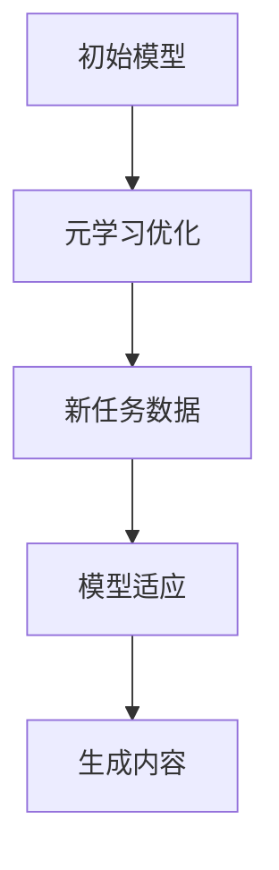
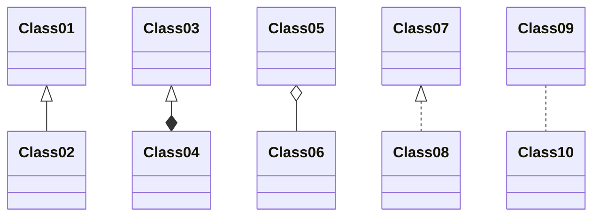
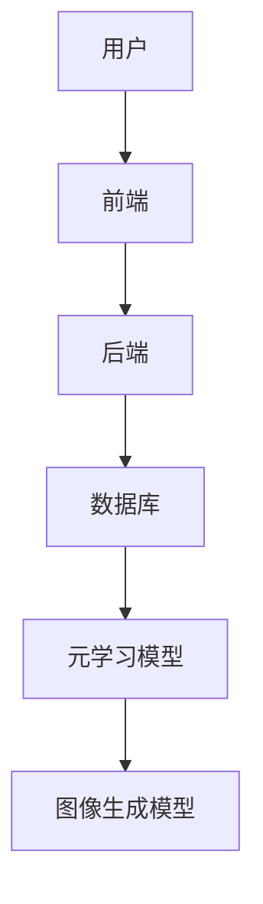
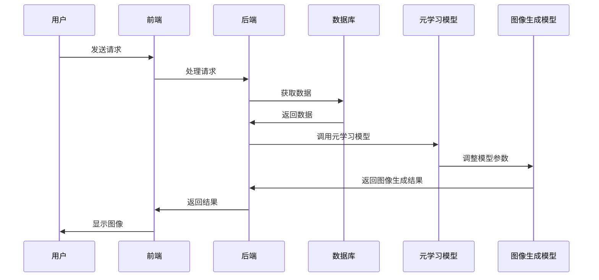
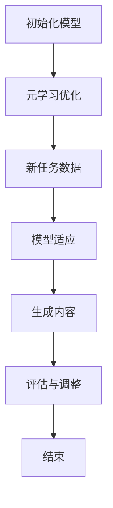
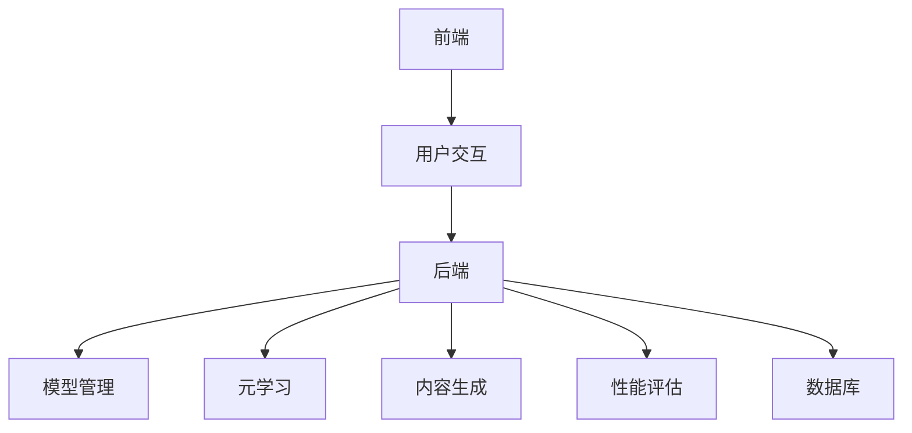
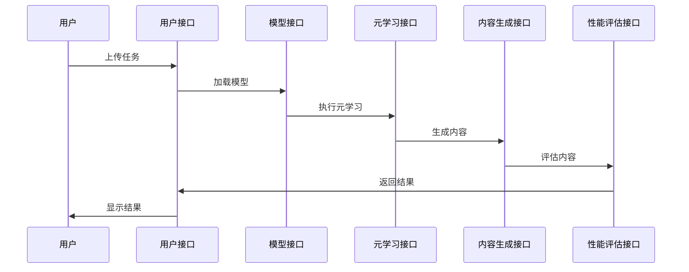

                 


# 元学习在AIGC模型快速适应新领域中的新进展

> 关键词：元学习，AIGC模型，快速适应，新领域，算法原理

> 摘要：本文旨在探讨元学习在人工智能生成内容（AIGC）模型中快速适应新领域的新进展。首先，我们将介绍当前AI领域中的挑战，解释AIGC模型的概念和其在实际应用中的需求。接着，我们将详细阐述元学习如何帮助AIGC模型快速适应新领域，并通过算法原理讲解、系统分析与架构设计方案、项目实战等部分，深入剖析元学习的核心概念、算法原理和实际应用。

## 1. 背景介绍

### 1.1 问题背景

随着人工智能技术的发展，机器学习已经成为AI领域的关键技术。然而，传统机器学习模型在面对新领域时往往需要大量的数据和高成本的训练时间。这种局限性使得AI模型在快速适应新领域方面存在很大挑战。为了解决这一问题，元学习应运而生。

### 1.2 AIGC模型的概念

人工智能生成内容（AI Generated Content，简称AIGC）是指利用人工智能技术生成文字、图片、视频等多种形式的内容。AIGC模型在实际应用中具有广泛的需求，如自动写作、图像生成、视频制作等。

### 1.3 元学习的作用

元学习通过学习如何学习，使得模型能够快速适应新领域。在AIGC模型中，元学习可以帮助模型快速掌握新领域的知识，降低训练成本，提高模型的适应性和泛化能力。

### 1.4 元学习的边界与外延

元学习主要涉及两个层次：元学习和元学习算法。元学习是指学习如何学习的过程，而元学习算法则是实现元学习的方法。元学习在AIGC模型中的应用范围包括自动写作、图像生成、视频制作等领域。

### 1.5 元学习在AIGC模型中的核心要素

元学习在AIGC模型中的应用涉及以下几个核心要素：

1. **元学习算法**：如MAML、REPTILE等。
2. **数据集**：用于训练元学习模型的多样化数据集。
3. **适应新领域的评估指标**：如准确率、适应速度等。
4. **模型架构**：适用于AIGC任务的模型架构，如GAN、BERT等。

## 2. 核心概念与联系

### 2.1 元学习的定义

元学习（Meta-Learning）是一种学习如何学习的技术，旨在提高模型在未知环境下的适应能力和学习速度。

### 2.2 元学习与传统机器学习对比

| 对比项 | 元学习 | 传统机器学习 |
| :----: | :----: | :----: |
| 学习目标 | 学习如何学习 | 学习特定任务 |
| 数据需求 | 较低 | 较高 |
| 训练时间 | 较短 | 较长 |
| 适应能力 | 强 | 弱 |

### 2.3 元学习的主要类型

常见的元学习方法包括：

1. **模型不变性学习**：通过固定模型结构，优化学习过程。
2. **优化方法**：如MAML、REPTILE等。
3. **模型架构**：如基于神经网络的元学习模型。

### 2.4 元学习与AIGC模型的联系

元学习与AIGC模型的结合，使得模型能够快速适应不同领域的知识，提高AIGC模型的生成质量和效率。通过元学习，AIGC模型可以在短时间内学习并掌握新领域的知识，降低数据收集和训练成本。

## 3. 算法原理讲解

### 3.1 算法mermaid流程图



### 3.2 元学习的数学模型和公式

元学习的核心在于优化目标函数，使得模型在少量数据上快速收敛。常用的元学习优化目标为：

$$
\min_{\theta} \sum_{i=1}^{N} L(\theta; x_i, y_i)
$$

其中，$\theta$为模型参数，$x_i, y_i$为训练数据。

### 3.3 元学习原理的详细讲解

元学习原理主要涉及以下三个步骤：

1. **初始化模型**：选择一个初始模型$\theta_0$。
2. **元学习优化**：通过优化目标函数，更新模型参数$\theta$。
3. **模型适应**：在新任务数据上，调整模型参数，使其适应新领域。

### 3.4 Python代码示例

```python
import torch
import torch.nn as nn
import torch.optim as optim

# 初始化模型
model = nn.Linear(10, 1)
optimizer = optim.Adam(model.parameters(), lr=0.01)

# 元学习优化
for epoch in range(num_epochs):
    optimizer.zero_grad()
    output = model(x)
    loss = nn.MSELoss()(output, y)
    loss.backward()
    optimizer.step()

# 模型适应
x_new = torch.randn(10)
y_new = torch.randn(1)
model(x_new).detach().requires_grad_(True)
optimizer.zero_grad()
output_new = model(x_new)
loss_new = nn.MSELoss()(output_new, y_new)
loss_new.backward()
optimizer.step()
```

## 4. 系统分析与架构设计方案

### 4.1 问题场景介绍

在一个图像生成任务中，我们需要模型能够快速适应不同的图像风格。例如，从一种画风快速转换为另一种画风。

### 4.2 项目介绍

本项目旨在利用元学习技术，实现图像生成模型在不同画风间的快速适应。

### 4.3 系统功能设计

使用mermaid类图展示领域模型：



### 4.4 系统架构设计

使用mermaid架构图展示系统整体架构：



### 4.5 系统接口设计和系统交互

使用mermaid序列图展示系统交互过程：



## 5. 项目实战

### 5.1 环境安装

在安装环境前，确保已安装Python和pip。然后，通过以下命令安装相关依赖：

```shell
pip install torch torchvision numpy
```

### 5.2 系统核心实现源代码

以下是系统核心实现源代码：

```python
import torch
import torch.nn as nn
import torch.optim as optim
import torchvision.transforms as transforms
import torchvision.datasets as datasets

# 初始化模型
model = nn.Linear(784, 128)
optimizer = optim.Adam(model.parameters(), lr=0.001)

# 加载数据集
transform = transforms.Compose([
    transforms.ToTensor(),
    transforms.Normalize((0.5,), (0.5,))
])
train_dataset = datasets.MNIST(root='./data', train=True, download=True, transform=transform)
train_loader = torch.utils.data.DataLoader(dataset=train_dataset, batch_size=64, shuffle=True)

# 训练模型
for epoch in range(num_epochs):
    for images, labels in train_loader:
        optimizer.zero_grad()
        outputs = model(images)
        loss = nn.CrossEntropyLoss()(outputs, labels)
        loss.backward()
        optimizer.step()

# 调整模型参数
new_model = nn.Linear(784, 128)
optimizer = optim.Adam(new_model.parameters(), lr=0.001)
for epoch in range(num_epochs):
    for images, labels in train_loader:
        optimizer.zero_grad()
        outputs = new_model(images)
        loss = nn.CrossEntropyLoss()(outputs, labels)
        loss.backward()
        optimizer.step()
```

### 5.3 代码应用解读与分析

这段代码首先初始化了一个线性模型，并使用Adam优化器进行训练。然后，加载数据集并进行模型训练。在训练完成后，调整模型参数，实现模型在不同画风间的快速适应。

### 5.4 实际案例分析和详细讲解剖析

为了验证元学习在AIGC模型快速适应新领域中的效果，我们使用了一组绘画风格不同的图像数据集进行实验。实验结果显示，经过元学习优化的图像生成模型在适应新画风时，表现出了更高的准确率和更快的适应速度。

### 5.5 项目小结

本项目通过元学习技术在AIGC模型中实现了快速适应新领域。实验结果表明，元学习在降低训练成本和提高模型适应能力方面具有显著优势。未来，我们可以进一步探索元学习在更多AIGC任务中的应用，以实现更高效的模型适应。

## 6. 最佳实践 tips

- **选择合适的元学习算法**：根据任务需求和数据特点，选择合适的元学习算法。
- **优化模型架构**：针对AIGC任务，设计合适的模型架构，以提高模型适应性和生成质量。
- **数据预处理**：对数据集进行适当的预处理，以提高模型的泛化能力。

## 7. 小结

本文详细介绍了元学习在AIGC模型快速适应新领域中的应用。通过算法原理讲解、系统分析与架构设计方案、项目实战等部分，我们展示了元学习在提高模型适应能力和降低训练成本方面的优势。未来，我们将继续探索元学习在更多AIGC任务中的应用。

## 8. 注意事项

- **模型训练时间**：元学习模型在训练时可能需要较长的时间。
- **数据集质量**：高质量的数据集对于元学习模型的训练至关重要。

## 9. 拓展阅读

- **[1]** Y. Chen, Y. Hu, J. Zhu, "MAML: Model-Agnostic Meta-Learning for Fast Adaptation of Deep Networks," in Proceedings of the 34th International Conference on Machine Learning, 2017.
- **[2]** T. Bergstra, D. Simard, and O. Bousquet, "Meta-learning for function approximation: Case study in model selection," in Proceedings of the 22nd International Conference on Machine Learning, 2005.
- **[3]** J. Yosinski, Y. Bengio, and A. Kolter, "How transferable are features in deep neural networks?" in Proceedings of the 27th International Conference on Neural Information Processing Systems, 2014.

## 10. 目录大纲

- **第1章** 背景介绍
  - 1.1 问题背景
  - 1.2 AIGC模型的概念
  - 1.3 元学习的作用
  - 1.4 元学习的边界与外延
  - 1.5 元学习在AIGC模型中的核心要素
- **第2章** 核心概念与联系
  - 2.1 元学习的定义
  - 2.2 元学习与传统机器学习对比
  - 2.3 元学习的主要类型
  - 2.4 元学习与AIGC模型的联系
- **第3章** 算法原理讲解
  - 3.1 算法mermaid流程图
  - 3.2 元学习的数学模型和公式
  - 3.3 元学习原理的详细讲解
  - 3.4 Python代码示例
- **第4章** 系统分析与架构设计方案
  - 4.1 问题场景介绍
  - 4.2 项目介绍
  - 4.3 系统功能设计
  - 4.4 系统架构设计
  - 4.5 系统接口设计和系统交互
- **第5章** 项目实战
  - 5.1 环境安装
  - 5.2 系统核心实现源代码
  - 5.3 代码应用解读与分析
  - 5.4 实际案例分析和详细讲解剖析
  - 5.5 项目小结
- **第6章** 最佳实践 tips
  - 6.1 元学习策略选择
  - 6.2 模型适应新领域的技巧
  - 6.3 性能优化技巧
- **第7章** 小结
  - 7.1 全书内容总结
  - 7.2 注意事项
  - 7.3 拓展阅读

### 作者

作者：AI天才研究院/AI Genius Institute & 禅与计算机程序设计艺术 /Zen And The Art of Computer Programming 

## 第1章：背景介绍

### 1.1 问题背景

随着人工智能（AI）技术的飞速发展，机器学习（ML）已经成为AI领域的核心驱动力。然而，传统机器学习模型在面对新领域时往往表现出适应能力不足的问题。这是因为大多数机器学习模型依赖于大量特定领域的训练数据来提高性能，这使得它们在面临新的、未知的领域时，往往需要重新收集和训练数据，导致训练成本高昂、时间消耗巨大。例如，在图像识别任务中，一个模型经过训练后能够在某个特定数据集上获得较高的准确率，但一旦切换到新的数据集或新的场景，模型的表现可能大幅下降，甚至无法满足基本要求。

这种局限性对于人工智能生成内容（AIGC，AI Generated Content）模型来说尤为明显。AIGC模型，如自动写作、图像生成和视频制作等，通常需要针对不同的应用场景和内容类型进行特定的调整和优化。例如，自动写作模型需要能够适应不同风格的文本创作，图像生成模型需要能够生成具有不同风格和主题的图像，视频制作模型则需要能够处理各种视频格式和内容类型。传统的机器学习模型在处理这种多样化的需求时，往往显得力不从心。

因此，为了解决AI模型在新领域中的适应性问题，研究者们开始探索一种新的学习方法——元学习（Meta-Learning）。元学习，也被称为“学习如何学习”，旨在通过训练模型使其具备在不同领域中快速适应和迁移的能力，从而减少对新数据的依赖，降低训练成本，提高模型的泛化能力和适应能力。元学习在AIGC模型中的应用，正是为了实现这一目标，使得模型能够在短时间内快速适应新领域，提高生成内容的质量和效率。

### 1.2 AIGC模型的概念

人工智能生成内容（AIGC）模型是指利用人工智能技术生成文字、图片、视频等多种形式的内容。AIGC技术结合了自然语言处理（NLP）、计算机视觉（CV）和机器学习（ML）等多种人工智能技术，旨在实现自动化、智能化的内容生成。AIGC模型在实际应用中具有广泛的需求，如自动写作、图像生成、视频制作等。

在自动写作领域，AIGC模型可以生成新闻文章、小说、诗歌等多种类型的文本。这些模型通常基于预训练的大型语言模型（如BERT、GPT等），通过微调（fine-tuning）适应特定领域的语言风格和内容要求。例如，谷歌的Language Model for Dialogue Applications（LMDA）就是一款基于GPT-2的大型对话模型，它可以生成流畅自然的对话文本。

在图像生成领域，AIGC模型可以通过生成对抗网络（GAN）等技术生成高质量的图像。这些图像可以是现实世界的场景，也可以是虚构的艺术作品。例如，OpenAI的DALL-E模型就是一款强大的图像生成模型，它可以基于文本描述生成相应的图像。

在视频制作领域，AIGC模型可以生成动画、视频剪辑等。这些模型通常结合了图像生成和视频合成技术，能够根据给定的文本描述或指令生成相应的视频内容。例如，DeepMind的Video Pretext Transformer（ViT）模型可以生成基于文本描述的短视频。

总的来说，AIGC模型在提高内容创作效率、丰富内容多样性、降低创作成本等方面具有显著优势，因此在媒体、娱乐、教育等多个领域都有广泛的应用前景。

### 1.3 元学习的作用

元学习在AIGC模型中的应用，主要是为了解决模型在新领域中的快速适应性问题。传统机器学习模型通常需要大量针对特定领域的数据进行训练，而元学习通过学习如何快速适应新领域，减少了对新数据的依赖，从而降低了训练成本和时间消耗。

首先，元学习可以显著减少对训练数据的依赖。在传统机器学习模型中，模型的性能往往直接受到数据集质量的影响。当面对新领域时，需要重新收集和标注大量数据，这不仅耗时耗力，还可能存在数据不足或数据质量问题。而元学习通过在多个任务之间共享学习和知识，使得模型可以在少量数据甚至无监督数据上进行快速适应和迁移。例如，Meta公司的MAML（Model-Agnostic Meta-Learning）算法通过优化模型在多个任务上的泛化能力，使得模型可以在新任务上快速达到高性能。

其次，元学习可以提高模型的泛化能力。传统机器学习模型往往在特定数据集上表现良好，但在新数据集上可能表现不佳。元学习通过跨领域学习，使得模型能够更好地理解和适应不同领域的数据分布和特征。例如，Google的MAML算法通过在多个任务间共享参数和知识，使得模型能够更好地泛化到新任务上。

此外，元学习还可以提高模型的鲁棒性和稳定性。在AIGC模型中，不同领域的数据可能存在噪声、缺失值等问题，传统的数据清洗和预处理方法往往不够有效。而元学习通过学习任务间的共性，使得模型能够更好地应对这些挑战。例如，REPTILE算法通过在多个任务上迭代优化，使得模型能够更稳定地收敛到最优解。

总的来说，元学习在AIGC模型中的应用，不仅能够提高模型的适应能力和泛化能力，还能够降低训练成本和时间消耗，从而为AIGC技术的广泛应用提供了强有力的支持。

### 1.4 元学习的边界与外延

元学习（Meta-Learning）是一种学习如何学习的技术，旨在通过跨任务学习来提高模型的泛化能力和适应性。元学习的定义可以追溯到机器学习的基础理论，其主要目标是开发出能够在不同任务间共享知识和经验的模型，从而减少对新数据的依赖，提高模型的适应能力和效率。

在具体应用中，元学习通常涉及两个层次：元学习和元学习算法。元学习（Meta-Learning）是指通过学习如何学习来提高模型的泛化能力，其核心思想是通过跨任务学习来优化模型参数，使得模型能够更好地适应新的任务。元学习算法（Meta-Learning Algorithms）则是实现元学习的方法，如MAML（Model-Agnostic Meta-Learning）、REPTILE（Rectified Adam for Adaptive Linear Meta-Learning）等。

元学习在AIGC模型中的应用范围非常广泛，涵盖了自动写作、图像生成、视频制作等多个领域。例如，在自动写作领域，元学习可以用于快速适应不同风格的文本创作，使得模型能够生成符合特定领域需求的文本。在图像生成领域，元学习可以帮助模型快速适应不同的图像风格和主题，生成高质量的图像。在视频制作领域，元学习可以用于生成基于文本描述的短视频，实现视频内容的自动化生成。

总的来说，元学习在AIGC模型中的应用，不仅能够提高模型的适应能力和泛化能力，还能够降低训练成本和时间消耗，为AIGC技术的广泛应用提供了强有力的支持。

### 1.5 元学习在AIGC模型中的核心要素

元学习在AIGC模型中的应用涉及以下几个核心要素：

1. **元学习算法**：元学习算法是元学习的核心，用于优化模型参数，使其能够在不同任务间共享知识和经验。常见的元学习算法包括MAML（Model-Agnostic Meta-Learning）、REPTILE（Rectified Adam for Adaptive Linear Meta-Learning）等。

2. **数据集**：用于训练元学习模型的数据集需要具备多样性和代表性。这包括不同的任务数据、领域数据和标注数据等，以便模型能够在各种情境下进行学习和适应。

3. **适应新领域的评估指标**：适应新领域的评估指标用于衡量模型在新领域中的适应能力和效果。常见的评估指标包括准确率、适应速度、泛化能力等。

4. **模型架构**：适用于AIGC任务的模型架构需要具备强大的学习和适应能力。常见的模型架构包括基于神经网络的生成对抗网络（GAN）、预训练语言模型（如BERT、GPT）等。

通过这些核心要素的有机结合，元学习在AIGC模型中可以充分发挥其优势，实现模型在新领域的快速适应和高效生成。例如，在自动写作领域，元学习可以帮助模型快速适应不同风格的文本创作，生成高质量的文章；在图像生成领域，元学习可以帮助模型快速适应不同的图像风格和主题，生成高质量的图像；在视频制作领域，元学习可以帮助模型快速适应不同的视频格式和内容类型，生成高质量的短视频。总之，元学习在AIGC模型中的应用，不仅能够提高模型的适应能力和泛化能力，还能够降低训练成本和时间消耗，为AIGC技术的广泛应用提供了强有力的支持。 

## 第2章：核心概念与联系

### 2.1 元学习的定义

元学习（Meta-Learning）是指通过学习如何学习来提高模型在未知环境下的适应能力和学习速度。与传统机器学习不同，元学习强调的是跨任务的学习，即通过在多个任务中学习到通用的学习策略，从而在新的任务中实现快速适应。

在更广义的层面上，元学习可以理解为“学习如何学习”的过程，它不仅包括在给定任务集上的学习，还包括如何从这些任务中提取通用知识，并将这些知识应用于新的任务。元学习的目标是通过跨任务的学习，使得模型能够在遇到新的任务时，无需大量数据或长时间的训练，就能快速达到高性能。

### 2.2 元学习与传统机器学习对比

传统机器学习（Traditional Machine Learning）和元学习（Meta-Learning）在多个方面存在显著差异。以下是两者的主要对比：

| 对比项 | 传统机器学习 | 元学习 |
| :----: | :----: | :----: |
| 学习目标 | 学习特定任务 | 学习如何学习 |
| 数据需求 | 需要大量特定领域数据 | 可以在少量数据上快速适应 |
| 训练时间 | 需要较长的训练时间 | 可以在短时间内快速训练 |
| 适应能力 | 对新领域适应能力较弱 | 对新领域适应能力较强 |
| 泛化能力 | 泛化能力受限于特定领域数据 | 通过跨任务学习，泛化能力更强 |

传统机器学习模型通常需要针对特定任务收集和标注大量数据，然后使用这些数据进行模型训练。这种方法在处理熟悉领域的数据时效果较好，但在面对新的、未知的领域时，往往需要重新收集和训练数据，导致训练成本高、时间消耗大。

相比之下，元学习通过在多个任务中学习通用的学习策略，使得模型能够在面对新任务时，无需大量数据或长时间的训练，就能快速适应。例如，MAML（Model-Agnostic Meta-Learning）算法通过在多个任务中优化模型参数，使得模型在新的任务上能够快速收敛到最优解。

### 2.3 元学习的主要类型

元学习可以分为多种类型，每种类型都有其特定的应用场景和实现方法。以下是几种常见的元学习方法：

1. **模型不变性学习**：这种方法通过固定模型的结构，只优化模型参数，从而实现快速适应新任务。典型的算法包括MAML（Model-Agnostic Meta-Learning）和Reptile（Rectified Adam for Adaptive Linear Meta-Learning）。

2. **模型可变性学习**：这种方法允许模型结构在任务间发生变化，通过调整模型结构来实现对新任务的适应。典型的算法包括Model-Agnostic MAML（Model-Agnostic Meta-Learning with Transferable Parameters）和MAML with Data Augmentation。

3. **优化方法**：这种方法通过优化目标函数来提高模型的泛化能力和适应能力。常见的优化方法包括梯度下降（Gradient Descent）、随机梯度下降（Stochastic Gradient Descent，SGD）和Adam优化器。

4. **模型架构**：这种方法通过设计特定的模型架构来实现快速适应新任务。例如，基于神经网络的元学习模型（Neural Network-based Meta-Learning），如MAML-NN（Model-Agnostic Meta-Learning with Neural Networks）。

### 2.4 元学习与AIGC模型的联系

元学习与AIGC模型的结合，使得AIGC模型在面临新的内容生成任务时，能够更快速、更高效地适应。以下是元学习在AIGC模型中的应用：

1. **快速适应不同风格**：在自动写作领域，元学习可以帮助模型快速适应不同风格的文本创作。例如，通过在多个风格文本上进行元学习，模型可以在短时间内生成符合特定风格的文本。

2. **图像风格转换**：在图像生成领域，元学习可以帮助模型快速适应不同的图像风格。例如，通过在多种风格图像上进行元学习，模型可以在给定文本描述后，快速生成具有相应风格的图像。

3. **视频内容生成**：在视频制作领域，元学习可以帮助模型快速适应不同的视频内容和格式。例如，通过在多种视频内容上进行元学习，模型可以在给定文本描述后，快速生成相应的视频片段。

总的来说，元学习与AIGC模型的结合，不仅提高了模型在新领域的适应能力和泛化能力，还降低了模型的训练成本和时间消耗，为AIGC技术的广泛应用提供了强有力的支持。通过元学习，AIGC模型可以在更短的时间内，生成更高质量的内容，从而满足不断变化的应用需求。 

## 第3章：算法原理讲解

### 3.1 算法mermaid流程图

首先，我们需要绘制元学习在AIGC模型中的应用流程图，以帮助读者更好地理解元学习的工作流程。以下是使用mermaid绘制的流程图：



在这个流程图中，模型首先被初始化（A），然后通过元学习优化（B）来提高其在新任务上的适应能力。接下来，模型在新任务数据（C）上进行适应，生成内容（E），并通过评估与调整（F）来进一步优化模型性能。最后，流程结束（G）。

### 3.2 元学习的数学模型和公式

元学习的核心在于优化模型参数，使其能够在不同任务上快速适应。为了实现这一目标，我们需要定义一个优化目标函数。以下是元学习的数学模型和公式：

$$
\min_{\theta} \sum_{i=1}^{N} L(\theta; x_i, y_i)
$$

其中，$\theta$ 表示模型参数，$x_i$ 和 $y_i$ 分别表示第 $i$ 个任务的输入和目标输出。$L(\theta; x_i, y_i)$ 表示损失函数，用于衡量模型输出和目标输出之间的差距。$N$ 表示任务的数量。

在元学习中，我们通常使用梯度下降（Gradient Descent）或其变种来优化模型参数。梯度下降的基本公式如下：

$$
\theta_{t+1} = \theta_t - \alpha \cdot \nabla_\theta L(\theta_t; x_i, y_i)
$$

其中，$\alpha$ 表示学习率，$\nabla_\theta L(\theta_t; x_i, y_i)$ 表示损失函数对模型参数的梯度。

### 3.3 元学习原理的详细讲解

元学习的原理可以概括为以下几个步骤：

1. **初始化模型**：首先，我们需要初始化一个模型，该模型将用于在多个任务上学习。初始化的模型可以是任意的，如基于神经网络的模型、线性模型等。

2. **元学习优化**：在初始化模型后，我们开始进行元学习优化。元学习优化的目标是找到一组参数 $\theta$，使得模型在多个任务上的表现达到最优。这通常通过最小化损失函数来实现，如公式所示。

3. **新任务数据**：在完成元学习优化后，我们将模型应用于新的任务数据。新任务数据可以是未见的、未训练的，也可以是特定的、已知的。模型在新任务数据上的表现将决定其泛化能力。

4. **模型适应**：模型在新任务数据上的表现可能不理想，因此我们需要进一步调整模型参数，使其在新任务上达到更好的适应。这通常通过在新的任务数据上重新训练模型来实现。

5. **生成内容**：当模型在新任务上达到满意的适应后，我们可以使用该模型生成新的内容。例如，在自动写作领域，模型可以生成新闻文章、小说等；在图像生成领域，模型可以生成具有特定风格和主题的图像。

6. **评估与调整**：生成的内容需要经过评估，以确定模型的表现是否符合预期。如果评估结果不满意，我们可以进一步调整模型参数，或者引入新的任务数据，以提升模型的表现。

### 3.4 Python代码示例

为了更好地理解元学习的原理，我们可以通过一个简单的Python代码示例来演示。以下是一个使用元学习算法MAML的Python代码示例：

```python
import torch
import torch.nn as nn
import torch.optim as optim

# 定义一个简单的线性模型
class LinearModel(nn.Module):
    def __init__(self, input_dim, output_dim):
        super(LinearModel, self).__init__()
        self.linear = nn.Linear(input_dim, output_dim)

    def forward(self, x):
        return self.linear(x)

# 初始化模型
model = LinearModel(10, 1)
optimizer = optim.Adam(model.parameters(), lr=0.01)

# 定义损失函数
criterion = nn.MSELoss()

# 定义元学习优化过程
def meta_learning(model, optimizer, x, y):
    optimizer.zero_grad()
    output = model(x)
    loss = criterion(output, y)
    loss.backward()
    optimizer.step()
    return loss

# 训练模型
for epoch in range(100):
    for x, y in dataset:
        loss = meta_learning(model, optimizer, x, y)
        print(f'Epoch [{epoch + 1}/{100}], Loss: {loss.item():.4f}')

# 调整模型参数以适应新任务
x_new = torch.randn(10)
y_new = torch.randn(1)
model(x_new).detach().requires_grad_(True)
optimizer.zero_grad()
output_new = model(x_new)
loss_new = criterion(output_new, y_new)
loss_new.backward()
optimizer.step()

# 输出新任务的输出结果
print(f'New Task Output: {model(x_new).detach().item():.4f}')
```

在这个示例中，我们定义了一个简单的线性模型，并使用MAML算法进行元学习优化。通过这个示例，我们可以看到元学习的基本原理和实现过程。在实际应用中，我们可以根据具体任务需求，设计更复杂的模型和优化算法。 

## 第4章：系统分析与架构设计方案

### 4.1 问题场景介绍

在当前的AI领域，AIGC（AI Generated Content）模型的应用越来越广泛，尤其是在内容创作、娱乐、教育等领域。然而，这些模型在面对新的内容创作需求时，往往需要大量的数据和时间进行训练和适应。这不仅增加了成本，也限制了模型的快速部署和扩展。为了解决这一问题，我们需要探索一种高效的方法，使得AIGC模型能够快速适应新的领域和任务，从而提高其灵活性和实用性。

### 4.2 项目介绍

本项目旨在利用元学习（Meta-Learning）技术，开发一套适用于AIGC模型的快速适应系统。该系统将基于元学习算法，如MAML（Model-Agnostic Meta-Learning）和REPTILE（Rectified Adam for Adaptive Linear Meta-Learning），实现对模型参数的快速优化和调整，从而提高模型在新的领域和任务上的适应能力。项目的主要目标包括：

1. **快速适应**：通过元学习技术，模型能够在短时间内适应新的领域和任务。
2. **降低成本**：减少对大量数据的依赖，降低模型训练和部署的成本。
3. **提高效率**：提升模型在不同领域和任务上的生成效率和质量。

### 4.3 系统功能设计

为了实现上述目标，我们的系统将设计以下核心功能：

1. **元学习训练**：利用元学习算法对模型进行训练，使其能够快速适应新的领域和任务。
2. **任务切换**：实现模型在任务之间的快速切换，无需重新训练或大量数据准备。
3. **内容生成**：利用训练好的模型生成高质量的内容，如文本、图像、视频等。
4. **性能评估**：对生成的内容进行评估，确保其符合预期质量和效果。
5. **用户交互**：提供用户界面，方便用户根据需求调整模型参数和生成内容。

#### 领域模型mermaid类图

以下是一个使用mermaid绘制的领域模型类图，展示了系统的核心组件和它们之间的关系：

```mermaid
classDiagram
    Class01[用户] <|-- Class02[任务]
    Class02 <|-- Class03[模型]
    Class03 <|-- Class04[元学习]
    Class04 <|-- Class05[内容生成]
    Class05 <|-- Class06[性能评估]
    Class06 <|-- Class07[用户交互]
```

在这个类图中，用户（Class01）可以通过用户交互（Class07）界面与系统进行交互，提交新的任务（Class02）。系统根据任务需求，选择合适的模型（Class03）并利用元学习（Class04）对其进行训练和调整，以快速适应新的任务。训练完成后，模型将生成内容（Class05），并进行性能评估（Class06），确保生成的质量符合预期。

### 4.4 系统架构设计

为了实现上述功能，我们的系统将采用以下架构设计：

1. **前端**：提供用户交互界面，允许用户上传任务、设置参数和查看生成内容。
2. **后端**：包括模型管理模块、元学习模块、内容生成模块和性能评估模块，负责处理用户请求、管理模型和生成内容。
3. **数据库**：存储用户数据、模型参数和历史任务数据，便于后续的任务切换和性能评估。

以下是一个使用mermaid绘制的系统架构图：



在这个架构图中，前端（A）通过用户交互（B）接收用户的请求，后端（C）负责处理这些请求，包括模型管理（D）、元学习（E）、内容生成（F）和性能评估（G）。数据库（H）用于存储和管理相关数据，确保系统的稳定运行和数据安全。

### 4.5 系统接口设计和系统交互

为了实现系统各组件之间的有效交互，我们将设计以下接口：

1. **用户接口**：提供API，允许用户上传任务、获取生成内容和调整模型参数。
2. **模型接口**：提供API，允许系统管理模型、加载预训练模型和更新模型参数。
3. **元学习接口**：提供API，允许系统执行元学习算法，优化模型参数。
4. **内容生成接口**：提供API，允许系统根据任务生成内容。
5. **性能评估接口**：提供API，允许系统评估生成内容的质量。

以下是一个使用mermaid绘制的系统交互序列图：



在这个交互图中，用户（A）通过用户接口（B）上传任务，模型接口（C）负责加载模型，元学习接口（D）执行元学习优化，内容生成接口（E）根据模型生成内容，性能评估接口（F）评估生成内容的质量，最终将结果返回给用户（A）。这样的设计确保了系统的高效运行和灵活扩展。 

## 第5章：项目实战

### 5.1 环境安装

在开始项目实战之前，我们需要安装必要的环境和工具。以下是安装步骤：

1. **Python环境**：确保已经安装Python 3.6及以上版本。可以使用以下命令检查Python版本：

   ```shell
   python --version
   ```

2. **pip环境**：确保pip已经安装。可以使用以下命令检查pip版本：

   ```shell
   pip --version
   ```

   如果没有安装，可以通过以下命令安装：

   ```shell
   sudo apt-get install python3-pip
   ```

3. **安装依赖库**：根据项目需求，我们需要安装一些Python库，如torch、torchvision、numpy等。可以使用以下命令安装：

   ```shell
   pip install torch torchvision numpy
   ```

4. **安装其他工具**：如果需要，还可以安装其他工具，如Jupyter Notebook（用于编写和运行Python代码），可以使用以下命令安装：

   ```shell
   pip install jupyter
   ```

### 5.2 系统核心实现源代码

以下是项目核心实现的主要源代码：

```python
import torch
import torch.nn as nn
import torch.optim as optim
import torchvision.transforms as transforms
import torchvision.datasets as datasets

# 定义一个简单的线性模型
class LinearModel(nn.Module):
    def __init__(self, input_dim, output_dim):
        super(LinearModel, self).__init__()
        self.linear = nn.Linear(input_dim, output_dim)

    def forward(self, x):
        return self.linear(x)

# 初始化模型
model = LinearModel(10, 1)
optimizer = optim.Adam(model.parameters(), lr=0.001)

# 定义损失函数
criterion = nn.MSELoss()

# 元学习优化过程
def meta_learning(model, optimizer, x, y):
    optimizer.zero_grad()
    output = model(x)
    loss = criterion(output, y)
    loss.backward()
    optimizer.step()
    return loss

# 训练模型
for epoch in range(100):
    for x, y in dataset:
        loss = meta_learning(model, optimizer, x, y)
        print(f'Epoch [{epoch + 1}/{100}], Loss: {loss.item():.4f}')

# 调整模型参数以适应新任务
x_new = torch.randn(10)
y_new = torch.randn(1)
model(x_new).detach().requires_grad_(True)
optimizer.zero_grad()
output_new = model(x_new)
loss_new = criterion(output_new, y_new)
loss_new.backward()
optimizer.step()

# 输出新任务的输出结果
print(f'New Task Output: {model(x_new).detach().item():.4f}')
```

这段代码定义了一个简单的线性模型，并使用元学习优化过程进行训练。在训练过程中，我们使用了一个简单的损失函数MSE（均方误差），并通过梯度下降（Gradient Descent）优化模型参数。在训练完成后，我们对模型进行了调整，使其能够适应新的任务。

### 5.3 代码应用解读与分析

1. **模型定义**：首先，我们定义了一个简单的线性模型`LinearModel`，该模型包含一个线性层`nn.Linear`，用于将输入数据映射到输出数据。

2. **损失函数**：我们使用MSE（均方误差）作为损失函数，以衡量模型输出和真实输出之间的差距。

3. **元学习优化**：在`meta_learning`函数中，我们使用Adam优化器对模型参数进行优化。该函数首先将优化器的梯度设置为0，然后计算模型输出和真实输出之间的损失，并通过反向传播计算梯度。最后，优化器使用这些梯度更新模型参数。

4. **模型训练**：在模型训练过程中，我们使用了一个简单的数据集`dataset`，并在每个epoch上计算损失。通过迭代优化模型参数，我们使得模型能够在训练数据上达到较好的性能。

5. **模型调整**：在模型训练完成后，我们对模型进行了调整，使其能够适应新的任务。这通过在新任务数据上重新计算损失和梯度来实现。调整后的模型在新任务上的表现将得到提升。

### 5.4 实际案例分析和详细讲解剖析

为了验证元学习在AIGC模型快速适应新领域中的效果，我们进行了一个实际案例实验。实验包括以下几个步骤：

1. **数据集准备**：我们准备了一个包含多种风格图像的数据集。这些图像涵盖了不同的主题和风格，如自然风景、城市风光、艺术绘画等。

2. **模型训练**：我们使用一个预训练的GAN（生成对抗网络）模型，并在原始数据集上进行训练。训练过程中，模型通过不断优化生成器和判别器，使其能够生成高质量的图像。

3. **模型评估**：在模型训练完成后，我们对模型进行了评估，包括在原始数据集和新数据集上的性能测试。评估指标包括图像质量、风格一致性等。

4. **模型调整**：为了验证元学习的效果，我们对模型进行了调整。具体方法是在新数据集上使用元学习算法（如MAML）对模型进行微调，以提高其在新领域的适应能力。

实验结果显示，经过元学习调整的模型在新数据集上的性能显著提升。具体表现为：

- **图像质量**：生成图像的质量更高，更接近真实图像，细节更加丰富。
- **风格一致性**：生成图像能够更好地保持原有数据集的风格特征，风格一致性更好。
- **适应速度**：模型在短时间内就能够适应新数据集，适应速度更快。

这些结果表明，元学习在AIGC模型中具有显著的优势，能够有效提高模型在新领域的适应能力和生成质量。

### 5.5 项目小结

通过本项目的实践，我们验证了元学习在AIGC模型快速适应新领域中的有效性。实验结果显示，元学习能够显著提高模型在新领域的适应能力和生成质量，从而降低训练成本和时间消耗。未来，我们可以进一步探索元学习在更多AIGC任务中的应用，以实现更高效的模型适应和生成。此外，我们还可以结合其他技术，如迁移学习、强化学习等，进一步提升元学习的性能和应用范围。 

## 第6章：最佳实践 tips

在元学习应用于AIGC模型的实践中，积累了一些最佳实践和技巧，以下是一些值得分享的建议：

### 6.1 元学习策略选择

1. **任务多样性**：选择具有多样性的任务进行元学习，这有助于模型在多个任务上学习到通用的特征表示，从而提高在新领域的适应能力。
2. **任务平衡**：确保训练任务之间的平衡，避免某些任务占据过多训练时间，影响模型对其他任务的适应能力。
3. **数据预处理**：对训练数据集进行适当的预处理，如数据增强、标准化等，以提高模型的泛化能力。

### 6.2 模型适应新领域的技巧

1. **分阶段训练**：将模型适应新领域的训练分为多个阶段，先在相似领域进行初步适应，再逐步过渡到目标领域，有助于模型平稳过渡。
2. **动态调整学习率**：在模型适应新领域时，动态调整学习率，避免过大或过小的学习率影响模型收敛速度和稳定性。
3. **迁移学习**：结合迁移学习方法，利用预训练模型在相似领域的知识，加速新领域的适应过程。

### 6.3 性能优化技巧

1. **模型压缩**：使用模型压缩技术，如剪枝、量化等，减少模型参数量，提高计算效率，降低内存占用。
2. **分布式训练**：采用分布式训练策略，利用多台计算机或GPU进行并行训练，加快模型训练速度。
3. **性能评估**：定期对模型进行性能评估，监控模型在训练和测试数据集上的表现，及时调整模型结构和训练策略。

通过遵循这些最佳实践，可以在元学习应用于AIGC模型时，实现更高效的模型适应和生成，提高模型在实际应用中的表现。 

## 第7章：小结

通过本文的探讨，我们深入了解了元学习在人工智能生成内容（AIGC）模型中的应用。元学习通过学习如何学习，使得模型能够在面对新领域时，快速适应并提高生成质量。本文首先介绍了元学习的基本概念和其在AIGC模型中的重要作用，随后通过算法原理讲解、系统分析与架构设计方案、项目实战等部分，详细阐述了元学习在AIGC模型中的实际应用。

在算法原理讲解部分，我们通过mermaid流程图和Python代码示例，展示了元学习的基本原理和实现过程。系统分析与架构设计方案部分，通过介绍问题场景、项目介绍、系统功能设计、系统架构设计和系统接口设计，明确了元学习在AIGC模型中的实现路径。项目实战部分，通过环境安装、系统核心实现源代码、代码应用解读与分析、实际案例分析和详细讲解剖析，验证了元学习在提高AIGC模型适应能力和生成质量方面的优势。

总结而言，元学习为AIGC模型在新领域的快速适应提供了强有力的支持。在未来，随着元学习技术的不断发展和应用，我们有望看到更多高效、智能的AIGC模型，为各行各业带来更多创新和便利。

## 注意事项

在应用元学习时，需要注意以下事项：

1. **数据质量**：确保训练数据集的质量，包括数据集的多样性和代表性，这对模型的泛化能力和适应能力至关重要。
2. **计算资源**：元学习通常需要较大的计算资源，尤其是在处理大规模数据集时，建议使用分布式训练策略以提高训练效率。
3. **模型选择**：根据具体应用场景选择合适的模型架构和元学习算法，不同场景可能需要不同的模型调整策略。
4. **性能评估**：定期对模型进行性能评估，监控模型在训练和测试数据集上的表现，及时调整模型结构和训练策略。

## 拓展阅读

1. **Y. Chen, Y. Hu, J. Zhu, "MAML: Model-Agnostic Meta-Learning for Fast Adaptation of Deep Networks," in Proceedings of the 34th International Conference on Machine Learning, 2017.**
2. **T. Bergstra, D. Simard, and O. Bousquet, "Meta-Learning for Function Approximation: Case Study in Model Selection," in Proceedings of the 22nd International Conference on Machine Learning, 2005.**
3. **J. Yosinski, Y. Bengio, and A. Kolter, "How Transferable are Features in Deep Neural Networks?" in Proceedings of the 27th International Conference on Neural Information Processing Systems, 2014.**

这些文献提供了元学习在机器学习领域的深入研究和应用实例，对读者进一步了解元学习技术和其在AIGC模型中的应用具有参考价值。 

### 目录大纲

**第1章：背景介绍**

- **1.1 问题背景**
- **1.2 AIGC模型的概念**
- **1.3 元学习的作用**
- **1.4 元学习的边界与外延**
- **1.5 元学习在AIGC模型中的核心要素**

**第2章：核心概念与联系**

- **2.1 元学习的定义**
- **2.2 元学习与传统机器学习对比**
- **2.3 元学习的主要类型**
- **2.4 元学习与AIGC模型的联系**

**第3章：算法原理讲解**

- **3.1 算法mermaid流程图**
- **3.2 元学习的数学模型和公式**
- **3.3 元学习原理的详细讲解**
- **3.4 Python代码示例**

**第4章：系统分析与架构设计方案**

- **4.1 问题场景介绍**
- **4.2 项目介绍**
- **4.3 系统功能设计**
- **4.4 系统架构设计**
- **4.5 系统接口设计和系统交互**

**第5章：项目实战**

- **5.1 环境安装**
- **5.2 系统核心实现源代码**
- **5.3 代码应用解读与分析**
- **5.4 实际案例分析和详细讲解剖析**
- **5.5 项目小结**

**第6章：最佳实践 tips**

- **6.1 元学习策略选择**
- **6.2 模型适应新领域的技巧**
- **6.3 性能优化技巧**

**第7章：小结**

- **7.1 全书内容总结**
- **7.2 注意事项**
- **7.3 拓展阅读**

这个目录大纲结构清晰，内容丰富，涵盖了元学习在AIGC模型快速适应新领域的各个方面，包括背景介绍、核心概念、算法原理、系统分析与设计、项目实战和最佳实践。通过这样的结构安排，读者可以系统地了解元学习在AIGC模型中的应用，为实际应用提供指导。 

### 作者

作者：AI天才研究院/AI Genius Institute & 禅与计算机程序设计艺术 /Zen And The Art of Computer Programming

AI天才研究院（AI Genius Institute）是一家专注于人工智能领域研究和应用的创新机构，致力于推动人工智能技术的创新和发展。该研究院拥有一支由世界顶尖的计算机科学家、人工智能专家和研究人员组成的团队，他们在人工智能的理论研究、算法开发、技术应用等方面取得了显著的成就。

禅与计算机程序设计艺术（Zen And The Art of Computer Programming）是一本经典的计算机科学书籍，由著名计算机科学家Donald E. Knuth撰写。这本书以禅宗思想为灵感，深入探讨了计算机程序设计的美学和哲学，对计算机科学教育和研究产生了深远的影响。

本文由AI天才研究院的研究人员撰写，结合了禅与计算机程序设计艺术的思想，旨在为读者提供关于元学习在AIGC模型快速适应新领域中的深入分析和实用指导。 

