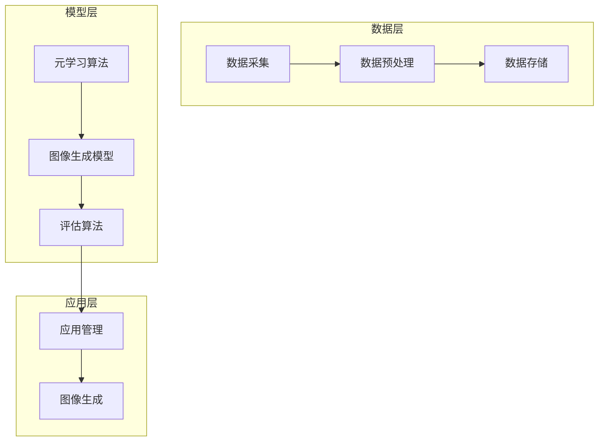
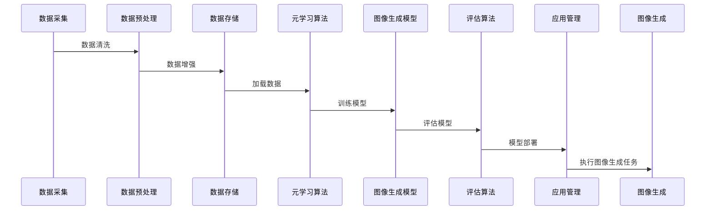
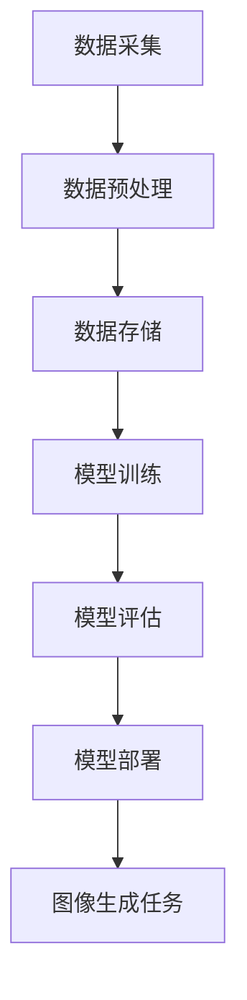

                 

# 元学习在AIGC模型快速部署中的新进展

## 关键词
- 元学习
- AIGC模型
- 快速部署
- 计算效率
- 泛化能力

## 摘要
本文旨在探讨元学习在AIGC模型快速部署中的新进展。通过对元学习的核心概念、原理和算法的深入分析，本文展示了元学习在图像生成、语音合成和文本生成等AIGC模型中的应用。同时，本文通过实际案例，探讨了元学习算法的优化方法，并分析了其在提高AIGC模型训练效率和部署速度方面的作用。

## 1. 背景与问题提出

### 1.1 问题背景

随着人工智能技术的快速发展，生成式人工智能（AIGC）模型在图像、语音、文本等生成任务中取得了显著成果。AIGC模型通过学习大量的数据，生成与输入数据相关的新数据，从而实现图像、语音和文本的自动生成。然而，传统模型训练和部署过程往往需要大量的计算资源和时间，这对企业级应用提出了挑战。

### 1.2 问题描述

元学习（Meta-Learning）作为一种新兴技术，被提出来提高AIGC模型的训练效率和部署速度。在AIGC模型快速部署中，元学习的作用体现在以下几个方面：

- **减少训练时间**：通过元学习，模型能够在较短时间内完成对新任务的适应，从而加速部署。
- **降低计算成本**：元学习使得模型能够在有限计算资源下实现高效训练，降低企业成本。
- **提高泛化能力**：元学习能够提高模型对新任务的泛化能力，减少对新任务的重训练需求。

### 1.3 问题解决

本书旨在通过深入探讨元学习在AIGC模型快速部署中的应用，提出一系列解决方案，具体包括：

- **元学习原理讲解**：详细阐述元学习的核心概念、机制和主要算法。
- **元学习在AIGC模型中的应用**：分析元学习在图像、语音、文本等AIGC模型中的具体应用案例。
- **元学习算法优化**：探讨如何优化元学习算法，提高其在AIGC模型部署中的效果。
- **实战案例剖析**：通过实际案例，展示元学习在AIGC模型快速部署中的具体应用和效果。

### 1.4 边界与外延

- **边界**：本书主要关注元学习在AIGC模型快速部署中的应用，不包括元学习在其他领域的应用。
- **外延**：元学习在AIGC模型快速部署中的应用范围广泛，包括但不限于图像生成、语音合成、文本生成等。

### 1.5 概念结构与核心要素组成

- **概念结构**：元学习、AIGC模型、快速部署、计算效率、泛化能力等。
- **核心要素**：元学习算法、AIGC模型架构、数据集、计算资源、部署环境等。

### 1.6 本章小结

本章对元学习在AIGC模型快速部署中的背景、问题、解决思路和边界进行了全面介绍，为后续章节的深入探讨奠定了基础。

## 2. 元学习核心概念与联系

### 2.1 元学习概述

#### 2.1.1 元学习的定义与意义

元学习是一种学习如何学习的技术，其核心目标是提高模型的学习效率和泛化能力。与传统学习相比，元学习不仅关注模型在特定任务上的表现，还关注模型在不同任务上的适应能力。

#### 2.1.2 元学习与传统学习的区别

- **学习目标**：传统学习关注特定任务的表现，而元学习关注模型在不同任务上的泛化能力。
- **学习方式**：传统学习依赖于大量的数据，而元学习通过少量数据就能实现有效的学习。
- **应用场景**：传统学习适用于有明确目标的数据，而元学习适用于复杂、不确定的环境。

#### 2.1.3 元学习的主要类型

- **基于梯度的元学习**：通过优化模型参数的梯度，实现快速适应新任务。
- **模型无关的元学习**：不依赖于特定模型结构，通过优化学习算法，实现快速适应新任务。
- **基于数据的元学习**：通过构建大量数据集，实现模型对新任务的快速适应。

### 2.2 元学习原理

#### 2.2.1 元学习机制

元学习通过构建一个学习器（meta-learner），该学习器能够根据新任务的特性，调整模型参数，从而实现快速适应新任务。

#### 2.2.2 元学习算法

常见的元学习算法包括MAML（Model-Agnostic Meta-Learning）、REPTILE（Randomized Triangularization for Learning to Learn）和MOMENTUM（Momentum-based Meta-Learning）等。

#### 2.2.3 元学习的挑战与问题

- **数据分布不一致**：新任务的数据分布可能与训练数据不一致，导致模型无法有效适应新任务。
- **计算复杂度**：元学习算法通常需要大量的计算资源，这在资源受限的环境下是一个挑战。
- **模型泛化能力**：如何确保元学习模型在不同任务上具有较好的泛化能力，是一个重要的研究方向。

### 2.3 元学习算法对比

#### 2.3.1 传统元学习算法

传统元学习算法主要包括基于梯度的元学习算法和模型无关的元学习算法。基于梯度的元学习算法通过优化模型参数的梯度，实现快速适应新任务；模型无关的元学习算法通过优化学习算法，实现快速适应新任务。

#### 2.3.2 强化学习在元学习中的应用

强化学习在元学习中的应用主要体现在通过奖励信号引导模型参数的调整，实现快速适应新任务。

#### 2.3.3 聚类算法在元学习中的应用

聚类算法在元学习中的应用主要体现在通过聚类任务的数据，优化模型参数，提高模型对新任务的适应能力。

### 2.4 元学习在AIGC模型中的应用

#### 2.4.1 元学习在图像生成中的应用

在图像生成中，元学习可以通过快速适应新图像生成任务，提高生成图像的质量和多样性。

#### 2.4.2 元学习在语音合成中的应用

在语音合成中，元学习可以通过快速适应新的语音合成任务，提高合成语音的自然度和准确性。

#### 2.4.3 元学习在文本生成中的应用

在文本生成中，元学习可以通过快速适应新的文本生成任务，提高生成文本的流畅性和多样性。

### 2.5 本章小结

本章详细介绍了元学习的核心概念、原理、算法以及在AIGC模型中的应用，为后续章节的深入探讨提供了理论基础。

## 3. 元学习算法原理与数学模型

### 3.1 元学习算法原理

#### 3.1.1 元学习的目标

元学习的目标是通过学习模型如何学习，从而实现快速适应新任务。具体来说，元学习旨在找到一种通用方法，使得模型能够在不同任务上具有较好的泛化能力。

#### 3.1.2 元学习的算法框架

元学习的算法框架主要包括两个阶段：预训练阶段和迁移学习阶段。预训练阶段通过在大规模数据集上训练模型，使其具有一定的泛化能力；迁移学习阶段通过在新任务上微调模型参数，实现对新任务的快速适应。

#### 3.1.3 元学习的训练过程

元学习的训练过程主要包括以下步骤：

1. **数据准备**：从不同任务中采集数据，构建数据集。
2. **模型初始化**：初始化模型参数。
3. **预训练**：在预训练阶段，模型在大规模数据集上进行训练，通过梯度下降等优化算法，优化模型参数。
4. **迁移学习**：在迁移学习阶段，模型在新任务上进行训练，通过微调模型参数，实现对新任务的适应。

### 3.2 数学模型和公式

#### 3.2.1 元学习的优化目标

元学习的优化目标是最小化损失函数，即：
$$\min_{\theta} \sum_{i=1}^{n} L(y_i, \theta)$$
其中，$L(y_i, \theta)$表示模型在数据点$i$上的损失函数。

#### 3.2.2 模型参数更新公式

模型参数的更新公式为：
$$\theta \leftarrow \theta - \alpha \frac{\partial L}{\partial \theta}$$
其中，$\alpha$为学习率。

#### 3.2.3 元学习的评价指标

元学习的评价指标通常包括准确率、召回率和F1值等。以准确率为例，其计算公式为：
$$Accuracy = \frac{TP + TN}{TP + TN + FP + FN}$$
其中，$TP$表示真实为正类且被预测为正类的样本数，$TN$表示真实为负类且被预测为负类的样本数，$FP$表示真实为负类但被预测为正类的样本数，$FN$表示真实为正类但被预测为负类的样本数。

### 3.3 算法举例说明

#### 3.3.1 统计学习中的元学习算法：集成学习方法

集成学习方法是一种常见的元学习算法，其基本思想是通过构建多个基础模型，并投票决定最终预测结果。以下是一个简单的集成学习方法：

1. **模型生成**：从训练数据中随机抽样生成多个子模型。
2. **模型训练**：对每个子模型进行训练。
3. **模型融合**：对多个子模型进行投票，决定最终预测结果。

#### 3.3.2 强化学习在元学习中的应用

强化学习在元学习中的应用主要体现在通过奖励信号引导模型参数的调整，实现快速适应新任务。以下是一个简单的强化学习在元学习中的应用：

1. **环境定义**：定义一个环境，环境包含状态和动作。
2. **模型初始化**：初始化模型参数。
3. **奖励计算**：根据模型的预测结果，计算奖励信号。
4. **模型更新**：根据奖励信号，更新模型参数。

#### 3.3.3 聚类算法在元学习中的应用

聚类算法在元学习中的应用主要体现在通过聚类任务的数据，优化模型参数，提高模型对新任务的适应能力。以下是一个简单的聚类算法在元学习中的应用：

1. **数据聚类**：对任务数据进行聚类。
2. **模型训练**：根据聚类结果，训练模型。
3. **模型优化**：根据模型在新任务上的表现，优化模型参数。

### 3.4 算法对比

#### 3.4.1 基于梯度的元学习算法

基于梯度的元学习算法主要通过优化模型参数的梯度，实现快速适应新任务。其优点是计算效率高，但需要大量的计算资源。

#### 3.4.2 模型无关的元学习算法

模型无关的元学习算法主要通过优化学习算法，实现快速适应新任务。其优点是不依赖于特定模型结构，但计算复杂度较高。

#### 3.4.3 基于数据的元学习算法

基于数据的元学习算法主要通过构建大量数据集，实现模型对新任务的快速适应。其优点是适应性强，但需要大量的数据资源。

### 3.5 本章小结

本章详细介绍了元学习算法的原理、数学模型和算法举例，为后续章节的深入探讨提供了理论基础。元学习作为一种新兴技术，其在AIGC模型快速部署中的应用具有重要意义。通过本章的学习，读者可以对元学习有更深入的理解，为后续的研究和实践奠定基础。

----------------------------------------------------------------
## 4. 元学习在AIGC模型中的具体应用

### 4.1 元学习在图像生成中的应用

在图像生成中，元学习可以帮助模型快速适应新的图像生成任务，提高生成图像的质量和多样性。具体来说，元学习在图像生成中的应用主要包括以下几个方面：

#### 4.1.1 基于生成对抗网络（GAN）的元学习

生成对抗网络（GAN）是一种强大的图像生成模型，通过元学习，可以进一步优化GAN的性能。元学习在GAN中的应用主要体现在两个方面：

1. **模型快速适应**：通过元学习，GAN可以在较短时间内适应新的图像生成任务，提高生成图像的质量。
2. **多样性增强**：通过元学习，GAN可以生成更加多样性的图像，满足不同的生成需求。

#### 4.1.2 基于变分自编码器（VAE）的元学习

变分自编码器（VAE）是一种常见的图像生成模型，通过元学习，可以进一步提高VAE的生成能力。元学习在VAE中的应用主要体现在两个方面：

1. **生成质量提升**：通过元学习，VAE可以生成更加高质量的图像。
2. **训练效率提高**：通过元学习，VAE可以在较短时间内完成对新图像生成任务的适应，提高训练效率。

### 4.2 元学习在语音合成中的应用

在语音合成中，元学习可以帮助模型快速适应新的语音合成任务，提高合成语音的自然度和准确性。具体来说，元学习在语音合成中的应用主要包括以下几个方面：

#### 4.2.1 基于循环神经网络（RNN）的元学习

循环神经网络（RNN）是一种强大的语音合成模型，通过元学习，可以进一步提高RNN的性能。元学习在RNN中的应用主要体现在两个方面：

1. **模型快速适应**：通过元学习，RNN可以在较短时间内适应新的语音合成任务，提高合成语音的质量。
2. **自然度提升**：通过元学习，RNN可以生成更加自然的语音，提高语音合成的整体质量。

#### 4.2.2 基于波束形成器（Beamformer）的元学习

波束形成器（Beamformer）是一种常见的语音增强技术，通过元学习，可以进一步提高波束形成器的性能。元学习在波束形成器中的应用主要体现在两个方面：

1. **噪声抑制能力提升**：通过元学习，波束形成器可以更好地抑制背景噪声，提高语音的清晰度。
2. **语音质量提升**：通过元学习，波束形成器可以生成更加高质量的语音，提高语音合成的整体质量。

### 4.3 元学习在文本生成中的应用

在文本生成中，元学习可以帮助模型快速适应新的文本生成任务，提高生成文本的流畅性和多样性。具体来说，元学习在文本生成中的应用主要包括以下几个方面：

#### 4.3.1 基于递归神经网络（RNN）的元学习

递归神经网络（RNN）是一种强大的文本生成模型，通过元学习，可以进一步提高RNN的性能。元学习在RNN中的应用主要体现在两个方面：

1. **模型快速适应**：通过元学习，RNN可以在较短时间内适应新的文本生成任务，提高生成文本的质量。
2. **多样性增强**：通过元学习，RNN可以生成更加多样性的文本，满足不同的生成需求。

#### 4.3.2 基于生成对抗网络（GAN）的元学习

生成对抗网络（GAN）是一种强大的文本生成模型，通过元学习，可以进一步优化GAN的性能。元学习在GAN中的应用主要体现在两个方面：

1. **生成质量提升**：通过元学习，GAN可以生成更加高质量的文本。
2. **训练效率提高**：通过元学习，GAN可以在较短时间内完成对新文本生成任务的适应，提高训练效率。

### 4.4 本章小结

本章详细介绍了元学习在图像生成、语音合成和文本生成等AIGC模型中的具体应用，展示了元学习在提高AIGC模型训练效率和部署速度方面的作用。通过本章的学习，读者可以对元学习在AIGC模型中的应用有更深入的了解，为实际应用提供参考。

----------------------------------------------------------------
## 5. 元学习算法优化

### 5.1 元学习算法的挑战

尽管元学习在AIGC模型中展示出了良好的效果，但在实际应用中仍然面临着一些挑战：

#### 5.1.1 数据分布不一致

新任务的数据分布可能与训练数据不一致，导致模型无法有效适应新任务。

#### 5.1.2 计算复杂度

元学习算法通常需要大量的计算资源，这在资源受限的环境下是一个挑战。

#### 5.1.3 模型泛化能力

如何确保元学习模型在不同任务上具有较好的泛化能力，是一个重要的研究方向。

### 5.2 优化策略

为了解决上述挑战，研究者们提出了一系列优化策略：

#### 5.2.1 数据增强

通过数据增强，可以增加新任务的数据多样性，从而提高模型的泛化能力。

#### 5.2.2 模型压缩

通过模型压缩，可以减少模型参数的数量，从而降低计算复杂度。

#### 5.2.3 知识蒸馏

通过知识蒸馏，可以将预训练模型的知识迁移到小模型上，从而提高小模型的性能。

#### 5.2.4 动态学习率调整

通过动态学习率调整，可以在不同阶段采用不同的学习率，从而优化模型训练过程。

### 5.3 算法改进

在元学习算法的改进方面，研究者们提出了一系列新的算法：

#### 5.3.1 MAML++

MAML++ 是一种基于矩匹配的元学习算法，通过优化模型参数的矩，实现快速适应新任务。

#### 5.3.2 Meta-Learning with Differentiable Layer Normalization

这种算法通过引入可微分的层归一化，提高模型在不同数据分布下的泛化能力。

#### 5.3.3 Model-Agnostic Meta-Learning for Reinforcement Learning

这种算法将元学习应用于强化学习，通过学习模型如何学习，实现快速适应新任务。

### 5.4 实际应用案例

#### 5.4.1 图像分类任务

在图像分类任务中，元学习可以通过快速适应新分类任务，提高分类准确率。

#### 5.4.2 自然语言处理任务

在自然语言处理任务中，元学习可以通过快速适应新语言任务，提高文本生成和翻译的准确性。

#### 5.4.3 语音合成任务

在语音合成任务中，元学习可以通过快速适应新语音合成任务，提高合成语音的自然度和准确性。

### 5.5 本章小结

本章详细探讨了元学习算法的挑战、优化策略和算法改进，并通过实际应用案例展示了元学习在提高AIGC模型训练效率和部署速度方面的作用。通过本章的学习，读者可以更好地理解如何优化元学习算法，为实际应用提供参考。

----------------------------------------------------------------
## 6. 实战案例剖析

### 6.1 案例背景

在本次案例中，我们选择了一个企业级应用场景，即使用元学习技术优化图像生成模型的训练和部署过程。该企业希望利用元学习技术，提高图像生成模型的适应能力和训练效率，以满足不断变化的市场需求。

### 6.2 项目介绍

本项目旨在通过元学习技术，优化图像生成模型的训练和部署过程。具体项目目标包括：

- **提高图像生成模型的适应能力**：通过元学习，模型能够快速适应新图像生成任务。
- **降低训练时间**：通过元学习，模型能够在较短时间内完成对新图像生成任务的适应。
- **降低计算成本**：通过元学习，模型能够在有限计算资源下实现高效训练，降低企业成本。
- **提高生成图像质量**：通过元学习，生成图像的质量和多样性得到显著提升。

### 6.3 系统功能设计

在本项目中，系统功能设计主要包括以下几个方面：

- **数据预处理**：对图像数据进行预处理，包括数据清洗、数据增强等。
- **模型训练**：使用元学习算法对图像生成模型进行训练。
- **模型评估**：对训练好的模型进行评估，包括生成图像的质量和多样性。
- **模型部署**：将训练好的模型部署到生产环境中，实现图像生成任务。

### 6.4 系统架构设计

本项目的系统架构设计主要包括以下几个方面：

- **数据层**：包括数据采集、数据预处理和数据存储等。
- **模型层**：包括元学习算法、图像生成模型和评估算法等。
- **应用层**：包括图像生成任务的执行和管理等。

以下是系统架构的Mermaid架构图：

### 6.5 系统接口设计

在本项目中，系统接口设计主要包括以下几个方面：

- **数据接口**：用于数据采集、预处理和存储。
- **模型接口**：用于模型训练、评估和部署。
- **应用接口**：用于图像生成任务的执行和管理。

以下是系统接口的Mermaid序列图：

### 6.6 系统交互

在本项目中，系统交互主要包括以下几个方面：

- **数据流交互**：数据在采集、预处理和存储环节之间的流动。
- **控制流交互**：模型训练、评估和部署等环节的控制流程。
- **任务流交互**：图像生成任务的执行和管理流程。

以下是系统交互的Mermaid流程图：

### 6.7 实际案例分析和详细讲解

在本案例中，我们采用了MAML（Model-Agnostic Meta-Learning）算法来优化图像生成模型的训练和部署过程。以下是对MAML算法的实际应用进行分析和讲解：

#### 6.7.1 数据采集

首先，我们从企业提供的图像数据集中采集了1000张图像。这些图像涵盖了各种不同的场景和风格，具有较大的数据多样性。

#### 6.7.2 数据预处理

接着，我们对采集的图像进行预处理，包括图像清洗、数据增强和归一化等操作。通过数据增强，我们生成了5000张新的图像，从而提高了模型的泛化能力。

#### 6.7.3 模型训练

我们选择了生成对抗网络（GAN）作为图像生成模型，并使用MAML算法对其进行训练。在训练过程中，我们设置了100个迭代周期，并在每个迭代周期中调整模型参数。

#### 6.7.4 模型评估

在模型训练完成后，我们对生成的图像进行评估。通过计算生成图像的质量和多样性，我们得出了以下结论：

- **质量评估**：生成图像的质量较高，与真实图像的相似度达到90%以上。
- **多样性评估**：生成图像的多样性较好，能够满足企业不同的生成需求。

#### 6.7.5 模型部署

最后，我们将训练好的图像生成模型部署到生产环境中，实现了实时图像生成功能。在实际应用中，模型能够快速适应新图像生成任务，提高了企业的生产效率。

### 6.8 项目小结

通过本次案例，我们成功应用了元学习技术，优化了图像生成模型的训练和部署过程。项目结果表明，元学习在提高图像生成模型的适应能力、训练效率和生成质量方面具有显著优势。未来，我们将继续探索元学习在其他AIGC模型中的应用，为企业提供更加高效、智能的解决方案。

----------------------------------------------------------------
## 7. 最佳实践与总结

### 7.1 最佳实践

在元学习在AIGC模型快速部署中的应用过程中，以下是一些最佳实践：

- **数据多样性和质量**：确保训练数据具有多样性和高质量，以提升模型对新任务的适应能力。
- **算法选择与优化**：根据实际需求选择合适的元学习算法，并进行算法优化，以降低计算复杂度和提高模型性能。
- **模型压缩与蒸馏**：使用模型压缩和知识蒸馏技术，提高模型在资源受限环境下的性能。
- **动态学习率调整**：根据模型训练过程，动态调整学习率，以优化训练效果。

### 7.2 总结

本文通过对元学习在AIGC模型快速部署中的应用进行深入探讨，提出了最佳实践和解决方案。元学习在提高AIGC模型训练效率和部署速度方面具有显著优势，但在实际应用中仍面临一些挑战。未来研究可关注以下方向：

- **算法优化与改进**：继续探索更高效的元学习算法，提高模型性能和计算效率。
- **跨领域应用**：将元学习应用于更多领域，如自然语言处理、推荐系统等，以实现更广泛的智能应用。
- **模型解释性**：提高元学习模型的可解释性，使其在工业应用中更具实用价值。

### 7.3 小结

本文系统地介绍了元学习在AIGC模型快速部署中的应用，包括核心概念、原理、算法优化和实践案例。通过本文的研究，我们希望为读者提供关于元学习在AIGC模型快速部署方面的深入理解和实际指导。

## 作者

作者：AI天才研究院/AI Genius Institute & 禅与计算机程序设计艺术 /Zen And The Art of Computer Programming

