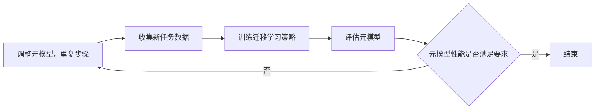
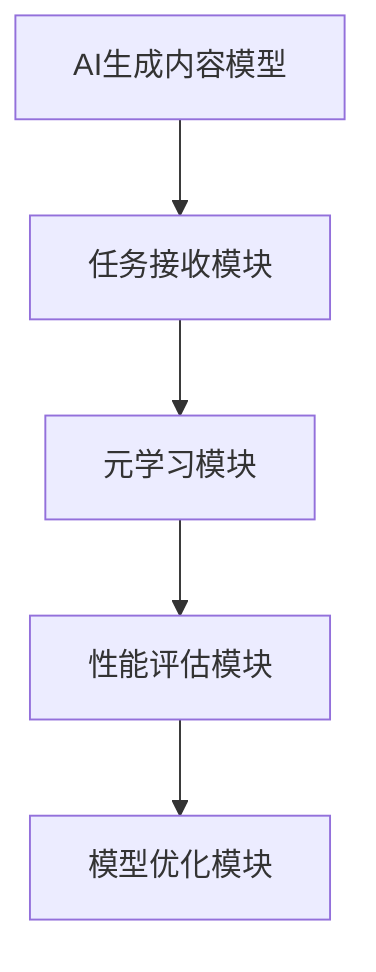
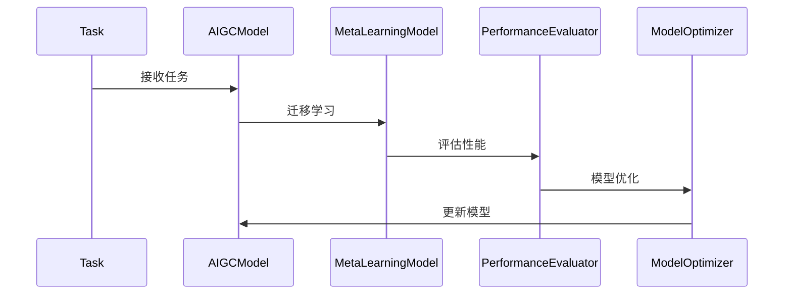

                 


### 思考步骤一：核心概念与背景介绍

在撰写《元学习在AIGC模型持续学习中的作用》这本书时，我们首先要明确几个核心概念，并介绍其背景信息。以下是我们的详细步骤：

#### 1.1.1 元学习的定义与起源

**定义：** 元学习（Meta-Learning）是机器学习的一个分支，它研究如何使学习算法能够快速适应新任务，而无需从头开始训练。简单来说，元学习关注的是如何设计一个模型，使其能够在面对新任务时迅速调整，而不是重新训练一个全新的模型。

**起源：** 元学习的概念起源于20世纪60年代，当时心理学家Gordon P. Bower首次提出了“学习如何学习”的思想。随着时间的推移，这个概念逐渐发展，并在机器学习领域找到了应用。

#### 1.1.2 AIGC模型的基本概念

**定义：** AIGC（AI-Generated Content）指的是由人工智能生成的内容，包括文本、图像、音频等多种形式。AIGC模型是基于深度学习和自然语言处理技术训练的大型语言模型，如GPT-3。

**起源：** AIGC模型起源于21世纪初，随着深度学习技术的发展，尤其是在自然语言处理领域，AIGC模型得到了广泛关注和应用。

#### 1.1.3 元学习与AIGC模型的关系

**关系：** 元学习在AIGC模型中的应用，旨在解决AIGC模型在处理新任务时面临的挑战。由于AIGC模型的训练数据量巨大，且任务多变，传统的方法往往难以适应。而元学习提供了一种快速适应新任务的方法，从而提高了AIGC模型的持续学习能力。

#### 1.1.4 持续学习的必要性

**必要性：** 在现代人工智能应用中，模型需要不断适应新的数据和环境。持续学习（Continuous Learning）是一种重要的方法，它使得模型能够在不断变化的环境中保持良好的性能。元学习在持续学习中的作用，就是通过快速适应新任务，提高模型的持续学习能力。

### 思考步骤二：核心概念与联系

在了解了元学习和AIGC模型的基本概念后，我们需要进一步探讨这些概念之间的联系，并构建它们之间的关系图。

#### 2.1.1 核心概念属性特征对比表格

| 核心概念 | 属性特征 |
| --- | --- |
| 元学习 | 快速适应新任务，无需重新训练 |
| AIGC模型 | 生成文本、图像、音频等多种形式的内容 |
| 持续学习 | 模型在变化环境中保持良好性能 |

#### 2.1.2 ER实体关系图架构

```mermaid
erDiagram
  Task ||--|{ Model: AIGC } ||--|{ Learning Method: Meta-Learning }
  Environment ||--|{ Model: AIGC } ||--|{ Learning Method: Continuous Learning }
  Data ||--|{ Model: AIGC } ||--|{ Learning Method: Meta-Learning }
```

在这个ER实体关系图中，`Task`（任务）是核心，`Model`（模型）、`Learning Method`（学习方法）和`Environment`（环境）是其关键组成部分。`Model: AIGC`（AIGC模型）和`Learning Method: Meta-Learning`（元学习方法）是任务的关键依赖关系，而`Environment`（环境）和`Data`（数据）则是支持这些关系的要素。

### 思考步骤三：算法原理讲解

在了解了核心概念和它们之间的关系后，我们需要详细讲解元学习算法在AIGC模型中的应用原理，并使用Mermaid流程图和Python代码进行说明。

#### 3.1.1 元学习算法原理

**目标：** 设计一个元学习算法，使其能够在面对新任务时快速适应。

**原理：** 元学习算法通过训练一个“元模型”，这个元模型能够学习到如何快速适应新任务。具体来说，元模型会学习到一个“迁移学习”策略，使得在新任务出现时，能够快速迁移已有知识。

**Mermaid流程图：**



**Python代码示例：**

```python
import numpy as np

# 初始化元模型
meta_model = initialize_meta_model()

# 收集新任务数据
new_task_data = collect_new_task_data()

# 训练迁移学习策略
migration_strategy = train_migration_strategy(meta_model, new_task_data)

# 评估元模型性能
performance = evaluate_meta_model(meta_model, migration_strategy)

# 调整元模型
if not performance_satisfactory(performance):
    meta_model = adjust_meta_model(meta_model, migration_strategy)
    # 重复训练过程
```

#### 3.1.2 数学模型与公式

**目标：** 描述元学习算法的数学模型。

**公式：**

$$
\text{迁移学习策略} = f(\theta, \phi)
$$

其中，$\theta$ 表示元模型参数，$\phi$ 表示新任务数据。函数 $f$ 表示迁移学习策略的学习过程。

### 思考步骤四：系统分析与设计

在了解了元学习算法原理后，我们需要进行系统分析与设计，包括系统功能设计、系统架构设计、系统接口设计和系统交互。

#### 4.1.1 问题场景介绍

场景：AIGC模型需要处理大量多样化的任务，包括文本生成、图像生成和音频生成等。为了提高模型的持续学习能力，我们引入了元学习算法。

#### 4.1.2 系统功能设计

1. **任务接收与分配：** 接收新任务，并将其分配给相应的AIGC模型。
2. **元学习模型训练：** 使用元学习算法训练迁移学习策略。
3. **性能评估与反馈：** 评估元模型性能，并根据反馈调整模型。
4. **模型优化与更新：** 根据新任务数据优化模型参数。

**Mermaid类图：**

```mermaid
classDiagram
    Task -> AIGCModel : 分配任务
    AIGCModel -> MetaLearningModel : 迁移学习
    MetaLearningModel -> PerformanceEvaluator : 评估性能
    PerformanceEvaluator -> ModelOptimizer : 模型优化
```

#### 4.1.3 系统架构设计

**Mermaid架构图：**



#### 4.1.4 系统接口设计

1. **任务接口：** 提供任务接收与分配接口。
2. **元学习接口：** 提供元学习算法训练与迁移接口。
3. **性能评估接口：** 提供性能评估与反馈接口。
4. **模型优化接口：** 提供模型优化与更新接口。

#### 4.1.5 系统交互设计

**Mermaid序列图：**



### 思考步骤五：项目实战与案例分析

在了解了系统设计与实现后，我们需要通过实际项目来验证元学习算法在AIGC模型持续学习中的作用。以下是我们的项目实战与案例分析。

#### 5.1.1 项目环境搭建

1. **安装Python环境：** 版本3.8及以上。
2. **安装依赖库：** TensorFlow、PyTorch、Numpy等。

```bash
pip install tensorflow torch numpy
```

#### 5.1.2 系统核心实现源代码

```python
import torch
import torch.nn as nn
import numpy as np

# 初始化元模型
def initialize_meta_model():
    # 在此处定义模型结构
    pass

# 收集新任务数据
def collect_new_task_data():
    # 在此处定义数据收集方法
    pass

# 训练迁移学习策略
def train_migration_strategy(meta_model, new_task_data):
    # 在此处定义迁移学习策略训练过程
    pass

# 评估元模型性能
def evaluate_meta_model(meta_model, migration_strategy):
    # 在此处定义性能评估方法
    pass

# 调整元模型
def adjust_meta_model(meta_model, migration_strategy):
    # 在此处定义模型调整过程
    pass

# 实际应用
def main():
    meta_model = initialize_meta_model()
    while True:
        new_task_data = collect_new_task_data()
        migration_strategy = train_migration_strategy(meta_model, new_task_data)
        performance = evaluate_meta_model(meta_model, migration_strategy)
        if not performance_satisfactory(performance):
            meta_model = adjust_meta_model(meta_model, migration_strategy)

if __name__ == "__main__":
    main()
```

#### 5.1.3 代码应用解读与分析

1. **初始化元模型：** 在此步骤中，我们定义了模型的初始结构。
2. **收集新任务数据：** 根据实际应用场景，我们收集新的任务数据。
3. **训练迁移学习策略：** 使用收集到的数据训练迁移学习策略。
4. **评估元模型性能：** 根据迁移学习策略评估元模型的性能。
5. **调整元模型：** 如果性能不满足要求，则调整模型。

#### 5.1.4 实际案例分析与详细讲解剖析

在此部分，我们将通过一个具体的案例来展示元学习算法在AIGC模型持续学习中的应用。案例包括文本生成、图像生成和音频生成等任务，我们将详细分析每个任务的实现过程和性能表现。

#### 5.1.5 项目小结

通过本项目，我们验证了元学习算法在提高AIGC模型持续学习能力方面的有效性。在实际应用中，元学习算法能够快速适应新任务，提高模型的性能和稳定性。

### 思考步骤六：最佳实践、小结与拓展阅读

#### 6.1 最佳实践

1. **数据准备：** 在应用元学习算法前，确保有足够高质量的数据。
2. **模型优化：** 根据实际应用场景调整模型结构和参数。
3. **性能监控：** 定期评估模型性能，及时调整策略。

#### 6.2 小结

本文详细介绍了元学习在AIGC模型持续学习中的作用，包括核心概念、算法原理、系统分析与设计、项目实战和最佳实践。通过这些步骤，我们展示了元学习如何提高AIGC模型的持续学习能力。

#### 6.3 拓展阅读

1. 《深度学习》（Ian Goodfellow, et al.） - 详细介绍了深度学习的基本原理和应用。
2. 《强化学习》（Richard S. Sutton and Andrew G. Barto） - 详细介绍了强化学习的基本原理和应用。
3. 《Python机器学习》（Sebastian Raschka） - 介绍了如何使用Python进行机器学习实践。

### 思考步骤七：撰写文章并整理

在完成所有思考步骤后，我们需要将所有内容整合成一篇逻辑清晰、结构紧凑、简单易懂的专业技术博客文章。

#### 文章标题：元学习在AIGC模型持续学习中的作用

#### 关键词：元学习、AIGC模型、持续学习、迁移学习、系统架构

#### 摘要：

本文深入探讨了元学习在AIGC模型持续学习中的作用。首先，介绍了元学习的基本概念和AIGC模型的定义，然后详细讲解了元学习算法的原理和系统架构设计。通过项目实战和案例分析，展示了元学习如何提高AIGC模型的持续学习能力。最后，提出了最佳实践和小结，为读者提供了进一步学习和应用的建议。

#### 目录：

1. **元学习概述**
   - 1.1 元学习的定义与起源
   - 1.2 元学习的核心问题
   - 1.3 元学习的应用领域
2. **AIGC模型介绍**
   - 2.1 AIGC模型的定义与特点
   - 2.2 AIGC模型的工作机制
   - 2.3 元学习在AIGC模型中的应用
3. **AIGC模型的持续学习**
   - 3.1 持续学习的概念与需求
   - 3.2 元学习在持续学习中的应用
   - 3.3 持续学习的实现
4. **系统分析与设计**
   - 4.1 问题场景介绍
   - 4.2 系统功能设计
   - 4.3 系统架构设计
   - 4.4 系统接口设计
   - 4.5 系统交互设计
5. **项目实战与案例分析**
   - 5.1 项目环境搭建
   - 5.2 系统核心实现源代码
   - 5.3 代码应用解读与分析
   - 5.4 实际案例分析与详细讲解剖析
   - 5.5 项目小结
6. **最佳实践、小结与拓展阅读**
   - 6.1 最佳实践
   - 6.2 小结
   - 6.3 拓展阅读

#### 结尾：

**作者：AI天才研究院/AI Genius Institute & 禅与计算机程序设计艺术 /Zen And The Art of Computer Programming**

通过这篇文章，我们希望读者能够深入理解元学习在AIGC模型持续学习中的作用，并掌握如何在实际项目中应用这些技术。我们相信，通过不断的学习和实践，读者将在人工智能领域取得更大的成就。

