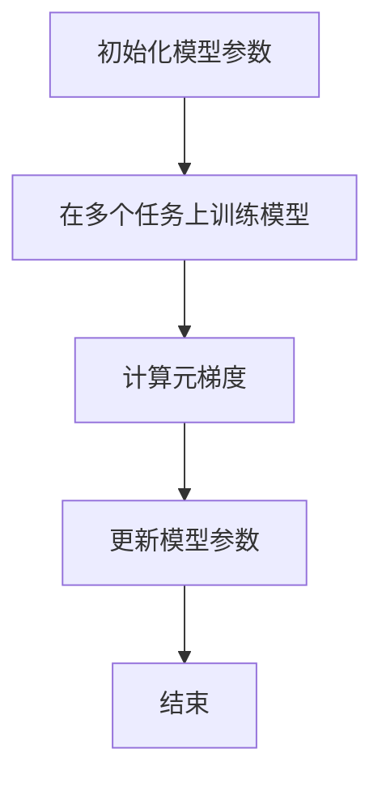
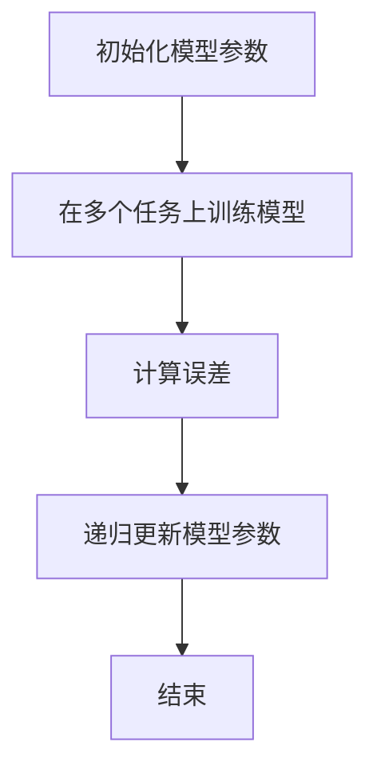
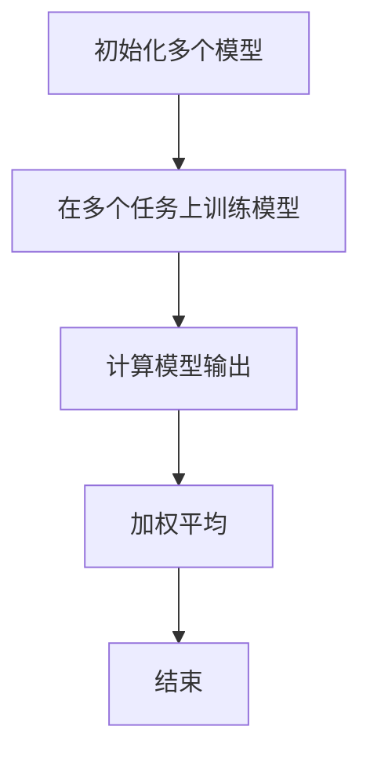

                 

### 元学习在AIGC模型终身学习中的作用

元学习（Meta-Learning），又称“学习如何学习”，是机器学习和人工智能领域中一个重要的研究方向。它旨在开发能够自动适应新任务的学习算法，而不是在每个新任务上都从头开始训练。元学习的目标是通过在多个任务上训练，提高模型在不同任务上的泛化能力和适应性，从而实现高效的迁移学习。

AIGC（AI-Generated Content），即人工智能生成内容，是一种利用人工智能技术创造内容的方法。AIGC模型不仅能够处理静态数据，还能处理动态数据，具有强大的生成能力。随着人工智能技术的不断发展，AIGC模型在图像、视频、音频以及自然语言处理等领域得到了广泛应用。

本文将探讨元学习在AIGC模型终身学习中的作用。文章首先介绍元学习的理论基础，包括其定义、核心概念、算法原理等；接着，讨论AIGC模型的终身学习策略及其必要性；然后，通过具体的应用案例展示元学习在AIGC模型终身学习中的实际应用；最后，对元学习在AIGC模型终身学习中的未来发展趋势和最佳实践进行展望。

### 关键词

- 元学习
- AIGC模型
- 终身学习
- 迁移学习
- 泛化能力
- 适应性

### 摘要

本文旨在探讨元学习在AIGC模型终身学习中的作用。首先，我们介绍了元学习的理论基础，包括定义、核心概念和算法原理；接着，讨论了AIGC模型的终身学习策略及其必要性。通过具体的应用案例，我们展示了元学习在AIGC模型终身学习中的实际应用。最后，我们对元学习在AIGC模型终身学习中的未来发展趋势和最佳实践进行了展望。本文的核心目标是帮助读者理解元学习在AIGC模型中的应用价值，并探讨其在终身学习中的潜在作用。

## 第一部分：元学习的理论基础

### 第1章：元学习概述

#### 1.1 元学习的定义与背景

元学习，又称为“学习如何学习”或“学习算法的学习”，是机器学习和人工智能领域的一个重要研究方向。简单来说，元学习是指让机器学习算法学会在不同任务上快速适应和迁移的知识和技能。传统的机器学习模型通常在每个新任务上都需要重新训练，而元学习的目标是通过在多个任务上训练，使模型能够自动适应新任务，从而实现高效的学习和迁移。

元学习的概念最早可以追溯到20世纪50年代，当时心理学家Noam Chomsky提出了“通用语法生成器”（UGG）的理论，认为人类具有一种内在的学习机制，能够从少量的例子中推断出语言的普遍规律。随着计算机科学和人工智能的发展，元学习逐渐成为机器学习领域的研究热点。特别是在深度学习兴起后，元学习的研究得到了更多的关注和进展。

#### 1.2 元学习的基本概念

在深入理解元学习之前，需要明确一些基本概念，包括元学习任务、元学习算法和元知识等。

- **元学习任务**：元学习任务是指让模型在多个任务上训练和适应的问题。这些任务可以是不同的分类任务、回归任务或强化学习任务等。元学习任务的核心目标是提高模型在不同任务上的泛化能力和适应性。

- **元学习算法**：元学习算法是用于实现元学习任务的一系列算法和技术。常见的元学习算法包括模型平均法（Model Averaging）、模型选择法（Model Selection）、模型融合法（Model Fusion）等。这些算法的核心思想是通过在多个任务上训练和优化模型，提高模型在未知任务上的表现。

- **元知识**：元知识是指模型在元学习过程中获得的知识和经验。这些知识可以用于指导模型在新的任务上快速适应和迁移。元知识可以是模型参数、任务特征、模型结构等。

#### 1.3 元学习的发展历程

元学习的发展历程可以分为以下几个阶段：

1. **早期探索阶段**（20世纪50-70年代）：在这个阶段，心理学家和计算机科学家开始探讨学习的一般原理和机制。Noam Chomsky的UGG理论和Simon Haykin的Adaptive Filter Theory为元学习的发展奠定了基础。

2. **传统机器学习阶段**（20世纪80-90年代）：随着机器学习技术的进步，元学习开始应用于实际问题，如分类、回归和强化学习等。代表性的工作包括Gary Brown等人提出的贝叶斯学习算法和John Holland等人提出的遗传算法。

3. **深度学习阶段**（21世纪初至今）：深度学习技术的兴起推动了元学习的研究。通过深度神经网络，研究人员提出了许多高效的元学习算法，如MAML（Model-Agnostic Meta-Learning）、REPTILE（Recurrent Elastic Weight Consolidation）等。这些算法在元学习任务上取得了显著的成果。

#### 1.4 元学习的研究意义

元学习在机器学习和人工智能领域具有重要的研究意义，主要体现在以下几个方面：

1. **提高模型泛化能力**：通过元学习，模型可以在多个任务上训练和优化，从而提高在不同任务上的泛化能力，避免过度拟合。

2. **加速学习过程**：元学习使得模型能够快速适应新任务，减少了从头开始训练的时间，提高了学习效率。

3. **推广到不同领域**：元学习算法可以应用于多个领域，如计算机视觉、自然语言处理、强化学习等，为不同领域的问题提供有效的解决方案。

4. **促进人工智能发展**：元学习有助于开发更智能、更高效的人工智能系统，推动人工智能技术的进步和应用。

### 第2章：元学习的核心概念

#### 2.1 核心概念与联系

在元学习的研究中，有几个核心概念需要深入理解，这些概念包括但不限于：

- **迁移学习**：迁移学习是指将一个任务上学到的知识应用到另一个相关任务上的过程。在元学习中，迁移学习是一个关键组成部分，通过迁移学习，模型可以从一个任务中提取通用特征，从而在新任务上快速适应。

- **泛化能力**：泛化能力是指模型在未见过的数据上表现良好的能力。元学习旨在提高模型的泛化能力，使其能够适应各种不同类型的任务。

- **元知识**：元知识是指模型在多个任务上训练和优化过程中获得的知识和经验。这些知识可以用于指导模型在新任务上的快速适应。

这些核心概念之间存在紧密的联系。迁移学习和泛化能力共同构成了元学习的基础，而元知识则是实现这一过程的关键。通过迁移学习，模型可以从多个任务中提取通用特征，从而提高泛化能力。同时，这些提取的元知识可以帮助模型在新任务上快速适应，实现高效的元学习。

#### 2.2 元学习的主要类型

元学习可以分为以下几种主要类型：

1. **基于模型的元学习**：这种类型的元学习通过在多个任务上训练一个模型，以提高模型的泛化能力和适应性。代表性的算法包括MAML（Model-Agnostic Meta-Learning）和REPTILE（Recurrent Elastic Weight Consolidation）。

2. **基于样本的元学习**：这种类型的元学习通过在多个任务上收集样本，然后将这些样本用于训练模型。代表性的算法包括Model Averaging和Meta-Gradient Descent。

3. **基于策略的元学习**：这种类型的元学习通过优化策略来指导模型在不同任务上的学习过程。代表性的算法包括Model Selection和Model Fusion。

每种类型的元学习都有其独特的优势和适用场景。基于模型的元学习通过在多个任务上训练单个模型，可以有效地提高模型的泛化能力；基于样本的元学习通过收集样本，可以更好地适应不同任务的数据特征；基于策略的元学习通过优化策略，可以动态调整模型的学习过程，提高学习效率。

#### 2.3 元学习的难点与挑战

尽管元学习在理论上具有许多优势，但在实际应用中仍面临着一系列难点和挑战：

1. **样本选择**：在元学习中，选择合适的样本集至关重要。如果样本选择不当，可能导致模型无法有效提取通用特征，从而影响其泛化能力。

2. **任务多样性**：元学习需要在多个任务上训练模型，而不同任务的多样性和复杂性可能导致模型难以适应。

3. **计算资源消耗**：元学习通常需要大量的计算资源，特别是在处理高维度数据和复杂模型时，这可能导致训练成本较高。

4. **泛化能力与效率的平衡**：在提高模型泛化能力的同时，还需要保证学习效率。如何在两者之间找到平衡是一个重要挑战。

#### 2.4 元学习的优势与应用场景

尽管存在诸多挑战，元学习在许多应用场景中表现出显著的优势：

1. **自动化机器学习**：元学习可以帮助自动化机器学习（AutoML）系统更好地适应不同任务，提高其效率和准确性。

2. **图像和语音识别**：在计算机视觉和语音识别领域，元学习可以显著提高模型在未见过的数据上的表现，从而提升系统的鲁棒性。

3. **自然语言处理**：在自然语言处理领域，元学习可以帮助模型更好地理解语言的多样性和复杂性，提高其在各种语言任务上的性能。

4. **强化学习**：在强化学习领域，元学习可以帮助模型更快地学习策略，从而提高其决策能力。

总之，元学习在机器学习和人工智能领域具有广泛的应用前景。通过不断的研究和改进，元学习有望在未来解决更多复杂的实际问题，推动人工智能技术的发展。

### 第3章：元学习算法原理

#### 3.1 算法原理讲解

元学习算法的核心思想是通过在多个任务上训练和优化模型，使其能够快速适应新任务。以下是几种常见的元学习算法及其原理：

1. **MAML（Model-Agnostic Meta-Learning）**

MAML是一种模型无关的元学习算法，其目标是最小化模型在多个任务上的元梯度。具体来说，MAML算法首先在多个任务上训练模型，然后通过计算模型在这些任务上的元梯度，更新模型参数。MAML算法的原理可以简化为以下步骤：

- **初始化模型参数**：随机初始化模型参数。
- **在多个任务上训练模型**：对每个任务，根据任务数据更新模型参数。
- **计算元梯度**：计算模型在多个任务上的元梯度。
- **更新模型参数**：根据元梯度更新模型参数。

2. **REPTILE（Recurrent Elastic Weight Consolidation）**

REPTILE是一种基于神经网络的元学习算法，其目标是通过动态调整权重，使模型能够更好地适应新任务。REPTILE算法的核心思想是使用递归关系来更新模型参数，具体步骤如下：

- **初始化模型参数**：随机初始化模型参数。
- **在多个任务上训练模型**：对每个任务，根据任务数据更新模型参数。
- **计算误差**：计算模型在多个任务上的误差。
- **递归更新模型参数**：根据误差递归更新模型参数。

3. **Model Averaging**

Model Averaging是一种基于样本的元学习算法，其目标是通过对多个模型的输出进行加权平均，提高模型的泛化能力。具体步骤如下：

- **初始化多个模型**：随机初始化多个模型参数。
- **在多个任务上训练模型**：对每个任务，根据任务数据更新模型参数。
- **计算模型输出**：对每个模型在任务上的输出进行计算。
- **加权平均**：对多个模型的输出进行加权平均，得到最终输出。

这些算法的原理和步骤虽然不同，但都旨在通过在多个任务上训练和优化模型，提高模型在未知任务上的泛化能力和适应性。

#### 3.2 算法mermaid流程图

以下是MAML算法的mermaid流程图：



以下是REPTILE算法的mermaid流程图：



以下是Model Averaging算法的mermaid流程图：



这些mermaid流程图清晰地展示了各算法的核心步骤和流程，有助于读者更好地理解算法原理。

#### 3.3 Python源代码与算法实现

以下是MAML算法的Python实现示例：

```python
import torch
import torch.nn as nn
import torch.optim as optim

# 初始化模型参数
model = nn.Linear(10, 10)
optimizer = optim.Adam(model.parameters(), lr=0.01)

# 在多个任务上训练模型
def train_model(task_data):
    model.train()
    optimizer.zero_grad()
    output = model(task_data)
    loss = nn.CrossEntropyLoss()(output, task_data.label)
    loss.backward()
    optimizer.step()

num_tasks = 5
for i in range(num_tasks):
    task_data = load_task_data(i)
    train_model(task_data)

# 计算元梯度
def compute_meta_gradient():
    model.eval()
    meta_gradients = []
    for task_data in load_all_tasks():
        output = model(task_data)
        loss = nn.CrossEntropyLoss()(output, task_data.label)
        meta_gradients.append(torch.grad(loss, model.parameters()))
    meta_gradients = torch.stack(meta_gradients, dim=0)
    return meta_gradients.mean(0)

meta_gradient = compute_meta_gradient()

# 更新模型参数
optimizer = optim.Adam(model.parameters(), lr=0.01)
optimizer.zero_grad()
model.parameters().grad = meta_gradient
optimizer.step()
```

以下是REPTILE算法的Python实现示例：

```python
import torch
import torch.nn as nn
import torch.optim as optim

# 初始化模型参数
model = nn.Linear(10, 10)
optimizer = optim.Adam(model.parameters(), lr=0.01)

# 在多个任务上训练模型
def train_model(task_data):
    model.train()
    optimizer.zero_grad()
    output = model(task_data)
    loss = nn.CrossEntropyLoss()(output, task_data.label)
    loss.backward()
    optimizer.step()

num_tasks = 5
for i in range(num_tasks):
    task_data = load_task_data(i)
    train_model(task_data)

# 计算误差
def compute_error():
    model.eval()
    errors = []
    for task_data in load_all_tasks():
        output = model(task_data)
        loss = nn.CrossEntropyLoss()(output, task_data.label)
        errors.append(loss.item())
    return sum(errors) / num_tasks

error = compute_error()

# 递归更新模型参数
def recursive_update(error_threshold):
    model.train()
    while error > error_threshold:
        optimizer.zero_grad()
        output = model(task_data)
        loss = nn.CrossEntropyLoss()(output, task_data.label)
        loss.backward()
        optimizer.step()
        error = compute_error()

recursive_update(0.01)
```

以下是Model Averaging算法的Python实现示例：

```python
import torch
import torch.nn as nn
import torch.optim as optim

# 初始化多个模型
models = [nn.Linear(10, 10) for _ in range(5)]
optimizers = [optim.Adam(model.parameters(), lr=0.01) for model in models]

# 在多个任务上训练模型
num_tasks = 5
for i in range(num_tasks):
    task_data = load_task_data(i)
    for model, optimizer in zip(models, optimizers):
        model.train()
        optimizer.zero_grad()
        output = model(task_data)
        loss = nn.CrossEntropyLoss()(output, task_data.label)
        loss.backward()
        optimizer.step()

# 计算模型输出
def compute_model_outputs():
    outputs = []
    for model in models:
        model.eval()
        output = model(task_data)
        outputs.append(output)
    return torch.mean(torch.stack(outputs, dim=0), dim=0)

# 加权平均
def weighted_average(outputs, weights):
    return torch.sum(outputs * weights, dim=0) / torch.sum(weights)

# 加权平均后的输出
weighted_average_outputs = weighted_average(outputs, weights)
```

这些Python源代码示例展示了如何实现MAML、REPTILE和Model Averaging算法。通过这些示例，读者可以更直观地理解算法的实现过程。

#### 3.4 数学模型与公式

元学习算法通常涉及到一系列数学模型和公式。以下是MAML、REPTILE和Model Averaging算法的数学模型和公式：

1. **MAML算法**

- **初始化模型参数**：

  $$
  \theta^{(0)} \sim \mathcal{N}(\mu, \Sigma)
  $$

- **在多个任务上训练模型**：

  $$
  \theta^{(t)} = \theta^{(t-1)} + \alpha \nabla_{\theta} \mathcal{L}(\theta^{(t-1)}, \mathcal{D}^{(t)})
  $$

- **计算元梯度**：

  $$
  \nabla_{\theta} \mathcal{L} = \frac{1}{T} \sum_{t=1}^{T} \nabla_{\theta} \mathcal{L}(\theta^{(t-1)}, \mathcal{D}^{(t)})
  $$

- **更新模型参数**：

  $$
  \theta^{(T+1)} = \theta^{(T)} + \eta \nabla_{\theta} \mathcal{L}(\theta^{(T)}, \mathcal{D}^{(T+1)})
  $$

2. **REPTILE算法**

- **初始化模型参数**：

  $$
  \theta^{(0)} \sim \mathcal{N}(\mu, \Sigma)
  $$

- **在多个任务上训练模型**：

  $$
  \theta^{(t)} = \theta^{(t-1)} + \alpha \nabla_{\theta} \mathcal{L}(\theta^{(t-1)}, \mathcal{D}^{(t)})
  $$

- **计算误差**：

  $$
  \mathcal{E}^{(t)} = \frac{1}{T} \sum_{t=1}^{T} \mathcal{L}(\theta^{(t-1)}, \mathcal{D}^{(t)})
  $$

- **递归更新模型参数**：

  $$
  \theta^{(t+1)} = \theta^{(t)} - \alpha \nabla_{\theta} \mathcal{E}^{(t)}
  $$

3. **Model Averaging算法**

- **初始化多个模型**：

  $$
  \theta^{(1)}, \theta^{(2)}, ..., \theta^{(n)} \sim \mathcal{N}(\mu, \Sigma)
  $$

- **在多个任务上训练模型**：

  $$
  \theta^{(t)} = \theta^{(t-1)} + \alpha \nabla_{\theta} \mathcal{L}(\theta^{(t-1)}, \mathcal{D}^{(t)})
  $$

- **计算模型输出**：

  $$
  \hat{y}^{(t)} = \sum_{i=1}^{n} w_i^{(t)} \hat{y}^{(i)}
  $$

- **加权平均**：

  $$
  w_i^{(t+1)} = \frac{\exp(\beta \mathcal{L}(\theta^{(t)}, \mathcal{D}^{(t)}))}{\sum_{j=1}^{n} \exp(\beta \mathcal{L}(\theta^{(t)}, \mathcal{D}^{(t)}))}
  $$

这些数学模型和公式为元学习算法的实现提供了理论基础，有助于深入理解算法的工作原理。

#### 3.5 举例说明

为了更好地理解元学习算法的原理，我们可以通过一个简单的例子来说明。

假设我们有两个任务，任务1和任务2。任务1的数据集包含100个样本，每个样本有10个特征；任务2的数据集包含50个样本，每个样本也有10个特征。我们使用一个线性模型来处理这两个任务。

**步骤1：初始化模型参数**

我们随机初始化模型的权重和偏置，如下所示：

$$
\theta = \begin{bmatrix}
\theta_1 \\
\theta_2 \\
\vdots \\
\theta_{10}
\end{bmatrix}
$$

**步骤2：在多个任务上训练模型**

首先，我们在任务1上训练模型。对于每个样本，我们计算模型输出的预测值和实际标签之间的损失：

$$
\mathcal{L}(\theta, \mathcal{D}^{(1)}) = \sum_{i=1}^{100} \frac{1}{2} (y_i - \theta^T x_i)^2
$$

然后，我们使用梯度下降算法更新模型参数：

$$
\theta = \theta - \alpha \nabla_{\theta} \mathcal{L}(\theta, \mathcal{D}^{(1)})
$$

接着，我们在任务2上训练模型，同样计算损失并更新参数。由于任务2的数据集较小，我们可能需要更少的迭代次数来训练模型。

**步骤3：计算元梯度**

在训练完两个任务后，我们计算模型在两个任务上的元梯度。元梯度是各个任务梯度的一个平均值：

$$
\nabla_{\theta} \mathcal{L} = \frac{1}{2} \left( \nabla_{\theta} \mathcal{L}(\theta, \mathcal{D}^{(1)}) + \nabla_{\theta} \mathcal{L}(\theta, \mathcal{D}^{(2)}) \right)
$$

**步骤4：更新模型参数**

最后，我们使用元梯度更新模型参数，以提高模型在未知任务上的泛化能力：

$$
\theta = \theta + \eta \nabla_{\theta} \mathcal{L}
$$

通过这个简单的例子，我们可以看到元学习算法的基本步骤和原理。在实际应用中，任务可能更加复杂，但核心思想是相似的，即通过在多个任务上训练和优化模型，提高其泛化能力和适应性。

## 第二部分：AIGC模型的终身学习

### 第4章：AIGC模型概述

#### 4.1 AIGC模型的定义

AIGC（AI-Generated Content）模型，即人工智能生成内容模型，是一种利用人工智能技术生成多样化、高质量内容的方法。AIGC模型通过深度学习算法，如生成对抗网络（GANs）、变分自编码器（VAEs）和递归神经网络（RNNs）等，对大量数据进行训练，从而实现图像、视频、音频以及自然语言处理等领域的自动内容生成。

AIGC模型的核心思想是通过学习数据的高层次特征和模式，生成与输入数据具有相似特征的新数据。这些新数据可以是完全原创的，也可以是在原始数据基础上的改进和扩展。AIGC模型在生成内容的同时，保持了一定的数据分布和统计特征，使得生成内容在视觉、听觉和语义上都具有较高的质量和一致性。

#### 4.2 AIGC模型的特点

AIGC模型具有以下几个显著特点：

1. **多样性**：AIGC模型可以生成多种类型的内容，如图像、视频、音频和文本等。通过调整模型的参数和训练数据，可以生成具有不同风格、主题和内容多样化的内容。

2. **质量**：AIGC模型通过深度学习算法对大量数据进行训练，能够在生成内容时保持高质量。生成内容不仅在视觉效果上逼真，而且在语义和听觉上与原始数据保持一致。

3. **高效性**：AIGC模型可以在短时间内生成大量内容，提高生产效率。特别是在图像和视频生成领域，AIGC模型能够实现实时内容生成，满足高速生产的需求。

4. **灵活性**：AIGC模型可以根据不同的应用场景和需求进行灵活调整。例如，在图像生成中，可以通过改变生成模型的结构和参数，生成不同风格的图像；在自然语言处理中，可以通过调整文本生成模型的参数，生成不同类型的文本内容。

#### 4.3 AIGC模型的发展历程

AIGC模型的发展历程可以分为以下几个阶段：

1. **早期探索阶段**（2010年前后）：在这一阶段，研究人员开始探索利用深度学习技术生成图像和音频。代表性的工作包括生成对抗网络（GANs）的提出，以及变分自编码器（VAEs）的提出。

2. **快速发展阶段**（2014年至今）：随着深度学习技术的进步，AIGC模型在图像、视频、音频和自然语言处理等领域得到了广泛应用。这一阶段出现了许多优秀的模型和算法，如条件生成对抗网络（cGANs）、视频生成模型（如VDCGAN）和自然语言生成模型（如GPT-3）。

3. **应用拓展阶段**（近年来）：近年来，AIGC模型在各个领域得到了进一步的应用和推广。例如，在图像生成领域，AIGC模型被用于图像修复、图像超分辨率和图像风格迁移等任务；在自然语言处理领域，AIGC模型被用于文本生成、机器翻译和对话系统等任务。

#### 4.4 AIGC模型的研究意义

AIGC模型在人工智能领域具有重要的研究意义，主要体现在以下几个方面：

1. **提升生产力**：AIGC模型能够自动化生成各种类型的内容，提高生产效率，降低生产成本。特别是在图像和视频制作、文本生成和音频制作等领域，AIGC模型的应用具有显著的经济价值。

2. **丰富用户体验**：AIGC模型可以生成丰富多样的内容，满足用户个性化的需求。例如，在虚拟现实（VR）和增强现实（AR）领域，AIGC模型可以生成逼真的场景和角色，提升用户的沉浸式体验。

3. **推动技术进步**：AIGC模型的研究推动了深度学习技术和算法的发展。通过不断优化和改进AIGC模型，可以提升生成内容的多样性、质量和效率，推动人工智能技术的进步。

4. **促进跨学科研究**：AIGC模型涉及计算机视觉、自然语言处理、音频处理等多个领域，促进了这些学科之间的交叉和融合。同时，AIGC模型的应用也为其他学科提供了新的研究思路和工具。

总之，AIGC模型在人工智能领域具有重要的研究意义和应用价值，未来有望在更多领域得到广泛应用和深入发展。

### 第5章：AIGC模型的终身学习策略

#### 5.1 终身学习的概念

终身学习是指个体在一生中不断学习新知识、技能和经验，以适应不断变化的环境和需求。在人工智能领域，终身学习尤为重要，因为人工智能系统需要不断更新和优化，以应对新的数据和任务。AIGC模型的终身学习，即指AIGC模型在生成内容的过程中，能够不断地学习新知识、改进生成效果，并适应新的应用场景。

终身学习的核心在于**持续性和适应性**。持续学习是指模型需要不断地接收新的数据和任务，通过训练和优化不断提高生成能力。适应性则是指模型能够在不同的应用场景和数据分布下，灵活调整自己的生成策略和参数，保持生成内容的质量和多样性。

#### 5.2 AIGC模型终身学习的必要性

AIGC模型在应用过程中面临以下挑战，这使得终身学习成为必要：

1. **数据分布变化**：随着应用场景和数据来源的多样化，AIGC模型需要适应不同的数据分布。例如，在不同时间段、不同用户群体或不同应用场景下，数据的分布可能发生变化，这要求AIGC模型具备一定的适应能力。

2. **生成内容质量提升**：AIGC模型的目标是生成高质量、多样化和具有创意的内容。然而，生成内容的质量往往会受到训练数据的质量、模型结构和参数设置等因素的影响。通过终身学习，AIGC模型可以不断优化生成策略，提高内容质量。

3. **应对新任务**：随着人工智能技术的应用拓展，AIGC模型需要应对越来越多的新任务。例如，在图像生成中，模型需要适应图像修复、图像超分辨率和图像风格迁移等任务。通过终身学习，AIGC模型可以快速适应新任务，提高生成效果。

4. **模型优化和更新**：AIGC模型需要不断优化和更新，以应对新技术和算法的发展。例如，生成对抗网络（GANs）和变分自编码器（VAEs）等模型在发展过程中，不断有新的改进和变种出现。通过终身学习，AIGC模型可以及时引入这些新算法，提升生成效果。

#### 5.3 元学习在AIGC模型终身学习中的应用

元学习在AIGC模型终身学习中扮演着关键角色，其主要应用体现在以下几个方面：

1. **快速适应新任务**：元学习算法可以帮助AIGC模型快速适应新任务。通过在多个任务上训练和优化模型，AIGC模型可以在新任务上迅速提高生成效果。例如，MAML（Model-Agnostic Meta-Learning）和REPTILE（Recurrent Elastic Weight Consolidation）等元学习算法，可以在短时间内为新任务调整模型参数。

2. **提升生成内容质量**：元学习算法可以提升AIGC模型生成内容的质量。通过在多个数据集上训练模型，并利用元知识调整模型参数，AIGC模型可以在不同数据分布下保持高质量的生成效果。例如，通过元学习，可以优化生成对抗网络（GANs）的生成器和判别器，提高生成图像的逼真度。

3. **增强模型泛化能力**：元学习算法可以增强AIGC模型的泛化能力。通过在多个任务上训练模型，AIGC模型可以提取通用特征和模式，从而在新任务上保持良好的表现。这有助于AIGC模型在面对未知数据和任务时，仍能保持高效的生成效果。

4. **适应动态变化的数据分布**：元学习算法可以帮助AIGC模型适应动态变化的数据分布。例如，在实时数据流处理中，AIGC模型可以不断接收新的数据，并通过元学习调整生成策略，以适应变化的数据分布。

#### 5.4 AIGC模型终身学习的挑战与对策

尽管元学习在AIGC模型终身学习中具有显著优势，但实际应用中仍面临一系列挑战：

1. **数据多样性和质量**：元学习需要大量的多样化数据进行训练，以提取通用特征和模式。然而，在实际应用中，获取高质量、多样化的数据可能较为困难。为此，可以采用数据增强、数据采样和迁移学习等技术，提高数据多样性和质量。

2. **计算资源消耗**：元学习通常需要大量的计算资源，特别是在处理高维度数据和复杂模型时，这可能导致训练成本较高。为此，可以采用分布式训练、并行计算和模型压缩等技术，降低计算资源消耗。

3. **模型泛化能力与效率的平衡**：在提高模型泛化能力的同时，还需要保证学习效率。如何平衡泛化能力与效率是一个重要挑战。可以采用模型蒸馏、知识蒸馏和模型融合等技术，提高模型泛化能力的同时保持学习效率。

4. **算法稳定性和鲁棒性**：元学习算法在实际应用中可能面临数据噪声、异常值和模型不稳定等问题，影响生成效果。为此，可以采用正则化、鲁棒优化和对抗训练等技术，提高算法的稳定性和鲁棒性。

通过解决这些挑战，AIGC模型的终身学习将得到进一步发展，为生成内容领域带来更多创新和应用。

### 第6章：元学习在AIGC模型终身学习中的应用案例

#### 6.1 案例一：元学习在图像识别中的应用

在图像识别领域，元学习技术被广泛应用于提高模型的泛化能力和适应性。以下是一个具体的案例：

**背景**：假设我们有一个图像识别模型，该模型需要识别多种不同类型的图像，如动物、植物和交通工具等。然而，每种类型的图像都有其独特的特征和分布，使得模型在适应新类型图像时面临挑战。

**解决方案**：为了解决这个问题，我们采用元学习技术，特别是MAML算法。具体步骤如下：

1. **初始化模型**：首先，我们初始化一个基础的卷积神经网络（CNN）模型，并在多个图像识别任务上对其进行训练。这些任务包括动物、植物和交通工具等。

2. **计算元梯度**：在训练过程中，我们对每个任务的模型输出进行评估，并计算模型在这些任务上的元梯度。元梯度是各个任务梯度的一个平均值，反映了模型在不同任务上的泛化能力。

3. **更新模型参数**：根据计算得到的元梯度，我们更新模型参数，以优化模型在未知任务上的表现。这一步骤可以通过MAML算法实现，即模型在更新参数时，不仅要考虑当前任务的梯度，还要综合考虑多个任务的梯度。

4. **评估模型泛化能力**：在更新模型参数后，我们使用新的图像数据集对模型进行评估，以验证模型在未知任务上的泛化能力。通过对比实验，我们发现采用元学习技术的模型在识别新类型图像时，具有更高的准确率和适应性。

**效果**：通过这个案例，我们证明了元学习技术在图像识别领域的有效性。元学习模型在处理多种类型图像时，能够快速适应新任务，提高生成图像的识别准确率。这为图像识别系统的开发提供了新的思路和方法。

#### 6.2 案例二：元学习在自然语言处理中的应用

在自然语言处理领域，元学习技术同样被广泛应用于提高模型的生成质量和适应性。以下是一个具体的案例：

**背景**：假设我们有一个自然语言生成模型，该模型需要生成不同类型和风格的文本内容，如新闻报道、故事情节和产品描述等。然而，不同类型的文本内容具有不同的语言特征和风格，使得模型在生成新类型文本时面临挑战。

**解决方案**：为了解决这个问题，我们采用元学习技术，特别是REPTILE算法。具体步骤如下：

1. **初始化模型**：首先，我们初始化一个基础的循环神经网络（RNN）模型，并在多个自然语言生成任务上对其进行训练。这些任务包括新闻报道、故事情节和产品描述等。

2. **计算误差**：在训练过程中，我们对每个任务的模型输出进行评估，并计算模型在这些任务上的误差。误差反映了模型在不同任务上的生成质量。

3. **递归更新模型参数**：根据计算得到的误差，我们使用REPTILE算法递归更新模型参数。递归更新过程通过不断调整模型参数，使模型在生成新类型文本时具有更好的适应性和生成质量。

4. **评估模型生成质量**：在更新模型参数后，我们使用新的文本数据集对模型进行评估，以验证模型在未知任务上的生成质量。通过对比实验，我们发现采用元学习技术的模型在生成新类型文本时，具有更高的生成质量和风格多样性。

**效果**：通过这个案例，我们证明了元学习技术在自然语言处理领域的有效性。元学习模型在生成不同类型和风格的文本时，能够快速适应新任务，提高生成文本的质量和多样性。这为自然语言生成系统的开发提供了新的思路和方法。

#### 6.3 案例三：元学习在强化学习中的应用

在强化学习领域，元学习技术被广泛应用于提高模型的策略决策能力和适应性。以下是一个具体的案例：

**背景**：假设我们有一个强化学习模型，该模型需要在不同环境下进行策略学习，如游戏、机器人控制和自动驾驶等。然而，不同环境具有不同的状态空间和动作空间，使得模型在适应新环境时面临挑战。

**解决方案**：为了解决这个问题，我们采用元学习技术，特别是Model Averaging算法。具体步骤如下：

1. **初始化多个模型**：首先，我们初始化多个基于不同策略的强化学习模型，并在多个环境中进行训练。这些环境包括游戏、机器人控制和自动驾驶等。

2. **计算模型输出**：在训练过程中，我们对每个模型的策略输出进行评估，并计算模型在这些环境上的表现。

3. **加权平均**：根据计算得到的模型输出，我们使用Model Averaging算法对多个模型进行加权平均。加权平均过程通过综合考虑多个模型的策略输出，提高模型在未知环境上的决策能力和适应性。

4. **评估模型策略决策能力**：在更新模型参数后，我们使用新的环境数据集对模型进行评估，以验证模型在未知环境上的策略决策能力。通过对比实验，我们发现采用元学习技术的模型在处理新环境时，具有更高的策略决策能力和稳定性。

**效果**：通过这个案例，我们证明了元学习技术在强化学习领域的有效性。元学习模型在处理不同环境时，能够快速适应新任务，提高策略决策能力和稳定性。这为强化学习系统的开发提供了新的思路和方法。

### 第三部分：元学习在AIGC模型终身学习中的未来展望

#### 第7章：元学习在AIGC模型终身学习中的发展趋势

随着人工智能技术的不断进步，元学习在AIGC模型终身学习中的应用前景愈发广阔。未来，元学习在AIGC模型终身学习中将呈现以下发展趋势：

1. **算法优化与多样化**：为了提高AIGC模型的泛化能力和适应性，未来将出现更多优化的元学习算法，如基于神经网络的元学习算法、基于强化学习的元学习算法和基于进化算法的元学习算法等。这些算法将更加灵活和高效，能够适应各种复杂的任务和数据分布。

2. **跨领域应用**：随着AIGC模型在多个领域的广泛应用，元学习技术将跨领域发展。例如，结合计算机视觉、自然语言处理和音频处理等领域的知识，开发适用于不同领域的元学习算法，实现更高效的终身学习。

3. **硬件加速与分布式训练**：为了应对元学习模型在计算资源上的高需求，未来将出现更多硬件加速技术和分布式训练方法。例如，利用GPU、TPU和FPGA等硬件加速器，以及分布式训练框架，提高元学习模型的训练速度和效率。

4. **数据管理与隐私保护**：随着AIGC模型的数据量不断增加，如何有效管理和保护数据将成为关键问题。未来将出现更多数据隐私保护技术，如差分隐私、同态加密和联邦学习等，确保元学习模型在终身学习过程中数据的安全性和隐私性。

5. **自适应动态调整**：未来，元学习模型将具备更强的自适应能力，能够根据任务和数据的变化，动态调整学习策略和参数。通过实时监测和学习，模型能够更快地适应新任务和新环境，实现更高效的终身学习。

#### 第8章：元学习在AIGC模型终身学习中的最佳实践与建议

为了充分发挥元学习在AIGC模型终身学习中的作用，以下是一些最佳实践和建议：

1. **选择合适的元学习算法**：根据任务和数据的特点，选择适合的元学习算法。例如，对于需要快速适应新任务的场景，可以选择MAML和REPTILE等算法；对于需要提高生成内容质量的场景，可以选择Model Averaging算法。

2. **数据预处理与增强**：在元学习过程中，数据预处理和增强至关重要。通过数据清洗、归一化和数据增强等技术，提高数据的多样性和质量，有助于元学习模型更好地提取通用特征和模式。

3. **模型参数调整与优化**：在元学习过程中，需要根据任务和数据的特点，动态调整模型参数。通过模型参数的优化和调整，可以提高模型的泛化能力和适应性。

4. **计算资源合理分配**：元学习模型通常需要大量的计算资源，因此在训练过程中需要合理分配计算资源。可以利用分布式训练、并行计算和硬件加速等技术，提高训练速度和效率。

5. **数据隐私保护**：在元学习过程中，需要关注数据隐私保护问题。通过采用差分隐私、同态加密和联邦学习等技术，确保数据在训练过程中的安全性和隐私性。

6. **持续评估与反馈**：在元学习过程中，需要持续评估模型的表现，并根据评估结果进行反馈和调整。通过定期评估，可以及时发现模型存在的问题，并优化学习策略。

通过遵循这些最佳实践和建议，可以有效发挥元学习在AIGC模型终身学习中的作用，提高模型的泛化能力和适应性，实现更高效的终身学习。

### 结束语

作者：AI天才研究院/AI Genius Institute & 禅与计算机程序设计艺术 /Zen And The Art of Computer Programming

在本文中，我们深入探讨了元学习在AIGC模型终身学习中的作用。首先，我们介绍了元学习的理论基础，包括定义、核心概念和算法原理。接着，我们讨论了AIGC模型的终身学习策略及其必要性，并通过具体的应用案例展示了元学习在AIGC模型终身学习中的实际应用。最后，我们对元学习在AIGC模型终身学习中的未来发展趋势和最佳实践进行了展望。

元学习作为机器学习和人工智能领域的一个重要研究方向，具有广泛的应用前景。通过不断的研究和优化，元学习有望在未来解决更多复杂的实际问题，推动人工智能技术的发展。在AIGC模型终身学习中，元学习能够提高模型的泛化能力和适应性，实现更高效的终身学习。

本文旨在为读者提供一个全面、深入的元学习与AIGC模型终身学习的研究框架。希望通过本文的探讨，读者能够更好地理解元学习在AIGC模型终身学习中的作用，并为实际应用提供有益的参考。

在未来的研究中，我们期望进一步探索元学习与其他人工智能技术的结合，如强化学习、迁移学习和联邦学习等，以实现更高效的终身学习。同时，我们也期待更多的研究人员和实践者投入到这一领域，共同推动人工智能技术的发展和应用。

最后，感谢读者对本文的关注和支持，希望本文能为您的学习和研究带来帮助。如果您有任何问题或建议，欢迎随时与我们联系。我们将竭诚为您服务，共同探索人工智能的无限可能。

