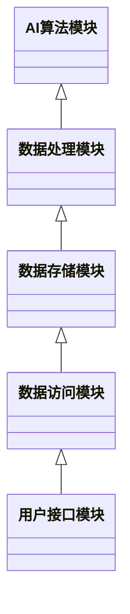
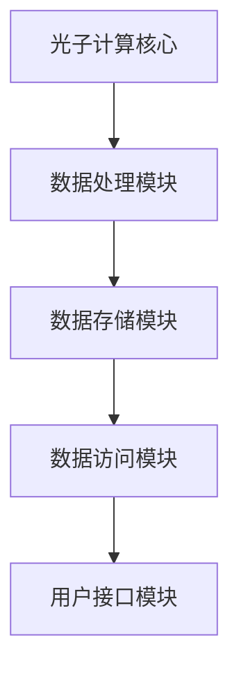

                 

# 光子计算在AI加速中的潜力

> 关键词：光子计算，AI加速，量子计算，算法，系统架构，未来趋势

> 摘要：本文将探讨光子计算在人工智能（AI）加速领域的潜力。通过分析光子计算的基本原理、优势与挑战，我们将其与AI加速技术相结合，探讨光子计算在图像识别、自然语言处理和语音识别等领域的应用实例。此外，本文还讨论了光子计算在AI加速中的关键挑战、实际应用案例和未来发展趋势，旨在为读者提供一个全面、深入的视角。

## 第一部分：光子计算基础

### 1.1 光子计算概述

#### 1.1.1 光子计算的定义

光子计算是一种基于光子（即光粒子）进行信息处理和传输的计算技术。与传统的电子计算相比，光子计算利用光子的天然并行性和低能耗特性，有望实现更高效、更节能的计算。

#### 1.1.2 光子计算的历史与发展

光子计算的概念最早可以追溯到20世纪60年代。随着光电子技术的发展，光子计算逐渐从理论走向实验。近年来，随着量子计算、光子集成电路和光子通信等领域的突破，光子计算迎来了新的发展机遇。

#### 1.1.3 光子计算与AI加速的联系

光子计算在AI加速中具有巨大的潜力。AI算法通常需要大量的数据处理和计算，而光子计算的高并行性和低能耗特性，可以有效提高AI算法的运算速度和降低能耗。

### 1.2 光子计算的优势与挑战

#### 1.2.1 光子计算的优势

- **高并行性**：光子计算可以利用光子的并行特性，实现大规模并行计算。
- **低能耗**：光子计算相比传统电子计算，具有更低的能耗。
- **高速传输**：光子的传播速度接近光速，可以实现高速数据传输。

#### 1.2.2 光子计算的挑战

- **光子器件集成**：目前光子器件的集成难度较大，限制了光子计算的发展。
- **光子计算算法**：现有的光子计算算法尚不完善，需要进一步研究和优化。

#### 1.2.3 光子计算与传统计算的对比

| 特性        | 光子计算         | 传统计算         |
| ----------- | ---------------- | ---------------- |
| 并行性      | 高               | 低               |
| 能耗        | 低               | 高               |
| 数据传输速度 | 高               | 低               |

### 1.3 光子计算的基本原理

#### 1.3.1 光子计算的基本概念

光子计算的基本概念包括光子、光子器件和光子网络。光子是光的基本单位，光子器件是光子计算的核心组件，光子网络则是光子计算的系统架构。

#### 1.3.2 光子计算的核心技术

光子计算的核心技术包括光子集成电路、光子开关和光子调制器。这些技术共同构成了光子计算的基础。

#### 1.3.3 光子计算与量子计算的异同

光子计算与量子计算都是下一代计算技术的代表。它们在基本原理和实现方式上存在一定差异：

- **基本原理**：光子计算基于光的波动性，量子计算基于量子力学原理。
- **实现方式**：光子计算利用光子进行信息处理，量子计算利用量子比特进行信息处理。

### 1.4 光子计算的应用场景

#### 1.4.1 数据中心

光子计算在数据中心的应用可以有效提高数据传输速度和降低能耗。

#### 1.4.2 云计算

光子计算在云计算领域具有巨大的潜力，可以提供更高效、更节能的计算服务。

#### 1.4.3 通信领域

光子计算在通信领域的应用，可以实现高速、低延迟的数据传输。

### 1.5 光子计算的未来发展趋势

#### 1.5.1 光子计算的发展前景

随着光电子技术和量子计算的发展，光子计算有望在未来实现大规模应用。

#### 1.5.2 光子计算的关键技术突破

光子器件的集成、光子计算算法和光子网络技术是光子计算的关键技术突破方向。

#### 1.5.3 光子计算在AI加速中的潜力

光子计算在AI加速中具有巨大的潜力，有望实现更高效、更节能的AI计算。

## 第二部分：光子计算在AI加速中的应用

### 2.1 光子计算在AI加速中的原理

#### 2.1.1 光子计算如何加速AI

光子计算通过高并行性和低能耗特性，可以实现更高效的AI计算。例如，在图像识别中，光子计算可以利用并行处理提高识别速度；在自然语言处理中，光子计算可以降低计算能耗。

#### 2.1.2 光子计算与传统AI加速方式的对比

与传统的CPU和GPU加速方式相比，光子计算具有更高的并行性和更低的能耗，从而在AI加速中具有更大的优势。

### 2.2 光子计算在AI加速中的应用实例

#### 2.2.1 图像识别

光子计算在图像识别中具有明显的优势。例如，在人脸识别任务中，光子计算可以实现更快的识别速度和更高的识别准确性。

#### 2.2.2 自然语言处理

在自然语言处理任务中，光子计算可以通过并行处理提高计算效率，从而实现更快速的语言理解和生成。

#### 2.2.3 语音识别

光子计算在语音识别中具有低延迟和高准确性的特点，适用于实时语音处理。

### 2.3 光子计算在AI加速中的关键挑战

#### 2.3.1 技术挑战

光子计算在AI加速中面临的技术挑战主要包括光子器件的集成、光子计算算法的优化和光子网络的构建。

#### 2.3.2 应用挑战

光子计算在AI加速中的应用挑战主要包括算法适配、系统优化和实际应用的可行性。

#### 2.3.3 未来发展方向

未来发展方向主要包括光子器件的集成、光子计算算法的创新和光子网络技术的突破。

### 2.4 光子计算在AI加速中的实际应用案例

#### 2.4.1 项目介绍

以某光子计算AI加速项目为例，介绍其系统功能设计、系统架构设计、系统接口设计和系统交互。

#### 2.4.2 系统功能设计

通过Mermaid类图展示系统功能设计。



#### 2.4.3 系统架构设计

通过Mermaid架构图展示系统架构设计。



#### 2.4.4 系统接口设计和系统交互

通过Mermaid序列图展示系统接口设计和系统交互。

```mermaid
sequence
    participant AI算法模块
    participant 数据处理模块
    participant 数据存储模块
    participant 数据访问模块
    participant 用户接口模块

    AI算法模块->>数据处理模块: 处理请求
    数据处理模块->>数据存储模块: 存储数据
    数据存储模块->>数据访问模块: 提供数据
    数据访问模块->>用户接口模块: 显示结果
```

### 2.5 光子计算在AI加速中的最佳实践

#### 2.5.1 环境安装

介绍光子计算AI加速环境安装过程。

#### 2.5.2 系统核心实现源代码

提供光子计算AI加速系统的核心实现源代码。

```python
# 数据处理模块实现
class DataProcessingModule:
    def process_data(self, data):
        # 处理数据
        pass

# 数据存储模块实现
class DataStorageModule:
    def store_data(self, data):
        # 存储数据
        pass

# 数据访问模块实现
class DataAccessModule:
    def access_data(self):
        # 访问数据
        pass

# 用户接口模块实现
class UserInterfaceModule:
    def display_result(self, result):
        # 显示结果
        pass
```

#### 2.5.3 代码应用解读与分析

对系统核心实现源代码进行解读和分析。

#### 2.5.4 实际案例分析和详细讲解剖析

通过实际案例分析光子计算AI加速系统的应用效果。

## 第三部分：光子计算与AI加速的未来发展

### 3.1 光子计算与AI加速的融合发展

#### 3.1.1 产业发展趋势

随着光电子技术和AI技术的快速发展，光子计算与AI加速的融合发展将成为产业趋势。

#### 3.1.2 技术融合的关键点

技术融合的关键点包括光子器件的集成、光子计算算法的创新和光子网络技术的突破。

#### 3.1.3 政策与标准

政策与标准对于光子计算与AI加速的融合发展具有重要影响。

### 3.2 光子计算在AI加速中的创新技术

#### 3.2.1 光子计算的新算法

光子计算的新算法主要包括基于光子并行性的算法和基于量子计算的算法。

#### 3.2.2 光子计算的新架构

光子计算的新架构主要包括基于光子集成电路的架构和基于光子网络的架构。

#### 3.2.3 光子计算的新材料

光子计算的新材料主要包括光子晶体、光子玻璃和光子掺杂半导体。

### 3.3 光子计算在AI加速中的应用前景

#### 3.3.1 应用领域拓展

光子计算在AI加速中的应用领域将继续拓展，包括自动驾驶、智能医疗和智能安防等。

#### 3.3.2 商业模式创新

光子计算在AI加速中的商业模式创新，将推动产业快速发展。

#### 3.3.3 社会与经济效益

光子计算在AI加速中的应用，将带来显著的社会与经济效益。

### 3.4 光子计算与AI加速的未来挑战与机遇

#### 3.4.1 挑战分析

光子计算与AI加速在未来将面临技术、应用和政策等方面的挑战。

#### 3.4.2 机遇展望

光子计算与AI加速在未来将迎来前所未有的发展机遇。

#### 3.4.3 应对策略

应对策略包括技术创新、产业协同和跨界合作。

### 3.5 小结与展望

#### 3.5.1 光子计算在AI加速中的发展历程

光子计算在AI加速中经历了从理论到实验，再到实际应用的历程。

#### 3.5.2 光子计算在AI加速中的关键成就

光子计算在AI加速中取得了多项关键成就。

#### 3.5.3 光子计算在AI加速中的未来发展方向

光子计算在AI加速中的未来发展方向包括技术创新、应用拓展和产业协同。

---

**作者：AI天才研究院/AI Genius Institute & 禅与计算机程序设计艺术 /Zen And The Art of Computer Programming**

