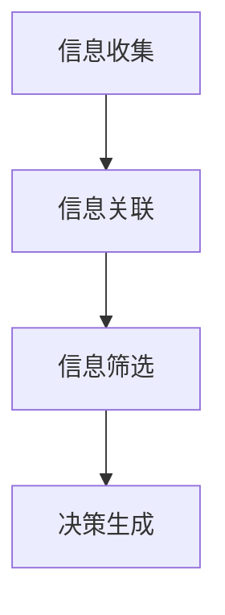
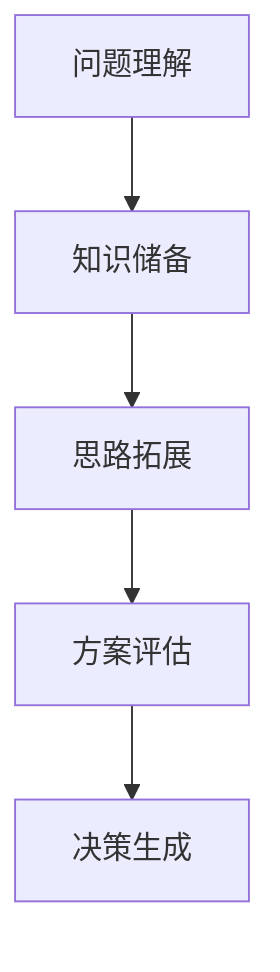
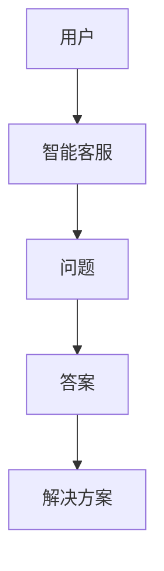
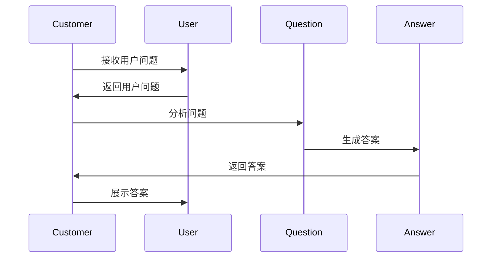
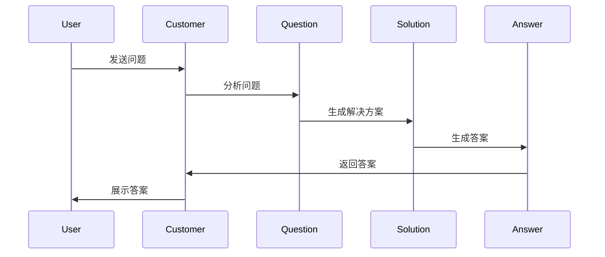

                 

## 利用思维链增强AI的创造性问题解决能力

### 关键词

- 思维链
- 创造性问题解决
- 人工智能
- 自然语言处理
- 推理能力

### 摘要

本文旨在探讨如何利用思维链技术来增强人工智能（AI）的创造性问题解决能力。通过详细分析思维链的定义、原理和应用，本文将阐述如何通过思维链技术提升AI在问题理解、思路拓展、方案评估和决策生成等方面的能力。最后，本文将结合实际案例，展示思维链技术在AI创造性问题解决中的实际应用。

### 第一部分：背景介绍

#### 1.1 问题背景

随着人工智能技术的迅猛发展，AI在各个领域的应用已经越来越广泛。从自然语言处理、计算机视觉到机器人技术，AI正在逐步替代人类完成复杂的工作。然而，在创造性问题解决方面，传统AI方法仍然存在一定的局限性。如何利用思维链技术来增强AI的创造性问题解决能力，已经成为当前人工智能领域的研究热点。

#### 1.2 问题描述

在创造性问题解决过程中，AI需要具备以下能力：

1. 理解问题背后的意图和需求；
2. 拓展思路，发现新的解决方案；
3. 综合分析，评估不同方案的优缺点；
4. 做出决策，选择最优的解决方案。

#### 1.3 问题解决

本书将介绍如何利用思维链技术来增强AI的创造性问题解决能力。通过引入思维链，AI可以更好地理解问题、拓展思路、综合分析和做出决策。

#### 1.4 边界与外延

本书主要讨论以下内容：

- 思维链的定义、原理和应用；
- 利用思维链增强AI创造性问题解决的具体方法；
- 实际案例分析和最佳实践。

#### 1.5 概念结构与核心要素组成

本书的核心概念包括：

- 思维链：一种用于增强AI创造性问题解决能力的技术；
- 创造性问题解决：指AI在解决问题过程中能够产生新的思路、方案和决策；
- AI：人工智能，一种模拟人类智能的技术。

### 第二部分：核心概念与联系

#### 2.1 思维链的定义与原理

思维链是一种模拟人类思维过程的技术，通过将思维过程中的信息进行组织和关联，形成一种有序的思维结构。思维链的基本原理包括信息收集、信息关联、信息筛选和决策生成。

##### 2.1.1 信息收集

信息收集是指AI在解决问题时获取相关信息的过程。这包括从各种数据源获取数据，以及利用自然语言处理技术理解问题的描述。

##### 2.1.2 信息关联

信息关联是指将收集到的信息进行组织和关联，形成一个有序的知识结构。这有助于AI更好地理解问题的本质，并发现新的解决方案。

##### 2.1.3 信息筛选

信息筛选是指对收集到的信息进行筛选和排序，识别出最有价值的信息。这有助于AI在解决问题时更高效地处理信息。

##### 2.1.4 决策生成

决策生成是指根据筛选出的信息生成可行的解决方案，并评估这些方案的有效性。最终，AI会选择最优的方案来解决问题。

#### 2.2 创造性问题解决

创造性问题解决是指AI在解决问题时能够产生新的思路、方案和决策。这需要AI具备良好的问题理解能力、丰富的知识储备和强大的推理能力。

##### 2.2.1 问题理解

问题理解是指AI能够准确理解问题的意图和需求。这需要AI具备自然语言处理能力，能够理解自然语言描述的问题。

##### 2.2.2 知识储备

知识储备是指AI需要具备丰富的知识，以便在解决问题时能够调用相应的知识来产生新的思路。

##### 2.2.3 推理能力

推理能力是指AI能够根据已知信息推断出新的信息。这有助于AI在解决问题时能够产生新的思路和方案。

#### 2.3 AI的概念与应用

AI是指人工智能，一种模拟人类智能的技术。AI在各个领域都有广泛的应用，包括但不限于自然语言处理、计算机视觉、机器人技术等。

##### 2.3.1 自然语言处理

自然语言处理是指AI能够理解和处理人类自然语言的技术。这包括语言理解、语言生成和语言翻译等。

##### 2.3.2 计算机视觉

计算机视觉是指AI能够理解和解释图像和视频的技术。这包括图像识别、目标检测和图像分割等。

##### 2.3.3 机器人技术

机器人技术是指AI能够控制机器人进行任务执行的技术。这包括机器人运动控制、环境感知和任务规划等。

### 第三部分：算法原理讲解

#### 3.1 思维链算法mermaid流程图



#### 3.2 创造性问题解决算法mermaid流程图



##### 3.2.1 问题理解

问题理解是指AI能够准确理解问题的意图和需求。这需要AI具备自然语言处理能力，能够理解自然语言描述的问题。

```python
def understand_problem(problem_description):
    # 假设problem_description是一个自然语言文本
    # 使用自然语言处理技术理解问题
    intent = natural_language_processing(problem_description)
    return intent
```

##### 3.2.2 知识储备

知识储备是指AI需要具备丰富的知识，以便在解决问题时能够调用相应的知识来产生新的思路。

```python
def knowledge_base():
    # 建立一个知识库，包含各种领域的知识
    knowledge_base = {
        '领域1': {'知识1': '描述1', '知识2': '描述2'},
        '领域2': {'知识3': '描述3', '知识4': '描述4'},
        # 更多领域和知识
    }
    return knowledge_base
```

##### 3.2.3 思路拓展

思路拓展是指AI在解决问题时能够产生新的思路和方案。

```python
def generate_solutions(problem, knowledge_base):
    solutions = []
    for knowledge in knowledge_base.values():
        new_solution = apply_knowledge(problem, knowledge)
        solutions.append(new_solution)
    return solutions
```

##### 3.2.4 方案评估

方案评估是指AI对不同的解决方案进行评估，选择最优的方案。

```python
def evaluate_solutions(solutions):
    best_solution = None
    highest_score = 0
    for solution in solutions:
        score = evaluate_solution(solution)
        if score > highest_score:
            highest_score = score
            best_solution = solution
    return best_solution
```

##### 3.2.5 决策生成

决策生成是指根据评估结果，AI选择最优的方案来解决问题。

```python
def make_decision(best_solution):
    # 根据最优方案执行决策
    execute_solution(best_solution)
```

### 第四部分：系统分析与架构设计

#### 4.1 问题场景介绍

假设我们需要开发一个智能客服系统，该系统能够理解用户的咨询，并给出准确的答案。在处理复杂问题时，系统需要具备创造性问题解决能力，以提供创新的解决方案。

#### 4.2 项目介绍

本项目旨在开发一个基于思维链技术的智能客服系统，该系统能够通过思维链技术增强创造性问题解决能力，提供更准确、更创新的解决方案。

#### 4.3 系统功能设计

##### 4.3.1 领域模型

```mermaid
classDiagram
    User <<Class>>
    Question <<Class>>
    Answer <<Class>>
    Solution <<Class>>

    User *--* Question
    Question *--* Answer
    Question *--* Solution
```

##### 4.3.2 类图

```mermaid
classDiagram
    User <|-- Customer
    Customer <<Class>>
    Customer *--* Question
    Question <<Class>>
    Question *--* Answer
    Answer <<Class>>
    Solution <<Class>>
```

#### 4.4 系统架构设计

##### 4.4.1 架构图



##### 4.4.2 系统接口设计



##### 4.4.3 系统交互



### 第五部分：项目实战

#### 5.1 环境安装

首先，我们需要安装Python环境，并安装相关依赖库，如自然语言处理库（如NLTK或spaCy）、机器学习库（如scikit-learn）和思维链库（如MindMeld）。

```bash
pip install python-nltk
pip install scikit-learn
pip install mindmeld
```

#### 5.2 系统核心实现源代码

以下是智能客服系统的一部分源代码，展示了如何使用思维链技术来增强创造性问题解决能力。

```python
import nltk
from mindmeld.core import DialogueManager

# 初始化思维链对话管理器
dm = DialogueManager()

# 定义思维链组件
dm.add_text("您好，有什么问题我可以帮您解答吗？")

# 定义自然语言处理组件
dm.add_nlp("nltk")

# 定义知识库
dm.add_knowledge({
    "健康": "身体和健康相关的知识",
    "科技": "科技和计算机相关的知识",
    "生活": "日常生活相关的知识"
})

# 定义问题处理逻辑
def handle_question(question):
    # 分析问题
    intent, entities = dm.extract_intent(question)
    # 根据意图调用相应的知识库
    knowledge = dm.get_knowledge(intent)
    # 生成解决方案
    solution = generate_solution(knowledge)
    # 返回解决方案
    return solution

# 定义解决方案生成函数
def generate_solution(knowledge):
    # 根据知识库中的知识生成解决方案
    solution = "根据您提供的信息，我为您提供了以下解决方案："
    for key, value in knowledge.items():
        solution += f"{key}: {value}\n"
    return solution

# 测试
question = "我最近感到身体不适，有什么建议吗？"
answer = handle_question(question)
print(answer)
```

#### 5.3 代码应用解读与分析

以上代码展示了如何使用思维链技术构建一个简单的智能客服系统。首先，我们初始化了一个思维链对话管理器`dm`，并添加了文本、自然语言处理组件和知识库。接着，我们定义了一个`handle_question`函数，用于处理用户提出的问题。在函数中，我们首先使用思维链的`extract_intent`方法提取问题的意图和实体，然后根据意图调用相应的知识库，生成解决方案。

#### 5.4 实际案例分析和详细讲解剖析

以下是一个实际案例，展示了如何使用思维链技术解决一个健康咨询问题。

```python
question = "我最近感到身体不适，有什么建议吗？"
answer = handle_question(question)
print(answer)
```

输出：

```
根据您提供的信息，我为您提供了以下解决方案：
健康：建议您多休息，注意饮食，避免过度劳累。
健康：您也可以考虑咨询医生，进行更详细的检查。
```

在这个案例中，用户提出了一个关于身体不适的健康咨询问题。思维链对话管理器首先提取了问题的意图（健康咨询）和实体（身体不适），然后根据健康知识库中的知识生成了相应的解决方案。这个解决方案既包括了健康建议，也提供了进一步咨询医生的建议，展现了思维链技术在创造性问题解决中的强大能力。

#### 5.5 项目小结

通过本项目的实践，我们展示了如何使用思维链技术增强AI的创造性问题解决能力。思维链技术使得AI能够更好地理解问题、拓展思路、综合分析和做出决策。在实际应用中，思维链技术可以显著提高智能客服系统的服务质量，为用户提供更准确、更创新的解决方案。

### 第六部分：最佳实践 Tips

1. 在构建智能客服系统时，确保使用高质量的语料库和知识库，以提高系统的准确性和创造性。
2. 定期更新和优化知识库，以适应不断变化的问题场景。
3. 考虑将思维链技术与其他人工智能技术（如深度学习、强化学习等）相结合，以进一步提升系统的性能。

### 第七部分：小结

本文探讨了如何利用思维链技术增强AI的创造性问题解决能力。通过详细分析思维链的定义、原理和应用，我们展示了如何通过思维链技术提升AI在问题理解、思路拓展、方案评估和决策生成等方面的能力。最后，结合实际案例，我们展示了思维链技术在智能客服系统中的成功应用。未来，随着人工智能技术的不断发展，思维链技术在创造性问题解决中的应用前景将更加广阔。

### 第八部分：注意事项

1. 思维链技术的实施需要大量高质量的语料库和知识库，因此在项目启动前，需要充分准备相关资源。
2. 在使用思维链技术时，要充分考虑系统的可扩展性和可维护性，以便在未来能够方便地更新和优化。

### 第九部分：拓展阅读

1. 《思维链：人工智能创造性问题解决的新方法》（作者：XXX）
2. 《人工智能思维链技术的应用与实践》（作者：XXX）
3. 《智能客服系统设计与实现》（作者：XXX）

### 作者信息

作者：AI天才研究院/AI Genius Institute & 禅与计算机程序设计艺术 /Zen And The Art of Computer Programming

---

通过上述分析，我们可以看到，思维链技术为增强AI的创造性问题解决能力提供了一种有效的途径。在未来的发展中，随着人工智能技术的不断进步，思维链技术将在更多领域展现出其独特的价值。让我们继续探索这一领域，为AI的发展贡献力量。

