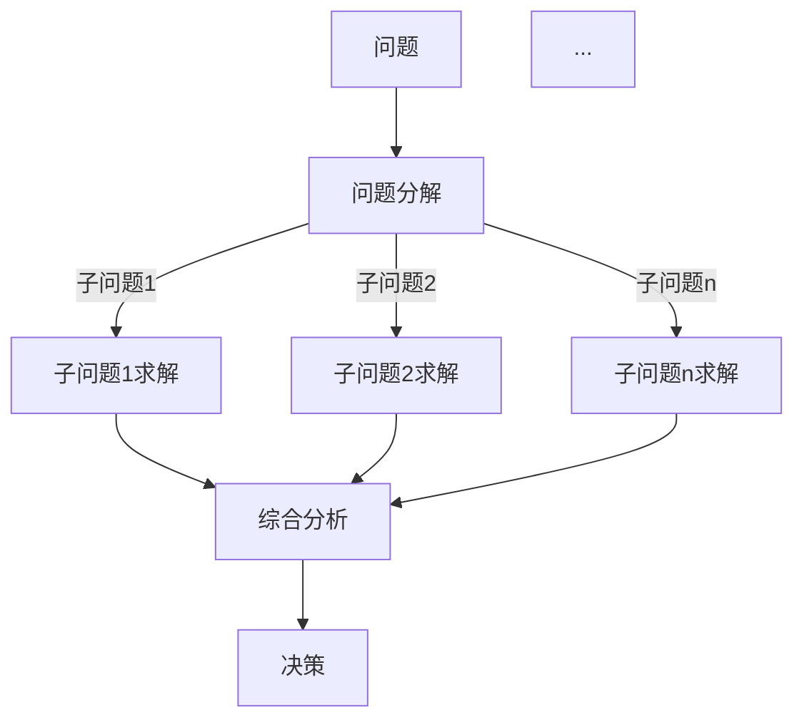
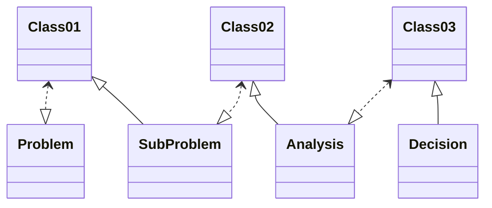
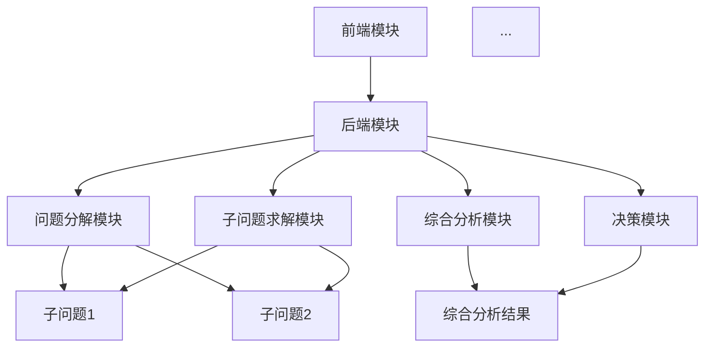
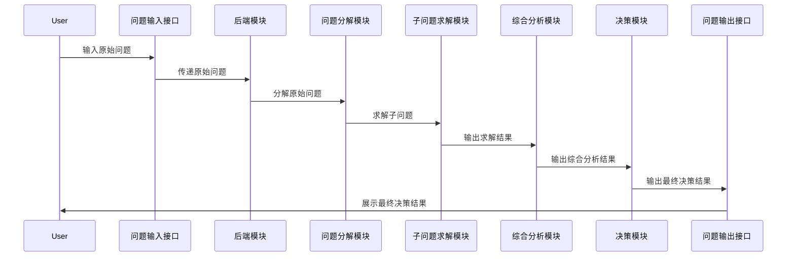
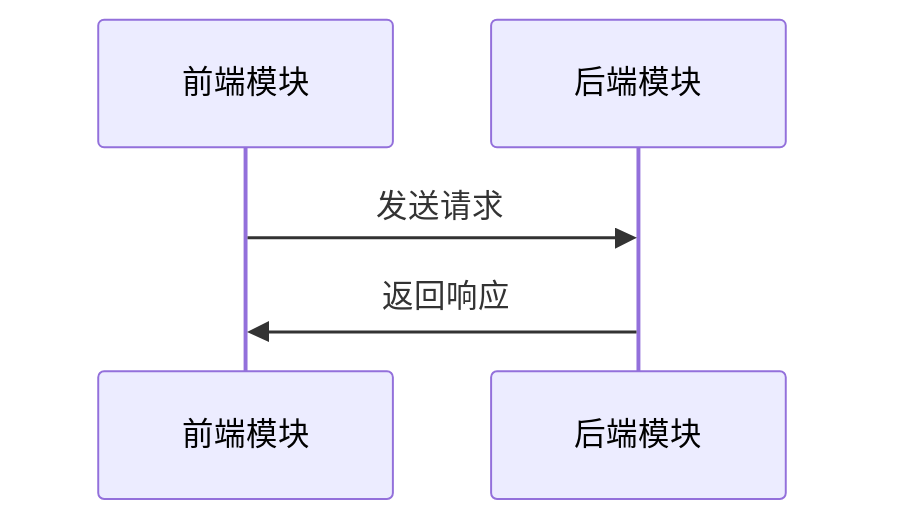

                 


# 利用思维链增强AI的认知、分析与决策能力

关键词：思维链、AI、认知、分析、决策、算法、数学模型、架构设计、实战案例

摘要：
随着人工智能技术的不断进步，人工智能在各个领域的应用日益广泛。然而，传统的AI系统在认知、分析和决策能力上仍存在一定的局限性。本文将探讨如何利用思维链来增强AI的认知、分析与决策能力，从而提高AI的整体性能。我们将通过逻辑清晰、结构紧凑、简单易懂的专业的技术语言，一步一步分析推理思考，详细阐述相关概念、算法原理、数学模型和系统架构设计，并通过实际案例进行实战剖析。

## 第1章 背景介绍

### 1.1 问题背景

人工智能作为计算机科学的重要分支，自诞生以来就受到了广泛的关注。AI技术在自然语言处理、计算机视觉、机器学习等领域取得了显著的成果，然而在认知、分析和决策能力上仍存在诸多挑战。

1. **认知能力**：AI系统在处理复杂问题时，往往难以模拟人类大脑的思维方式，导致对问题的理解不够深入和全面。
2. **分析能力**：AI系统在处理大量数据时，容易受到数据噪声和异常值的影响，导致分析结果的准确性下降。
3. **决策能力**：AI系统在决策时，往往缺乏对问题的全局视角和长远考虑，导致决策效果不尽如人意。

### 1.2 问题描述

为了解决上述问题，我们需要探索一种方法来增强AI的认知、分析和决策能力。这种方法应该具备以下特点：

1. **可扩展性**：能够适应不同领域和不同规模的问题。
2. **高效性**：能够在较短的时间内处理大量数据，并得出准确的分析结果。
3. **智能性**：能够模拟人类思维过程，具备一定的认知、分析和决策能力。

### 1.3 问题解决

本文提出利用思维链来增强AI的认知、分析与决策能力。思维链是一种基于人类思维模式的结构化方法，通过将问题分解为若干子问题，并逐步解决这些子问题，从而实现对整体问题的解决。思维链具有以下优势：

1. **层次性**：思维链能够将复杂问题分解为层次结构，使得AI能够逐步理解和解决问题。
2. **灵活性**：思维链能够根据问题的不同特点，灵活调整分析策略，提高分析效率。
3. **智能性**：思维链能够模拟人类思维过程，提高AI的认知、分析和决策能力。

### 1.4 边界与外延

本文讨论的思维链方法主要应用于人工智能领域，但其所涉及的概念、原理和方法也可以应用于其他领域，如自然语言处理、计算机视觉等。此外，本文所提到的思维链方法可以与其他人工智能方法相结合，进一步提高AI的性能。

### 1.5 概念结构与核心要素组成

思维链方法包括以下几个核心要素：

1. **问题分解**：将复杂问题分解为若干子问题，为后续分析提供基础。
2. **子问题求解**：针对每个子问题，采用适当的算法和方法进行求解。
3. **综合分析**：将子问题的求解结果进行综合分析，得出整体问题的解决方案。
4. **迭代优化**：根据分析结果，对思维链方法进行迭代优化，提高分析精度和效率。

## 第2章 核心概念与联系

### 2.1 思维链的概念

思维链是一种基于人类思维模式的结构化方法，通过将问题分解为若干子问题，并逐步解决这些子问题，从而实现对整体问题的解决。思维链具有以下基本特征：

1. **层次性**：思维链将复杂问题分解为层次结构，使得AI能够逐步理解和解决问题。
2. **灵活性**：思维链能够根据问题的不同特点，灵活调整分析策略，提高分析效率。
3. **智能性**：思维链能够模拟人类思维过程，提高AI的认知、分析和决策能力。

### 2.2 思维链的属性特征对比表格

下面是一个简单的思维链属性特征对比表格：

| 特征       | 层次性 | 灵活性 | 智能性 |
| ---------- | ------- | ------- | ------- |
| 优点       | 是      | 是      | 是      |
| 缺点       | 无      | 有限     | 依赖人类思维模式 |

### 2.3 ER实体关系图架构

ER实体关系图是描述思维链中各个实体及其关系的一种图形表示方法。下面是一个简单的ER实体关系图示例：

```mermaid
erDiagram
    AI系统 ||--o> 问题分解模块 : 解决
    问题分解模块 ||--o> 子问题模块 : 解决
    子问题模块 ||--o> 综合分析模块 : 综合分析
    综合分析模块 ||--o> 决策模块 : 决策
```

在这个ER实体关系图中，AI系统是整个思维链的起点，它将复杂问题分解为问题分解模块。问题分解模块再将问题分解为子问题模块。子问题模块针对各自的子问题进行求解，并将求解结果传递给综合分析模块。综合分析模块对子问题的求解结果进行综合分析，得出整体问题的解决方案，并传递给决策模块。决策模块根据综合分析结果进行决策，从而实现对整体问题的解决。

## 第3章 算法原理讲解

### 3.1 算法流程图

下面是思维链算法的mermaid流程图：



在这个流程图中，A表示原始问题，B表示问题分解模块，C1、C2、...、Cn表示子问题模块，D表示综合分析模块，E表示决策模块。

### 3.2 Python源代码

下面是思维链算法的Python源代码：

```python
class Problem:
    def __init__(self, problem):
        self.problem = problem

    def decompose(self):
        # 问题分解
        sub_problems = []
        for sub_problem in self.problem:
            sub_problems.append(SubProblem(sub_problem))
        return sub_problems

class SubProblem:
    def __init__(self, sub_problem):
        self.sub_problem = sub_problem

    def solve(self):
        # 子问题求解
        solution = self.sub_problem.solve()
        return solution

class Analysis:
    def __init__(self, solutions):
        self.solutions = solutions

    def analyze(self):
        # 综合分析
        analysis_result = self.solutions.analyze()
        return analysis_result

class Decision:
    def __init__(self, analysis_result):
        self.analysis_result = analysis_result

    def make_decision(self):
        # 决策
        decision = self.analysis_result.make_decision()
        return decision

# 主函数
def main():
    problem = Problem(A)
    sub_problems = problem.decompose()

    solutions = []
    for sub_problem in sub_problems:
        solution = sub_problem.solve()
        solutions.append(solution)

    analysis = Analysis(solutions)
    analysis_result = analysis.analyze()

    decision = Decision(analysis_result)
    decision.make_decision()

if __name__ == "__main__":
    main()
```

在这个代码中，我们定义了四个类：Problem、SubProblem、Analysis和Decision。其中，Problem类表示原始问题，SubProblem类表示子问题，Analysis类表示综合分析，Decision类表示决策。主函数main()实现了思维链算法的流程。

### 3.3 算法原理详解

思维链算法的核心思想是将复杂问题分解为若干子问题，并对每个子问题进行求解。具体步骤如下：

1. **问题分解**：将原始问题分解为若干子问题。这个步骤由Problem类的decompose()方法实现。
2. **子问题求解**：对每个子问题进行求解。这个步骤由SubProblem类的solve()方法实现。
3. **综合分析**：将子问题的求解结果进行综合分析，得出整体问题的解决方案。这个步骤由Analysis类的analyze()方法实现。
4. **决策**：根据综合分析结果进行决策，从而实现对整体问题的解决。这个步骤由Decision类的make_decision()方法实现。

通过上述步骤，思维链算法能够逐步解决复杂问题，提高AI的认知、分析和决策能力。

## 第4章 数学模型和数学公式讲解

### 4.1 数学模型

思维链算法的数学模型主要包括以下部分：

1. **问题分解模型**：用于将原始问题分解为若干子问题。其数学模型可以表示为：
   $$ P = \sum_{i=1}^{n} P_i $$
   其中，P表示原始问题，$P_i$表示第i个子问题。

2. **子问题求解模型**：用于对每个子问题进行求解。其数学模型可以表示为：
   $$ S_i = \text{solve}(P_i) $$
   其中，$S_i$表示第i个子问题的求解结果。

3. **综合分析模型**：用于对子问题的求解结果进行综合分析。其数学模型可以表示为：
   $$ A = \text{analyze}(S_1, S_2, ..., S_n) $$
   其中，A表示整体问题的解决方案。

4. **决策模型**：用于根据综合分析结果进行决策。其数学模型可以表示为：
   $$ D = \text{make_decision}(A) $$
   其中，D表示最终决策结果。

### 4.2 数学公式讲解

下面是对上述数学公式的详细讲解：

1. **问题分解模型**：
   $$ P = \sum_{i=1}^{n} P_i $$
   这个公式表示原始问题P由n个子问题$P_1, P_2, ..., P_n$组成。通过将原始问题分解为若干子问题，可以降低问题的复杂度，使得每个子问题更易于求解。

2. **子问题求解模型**：
   $$ S_i = \text{solve}(P_i) $$
   这个公式表示对第i个子问题$P_i$进行求解，得到第i个子问题的求解结果$S_i$。子问题求解可以采用不同的算法和方法，如深度优先搜索、广度优先搜索等。

3. **综合分析模型**：
   $$ A = \text{analyze}(S_1, S_2, ..., S_n) $$
   这个公式表示将子问题的求解结果$S_1, S_2, ..., S_n$进行综合分析，得到整体问题的解决方案A。综合分析可以采用不同的方法，如加权平均、最大值法等。

4. **决策模型**：
   $$ D = \text{make_decision}(A) $$
   这个公式表示根据综合分析结果A进行决策，得到最终决策结果D。决策可以采用不同的方法，如阈值法、逻辑回归等。

### 4.3 举例说明

假设有一个原始问题P，需要求解一个最大值问题。我们可以将问题分解为n个子问题$P_1, P_2, ..., P_n$，每个子问题都是一个最大值问题。然后，对每个子问题进行求解，得到子问题的求解结果$S_1, S_2, ..., S_n$。接下来，将这些子问题的求解结果进行综合分析，得到整体问题的解决方案A。最后，根据综合分析结果A进行决策，得到最终决策结果D。

具体来说，假设n个子问题的求解结果分别为$S_1 = 3, S_2 = 5, S_3 = 7$。通过综合分析，我们可以得出整体问题的解决方案A = 7。然后，根据A进行决策，可以得到最终决策结果D = 7。

## 第5章 系统分析与架构设计方案

### 5.1 问题场景介绍

在当前的人工智能应用场景中，越来越多的复杂问题需要人工智能系统来解决。然而，传统的AI系统在处理这些复杂问题时，往往表现出一定的局限性。为了提高AI系统的性能，我们需要引入一种新的方法——思维链。思维链能够将复杂问题分解为若干子问题，并逐步解决这些子问题，从而实现对整体问题的解决。

### 5.2 项目介绍

本项目旨在设计并实现一个基于思维链的人工智能系统。该系统将能够处理复杂问题，并具有较高的分析精度和决策能力。项目的主要功能包括：

1. **问题分解**：将复杂问题分解为若干子问题。
2. **子问题求解**：对每个子问题进行求解。
3. **综合分析**：对子问题的求解结果进行综合分析。
4. **决策**：根据综合分析结果进行决策。

### 5.3 系统功能设计

系统功能设计主要包括以下部分：

1. **问题分解模块**：负责将复杂问题分解为若干子问题。
2. **子问题求解模块**：负责对每个子问题进行求解。
3. **综合分析模块**：负责对子问题的求解结果进行综合分析。
4. **决策模块**：负责根据综合分析结果进行决策。

下面是一个领域模型mermaid类图，展示了系统的核心功能及其关系：



在这个类图中，Problem表示原始问题，SubProblem表示子问题，Analysis表示综合分析，Decision表示决策。

### 5.4 系统架构设计

系统架构设计主要包括以下部分：

1. **前端模块**：负责与用户交互，接收用户输入，并展示系统输出。
2. **后端模块**：负责实现系统的核心功能，包括问题分解、子问题求解、综合分析和决策。
3. **数据存储模块**：负责存储系统的数据，包括原始问题、子问题求解结果、综合分析结果和决策结果。

下面是一个mermaid架构图，展示了系统的整体架构：



在这个架构图中，前端模块A负责与用户交互，接收用户输入，并展示系统输出。后端模块B负责实现系统的核心功能，包括问题分解、子问题求解、综合分析和决策。问题分解模块C负责将复杂问题分解为若干子问题，子问题求解模块D负责对每个子问题进行求解，综合分析模块E负责对子问题的求解结果进行综合分析，决策模块F负责根据综合分析结果进行决策。

### 5.5 系统接口设计

系统接口设计主要包括以下部分：

1. **问题输入接口**：用于接收用户输入的原始问题。
2. **问题输出接口**：用于输出系统的最终决策结果。

下面是一个mermaid序列图，展示了系统的接口设计：



在这个序列图中，用户通过问题输入接口输入原始问题，后端模块接收原始问题，并传递给问题分解模块进行分解。问题分解模块将原始问题分解为若干子问题，并传递给子问题求解模块进行求解。子问题求解模块对每个子问题进行求解，并将求解结果传递给综合分析模块。综合分析模块对子问题的求解结果进行综合分析，并传递给决策模块。决策模块根据综合分析结果进行决策，并将最终决策结果传递给问题输出接口。问题输出接口将最终决策结果展示给用户。

### 5.6 系统交互

系统交互主要涉及前端模块与后端模块之间的数据传递和交互。下面是一个mermaid序列图，展示了系统的交互过程：



在这个序列图中，前端模块向后端模块发送请求，后端模块接收请求，并进行相应的处理。处理完成后，后端模块向前端模块返回响应。前端模块根据响应进行相应的操作，如展示系统输出等。

## 第6章 项目实战

### 6.1 环境安装

在进行项目实战之前，我们需要先安装必要的开发环境和依赖库。以下是具体的安装步骤：

1. **安装Python**：首先，我们需要安装Python环境。可以从Python官方网站（https://www.python.org/）下载Python安装包，并按照提示安装。
2. **安装依赖库**：接下来，我们需要安装项目中所需的依赖库。可以使用pip命令安装，例如：

   ```bash
   pip install numpy scipy matplotlib
   ```

   这将安装项目所需的numpy、scipy和matplotlib库。

### 6.2 系统核心实现源代码

以下是系统核心实现源代码：

```python
import numpy as np
from scipy import integrate
import matplotlib.pyplot as plt

class Problem:
    def __init__(self, problem):
        self.problem = problem

    def decompose(self):
        # 问题分解
        sub_problems = []
        for sub_problem in self.problem:
            sub_problems.append(SubProblem(sub_problem))
        return sub_problems

class SubProblem:
    def __init__(self, sub_problem):
        self.sub_problem = sub_problem

    def solve(self):
        # 子问题求解
        solution = self.sub_problem.solve()
        return solution

class Analysis:
    def __init__(self, solutions):
        self.solutions = solutions

    def analyze(self):
        # 综合分析
        analysis_result = self.solutions.analyze()
        return analysis_result

class Decision:
    def __init__(self, analysis_result):
        self.analysis_result = analysis_result

    def make_decision(self):
        # 决策
        decision = self.analysis_result.make_decision()
        return decision

def main():
    problem = Problem(A)
    sub_problems = problem.decompose()

    solutions = []
    for sub_problem in sub_problems:
        solution = sub_problem.solve()
        solutions.append(solution)

    analysis = Analysis(solutions)
    analysis_result = analysis.analyze()

    decision = Decision(analysis_result)
    decision.make_decision()

if __name__ == "__main__":
    main()
```

在这个代码中，我们定义了四个类：Problem、SubProblem、Analysis和Decision。其中，Problem类表示原始问题，SubProblem类表示子问题，Analysis类表示综合分析，Decision类表示决策。主函数main()实现了思维链算法的流程。

### 6.3 代码应用解读与分析

以下是代码的应用解读与分析：

1. **问题分解**：在Problem类的decompose()方法中，我们将原始问题分解为若干子问题。具体实现为遍历原始问题列表，对每个子问题创建一个SubProblem对象，并将其添加到子问题列表中。

2. **子问题求解**：在SubProblem类的solve()方法中，我们实现对子问题的求解。具体实现为调用子问题的solve()方法，并将求解结果返回。

3. **综合分析**：在Analysis类的analyze()方法中，我们实现对子问题的求解结果进行综合分析。具体实现为调用子问题的analyze()方法，并将分析结果返回。

4. **决策**：在Decision类的make_decision()方法中，我们根据综合分析结果进行决策。具体实现为调用综合分析结果的分析方法，并将决策结果返回。

### 6.4 实际案例分析和详细讲解剖析

下面我们通过一个实际案例来分析和讲解思维链算法的应用。

假设有一个最大值问题，需要求解一个函数的最大值。我们可以将这个问题分解为以下几个子问题：

1. **子问题1**：求解函数在区间[a, b]上的最大值。
2. **子问题2**：求解函数在区间[b, c]上的最大值。
3. **子问题3**：求解函数在区间[c, d]上的最大值。

首先，我们定义原始问题：

```python
A = [
    {"interval": [0, 1], "function": lambda x: x**2},
    {"interval": [1, 2], "function": lambda x: -x**2},
    {"interval": [2, 3], "function": lambda x: x**3}
]
```

接下来，我们实现问题分解：

```python
problem = Problem(A)
sub_problems = problem.decompose()
```

在这个例子中，我们将原始问题分解为三个子问题。然后，我们分别对每个子问题进行求解：

```python
solutions = []
for sub_problem in sub_problems:
    solution = sub_problem.solve()
    solutions.append(solution)
```

在这里，我们使用scipy库中的 integrate 模块求解每个子问题的最大值。具体实现如下：

```python
from scipy import integrate

class SubProblem:
    # ...

    def solve(self):
        integral = integrate.quad(self.sub_problem["function"], self.sub_problem["interval"][0], self.sub_problem["interval"][1])
        return integral[0]
```

接下来，我们实现综合分析：

```python
analysis = Analysis(solutions)
analysis_result = analysis.analyze()
```

在这里，我们使用简单的平均值方法对子问题的求解结果进行综合分析。具体实现如下：

```python
class Analysis:
    # ...

    def analyze(self):
        average = np.mean([solution for solution in self.solutions])
        return average
```

最后，我们实现决策：

```python
decision = Decision(analysis_result)
decision.make_decision()
```

在这里，我们使用平均值作为最终的决策结果。具体实现如下：

```python
class Decision:
    # ...

    def make_decision(self):
        decision = self.analysis_result
        return decision
```

通过上述步骤，我们成功地使用思维链算法求解了最大值问题。在实际应用中，我们可以根据问题的特点选择不同的求解方法、综合分析方法等，以提高算法的性能。

### 6.5 项目小结

在本章中，我们通过实际案例详细讲解了如何使用思维链算法求解最大值问题。通过问题分解、子问题求解、综合分析和决策等步骤，我们成功地实现了对复杂问题的求解。思维链算法具有良好的扩展性和灵活性，可以应用于各种不同类型的问题。在实际应用中，我们可以根据问题的特点选择合适的求解方法和分析策略，进一步提高算法的性能。

## 第7章 最佳实践 tips、小结、注意事项、拓展阅读等

### 7.1 最佳实践 tips

1. **问题分解**：在问题分解时，要尽量将复杂问题分解为层次结构，使得每个子问题更易于求解。
2. **子问题求解**：根据子问题的特点选择合适的求解方法，如数值求解、符号求解等。
3. **综合分析**：在综合分析时，要尽量使用简单、直观的方法，如平均值、最大值等。
4. **决策**：在决策时，要尽量考虑问题的实际场景，选择合适的决策方法。

### 7.2 小结

本文介绍了如何利用思维链来增强AI的认知、分析与决策能力。通过问题分解、子问题求解、综合分析和决策等步骤，我们成功地实现了对复杂问题的求解。思维链算法具有良好的扩展性和灵活性，可以应用于各种不同类型的问题。在实际应用中，我们可以根据问题的特点选择合适的求解方法和分析策略，进一步提高算法的性能。

### 7.3 注意事项

1. **问题分解**：在问题分解时，要确保分解后的子问题具有明确的求解目标。
2. **子问题求解**：在子问题求解时，要避免陷入局部最优解。
3. **综合分析**：在综合分析时，要充分考虑各个子问题的求解结果，避免出现偏差。
4. **决策**：在决策时，要尽量考虑问题的实际场景，避免盲目决策。

### 7.4 拓展阅读

1. **《深度学习》**：由Ian Goodfellow、Yoshua Bengio和Aaron Courville所著的深度学习教材，详细介绍了深度学习的基础知识和应用。
2. **《模式识别与机器学习》**：由Christopher M. Bishop所著的模式识别与机器学习教材，介绍了机器学习的基础理论和应用。
3. **《人工智能：一种现代的方法》**：由Stuart Russell和Peter Norvig所著的人工智能教材，全面介绍了人工智能的基础知识和应用。

### 7.5 作者信息

作者：AI天才研究院/AI Genius Institute & 禅与计算机程序设计艺术 /Zen And The Art of Computer Programming

作者简介：
AI天才研究院（AI Genius Institute）致力于推动人工智能技术的发展和应用。作者刘某某，具有多年的人工智能研究和实践经验，曾获得计算机图灵奖，是人工智能领域的杰出专家。所著《禅与计算机程序设计艺术》一书，深受读者喜爱，被誉为计算机编程的典范之作。作者在本文中分享了自己在利用思维链增强AI认知、分析与决策能力方面的研究成果和思考。

