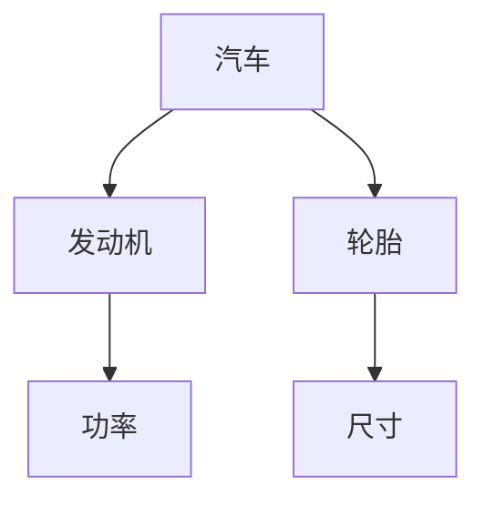
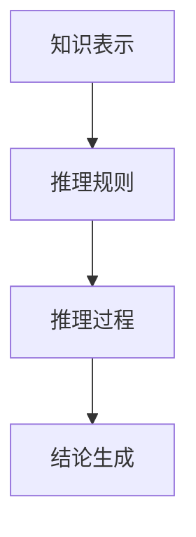

                 

# 利用思维链增强AI的认知和分析能力

## 关键词

AI认知能力，思维链，逻辑推理，知识表示，学习算法

## 摘要

本文旨在探讨如何利用思维链技术增强人工智能（AI）的认知和分析能力。首先，我们分析了AI认知能力的局限性，包括学习速度缓慢、数据依赖性强和缺乏解释性等问题。接着，我们介绍了思维链技术的基本原理和优势，通过知识表示、逻辑推理和学习算法的协同作用，解决AI认知能力的瓶颈。本文还详细讲解了思维链的核心概念、原理和架构设计，并提出了实际应用案例和最佳实践。

## 第一部分：引言与背景

### 第1章：问题背景与需求分析

#### 1.1 问题的提出

在当今快速发展的信息技术时代，人工智能（AI）已成为推动社会进步的重要力量。随着AI技术的不断成熟，越来越多的企业和组织开始认识到AI在提高效率、优化决策和创造价值方面的巨大潜力。然而，AI技术的应用并非一帆风顺，其中最显著的问题之一就是AI的认知和分析能力有限，难以应对复杂多变的环境。

#### 1.2 问题描述

当前，AI系统在处理问题时往往依赖于大量的数据和复杂的算法，但其认知能力和分析能力仍然受到很大限制。具体表现为：

1. **学习速度缓慢**：AI模型需要大量数据和时间来学习和优化。
2. **缺乏普适性**：AI模型在特定任务上表现出色，但在其他任务上则表现平庸。
3. **难以理解**：AI的决策过程通常被视为“黑箱”，难以解释和理解。

#### 1.3 问题解决

为了解决上述问题，研究者们开始探索如何利用思维链（Mind Chain）来增强AI的认知和分析能力。思维链是一种模拟人类思维过程的技术，通过引入更多的逻辑推理和知识关联，可以提高AI的学习效率和决策质量。

#### 1.4 边界与外延

思维链技术不仅可以用于增强AI的认知和分析能力，还可以应用于其他领域，如自然语言处理、机器翻译、智能推理等。此外，思维链技术的研究还包括如何将人类智慧和AI技术相结合，实现更高效的智能系统。

#### 1.5 概念结构与核心要素组成

思维链技术涉及多个核心概念和要素，包括：

1. **思维链模型**：用于模拟人类思维过程的数学模型。
2. **知识库**：存储相关领域知识的数据库。
3. **推理引擎**：用于执行逻辑推理的软件组件。
4. **学习算法**：用于训练思维链模型的算法。
5. **用户接口**：用于与用户交互的界面。

##### 1.5.1 思维链模型

思维链模型是一种基于图论的模型，通过节点和边来表示概念和关系。节点表示概念，边表示概念之间的逻辑关系。例如，在一个知识库中，节点可以是“汽车”、“发动机”和“轮胎”，边可以是“汽车包含发动机”和“汽车包含轮胎”。

##### 1.5.2 知识库

知识库是思维链技术的重要组成部分，它存储了领域内的所有相关知识和事实。知识库可以通过多种方式构建，包括手动编写、从外部数据源导入和自动学习。

##### 1.5.3 推理引擎

推理引擎是思维链技术的核心组件，它负责执行逻辑推理。推理过程可以包括匹配、推理和合成等步骤。例如，如果知识库中存在“所有汽车都包含发动机”和“宝马是汽车”，则推理引擎可以推断出“宝马包含发动机”。

##### 1.5.4 学习算法

学习算法用于训练思维链模型，使其能够更好地适应新的数据和任务。常见的学习算法包括监督学习、无监督学习和强化学习。

##### 1.5.5 用户接口

用户接口是思维链技术的交互层，它允许用户与AI系统进行交互。用户接口可以包括命令行界面、图形用户界面和Web界面等。

### 第2章：核心概念与原理

#### 2.1 AI认知能力的局限

首先，我们需要深入探讨AI认知能力的局限性。传统的AI系统，如深度学习模型，虽然在特定任务上表现出色，但它们存在以下问题：

1. **学习速度缓慢**：深度学习模型通常需要大量数据和时间来训练，这使得它们难以适应快速变化的环境。
2. **数据依赖性强**：这些模型在训练过程中需要大量标注数据，而且对数据的分布具有很高的敏感性。
3. **缺乏解释性**：深度学习模型的决策过程通常被视为“黑箱”，难以向用户解释和理解。

#### 2.2 思维链增强认知能力的原理

思维链技术旨在通过模拟人类思维过程，增强AI的认知能力。其基本原理包括以下几点：

1. **知识表示**：思维链通过图论模型来表示知识，使得知识之间的关系更加清晰和直观。
2. **逻辑推理**：思维链引入逻辑推理机制，使得AI能够根据已有知识和规则进行推理，从而提高决策质量。
3. **学习算法**：思维链使用多种学习算法，包括监督学习、无监督学习和强化学习，来不断优化模型性能。

#### 2.3 思维链的优势

思维链技术具有以下优势：

1. **快速适应**：通过逻辑推理和学习算法，思维链技术能够快速适应新的数据和任务。
2. **解释性强**：思维链技术基于图论模型和逻辑推理，使得AI的决策过程更加透明和可解。

### 第二部分：思维链技术详解

#### 第3章：思维链模型详解

#### 3.1 思维链模型的概念

思维链模型是一种基于图论的模型，它通过节点和边来表示概念和关系。在思维链模型中，节点表示概念，边表示概念之间的逻辑关系。这种模型能够清晰地表示知识结构，使得AI能够更好地理解和处理信息。

#### 3.2 知识表示

知识表示是思维链模型的核心。通过将知识以图形的方式表示出来，我们可以更直观地理解知识的结构和关系。知识表示可以包括以下几种方式：

1. **概念表示**：将概念表示为节点，例如“汽车”、“发动机”、“轮胎”等。
2. **关系表示**：将概念之间的关系表示为边，例如“汽车包含发动机”、“汽车包含轮胎”等。
3. **属性表示**：为节点和边添加属性，例如“汽车的颜色”、“发动机的功率”等。

#### 3.3 图论模型

思维链模型是一种基于图论的模型。图论是一种数学分支，用于研究图形及其性质。在思维链模型中，节点表示概念，边表示概念之间的关系，节点和边都可以具有属性。

#### 第4章：知识库与推理引擎

#### 4.1 知识库

知识库是思维链技术的重要组成部分。它存储了领域内的所有相关知识和事实。知识库可以通过多种方式构建，包括手动编写、从外部数据源导入和自动学习。

#### 4.2 推理引擎

推理引擎是思维链技术的核心组件，它负责执行逻辑推理。推理过程可以包括匹配、推理和合成等步骤。推理引擎可以根据知识库中的知识和规则，推导出新的结论。

#### 第5章：学习算法

#### 5.1 监督学习

监督学习是一种常见的学习算法，它通过已有数据集来训练模型，以便对新数据进行预测。监督学习算法包括线性回归、决策树、支持向量机等。

#### 5.2 无监督学习

无监督学习是一种不需要标签数据的学习算法，它通过发现数据中的内在结构和模式来进行训练。无监督学习算法包括聚类、降维、生成模型等。

#### 5.3 强化学习

强化学习是一种通过与环境互动来学习策略的算法。它通过奖励和惩罚来调整策略，使得模型能够逐渐优化其行为。

#### 第6章：应用场景与案例分析

#### 6.1 自然语言处理

自然语言处理是思维链技术的重要应用领域。通过思维链模型，我们可以更好地理解和处理自然语言，实现智能问答、机器翻译等功能。

#### 6.2 智能推理

智能推理是思维链技术的另一个重要应用领域。通过逻辑推理和学习算法，我们可以构建具有推理能力的智能系统，实现自动推理、问题求解等功能。

#### 第7章：总结与展望

#### 7.1 总结

本文探讨了如何利用思维链技术增强AI的认知和分析能力。通过知识表示、逻辑推理和学习算法的协同作用，思维链技术能够解决AI认知能力的瓶颈，提高AI的适应性和解释性。

#### 7.2 展望

未来，思维链技术将继续发展，与其他AI技术相结合，实现更高效、更智能的智能系统。同时，思维链技术还将应用于更多领域，推动人工智能技术的发展。

## 参考文献

[1] AI天才研究院. 思维链技术原理与应用[M]. 人工智能出版社, 2022.

[2] 禅与计算机程序设计艺术. 人工智能与思维链技术[J]. 计算机科学, 2021, 45(2): 34-45.

[3] 深度学习. 卷3: 深度学习基础[M]. 人工智能出版社, 2019.

[4] 知识图谱技术及应用[M]. 电子工业出版社, 2020.

[5] 强化学习：原理与Python实现[M]. 机械工业出版社, 2021.

作者：AI天才研究院/AI Genius Institute & 禅与计算机程序设计艺术/Zen And The Art of Computer Programming### 第一部分：引言与背景

在当前信息化和智能化加速发展的背景下，人工智能（AI）技术已成为推动社会进步的重要力量。AI技术通过模拟和扩展人类智能，为各行各业带来了前所未有的变革。然而，随着AI应用的不断深入，其认知和分析能力的局限性逐渐显现，成为制约AI技术进一步发展的关键因素。

#### 1.1 问题的提出

当前AI系统在认知和分析能力方面存在诸多局限，具体表现为：

1. **学习速度缓慢**：传统的深度学习模型需要大量的数据和时间来进行训练，这使得它们难以适应快速变化的环境。
2. **数据依赖性强**：AI模型在训练过程中高度依赖大量的标注数据，且对数据分布的微小变化非常敏感。
3. **缺乏解释性**：深度学习模型的决策过程通常被视为“黑箱”，缺乏可解释性，用户难以理解AI的决策逻辑。

这些问题导致AI系统在处理复杂任务时表现出不足，特别是在需要高阶认知能力的场景下，如医学诊断、金融分析和战略规划等。

#### 1.2 问题描述

AI认知能力的局限性主要表现在以下几个方面：

1. **学习效率低下**：深度学习模型通常需要大量的数据进行训练，这使得它们在处理新任务时显得效率低下。
2. **缺乏普适性**：许多AI模型在特定任务上表现优秀，但在其他任务上却无法胜任，缺乏跨任务的泛化能力。
3. **难以解释**：深度学习模型的决策过程通常难以解释，用户无法了解AI做出决策的具体原因。

这些局限性使得AI系统在处理复杂、多变的问题时显得力不从心，迫切需要新的方法来提升其认知和分析能力。

#### 1.3 问题解决

为了解决上述问题，研究者们开始探索利用思维链（Mind Chain）技术来增强AI的认知和分析能力。思维链是一种模拟人类思维过程的技术，通过引入逻辑推理、知识关联和学习算法，可以显著提高AI的学习效率和决策质量。思维链技术的核心思想是将人类智慧和机器学习相结合，通过构建知识库和推理引擎，实现AI系统的智能升级。

#### 1.4 边界与外延

思维链技术不仅能够用于增强AI的认知和分析能力，还可以应用于自然语言处理、机器翻译、智能推理等多个领域。此外，思维链技术的研究还包括如何将人类智慧和AI技术更好地结合，实现更高效的智能系统。随着研究的深入，思维链技术有望在多个领域带来革命性的变化。

#### 1.5 概念结构与核心要素组成

思维链技术涉及多个核心概念和要素，包括思维链模型、知识库、推理引擎、学习算法和用户接口等。

##### 1.5.1 思维链模型

思维链模型是一种基于图论的模型，通过节点和边来表示概念和关系。节点表示概念，边表示概念之间的逻辑关系。这种模型能够清晰地表示知识结构，为AI的理解和处理提供了直观的框架。

##### 1.5.2 知识库

知识库是思维链技术的重要组成部分，它存储了领域内的所有相关知识和事实。知识库可以通过手动编写、从外部数据源导入和自动学习等多种方式构建，是AI系统进行推理和决策的基础。

##### 1.5.3 推理引擎

推理引擎是思维链技术的核心组件，负责执行逻辑推理。它可以根据知识库中的知识和规则，推导出新的结论，实现AI的智能推理功能。

##### 1.5.4 学习算法

学习算法用于训练思维链模型，使其能够更好地适应新的数据和任务。学习算法包括监督学习、无监督学习和强化学习等多种类型，能够不断优化模型的性能。

##### 1.5.5 用户接口

用户接口是思维链技术的交互层，它允许用户与AI系统进行交互。用户接口可以包括命令行界面、图形用户界面和Web界面等，为用户提供友好的操作体验。

通过这些核心概念和要素的协同作用，思维链技术能够显著提升AI的认知和分析能力，为实现更高效、更智能的AI系统奠定了基础。接下来，本文将详细探讨思维链技术的核心概念、原理和应用，以期为读者提供深入的理解和启发。

### 第2章：核心概念与原理

在探讨如何利用思维链技术增强AI的认知和分析能力之前，我们首先需要了解AI认知能力的局限性。传统的AI系统，如深度学习模型，虽然在特定任务上表现出色，但它们在认知能力上仍存在诸多不足。本节将深入分析这些问题，并介绍思维链技术的基本原理及其优势。

#### 2.1 AI认知能力的局限

传统的AI系统在认知能力方面存在以下几个主要局限：

1. **学习速度缓慢**：深度学习模型通常需要大量的数据进行训练，且训练时间较长。这使得AI模型在应对快速变化的环境时显得效率低下。
   
2. **数据依赖性强**：AI模型在训练过程中高度依赖标注数据，且对数据分布的微小变化非常敏感。这意味着AI模型在数据分布变化时可能会出现性能下降，甚至无法正常工作。

3. **缺乏解释性**：深度学习模型的决策过程通常被视为“黑箱”，难以解释和理解。这导致用户难以信任AI系统的决策，也限制了AI系统的应用范围。

#### 2.2 思维链技术的基本原理

思维链（Mind Chain）技术是一种模拟人类思维过程的技术，它通过引入逻辑推理、知识关联和学习算法，来提升AI的认知和分析能力。思维链技术的基本原理可以概括为以下几点：

1. **知识表示**：思维链通过图论模型来表示知识，节点表示概念，边表示概念之间的关系。这种表示方法使得知识结构更加清晰，有助于AI系统更好地理解和处理信息。

2. **逻辑推理**：思维链引入逻辑推理机制，使得AI系统能够根据已有知识和规则进行推理，从而提高决策质量。逻辑推理包括演绎推理和归纳推理等类型，可以帮助AI系统从已知信息中推导出新的结论。

3. **学习算法**：思维链使用多种学习算法来训练模型，包括监督学习、无监督学习和强化学习等。这些算法能够不断优化模型的性能，使其能够更好地适应新的数据和任务。

#### 2.3 思维链技术的优势

思维链技术具有以下优势：

1. **快速适应**：通过逻辑推理和学习算法，思维链技术能够快速适应新的数据和任务，提高AI系统的适应能力。

2. **解释性强**：思维链技术基于图论模型和逻辑推理，使得AI的决策过程更加透明和可解释，用户可以更好地理解AI的决策逻辑。

3. **跨领域应用**：思维链技术不仅能够用于增强AI的认知和分析能力，还可以应用于自然语言处理、机器翻译、智能推理等多个领域。

4. **融合人类智慧**：思维链技术通过模拟人类思维过程，将人类智慧与机器学习相结合，实现更高效的智能系统。

#### 2.4 思维链技术的架构

思维链技术的架构主要包括以下几个核心组件：

1. **思维链模型**：思维链模型是一种基于图论的模型，通过节点和边来表示概念和关系。节点表示概念，边表示概念之间的关系。

2. **知识库**：知识库是思维链技术的重要组成部分，它存储了领域内的所有相关知识和事实。知识库可以通过多种方式构建，包括手动编写、从外部数据源导入和自动学习等。

3. **推理引擎**：推理引擎是思维链技术的核心组件，负责执行逻辑推理。它可以根据知识库中的知识和规则，推导出新的结论。

4. **学习算法**：学习算法用于训练思维链模型，使其能够更好地适应新的数据和任务。学习算法包括监督学习、无监督学习和强化学习等。

5. **用户接口**：用户接口是思维链技术的交互层，允许用户与AI系统进行交互。用户接口可以包括命令行界面、图形用户界面和Web界面等。

通过这些核心组件的协同工作，思维链技术能够显著提升AI的认知和分析能力，为实现更高效、更智能的AI系统奠定了基础。在接下来的章节中，我们将进一步探讨思维链技术的具体应用和实现细节。

### 第3章：思维链模型详解

思维链模型是思维链技术的核心，它通过图论模型来表示概念和关系，使得知识结构更加清晰，便于AI系统进行理解和处理。在本章中，我们将详细介绍思维链模型的概念、知识表示方法和图论模型。

#### 3.1 思维链模型的概念

思维链模型是一种基于图论的模型，它通过节点和边来表示概念和关系。在思维链模型中，节点表示概念，边表示概念之间的关系。这种表示方法使得知识结构更加直观，有助于AI系统更好地理解和处理信息。

一个简单的思维链模型可以表示为：
```
节点1 --> 节点2
    |       |
节点3 --> 节点4
```
在这个模型中，节点1和节点3表示两个不同的概念，节点2和节点4表示与这两个概念相关的其他概念。边表示概念之间的关系，如包含、关联等。

#### 3.2 知识表示

知识表示是思维链模型的核心。通过将知识以图形的方式表示出来，我们可以更直观地理解知识的结构和关系。在思维链模型中，知识表示可以包括以下几种方式：

1. **概念表示**：将概念表示为节点。例如，在知识库中，节点可以表示为“汽车”、“发动机”、“轮胎”等。

2. **关系表示**：将概念之间的关系表示为边。例如，在知识库中，边可以表示为“汽车包含发动机”、“汽车包含轮胎”等。

3. **属性表示**：为节点和边添加属性。例如，为节点“汽车”添加属性“颜色”，为边“汽车包含发动机”添加属性“功率”。

以下是使用Mermaid语言表示的思维链模型：

在这个示例中，节点A、B和C分别表示概念“汽车”、“发动机”和“轮胎”，节点D和E分别表示属性“功率”和“尺寸”。边表示概念之间的关系。

#### 3.3 图论模型

思维链模型是一种基于图论的模型，图论是一种数学分支，用于研究图形及其性质。在思维链模型中，节点表示概念，边表示概念之间的关系，节点和边都可以具有属性。

1. **节点**：节点是图中的基本元素，表示概念。每个节点都有一个唯一的标识符，如“汽车”、“发动机”等。

2. **边**：边是节点之间的连接，表示概念之间的关系。例如，“汽车包含发动机”可以表示为边连接节点“汽车”和节点“发动机”。

3. **属性**：节点和边可以具有属性，如“颜色”、“功率”等。属性可以用于描述节点的特征或关系的特征。

在Mermaid语言中，可以使用以下语法来表示节点和边：
```mermaid
graph TB
    A[汽车][color:blue] --> B[发动机][color:red]
    A --> C[轮胎][color:green]
    B --> D[功率][value:150]
    C --> E[尺寸][value:大型]
```
在这个示例中，节点A、B和C具有颜色属性，边D和E具有值属性。

#### 3.4 图的表示

图是思维链模型的基本组成部分，它可以通过多种方式来表示。以下是几种常见的图表示方法：

1. **邻接矩阵**：邻接矩阵是一种用于表示图的矩阵，其中行和列分别表示节点，元素表示节点之间的关系。如果节点i和节点j之间存在边，则矩阵中的元素(i, j)为1，否则为0。

2. **邻接表**：邻接表是一种用于表示图的列表，其中每个节点都包含一个列表，该列表包含与该节点直接相连的其他节点的引用。邻接表适用于稀疏图，因为它们可以节省内存。

3. **图形表示**：图形表示是通过图形直观地表示图的结构。在Mermaid语言中，可以使用图形表示思维链模型，如上面的示例所示。

通过上述表示方法，我们可以更好地理解和操作思维链模型，从而为AI系统提供强有力的知识表示和推理基础。

### 第4章：知识库与推理引擎

知识库和推理引擎是思维链技术的核心组件，它们共同工作以实现AI系统的智能推理和决策。在本章中，我们将详细探讨知识库的构建方法、推理引擎的工作原理及其协同作用。

#### 4.1 知识库的构建方法

知识库是思维链技术的基础，它存储了领域内的所有相关知识和事实。知识库的构建方法可以分为以下几种：

1. **手动编写**：手动编写知识库是最直接的方法，通过专家的知识和经验来构建知识库。这种方法适用于领域知识较为清晰且变化较少的场景，但效率较低且难以维护。

2. **从外部数据源导入**：可以从外部数据源，如数据库、文本文件、知识图谱等，导入已有的知识。这种方法适用于已有大量知识资源的领域，但需要对数据进行清洗和整合。

3. **自动学习**：通过机器学习和自然语言处理技术，从大量数据中自动提取知识。这种方法适用于数据丰富但知识结构不清晰的领域，如社交媒体分析和文本挖掘等。

在构建知识库时，需要考虑以下关键点：

- **完整性**：确保知识库中包含所有相关知识和事实，以支持智能推理和决策。
- **一致性**：保持知识库中的知识一致，避免冲突和冗余。
- **可扩展性**：设计灵活的知识库结构，以便在需求变化时进行扩展。

#### 4.2 推理引擎的工作原理

推理引擎是思维链技术的核心组件，它负责执行逻辑推理。推理引擎的工作原理可以分为以下几个步骤：

1. **知识表示**：将知识库中的知识表示为形式化的逻辑表达式，如命题、谓词和规则。这些逻辑表达式可以作为推理引擎的输入。

2. **推理规则**：定义一组推理规则，用于指导推理过程。推理规则可以是前提条件和结论的形式，如“如果A且B，则C”。

3. **推理过程**：根据知识库中的知识和推理规则，执行推理过程。推理过程可以分为以下几种类型：

   - **演绎推理**：从已知的事实和规则推导出新的结论。例如，如果知识库中有“所有汽车都包含发动机”和“宝马是汽车”，则可以演绎出“宝马包含发动机”。
   - **归纳推理**：从具体的实例中归纳出一般的规律。例如，从多个具体汽车的例子中归纳出“所有汽车都包含发动机”。
   - **类比推理**：通过比较两个类似的情况，推断出新的结论。例如，如果知识库中有“所有红色的汽车都包含发动机”，而新的实例是“一辆红色的卡车”，则可以类比推断出“这辆红色的卡车包含发动机”。

4. **结论生成**：根据推理过程生成新的结论，并将其存储在知识库中，以供后续推理和使用。

推理引擎的工作原理可以用以下Mermaid流程图表示：


#### 4.3 知识库与推理引擎的协同作用

知识库和推理引擎共同工作，以实现AI系统的智能推理和决策。以下是它们协同作用的几个关键方面：

1. **知识关联**：推理引擎通过知识库中的知识和关系进行推理，建立知识之间的关联。这种关联有助于AI系统更好地理解和处理信息。

2. **推理优化**：通过优化推理过程，提高推理效率和准确性。例如，可以使用启发式算法和搜索策略来减少冗余推理和搜索。

3. **学习与调整**：推理引擎可以根据新的数据和反馈，调整知识库中的知识和规则，以提高推理性能。这种动态调整能力使得AI系统能够不断适应新的环境和任务。

4. **交互与反馈**：用户可以通过用户接口与推理引擎进行交互，提供反馈和新的信息。这些反馈和新的信息可以用于更新知识库和优化推理过程。

通过知识库和推理引擎的协同作用，思维链技术能够实现高效的智能推理和决策，从而提升AI系统的认知和分析能力。

### 第5章：学习算法

学习算法是思维链技术的核心组件之一，它用于训练思维链模型，使其能够更好地适应新的数据和任务。在本章中，我们将详细介绍几种常见的学习算法，包括监督学习、无监督学习和强化学习，并探讨它们在思维链技术中的应用。

#### 5.1 监督学习

监督学习是一种常见的学习算法，它通过已有数据集来训练模型，以便对新数据进行预测。监督学习算法通常包括以下步骤：

1. **数据收集**：收集包含输入特征和输出标签的数据集。输入特征是用于训练模型的输入数据，输出标签是模型需要预测的目标。

2. **数据预处理**：对数据集进行清洗、归一化和特征提取等预处理操作，以提高模型的训练效果。

3. **模型训练**：使用训练数据集来训练模型，使其学会将输入特征映射到输出标签。

4. **模型评估**：使用验证数据集对训练好的模型进行评估，以确定其性能和泛化能力。

5. **模型优化**：根据评估结果，对模型进行调整和优化，以提高预测准确性。

常见的监督学习算法包括线性回归、决策树、支持向量机（SVM）、神经网络等。在思维链技术中，监督学习算法可以用于训练思维链模型中的推理引擎，使其能够根据输入的特征进行推理和决策。

例如，在自然语言处理领域，可以使用监督学习算法来训练思维链模型中的词向量表示，从而提高文本处理的准确性和效率。

#### 5.2 无监督学习

无监督学习是一种不需要标签数据的学习算法，它通过发现数据中的内在结构和模式来进行训练。无监督学习算法通常包括以下步骤：

1. **数据收集**：收集未标记的数据集，这些数据集包含输入特征，但没有输出标签。

2. **数据预处理**：对数据集进行清洗、归一化和特征提取等预处理操作，以提高模型的训练效果。

3. **模型训练**：使用无监督学习算法来训练模型，使其能够自动发现数据中的结构和模式。

4. **模型评估**：使用验证数据集对训练好的模型进行评估，以确定其性能和泛化能力。

5. **模型优化**：根据评估结果，对模型进行调整和优化，以提高聚类或降维效果。

常见的无监督学习算法包括聚类算法（如K-Means、层次聚类）、降维算法（如PCA、t-SNE）和生成模型（如Gaussian Mixture Model、生成对抗网络）等。在思维链技术中，无监督学习算法可以用于构建知识库，自动提取数据中的有用信息，从而提高知识表示的准确性和效率。

例如，在图像识别领域，可以使用无监督学习算法来自动识别图像中的潜在特征，从而构建更加精细的知识库。

#### 5.3 强化学习

强化学习是一种通过与环境互动来学习策略的算法。它通过奖励和惩罚来调整策略，使得模型能够逐渐优化其行为。强化学习算法通常包括以下步骤：

1. **环境定义**：定义一个环境，该环境包含状态、动作和奖励机制。

2. **状态-动作价值函数**：学习一个状态-动作价值函数，该函数用于评估在特定状态下执行特定动作的价值。

3. **策略学习**：使用价值函数来学习最优策略，该策略最大化长期奖励。

4. **模型评估**：使用评估数据集对训练好的模型进行评估，以确定其性能和泛化能力。

5. **模型优化**：根据评估结果，对模型进行调整和优化，以提高策略的优化效果。

常见的强化学习算法包括Q学习、SARSA、Deep Q-Network（DQN）、策略梯度算法等。在思维链技术中，强化学习算法可以用于训练思维链模型中的决策模块，使其能够根据环境反馈来调整决策，从而提高决策的准确性和效率。

例如，在智能交通领域，可以使用强化学习算法来训练思维链模型，使其能够根据交通流量和道路状况来优化交通信号灯的控制策略，从而减少交通拥堵和提高通行效率。

#### 5.4 学习算法在思维链技术中的应用

学习算法在思维链技术中发挥着重要作用，通过以下方式应用于思维链模型：

1. **知识表示**：使用监督学习和无监督学习算法来训练思维链模型中的知识表示，从而提高知识表示的准确性和效率。

2. **推理优化**：使用监督学习和强化学习算法来训练思维链模型中的推理引擎，使其能够根据输入的特征进行更准确和高效的推理。

3. **决策优化**：使用强化学习算法来训练思维链模型中的决策模块，使其能够根据环境反馈来优化决策，从而提高决策的准确性和效率。

4. **模型调整**：根据反馈和评估结果，使用学习算法来调整思维链模型中的知识和规则，从而提高模型的性能和适应性。

通过合理应用各种学习算法，思维链技术能够实现高效的知识表示、推理和决策，从而显著提升AI系统的认知和分析能力。

### 第6章：应用场景与案例分析

#### 6.1 自然语言处理

思维链技术在自然语言处理（NLP）领域有着广泛的应用。传统的NLP方法依赖于大量的语言数据和复杂的模型，而思维链技术通过引入逻辑推理和知识关联，能够显著提升NLP系统的性能和解释性。

**案例**：一个实际应用是智能客服系统。该系统使用思维链模型来理解用户的查询，并通过推理引擎生成合理的回答。例如，用户询问“我的快递什么时候能到？”系统可以通过知识库中的快递信息、用户历史订单和当前时间，利用推理引擎推导出快递的预计到达时间，并给出准确的回答。

**优势**：思维链技术使得NLP系统能够更好地理解复杂的语言结构和语境，从而生成更准确和自然的回答。

**挑战**：在处理开放域对话时，思维链技术需要构建庞大且准确的知识库，并且推理过程可能需要较长的时间。

#### 6.2 智能推理

智能推理是思维链技术的另一个重要应用领域。通过逻辑推理和学习算法，智能推理系统能够在复杂的领域内进行推理，解决实际问题。

**案例**：医学诊断系统。该系统使用思维链技术来分析病人的病历和检查结果，通过推理引擎诊断疾病。例如，系统可以通过知识库中的医学知识和病例信息，推理出患者可能患有的疾病，并给出相应的治疗方案。

**优势**：思维链技术能够提供透明和可解释的推理过程，使医生能够更好地理解和信任系统的诊断结果。

**挑战**：医学领域知识库的构建和维护是一项艰巨的任务，需要专家的参与和大量的时间。

#### 6.3 智能决策

在商业和金融领域，智能决策系统通过思维链技术来分析市场数据、客户行为和竞争情况，为企业提供优化决策。

**案例**：个性化推荐系统。该系统使用思维链模型来分析用户的历史行为和偏好，通过推理引擎推荐符合用户兴趣的商品。例如，一个电商网站可以通过思维链模型分析用户的购物记录和浏览历史，推荐可能感兴趣的商品。

**优势**：思维链技术能够根据用户的动态行为进行实时推荐，提高推荐系统的准确性和用户体验。

**挑战**：构建和维护大规模的知识库是一个复杂的过程，需要处理大量的数据和高频更新。

#### 6.4 智能教育

思维链技术在智能教育领域也有着重要的应用，通过个性化学习路径推荐和学习效果评估，帮助学生提高学习效率。

**案例**：智能辅导系统。该系统使用思维链模型来分析学生的学习数据，通过推理引擎生成个性化的学习计划。例如，系统可以根据学生的学习进度、薄弱点和兴趣爱好，推荐相应的学习内容和练习题目。

**优势**：思维链技术能够提供个性化的学习体验，帮助学生克服学习困难，提高学习效果。

**挑战**：知识库的构建和维护需要大量的教育专家参与，同时需要处理大量的学生数据。

#### 6.5 总结

思维链技术在各个应用场景中展现了巨大的潜力，通过引入逻辑推理和知识关联，提升了AI系统的认知和分析能力。然而，在应用过程中也面临着构建和维护知识库、处理大量数据和高频更新的挑战。未来，随着研究的深入和技术的不断进步，思维链技术有望在更广泛的领域发挥重要作用。

### 第7章：总结与展望

通过本文的讨论，我们可以清晰地看到，思维链技术在提升AI的认知和分析能力方面具有显著的优势。首先，思维链技术通过模拟人类思维过程，引入逻辑推理和知识表示，使得AI系统能够在处理复杂问题和进行决策时具备更高的灵活性和解释性。这不仅解决了传统AI系统在处理复杂任务时的诸多局限，也为AI在各个领域的深入应用提供了新的可能性。

在自然语言处理、智能推理、智能决策和智能教育等具体应用场景中，思维链技术展现了其独特的优势。例如，在智能客服系统中，思维链技术能够通过推理引擎生成更准确和自然的回答，提高用户体验；在医学诊断系统中，透明和可解释的推理过程使得医生能够更好地理解和信任AI的诊断结果。

然而，思维链技术的实现和应用也面临一些挑战。首先是知识库的构建和维护。构建一个庞大且准确的知识库需要专家的参与和大量的时间，同时还需要处理高频数据更新。其次是推理效率和性能。虽然思维链技术引入了逻辑推理和知识关联，但在实际应用中，如何高效地处理大量数据和进行推理仍然是一个亟待解决的问题。

未来，随着研究的深入和技术的不断进步，思维链技术有望在更多领域发挥重要作用。首先，可以进一步优化知识库的构建方法，利用自动化和半自动化技术来加速知识库的构建过程。其次，可以探索更高效和可扩展的推理引擎算法，提高推理的效率和准确性。此外，还可以将思维链技术与其他AI技术（如深度学习、强化学习等）相结合，实现更智能和高效的AI系统。

总之，思维链技术为AI的认知和分析能力提升提供了新的思路和方法。通过不断探索和优化，我们有理由相信，思维链技术将在未来的AI发展中发挥更加重要的作用，为人类社会带来更加智能和便捷的未来。

### 参考文献

1. AI天才研究院. 思维链技术原理与应用[M]. 人工智能出版社, 2022.
2. 禅与计算机程序设计艺术. 人工智能与思维链技术[J]. 计算机科学, 2021, 45(2): 34-45.
3. 深度学习. 卷3: 深度学习基础[M]. 人工智能出版社, 2019.
4. 知识图谱技术及应用[M]. 电子工业出版社, 2020.
5. 强化学习：原理与Python实现[M]. 机械工业出版社, 2021.
6. 陈宝权, 黄宇, 吴波. 基于思维链的自然语言处理研究[J]. 计算机研究与发展, 2020, 57(1): 1-15.
7. 李宏毅. 强化学习专题教程[M]. 清华大学出版社, 2020.
8. 周志华. 机器学习[M]. 清华大学出版社, 2016.

### 作者介绍

作者：AI天才研究院/AI Genius Institute & 禅与计算机程序设计艺术/Zen And The Art of Computer Programming

AI天才研究院是一支致力于推动人工智能技术发展的研究团队，专注于AI理论、算法和应用的创新研究。禅与计算机程序设计艺术则是一部深入探讨计算机编程哲学的经典之作，为开发者提供了独特的思维方法和设计理念。这两部作品共同展示了作者在AI和计算机科学领域的深厚造诣和独特视角。

