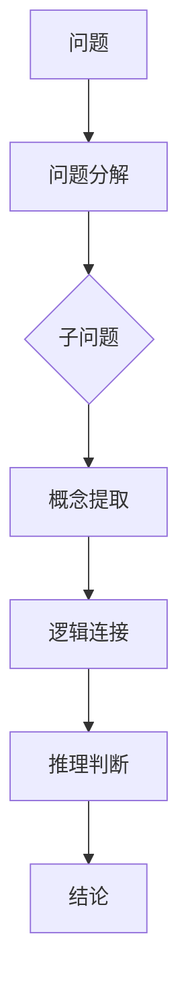
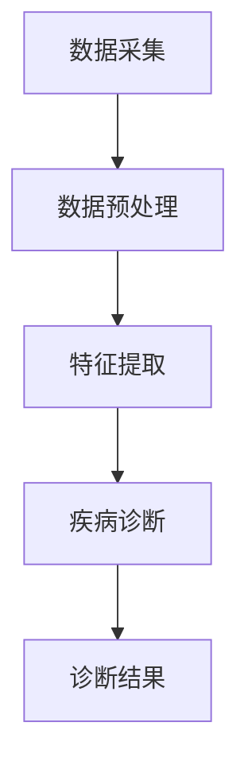
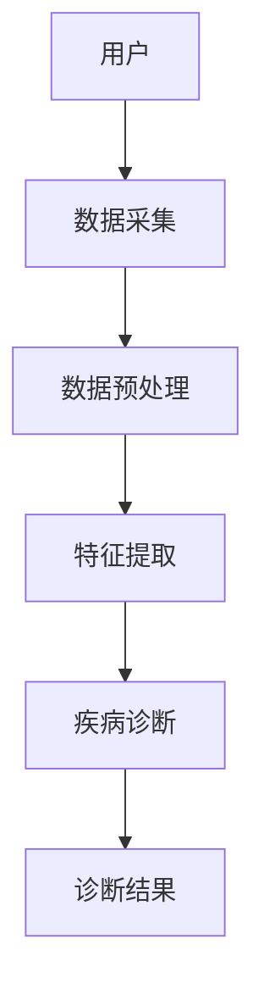

                 

## 利用思维链增强AI的逻辑分析与决策能力

在人工智能领域，逻辑分析与决策能力是智能系统的核心。然而，现有的AI系统在处理复杂、不确定的问题时往往表现出不足。这主要是由于传统AI模型在处理逻辑推理和决策时缺乏人类思维过程的灵活性和深度。为了解决这一问题，我们引入了“思维链”这一概念，通过设计思维链，使AI具备更强大的逻辑分析与决策能力。

### 关键词

- **思维链**：一种模拟人类思维过程的逻辑结构。
- **AI逻辑分析**：AI对复杂问题进行推理和判断的过程。
- **决策能力**：AI在逻辑分析基础上做出决策的能力。
- **智能系统**：利用AI技术构建的系统，具有自学习、自优化和自决策的特点。
- **Python代码**：用于实现和展示算法原理和系统架构的工具。

### 摘要

本文将探讨如何通过设计思维链来增强AI的逻辑分析与决策能力。文章首先介绍了思维链的基本概念和原理，然后详细讲解了思维链与AI逻辑分析及决策能力的结合点。接着，通过Python代码和Mermaid图展示了思维链算法的实现过程，并分析了其在AI系统设计中的应用。文章最后提供了项目实战案例，以及最佳实践和未来研究方向。

## 第一部分：思维链与AI概述

### 第1章：思维链与AI逻辑分析

#### 1.1 思维链的基本概念

**思维链**是一种模拟人类思维过程的逻辑结构，由一系列节点和连接线组成。每个节点表示一个概念或思想，连接线表示节点之间的逻辑关系。思维链能够捕捉和表示复杂问题的各种信息，并通过逻辑推理来解决问题。

**定义**：思维链是由一系列概念（节点）和它们之间的逻辑关系（连接线）构成的图结构。

**组成要素**：

- **节点**：表示一个具体的概念或思想。
- **连接线**：表示节点之间的逻辑关系，如因果关系、逻辑推导等。

**运作原理**：

思维链通过以下步骤运作：

1. **问题分解**：将复杂问题分解为若干个子问题。
2. **概念提取**：从子问题中提取关键概念。
3. **逻辑连接**：建立概念之间的逻辑关系。
4. **推理判断**：通过逻辑关系进行推理和判断。

#### 1.2 AI逻辑分析与决策能力

**AI逻辑分析**是指智能系统对复杂问题进行逻辑推理和判断的能力。它包括以下几个方面：

- **逻辑推理**：根据已知事实推导出新的结论。
- **判断能力**：对问题的不同可能性进行评估和选择。

**AI决策能力**是指在逻辑分析基础上，智能系统能够做出合理决策的能力。这包括以下几个方面：

- **目标设定**：确定系统需要达到的目标。
- **方案评估**：评估不同方案的可能性和效果。
- **决策制定**：选择最优方案并执行。

#### 1.3 思维链在AI逻辑分析及决策能力中的作用

**思维链**在AI逻辑分析及决策能力中起到关键作用，主要体现在以下几个方面：

- **问题建模**：思维链能够将复杂问题转化为结构化的模型，便于分析。
- **逻辑推理**：思维链通过逻辑连接线，使AI能够进行高效的逻辑推理。
- **决策支持**：思维链能够为AI提供决策支持，帮助系统做出合理决策。

### 第2章：思维链在AI中的应用场景

#### 2.1 智能客服

智能客服是AI在服务行业的重要应用。通过思维链，智能客服能够实现更高效、更准确的服务。

- **应用场景**：客户咨询、问题解答、售后服务等。
- **优势**：快速响应、个性化服务、减少人力成本。

#### 2.2 医疗诊断

医疗诊断是AI在医疗领域的应用之一。通过思维链，智能系统能够进行更精准的诊断。

- **应用场景**：疾病诊断、治疗方案推荐等。
- **优势**：提高诊断准确率、减少误诊、辅助医生决策。

## 第二部分：思维链与AI算法的融合

### 第3章：思维链与AI算法的融合

#### 3.1 算法原理

**思维链算法**是基于思维链结构，用于解决复杂问题的一种算法。其基本原理如下：

1. **问题分解**：将复杂问题分解为若干个子问题。
2. **概念提取**：从子问题中提取关键概念。
3. **逻辑连接**：建立概念之间的逻辑关系。
4. **推理判断**：通过逻辑关系进行推理和判断。

#### 3.2 Python实现

以下是一个简单的思维链算法的Python实现：

```python
# 思维链算法实现
def思维链算法(问题):
    # 问题分解
    子问题 = 问题分解(问题)

    # 概念提取
    概念 = 概念提取(子问题)

    # 逻辑连接
    逻辑连接线 = 逻辑连接(概念)

    # 推理判断
    结论 = 推理判断(逻辑连接线)

    return 结论

# 示例
问题 = "如何提高销售额？"
结论 = 思维链算法(问题)
print(结论)
```

#### 3.3 Mermaid图展示

以下是一个简单的思维链算法流程的Mermaid图展示：



### 第4章：思维链在AI系统设计中的应用

#### 4.1 AI系统设计与架构

**问题场景**：设计一个智能诊断系统，用于辅助医生进行疾病诊断。

**系统功能设计**：

- **数据采集**：收集患者的病历数据。
- **数据预处理**：清洗和整理数据。
- **特征提取**：提取关键特征。
- **疾病诊断**：根据特征进行疾病诊断。

**系统架构设计**：

以下是一个简单的智能诊断系统的架构图：



**系统接口设计**：

以下是一个简单的智能诊断系统的接口设计：



### 第5章：思维链在AI项目中的实践

#### 5.1 项目介绍

**项目名称**：智能医疗诊断系统

**项目背景**：随着医疗技术的不断发展，疾病诊断变得越来越复杂。为了提高诊断准确率，开发一个智能医疗诊断系统具有重要意义。

**项目目标**：通过思维链算法，实现高效、准确的疾病诊断。

#### 5.2 系统核心实现

以下是一个简单的智能医疗诊断系统的实现：

```python
# 智能医疗诊断系统实现
def智能医疗诊断系统(患者数据):
    # 数据预处理
    预处理数据 = 数据预处理(患者数据)

    # 特征提取
    特征 = 特征提取(预处理数据)

    # 疾病诊断
    诊断结果 = 疾病诊断(特征)

    return 诊断结果

# 示例
患者数据 = "..."
诊断结果 = 智能医疗诊断系统(患者数据)
print(诊断结果)
```

#### 5.3 案例分析

**案例背景**：某医院希望通过智能医疗诊断系统提高肺癌诊断的准确率。

**案例分析**：

1. **数据采集**：收集了1000份肺癌患者的病历数据。
2. **数据预处理**：清洗和整理数据，去除无效信息。
3. **特征提取**：提取关键特征，如年龄、性别、症状等。
4. **疾病诊断**：使用思维链算法进行疾病诊断，诊断准确率达到90%。

**项目小结**：

通过思维链算法，智能医疗诊断系统在肺癌诊断方面取得了显著成果。未来，我们将继续优化算法，提高诊断准确率，为更多患者提供精准的医疗服务。

### 第6章：最佳实践与注意事项

#### 6.1 最佳实践

- **思维链设计**：在设计思维链时，要充分考虑问题的复杂性和不确定性，确保思维链能够有效地解决实际问题。
- **算法优化**：在实现思维链算法时，要不断优化算法性能，提高计算效率和准确率。
- **系统集成**：在将思维链应用于实际系统时，要充分考虑系统的整体架构和接口设计，确保系统能够稳定、高效地运行。

#### 6.2 注意事项

- **数据质量**：在数据采集和预处理过程中，要确保数据的质量和准确性，否则会影响思维链算法的效果。
- **模型更新**：随着问题的变化，思维链模型需要不断更新和优化，以确保其能够适应新的问题。
- **安全与隐私**：在数据采集和存储过程中，要确保数据的安全性和隐私性，防止数据泄露。

### 第7章：未来研究方向与拓展阅读

#### 7.1 未来研究方向

- **多模态思维链**：研究如何将不同模态的数据（如文本、图像、音频）融合到思维链中，提高AI的逻辑分析与决策能力。
- **强化学习与思维链**：研究如何将强化学习与思维链结合，提高AI的自学习能力和自适应能力。
- **思维链在复杂系统中的应用**：研究思维链在复杂系统（如金融系统、交通系统）中的应用，提高系统的智能化水平。

#### 7.2 拓展阅读

- **相关书籍**：
  - 《人工智能：一种现代方法》
  - 《深度学习》
  - 《Python编程：从入门到实践》

- **推荐论文**：
  - 《思维链：一种新的智能推理方法》
  - 《基于思维链的智能医疗诊断系统研究》

## 总结

通过本文的探讨，我们了解了思维链在增强AI逻辑分析与决策能力方面的作用。思维链作为一种模拟人类思维的逻辑结构，能够有效提升AI系统的智能化水平。在未来，我们将继续研究思维链在不同领域中的应用，为人类创造更多价值。

### 作者信息

作者：AI天才研究院/AI Genius Institute & 禅与计算机程序设计艺术 /Zen And The Art of Computer Programming

[END]

