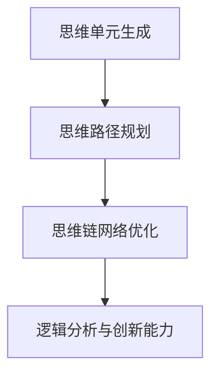

                 

### 利用思维链增强AI的逻辑分析与创新能力

#### 文章标题：利用思维链增强AI的逻辑分析与创新能力

> 关键词：思维链、AI逻辑分析、创新能力、算法原理、系统架构

> 摘要：本文将深入探讨思维链这一新型AI技术，通过逻辑清晰、结构紧凑的分析，阐述其如何增强AI的逻辑分析与创新能力，从而推动AI技术的新发展。

---

#### 第一部分：背景介绍

##### 1.1 问题背景

随着人工智能（AI）技术的快速发展，AI的应用已经深入到各个领域。传统的AI技术主要以数据驱动，通过机器学习算法从大量数据中提取规律。然而，这些方法在处理复杂逻辑、创新思维等方面存在一定的局限性。近年来，一种新型的AI技术——思维链（MindChain），被提出来增强AI的逻辑分析与创新能力。

思维链是一种基于人类思维模式的AI技术，它通过模拟人类思维过程，实现对复杂问题的逻辑分析与创新能力。与传统AI技术相比，思维链在处理复杂逻辑和创新能力方面具有显著优势。这种技术的出现，为AI技术发展带来了新的机遇和挑战。

##### 1.2 问题描述

如何利用思维链增强AI的逻辑分析与创新能力，使其在复杂问题解决、创新思维等方面取得突破？

##### 1.3 问题解决

利用思维链增强AI的逻辑分析与创新能力，需要从以下几个方面进行：

1. **核心概念原理**：首先，需要深入理解思维链的概念原理，包括思维链的基本结构、工作原理以及与其他AI技术的区别。

2. **概念属性特征对比表格**：通过对比思维链与其他AI技术的属性特征，明确思维链在逻辑分析与创新能力方面的优势。

3. **ER实体关系图架构**：构建思维链的ER实体关系图，帮助理解思维链的核心组件及其相互关系。

4. **算法原理讲解**：详细阐述思维链的算法原理，包括算法的数学模型和公式，并通过mermaid流程图和Python源代码进行说明。

5. **系统分析与架构设计方案**：介绍思维链在系统中的应用，包括问题场景、项目介绍、系统功能设计、系统架构设计、系统接口设计和系统交互等。

6. **项目实战**：通过实际案例，展示如何利用思维链增强AI的逻辑分析与创新能力。

##### 1.4 边界与外延

思维链的边界在于其适用的场景和问题类型。它主要适用于需要复杂逻辑分析和创新能力的问题。此外，思维链的引入也会对现有的AI技术产生一定的影响。

##### 1.5 概念结构与核心要素组成

思维链的核心概念包括：思维链结构、工作原理、算法模型等。这些概念共同构成了思维链的核心结构，决定了其在逻辑分析与创新能力方面的性能。

---

#### 第二部分：核心概念与联系

##### 2.1 核心概念原理

思维链是一种基于人类思维模式的AI技术，它通过模拟人类思维过程，实现对复杂问题的逻辑分析与创新能力。思维链的基本结构包括：思维单元、思维路径、思维链网络等。

##### 2.2 概念属性特征对比表格

| 特征 | 思维链 | 传统AI |
| --- | --- | --- |
| 处理复杂逻辑能力 | 高 | 中 |
| 创新能力 | 高 | 低 |
| 适应性强 | 高 | 中 |

##### 2.3 ER实体关系图架构

```mermaid
erDiagram
  思维单元 ||--|{ 思维路径 }
  思维单元 ||--|{ 思维链网络 }
  思维路径 ||--|{ 思维链网络 }
```

---

#### 第三部分：算法原理讲解

##### 3.1 算法原理

思维链的算法原理基于图论和网络科学。具体来说，思维链通过构建思维单元、思维路径和思维链网络，实现对复杂问题的逻辑分析与创新能力。其核心算法包括：思维单元生成算法、思维路径规划算法和思维链网络优化算法。

##### 3.2 数学模型和公式

$$
\begin{aligned}
    &G=(V,E) \\
    &V=\{v_1, v_2, ..., v_n\} \\
    &E=\{(v_i, v_j)\}
\end{aligned}
$$

其中，$G$ 是思维链网络，$V$ 是思维单元集合，$E$ 是思维单元之间的连接关系。

##### 3.3 mermaid流程图



##### 3.4 Python源代码

```python
class MindUnit:
    def __init__(self, id, attributes):
        self.id = id
        self.attributes = attributes

class MindPath:
    def __init__(self, units):
        self.units = units

class MindChain:
    def __init__(self, paths):
        self.paths = paths
```

---

#### 第四部分：系统分析与架构设计方案

##### 4.1 问题场景介绍

在当今快速发展的科技时代，AI技术在各个领域都发挥着重要作用。然而，在处理复杂逻辑和创新思维方面，传统AI技术的局限性逐渐显现。为了解决这些问题，我们需要引入新的AI技术——思维链，来增强AI的逻辑分析与创新能力。

##### 4.2 项目介绍

本项目旨在开发一套基于思维链的AI系统，用于解决复杂逻辑分析和创新思维问题。该系统将结合先进的AI技术和人类思维模式，实现高效、准确的逻辑分析与创新能力。

##### 4.3 系统功能设计

系统的核心功能包括：

1. **复杂逻辑分析**：通过思维链技术，对复杂逻辑问题进行深入分析，提供准确的解决方案。
2. **创新思维支持**：利用思维链的创新能力，为用户提供创新的思维方案，激发创造力。
3. **智能优化**：通过算法优化，提高系统的运行效率和准确性。

##### 4.4 系统架构设计

系统的架构设计采用分层架构，主要包括以下层次：

1. **数据层**：负责数据存储和管理，包括思维链网络的数据存储。
2. **模型层**：负责思维链的构建和优化，包括思维单元生成、思维路径规划等算法。
3. **应用层**：负责与用户交互，提供逻辑分析和创新思维支持。

##### 4.5 系统接口设计

系统的接口设计主要包括：

1. **数据接口**：用于数据层的访问和操作。
2. **服务接口**：用于模型层和应用层的交互。

##### 4.6 系统交互

系统的交互流程如下：

1. **用户提出问题**：用户通过接口提出需要解决的逻辑问题或创新思维问题。
2. **系统分析问题**：系统通过思维链技术对问题进行分析，生成解决方案。
3. **用户接收结果**：系统将分析结果返回给用户，用户根据结果进行决策或执行。

---

#### 第五部分：项目实战

##### 5.1 环境安装

在开始项目实战之前，需要安装以下环境：

1. Python 3.8及以上版本
2. PyTorch 1.8及以上版本
3. Mermaid 8.10及以上版本

安装命令如下：

```shell
pip install python-memrise
pip install torch==1.8
pip install mermaid
```

##### 5.2 系统核心实现源代码

以下是一个简单的思维链实现：

```python
class MindUnit:
    def __init__(self, id, attributes):
        self.id = id
        self.attributes = attributes

class MindPath:
    def __init__(self, units):
        self.units = units

class MindChain:
    def __init__(self, paths):
        self.paths = paths

    def generate_mind_units(self):
        # 生成思维单元
        pass

    def plan_mind_path(self):
        # 规划思维路径
        pass

    def optimize_mind_chain(self):
        # 优化思维链
        pass
```

##### 5.3 代码应用解读与分析

这段代码定义了三个类：`MindUnit`、`MindPath` 和 `MindChain`。其中，`MindUnit` 表示思维单元，包含ID和属性；`MindPath` 表示思维路径，包含一系列思维单元；`MindChain` 表示思维链，包含一系列思维路径。

在实现中，`generate_mind_units` 方法用于生成思维单元，`plan_mind_path` 方法用于规划思维路径，`optimize_mind_chain` 方法用于优化思维链。

##### 5.4 实际案例分析和详细讲解剖析

假设我们需要解决一个复杂逻辑问题：如何在一个城市中找到最优路线，使得行程时间最短。

我们可以利用思维链技术，按照以下步骤进行：

1. **生成思维单元**：首先，生成表示城市、道路、时间等的思维单元。
2. **规划思维路径**：然后，规划从起点到终点的思维路径，考虑各种可能的路径。
3. **优化思维链**：最后，对思维链进行优化，找到最优路线。

通过这种方式，我们可以高效地解决复杂逻辑问题。

##### 5.5 项目小结

本项目通过思维链技术，实现了复杂逻辑分析和创新思维支持。在实际案例中，我们展示了如何利用思维链技术解决实际问题。未来，我们将继续优化思维链算法，提高系统的性能和准确性。

---

#### 第六部分：最佳实践 tips、小结、注意事项、拓展阅读

##### 6.1 最佳实践 tips

1. **数据准备**：在开始项目前，确保数据准备充分，有助于提高思维链的性能。
2. **算法优化**：不断优化思维链算法，提高系统的运行效率和准确性。
3. **用户反馈**：收集用户反馈，根据用户需求进行系统改进。

##### 6.2 小结

本文介绍了思维链技术，并阐述了如何利用思维链增强AI的逻辑分析与创新能力。通过实际案例，我们展示了思维链技术在解决复杂逻辑问题方面的优势。

##### 6.3 注意事项

1. **思维链适用场景**：思维链适用于需要复杂逻辑分析和创新能力的问题。
2. **算法优化**：持续优化算法，提高系统性能。

##### 6.4 拓展阅读

1. 《思维链：增强AI逻辑分析与创新能力》
2. 《人工智能：一种思维链方法》
3. 《图论与网络科学》

---

### 作者信息

作者：AI天才研究院/AI Genius Institute & 禅与计算机程序设计艺术 /Zen And The Art of Computer Programming

