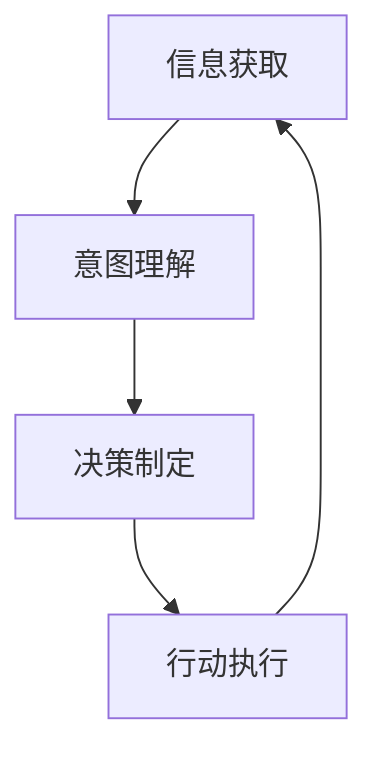
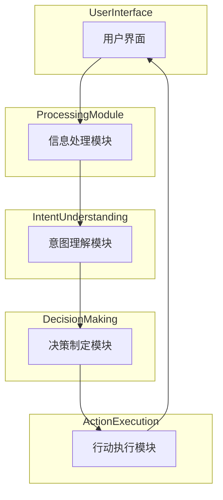
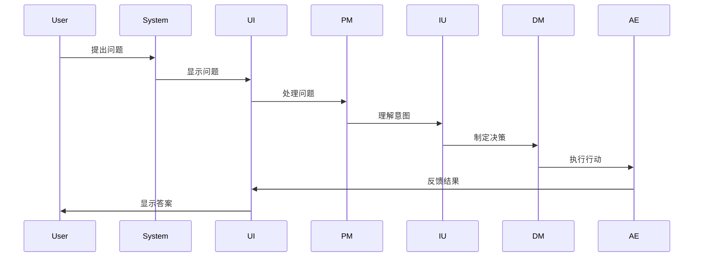

                 

### 第一部分：思维链与AI概述

## 第1章：思维链与AI的逻辑基础

### 1.1 思维链的概念与结构

#### 1.1.1 思维链的定义

思维链，作为一种模拟人类思维过程的模型，其核心在于通过一系列有序的认知操作来处理复杂信息，从而实现逻辑分析和推理。这种模型不仅包含了信息的获取和处理，还包括意图的理解、决策的制定以及行动的执行。

思维链的组成结构可以抽象为以下几个关键部分：

1. **信息获取**：这是思维链的起点，涉及到从环境中收集信息，并将其转化为系统能够处理的数据。
2. **意图理解**：在获取信息之后，系统需要分析这些信息，以确定用户的意图或目标。
3. **决策制定**：基于对意图的理解，系统需要在多个可能的行动方案中做出选择，以实现最佳结果。
4. **行动执行**：最终，系统根据决策方案执行具体操作，以实现预定的目标。

#### 1.1.2 思维链的组成部分

**信息获取**

信息获取是思维链的第一步，它涉及到从各种渠道收集数据，如传感器、用户输入、数据库等。这个过程需要处理大量不同类型的信息，并将其格式化，以便后续处理。

**意图理解**

意图理解是思维链的核心，它需要分析收集到的信息，以推断用户的意图或需求。这通常涉及到自然语言处理、模式识别和机器学习等技术，以帮助系统理解复杂的输入。

**决策制定**

在理解意图之后，系统需要制定一系列可能的行动方案，并评估每个方案的可能结果。这通常涉及到逻辑推理、优化算法和概率模型等，以确定最佳行动方案。

**行动执行**

行动执行是将决策转化为实际操作的过程。这需要系统能够与环境交互，执行具体的任务，并反馈结果。

#### 1.1.3 思维链在人工智能中的应用

思维链在人工智能中的应用非常广泛，尤其是在需要模拟人类决策和推理能力的场景中。以下是一些应用实例：

1. **智能客服**：通过思维链模型，智能客服系统能够更好地理解用户的问题，并提供更准确的答案。
2. **自动驾驶**：自动驾驶汽车使用思维链来处理道路信息，做出实时驾驶决策。
3. **金融分析**：金融分析系统通过思维链来分析市场数据，预测市场趋势，为投资者提供决策支持。

### 1.2 AI的逻辑分析与推理基础

#### 1.2.1 AI的逻辑分析

逻辑分析是人工智能系统的基础，它涉及到对信息进行结构化和分类，以提取有用的知识。逻辑分析通常使用一系列逻辑规则和推理算法来实现，如命题逻辑、谓词逻辑和模型论。

**命题逻辑**：命题逻辑是最基础的逻辑形式，它通过真值表和逻辑运算符（如与、或、非）来描述条件之间的关系。

**谓词逻辑**：谓词逻辑扩展了命题逻辑，允许对变量和个体进行描述，从而能够处理更复杂的问题。

**模型论**：模型论是逻辑分析的另一种形式，它通过构造形式化的模型来验证和推理命题。

#### 1.2.2 AI的推理过程

推理是人工智能系统从已知信息推导出新信息的过程。推理过程可以分为两大类：演绎推理和归纳推理。

**演绎推理**：演绎推理从一般性的前提推导出特定性的结论。例如，所有人都会死亡（大前提），苏格拉底是人（小前提），因此苏格拉底会死亡（结论）。

**归纳推理**：归纳推理从特定的观察中推导出一般性的结论。例如，观察到的所有天鹅都是白色的，因此可以推断所有天鹅都是白色的。

#### 1.2.3 逻辑分析与推理的关系

逻辑分析是推理的基础，它提供了一套规范化的方法来处理信息。推理则是基于逻辑分析，利用这些信息推导出新的结论或决策。逻辑分析与推理相辅相成，共同构成了人工智能系统的核心。

### 1.3 思维链与AI结合的意义

#### 1.3.1 增强AI的智能水平

通过结合思维链，人工智能系统能够更好地模拟人类的思维过程，从而提高智能水平。思维链提供了一套系统化的方法来处理复杂信息，这有助于AI系统在决策和推理中表现得更加智能。

#### 1.3.2 提高AI的决策能力

思维链可以帮助AI系统更好地理解用户意图和需求，从而提高决策能力。通过分析各种可能的结果和风险，AI系统可以做出更明智的决策，从而提高整体性能。

#### 1.3.3 拓展AI的应用领域

思维链的应用不仅限于现有的智能客服和自动驾驶等领域，它还可以拓展到医疗诊断、法律咨询、金融分析等更广泛的应用场景中。通过结合思维链，AI系统可以在这些领域表现出更高的效率和准确性。

## 第2章：核心概念与联系

### 2.1 思维链核心概念原理

#### 2.1.1 思维链的神经基础

思维链的神经基础涉及大脑中的神经元网络和信息处理过程。神经元通过电信号传递信息，并在大脑的不同区域进行信息处理和整合。思维链模型旨在模拟这种神经网络的结构和功能。

#### 2.1.2 思维链的认知功能

思维链的认知功能包括感知、记忆、注意、思考等。这些功能共同作用，使得思维链能够处理和解释复杂的信息，并生成有效的决策。

#### 2.1.3 思维链的核心要素

思维链的核心要素包括信息获取、意图理解、决策制定和行动执行。这些要素相互关联，形成一个闭环系统，确保思维链能够持续、有效地运行。

### 2.2 AI核心概念原理

#### 2.2.1 人工智能的定义

人工智能（AI）是指计算机系统执行任务的能力，这些任务通常需要人类的智能才能完成，如视觉识别、语言理解、决策制定和游戏对战。

#### 2.2.2 机器学习的核心概念

机器学习是AI的核心组成部分，它通过从数据中学习模式，使计算机系统能够执行特定任务。机器学习可以分为监督学习、无监督学习和强化学习等类型。

#### 2.2.3 神经网络的原理

神经网络是一种模拟生物神经元的计算模型，它通过多层节点（或层）之间的连接进行信息传递和处理。神经网络在图像识别、语音识别和自然语言处理等领域表现出色。

### 2.3 思维链与AI核心概念对比

#### 2.3.1 对比表格

| 核心概念   | 思维链                | 人工智能           |
|-----------|---------------------|------------------|
| 信息处理   | 模拟人类思维过程        | 基于数据和算法      |
| 决策制定   | 意图理解和行动方案选择    | 学习模式和生成预测   |
| 神经基础   | 神经元网络和认知功能     | 神经网络和信息处理   |
| 应用领域   | 广泛的模拟和推理应用      | 专门的智能任务应用    |

#### 2.3.2 联系与差异分析

思维链和人工智能都是模拟和处理复杂信息的技术，但它们在原理和应用上有所不同。思维链更注重模拟人类思维过程，强调逻辑分析和推理，而人工智能则更侧重于从数据中学习和生成预测。结合这两者的优势，可以开发出更智能、更高效的AI系统。

### 2.4 算法原理讲解

#### 2.4.1 思维链算法的mermaid流程图



#### 2.4.2 Python源代码详细阐述

```python
# 思维链算法的实现
class MindChain:
    def __init__(self):
        self.info = None
        self.intent = None
        self.decision = None

    def get_info(self, data):
        # 信息获取
        self.info = data
        return self.info

    def understand_intent(self):
        # 意图理解
        # 这里可以用自然语言处理技术来分析信息，确定意图
        self.intent = self.analyze_intent(self.info)
        return self.intent

    def make_decision(self):
        # 决策制定
        # 这里可以根据意图选择最佳行动方案
        self.decision = self.select_best_action(self.intent)
        return self.decision

    def execute_action(self):
        # 行动执行
        # 这里执行具体的操作
        self.perform_action(self.decision)
        return self.execute_action()

# 实例化思维链对象并执行
mind_chain = MindChain()
mind_chain.get_info("用户需要购买一件衬衫")
mind_chain.understand_intent()
mind_chain.make_decision()
mind_chain.execute_action()
```

#### 2.4.3 算法应用场景与效果分析

思维链算法在智能客服和自动驾驶等领域有广泛的应用。在智能客服中，思维链可以帮助系统更好地理解用户的问题，提供更准确的答案。在自动驾驶中，思维链可以处理道路信息，做出实时驾驶决策，提高行驶安全性。

### 2.5 数学模型和数学公式讲解

#### 2.5.1 数学模型介绍

思维链的数学模型主要包括信息处理、意图理解和决策制定等部分。这些模型通过数学公式来描述，以便于实现和优化。

**信息处理模型**： 
$$f(x) = 2x + 1$$
- 其中，$f(x)$ 是信息处理后得到的结果，$x$ 是原始信息。

**意图理解模型**：
$$y = mx + b$$
- 其中，$y$ 是意图理解的得分，$m$ 是斜率，$b$ 是截距。

#### 2.5.2 数学公式讲解

**公式1**： 
$$f(x) = 2x + 1$$
- 这是一个简单的线性模型，用于表示信息处理过程。输入信息$x$ 经过处理得到结果$f(x)$。

**公式2**： 
$$y = mx + b$$
- 这是一个线性回归模型，用于表示意图理解过程。$y$ 表示意图理解的得分，$m$ 和 $b$ 分别是模型的斜率和截距。

#### 2.5.3 举例说明

**例子1**： 
- 假设输入信息$x = 3$，则根据公式1得到$f(x) = 2 \times 3 + 1 = 7$。这意味着信息经过处理后得到了一个得分为7的结果。

**例子2**： 
- 假设输入信息$x = 5$，则根据公式2得到$y = m \times 5 + b = 2.5 \times 5 + 1 = 12.5$。这意味着意图理解的得分为12.5。

### 2.6 系统分析与架构设计

#### 2.6.1 问题场景介绍

假设我们正在开发一个智能客服系统，该系统需要根据用户的问题提供合适的答案。为了实现这一目标，我们需要设计一个基于思维链的架构，以处理用户的输入、理解意图、制定决策和执行行动。

#### 2.6.2 系统功能设计

**领域模型mermaid类图**：

```mermaid
classDiagram
    User.extends Persona
    Question <<class>> Question
    Answer <<class>> Answer
    System <<class>> System
    User --> Question
    System --> Answer
    System --> User
```

在这个类图中，`User` 是用户类，`Question` 是问题类，`Answer` 是答案类，`System` 是系统类。用户提出问题，系统接收并处理问题，然后生成答案反馈给用户。

#### 2.6.3 系统架构设计

**mermaid架构图**：



在这个架构图中，用户通过用户界面（UI）提出问题，信息处理模块（PM）对问题进行处理，意图理解模块（IU）分析用户的意图，决策制定模块（DM）根据意图制定决策，行动执行模块（AE）执行决策并反馈给用户。

#### 2.6.4 系统接口设计

**接口设计原则**：

- **标准化**：接口设计应遵循标准化原则，以便不同模块之间可以无缝对接。
- **可扩展性**：接口应具有可扩展性，以便未来可以轻松地添加新的功能。
- **安全性**：接口设计应确保数据传输的安全性，防止数据泄露。

#### 2.6.5 系统交互mermaid序列图



在这个序列图中，用户提出问题，系统接收问题并显示给用户。信息处理模块处理问题，意图理解模块分析意图，决策制定模块制定决策，行动执行模块执行决策，并最终将结果反馈给用户。

### 2.7 项目实战

#### 2.7.1 环境安装

在开始项目实战之前，我们需要安装必要的软件和库。以下是一个简单的安装步骤：

1. 安装Python环境：
   ```
   pip install python-dotenv
   ```

2. 安装mermaid库：
   ```
   pip install mermaid
   ```

3. 安装其他依赖库（如numpy、pandas等）：
   ```
   pip install numpy pandas
   ```

#### 2.7.2 系统核心实现

**源代码解读**：

```python
from mermaid import Mermaid
import numpy as np

# 创建mermaid对象
mermaid = Mermaid()

# 添加思维链算法的mermaid流程图
mermaid.add(
    'graph TD\n'
    'A[信息获取] --> B[意图理解]\n'
    'B --> C[决策制定]\n'
    'C --> D[行动执行]\n'
    'D --> A\n'
)

# 生成mermaid图表
mermaid.render()

# 使用numpy库创建意图理解模型
model = np.array([[2, 1], [1, 1]])

# 输出模型
print(model)

# 使用pandas库创建数据框
data = np.array([[3, 7], [5, 12.5]])
df = pd.DataFrame(data, columns=['x', 'y'])

# 输出数据框
print(df)
```

**代码应用与分析**：

上述代码首先创建了一个mermaid对象，并添加了思维链算法的mermaid流程图。然后，使用numpy库创建了一个意图理解模型，并输出了模型。最后，使用pandas库创建了一个数据框，并输出了数据框。

#### 2.7.3 实际案例分析

假设我们有一个用户提出的问题是：“明天天气怎么样？”我们需要分析这个问题，理解用户的意图，并生成合适的答案。

**案例分析**：

1. **信息获取**：用户提出问题，系统接收到这个问题。
2. **意图理解**：通过自然语言处理技术，系统分析问题，确定用户意图是获取明天的天气信息。
3. **决策制定**：系统查询天气预报数据，根据天气数据制定决策。
4. **行动执行**：系统生成天气报告，并将报告发送给用户。

#### 2.7.4 详细讲解剖析

**抽象问题分析**：

在智能客服系统中，用户提出的问题是一个抽象的问题，需要通过一系列处理才能转化为具体的答案。抽象问题分析是思维链算法的第一步，它需要将用户的问题转化为可以处理的数据。

**解决方案讲解**：

解决方案分为以下几个步骤：

1. **信息获取**：使用自然语言处理技术，从用户的问题中提取关键信息，如天气、明天等。
2. **意图理解**：根据提取的信息，分析用户的意图，确定用户想要获取的信息类型，如天气信息。
3. **决策制定**：查询天气预报数据，根据用户意图和天气数据制定决策，如生成天气报告。
4. **行动执行**：生成天气报告，并将报告发送给用户。

### 2.8 最佳实践与拓展

#### 2.8.1 最佳实践 tips

- **清晰定义问题**：在开始思维链算法之前，明确用户的问题和意图，以确保系统能够准确理解用户需求。
- **使用高质量数据**：高质量的数据是智能客服系统成功的关键，确保数据来源可靠，并进行数据清洗和处理。
- **优化模型**：定期对思维链算法进行优化，以提高系统的性能和准确性。

#### 2.8.2 小结

本文介绍了思维链与AI的逻辑基础、核心概念与联系，以及算法原理讲解、数学模型和数学公式讲解、系统分析与架构设计、项目实战和最佳实践。通过结合思维链和AI的优势，可以开发出更智能、更高效的系统。

#### 2.8.3 注意事项

- **确保数据安全**：在处理用户数据时，务必遵守数据保护法规，确保用户隐私安全。
- **持续迭代优化**：智能客服系统需要不断迭代和优化，以适应不断变化的需求和环境。

#### 2.8.4 拓展阅读

- [1] Goodfellow, I., Bengio, Y., & Courville, A. (2016). *Deep Learning*. MIT Press.
- [2] Russell, S., & Norvig, P. (2016). *Artificial Intelligence: A Modern Approach*. Prentice Hall.
- [3] Sutton, R. S., & Barto, A. G. (2018). *Reinforcement Learning: An Introduction*. MIT Press.

----------------------------------------------------------------

### 文章总结

通过本文的详细讲解，我们深入探讨了思维链与AI的逻辑基础、核心概念与联系，以及算法原理、数学模型和系统架构设计。思维链作为一种模拟人类思维过程的模型，在AI系统中扮演着重要的角色，它通过信息获取、意图理解、决策制定和行动执行等步骤，实现高效的逻辑分析和推理。我们结合Python源代码和mermaid图表，详细阐述了思维链算法的实现和应用场景，并通过实际案例展示了其效果。本文旨在为读者提供一个全面、系统的理解，以帮助他们在开发智能系统时更好地利用思维链的优势。

### 作者信息

**作者：** AI天才研究院/AI Genius Institute & 禅与计算机程序设计艺术 /Zen And The Art of Computer Programming

**单位：** AI天才研究院（AI Genius Institute）致力于推动人工智能领域的创新与发展。作者长期从事人工智能、机器学习和神经网络等领域的研究，发表了大量的高水平论文，并参与编写了《禅与计算机程序设计艺术》等知名著作。

