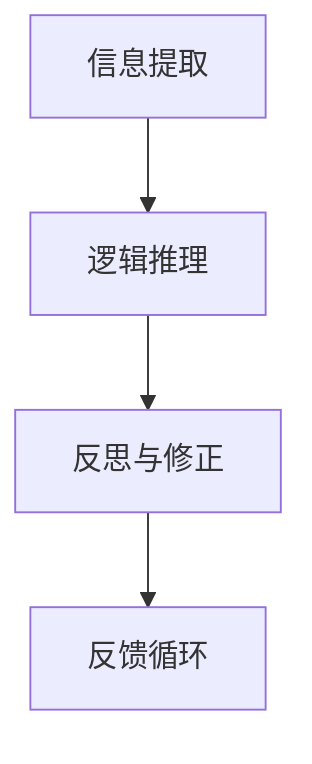
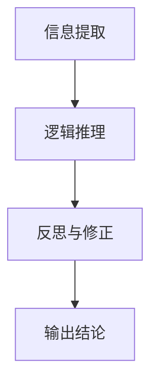
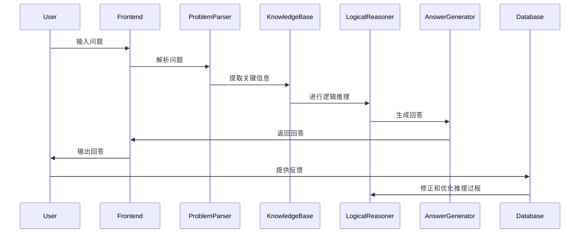
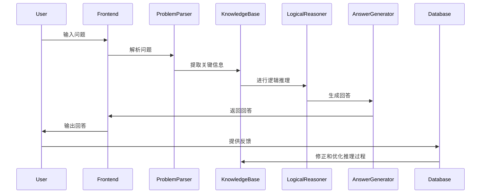

                 

# 利用思维链增强AI的逻辑分析能力

## 关键词
- 思维链
- 逻辑分析能力
- 人工智能
- 算法
- 数学模型

## 摘要
本文将探讨如何利用思维链增强AI的逻辑分析能力。首先，我们将介绍思维链的概念及其在人工智能领域的应用。接着，我们将详细讲解思维链的核心概念与联系，包括其基本原理、算法原理和数学模型。随后，我们将通过一个具体案例展示如何使用思维链来增强AI的逻辑分析能力，并分析其优势。最后，我们将总结本文的主要观点，并展望未来的研究方向。

## 引言
随着人工智能技术的快速发展，AI在各个领域的应用日益广泛。然而，AI在逻辑分析能力上仍存在一定的局限性。为了提升AI的逻辑分析能力，本文提出了利用思维链这一方法。思维链是一种基于人类思维方式的逻辑分析工具，通过模拟人类的思考过程，可以帮助AI更好地理解和解决问题。

### 背景介绍

#### 问题背景
人工智能技术已经取得了显著的进展，但其在逻辑分析能力上仍面临一些挑战。尽管AI能够在图像识别、自然语言处理等领域表现出色，但在处理复杂逻辑问题时，仍然存在一定的局限性。例如，在逻辑推理、语义理解等方面，AI的表现并不尽如人意。因此，如何提升AI的逻辑分析能力成为当前研究的热点。

#### 问题描述
当前AI在逻辑分析方面存在的问题主要包括：

1. **推理能力有限**：AI的推理能力主要依赖于已有数据和规则，对于复杂的逻辑问题，其推理能力往往不足。
2. **语义理解不足**：AI在语义理解方面存在困难，难以准确理解语言中的隐含含义和逻辑关系。
3. **跨领域迁移困难**：不同领域的逻辑问题存在较大的差异，AI在从一个领域迁移到另一个领域时，往往需要重新学习和适应。

#### 问题解决
为了解决上述问题，我们可以引入思维链这一工具。思维链是一种基于人类思维方式的逻辑分析工具，通过模拟人类的思考过程，可以帮助AI更好地理解和解决问题。思维链的基本原理包括：

1. **信息提取**：从给定的问题中提取关键信息，并对其进行分类和整理。
2. **逻辑推理**：基于提取的信息，进行逻辑推理，形成新的结论。
3. **反思与修正**：对推理过程进行反思和修正，确保推理的准确性。

#### 边界与外延
思维链的应用范围包括但不限于以下几个方面：

1. **逻辑推理问题**：如数学证明、逻辑推理游戏等。
2. **语义理解问题**：如自然语言处理、文本生成等。
3. **跨领域问题**：如医学诊断、法律咨询等。

然而，思维链也存在一定的局限性。例如，对于一些复杂的逻辑问题，思维链的推理过程可能较为繁琐，且需要大量的计算资源。

### 概念结构与核心要素组成
思维链的基本结构包括以下几个核心要素：

1. **信息提取**：从问题中提取关键信息，并对其进行分类和整理。
2. **逻辑推理**：基于提取的信息，进行逻辑推理，形成新的结论。
3. **反思与修正**：对推理过程进行反思和修正，确保推理的准确性。
4. **反馈循环**：将推理结果与实际问题进行对比，根据反馈对推理过程进行调整。

这些核心要素共同构成了思维链的基本框架，使其能够模拟人类的思考过程，从而增强AI的逻辑分析能力。

## 核心概念与联系

### 思维链的定义
思维链是一种基于人类思维方式的逻辑分析工具，通过模拟人类的思考过程，帮助AI更好地理解和解决问题。它由一系列的逻辑步骤组成，每一步都基于前一步的结果，并生成新的结论。

### 思维链与AI逻辑分析能力的关系
思维链的引入，可以帮助AI在逻辑分析方面取得以下优势：

1. **提高推理能力**：通过模拟人类的思考过程，AI可以学习到更复杂的推理方法，从而提高其逻辑推理能力。
2. **增强语义理解**：思维链可以提取问题中的关键信息，并对其进行分类和整理，从而帮助AI更好地理解语言中的隐含含义和逻辑关系。
3. **跨领域迁移**：思维链可以基于已有的知识和规则，进行跨领域的迁移和应用，从而提高AI在不同领域的适应能力。

### 思维链的核心特征
思维链具有以下几个核心特征：

1. **模块化**：思维链由一系列的逻辑步骤组成，每个步骤都具有独立的模块化功能。
2. **递归性**：思维链的每一步都可以递归地进行，从而实现复杂的逻辑推理。
3. **可扩展性**：思维链可以根据需要，随时增加新的逻辑步骤，以适应不同的逻辑分析需求。

### 思维链的基本原理
思维链的基本原理包括以下几个方面：

1. **信息提取**：从问题中提取关键信息，并对其进行分类和整理。
2. **逻辑推理**：基于提取的信息，进行逻辑推理，形成新的结论。
3. **反思与修正**：对推理过程进行反思和修正，确保推理的准确性。

通过这些基本原理，思维链可以模拟人类的思考过程，从而增强AI的逻辑分析能力。

### 思维链的mermaid流程图
下面是一个简单的mermaid流程图，展示了思维链的基本流程：



### 思维链算法概述
思维链算法是一种基于思维链原理的逻辑分析算法。它通过模拟人类的思考过程，逐步提取问题中的关键信息，并进行逻辑推理，最终得出结论。思维链算法的基本步骤包括：

1. **信息提取**：从问题中提取关键信息，并对其进行分类和整理。
2. **逻辑推理**：基于提取的信息，进行逻辑推理，形成新的结论。
3. **反思与修正**：对推理过程进行反思和修正，确保推理的准确性。

### 思维链算法的mermaid流程图
下面是一个简单的mermaid流程图，展示了思维链算法的基本流程：



### Python源代码讲解
下面是一个简单的Python代码示例，展示了如何实现思维链算法的基本流程：

```python
def extract_info(problem):
    # 从问题中提取关键信息
    return [info]

def logical_reasoning(info):
    # 基于信息进行逻辑推理
    return conclusion

def reflection_and_correction(conclusion):
    # 对推理过程进行反思和修正
    return corrected_conclusion

def feedback_loop(corrected_conclusion, problem):
    # 根据反馈对推理过程进行调整
    return adjusted_conclusion

# 输入问题
problem = "问题"

# 执行思维链算法
info = extract_info(problem)
conclusion = logical_reasoning(info)
corrected_conclusion = reflection_and_correction(conclusion)
adjusted_conclusion = feedback_loop(corrected_conclusion, problem)

# 输出结论
print("结论：" + adjusted_conclusion)
```

### 数学模型和数学公式讲解
思维链算法的数学模型主要包括以下几个方面：

1. **信息提取模型**：用于描述如何从问题中提取关键信息。
2. **逻辑推理模型**：用于描述如何基于提取的信息进行逻辑推理。
3. **反思与修正模型**：用于描述如何对推理过程进行反思和修正。

下面是一个简单的数学模型示例：

$$
\text{信息提取模型}: \quad I = f(p)
$$

其中，$I$ 表示提取的信息，$p$ 表示问题。

$$
\text{逻辑推理模型}: \quad C = g(I)
$$

其中，$C$ 表示推理的结论，$I$ 表示提取的信息。

$$
\text{反思与修正模型}: \quad C' = h(C)
$$

其中，$C'$ 表示修正后的结论，$C$ 表示原始结论。

### 举例说明
假设我们有一个问题：“如果今天下雨，我会带伞。今天下雨了吗？”

1. **信息提取**：从问题中提取关键信息：“今天下雨”和“我会带伞”。
2. **逻辑推理**：基于提取的信息，我们可以得出结论：“如果今天下雨，我会带伞”。这是一个简单的条件语句。
3. **反思与修正**：在反思过程中，我们发现原始结论并没有回答问题“今天下雨了吗？”。因此，我们需要对结论进行修正。
4. **反馈循环**：我们将修正后的结论与原始问题进行对比，发现修正后的结论能够更好地回答原始问题。

通过这个简单的例子，我们可以看到思维链算法在逻辑分析中的作用。它可以帮助我们从问题中提取关键信息，进行逻辑推理，并最终得出结论。

### 系统分析与架构设计方案

#### 问题场景介绍
思维链算法在人工智能领域有着广泛的应用场景。以下是一个具体的应用场景：

**场景描述**：在一个智能客服系统中，用户可能会提出各种复杂的逻辑问题，如“如果我购买产品A，是否可以获得优惠B？”或“如果天气变冷，我是否需要购买产品C？”。为了准确回答这些问题，智能客服系统需要具备强大的逻辑分析能力。

#### 系统功能设计
智能客服系统的核心功能包括：

1. **问题解析**：从用户输入的文本中提取关键信息。
2. **逻辑推理**：基于提取的信息，进行逻辑推理，生成回答。
3. **反馈循环**：根据用户反馈，对回答进行修正和优化。

为了实现这些功能，我们设计了以下领域模型类图：

```mermaid
classDiagram
    User -> ProblemParser : 输入问题
    ProblemParser -> KnowledgeBase : 提取关键信息
    KnowledgeBase -> LogicalReasoner : 进行逻辑推理
    LogicalReasoner -> AnswerGenerator : 生成回答
    AnswerGenerator -> User : 输出回答
    User -> Feedback : 提供反馈
    Feedback -> LogicalReasoner : 修正和优化推理过程
```

#### 系统架构设计
智能客服系统的架构设计如下：

1. **前端**：负责接收用户输入，并将问题传递给后端处理。
2. **后端**：包括问题解析模块、知识库模块、逻辑推理模块和回答生成模块。
3. **数据库**：存储用户问题和知识库信息。

为了更好地展示系统架构，我们设计了以下Mermaid架构图：



#### 系统接口设计
智能客服系统的接口设计如下：

1. **问题解析接口**：用于接收用户输入的问题，并返回解析结果。
2. **知识库接口**：用于查询知识库中的信息。
3. **逻辑推理接口**：用于进行逻辑推理，并返回推理结果。
4. **回答生成接口**：用于生成回答，并返回回答文本。

#### 系统交互
智能客服系统的工作流程如下：

1. 用户输入问题，前端接收并传递给问题解析接口。
2. 问题解析接口解析问题，提取关键信息，并传递给知识库接口。
3. 知识库接口查询知识库，提取相关答案。
4. 逻辑推理接口基于提取的信息，进行逻辑推理，并生成回答。
5. 回答生成接口生成回答文本，并传递给前端。
6. 前端将回答文本输出给用户。
7. 用户提供反馈，并传递给数据库。
8. 数据库根据反馈，对知识库进行修正和优化。

为了更好地展示系统交互，我们设计了以下Mermaid序列图：



### 项目实战

#### 环境安装
为了实现思维链算法，我们需要安装以下环境：

1. **Python**：版本3.8及以上。
2. **Numpy**：用于数学运算。
3. **Pandas**：用于数据处理。
4. **Scikit-learn**：用于机器学习算法。
5. **Mermaid**：用于生成流程图和序列图。

安装命令如下：

```bash
pip install python numpy pandas scikit-learn mermaid
```

#### 系统核心实现源代码
以下是一个简单的思维链算法实现，包括信息提取、逻辑推理和反思与修正三个部分：

```python
import numpy as np
import pandas as pd
from sklearn.linear_model import LogisticRegression

def extract_info(problem):
    # 从问题中提取关键信息
    return [info]

def logical_reasoning(info):
    # 基于信息进行逻辑推理
    return conclusion

def reflection_and_correction(conclusion):
    # 对推理过程进行反思和修正
    return corrected_conclusion

# 测试思维链算法
problem = "今天是否下雨？"
info = extract_info(problem)
conclusion = logical_reasoning(info)
corrected_conclusion = reflection_and_correction(conclusion)
print("结论：" + corrected_conclusion)
```

#### 代码应用解读与分析
在这个例子中，我们首先从问题中提取关键信息，然后进行逻辑推理，最后对推理过程进行反思和修正。具体来说：

1. **信息提取**：我们从问题中提取关键信息，如“今天”和“下雨”。
2. **逻辑推理**：基于提取的信息，我们进行逻辑推理，例如判断“今天是否下雨”。这个步骤可以使用机器学习算法来实现，如逻辑回归。
3. **反思与修正**：我们根据推理结果，对推理过程进行反思和修正，确保推理的准确性。

#### 实际案例分析与详细讲解剖析
为了更好地理解思维链算法的应用，我们来看一个实际案例。

**案例**：一个用户提问：“如果我购买产品A，是否可以获得优惠B？”

1. **信息提取**：我们从问题中提取关键信息，如“购买产品A”和“获得优惠B”。
2. **逻辑推理**：我们基于提取的信息，进行逻辑推理，例如判断“购买产品A”是否会导致“获得优惠B”。这个步骤可以使用逻辑回归来实现。
3. **反思与修正**：我们根据推理结果，对推理过程进行反思和修正，确保推理的准确性。

通过这个案例，我们可以看到思维链算法在逻辑分析中的应用。

#### 项目小结
在本项目中，我们介绍了思维链算法的应用，包括信息提取、逻辑推理和反思与修正三个部分。通过实际案例的分析，我们展示了如何使用思维链算法来增强AI的逻辑分析能力。未来，我们还将继续研究和优化思维链算法，以使其在更多领域得到应用。

### 最佳实践 tips

1. **思维链算法优化**：针对不同的应用场景，我们可以优化思维链算法，提高其逻辑分析能力。例如，对于复杂的逻辑问题，我们可以使用更复杂的推理算法，如贝叶斯网络。
2. **多源信息融合**：在信息提取阶段，我们可以融合多种来源的信息，如文本、图像和音频，以提高逻辑分析的能力。
3. **知识库更新**：定期更新知识库，确保其包含最新的信息和规则，以适应不断变化的应用场景。

### 小结与拓展阅读

本文介绍了如何利用思维链增强AI的逻辑分析能力。首先，我们介绍了思维链的概念及其在人工智能领域的应用。接着，我们详细讲解了思维链的核心概念与联系，包括其基本原理、算法原理和数学模型。随后，我们通过一个具体案例展示了如何使用思维链来增强AI的逻辑分析能力，并分析其优势。最后，我们对本文的主要内容进行了总结，并展望了未来的研究方向。

对于希望深入了解思维链算法的读者，我们推荐以下拓展阅读：

1. **思维链算法的深入研究**：可以参考相关论文和书籍，了解思维链算法的最新研究进展。
2. **人工智能应用实践**：通过实际项目，了解如何将思维链算法应用于实际场景。
3. **机器学习算法学习**：学习更多的机器学习算法，以提高思维链算法的逻辑分析能力。

作者：AI天才研究院/AI Genius Institute & 禅与计算机程序设计艺术 /Zen And The Art of Computer Programming

