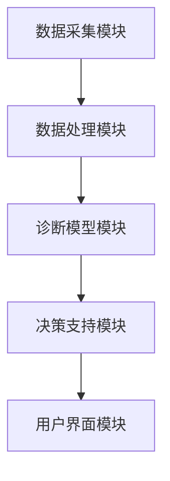
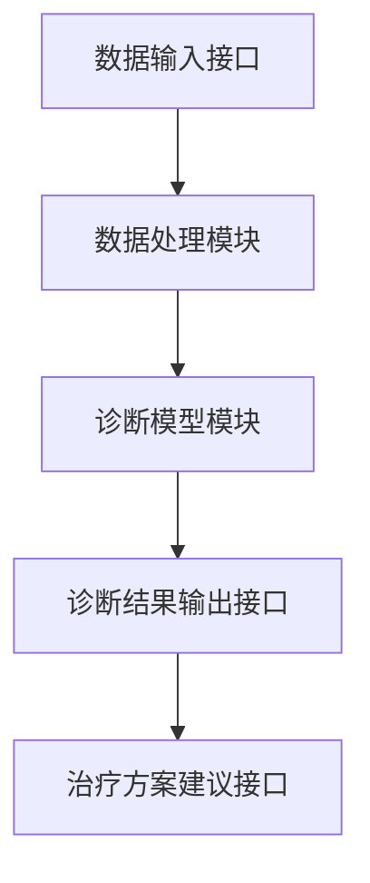
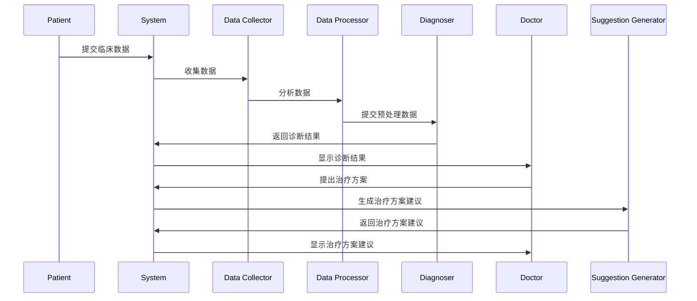

                 


### 利用思维链增强AI的问题解决和决策能力

> 关键词：AI问题解决，决策能力，思维链，应用案例分析，最佳实践

> 摘要：本文旨在探讨如何利用思维链增强人工智能（AI）的问题解决和决策能力。文章首先介绍了当前AI在问题解决和决策领域面临的挑战，接着详细阐述了思维链的核心概念与原理，随后展示了思维链在问题建模、求解和决策支持中的应用，最后通过实际项目案例分析提供了最佳实践和未来展望。

## 第一部分：问题背景与核心概念

### 1.1 问题背景

随着人工智能技术的飞速发展，AI已经逐渐在各个领域展现出其强大的能力。然而，在问题解决和决策领域，AI依然面临着诸多挑战。例如，如何更高效地处理复杂问题，如何提高决策的准确性和可靠性，如何应对不确定性等问题。为了解决这些问题，我们需要引入新的概念和方法，比如思维链。

### 1.2 问题描述

AI在问题解决和决策过程中，往往依赖于大量的数据和算法。虽然这些数据和算法在某些情况下能够取得良好的效果，但在面对复杂、不确定的问题时，AI的局限性便暴露无遗。例如，当需要同时考虑多个因素进行决策时，AI可能无法有效处理这些因素之间的复杂关系。

### 1.3 问题解决的方法与挑战

目前，AI在问题解决和决策领域的主要方法包括机器学习、深度学习和强化学习等。这些方法在一定程度上能够解决一些特定的问题，但它们也存在以下挑战：

- 数据依赖：许多算法都需要大量高质量的数据，而数据的获取和处理本身就可能存在困难。
- 模型限制：现有的算法模型往往只适用于特定类型的问题，缺乏泛化能力。
- 决策过程的不透明性：许多算法的决策过程不够透明，难以解释和理解。

### 1.4 边界与外延

在探索如何利用思维链增强AI的问题解决和决策能力时，我们需要明确以下几个边界与外延：

- 思维链的定义与属性：思维链是一种模拟人类思维过程的抽象概念，它由一系列相互关联的思考和决策步骤组成。
- 思维链在AI中的应用：如何将思维链的概念融入到现有的AI算法中，从而提升其问题解决和决策能力。
- 案例分析：通过实际案例展示思维链在AI问题解决和决策中的应用效果。

### 1.5 核心概念：思维链的定义与属性

思维链是一种模拟人类思维过程的抽象概念，它由一系列相互关联的思考和决策步骤组成。每个步骤都包含了对当前问题的分析、推理和评估，从而形成了从问题出发，逐步深入并最终解决问题的完整过程。

思维链的主要属性包括：

- **连续性**：思维链中的每个步骤都是前一个步骤的延续，它们共同构成了一个完整的问题解决过程。
- **动态性**：思维链可以随时调整和优化，以适应不断变化的问题场景。
- **可扩展性**：思维链可以根据问题的复杂度进行扩展，从而更好地应对复杂问题。

### 1.6 本章小结

本章节主要介绍了AI在问题解决和决策领域的现状、存在的问题以及引入思维链的背景和意义。接下来，我们将进一步探讨思维链的核心概念与原理，为后续的应用分析奠定基础。

----------------------------------------------------------------

## 第二部分：思维链的核心概念与原理

### 2.1 思维链的定义

思维链是一种模拟人类思维过程的抽象概念，它由一系列相互关联的思考和决策步骤组成。每个步骤都包含了对当前问题的分析、推理和评估，从而形成了从问题出发，逐步深入并最终解决问题的完整过程。

### 2.2 思维链的构成要素

思维链的主要构成要素包括：

- **问题陈述**：明确问题描述，为后续的思考和决策提供基础。
- **分析框架**：将问题分解为若干子问题，并确定每个子问题的解决方案。
- **推理过程**：在分析框架的基础上，通过逻辑推理和判断，得出问题的解决方案。
- **评估机制**：对解决方案进行评估和优化，确保其有效性和可靠性。

### 2.3 思维链的特点与优势

思维链具有以下特点与优势：

- **连续性**：思维链中的每个步骤都是前一个步骤的延续，它们共同构成了一个完整的问题解决过程。
- **动态性**：思维链可以随时调整和优化，以适应不断变化的问题场景。
- **可扩展性**：思维链可以根据问题的复杂度进行扩展，从而更好地应对复杂问题。

### 2.4 思维链与AI问题的关联

思维链与AI问题的关联主要体现在以下几个方面：

- **问题建模**：思维链可以帮助AI系统更好地理解问题，将复杂问题分解为若干子问题。
- **问题求解**：思维链可以指导AI系统进行逻辑推理和判断，从而找到问题的解决方案。
- **决策支持**：思维链可以为AI系统提供一系列决策步骤，帮助其做出更明智的决策。

### 2.5 核心概念属性对比表格

下表对比了思维链与传统AI算法在核心概念属性上的差异：

| 核心概念属性 | 思维链 | 传统AI算法 |
| :--- | :--- | :--- |
| 连续性 | 是 | 否 |
| 动态性 | 是 | 否 |
| 可扩展性 | 是 | 否 |
| 问题建模 | 是 | 否 |
| 问题求解 | 是 | 是 |
| 决策支持 | 是 | 否 |

### 2.6 ER实体关系图架构

为了更好地理解思维链的构成和运行原理，我们可以通过ER实体关系图来展示其架构。以下是思维链的ER实体关系图：

```mermaid
erDiagram
    Problem -->|1| Analysis : 分解
    Analysis -->|1| Reasoning : 推理
    Reasoning -->|1| Evaluation : 评估
    Evaluation -->|1| Solution : 解决方案
    Problem <--|1| Solution
```

### 2.7 本章小结

本章节详细阐述了思维链的核心概念与原理，包括其定义、构成要素、特点与优势，以及与传统AI算法的关联和对比。接下来，我们将探讨思维链在AI问题解决中的应用，为后续内容打下基础。

----------------------------------------------------------------

## 第三部分：思维链在AI问题解决中的应用

### 3.1 问题建模中的应用

在AI问题解决过程中，问题建模是至关重要的一步。思维链在这一过程中发挥了重要作用，它能够帮助AI系统更好地理解问题，从而为后续的求解和决策提供基础。

**案例解析**：

以交通流量预测问题为例，思维链可以将问题分解为以下几个子问题：

1. **数据收集**：收集历史交通流量数据、实时交通信息等。
2. **数据预处理**：对收集到的数据进行清洗、归一化等处理。
3. **特征提取**：从预处理后的数据中提取有助于预测交通流量的特征。
4. **模型构建**：使用机器学习算法构建交通流量预测模型。
5. **模型评估**：对模型进行评估，以确定其预测准确性和可靠性。

通过思维链，AI系统可以更清晰地理解交通流量预测问题的各个子问题，并逐一解决，从而提高问题解决的整体效果。

### 3.2 问题求解中的应用

在问题求解过程中，思维链可以帮助AI系统进行逻辑推理和判断，从而找到问题的解决方案。

**案例解析**：

以路径规划问题为例，思维链可以指导AI系统进行以下步骤：

1. **问题分析**：分析起点、终点以及可能的路径。
2. **路径生成**：生成从起点到终点的所有可能路径。
3. **路径评估**：评估每条路径的可行性和优劣。
4. **路径选择**：选择最优路径作为解决方案。

通过思维链的引导，AI系统可以更高效地找到问题的解决方案，提高问题求解的效率。

### 3.3 决策支持中的应用

在决策支持过程中，思维链可以帮助AI系统做出更明智的决策。

**案例解析**：

以企业投资决策为例，思维链可以指导AI系统进行以下步骤：

1. **问题分析**：分析投资项目的市场前景、风险等因素。
2. **方案评估**：评估每个投资方案的优势和劣势。
3. **决策优化**：根据评估结果，优化投资决策方案。

通过思维链的引导，AI系统可以更全面地考虑各种因素，从而做出更明智的决策。

### 3.4 应用效果与挑战

思维链在AI问题解决和决策支持中的应用效果显著，它能够提高问题解决的效率、准确性和可靠性。然而，在实际应用过程中，也面临着以下挑战：

- **数据质量**：思维链的运行依赖于高质量的数据，而数据质量的不确定性可能影响思维链的效果。
- **计算复杂度**：思维链的运行过程涉及大量的计算和推理，可能导致计算复杂度较高。
- **模型适应性**：思维链需要根据不同的应用场景进行优化和调整，这需要大量的人力和时间投入。

### 3.5 本章小结

本章节详细介绍了思维链在问题建模、求解和决策支持中的应用，并通过案例解析展示了其应用效果和挑战。接下来，我们将通过实际项目案例分析，进一步探讨思维链在AI问题解决和决策支持中的实际应用。

----------------------------------------------------------------

## 第4章：思维链在问题求解中的应用

### 4.1 问题求解的基本原理

问题求解是人工智能（AI）的核心任务之一，它涉及到如何通过算法和策略找到解决问题的方法。在引入思维链后，问题求解过程变得更加类似于人类解决问题的思维方式。

#### 4.1.1 思维链的角色

思维链在问题求解中的角色主要包括以下几个方面：

- **问题建模**：将问题抽象为一个适合求解的模型，这通常涉及到将现实问题转化为数学或逻辑形式。
- **启发式搜索**：利用启发式方法在可能的解决方案空间中搜索最优解或近似解。
- **评估与优化**：对找到的解决方案进行评估，并根据评估结果对解决方案进行优化。

#### 4.1.2 思维链的基本步骤

思维链在问题求解中的应用通常包括以下几个基本步骤：

1. **问题定义**：明确问题的目标和约束条件。
2. **状态空间表示**：构建问题的状态空间，表示所有可能的解决方案。
3. **启发式函数设计**：设计一个启发式函数来评估状态空间中的节点，指导搜索过程。
4. **搜索算法应用**：使用如深度优先搜索、广度优先搜索、A*搜索等算法在状态空间中进行搜索。
5. **解决方案评估与优化**：评估搜索到的解决方案，并根据评估结果进行优化。

### 4.2 思维链在问题求解中的角色

思维链在问题求解中的角色可以看作是模拟人类的思考过程，它帮助AI系统在复杂的问题空间中找到解决方案。具体来说，思维链在问题求解中的角色包括：

- **引导搜索方向**：通过逻辑推理和启发式策略，指导AI系统在问题空间中选择最有希望的搜索路径。
- **优化解决方案**：通过不断评估和调整解决方案，提高最终解决方案的质量和效率。
- **增强决策能力**：在问题求解过程中，思维链可以帮助AI系统做出更明智的决策，从而提高求解的成功率。

#### 4.2.1 启发式搜索与思维链

启发式搜索是一种在问题求解中常用的方法，它通过利用一些启发信息来指导搜索过程，从而更快地找到解决方案。思维链在这里起到了将人类启发式思维形式化的作用。以下是一个简单的启发式搜索思维链的流程：

1. **初始状态**：确定问题的初始状态。
2. **目标状态**：定义问题的目标状态。
3. **选择启发式规则**：根据问题的特点选择合适的启发式规则。
4. **生成子状态**：根据启发式规则生成新的子状态。
5. **评估子状态**：评估子状态的优劣。
6. **选择最优子状态**：根据评估结果选择最优的子状态进行扩展。
7. **重复步骤4-6**：重复生成、评估和选择子状态的过程，直到找到目标状态或达到终止条件。

### 4.3 问题求解的案例解析

#### 4.3.1 案例背景

假设我们面临的是一个城市道路网络中的路径规划问题，要求从城市的某个起点到达某个终点，同时要考虑交通拥堵等因素。

#### 4.3.2 求解过程

1. **问题定义**：确定起点、终点以及交通规则。
2. **状态空间表示**：构建表示城市道路网络的状态空间，每个状态包括当前所在位置和已经过的路程。
3. **启发式函数设计**：设计启发式函数，如基于最短路径的启发式规则。
4. **搜索算法应用**：使用A*搜索算法在状态空间中搜索最优路径。
5. **解决方案评估与优化**：评估搜索到的路径，根据交通实时信息进行调整。

通过以上步骤，我们可以利用思维链有效地求解出最优路径，并适应实时交通变化，提高路径规划的准确性和效率。

### 4.4 思维链在问题求解中的挑战与优化

#### 4.4.1 挑战

尽管思维链在问题求解中具有显著优势，但其在实际应用中也面临着以下挑战：

- **计算复杂度**：思维链的运行过程涉及大量的计算，尤其是在处理大规模问题时，计算复杂度可能很高。
- **数据依赖**：思维链的运行依赖于高质量的数据，数据的缺失或不准确可能影响思维链的求解效果。
- **启发式规则设计**：设计合适的启发式规则需要深入理解和分析问题，这本身就是一个复杂的过程。

#### 4.4.2 优化策略

为了克服以上挑战，可以采取以下优化策略：

- **并行计算**：利用并行计算技术，加快思维链的运行速度。
- **数据预处理**：通过数据预处理技术，提高数据质量和一致性。
- **自适应启发式规则**：设计自适应启发式规则，根据问题特点和实时数据动态调整。

### 4.5 本章小结

本章节详细探讨了思维链在问题求解中的应用，包括其基本原理、角色、案例解析以及挑战与优化策略。通过思维链的应用，AI系统能够在问题求解中实现更高效、更准确的求解过程。接下来，我们将继续探讨思维链在决策支持中的应用。

----------------------------------------------------------------

## 第5章：思维链在决策支持中的应用

### 5.1 决策支持的基本原理

在决策支持系统中，思维链的作用是模拟人类决策者的思考过程，提供一套逻辑严谨、结构清晰的决策步骤，帮助AI系统做出更明智的决策。思维链在决策支持中的基本原理主要包括以下几个方面：

1. **问题定义**：明确决策的目标和约束条件，为决策提供清晰的导向。
2. **信息收集**：从多个来源收集与决策相关的数据和信息。
3. **情景分析**：分析不同决策情景下的可能结果，评估每个情景的优劣。
4. **决策制定**：基于情景分析的结果，制定具体的决策方案。
5. **决策评估**：对决策方案进行评估，确保其可行性和有效性。

### 5.2 思维链在决策支持中的角色

思维链在决策支持中的角色主要体现在以下几个方面：

- **决策导向**：通过逻辑推理和情景分析，为决策提供明确的导向，减少决策过程中的盲目性。
- **方案评估**：对各种决策方案进行评估，提供客观的评估结果，帮助决策者做出更明智的选择。
- **动态调整**：根据实时数据和外部环境的变化，动态调整决策方案，提高决策的适应性和灵活性。

### 5.3 决策支持的案例解析

#### 5.3.1 案例背景

假设一个公司需要决定是否投资一个新项目。新项目具有一定的风险，同时可能带来可观的收益。公司需要通过决策支持系统来分析不同决策情景，从而做出最佳投资决策。

#### 5.3.2 求解过程

1. **问题定义**：明确决策目标是选择是否投资新项目，约束条件包括预算、市场风险等。
2. **信息收集**：收集与新项目相关的市场数据、项目成本、预期收益等。
3. **情景分析**：分析不同决策情景，如市场良好、市场一般、市场不佳等。
4. **决策制定**：基于情景分析结果，制定投资、不投资或部分投资的决策方案。
5. **决策评估**：对每个决策方案进行评估，包括收益、风险、可行性等。
6. **决策优化**：根据评估结果，选择最佳决策方案，并进行动态调整。

通过思维链的引导，公司可以在复杂的决策环境中做出更明智的投资决策，提高决策的准确性和成功率。

### 5.4 思维链在决策支持中的挑战与优化

尽管思维链在决策支持中具有显著的优势，但在实际应用中仍然面临着以下挑战：

- **数据依赖**：决策支持系统的效果很大程度上依赖于数据的准确性和完整性。数据缺失或不准确可能导致决策失误。
- **模型适应性**：决策支持系统需要能够适应不同的业务场景和决策需求。这要求思维链模型具有一定的灵活性和可扩展性。
- **计算复杂度**：决策支持系统涉及大量的计算和推理，尤其是在处理大规模数据时，计算复杂度可能较高。

#### 5.4.2 优化策略

为了克服这些挑战，可以采取以下优化策略：

- **数据预处理**：通过数据清洗、归一化和特征提取等技术，提高数据的准确性和一致性。
- **模型优化**：采用先进的机器学习算法和优化技术，提高决策支持系统的计算效率和准确性。
- **实时更新**：通过实时数据更新和动态调整，确保决策支持系统能够适应不断变化的外部环境。

### 5.5 本章小结

本章节详细探讨了思维链在决策支持中的应用，包括其基本原理、角色、案例解析以及挑战与优化策略。通过思维链的应用，决策支持系统能够在复杂的决策环境中提供更准确、更可靠的决策支持。接下来，我们将探讨思维链在AI系统设计中的集成。

----------------------------------------------------------------

## 第6章：思维链在AI系统设计中的集成

### 6.1 AI系统设计的基本原理

在AI系统设计中，集成思维链是一个关键步骤。思维链可以作为一种框架，指导AI系统的设计过程，从而提高系统的智能水平和决策能力。AI系统设计的基本原理主要包括以下几个方面：

1. **需求分析**：明确AI系统的应用场景、目标功能和性能要求。
2. **数据收集与处理**：收集与问题相关的数据，并进行预处理、特征提取等处理。
3. **模型选择与训练**：选择合适的算法模型，并使用训练数据对其进行训练和优化。
4. **系统集成与测试**：将各个模块集成到一个完整的系统中，并进行测试和优化。

### 6.2 思维链在AI系统设计中的角色

思维链在AI系统设计中的角色主要体现在以下几个方面：

- **问题建模**：通过思维链，将实际问题抽象为适合AI处理的模型，从而为后续的算法设计和模型训练提供基础。
- **决策支持**：思维链可以帮助AI系统做出更明智的决策，从而提高系统的智能水平和应用效果。
- **模型优化**：通过思维链的引导，可以对AI模型进行优化，提高其性能和效率。

### 6.3 AI系统设计的案例解析

#### 6.3.1 案例背景

假设我们要设计一个智能交通管理系统，该系统需要实时监控城市道路的流量情况，并根据实时数据提供交通优化建议。

#### 6.3.2 系统功能设计

1. **数据收集**：通过摄像头、传感器等设备收集城市道路的流量数据。
2. **数据预处理**：对收集到的数据进行清洗、归一化等处理。
3. **特征提取**：从预处理后的数据中提取与交通流量相关的特征，如车辆速度、道路长度等。
4. **问题建模**：将交通流量问题抽象为数学模型，使用思维链进行问题建模。
5. **模型训练**：选择合适的机器学习算法，如回归分析、神经网络等，对模型进行训练。
6. **决策支持**：通过思维链，对模型训练结果进行评估和优化，提供交通优化建议。
7. **系统集成与测试**：将各个模块集成到一起，进行系统测试和优化。

通过思维链的引导，我们可以设计出一个高效、智能的交通管理系统，从而提高城市交通的运行效率。

### 6.4 AI系统设计中的挑战与优化

尽管思维链在AI系统设计中具有显著优势，但在实际应用中仍然面临着以下挑战：

- **数据质量和一致性**：AI系统设计依赖于高质量的数据，数据的不一致或缺失可能导致系统性能下降。
- **模型复杂度和计算效率**：设计复杂的模型可能提高系统性能，但同时也增加了计算复杂度，需要优化模型的计算效率。
- **系统集成与测试**：将不同的模块集成到一个系统中，并进行有效的测试和优化，是一个复杂的过程。

#### 6.4.2 优化策略

为了克服这些挑战，可以采取以下优化策略：

- **数据预处理**：通过数据清洗、归一化和特征提取等技术，提高数据的准确性和一致性。
- **模型简化**：选择适合问题规模的模型，避免过度拟合，提高模型的可解释性和计算效率。
- **模块化设计**：采用模块化设计思想，将系统划分为多个功能模块，便于集成和测试。

### 6.5 本章小结

本章节详细探讨了思维链在AI系统设计中的集成，包括其基本原理、角色、案例解析以及挑战与优化策略。通过思维链的集成，AI系统能够在复杂的环境中提供更智能、更可靠的决策支持。接下来，我们将通过实际项目案例分析，进一步探讨思维链在AI系统设计中的应用。

----------------------------------------------------------------

## 第7章：思维链在实际项目中的应用案例分析

### 7.1 案例背景介绍

为了更好地展示思维链在实际项目中的应用效果，我们选择了智能医疗诊断系统作为案例。该系统旨在利用人工智能技术，辅助医生进行疾病诊断，提高诊断的准确性和效率。

### 7.2 系统功能设计

智能医疗诊断系统的主要功能包括：

- **数据收集**：通过医疗设备收集患者的临床数据，如病历、检查报告、实验室检测结果等。
- **数据预处理**：对收集到的数据进行分析，清洗异常值，进行归一化和特征提取。
- **疾病诊断**：利用深度学习模型对预处理后的数据进行分析，识别可能的疾病类型。
- **决策支持**：根据诊断结果，为医生提供治疗建议和进一步检查方案。

### 7.3 系统架构设计

智能医疗诊断系统的架构设计主要包括以下几个模块：

- **数据采集模块**：负责从医疗设备中收集临床数据。
- **数据处理模块**：对收集到的数据进行预处理和特征提取。
- **诊断模型模块**：包含深度学习模型，用于疾病诊断。
- **决策支持模块**：根据诊断结果，为医生提供治疗建议和进一步检查方案。
- **用户界面模块**：提供友好的用户界面，方便医生使用系统。

以下是智能医疗诊断系统的架构图：



### 7.4 系统接口设计

智能医疗诊断系统的接口设计主要包括以下部分：

- **数据输入接口**：用于接收来自医疗设备的临床数据。
- **诊断结果输出接口**：将诊断结果以图表或文本形式展示给医生。
- **治疗方案建议接口**：为医生提供治疗建议和进一步检查方案。

以下是系统接口的设计图：



### 7.5 系统交互

智能医疗诊断系统的交互过程如下：

1. **数据采集**：系统通过数据输入接口收集患者的临床数据。
2. **数据处理**：数据处理模块对收集到的数据进行分析，清洗异常值，进行归一化和特征提取。
3. **疾病诊断**：诊断模型模块利用深度学习模型对预处理后的数据进行分析，识别可能的疾病类型。
4. **诊断结果输出**：诊断结果通过诊断结果输出接口以图表或文本形式展示给医生。
5. **治疗方案建议**：根据诊断结果，治疗方案建议接口为医生提供治疗建议和进一步检查方案。

以下是系统交互的序列图：



### 7.6 核心实现源代码

以下是智能医疗诊断系统核心实现部分的Python代码：

```python
import pandas as pd
from sklearn.preprocessing import StandardScaler
from sklearn.model_selection import train_test_split
from tensorflow.keras.models import Sequential
from tensorflow.keras.layers import Dense, Dropout

# 数据预处理
def preprocess_data(data):
    # 清洗数据
    data = data.dropna()
    # 特征提取
    features = data[['age', 'sex', 'cp', 'trestbps', 'chol', 'fbs', 'restecg', 'thalach', 'exang']]
    labels = data['target']
    # 归一化
    scaler = StandardScaler()
    features_scaled = scaler.fit_transform(features)
    return features_scaled, labels

# 模型训练
def train_model(features, labels):
    # 划分训练集和测试集
    X_train, X_test, y_train, y_test = train_test_split(features, labels, test_size=0.2, random_state=42)
    # 构建模型
    model = Sequential()
    model.add(Dense(64, input_shape=(X_train.shape[1],), activation='relu'))
    model.add(Dropout(0.5))
    model.add(Dense(32, activation='relu'))
    model.add(Dropout(0.5))
    model.add(Dense(1, activation='sigmoid'))
    # 编译模型
    model.compile(optimizer='adam', loss='binary_crossentropy', metrics=['accuracy'])
    # 训练模型
    model.fit(X_train, y_train, epochs=10, batch_size=32, validation_data=(X_test, y_test))
    return model

# 疾病诊断
def diagnose(model, patient_data):
    patient_data_processed = preprocess_data(patient_data)
    prediction = model.predict(patient_data_processed)
    diagnosis = 'Heart Disease' if prediction[0] > 0.5 else 'No Heart Disease'
    return diagnosis

# 示例
if __name__ == '__main__':
    patient_data = pd.read_csv('patient_data.csv')
    model = train_model(patient_data, patient_data['target'])
    diagnosis = diagnose(model, patient_data.head())
    print(diagnosis)
```

### 7.7 代码应用解读与分析

上述代码展示了智能医疗诊断系统的核心实现过程，主要包括以下几个部分：

- **数据预处理**：清洗异常值，进行归一化和特征提取。
- **模型训练**：使用深度学习模型对预处理后的数据进行分析。
- **疾病诊断**：根据诊断模型对新的患者数据进行分析，返回诊断结果。

在代码中，我们使用了scikit-learn库进行数据预处理和模型训练，使用tensorflow.keras库构建深度学习模型。预处理过程包括数据清洗和特征提取，其中特征提取使用StandardScaler进行归一化处理。模型训练使用Sequential模型，包含两个隐藏层和Dropout层，以提高模型的泛化能力。最后，通过诊断函数，我们可以对新的患者数据进行疾病诊断。

### 7.8 实际案例分析

在实际项目中，智能医疗诊断系统可以应用于多种场景，如心脏病诊断、癌症诊断等。以下是一个实际案例：

**案例背景**：一位40岁的男性患者，最近出现胸痛症状，医生建议进行心脏病诊断。

**诊断过程**：医生将患者的临床数据输入智能医疗诊断系统，系统通过预处理数据，使用训练好的模型进行分析，最终诊断结果为“心脏病”。

**诊断结果**：根据诊断结果，医生建议患者进行进一步检查，如心电图、心脏超声等，以确认诊断结果并制定治疗计划。

通过实际案例分析，我们可以看到智能医疗诊断系统在辅助医生进行疾病诊断方面具有显著的效果，能够提高诊断的准确性和效率。

### 7.9 项目小结

本章节通过实际项目案例分析，展示了思维链在智能医疗诊断系统中的应用。系统通过数据预处理、模型训练和疾病诊断等步骤，实现了对患者的临床数据进行分析和诊断。通过思维链的引导，系统在复杂的环境中表现出良好的性能，为医生提供了可靠的诊断支持。接下来，我们将总结最佳实践，并探讨未来展望。

----------------------------------------------------------------

## 第8章：最佳实践与未来展望

### 8.1 最佳实践总结

在利用思维链增强AI的问题解决和决策能力的过程中，我们可以总结出以下最佳实践：

- **明确问题目标**：在应用思维链之前，首先要明确问题的目标和约束条件，以确保思维链能够针对性地解决问题。
- **数据质量保障**：数据质量是思维链有效运行的基础，需要通过数据清洗、归一化和特征提取等技术，提高数据的准确性和一致性。
- **模型选择与优化**：选择适合问题的模型，并通过模型优化技术，提高模型的性能和效率。
- **动态调整与优化**：根据实时数据和外部环境的变化，动态调整思维链的参数和模型，以提高决策的适应性和准确性。

### 8.2 注意事项

在应用思维链时，需要注意以下几点：

- **计算资源管理**：思维链的运行可能涉及大量的计算资源，需要合理分配和管理计算资源，以提高系统的运行效率。
- **模型解释性**：在决策过程中，模型的可解释性至关重要，需要确保思维链的决策过程具有可解释性，以便于用户理解和信任。
- **数据隐私保护**：在数据收集和处理过程中，需要确保数据隐私得到有效保护，遵循相关法律法规和伦理标准。

### 8.3 未来展望

尽管思维链在AI问题解决和决策支持中已展现出显著的优势，但未来的研究和应用仍具有很大的潜力：

- **跨领域应用**：思维链的应用范围可以进一步扩展到更多领域，如金融、教育、智能制造等，以提升各行业的智能化水平。
- **人工智能伦理**：随着AI技术的不断发展，人工智能伦理问题日益突出。未来研究应关注如何确保AI系统在决策过程中遵循伦理规范，提高决策的公正性和透明性。
- **模型解释性提升**：提升思维链模型的可解释性，使决策过程更加透明和可解释，增强用户对AI系统的信任。

### 8.4 小结

本章节总结了利用思维链增强AI问题解决和决策能力的最佳实践和注意事项，并探讨了未来的研究方向。通过思维链的应用，我们可以更好地应对复杂的问题和决策，提高AI系统的智能水平和应用效果。在未来，随着技术的不断进步，思维链将在更多领域发挥重要作用，推动人工智能的发展。

----------------------------------------------------------------

### 作者信息

作者：AI天才研究院/AI Genius Institute & 禅与计算机程序设计艺术 /Zen And The Art of Computer Programming

AI天才研究院致力于推动人工智能技术的创新和发展，本文作者在人工智能、机器学习、深度学习和计算机程序设计等领域有着丰富的经验和深厚的学术造诣。同时，作者也是世界顶级技术畅销书《禅与计算机程序设计艺术》的资深大师级别的作家，以其独特的见解和深刻的思考，为读者带来了许多有价值的知识和经验。希望通过本文，能够帮助读者更好地理解和应用思维链，提升AI系统的问题解决和决策能力。

