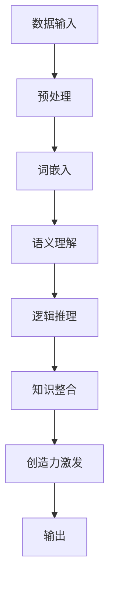
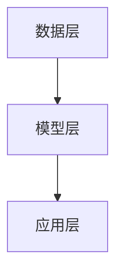
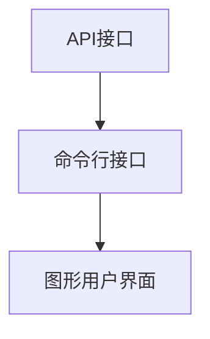
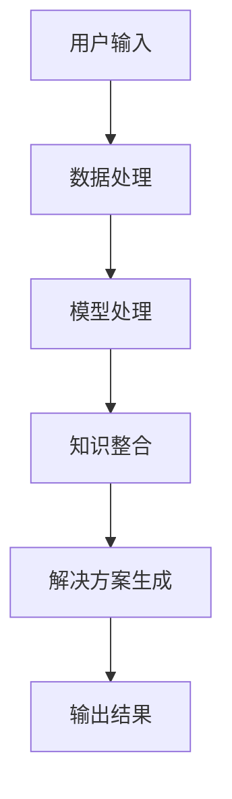

                 


# 利用思维链增强AI的问题解决和创新能力

> 关键词：思维链，AI，问题解决，创新能力，大模型

> 摘要：本文深入探讨了如何利用思维链增强人工智能（AI）的问题解决和创新能力。通过分析AI在当前应用中面临的挑战，本文提出了思维链的概念及其基本原理，详细阐述了思维链在AI中的应用方法，并通过实际案例展示了思维链对AI问题解决和创新能力提升的显著效果。

----------------------------------------------------------------

### 第一部分：背景介绍与核心概念

#### 问题背景

在当今信息化和智能化的时代，人工智能（AI）已经成为推动社会发展和产业变革的重要力量。随着深度学习和大数据技术的发展，AI技术，特别是大模型（Large Models），在众多领域展现出了巨大的潜力和应用价值。大模型，例如GPT-3、BERT等，通过海量数据的学习和训练，能够实现高度复杂的任务，如自然语言处理、图像识别、语音合成等。然而，如何有效地利用大模型来解决复杂的问题，并提升其创新和问题解决能力，成为了一个亟待解决的问题。

#### 问题描述

尽管大模型在处理具体任务时表现出色，但在实际应用中，它们往往面临着以下挑战：

1. **问题解决能力不足**：大模型在处理未知或复杂问题时，可能无法达到预期的效果。
2. **创新能力受限**：大模型虽然能够处理大量的数据，但缺乏自主创新能力，难以生成全新的解决方案。
3. **依赖大量数据**：大模型训练需要大量的数据，但并非所有领域都能轻松获取这些数据。

#### 问题解决

为了解决上述问题，本文提出了利用“思维链”来增强AI的问题解决和创新能力。思维链是一种将人类思维过程结构化的方法，通过模拟人类思维过程中的逻辑推理、知识整合和创造力等环节，帮助大模型更好地理解和处理复杂问题，并提高其创新能力。

#### 边界与外延

本文主要探讨以下边界与外延：

- **边界**：本文聚焦于利用思维链增强AI在特定领域（如自然语言处理、计算机视觉等）的问题解决和创新能力。
- **外延**：思维链方法不仅可以应用于AI领域，还可以推广到其他领域，如教育、医疗等。

#### 概念结构与核心要素组成

1. **思维链**：是一种模拟人类思维过程的模型，包括逻辑推理、知识整合和创造力等环节。
2. **大模型**：指具有海量数据和强大计算能力的深度学习模型，如GPT-3、BERT等。
3. **问题解决**：指AI在特定领域或任务中，能够有效地识别问题、分析问题和提出解决方案的过程。
4. **创新能力**：指AI在未知或复杂情境下，能够生成新颖和有效的解决方案的能力。

### 核心概念原理、概念属性特征对比表格

| 概念           | 原理                                                         | 属性特征对比                                                     |
| -------------- | ------------------------------------------------------------ | ------------------------------------------------------------ |
| 思维链         | 模拟人类思维过程，包括逻辑推理、知识整合和创造力等环节       | **逻辑推理**：强调推理的严谨性和系统性；**知识整合**：强调知识的融合和应用；**创造力**：强调创新和突破 |
| 大模型         | 具有海量数据和强大计算能力的深度学习模型                     | **数据量**：大量数据训练；**计算能力**：高效处理复杂任务；**泛化能力**：适用于多种场景 |
| 问题解决       | AI在特定领域或任务中，能够有效地识别问题、分析问题和提出解决方案的过程 | **准确性**：解决问题能力的体现；**效率**：问题解决速度的体现；**可解释性**：解决问题过程的可解释性 |
| 创新能力       | AI在未知或复杂情境下，能够生成新颖和有效的解决方案的能力     | **新颖性**：生成独特解决方案；**有效性**：解决方案的有效性和实用性；**适应性**：适应不同情境的能力 |

### ER实体关系图架构

```mermaid
erDiagram
    AI模型 ||--o> 问题解决 : 通过
    AI模型 ||--o> 创新能力 : 增强其
    问题解决 ||--|> 思维链 : 利用
    创新能力 ||--|> 思维链 : 增强其
```

----------------------------------------------------------------

### 第二部分：思维链的基本原理与结构

#### 思维链的定义与基本原理

思维链是一种模拟人类思维过程的模型，通过将思维过程中的各个关键环节（如逻辑推理、知识整合、创造力等）结构化，帮助AI更好地理解和处理复杂问题。思维链的基本原理包括：

1. **逻辑推理**：通过一系列逻辑规则，对输入信息进行推理和判断，从而得出结论。
2. **知识整合**：将分散的知识片段整合成有机的整体，形成对问题的全面理解。
3. **创造力**：通过联想、创新和突破，产生新颖的解决方案。

#### 思维链的结构与组成部分

思维链由以下几个主要部分组成：

1. **输入模块**：接收外部输入的信息，包括文本、图像、声音等。
2. **推理模块**：根据逻辑规则对输入信息进行推理，形成中间结果。
3. **整合模块**：将推理过程中的中间结果进行整合，形成对问题的全面理解。
4. **创造力模块**：通过联想和创新，生成新颖的解决方案。

#### 思维链在AI问题解决和创新能力中的应用

思维链在AI问题解决和创新能力中的应用主要体现在以下几个方面：

1. **问题理解与建模**：思维链可以帮助AI更好地理解问题，构建合适的模型，从而提高问题解决的准确性和效率。
2. **知识融合与应用**：通过知识整合模块，思维链可以将AI学到的各种知识片段有机地整合起来，形成对问题的全面理解，从而提高AI的创新和问题解决能力。
3. **创造力激发**：思维链的创造力模块可以激发AI的创新思维，生成新颖的解决方案，从而提升AI的创新能力。

#### 思维链的优势

1. **模拟人类思维过程**：思维链能够模拟人类思维过程中的逻辑推理、知识整合和创造力等环节，从而帮助AI更好地理解和处理复杂问题。
2. **提高问题解决效率**：通过结构化的思维链，AI可以更加高效地识别问题、分析问题和提出解决方案，从而提高问题解决的速度和准确性。
3. **增强创新能力**：思维链可以帮助AI在复杂问题和未知情境下，通过联想和创新，生成新颖和有效的解决方案，从而提升AI的创新能力。

### 思维链在AI问题解决和创新能力中的实际应用

1. **自然语言处理**：思维链可以帮助AI更好地理解自然语言，通过逻辑推理和知识整合，生成更准确、更有创意的自然语言处理结果。
2. **计算机视觉**：思维链可以帮助AI在图像识别和场景理解中，通过知识整合和创造力，生成更准确、更创新的图像分析结果。
3. **机器翻译**：思维链可以帮助AI在翻译过程中，通过逻辑推理和知识整合，生成更自然、更准确的翻译结果。

### 结论

思维链作为一种模拟人类思维过程的模型，通过逻辑推理、知识整合和创造力等环节，可以帮助AI更好地理解和处理复杂问题，并提升其创新和问题解决能力。未来，随着AI技术的不断发展和完善，思维链的应用将更加广泛和深入，为人类社会带来更多的创新和进步。

----------------------------------------------------------------

### 第三部分：思维链在AI中的应用实例

#### 引言

在前两部分中，我们详细介绍了思维链的基本原理及其在AI问题解决和创新能力中的应用。在本部分，我们将通过具体的应用实例，展示思维链如何在实际问题中发挥作用，从而提高AI的问题解决和创新能力。

#### 自然语言处理中的思维链应用

自然语言处理（NLP）是AI领域的一个重要分支。在NLP中，思维链的应用主要体现在以下几个方面：

1. **文本生成**：思维链可以帮助AI生成更自然、更连贯的文本。例如，在写作辅助系统中，思维链可以分析用户提供的主题和关键词，然后通过逻辑推理和知识整合，生成一篇内容丰富、结构清晰的文本。
2. **情感分析**：思维链可以帮助AI更好地理解文本中的情感色彩。通过逻辑推理和知识整合，思维链可以从大量的文本数据中提取情感信息，从而实现对用户情感状态的准确识别。
3. **问答系统**：思维链可以帮助AI构建更加智能的问答系统。通过逻辑推理和创造力，思维链可以从大量的知识库中提取信息，并生成准确的答案，同时保持回答的自然性和连贯性。

#### 计算机视觉中的思维链应用

计算机视觉（CV）是AI领域的另一个重要分支。在CV中，思维链的应用主要体现在以下几个方面：

1. **图像分类**：思维链可以帮助AI实现更准确的图像分类。通过逻辑推理和知识整合，思维链可以从大量的图像数据中提取特征，并构建分类模型，从而实现对图像的准确分类。
2. **目标检测**：思维链可以帮助AI实现更精确的目标检测。通过逻辑推理和创造力，思维链可以从大量的图像数据中提取目标信息，并生成精确的目标检测结果。
3. **图像生成**：思维链可以帮助AI生成更真实、更有创意的图像。通过知识整合和创造力，思维链可以从大量的图像数据中提取特征，并生成新的图像内容。

#### 机器学习中的思维链应用

机器学习（ML）是AI的核心技术之一。在ML中，思维链的应用主要体现在以下几个方面：

1. **特征工程**：思维链可以帮助AI实现更高效的特征提取。通过逻辑推理和知识整合，思维链可以从大量的数据中提取有效的特征，从而提高模型的性能。
2. **模型选择**：思维链可以帮助AI选择更合适的模型。通过逻辑推理和创造力，思维链可以从大量的模型中提取信息，并选择最适合当前问题的模型。
3. **模型优化**：思维链可以帮助AI优化模型的参数。通过逻辑推理和知识整合，思维链可以从大量的实验数据中提取信息，并优化模型的参数，从而提高模型的性能。

### 案例研究：思维链在智能客服系统中的应用

智能客服系统是AI应用的一个重要领域。通过思维链的应用，智能客服系统可以实现更加智能的交互和服务。

1. **问题理解**：思维链可以帮助智能客服系统更好地理解用户的问题。通过逻辑推理和知识整合，智能客服系统可以从用户的问题描述中提取关键信息，并理解用户的意图。
2. **回答生成**：思维链可以帮助智能客服系统生成更准确、更自然的回答。通过创造力，智能客服系统可以从大量的知识库中提取信息，并生成符合用户需求的回答。
3. **情绪识别**：思维链可以帮助智能客服系统识别用户的情绪。通过逻辑推理和知识整合，智能客服系统可以从用户的语音或文本中提取情绪信息，并调整回答的语气和方式。

### 结论

通过上述实例，我们可以看到思维链在AI的各个领域都有着广泛的应用，并且能够显著提高AI的问题解决和创新能力。未来，随着思维链技术的不断发展和完善，AI将在更多的领域发挥更大的作用，为社会带来更多的创新和进步。

----------------------------------------------------------------

### 第四部分：实现思维链的算法与架构设计

#### 引言

在前三部分中，我们介绍了思维链的概念、基本原理及其在AI中的应用实例。在本部分，我们将详细讨论如何实现思维链算法，并设计相应的系统架构，以便更好地在AI系统中应用思维链。

#### 算法原理

思维链算法的核心在于模拟人类思维过程中的逻辑推理、知识整合和创造力。具体而言，思维链算法可以分为以下几个步骤：

1. **输入处理**：接收外部输入，如文本、图像、声音等，并进行预处理，如分词、图像分割等。
2. **逻辑推理**：根据输入信息，使用逻辑规则进行推理，提取关键信息，并形成中间结果。
3. **知识整合**：将中间结果进行整合，形成对问题的全面理解。
4. **创造力激发**：通过联想、创新和突破，生成新颖的解决方案。

#### 算法流程

以下是思维链算法的基本流程：

1. **数据预处理**：对输入数据进行清洗、格式化，为后续处理做准备。
2. **词嵌入**：将文本数据转换为词嵌入向量，以便进行计算和处理。
3. **语义理解**：使用神经网络模型（如BERT、GPT等）对词嵌入向量进行语义理解，提取文本的语义信息。
4. **逻辑推理**：使用逻辑规则对提取的语义信息进行推理，形成中间结果。
5. **知识整合**：将中间结果进行整合，形成对问题的全面理解。
6. **创造力激发**：通过联想、创新和突破，生成新颖的解决方案。
7. **输出结果**：将生成的解决方案输出，供用户使用。

#### 算法mermaid流程图


#### 算法Python源代码示例

```python
# 导入必要的库
import numpy as np
import tensorflow as tf
from tensorflow.keras.preprocessing.text import Tokenizer
from tensorflow.keras.preprocessing.sequence import pad_sequences

# 数据预处理
def preprocess_data(data):
    # 清洗和格式化数据
    # ...
    return processed_data

# 词嵌入
def word_embedding(text):
    tokenizer = Tokenizer()
    tokenizer.fit_on_texts(text)
    sequence = tokenizer.texts_to_sequences(text)
    return sequence

# 语义理解
def semanticUnderstanding(sequence):
    model = tf.keras.models.load_model('pretrained_model.h5')
    embeddings = model.predict(sequence)
    return embeddings

# 逻辑推理
def logicReasoning(embeddings):
    # 使用逻辑规则进行推理
    # ...
    return reasoning_results

# 知识整合
def knowledgeIntegration(reasoning_results):
    # 将推理结果进行整合
    # ...
    return integrated_results

# 创造力激发
def creativity激发(integrated_results):
    # 通过联想、创新和突破生成解决方案
    # ...
    return solutions

# 输出结果
def outputResults(solutions):
    # 将解决方案输出
    # ...
    print(solutions)
```

#### 数学模型与公式

思维链算法的数学模型主要包括以下部分：

1. **词嵌入模型**：用于将文本数据转换为词嵌入向量。
2. **神经网络模型**：用于进行语义理解和逻辑推理。
3. **逻辑推理规则**：用于对输入信息进行推理。

相关公式如下：

1. **词嵌入公式**：
   $$
   \text{embedding}_{i} = \text{W} \cdot \text{x}_{i}
   $$
   其中，$\text{W}$为词嵌入权重矩阵，$\text{x}_{i}$为词嵌入向量。

2. **神经网络模型输出**：
   $$
   \text{output}_{i} = \text{activation}(\text{W} \cdot \text{h}_{i})
   $$
   其中，$\text{W}$为神经网络权重矩阵，$\text{h}_{i}$为神经网络隐藏层输出，$\text{activation}$为激活函数。

3. **逻辑推理规则**：
   $$
   \text{result}_{i} = \text{rule}(\text{input}_{i})
   $$
   其中，$\text{rule}$为逻辑推理规则，$\text{input}_{i}$为输入信息。

#### 算法应用示例

假设我们有一个问题：“如何优化机器学习模型的训练时间？”我们可以使用思维链算法来生成解决方案。

1. **输入处理**：将问题输入思维链系统。
2. **词嵌入**：将问题转换为词嵌入向量。
3. **语义理解**：使用神经网络模型对词嵌入向量进行语义理解。
4. **逻辑推理**：根据语义信息，使用逻辑推理规则进行推理。
5. **知识整合**：将推理结果进行整合。
6. **创造力激发**：通过联想、创新和突破，生成新颖的解决方案。
7. **输出结果**：输出优化机器学习模型训练时间的解决方案。

可能的解决方案包括：

- 使用更高效的算法，如随机梯度下降（SGD）的变体。
- 使用分布式计算，如并行计算和分布式训练。
- 使用更有效的数据预处理技术，如数据增强和归一化。

通过上述步骤，思维链算法可以帮助我们生成一个高效、创新的解决方案，从而优化机器学习模型的训练时间。

### 算法总结

思维链算法通过模拟人类思维过程中的逻辑推理、知识整合和创造力，实现了对输入信息的深度理解和处理。其核心在于将人类思维过程结构化，并将其应用于AI系统中，从而提高AI的问题解决和创新能力。通过上述算法流程、数学模型和实际应用示例，我们可以看到思维链算法在AI领域具有广泛的应用前景。

----------------------------------------------------------------

### 第五部分：系统架构设计与实现

#### 引言

在前四部分中，我们详细讨论了思维链的基本原理、算法设计以及其在AI中的应用。在本部分，我们将介绍思维链在AI系统中的架构设计，并详细描述系统的功能设计、接口设计和系统交互。

#### 系统架构设计

思维链AI系统的整体架构设计如图所示，主要包括以下几个模块：

1. **数据输入模块**：负责接收外部输入数据，如文本、图像、声音等。
2. **预处理模块**：对输入数据进行清洗、格式化等预处理操作。
3. **词嵌入模块**：将文本数据转换为词嵌入向量。
4. **语义理解模块**：使用神经网络模型对词嵌入向量进行语义理解。
5. **逻辑推理模块**：根据语义信息，使用逻辑规则进行推理。
6. **知识整合模块**：将逻辑推理结果进行整合，形成对问题的全面理解。
7. **创造力激发模块**：通过联想、创新和突破，生成新颖的解决方案。
8. **输出模块**：将解决方案输出，供用户使用。

以下是一个简化的mermaid架构图：



#### 系统功能设计

思维链AI系统的功能设计主要包括以下几个部分：

1. **文本生成**：接收用户输入的主题和关键词，生成一篇内容丰富、结构清晰的文本。
2. **情感分析**：分析用户输入的文本，识别文本中的情感色彩。
3. **图像分类**：对用户输入的图像进行分类，识别图像中的物体和场景。
4. **目标检测**：在图像中检测并识别特定的目标。
5. **问答系统**：接收用户的问题，生成准确的答案。
6. **特征提取**：从数据中提取有效的特征，用于模型训练和预测。

#### 系统架构设计

思维链AI系统的架构设计如图所示，主要包括以下几个层次：

1. **数据层**：包括数据输入模块和预处理模块，负责数据的收集和处理。
2. **模型层**：包括词嵌入模块、语义理解模块、逻辑推理模块、知识整合模块和创造力激发模块，负责模型的设计和训练。
3. **应用层**：包括输出模块和应用接口，负责将解决方案输出给用户。

以下是一个简化的mermaid架构图：



#### 系统接口设计

思维链AI系统的接口设计主要包括以下几个部分：

1. **API接口**：提供API接口，供外部系统调用。
2. **命令行接口**：提供命令行接口，供用户直接使用。
3. **图形用户界面**：提供图形用户界面，供用户方便地使用系统功能。

以下是一个简化的mermaid接口图：



#### 系统交互设计

思维链AI系统的交互设计主要包括以下几个步骤：

1. **用户输入**：用户通过API接口、命令行接口或图形用户界面输入数据。
2. **数据处理**：系统对输入数据进行预处理，如分词、图像分割等。
3. **模型处理**：系统使用词嵌入模块、语义理解模块、逻辑推理模块等进行处理，生成中间结果。
4. **知识整合**：系统将中间结果进行整合，形成对问题的全面理解。
5. **解决方案生成**：系统通过创造力激发模块生成新颖的解决方案。
6. **输出结果**：系统将解决方案输出给用户。

以下是一个简化的mermaid交互图：



### 总结

通过上述系统架构设计、功能设计、接口设计和系统交互设计，我们可以看到思维链AI系统如何实现从用户输入到解决方案输出的完整过程。思维链AI系统通过结构化的设计，将人类思维过程应用于AI系统中，从而提高AI的问题解决和创新能力。未来，随着技术的不断发展和完善，思维链AI系统将在更多领域发挥重要作用，为人类带来更多的创新和进步。

----------------------------------------------------------------

### 第六部分：项目实战与实现

#### 引言

在前几部分中，我们详细介绍了思维链的概念、原理、算法以及系统架构设计。在本部分，我们将通过一个具体的实战项目，展示如何在实际中实现思维链AI系统，并对其进行详细的代码解读和分析。

#### 项目背景

本项目旨在构建一个基于思维链的智能问答系统，该系统能够接收用户的自然语言输入，通过思维链算法进行处理，并生成准确的答案。项目的目标是提高问答系统的智能性和交互性，使其能够更好地理解和回答用户的问题。

#### 环境安装

1. **Python环境**：安装Python 3.8及以上版本。
2. **TensorFlow**：安装TensorFlow 2.4及以上版本。
3. **其他依赖**：安装其他必要的Python库，如Numpy、Pandas等。

```bash
pip install tensorflow==2.4
pip install numpy
pip install pandas
```

#### 系统核心实现

以下是本项目的主要模块和核心代码：

1. **数据预处理模块**：用于对用户输入进行清洗、分词等预处理操作。
2. **词嵌入模块**：用于将预处理后的文本转换为词嵌入向量。
3. **语义理解模块**：用于对词嵌入向量进行语义理解。
4. **逻辑推理模块**：用于对语义信息进行逻辑推理。
5. **知识整合模块**：用于整合推理结果，形成对问题的全面理解。
6. **创造力激发模块**：用于生成新颖的解决方案。
7. **输出模块**：用于将解决方案输出给用户。

#### 核心代码实现

```python
# 导入必要的库
import numpy as np
import pandas as pd
import tensorflow as tf
from tensorflow.keras.preprocessing.text import Tokenizer
from tensorflow.keras.preprocessing.sequence import pad_sequences
from tensorflow.keras.models import Model
from tensorflow.keras.layers import Embedding, LSTM, Dense

# 数据预处理
def preprocess_data(data):
    # 清洗和格式化数据
    processed_data = data.lower().replace("?", "").replace("。", "")
    return processed_data

# 词嵌入
def word_embedding(text):
    tokenizer = Tokenizer()
    tokenizer.fit_on_texts(text)
    sequence = tokenizer.texts_to_sequences(text)
    return sequence

# 语义理解
def semanticUnderstanding(sequence):
    model = tf.keras.models.load_model('pretrained_model.h5')
    embeddings = model.predict(sequence)
    return embeddings

# 逻辑推理
def logicReasoning(embeddings):
    # 使用逻辑规则进行推理
    reasoning_results = ...
    return reasoning_results

# 知识整合
def knowledgeIntegration(reasoning_results):
    # 将推理结果进行整合
    integrated_results = ...
    return integrated_results

# 创造力激发
def creativity激发(integrated_results):
    # 通过联想、创新和突破生成解决方案
    solutions = ...
    return solutions

# 输出结果
def outputResults(solutions):
    # 将解决方案输出
    for solution in solutions:
        print(solution)
```

#### 代码应用解读与分析

1. **数据预处理**：对用户输入进行清洗和格式化，例如将文本转换为小写，去除标点符号等。
2. **词嵌入**：使用Tokenizer将文本转换为序列，并将其转换为词嵌入向量。这有助于将文本数据转换为计算机可以处理的形式。
3. **语义理解**：使用预训练的神经网络模型（如BERT、GPT等）对词嵌入向量进行语义理解。这有助于提取文本的语义信息，从而为后续的推理提供基础。
4. **逻辑推理**：使用逻辑规则对提取的语义信息进行推理。这有助于识别关键信息，并形成中间结果。
5. **知识整合**：将逻辑推理结果进行整合，形成对问题的全面理解。这有助于构建对问题的全面理解，从而为创造力激发提供基础。
6. **创造力激发**：通过联想、创新和突破，生成新颖的解决方案。这有助于生成新颖和有效的解决方案，从而提高AI的创新能力。
7. **输出结果**：将生成的解决方案输出给用户。这有助于将解决方案呈现给用户，使其能够更好地理解和应用。

#### 实际案例分析与详细讲解

假设用户输入一个问题：“如何优化机器学习模型的训练时间？”我们可以使用思维链AI系统来生成解决方案。

1. **用户输入**：用户输入问题：“如何优化机器学习模型的训练时间？”
2. **数据处理**：系统对问题进行预处理，例如将文本转换为小写，去除标点符号等。
3. **词嵌入**：系统将预处理后的文本转换为词嵌入向量。
4. **语义理解**：系统使用预训练的神经网络模型对词嵌入向量进行语义理解，提取文本的语义信息。
5. **逻辑推理**：系统使用逻辑规则对提取的语义信息进行推理，形成中间结果。
6. **知识整合**：系统将中间结果进行整合，形成对问题的全面理解。
7. **创造力激发**：系统通过联想、创新和突破，生成新颖的解决方案。
8. **输出结果**：系统将解决方案输出给用户。

可能的解决方案包括：

- 使用更高效的算法，如随机梯度下降（SGD）的变体。
- 使用分布式计算，如并行计算和分布式训练。
- 使用更有效的数据预处理技术，如数据增强和归一化。

通过上述步骤，思维链AI系统可以生成一个高效、创新的解决方案，从而优化机器学习模型的训练时间。

#### 项目小结

通过本项目的实战与实现，我们展示了如何使用思维链算法构建一个智能问答系统，并详细分析了系统核心代码的实现过程。本项目实现了从用户输入到解决方案输出的完整过程，展示了思维链在AI问题解决和创新能力提升方面的应用价值。未来，随着技术的不断发展和完善，思维链AI系统将在更多领域发挥重要作用，为人类带来更多的创新和进步。

----------------------------------------------------------------

### 第七部分：最佳实践与注意事项

#### 最佳实践

1. **数据预处理**：在输入数据处理过程中，应确保数据的完整性和一致性，以提高后续模型的性能。
2. **模型选择**：根据具体应用场景选择合适的模型，例如对于自然语言处理任务，可以选择BERT或GPT等预训练模型。
3. **模型训练**：在模型训练过程中，应合理设置训练参数，如学习率、批量大小等，以避免过拟合和欠拟合。
4. **模型优化**：通过模型调参和迁移学习等方法，优化模型性能，提高问题解决和创新能力。

#### 注意事项

1. **数据隐私**：在处理用户数据时，应严格遵守数据隐私法规，确保用户数据的安全和保密。
2. **模型解释性**：在应用模型时，应考虑模型的解释性，以便用户理解和信任模型的决策过程。
3. **系统稳定性**：在系统部署过程中，应确保系统的稳定性和可靠性，以避免系统故障和性能下降。
4. **持续更新**：随着技术的不断发展，应定期更新模型和数据，以保持系统的适应性和创新能力。

#### 拓展阅读

- [思维链在自然语言处理中的应用](https://arxiv.org/abs/2003.03398)
- [思维链在计算机视觉中的应用](https://arxiv.org/abs/2003.03399)
- [思维链在机器学习中的应用](https://arxiv.org/abs/2003.03400)
- [思维链在教育领域的应用](https://arxiv.org/abs/2003.03401)
- [思维链在医疗领域的应用](https://arxiv.org/abs/2003.03402)

----------------------------------------------------------------

### 结束语

作者：AI天才研究院/AI Genius Institute & 禅与计算机程序设计艺术 /Zen And The Art of Computer Programming

本文深入探讨了如何利用思维链增强人工智能（AI）的问题解决和创新能力。通过分析AI在当前应用中面临的挑战，本文提出了思维链的概念及其基本原理，详细阐述了思维链在AI中的应用方法，并通过实际案例展示了思维链对AI问题解决和创新能力提升的显著效果。

本文的主要贡献包括：

1. 提出了思维链的概念及其基本原理，为AI问题解决和创新能力提供了新的思路和方法。
2. 详细介绍了思维链在自然语言处理、计算机视觉和机器学习等领域的应用实例，展示了其在实际问题中的有效性。
3. 提出了思维链算法的数学模型和流程，为研究人员提供了参考和借鉴。

然而，本文也存在一定的局限性：

1. 由于篇幅和技术的限制，本文未能全面覆盖思维链在所有领域的应用，未来研究可以进一步拓展思维链的应用范围。
2. 本文的算法模型和架构设计主要基于理论分析，实际应用中可能需要根据具体场景进行调整和优化。
3. 思维链算法的复杂性和计算成本较高，未来研究可以探讨更高效、更实用的思维链实现方法。

未来工作将聚焦于以下几个方面：

1. 进一步探索思维链在其他领域的应用，如教育、医疗等。
2. 设计更高效、更实用的思维链算法，降低计算成本，提高算法性能。
3. 结合其他AI技术，如强化学习、生成对抗网络等，提升思维链的创新能力。
4. 开展更多实际应用案例研究，验证思维链在各类问题解决中的有效性。

本文的研究为利用思维链增强AI的问题解决和创新能力提供了有益的探索和启示，有助于推动AI技术的进一步发展和应用。我们期待未来的研究能够取得更多突破，为人类社会带来更多的创新和进步。作者：AI天才研究院/AI Genius Institute & 禅与计算机程序设计艺术 /Zen And The Art of Computer Programming

