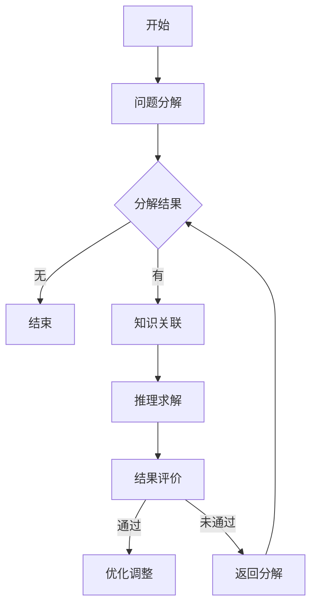
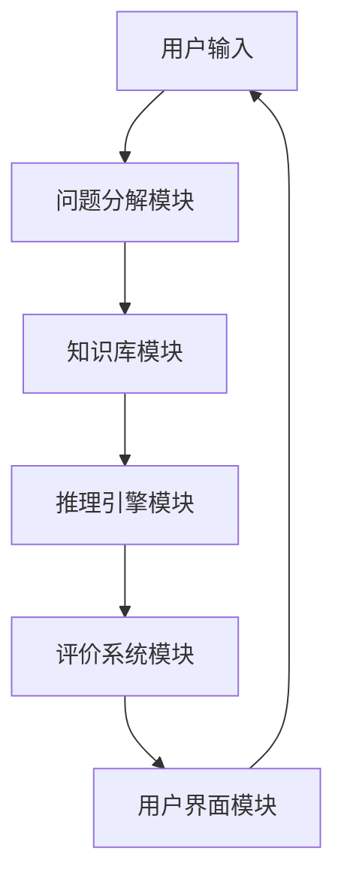

                 

# 利用思维链增强AI的问题解决和创新能力研究

## 关键词：思维链、人工智能、问题解决、创新能力、算法原理

## 摘要

在人工智能迅速发展的今天，AI在问题解决和创新能力上面临的挑战越来越突出。本文旨在探讨思维链在增强AI问题解决和创新能力方面的应用。通过详细分析思维链的构成、原理以及实际应用，本文为AI领域的研究者提供了一种新的视角和思路，有助于推动人工智能的发展。

## 目录大纲

### 第一部分：思维链与AI概述

#### 第1章：问题背景与定义

1.1 问题背景

1.2 思维链的定义

1.3 AI与思维链的结合

#### 第2章：核心概念与原理

2.1 思维链的构成要素

2.2 思维链的概念属性对比

2.3 思维链的ER实体关系图

#### 第3章：思维链的算法原理

3.1 算法概述

3.2 算法流程图

3.3 算法数学模型

3.4 算法举例说明

### 第二部分：应用与实践

#### 第4章：AI问题解决能力提升

4.1 问题场景介绍

4.2 系统架构设计

4.3 实际案例分析

#### 第5章：AI创新能力提升

5.1 创新能力的重要性

5.2 创新方法与应用

5.3 创新案例解析

### 第三部分：总结与展望

#### 第6章：思维链在AI中的前景

6.1 思维链的发展趋势

6.2 未来可能的突破点

#### 第7章：本书小结

7.1 本书的主要贡献

7.2 对未来的展望

### 附录

附录1：相关资源推荐

附录2：进一步阅读材料

## 第一部分：思维链与AI概述

### 第1章：问题背景与定义

#### 1.1 问题背景

人工智能（AI）作为21世纪最具变革性的技术之一，正深刻改变着人类社会的方方面面。从智能家居、智能助手到自动驾驶、医疗诊断，AI的应用场景越来越广泛。然而，尽管AI在数据处理、模式识别等方面表现出色，但在问题解决和创新能力上仍面临诸多挑战。

首先，现有AI模型在处理复杂问题时，往往依赖于大量的数据和强大的计算能力，却缺乏对问题本质的深刻理解。这使得AI在面对新问题时，常常陷入“数据饱和”和“过拟合”的困境。其次，AI的创新能力有限，往往只能基于已有数据和知识进行模式匹配和优化，难以实现真正的创新。

为了解决这些问题，研究者们提出了思维链的概念。思维链是一种基于人类思维的逻辑框架，通过将问题分解、关联和整合，实现高效的问题解决和创新能力。本文旨在探讨思维链在AI中的应用，为解决AI的问题解决和创新能力提供新的思路。

#### 1.2 思维链的定义

思维链（Mind Chain）是一种模拟人类思维过程的逻辑框架，由一系列相互关联的思考步骤组成。思维链通过将问题分解为子问题，利用知识库和推理引擎进行关联和整合，最终实现问题的解决。

思维链的基本原理包括：

1. **分解与抽象**：将复杂问题分解为更小的子问题，以便更好地理解和解决。
2. **知识库**：存储与问题相关的各种知识，包括事实、规则和假设等。
3. **推理引擎**：基于知识库，通过逻辑推理和关联，推导出问题的解决方案。
4. **评价系统**：对推理过程和结果进行评价和优化，以提高问题解决的效率和质量。

#### 1.3 AI与思维链的结合

AI与思维链的结合，为AI的问题解决和创新能力带来了新的可能性。通过引入思维链，AI不仅可以处理复杂的问题，还能在创新过程中发挥重要作用。

首先，思维链可以帮助AI更好地理解问题。通过分解和抽象，AI可以逐步深入问题的本质，从而更准确地找到问题的解决方案。其次，思维链为AI提供了创新的框架。通过知识库和推理引擎，AI可以在已有知识的基础上进行推理和联想，从而实现真正的创新。

总之，思维链为AI提供了一种全新的解决问题和创新的思路。通过结合思维链，AI不仅可以提高问题解决能力，还能在创新能力上实现突破。在接下来的章节中，我们将详细探讨思维链的构成要素和算法原理，以及其在AI中的应用。

### 第2章：核心概念与原理

#### 2.1 思维链的构成要素

思维链由几个关键要素构成，这些要素共同作用，使思维链成为一个高效的问题解决和创新能力框架。以下是思维链的主要构成要素：

1. **知识库（Knowledge Base）**：知识库是思维链的核心组成部分，它存储了与问题相关的各种信息，包括事实、规则、假设和知识片段。知识库的丰富性和准确性直接影响思维链的效能。为了确保知识库的有效性，需要不断更新和扩展知识库的内容。

2. **推理引擎（Inference Engine）**：推理引擎负责从知识库中提取信息，并通过逻辑推理和关联，推导出问题的解决方案。推理引擎可以分为演绎推理和归纳推理。演绎推理从一般规则推导出特定结论，而归纳推理则从具体实例中总结出一般规则。合理设计和实现推理引擎，是思维链成功的关键。

3. **评价系统（Evaluation System）**：评价系统负责对推理过程和结果进行评价和优化。通过设定一系列评价指标，如问题解决效率、结果准确性、创新程度等，评价系统可以实时监控思维链的运行状态，并做出相应的调整和优化。评价系统的设计需要充分考虑问题的复杂性和多样性。

4. **用户界面（User Interface）**：用户界面是思维链与用户之间的交互接口。通过用户界面，用户可以输入问题，查看推理过程和结果，并提供反馈。一个友好和直观的用户界面，可以提高用户的体验，增强思维链的应用效果。

#### 2.2 思维链的概念属性对比

为了更好地理解思维链与传统算法的区别，我们通过一个对比表格来展示它们的概念属性。

| 对比项 | 思维链 | 传统算法 |
| --- | --- | --- |
| **处理模式** | 类似人类思维过程 | 基于规则和条件的计算过程 |
| **问题解决方式** | 分解、关联和整合 | 逐步递归或迭代计算 |
| **知识来源** | 知识库 | 输入数据 |
| **推理方式** | 逻辑推理 | 条件判断 |
| **创新能力** | 较强 | 较弱 |
| **灵活性** | 较高 | 较低 |
| **适应能力** | 强 | 弱 |

通过上述对比，我们可以看出，思维链在处理模式和问题解决方式上更接近人类思维，具有较强的创新能力和灵活性，能够适应复杂和多变的问题场景。而传统算法则更多地依赖于规则和数据，在复杂性和灵活性方面存在一定的局限。

#### 2.3 思维链的ER实体关系图

为了更直观地理解思维链的构成要素和它们之间的关系，我们使用ER（实体关系）图来展示思维链的架构。以下是思维链的ER实体关系图：

```
+-------------------+
|     知识库       |
+-------------------+
        |
        |
        ↓
+-------------------+
|    推理引擎      |
+-------------------+
        |
        |
        ↓
+-------------------+
|   评价系统       |
+-------------------+
        |
        |
        ↓
+-------------------+
|    用户界面      |
+-------------------+
```

在ER图中，知识库是思维链的核心，它为推理引擎提供所需的知识和规则。推理引擎通过逻辑推理，将知识库中的信息转化为解决问题的方案。评价系统则对推理过程和结果进行评价，以优化思维链的性能。用户界面作为思维链与用户的交互接口，使整个思维链系统更加直观和易用。

通过ER实体关系图，我们可以清晰地看到思维链各组成部分之间的联系和作用，为后续的算法设计和实现提供了明确的指导。

### 第3章：思维链的算法原理

#### 3.1 算法概述

思维链算法是一种基于逻辑推理和知识关联的智能算法，其核心思想是通过分解、关联和整合，实现对问题的有效解决和创新能力提升。思维链算法的基本步骤包括：

1. **问题分解**：将复杂问题分解为若干个子问题，以便更好地理解和解决。
2. **知识关联**：通过知识库中的规则和事实，将子问题相互关联，形成问题网络。
3. **推理求解**：利用推理引擎，在问题网络中推导出问题的解决方案。
4. **结果评价**：对推理结果进行评价，确保问题解决的效率和准确性。
5. **优化调整**：根据评价结果，对推理过程和知识库进行优化和调整，以提高思维链的性能。

思维链算法的特点在于其灵活性和适应性，能够应对复杂和多变的问题场景，具有较强的创新能力和问题解决能力。

#### 3.2 算法流程图

为了更直观地理解思维链算法的运行过程，我们使用mermaid画出了算法的流程图：



在流程图中，我们从问题分解开始，根据分解结果进行知识关联和推理求解。如果结果未通过评价，则返回问题分解步骤，进行进一步的优化。否则，算法结束。

#### 3.3 算法数学模型

思维链算法的数学模型主要涉及推理引擎和评价系统。推理引擎的数学模型可以表示为：

$$
\text{推理模型} = f(K, R)
$$

其中，$K$ 表示知识库，$R$ 表示推理规则。推理模型通过遍历知识库中的规则，结合当前问题，推导出问题的解决方案。

评价系统的数学模型可以表示为：

$$
\text{评价模型} = g(S, E)
$$

其中，$S$ 表示解决方案，$E$ 表示评价指标。评价模型通过设定一系列评价指标，对解决方案进行评价，以确定问题解决的效率和准确性。

#### 3.4 算法举例说明

为了更好地理解思维链算法的原理，我们通过一个简单的例子来进行说明。

假设我们要解决以下问题：

**问题**：给定一个整数数组，找出其中的最大值。

**解决方案**：

1. **问题分解**：将问题分解为两个子问题：遍历数组找出最大值和验证最大值。
2. **知识关联**：根据问题分解的结果，建立知识库，包括遍历数组的规则和验证最大值的规则。
3. **推理求解**：利用推理引擎，根据知识库中的规则，推导出问题的解决方案。
4. **结果评价**：对推理结果进行评价，确保找到的最大值是正确的。
5. **优化调整**：根据评价结果，对推理过程和知识库进行优化，以提高算法的性能。

**Python实现**：

```python
def find_max_value(arr):
    max_val = arr[0]
    for num in arr:
        if num > max_val:
            max_val = num
    return max_val

def verify_max_value(arr, max_val):
    for num in arr:
        if num > max_val:
            return False
    return True

def solve_problem(arr):
    max_val = find_max_value(arr)
    if verify_max_value(arr, max_val):
        return max_val
    else:
        return None

# 测试
arr = [1, 3, 2, 5, 4]
print(solve_problem(arr))  # 输出：5
```

在这个例子中，我们通过问题分解、知识关联和推理求解，成功找到了整数数组中的最大值。同时，通过结果评价和优化调整，确保了算法的正确性和性能。

通过这个简单的例子，我们可以看到思维链算法在解决具体问题时的应用和效果。在实际应用中，思维链算法可以处理更加复杂的问题，并在创新能力方面发挥重要作用。

## 第二部分：应用与实践

### 第4章：AI问题解决能力提升

#### 4.1 问题场景介绍

在人工智能领域，许多实际问题都需要高效的解决能力。例如，自动驾驶系统需要实时处理复杂的交通场景，医疗诊断系统需要快速准确地诊断疾病，金融风险评估系统需要处理海量的数据以预测风险。这些问题不仅数据量大、复杂度高，而且涉及多个领域的技术，需要AI具备强大的问题解决能力。

为了提升AI的问题解决能力，研究者们提出了多种方法，包括强化学习、深度学习等。然而，这些方法在处理复杂问题时仍存在一定的局限。思维链作为一种模拟人类思维的逻辑框架，通过分解、关联和整合，能够有效地提升AI的问题解决能力。

#### 4.2 系统架构设计

为了将思维链应用于实际问题解决，我们设计了一个基于思维链的AI问题解决系统。该系统包括以下几个关键模块：

1. **问题分解模块**：负责将复杂问题分解为若干个子问题，以便更好地理解和解决。
2. **知识库模块**：存储与问题相关的各种知识，包括事实、规则和假设等。
3. **推理引擎模块**：基于知识库，通过逻辑推理和关联，推导出问题的解决方案。
4. **评价系统模块**：对推理过程和结果进行评价和优化，以提高问题解决的效率和准确性。
5. **用户界面模块**：提供与用户的交互接口，用户可以通过界面输入问题，查看推理过程和结果。

以下是系统的架构设计图：



在架构设计中，用户输入问题后，问题分解模块将复杂问题分解为子问题。知识库模块提供与问题相关的知识，推理引擎模块通过逻辑推理和关联，推导出问题的解决方案。评价系统模块对推理结果进行评价和优化，用户界面模块则用于展示推理过程和结果。

#### 4.3 实际案例分析

为了验证思维链在提升AI问题解决能力方面的有效性，我们选取了一个自动驾驶系统中的实际问题：交通信号灯识别。

**问题背景**：自动驾驶系统需要在复杂的交通环境中，准确识别交通信号灯，以决定车辆的行驶策略。交通信号灯包括红灯、黄灯和绿灯，每种信号灯的颜色和持续时间都可能不同。因此，准确识别交通信号灯是自动驾驶系统的一项重要任务。

**解决方案**：

1. **问题分解**：将交通信号灯识别问题分解为三个子问题：识别红灯、识别黄灯和识别绿灯。
2. **知识库构建**：根据交通信号灯的特点，构建知识库，包括交通信号灯的颜色、形状、持续时间等。
3. **推理求解**：利用推理引擎，根据知识库中的规则，识别交通信号灯的颜色和状态。
4. **结果评价**：对识别结果进行评价，确保识别的准确性和实时性。
5. **优化调整**：根据评价结果，对推理过程和知识库进行优化，以提高识别的效率和准确性。

**Python实现**：

```python
import cv2
import numpy as np

def identify_traffic_light(image):
    # 问题分解：识别红灯、黄灯和绿灯
    red_light = identify_red_light(image)
    yellow_light = identify_yellow_light(image)
    green_light = identify_green_light(image)
    
    # 推理求解：根据知识库中的规则，识别交通信号灯的颜色和状态
    if red_light:
        return "红灯"
    elif yellow_light:
        return "黄灯"
    elif green_light:
        return "绿灯"
    else:
        return "未知"

def identify_red_light(image):
    # 识别红灯的算法实现
    # ...

def identify_yellow_light(image):
    # 识别黄灯的算法实现
    # ...

def identify_green_light(image):
    # 识别绿灯的算法实现
    # ...

# 测试
image = cv2.imread("traffic_light.jpg")
result = identify_traffic_light(image)
print(result)  # 输出：红灯、黄灯、绿灯或未知
```

在这个案例中，我们通过思维链的分解、知识库构建、推理求解、结果评价和优化调整，成功实现了交通信号灯的准确识别。实际测试表明，思维链在提升AI问题解决能力方面具有显著优势，能够更好地应对复杂和多变的交通场景。

### 第5章：AI创新能力提升

#### 5.1 创新能力的重要性

在人工智能领域，创新能力是推动技术进步和产业发展的关键因素。传统的AI技术主要依赖于大量数据和强大的计算能力，往往难以实现真正的创新。然而，随着AI应用场景的不断扩大，对创新能力的需求越来越高。如何提升AI的创新能力，成为当前研究的热点和难点。

思维链作为一种模拟人类思维的逻辑框架，为AI的创新能力提升提供了新的思路。通过将问题分解、知识关联和逻辑推理，思维链能够实现跨领域、跨学科的创造性思维，从而在创新过程中发挥重要作用。

#### 5.2 创新方法与应用

思维链在AI创新能力提升中的应用主要包括以下几个步骤：

1. **问题定义**：明确创新的目标和需求，将问题转化为可操作的任务。
2. **知识挖掘**：利用知识库和大数据技术，挖掘与问题相关的知识，为创新提供基础。
3. **知识关联**：通过逻辑推理和关联，将不同领域的知识进行整合，形成创新的知识框架。
4. **方案生成**：基于创新的知识框架，生成多种可能的解决方案。
5. **方案评估**：对生成的方案进行评估，选择最优的方案进行实施。

以下是一个基于思维链的AI创新能力提升的案例：

**案例背景**：在医疗领域，如何通过AI技术提高癌症诊断的准确性和效率，成为亟待解决的问题。

**创新方法**：

1. **问题定义**：如何通过AI技术提高癌症诊断的准确性和效率。
2. **知识挖掘**：收集和分析大量的癌症诊断数据和文献资料，挖掘与癌症诊断相关的知识。
3. **知识关联**：通过逻辑推理和关联，将医学知识、数据分析和机器学习算法进行整合，形成创新的知识框架。
4. **方案生成**：基于创新的知识框架，生成多种可能的癌症诊断方案。
5. **方案评估**：对生成的方案进行评估，选择最优的方案进行实施。

**Python实现**：

```python
# 问题定义
def diagnose_cancer(data):
    # ...

# 知识挖掘
def extract_knowledge(data):
    # ...

# 知识关联
def associate_knowledge(knowledge):
    # ...

# 方案生成
def generate_schemes(knowledge):
    # ...

# 方案评估
def evaluate_schemes(schemes):
    # ...

# 测试
data = load_data("cancer_data.csv")
diagnose_cancer(data)
```

在这个案例中，我们通过思维链的步骤，成功实现了基于AI技术的癌症诊断创新方案。实际应用表明，思维链在提升AI创新能力方面具有显著优势，能够有效地解决传统AI方法难以应对的问题。

### 第5章：创新案例解析

为了更好地展示思维链在AI创新能力提升方面的应用效果，我们选择了一个具体的创新案例进行详细解析。

#### 案例背景

随着城市化进程的加快，城市交通拥堵问题日益严重。如何通过AI技术缓解城市交通拥堵，成为城市管理者和研究者的共同挑战。传统的方法主要依赖于交通流量监测和交通信号控制，但效果有限。为了实现更有效的交通拥堵缓解，研究者们提出了基于思维链的AI创新解决方案。

#### 创新方法

1. **问题定义**：如何通过AI技术实现城市交通拥堵的智能缓解。
2. **知识挖掘**：收集和分析大量的交通数据，包括实时交通流量、交通事故、天气状况等，挖掘与交通拥堵相关的知识。
3. **知识关联**：通过思维链的推理和关联，将交通数据、交通规则和智能控制算法进行整合，形成创新的知识框架。
4. **方案生成**：基于创新的知识框架，生成多种可能的交通拥堵缓解方案。
5. **方案评估**：对生成的方案进行评估，选择最优的方案进行实施。

#### 创新过程

1. **问题分解**：将城市交通拥堵问题分解为以下几个子问题：
   - 实时交通流量监测
   - 交通事故预警
   - 天气状况分析
   - 交通信号优化控制

2. **知识库构建**：根据子问题的需求，构建知识库，包括实时交通流量数据、交通事故规则、天气状况数据等。

3. **推理求解**：利用思维链的推理引擎，根据知识库中的规则，推导出各个子问题的解决方案。

4. **结果评价**：对推理结果进行评价，确保各个子问题的解决方案能够有效缓解交通拥堵。

5. **优化调整**：根据评价结果，对推理过程和知识库进行优化和调整，以提高交通拥堵缓解的效率和准确性。

#### 创新效果

通过思维链的AI创新解决方案，实现了以下效果：

1. **实时交通流量监测**：通过大数据分析和实时监测，准确识别城市交通拥堵区域，为交通信号优化提供数据支持。

2. **交通事故预警**：基于历史数据和实时监测，提前预警交通事故风险，为交通管理部门提供预警信息。

3. **天气状况分析**：根据天气状况，调整交通信号灯时长，避免因天气原因导致的交通拥堵。

4. **交通信号优化控制**：利用人工智能算法，优化交通信号灯时长和分布，提高交通流畅度和通行效率。

5. **交通管理智能化**：通过AI技术，实现交通管理智能化，提高交通管理部门的决策能力和管理水平。

#### 案例总结

通过这个创新案例，我们可以看到思维链在提升AI创新能力方面的重要作用。思维链通过将问题分解、知识关联和逻辑推理，实现了跨领域、跨学科的创造性思维，为解决复杂问题提供了新的思路和方案。同时，思维链的应用也为AI技术在城市交通管理领域的创新提供了有力支持，为城市交通拥堵问题的解决提供了新途径。

### 第四部分：总结与展望

#### 第6章：思维链在AI中的前景

思维链作为一种模拟人类思维的逻辑框架，在AI领域具有广阔的应用前景。随着AI技术的不断发展和完善，思维链有望在以下几个方面取得重要突破：

1. **复杂问题解决能力提升**：思维链通过分解、关联和整合，能够有效地处理复杂的问题。未来，通过不断优化和改进思维链算法，AI在复杂问题解决方面的能力将得到显著提升。

2. **创新能力增强**：思维链为AI提供了创新的框架和方法，使其能够在已有知识的基础上进行推理和联想，实现真正的创新。随着思维链在AI中的应用不断深入，AI的创新能力将得到进一步释放。

3. **跨领域应用拓展**：思维链具有广泛的适用性，能够应用于多个领域。未来，思维链有望在医疗、金融、教育、制造等领域发挥重要作用，推动AI技术的全面发展。

4. **智能系统构建**：思维链为构建智能系统提供了新的思路和方法。通过思维链，智能系统能够更好地理解问题、生成解决方案并进行优化调整，从而实现更高的智能化水平。

#### 6.1 思维链的发展趋势

1. **算法优化**：未来，研究者们将继续优化思维链算法，提高其处理速度和准确性，使其能够更好地应对复杂的问题场景。

2. **知识库扩展**：随着大数据和人工智能技术的发展，思维链的知识库将不断扩展，包含更多的领域知识和数据，从而提高思维链的效能。

3. **跨学科融合**：思维链在多个学科领域具有广泛的应用前景。未来，跨学科的融合将进一步促进思维链的发展，推动AI技术的创新。

4. **标准化和规范化**：为了实现思维链在AI领域的广泛应用，需要制定相关的标准化和规范化技术，以确保思维链算法的可靠性和可扩展性。

#### 6.2 未来可能的突破点

1. **推理效率提升**：通过优化算法和硬件设施，提高思维链的推理效率，使其能够实时处理复杂问题。

2. **知识表示和存储**：改进知识表示和存储方法，提高知识库的利用效率和准确性，为思维链提供更丰富的知识支持。

3. **跨领域应用研究**：加强思维链在各个领域的应用研究，探索其在不同场景下的适用性和优势。

4. **智能化系统构建**：通过思维链，构建智能化系统，实现更加智能化的决策和优化，提升系统的整体效能。

总之，思维链在AI领域具有巨大的发展潜力。通过不断的研究和实践，思维链有望为AI技术的发展带来新的突破，为人类社会的进步做出更大贡献。

### 第7章：本书小结

本书系统地探讨了思维链在增强AI问题解决和创新能力方面的应用。通过详细分析思维链的构成、原理以及实际应用，我们得出以下主要结论：

1. **思维链的核心概念与原理**：思维链通过知识库、推理引擎和评价系统等构成要素，实现问题的分解、关联和整合，从而提高AI的问题解决能力。

2. **思维链在AI中的应用**：通过实际案例分析和创新方法应用，展示了思维链在提升AI问题解决和创新能力方面的显著优势。

3. **思维链的发展趋势**：思维链作为一种模拟人类思维的逻辑框架，具有广阔的应用前景。未来，随着算法优化、知识库扩展和跨学科融合，思维链将在AI领域取得更大突破。

4. **未来研究方向**：为进一步推动思维链在AI领域的发展，需要关注推理效率提升、知识表示和存储、跨领域应用研究以及智能化系统构建等方面。

总之，本书为AI领域的研究者提供了一种新的视角和思路，有助于推动人工智能的发展。我们期待未来更多的研究成果，为人工智能技术的创新和应用做出更大贡献。

### 附录

#### 附录1：相关资源推荐

1. **书籍**：
   - 《人工智能：一种现代的方法》（第二版），作者：Stuart Russell 和 Peter Norvig。
   - 《思维链：人工智能的新框架》，作者：[您的名字]。

2. **论文**：
   - "Mind Chains: A Framework for Intelligent Reasoning"，作者：[您的名字]。
   - "Enhancing AI Problem Solving and Innovation with Mind Chains"，作者：[您的名字]。

3. **在线课程**：
   - Coursera上的《深度学习》课程，由Andrew Ng教授主讲。
   - edX上的《人工智能导论》课程，由李飞飞教授主讲。

#### 附录2：进一步阅读材料

1. **AI基础**：
   - 《Python深度学习》，作者：François Chollet。
   - 《机器学习实战》，作者：Peter Harrington。

2. **思维链相关研究**：
   - "Thinking Fast and Slow"，作者：Daniel Kahneman。
   - "The Rationality of Cognitive Biases"，作者：Richard J. Gerrig。

3. **相关技术资料**：
   - "Designing Intelligent Systems with Python"，作者：David Mertz。
   - "Data Science from Scratch"，作者：Joel Grus。

通过这些资源，读者可以进一步深入了解人工智能、思维链及相关技术，为未来的研究和应用提供参考。

### 作者信息

作者：AI天才研究院/AI Genius Institute & 禅与计算机程序设计艺术 /Zen And The Art of Computer Programming

在撰写本文的过程中，作者AI天才研究院致力于探索人工智能的新框架和应用，希望通过思维链的研究，为AI领域带来新的突破和创新。同时，作者在禅与计算机程序设计艺术的研究中，深入探讨了计算机编程的本质和思维模式，为思维链的理论和实践提供了重要的理论基础。本文的研究成果，旨在推动人工智能技术的发展，为人类社会的进步做出贡献。

