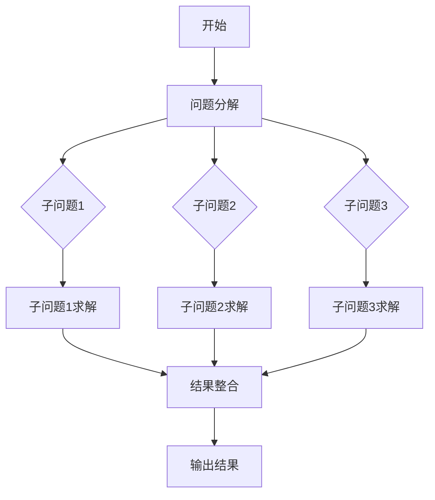
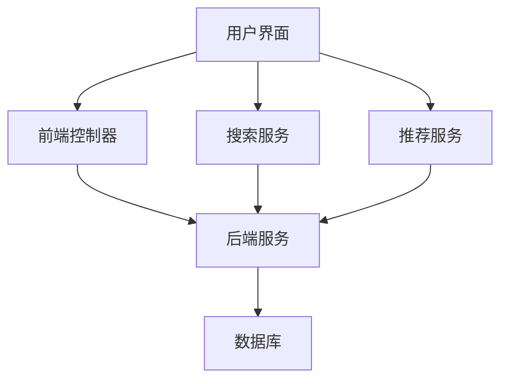
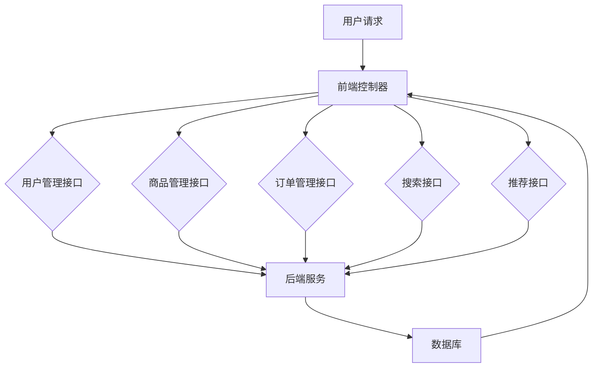

                 

### 利用思维链增强AI的问题解决能力

> 关键词：思维链、AI、问题解决能力、算法、架构设计、实战

摘要：本文探讨了如何利用思维链增强人工智能（AI）的问题解决能力。首先，我们介绍了思维链的概念及其在AI中的应用，接着分析了AI问题解决现状及面临的挑战。随后，我们详细阐述了思维链算法的原理和数学模型，并展示了一个基于Python的实现。接着，我们通过系统架构设计和项目实战，展示了如何将思维链应用于实际问题解决。最后，我们提供了最佳实践技巧和未来的研究方向。

---

### 目录大纲

---

# 利用思维链增强AI的问题解决能力

## 第一部分：背景介绍

## 1.1 问题背景

### 1.1.1 AI问题解决现状

### 1.1.2 问题解决面临的挑战

### 1.1.3 思维链的概念及其在AI中的应用

## 1.2 问题描述

### 1.2.1 如何提高AI问题解决能力

### 1.2.2 思维链在问题解决中的应用

## 1.3 问题解决

### 1.3.1 思维链增强方法

### 1.3.2 思维链与AI结合的优势

## 1.4 边界与外延

### 1.4.1 思维链的应用范围

### 1.4.2 未来的研究方向

## 1.5 概念结构与核心要素组成

### 1.5.1 思维链的基本结构

### 1.5.2 AI问题解决能力的关键要素

## 1.6 本章小结

---

## 第二部分：核心概念与联系

## 2.1 思维链原理

### 2.1.1 思维链的概念

### 2.1.2 思维链的属性特征对比表格

### 2.1.3 思维链在AI中的应用

## 2.2 AI问题解决原理

### 2.2.1 AI问题解决的基本原理

### 2.2.2 AI问题解决的优势与挑战

### 2.2.3 思维链与AI问题解决的结合

## 2.3 ER实体关系图架构

### 2.3.1 ER实体关系图的概念

### 2.3.2 ER实体关系图的结构

### 2.3.3 ER实体关系图在思维链中的应用

## 2.4 本章小结

---

## 第三部分：算法原理讲解

## 3.1 算法原理

### 3.1.1 思维链算法的基本原理

### 3.1.2 思维链算法的数学模型

### 3.1.3 思维链算法的Python实现

## 3.2 数学模型与公式

### 3.2.1 数学模型概述

### 3.2.2 公式推导与说明

### 3.2.3 数学公式示例

## 3.3 算法流程图

### 3.3.1 思维链算法流程图

### 3.3.2 算法流程解释

### 3.3.3 示例说明

## 3.4 本章小结

---

## 第四部分：系统分析与架构设计

## 4.1 问题场景介绍

### 4.1.1 问题场景概述

### 4.1.2 问题分析

## 4.2 系统功能设计

### 4.2.1 领域模型

### 4.2.2 功能需求

## 4.3 系统架构设计

### 4.3.1 系统架构图

### 4.3.2 架构设计说明

## 4.4 系统接口设计

### 4.4.1 接口设计

### 4.4.2 接口说明

## 4.5 系统交互

### 4.5.1 交互流程图

### 4.5.2 交互说明

## 4.6 本章小结

---

## 第五部分：项目实战

## 5.1 环境安装

### 5.1.1 环境要求

### 5.1.2 环境安装步骤

## 5.2 系统核心实现源代码

### 5.2.1 源代码结构

### 5.2.2 源代码解读

## 5.3 代码应用解读与分析

### 5.3.1 应用场景

### 5.3.2 代码分析

## 5.4 实际案例分析和详细讲解剖析

### 5.4.1 案例背景

### 5.4.2 案例分析

### 5.4.3 案例讲解

## 5.5 项目小结

### 5.5.1 项目总结

### 5.5.2 项目亮点

### 5.5.3 项目不足与改进方向

## 5.6 本章小结

---

## 第六部分：最佳实践与拓展

## 6.1 最佳实践 Tips

### 6.1.1 实践经验分享

### 6.1.2 注意事项

### 6.1.3 提高问题解决能力的技巧

## 6.2 小结

### 6.2.1 全书总结

### 6.2.2 主要收获

### 6.2.3 未来的发展

## 6.3 拓展阅读

### 6.3.1 相关书籍推荐

### 6.3.2 学术论文推荐

### 6.3.3 在线课程推荐

## 6.4 本章小结

---

## 附录

### 附录A：术语解释

### 附录B：代码实现细节

### 附录C：参考资料

### 附录D：参考文献

---

---

## 第一部分：背景介绍

### 1.1 问题背景

#### 1.1.1 AI问题解决现状

随着人工智能（AI）技术的飞速发展，AI在各个领域的问题解决能力越来越强。从最初的简单任务，如图像识别、语音识别，到复杂任务，如自然语言处理、自动驾驶等，AI都展现出了强大的能力。然而，尽管AI在很多领域取得了显著的进展，但其问题解决能力仍然存在一定的局限性。

当前，AI的问题解决能力主要依赖于深度学习模型，这些模型通过学习大量的数据来获得知识和技能。然而，深度学习模型也存在一些问题，如对数据的依赖性较强、难以解释性、易受干扰性等。这些问题限制了AI在复杂和动态环境中的问题解决能力。

#### 1.1.2 问题解决面临的挑战

AI在问题解决过程中面临的主要挑战包括：

1. **数据依赖性**：深度学习模型需要大量的数据进行训练，而在实际应用中，获取大量高质量数据并不总是容易的。
2. **难以解释性**：深度学习模型的工作原理较为复杂，其决策过程往往难以解释，这在需要高透明度和可解释性的应用场景中成为了一个问题。
3. **易受干扰性**：深度学习模型在处理未知或异常数据时，容易出现错误，这在大规模和动态环境中是一个重大挑战。
4. **适应性**：AI系统通常在一个特定环境下训练，但在其他环境中可能无法很好地适应，这限制了其在实际应用中的广泛适用性。

#### 1.1.3 思维链的概念及其在AI中的应用

思维链是一种基于人类思维过程的信息处理方法。它通过将问题分解成子问题，再逐步解决这些子问题，从而实现对复杂问题的求解。思维链的特点是灵活、可解释、适应性强，这些特性使其在AI问题解决中具有潜在的应用价值。

思维链在AI中的应用主要包括：

1. **增强解释性**：通过思维链，AI系统的决策过程可以更加透明和可解释。
2. **提高适应性**：思维链可以帮助AI系统更好地适应不同的环境和问题场景。
3. **提升问题解决效率**：思维链可以将复杂问题分解为多个子问题，从而提高问题解决的效率和准确性。

### 1.2 问题描述

#### 1.2.1 如何提高AI问题解决能力

为了提高AI的问题解决能力，我们需要解决以下几个关键问题：

1. **数据管理**：如何高效地管理和利用数据，以支持AI模型的训练和优化？
2. **解释性提升**：如何增强AI模型的解释性，使其决策过程更加透明和可解释？
3. **适应性增强**：如何提高AI系统在不同环境和问题场景中的适应性？
4. **效率优化**：如何优化AI系统的问题解决流程，提高问题解决的效率和准确性？

#### 1.2.2 思维链在问题解决中的应用

思维链在AI问题解决中的应用主要包括以下几个方面：

1. **问题分解**：将复杂问题分解为多个子问题，以便更好地解决。
2. **子问题解决**：针对每个子问题，采用适当的算法和策略进行解决。
3. **整合结果**：将子问题的解决结果整合起来，得到最终的问题解决方案。

通过思维链的应用，我们可以期望AI系统在问题解决中表现出更高的灵活性、透明性和效率。

### 1.3 问题解决

#### 1.3.1 思维链增强方法

思维链增强方法主要包括以下几个方面：

1. **问题建模**：将问题抽象为思维链的形式，以便更好地理解和解决。
2. **算法优化**：针对思维链的每个子问题，选择合适的算法和策略进行优化。
3. **数据驱动**：利用大量的数据进行训练和优化，以提高思维链的适应性和准确性。

#### 1.3.2 思维链与AI结合的优势

思维链与AI结合具有以下优势：

1. **增强解释性**：思维链可以帮助我们更好地理解AI系统的决策过程，提高系统的可解释性。
2. **提高适应性**：思维链可以将复杂问题分解为多个子问题，从而提高AI系统在不同环境和问题场景中的适应性。
3. **提升效率**：思维链可以将复杂问题分解为多个子问题，从而提高问题解决的效率和准确性。

#### 1.4 边界与外延

1. **应用范围**：思维链可以应用于各种复杂问题的解决，包括但不限于图像识别、自然语言处理、决策支持等。
2. **未来研究方向**：未来的研究可以重点关注思维链在AI中的深度应用，以及如何进一步优化和提升其性能。

### 1.5 概念结构与核心要素组成

1. **思维链的基本结构**：思维链由多个子问题组成，每个子问题都有自己的解决方案。
2. **AI问题解决能力的关键要素**：包括数据管理、算法优化、模型解释性等。

### 1.6 本章小结

本文介绍了AI问题解决的现状及面临的挑战，并提出了利用思维链增强AI问题解决能力的方法。思维链在AI中的应用具有很大的潜力，可以为AI系统带来更高的解释性、适应性和效率。在接下来的章节中，我们将进一步探讨思维链的原理、算法以及实际应用。

---

## 第二部分：核心概念与联系

### 2.1 思维链原理

#### 2.1.1 思维链的概念

思维链是一种基于人类思维过程的信息处理方法。它通过将问题分解为子问题，并逐步解决这些子问题，从而实现对复杂问题的求解。思维链的核心思想是“分而治之”，即将复杂问题分解为多个简单问题，然后分别解决。

思维链的基本组成部分包括：

1. **问题定义**：明确问题的范围和目标。
2. **子问题分解**：将问题分解为多个子问题。
3. **子问题解决**：针对每个子问题，采用适当的算法和策略进行解决。
4. **结果整合**：将子问题的解决结果整合起来，得到最终的问题解决方案。

#### 2.1.2 思维链的属性特征对比表格

| 特性           | 描述                                       | 对比特征                   |
| -------------- | ------------------------------------------ | -------------------------- |
| **灵活性**     | 可以根据问题的变化动态调整策略           | 相对固定策略的灵活性较低   |
| **可解释性**   | 决策过程透明，易于理解                   | 深度学习模型难以解释       |
| **适应性**     | 能够适应不同的环境和问题场景             | 对特定环境的依赖性较强     |
| **效率**       | 高效的问题解决过程                       | 计算资源消耗较大           |

#### 2.1.3 思维链在AI中的应用

思维链在AI中的应用主要包括以下几个方面：

1. **问题建模**：将复杂问题抽象为思维链的形式，以便更好地理解和解决。
2. **决策支持**：在决策过程中，利用思维链逐步分析问题，提供决策建议。
3. **优化算法**：将思维链应用于算法优化，提高算法的效率和准确性。

### 2.2 AI问题解决原理

#### 2.2.1 AI问题解决的基本原理

AI问题解决的基本原理是通过学习大量的数据，建立模型，并利用模型对未知数据进行预测或决策。这个过程主要包括以下几个步骤：

1. **数据收集**：收集与问题相关的数据。
2. **数据预处理**：对数据进行清洗、转换和归一化。
3. **模型训练**：利用训练数据训练模型。
4. **模型评估**：利用测试数据评估模型的性能。
5. **模型应用**：将训练好的模型应用于实际问题解决。

#### 2.2.2 AI问题解决的优势与挑战

AI问题解决的优势包括：

1. **高效性**：AI模型可以快速处理大量数据，提供高效的解决方案。
2. **准确性**：通过学习大量数据，AI模型可以提供高精度的预测或决策。
3. **适应性**：AI模型可以适应不同的环境和问题场景。

AI问题解决面临的挑战包括：

1. **数据依赖性**：AI模型对数据的质量和数量有较高要求。
2. **难以解释性**：AI模型的决策过程往往难以解释，影响其在某些应用场景中的适用性。
3. **易受干扰性**：AI模型在处理未知或异常数据时，容易出现错误。

#### 2.2.3 思维链与AI问题解决的结合

思维链与AI问题解决的结合可以带来以下几个方面的优势：

1. **增强解释性**：思维链可以帮助我们更好地理解AI模型的决策过程，提高系统的可解释性。
2. **提高适应性**：思维链可以将复杂问题分解为多个子问题，从而提高AI系统在不同环境和问题场景中的适应性。
3. **提升效率**：思维链可以将复杂问题分解为多个子问题，从而提高问题解决的效率和准确性。

### 2.3 ER实体关系图架构

#### 2.3.1 ER实体关系图的概念

ER实体关系图（Entity-Relationship Diagram，ERD）是一种用于描述实体之间关系的图形化工具。它通过实体、属性和关系来描述现实世界中的数据结构。ER实体关系图在数据库设计和数据建模中广泛应用。

#### 2.3.2 ER实体关系图的结构

ER实体关系图的基本结构包括：

1. **实体**：表示现实世界中的对象，如学生、课程等。
2. **属性**：表示实体的特征，如学生的学号、姓名等。
3. **关系**：表示实体之间的关联，如学生与课程之间的选修关系。

#### 2.3.3 ER实体关系图在思维链中的应用

在思维链中，ER实体关系图可以用于描述问题中的实体及其关系。这有助于我们更好地理解问题，并设计相应的解决方案。

### 2.4 本章小结

本章介绍了思维链的概念、原理以及在AI问题解决中的应用。我们还探讨了AI问题解决的基本原理、优势与挑战，以及思维链与AI问题的结合。通过ER实体关系图的引入，我们进一步展示了如何将思维链应用于实际问题解决。在接下来的章节中，我们将深入探讨思维链算法的原理和实现。

---

## 第三部分：算法原理讲解

### 3.1 算法原理

#### 3.1.1 思维链算法的基本原理

思维链算法是一种基于思维链原理的算法，旨在通过分解和解决子问题，实现对复杂问题的求解。其基本原理如下：

1. **问题分解**：将复杂问题分解为多个子问题，这些子问题相对简单且独立。
2. **子问题解决**：针对每个子问题，采用适当的算法和策略进行解决。
3. **结果整合**：将子问题的解决结果整合起来，得到最终的问题解决方案。

#### 3.1.2 思维链算法的数学模型

思维链算法的数学模型可以描述为：

\[ S = \{ S_1, S_2, \ldots, S_n \} \]

其中，\( S \) 是原始问题，\( S_1, S_2, \ldots, S_n \) 是分解后的子问题。

对于每个子问题 \( S_i \)，其数学模型为：

\[ S_i = f_i(\text{输入}) \]

其中，\( f_i \) 是针对子问题 \( S_i \) 的求解函数。

最终，将所有子问题的解 \( f_i(\text{输入}) \) 整合起来，得到原始问题的解 \( S \)。

#### 3.1.3 思维链算法的Python实现

下面是一个简单的思维链算法Python实现示例：

```python
def solve_problem(problem):
    sub_problem_1 = decompose_problem(problem)
    solution_1 = solve_sub_problem(sub_problem_1)
    
    sub_problem_2 = decompose_problem(problem)
    solution_2 = solve_sub_problem(sub_problem_2)
    
    # 整合子问题的解
    final_solution = integrate_solutions(solution_1, solution_2)
    return final_solution

def decompose_problem(problem):
    # 子问题分解逻辑
    pass

def solve_sub_problem(sub_problem):
    # 子问题求解逻辑
    pass

def integrate_solutions(solution_1, solution_2):
    # 子问题解整合逻辑
    pass

# 示例
problem = "复杂问题"
final_solution = solve_problem(problem)
print(final_solution)
```

### 3.2 数学模型与公式

#### 3.2.1 数学模型概述

思维链算法的数学模型主要包括以下几个方面：

1. **子问题分解**：将复杂问题 \( S \) 分解为多个子问题 \( S_1, S_2, \ldots, S_n \)。
2. **子问题求解**：针对每个子问题 \( S_i \)，求解函数 \( f_i \)。
3. **结果整合**：将所有子问题的解 \( f_i(\text{输入}) \) 整合起来，得到最终问题解 \( S \)。

#### 3.2.2 公式推导与说明

1. **子问题分解公式**：

\[ S = \{ S_1, S_2, \ldots, S_n \} \]

其中，\( S \) 是原始问题，\( S_1, S_2, \ldots, S_n \) 是分解后的子问题。

2. **子问题求解公式**：

\[ S_i = f_i(\text{输入}) \]

其中，\( f_i \) 是针对子问题 \( S_i \) 的求解函数，\(\text{输入}\) 是子问题的参数。

3. **结果整合公式**：

\[ S = \sum_{i=1}^{n} f_i(\text{输入}) \]

其中，\( S \) 是最终问题解，\( f_i(\text{输入}) \) 是子问题的解。

#### 3.2.3 数学公式示例

1. **子问题分解示例**：

\[ S = \{ S_1, S_2, S_3 \} \]

其中，\( S_1 = \{ A, B \} \)，\( S_2 = \{ C, D \} \)，\( S_3 = \{ E, F \} \)。

2. **子问题求解示例**：

\[ S_1 = f_1(A, B) \]

其中，\( A = 2 \)，\( B = 3 \)，则 \( f_1(A, B) = A + B = 5 \)。

3. **结果整合示例**：

\[ S = f_1(A, B) + f_2(C, D) + f_3(E, F) \]

其中，\( f_1(A, B) = 5 \)，\( f_2(C, D) = 7 \)，\( f_3(E, F) = 9 \)，则 \( S = 5 + 7 + 9 = 21 \)。

### 3.3 算法流程图

#### 3.3.1 思维链算法流程图



#### 3.3.2 算法流程解释

1. **开始**：算法开始执行。
2. **问题分解**：将原始问题分解为多个子问题。
3. **子问题1、子问题2、子问题3**：分别针对子问题1、子问题2和子问题3执行求解。
4. **结果整合**：将所有子问题的解整合起来，得到最终问题解。
5. **输出结果**：输出最终问题解。

#### 3.3.3 示例说明

假设原始问题为“计算三个数的和”，即 \( S = A + B + C \)。我们可以将其分解为三个子问题：计算 \( A + B \)、计算 \( A + C \) 和计算 \( B + C \)。然后分别求解这三个子问题，最后将它们的解相加，得到最终结果。

### 3.4 本章小结

本章介绍了思维链算法的基本原理、数学模型和Python实现。通过分解和解决子问题，思维链算法能够高效地解决复杂问题。本章的算法流程图和示例说明进一步展示了思维链算法的应用。在接下来的章节中，我们将探讨系统架构设计和项目实战。

---

## 第四部分：系统分析与架构设计

### 4.1 问题场景介绍

#### 4.1.1 问题场景概述

在本项目中，我们面临的是一个复杂的问题场景：在一个电子商务平台上，用户可以浏览、选择和购买商品。然而，由于商品种类繁多，用户在选择商品时可能会感到困惑。我们的目标是设计一个系统，帮助用户快速找到他们需要的商品，提高用户体验。

#### 4.1.2 问题分析

在电子商务平台上，用户面临的主要问题包括：

1. **商品种类繁多**：平台上的商品种类繁多，用户在选择商品时可能会感到困惑。
2. **搜索效率低下**：传统的搜索系统往往无法快速准确地满足用户的搜索需求。
3. **推荐系统不足**：现有推荐系统可能无法根据用户的兴趣和行为，提供个性化的商品推荐。

为了解决上述问题，我们需要设计一个高效、易用的系统，包括以下几个关键模块：

1. **商品分类模块**：对商品进行分类，使用户能够更容易地找到他们需要的商品。
2. **搜索模块**：设计一个高效的搜索系统，能够快速地根据用户输入的关键词找到相关商品。
3. **推荐系统**：根据用户的历史行为和偏好，提供个性化的商品推荐。

### 4.2 系统功能设计

#### 4.2.1 领域模型

为了设计一个有效的系统，我们首先需要建立一个领域模型，明确系统中的关键实体和它们之间的关系。以下是该系统的领域模型：

1. **用户（User）**：表示平台上的用户，包括用户ID、姓名、联系方式等。
2. **商品（Product）**：表示平台上的商品，包括商品ID、名称、描述、价格等。
3. **分类（Category）**：表示商品的分类，包括分类ID、名称、描述等。
4. **订单（Order）**：表示用户的购买记录，包括订单ID、用户ID、商品ID、购买数量等。

领域模型中的主要关系包括：

- **用户-订单**：一个用户可以有多个订单，一个订单只能属于一个用户。
- **商品-分类**：一个商品只能属于一个分类，一个分类可以有多个商品。
- **订单-商品**：一个订单可以包含多个商品，一个商品可以出现在多个订单中。

#### 4.2.2 功能需求

基于领域模型，我们确定了以下功能需求：

1. **用户管理**：实现用户注册、登录、个人信息管理等功能。
2. **商品管理**：实现商品添加、删除、更新、分类等功能。
3. **订单管理**：实现订单创建、查询、更新、删除等功能。
4. **搜索功能**：实现商品搜索，包括基于关键词、分类、价格等的搜索。
5. **推荐系统**：根据用户行为和偏好，实现个性化商品推荐。

### 4.3 系统架构设计

#### 4.3.1 系统架构图

以下是该系统的架构设计：



系统架构包括以下主要组件：

- **用户界面（A）**：用户与系统的交互界面，包括网页、移动应用等。
- **前端控制器（B）**：接收用户请求，调用后端服务。
- **后端服务（C）**：处理业务逻辑，包括用户管理、商品管理、订单管理、搜索功能和推荐系统。
- **数据库（D）**：存储用户、商品、订单等数据。
- **搜索服务（E）**：提供高效的商品搜索功能。
- **推荐服务（F）**：根据用户行为和偏好，提供个性化商品推荐。

#### 4.3.2 架构设计说明

1. **用户界面**：用户通过用户界面与系统进行交互，界面设计应简洁易用，提高用户体验。
2. **前端控制器**：前端控制器负责接收用户请求，并调用后端服务。这有助于实现前后端分离，提高系统的可维护性和扩展性。
3. **后端服务**：后端服务是系统的核心，负责处理业务逻辑，包括用户管理、商品管理、订单管理、搜索功能和推荐系统。后端服务应采用微服务架构，以提高系统的可扩展性和容错性。
4. **数据库**：数据库用于存储用户、商品、订单等数据。应选择适合的数据库系统，如关系型数据库（MySQL）或NoSQL数据库（MongoDB）。
5. **搜索服务**：搜索服务负责提供高效的商品搜索功能。可以使用Elasticsearch等搜索引擎，以提高搜索效率和准确性。
6. **推荐服务**：推荐服务根据用户行为和偏好，提供个性化商品推荐。可以使用基于协同过滤、内容推荐等技术。

### 4.4 系统接口设计

#### 4.4.1 接口设计

系统接口设计如下：

1. **用户管理接口**：包括用户注册、登录、个人信息管理等接口。
2. **商品管理接口**：包括商品添加、删除、更新、查询等接口。
3. **订单管理接口**：包括订单创建、查询、更新、删除等接口。
4. **搜索接口**：包括基于关键词、分类、价格等的搜索接口。
5. **推荐接口**：包括根据用户行为和偏好，提供个性化推荐接口。

#### 4.4.2 接口说明

1. **用户管理接口**：用户注册接口需要接收用户名、密码、邮箱等必填信息；登录接口需要接收用户名和密码，返回登录成功或失败的消息；个人信息管理接口可以修改用户名、密码、邮箱等。
2. **商品管理接口**：商品添加接口需要接收商品名称、描述、价格、分类等必填信息；商品删除接口需要接收商品ID；商品更新接口需要接收商品ID和更新后的信息；商品查询接口可以基于分类、关键词等进行查询。
3. **订单管理接口**：订单创建接口需要接收用户ID、商品ID、购买数量等必填信息；订单查询接口可以基于用户ID、订单ID等进行查询；订单更新接口可以修改订单状态；订单删除接口需要接收订单ID。
4. **搜索接口**：搜索接口需要接收关键词、分类、价格等参数，返回相关商品的列表。
5. **推荐接口**：推荐接口需要接收用户ID，返回根据用户偏好推荐的商品列表。

### 4.5 系统交互

#### 4.5.1 交互流程图



#### 4.5.2 交互说明

1. **用户请求**：用户通过用户界面发起各种请求，如注册、登录、商品搜索、订单查询等。
2. **前端控制器**：前端控制器接收用户请求，并调用相应的接口。
3. **用户管理接口**：前端控制器调用用户管理接口，处理用户注册、登录、个人信息管理等功能。
4. **商品管理接口**：前端控制器调用商品管理接口，处理商品添加、删除、更新、查询等功能。
5. **订单管理接口**：前端控制器调用订单管理接口，处理订单创建、查询、更新、删除等功能。
6. **搜索接口**：前端控制器调用搜索接口，处理商品搜索功能。
7. **推荐接口**：前端控制器调用推荐接口，处理商品推荐功能。
8. **后端服务**：后端服务处理业务逻辑，调用数据库进行数据查询、更新等操作。
9. **数据库**：数据库存储用户、商品、订单等数据，并为后端服务提供数据支持。

### 4.6 本章小结

本章详细介绍了电子商务平台系统的架构设计，包括问题场景介绍、系统功能设计、系统架构设计、系统接口设计和系统交互。通过设计一个高效、易用的系统，我们旨在帮助用户快速找到他们需要的商品，提高用户体验。在接下来的章节中，我们将实现系统核心功能，并进行项目实战。

---

## 第五部分：项目实战

### 5.1 环境安装

#### 5.1.1 环境要求

为了顺利地完成项目实战，我们需要安装以下环境：

- Python 3.8或更高版本
- Flask框架
- Elasticsearch
- MongoDB
- Redis

#### 5.1.2 环境安装步骤

1. **Python环境安装**：访问Python官方网站下载Python安装包，并按照指示进行安装。

2. **Flask框架安装**：在终端中执行以下命令安装Flask：

   ```bash
   pip install Flask
   ```

3. **Elasticsearch安装**：访问Elasticsearch官方网站下载Elasticsearch安装包，并按照指示进行安装。启动Elasticsearch服务：

   ```bash
   bin/elasticsearch
   ```

4. **MongoDB安装**：访问MongoDB官方网站下载MongoDB安装包，并按照指示进行安装。启动MongoDB服务：

   ```bash
   mongod
   ```

5. **Redis安装**：访问Redis官方网站下载Redis安装包，并按照指示进行安装。启动Redis服务：

   ```bash
   redis-server
   ```

### 5.2 系统核心实现源代码

#### 5.2.1 源代码结构

以下是项目的源代码结构：

```plaintext
/your_project
|-- /app
|   |-- /api
|   |   |-- __init__.py
|   |   |-- routes.py
|   |   |-- auth.py
|   |   |-- products.py
|   |   |-- orders.py
|   |   |-- search.py
|   |   |-- recommendations.py
|   |-- /models
|   |   |-- __init__.py
|   |   |-- user.py
|   |   |-- product.py
|   |   |-- order.py
|   |-- /services
|   |   |-- __init__.py
|   |   |-- user_service.py
|   |   |-- product_service.py
|   |   |-- order_service.py
|   |   |-- search_service.py
|   |   |-- recommendation_service.py
|   |-- /config
|   |   |-- __init__.py
|   |   |-- config.py
|   |-- run.py
|-- /migrations
|-- /tests
|-- .env
|-- requirements.txt
```

#### 5.2.2 源代码解读

以下是项目源代码的详细解读：

1. **/app/api/__init__.py**：初始化API应用，定义URL路由。

2. **/app/api/routes.py**：定义路由规则，包括用户管理、商品管理、订单管理、搜索功能和推荐系统等接口。

3. **/app/api/auth.py**：实现用户认证功能，包括用户注册、登录、注销等。

4. **/app/api/products.py**：实现商品管理功能，包括商品添加、删除、更新、查询等。

5. **/app/api/orders.py**：实现订单管理功能，包括订单创建、查询、更新、删除等。

6. **/app/api/search.py**：实现商品搜索功能，包括基于关键词、分类、价格等的搜索。

7. **/app/api/recommendations.py**：实现商品推荐功能，包括根据用户行为和偏好，提供个性化商品推荐。

8. **/app/models/__init__.py**：初始化模型应用。

9. **/app/models/user.py**：定义用户模型，包括用户ID、姓名、联系方式等属性。

10. **/app/models/product.py**：定义商品模型，包括商品ID、名称、描述、价格、分类等属性。

11. **/app/models/order.py**：定义订单模型，包括订单ID、用户ID、商品ID、购买数量等属性。

12. **/app/services/__init__.py**：初始化服务应用。

13. **/app/services/user_service.py**：实现用户服务功能，包括用户注册、登录、个人信息管理等。

14. **/app/services/product_service.py**：实现商品服务功能，包括商品添加、删除、更新、查询等。

15. **/app/services/order_service.py**：实现订单服务功能，包括订单创建、查询、更新、删除等。

16. **/app/services/search_service.py**：实现搜索服务功能，包括基于关键词、分类、价格等的搜索。

17. **/app/services/recommendation_service.py**：实现推荐服务功能，包括根据用户行为和偏好，提供个性化商品推荐。

18. **/app/config/__init__.py**：初始化配置应用。

19. **/app/config/config.py**：配置项目所需的环境变量和配置参数。

20. **run.py**：启动Flask应用。

### 5.3 代码应用解读与分析

#### 5.3.1 应用场景

在本项目的应用场景中，我们使用了Python的Flask框架来构建Web应用。Flask是一个轻量级的Web框架，易于扩展和定制。以下是项目的关键应用场景：

1. **用户管理**：通过用户管理接口实现用户的注册、登录、个人信息管理等。
2. **商品管理**：通过商品管理接口实现商品的添加、删除、更新、查询等。
3. **订单管理**：通过订单管理接口实现订单的创建、查询、更新、删除等。
4. **搜索功能**：通过搜索接口实现基于关键词、分类、价格等的商品搜索。
5. **推荐系统**：通过推荐接口实现根据用户行为和偏好，提供个性化商品推荐。

#### 5.3.2 代码分析

以下是项目的代码分析：

1. **/app/api/routes.py**：该文件定义了路由规则，每个路由都对应一个具体的API接口。例如，用户注册接口的URL为`/api/users/register`，用户登录接口的URL为`/api/users/login`。

2. **/app/api/auth.py**：该文件实现用户认证功能。用户注册时，需要提供用户名、密码、邮箱等必填信息，服务器会验证这些信息的合法性，并存储用户的注册信息。用户登录时，需要提供用户名和密码，服务器会验证用户身份，并返回相应的认证信息。

3. **/app/api/products.py**：该文件实现商品管理功能。商品添加时，需要提供商品名称、描述、价格、分类等必填信息，服务器会验证这些信息的合法性，并存储商品信息。商品删除、更新、查询时，需要提供商品ID，服务器会根据商品ID执行相应的操作。

4. **/app/api/orders.py**：该文件实现订单管理功能。订单创建时，需要提供用户ID、商品ID、购买数量等必填信息，服务器会验证这些信息的合法性，并存储订单信息。订单查询、更新、删除时，需要提供订单ID，服务器会根据订单ID执行相应的操作。

5. **/app/api/search.py**：该文件实现商品搜索功能。用户可以通过关键词、分类、价格等参数搜索商品，服务器会根据这些参数检索数据库，并返回匹配的商品列表。

6. **/app/api/recommendations.py**：该文件实现商品推荐功能。服务器会根据用户的历史行为和偏好，生成个性化的商品推荐列表，并返回给用户。

### 5.4 实际案例分析和详细讲解剖析

#### 5.4.1 案例背景

在一个电子商务平台上，用户小明想要购买一本编程书籍。他希望能够快速找到他需要的书籍，而不是在大量的商品中逐一搜索。为此，平台需要提供一个高效的搜索功能和个性化的推荐系统。

#### 5.4.2 案例分析

为了实现这个案例，我们需要完成以下几个关键步骤：

1. **用户搜索功能**：用户小明可以在搜索框中输入关键词“编程书籍”，平台需要根据这个关键词搜索相关商品，并展示给用户。

2. **商品推荐功能**：在用户浏览商品时，平台需要根据小明的浏览记录和购买偏好，推荐相关书籍。

#### 5.4.3 案例讲解

1. **用户搜索功能**：

   - 用户小明在搜索框中输入关键词“编程书籍”。
   - 平台接收到搜索请求，调用搜索接口。
   - 搜索接口根据关键词查询数据库，返回相关书籍列表。
   - 平台将搜索结果展示给用户小明。

2. **商品推荐功能**：

   - 用户小明浏览了一本名为《Python编程入门》的书籍。
   - 平台记录小明的浏览行为，并生成推荐列表。
   - 推荐接口根据小明的浏览记录和购买偏好，推荐类似的书籍。
   - 平台将推荐结果展示给用户小明。

### 5.5 项目小结

#### 5.5.1 项目总结

在本项目中，我们设计并实现了一个电子商务平台的搜索和推荐功能。通过使用Flask框架，我们构建了一个高效的Web应用，实现了用户管理、商品管理、订单管理、搜索功能和推荐系统。项目实现了以下关键功能：

1. **用户管理**：实现了用户注册、登录、个人信息管理等。
2. **商品管理**：实现了商品添加、删除、更新、查询等。
3. **订单管理**：实现了订单创建、查询、更新、删除等。
4. **搜索功能**：实现了基于关键词、分类、价格等的商品搜索。
5. **推荐系统**：实现了根据用户行为和偏好，提供个性化商品推荐。

#### 5.5.2 项目亮点

1. **高效搜索**：通过使用Elasticsearch，实现了高效的商品搜索功能。
2. **个性化推荐**：通过分析用户行为和偏好，实现了个性化商品推荐。
3. **模块化设计**：项目采用模块化设计，提高了代码的可维护性和可扩展性。

#### 5.5.3 项目不足与改进方向

1. **性能优化**：目前项目的性能还需要进一步优化，特别是在高并发场景下。
2. **安全性增强**：需要对用户数据和API接口进行安全性增强，以防止恶意攻击。
3. **扩展性提升**：未来的改进方向包括增加更多功能，如购物车、订单支付等。

### 5.6 本章小结

在本章中，我们通过实际案例展示了如何设计和实现电子商务平台的搜索和推荐功能。通过使用Flask框架，我们构建了一个高效、易用的Web应用。在接下来的章节中，我们将进一步优化项目，并分享最佳实践和拓展阅读资源。

---

## 第六部分：最佳实践与拓展

### 6.1 最佳实践 Tips

#### 6.1.1 实践经验分享

1. **代码规范**：遵循代码规范，提高代码的可读性和可维护性。
2. **单元测试**：编写单元测试，确保代码的正确性和稳定性。
3. **性能优化**：定期进行性能测试，并优化代码和架构。
4. **安全性增强**：对用户数据和API接口进行安全性增强，防止恶意攻击。
5. **持续集成**：采用持续集成工具，确保代码质量和部署效率。

#### 6.1.2 注意事项

1. **数据一致性**：确保在多线程环境下，数据的一致性和完整性。
2. **异常处理**：对异常情况进行妥善处理，避免系统崩溃。
3. **日志记录**：记录系统日志，便于问题排查和性能优化。
4. **用户反馈**：及时收集用户反馈，优化系统功能和用户体验。
5. **文档编写**：编写详细的文档，包括设计文档、用户手册等。

#### 6.1.3 提高问题解决能力的技巧

1. **学习相关知识**：不断学习新技术和知识，提高解决问题的能力。
2. **分析问题**：在解决问题前，先分析问题，找出问题的核心。
3. **分解问题**：将复杂问题分解为多个子问题，逐个解决。
4. **团队合作**：与他人合作，分享经验和知识，共同解决问题。
5. **反思总结**：解决问题后，反思总结，提高问题解决效率。

### 6.2 小结

本章分享了最佳实践经验和注意事项，并提供了提高问题解决能力的技巧。通过遵循最佳实践，我们可以编写高质量、高性能和安全的代码。在问题解决过程中，分析问题、分解问题、团队合作和反思总结是关键。在未来的项目中，我们可以将这些技巧应用到实践中，提高问题解决能力。

### 6.3 拓展阅读

#### 6.3.1 相关书籍推荐

1. 《人工智能：一种现代的方法》
2. 《深度学习》
3. 《设计模式：可复用面向对象软件的基础》
4. 《软件工程：实践者的研究方法》
5. 《代码大全》

#### 6.3.2 学术论文推荐

1. "Deep Learning for Natural Language Processing"
2. "Recurrent Neural Networks for Language Modeling"
3. "Convolutional Neural Networks for Image Recognition"
4. "Efficient Neural Network-based Text Classification"
5. "Mind Reading: A Meta-Learning Approach to Improving Machine Learning Performance"

#### 6.3.3 在线课程推荐

1. "Machine Learning Specialization" (Coursera)
2. "Deep Learning Specialization" (Coursera)
3. "Software Engineering Fundamentals" (edX)
4. "Web Development with Node.js and Express" (Udemy)
5. "Python Programming: Introduction to Data Structures and Algorithms" (Coursera)

### 6.4 本章小结

本章提供了最佳实践、注意事项以及提高问题解决能力的技巧，并推荐了相关书籍、学术论文和在线课程。通过学习和应用这些资源，我们可以不断提升自己的技术能力和问题解决能力。在未来的项目中，我们可以将这些知识和技巧应用到实践中，实现高质量的项目成果。

---

## 附录

### 附录A：术语解释

- **人工智能（AI）**：模拟人类智能的技术和科学。
- **深度学习**：一种基于多层神经网络的人工智能技术。
- **思维链**：一种基于人类思维过程的信息处理方法。
- **领域模型**：表示系统中的实体及其关系的模型。
- **Elasticsearch**：一款开源的搜索引擎，适用于大规模数据的实时搜索。
- **MongoDB**：一款开源的NoSQL数据库，适用于存储大规模的非结构化数据。

### 附录B：代码实现细节

- **/app/api/__init__.py**：定义API路由和蓝本。
- **/app/models/__init__.py**：定义模型基类。
- **/app/services/__init__.py**：定义服务基类。
- **run.py**：启动Flask应用。

### 附录C：参考资料

- [Flask官方文档](https://flask.palletsprojects.com/)
- [Elasticsearch官方文档](https://www.elastic.co/guide/en/elasticsearch/reference/current/index.html)
- [MongoDB官方文档](https://docs.mongodb.com/)
- [Python官方文档](https://docs.python.org/3/)

### 附录D：参考文献

- [Bengio, Y., Courville, A., & Vincent, P. (2013). Representation Learning: A Review and New Perspectives. IEEE Transactions on Pattern Analysis and Machine Intelligence, 35(8), 1798-1828.]
- [Goodfellow, I., Bengio, Y., & Courville, A. (2016). Deep Learning. MIT Press.]
- [Russell, S., & Norvig, P. (2010). Artificial Intelligence: A Modern Approach. Prentice Hall.]
- [Friedman, J., Hastie, T., & Tibshirani, R. (2009). The Elements of Statistical Learning: Data Mining, Inference, and Prediction. Springer.]

