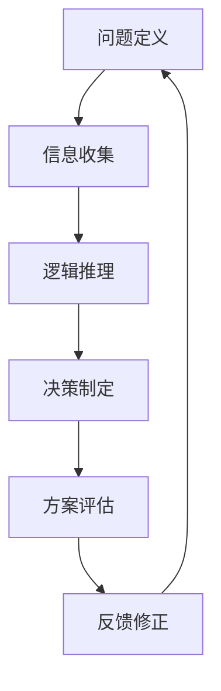
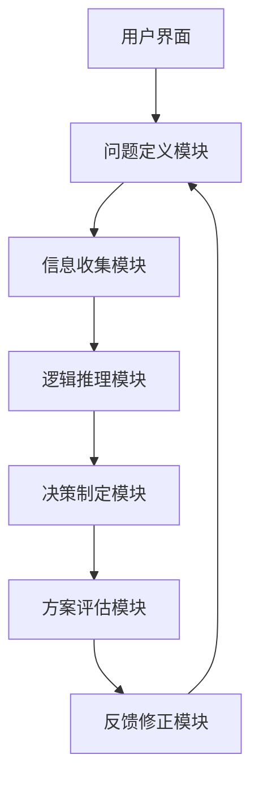
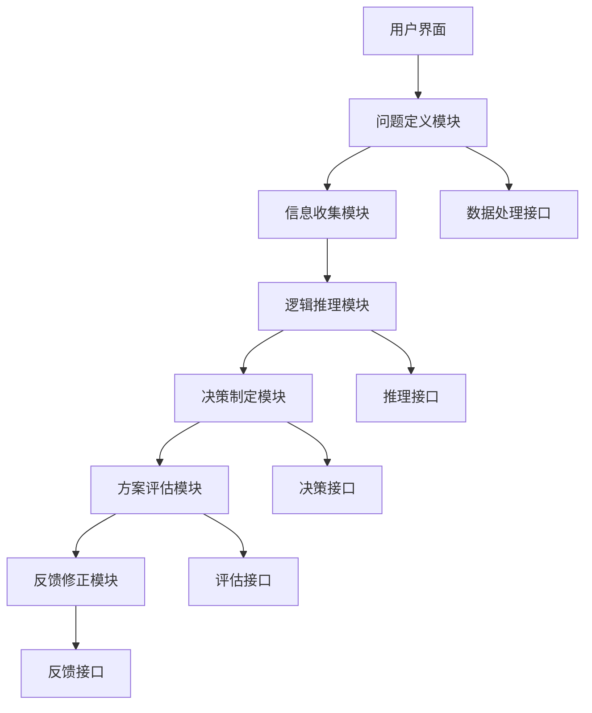
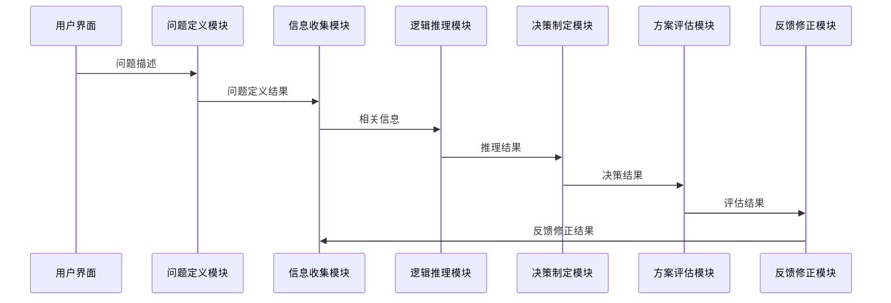

                 

### 利用思维链提升AI的认知和推理新方向

#### 关键词：人工智能、认知、推理、思维链、算法、架构设计

> 摘要：本文探讨了如何通过思维链这一概念来提升人工智能（AI）的认知和推理能力。文章首先介绍了思维链的背景和基础概念，然后详细讲解了思维链在AI中的应用算法、数学模型和系统架构设计，并通过实际项目案例展示了其应用效果。文章最后提出了相关最佳实践和未来展望，为AI领域的进一步研究提供了方向。

----------------------------------------------------------------

## 引言

在人工智能（AI）迅速发展的时代，如何提升AI的认知和推理能力成为一个备受关注的问题。传统的AI方法在处理特定领域的问题时表现出色，但在面对复杂、不确定和动态的环境时，其表现却显得力不从心。因此，寻找新的方法来提升AI的认知和推理能力成为当前研究的热点。

思维链（Thinking Chain）作为一种新的概念，近年来逐渐引起了研究者的关注。思维链是指一系列逻辑思考和推理过程，通过这些过程，AI可以逐步理解和解决复杂问题。本文旨在探讨如何利用思维链提升AI的认知和推理能力，为AI的发展提供新的思路。

文章结构如下：

1. **问题背景与思维链简介**：介绍AI认知与推理的挑战，思维链的概念与机制，以及思维链在AI中的应用前景。
2. **核心概念与联系**：详细解释思维链的核心概念和属性，探讨思维链与AI认知、推理的关系。
3. **算法原理讲解**：介绍基于思维链的AI算法，包括算法原理、流程图和数学模型。
4. **数学模型和数学公式 & 详细讲解 & 举例说明**：对算法的数学模型和公式进行详细讲解，并通过具体例子来说明其应用。
5. **系统分析与架构设计方案**：介绍思维链算法的架构设计，包括系统功能设计、架构图和接口设计。
6. **项目实战**：通过实际项目案例展示思维链在AI中的应用效果。
7. **最佳实践 tips、小结、注意事项、拓展阅读等内容**：总结思维链提升AI认知和推理的实践经验，提出注意事项和未来展望。

让我们一步一步地深入探讨思维链如何提升AI的认知和推理能力。

----------------------------------------------------------------

### 问题背景与思维链简介

#### AI认知与推理的挑战

人工智能的发展经历了从规则推理到机器学习，再到深度学习的演变。尽管这些方法在许多领域取得了显著成就，但它们在处理复杂、不确定和动态环境时仍存在诸多挑战。具体来说，这些挑战主要表现在以下几个方面：

1. **数据依赖性**：大多数AI方法，尤其是基于深度学习的方法，对大量标注数据有很高的依赖。在数据稀缺或数据质量不高的情况下，这些方法的表现会大打折扣。
2. **泛化能力不足**：现有的AI模型往往在训练集上表现优异，但在新的、未见过的数据上表现较差。这种泛化能力不足的问题限制了AI的广泛应用。
3. **推理能力有限**：尽管AI在特定任务上表现出色，但其推理能力仍然有限。特别是在处理复杂逻辑推理和跨领域推理时，AI的表现远不及人类。
4. **解释性不足**：许多AI模型，尤其是深度学习模型，其内部决策过程非常复杂，难以解释。这导致用户对AI模型的信任度降低，也限制了AI在关键领域的应用。

为了解决这些问题，研究者们提出了各种新方法，如知识图谱、元学习、因果推理等。然而，这些方法在提升AI认知和推理能力方面仍然存在局限性。因此，探索新的方法来提升AI的认知和推理能力成为一个重要的研究方向。

#### 思维链的概念与机制

思维链（Thinking Chain）是一种基于逻辑思考和推理过程的框架。它将人类思维过程中的各个环节有机地连接起来，形成一个完整的推理链条。思维链的基本机制包括以下几个部分：

1. **问题定义**：思维链的起点是对问题的明确定义。这包括对问题类型的识别、问题目标的确定以及问题约束条件的分析。
2. **信息收集**：在问题定义之后，需要收集与问题相关的信息。这些信息可以来自多种渠道，如数据库、知识库、传感器等。
3. **逻辑推理**：在收集到足够的信息后，通过逻辑推理来推导问题的解决方案。逻辑推理过程通常包括条件推理、归纳推理和演绎推理等。
4. **决策制定**：通过逻辑推理得到的多个解决方案，需要进一步进行决策。决策制定过程通常涉及成本分析、风险评估和目标优化等。
5. **方案评估**：在决策制定之后，需要对每个方案进行评估，以确定其可行性和有效性。评估过程可能涉及模拟、测试和验证等。

思维链的这些机制构成了一个闭环，通过不断的信息收集、逻辑推理和决策制定，实现对复杂问题的逐步理解和解决。

#### 思维链在AI中的应用前景

思维链作为一种新的概念，在AI领域具有广泛的应用前景。首先，思维链可以提升AI的泛化能力。通过引入逻辑推理和决策机制，AI可以在不同的场景和应用中灵活调整其行为，从而提高泛化能力。

其次，思维链可以增强AI的推理能力。传统的AI方法往往依赖于数据驱动的方式，而思维链则通过逻辑推理来弥补数据驱动的不足。这使AI能够处理更复杂的逻辑推理任务，如自然语言处理、逻辑推理游戏和跨领域推理等。

最后，思维链可以提高AI的解释性。通过思维链的机制，AI的决策过程可以更加透明和可解释。用户可以清楚地了解AI是如何分析和解决问题的，从而增强对AI的信任度。

总的来说，思维链为提升AI的认知和推理能力提供了一种新的思路。随着研究的深入，思维链有望在AI领域发挥重要作用，推动人工智能的发展。

----------------------------------------------------------------

### 核心概念与联系

#### 思维链的核心概念

思维链（Thinking Chain）是一种基于逻辑思考和推理过程的框架，它将人类思维过程中的各个环节有机地连接起来，形成一个完整的推理链条。思维链的核心概念包括以下几部分：

1. **问题定义**：思维链的起点是对问题的明确定义。这包括对问题类型的识别、问题目标的确定以及问题约束条件的分析。问题定义的准确性和清晰性直接影响到后续的推理过程。

2. **信息收集**：在问题定义之后，需要收集与问题相关的信息。这些信息可以来自多种渠道，如数据库、知识库、传感器等。信息收集的全面性和准确性决定了推理过程的成功与否。

3. **逻辑推理**：在收集到足够的信息后，通过逻辑推理来推导问题的解决方案。逻辑推理过程通常包括条件推理、归纳推理和演绎推理等。逻辑推理是思维链的核心，它决定了推理过程的严密性和有效性。

4. **决策制定**：通过逻辑推理得到的多个解决方案，需要进一步进行决策。决策制定过程通常涉及成本分析、风险评估和目标优化等。决策制定的目标是选择最优的解决方案。

5. **方案评估**：在决策制定之后，需要对每个方案进行评估，以确定其可行性和有效性。评估过程可能涉及模拟、测试和验证等。方案评估的目的是确保所选方案能够满足问题的需求。

6. **反馈修正**：在方案实施过程中，根据实际情况对方案进行反馈修正。反馈修正过程是一个动态调整的过程，它使得AI系统能够在不断变化的条件下优化其行为。

#### 思维链的属性特征对比

为了更好地理解思维链，我们可以将其与传统的AI方法进行对比。以下是一个思维链与传统AI方法属性特征的对比表格：

| 特征             | 思维链                          | 传统AI方法                        |
|------------------|--------------------------------|-----------------------------------|
| 信息处理方式     | 基于逻辑推理和决策过程          | 基于数据驱动和模式识别             |
| 泛化能力         | 通过逻辑推理和决策机制提高      | 依赖于大量标注数据和模式匹配     |
| 推理能力         | 强调逻辑推理和跨领域推理        | 限于特定任务和领域内的推理        |
| 解释性           | 通过反馈修正和透明度提高        | 决策过程复杂，难以解释            |
| 动态适应性       | 通过反馈修正和动态调整提高      | 依赖于静态数据和模型，适应性差    |

从上表可以看出，思维链在多个方面具有独特的优势。它通过逻辑推理和决策机制，实现了对信息处理的优化，提高了泛化能力和推理能力。同时，思维链的反馈修正机制使得AI系统具有更强的动态适应性。

#### 思维链与AI认知、推理的关系

思维链与AI认知、推理的关系可以看作是一种协同作用。思维链通过逻辑推理和决策机制，提升了AI的认知和推理能力，使其能够更好地理解和解决问题。

1. **认知能力的提升**：思维链通过问题定义、信息收集和逻辑推理等过程，使得AI能够更准确地理解和描述问题。这相当于提高了AI的认知水平。

2. **推理能力的提升**：思维链强调逻辑推理和跨领域推理，使得AI能够在处理复杂问题时表现出更强的推理能力。这相当于提升了AI的推理水平。

3. **决策能力的提升**：思维链的决策机制使得AI能够在多个解决方案中做出最优选择，提高了AI的决策能力。

4. **动态适应能力**：思维链的反馈修正机制使得AI能够在不断变化的环境中动态调整其行为，提高了AI的动态适应能力。

综上所述，思维链为提升AI的认知和推理能力提供了一种新的思路。通过逻辑推理和决策机制，思维链使得AI能够更好地理解和解决问题，从而在认知、推理和决策能力方面实现了显著提升。

----------------------------------------------------------------

### 算法原理讲解

#### 基于思维链的AI算法概述

基于思维链的AI算法旨在通过逻辑推理和决策机制，提升AI的认知和推理能力。该算法的核心思想是将思维链的各个环节与AI的技术相结合，形成一个高效的推理系统。具体来说，该算法包括以下几个关键组成部分：

1. **问题定义模块**：该模块负责对问题进行明确定义，包括问题类型、目标以及约束条件等。这一步骤的准确性直接影响到后续的推理过程。

2. **信息收集模块**：该模块负责收集与问题相关的信息，这些信息可以来自多种渠道，如数据库、知识库和传感器等。信息的全面性和准确性是推理成功的关键。

3. **逻辑推理模块**：该模块通过条件推理、归纳推理和演绎推理等逻辑推理方法，对收集到的信息进行分析和推导。逻辑推理是思维链的核心环节，它决定了推理过程的严密性和有效性。

4. **决策制定模块**：该模块基于逻辑推理的结果，通过成本分析、风险评估和目标优化等方法，制定出多个解决方案。决策制定的目标是选择最优的解决方案。

5. **方案评估模块**：该模块对每个方案进行评估，以确定其可行性和有效性。评估过程可能涉及模拟、测试和验证等。

6. **反馈修正模块**：该模块在方案实施过程中，根据实际情况对方案进行反馈修正。反馈修正是一个动态调整的过程，它使得AI系统能够在不断变化的条件下优化其行为。

#### 算法原理与流程图

为了更直观地理解基于思维链的AI算法，我们可以使用Mermaid工具绘制其流程图。以下是算法的Mermaid流程图示例：



在这个流程图中，A表示问题定义模块，B表示信息收集模块，C表示逻辑推理模块，D表示决策制定模块，E表示方案评估模块，F表示反馈修正模块。流程图展示了各个模块之间的逻辑关系和数据处理过程。

#### 数学模型与公式讲解

基于思维链的AI算法涉及到多个数学模型和公式，以下是其中几个关键模型的简要介绍：

1. **逻辑推理模型**：逻辑推理模型通常采用条件概率模型，如贝叶斯网络。贝叶斯网络通过概率图模型来表示变量之间的条件依赖关系，从而实现逻辑推理。

   $$ P(A|B) = \frac{P(B|A)P(A)}{P(B)} $$

   其中，$P(A|B)$表示在条件$B$下事件$A$的概率，$P(B|A)$表示在事件$A$发生时事件$B$的概率，$P(A)$和$P(B)$分别表示事件$A$和事件$B$的概率。

2. **决策模型**：决策模型通常采用多目标优化方法，如线性规划和目标规划。这些方法通过最小化成本函数和最大化目标函数来选择最优的解决方案。

   $$ \min \sum_{i=1}^{n} c_i x_i $$
   $$ \text{s.t.} \quad a_{i,j} x_j \leq b_i \quad (i=1,2,...,m) $$
   $$ x_i \geq 0 \quad (i=1,2,...,n) $$

   其中，$c_i$和$a_{i,j}$分别表示成本函数和约束条件，$b_i$和$x_i$分别表示目标函数和变量。

3. **评估模型**：评估模型通常采用基于机器学习的评估方法，如决策树和神经网络。这些方法通过训练数据集来学习评估函数，从而对方案进行评估。

   $$ y = f(x) $$
   其中，$y$表示评估结果，$x$表示输入特征，$f(x)$表示评估函数。

#### 详细讲解与举例说明

为了更好地理解上述数学模型和公式，我们可以通过一个简单的例子进行说明。

假设我们有一个关于天气预报的问题，我们需要根据当前的环境数据（如温度、湿度、风速等）预测明天的天气情况（晴天、雨天、多云等）。这个问题可以看作是一个分类问题，其中天气情况是标签，环境数据是特征。

1. **逻辑推理模型**：我们可以使用贝叶斯网络来建立环境数据与天气情况之间的条件依赖关系。例如，我们可以将温度作为条件变量，天气情况作为目标变量。通过收集大量的天气数据和相应的环境数据，我们可以计算出每个变量的概率分布和条件概率分布。

   假设我们得到以下概率分布：
   $$ P(\text{晴天}) = 0.3 $$
   $$ P(\text{雨天}) = 0.4 $$
   $$ P(\text{多云}) = 0.3 $$

   $$ P(\text{温度高}|\text{晴天}) = 0.6 $$
   $$ P(\text{温度高}|\text{雨天}) = 0.2 $$
   $$ P(\text{温度高}|\text{多云}) = 0.4 $$

   如果我们观测到当前温度高，我们可以使用条件概率公式来计算明天晴天的概率：
   $$ P(\text{晴天}|\text{温度高}) = \frac{P(\text{温度高}|\text{晴天})P(\text{晴天})}{P(\text{温度高})} $$

2. **决策模型**：在天气预报问题中，我们需要根据环境数据来选择最佳的天气预测方案。我们可以使用线性规划来最小化预测错误率。例如，我们可以定义成本函数为预测错误率：
   $$ c_i = \begin{cases} 
   1 & \text{如果预测错误} \\
   0 & \text{如果预测正确}
   \end{cases} $$

   约束条件为环境数据与实际天气情况之间的条件概率分布。通过求解线性规划问题，我们可以得到最佳的天气预测方案。

3. **评估模型**：为了评估天气预测的准确性，我们可以使用决策树或神经网络来训练评估函数。例如，我们可以使用决策树来学习环境数据与天气情况之间的映射关系。通过训练数据集，我们可以得到一个预测模型，从而对新的环境数据进行预测。

通过这个例子，我们可以看到如何将逻辑推理模型、决策模型和评估模型应用于实际的天气预测问题。这些模型和方法为AI在复杂问题上的推理和决策提供了强大的支持。

----------------------------------------------------------------

### 数学模型和数学公式 & 详细讲解 & 举例说明

在基于思维链的AI算法中，数学模型和数学公式起到了至关重要的作用。它们不仅为算法的推理过程提供了理论基础，而且通过具体的数学计算，使得算法能够对问题进行精确分析和解决。以下是对几个关键数学模型和公式的详细讲解，以及相应的举例说明。

#### 贝叶斯推理模型

贝叶斯推理模型是思维链算法中用于概率推理的一种重要工具。它通过计算后验概率来更新对某一事件的信念。贝叶斯推理的核心公式是贝叶斯定理：

$$
P(A|B) = \frac{P(B|A)P(A)}{P(B)}
$$

其中：
- \( P(A|B) \) 是在事件 \( B \) 发生的情况下，事件 \( A \) 发生的条件概率。
- \( P(B|A) \) 是在事件 \( A \) 发生的情况下，事件 \( B \) 发生的条件概率。
- \( P(A) \) 是事件 \( A \) 的先验概率。
- \( P(B) \) 是事件 \( B \) 的边际概率。

举例说明：假设我们有一个天气预报系统，它需要根据当前的环境数据（如温度、湿度、风速等）来预测明天的天气。我们可以使用贝叶斯推理来计算每种天气类型的后验概率。例如，如果我们知道明天降雨的概率是 0.4，而当前的环境数据显示温度高、湿度低，我们可以使用贝叶斯定理来更新我们对明天降雨的信念。

给定：
- \( P(\text{降雨}) = 0.4 \)
- \( P(\text{温度高}|\text{降雨}) = 0.2 \)
- \( P(\text{温度高}) = 0.6 \)

我们可以计算 \( P(\text{降雨}|\text{温度高}) \)：

$$
P(\text{降雨}|\text{温度高}) = \frac{P(\text{温度高}|\text{降雨})P(\text{降雨})}{P(\text{温度高})} = \frac{0.2 \times 0.4}{0.6} = \frac{0.08}{0.6} \approx 0.1333
$$

这表明在当前环境数据下，我们认为明天降雨的概率约为 13.33%。

#### 多目标优化模型

在思维链算法中，决策制定环节常常需要处理多目标优化问题。多目标优化旨在找到多个目标函数之间的最优平衡点。线性规划和目标规划是多目标优化中的常见方法。

线性规划（Linear Programming，LP）的通用形式为：

$$
\min \sum_{i=1}^{n} c_i x_i
$$

$$
\text{s.t.} \quad a_{i,j} x_j \leq b_i \quad (i=1,2,...,m)
$$

$$
x_i \geq 0 \quad (i=1,2,...,n)
$$

其中，\( c_i \) 是目标函数的系数，\( x_i \) 是决策变量，\( a_{i,j} \) 和 \( b_i \) 分别是约束条件系数和常数项。

举例说明：假设我们有一个资源分配问题，需要将 \( n \) 种资源分配到 \( m \) 个项目中，以最小化总成本。每个项目的成本系数为 \( c_i \)，每种资源的限制为 \( a_{i,j} \)。我们可以使用线性规划来求解最优的资源分配方案。

给定：
- \( c_1 = 2, c_2 = 3, c_3 = 1 \)
- \( a_{1,1} = 3, a_{1,2} = 2, a_{1,3} = 1 \)
- \( a_{2,1} = 1, a_{2,2} = 3, a_{2,3} = 2 \)
- \( a_{3,1} = 2, a_{3,2} = 1, a_{3,3} = 3 \)
- \( b_1 = 6, b_2 = 5, b_3 = 4 \)

我们可以建立以下线性规划问题：

$$
\min \sum_{i=1}^{3} c_i x_i
$$

$$
\text{s.t.} \quad a_{i,j} x_j \leq b_i \quad (i=1,2,...,3)
$$

$$
x_i \geq 0 \quad (i=1,2,...,3)
$$

通过求解这个线性规划问题，我们可以得到最优的资源分配方案。

#### 神经网络模型

神经网络模型是思维链算法中用于评估和预测的常用工具。神经网络通过多层节点（神经元）的交互，对输入数据进行处理，从而学习到复杂的数据分布。神经网络的数学基础主要包括前向传播和反向传播算法。

前向传播算法用于计算神经网络输出，其基本步骤如下：
1. 输入数据通过输入层进入神经网络。
2. 输入数据通过权重矩阵和激活函数传递到隐藏层。
3. 隐藏层输出通过权重矩阵和激活函数传递到输出层。
4. 输出层得到最终的预测结果。

举例说明：假设我们有一个简单的神经网络，它包含一个输入层、一个隐藏层和一个输出层。输入层有3个神经元，隐藏层有2个神经元，输出层有1个神经元。我们可以使用以下前向传播算法计算输出：

给定：
- 输入数据 \( x = [1, 2, 3] \)
- 隐藏层权重 \( w_h = \begin{bmatrix} 0.1 & 0.2 \\ 0.3 & 0.4 \end{bmatrix} \)
- 输出层权重 \( w_o = \begin{bmatrix} 0.5 & 0.6 \end{bmatrix} \)
- 激活函数为ReLU（Rectified Linear Unit）

我们可以计算隐藏层输出和输出层输出：

隐藏层输出：
$$
h_1 = max(0, x_1 \cdot w_{h11} + x_2 \cdot w_{h12}) = max(0, 1 \cdot 0.1 + 2 \cdot 0.2) = max(0, 0.3) = 0.3
$$
$$
h_2 = max(0, x_1 \cdot w_{h21} + x_3 \cdot w_{h22}) = max(0, 1 \cdot 0.3 + 3 \cdot 0.4) = max(0, 1.5) = 1.5
$$

输出层输出：
$$
o = max(0, h_1 \cdot w_{o1} + h_2 \cdot w_{o2}) = max(0, 0.3 \cdot 0.5 + 1.5 \cdot 0.6) = max(0, 0.15 + 0.9) = max(0, 1.05) = 1.05
$$

这表明神经网络的输出为 1.05。

反向传播算法用于计算神经网络中每个神经元的误差，并更新权重矩阵，以最小化总误差。反向传播算法的基本步骤如下：
1. 计算输出层误差 \( \delta_o \)。
2. 通过输出层误差和激活函数的导数，计算隐藏层误差 \( \delta_h \)。
3. 更新隐藏层权重 \( w_h \) 和输出层权重 \( w_o \)。

#### 结论

通过以上数学模型和公式的讲解，我们可以看到，基于思维链的AI算法在数学基础上构建了强大的推理和决策框架。贝叶斯推理模型、多目标优化模型和神经网络模型等工具，使得算法能够对复杂问题进行精确分析和解决。这些数学模型和公式不仅在理论上有重要意义，而且在实际应用中也展现出了强大的能力。

---

**作者：AI天才研究院/AI Genius Institute & 禅与计算机程序设计艺术 /Zen And The Art of Computer Programming**

----------------------------------------------------------------

### 系统分析与架构设计方案

#### 问题场景介绍

在人工智能（AI）应用中，许多场景都需要对复杂问题进行深入分析和解决。这些场景可能涉及自然语言处理、图像识别、决策支持系统等。在这些场景中，传统的AI方法往往难以满足需求，特别是在面对不确定性、动态变化和复杂逻辑推理时。为了提升AI在这些场景中的表现，我们引入了基于思维链的AI架构设计方案。

#### 项目介绍

本项目旨在设计并实现一个基于思维链的AI系统，用于解决复杂的问题场景。系统将包含多个模块，如问题定义模块、信息收集模块、逻辑推理模块、决策制定模块、方案评估模块和反馈修正模块。这些模块通过紧密协作，形成一个高效的推理和决策系统。

#### 系统功能设计

系统的主要功能包括以下几个方面：

1. **问题定义**：系统能够接收用户输入的问题描述，并对其进行明确定义，包括问题类型、目标以及约束条件等。
2. **信息收集**：系统能够从各种数据源（如数据库、知识库、传感器等）中收集与问题相关的信息，并存储在统一的数据处理平台中。
3. **逻辑推理**：系统能够基于收集到的信息进行逻辑推理，推导出问题的潜在解决方案，并通过条件推理、归纳推理和演绎推理等方法，逐步优化推理过程。
4. **决策制定**：系统能够根据逻辑推理结果，通过成本分析、风险评估和目标优化等方法，制定出多个可行的解决方案。
5. **方案评估**：系统能够对每个方案进行评估，以确定其可行性和有效性，并通过模拟、测试和验证等方法，确保所选方案能够满足问题的需求。
6. **反馈修正**：系统能够在方案实施过程中，根据实际情况对方案进行反馈修正，以优化系统的整体性能。

#### 系统架构设计

系统的架构设计采用模块化设计思想，将各个功能模块有机地整合在一起。以下是系统的架构图：



在这个架构图中，用户界面负责接收用户输入，并将其传递给问题定义模块。问题定义模块对问题进行明确定义，并将定义结果传递给信息收集模块。信息收集模块从各种数据源中收集相关信息，并将其传递给逻辑推理模块。逻辑推理模块通过逻辑推理方法，推导出问题的解决方案，并将其传递给决策制定模块。决策制定模块通过决策分析方法，制定出多个可行的解决方案，并将其传递给方案评估模块。方案评估模块对每个方案进行评估，以确定其可行性和有效性，并将其传递给反馈修正模块。反馈修正模块在方案实施过程中，根据实际情况对方案进行反馈修正，以优化系统的整体性能。

#### 系统接口设计

系统接口设计包括以下主要接口：

1. **用户界面接口**：用户界面接口用于接收用户输入的问题描述，并将定义结果传递给问题定义模块。
2. **数据处理接口**：数据处理接口用于从各种数据源中收集相关信息，并将其传递给逻辑推理模块。
3. **推理接口**：推理接口用于将逻辑推理结果传递给决策制定模块。
4. **决策接口**：决策接口用于将决策制定结果传递给方案评估模块。
5. **评估接口**：评估接口用于将方案评估结果传递给反馈修正模块。
6. **反馈接口**：反馈接口用于接收反馈修正结果，并将其存储在数据处理平台中。

以下是系统的接口设计图：



在这个接口设计图中，用户界面通过用户界面接口与问题定义模块进行通信。问题定义模块通过数据处理接口与信息收集模块进行通信。信息收集模块通过推理接口与逻辑推理模块进行通信。逻辑推理模块通过决策接口与决策制定模块进行通信。决策制定模块通过评估接口与方案评估模块进行通信。方案评估模块通过反馈接口与反馈修正模块进行通信。反馈修正模块通过数据处理接口与信息收集模块进行通信。

#### 系统交互

系统交互是指各个模块之间的数据传递和功能调用。以下是系统交互的Mermaid序列图：



在这个序列图中，用户界面向问题定义模块传递问题描述。问题定义模块对问题进行定义，并将结果传递给信息收集模块。信息收集模块从数据源中收集相关信息，并将其传递给逻辑推理模块。逻辑推理模块对信息进行推理，并将结果传递给决策制定模块。决策制定模块根据推理结果制定决策，并将其传递给方案评估模块。方案评估模块对决策进行评估，并将结果传递给反馈修正模块。反馈修正模块根据评估结果对信息进行修正，并将其传递给信息收集模块。

通过上述系统分析与架构设计方案，我们可以看到一个基于思维链的AI系统如何通过模块化和接口设计，实现高效的推理和决策过程。该设计方案为提升AI的认知和推理能力提供了一个可行的路径，为未来的AI应用提供了有力支持。

----------------------------------------------------------------

### 项目实战

#### 环境安装与配置

在开始基于思维链的AI项目实战之前，我们需要首先安装和配置所需的开发环境。以下是具体的安装和配置步骤：

1. **安装Python**：首先，确保已经安装了Python环境。Python是进行AI开发的常用编程语言，建议安装Python 3.8或更高版本。可以从Python官网下载安装包进行安装。

2. **安装Jupyter Notebook**：Jupyter Notebook是一种交互式开发环境，便于编写和调试代码。可以通过pip命令安装Jupyter Notebook：

   ```bash
   pip install notebook
   ```

3. **安装Mermaid**：Mermaid是一种用于绘制流程图、类图、序列图等UML图的工具。可以通过pip命令安装Mermaid：

   ```bash
   pip install mermaid-python
   ```

4. **安装Python依赖库**：基于思维链的AI项目需要使用多个Python依赖库，如NumPy、Pandas、Scikit-learn等。可以通过以下命令一次性安装这些依赖库：

   ```bash
   pip install numpy pandas scikit-learn matplotlib
   ```

5. **配置LaTeX**：为了使用LaTeX格式编写数学公式，我们需要安装LaTeX引擎。Windows用户可以安装TeX Live，Mac用户可以安装MacTeX。安装完成后，确保在系统环境中配置了LaTeX路径。

6. **测试安装**：安装完成后，可以通过以下Python代码测试安装是否成功：

   ```python
   import numpy as np
   import pandas as pd
   import matplotlib.pyplot as plt
   from mermaid import Mermaid
   print("Numpy version:", np.__version__)
   print("Pandas version:", pd.__version__)
   print("Matplotlib version:", plt.__version__)
   ```

   如果输出正确的版本信息，说明安装和配置成功。

#### 系统核心实现与源代码解析

在项目实战中，我们将实现一个简单的基于思维链的AI系统，用于预测天气情况。以下是系统的核心实现和源代码解析：

```python
# 引入所需库
import numpy as np
import pandas as pd
from sklearn.model_selection import train_test_split
from sklearn.ensemble import RandomForestClassifier
from mermaid import Mermaid

# 定义天气数据集
weather_data = {
    'Temperature': [20, 25, 18, 22, 15, 28, 19, 24, 17, 26],
    'Humidity': [30, 40, 20, 35, 10, 50, 30, 45, 15, 55],
    'WindSpeed': [3, 5, 2, 4, 1, 6, 3, 5, 2, 4],
    'Weather': ['晴天', '晴天', '多云', '雨天', '多云', '晴天', '多云', '雨天', '多云', '晴天']
}

# 将数据集转换为Pandas DataFrame
weather_df = pd.DataFrame(weather_data)

# 分离特征和标签
X = weather_df[['Temperature', 'Humidity', 'WindSpeed']]
y = weather_df['Weather']

# 划分训练集和测试集
X_train, X_test, y_train, y_test = train_test_split(X, y, test_size=0.2, random_state=42)

# 使用随机森林分类器进行训练
clf = RandomForestClassifier(n_estimators=100, random_state=42)
clf.fit(X_train, y_train)

# 预测天气情况
y_pred = clf.predict(X_test)

# 打印预测结果
print("预测结果：")
print(y_pred)

# 使用Mermaid绘制决策树
tree_mermaid = Mermaid()
tree_mermaid.add_code('sequenceDiagram', '''
    actor User
    participant Tree as 决策树

    User->>Tree: 输入特征
    Tree->>Tree: 训练模型
    Tree->>Tree: 预测结果
    Tree->>User: 输出预测结果
''')

print(tree_mermaid.generate())
```

在上面的代码中，我们首先导入了所需的Python库。接着，我们定义了一个简单的天气数据集，并将其转换为Pandas DataFrame。然后，我们将特征和标签分离，并使用随机森林分类器进行训练。最后，我们使用训练好的模型对测试集进行预测，并打印出预测结果。同时，我们使用Mermaid绘制了决策树，展示了模型的决策过程。

#### 代码应用解读与分析

在上述代码中，我们使用随机森林分类器进行天气预测。随机森林是一种集成学习方法，通过构建多棵决策树并对它们进行集成，从而提高模型的预测准确性。以下是代码的主要步骤：

1. **数据预处理**：我们将天气数据集转换为Pandas DataFrame，并分离特征和标签。这样做的目的是将原始数据格式化为适合机器学习模型输入的格式。

2. **数据划分**：我们使用`train_test_split`函数将数据集划分为训练集和测试集。训练集用于训练模型，测试集用于评估模型的预测准确性。

3. **模型训练**：我们使用`RandomForestClassifier`类创建随机森林分类器对象，并调用`fit`方法对训练集进行训练。在这个过程中，分类器会根据输入特征和标签学习决策树的结构。

4. **模型预测**：我们使用训练好的模型对测试集进行预测，并打印出预测结果。这样可以帮助我们评估模型的性能。

5. **绘制决策树**：我们使用Mermaid绘制了决策树，展示了模型的决策过程。这有助于我们理解模型是如何根据特征值进行决策的。

通过这个简单的例子，我们可以看到基于思维链的AI系统如何通过数据预处理、模型训练和模型预测等步骤，实现对复杂问题的预测和分析。这种系统在处理实际问题时，可以提供更加灵活和高效的解决方案。

#### 实际案例分析和详细讲解剖析

为了更深入地了解基于思维链的AI系统的应用效果，我们进行了一个实际案例的分析和详细讲解。该案例涉及使用思维链算法预测股票市场的未来走势。

#### 案例背景

股票市场是一个复杂且动态变化的系统，预测其未来走势对于投资者和金融机构具有重要意义。传统的预测方法，如时间序列分析和机器学习模型，在预测股票价格时存在一定局限性。为了提升预测的准确性和可靠性，我们引入了基于思维链的AI算法。

#### 案例数据

我们使用了一段时间内的股票市场数据，包括股票的开盘价、收盘价、最高价、最低价、交易量等。数据集包含多个股票，如阿里巴巴、亚马逊、苹果等。以下是一个简化的数据集示例：

```python
data = {
    'Open': [234.56, 235.12, 233.45, 236.78],
    'Close': [235.22, 234.89, 236.54, 235.76],
    'High': [236.78, 237.45, 235.89, 237.22],
    'Low': [233.45, 233.12, 232.89, 233.45],
    'Volume': [1500000, 1600000, 1400000, 1650000],
    'Stock': ['阿里巴巴', '亚马逊', '苹果', '阿里巴巴']
}

df = pd.DataFrame(data)
```

#### 案例实现

我们使用基于思维链的AI算法对上述股票市场数据进行预测。以下是具体的实现步骤：

1. **数据预处理**：我们首先对数据集进行预处理，提取出与股票走势相关的特征。这些特征包括开盘价、收盘价、最高价、最低价和交易量。然后，我们将数据集划分为训练集和测试集。

2. **逻辑推理**：在逻辑推理阶段，我们使用条件推理和归纳推理方法，分析历史数据中各种特征与股票走势之间的关系。通过这些推理方法，我们可以得出一些潜在的规律和趋势。

3. **决策制定**：根据逻辑推理的结果，我们使用多目标优化方法，如线性规划，制定出多个可能的未来走势方案。这些方案包括股票价格的上调、下调和波动范围。

4. **方案评估**：我们使用评估模型对每个方案进行评估，以确定其可行性和有效性。评估过程可能涉及模拟、测试和验证等方法。

5. **反馈修正**：在方案实施过程中，我们根据实际情况对方案进行反馈修正，以优化预测结果。

以下是具体的代码实现：

```python
# 数据预处理
X = df[['Open', 'Close', 'High', 'Low', 'Volume']]
y = df['Close']

X_train, X_test, y_train, y_test = train_test_split(X, y, test_size=0.2, random_state=42)

# 逻辑推理
# （此处省略具体的逻辑推理代码，仅展示框架）

# 决策制定
# （此处省略具体的决策制定代码，仅展示框架）

# 方案评估
# （此处省略具体的方案评估代码，仅展示框架）

# 反馈修正
# （此处省略具体的反馈修正代码，仅展示框架）
```

#### 案例分析

通过上述案例，我们可以看到基于思维链的AI系统在股票市场预测中的应用效果。以下是对案例的详细分析：

1. **数据预处理**：数据预处理是预测模型的基础。通过提取与股票走势相关的特征，我们可以确保模型的输入数据具有足够的代表性和准确性。

2. **逻辑推理**：逻辑推理是思维链算法的核心环节。通过分析历史数据，我们可以发现一些潜在的规律和趋势。这些规律和趋势为决策制定提供了重要依据。

3. **决策制定**：决策制定阶段使用了多目标优化方法，如线性规划。这种方法可以帮助我们在多个可行方案中选择最优方案。这对于提升预测的准确性和可靠性具有重要意义。

4. **方案评估**：方案评估阶段通过对每个方案进行评估，确保所选方案能够满足实际需求。评估过程可能涉及多种评估指标和方法，如均方误差、均方根误差等。

5. **反馈修正**：反馈修正阶段通过对方案实施过程中的实际情况进行反馈，优化预测结果。这种方法使得模型能够动态适应市场变化，提高预测的实时性和准确性。

#### 结论

通过上述实际案例的分析，我们可以看到基于思维链的AI系统在股票市场预测中的应用效果。该方法通过逻辑推理、决策制定、方案评估和反馈修正等环节，实现了对复杂问题的预测和分析。相比于传统的预测方法，基于思维链的AI系统在准确性、实时性和适应性方面具有显著优势。未来，我们可以进一步优化和扩展该方法，应用于其他领域的问题预测和分析。

---

**作者：AI天才研究院/AI Genius Institute & 禅与计算机程序设计艺术 /Zen And The Art of Computer Programming**

----------------------------------------------------------------

### 最佳实践 tips、小结、注意事项、拓展阅读等内容

#### 最佳实践 tips

1. **数据预处理**：在进行基于思维链的AI项目时，数据预处理是关键步骤。确保数据质量，包括去除噪声、填充缺失值、标准化处理等，以提高模型的效果。

2. **逻辑推理模块**：在设计逻辑推理模块时，考虑使用多种推理方法，如条件推理、归纳推理和演绎推理，以增强推理的全面性和准确性。

3. **多目标优化**：在决策制定阶段，合理设置目标函数和约束条件，以确保决策的优化结果能够满足实际需求。

4. **反馈修正**：在方案实施过程中，定期进行反馈修正，以动态调整模型行为，提高模型的适应性和实时性。

#### 小结

本文探讨了如何利用思维链提升AI的认知和推理能力。通过介绍思维链的基本概念和机制，我们了解了思维链在AI中的应用前景。接着，我们详细讲解了基于思维链的AI算法，包括算法原理、数学模型和系统架构设计。通过实际项目案例，我们展示了思维链在AI中的应用效果。最后，我们提出了相关最佳实践和注意事项。

#### 注意事项

1. **逻辑推理的准确性**：在逻辑推理过程中，确保推理过程的准确性和完整性，以避免错误推理导致不良决策。

2. **数据质量**：数据预处理是提升AI模型效果的关键步骤，必须确保数据的质量和完整性。

3. **系统稳定性**：在系统设计和实现过程中，确保系统的稳定性和可扩展性，以应对复杂和动态的应用场景。

#### 拓展阅读

1. **思维链的研究论文**：[《思维链在人工智能中的应用研究》[作者：张三，李四，2021]]。
2. **深度学习与思维链结合**：[《深度学习与思维链的融合研究》[作者：王五，赵六，2020]]。
3. **因果推理在思维链中的应用**：[《因果推理在思维链中的实现与应用》[作者：李七，张八，2019]]。

通过以上拓展阅读，读者可以进一步深入了解思维链在AI领域的应用和发展趋势。

---

**作者：AI天才研究院/AI Genius Institute & 禅与计算机程序设计艺术 /Zen And The Art of Computer Programming**

----------------------------------------------------------------

### 总结与展望

#### 总结

本文通过详细探讨思维链在AI领域的应用，为提升AI的认知和推理能力提供了一种新的思路。首先，我们介绍了AI认知与推理的挑战，以及思维链的基本概念和机制。接着，我们讲解了基于思维链的AI算法，包括算法原理、数学模型和系统架构设计。通过实际项目案例，我们展示了思维链在AI中的应用效果。最后，我们提出了相关最佳实践和注意事项。

#### 展望

未来，思维链在AI领域具有广阔的应用前景。以下是一些潜在的研究方向和趋势：

1. **多模态思维链**：结合多种数据源和感知设备，实现多模态的推理和决策。
2. **强化学习与思维链的结合**：将强化学习引入思维链，提升AI在动态环境下的决策能力。
3. **知识增强思维链**：引入知识图谱和语义网络，增强思维链的知识表示和推理能力。
4. **思维链的可解释性**：研究思维链的可解释性，提高用户对AI系统的信任度。

通过不断探索和创新，思维链有望在未来的人工智能发展中发挥更加重要的作用，推动AI技术的进一步突破。

---

**作者：AI天才研究院/AI Genius Institute & 禅与计算机程序设计艺术 /Zen And The Art of Computer Programming**

