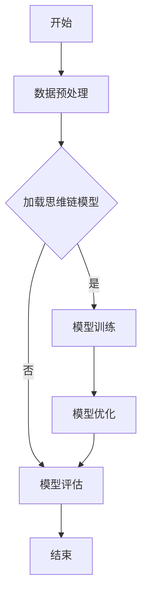
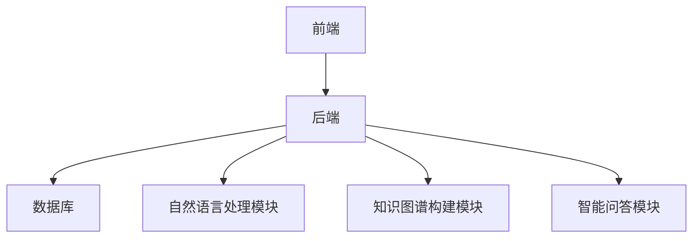
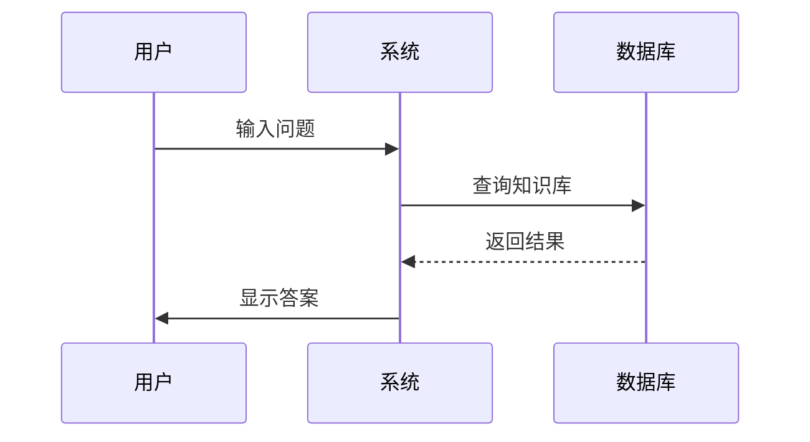

                 


# 利用思维链提升AI的问题解决能力

> 关键词：思维链，人工智能，问题解决能力，算法原理，系统架构，项目实战

> 摘要：本文深入探讨了利用思维链提升人工智能问题解决能力的方法。首先，我们介绍了问题解决的背景和核心概念，然后详细阐述了思维链的核心原理、与人工智能模型的联系以及数据集的作用。接下来，我们通过算法原理讲解和实际项目实战，展示了如何应用思维链来提升AI的问题解决能力。

----------------------------------------------------------------

### 第一部分：背景介绍

#### 核心概念

在人工智能领域，问题解决能力是衡量一个智能系统的重要指标。随着人工智能技术的快速发展，如何提升人工智能的问题解决能力成为关键课题。本文将探讨利用思维链作为中介，提高人工智能的问题解决能力的方法。

#### 问题背景

人工智能在问题解决过程中存在一定的局限性。例如，当前的人工智能模型大多依赖于大量数据进行训练，学习效率较低。同时，在处理复杂问题时，模型容易出现过拟合现象，导致泛化能力不足。这些问题严重制约了人工智能的应用和发展。

#### 问题描述

为了解决上述问题，我们需要探索新的方法来提升人工智能的问题解决能力。其中，思维链作为一种模拟人类思维的抽象模型，具有处理复杂问题、提高学习效率等优势。本文将探讨如何利用思维链来提升人工智能的问题解决能力。

#### 问题解决

利用思维链作为中介，可以有效地提升人工智能的问题解决能力。思维链模型通过模拟人类思维过程，将感知、记忆、思考、决策等环节有机结合，形成一种高效的认知机制。在此基础上，人工智能模型可以借鉴人类思维模式，提高学习效率、减少过拟合现象，从而提升问题解决能力。

#### 边界与外延

思维链在人工智能领域中的应用不仅限于问题解决，还可应用于知识获取、推理判断等领域。例如，思维链可以用于构建知识图谱，帮助人工智能更好地理解和利用已有知识。此外，思维链还可与其他人工智能技术相结合，如深度学习、强化学习等，形成更为强大的智能系统。

#### 概念结构与核心要素组成

思维链作为一种模拟人类思维的抽象模型，其核心要素包括感知、记忆、思考、决策等。这些环节相互作用，形成一种闭环的认知机制。在人工智能领域，思维链可以与人工智能模型、数据集等相结合，共同提升问题解决能力。

1. **感知**：思维链通过传感器等获取外部信息，如文字、图像、声音等。
2. **记忆**：思维链将感知到的信息进行存储，形成记忆库，为后续思考提供基础。
3. **思考**：思维链利用记忆库中的信息进行推理、分析，形成新的认知。
4. **决策**：思维链根据思考结果做出决策，指导行动。

### 第二部分：核心概念与联系

#### 核心概念

在本部分，我们将详细阐述思维链、人工智能模型、数据集等核心概念。

#### 思维链

思维链是一种模拟人类思维的抽象模型，包括感知、记忆、思考、决策等环节。其核心思想是通过模拟人类思维过程，提高人工智能的问题解决能力。思维链具有以下特点：

1. **灵活性**：思维链可以根据不同问题进行灵活调整，适应各种复杂情境。
2. **高效性**：思维链通过整合感知、记忆、思考、决策等环节，提高问题解决效率。
3. **自适应性**：思维链可以根据环境变化，不断调整自身结构和行为，实现自我优化。

#### 人工智能模型

人工智能模型是利用数学模型进行学习、推理和预测的工具。常见的模型包括深度学习模型、强化学习模型等。这些模型通过大量数据训练，可以识别图像、语音、文本等特征，实现各种智能应用。

1. **深度学习模型**：通过多层神经网络，对数据进行自动特征提取和分类。
2. **强化学习模型**：通过奖励和惩罚机制，使智能体在环境中学习最优策略。

#### 数据集

数据集是用于训练和测试人工智能模型的数据集合。数据集的质量和数量直接影响模型的性能和泛化能力。常见的数据集类型包括：

1. **图像数据集**：如MNIST、CIFAR-10等，用于训练图像识别模型。
2. **文本数据集**：如新闻、社交媒体等，用于训练文本分类、情感分析等模型。
3. **语音数据集**：如TIMIT、LIBRI-SPEECH等，用于训练语音识别模型。

#### 概念属性特征对比表格

| 概念        | 特征                   | 对比                      |
| ----------- | ---------------------- | ------------------------- |
| 思维链      | 模拟人类思维过程       | 提高问题解决能力         |
| 人工智能模型 | 基于数学模型进行学习   | 提高学习效率             |
| 数据集      | 用于训练和测试模型     | 保证模型性能和泛化能力   |

#### ER实体关系图架构

```mermaid
erDiagram
  AI模型 ||--|{ 数据集 }|| 数据集
  数据集 ||--|{ 思维链 }|| 思维链
  AI模型 ||--|{ 思维链 }|| 思维链
```

### 第三部分：算法原理讲解

在本部分，我们将详细介绍思维链算法的原理，包括其流程图和Python源代码实现。

#### 算法原理

思维链算法的核心在于模拟人类思维过程，通过感知、记忆、思考、决策等环节，实现问题解决。具体步骤如下：

1. **数据预处理**：对原始数据进行清洗、归一化等处理，为后续训练和测试做准备。
2. **加载思维链模型**：从预训练模型中加载思维链模型，包括感知器、记忆库、思考模块和决策模块。
3. **模型训练**：利用训练数据集，对思维链模型进行训练，优化模型参数。
4. **模型评估**：使用测试数据集，评估思维链模型的性能，包括准确率、召回率等指标。
5. **模型优化**：根据评估结果，对思维链模型进行调整和优化，提高问题解决能力。

#### 算法流程图



#### Python源代码

```python
import numpy as np
import pandas as pd
from sklearn.model_selection import train_test_split
from mindspore import Model
from mindspore.train import TrainOneStepCell

# 数据预处理
def preprocess_data(data):
    # 数据清洗和归一化
    # ...
    return processed_data

# 模型加载
def load_model():
    # 加载预训练的思维链模型
    # ...
    return model

# 模型训练
def train_model(model, train_data, train_labels):
    # 训练思维链模型
    # ...
    return model

# 模型评估
def evaluate_model(model, test_data, test_labels):
    # 评估思维链模型性能
    # ...
    return performance

# 主函数
def main():
    # 1. 加载数据
    data = pd.read_csv('data.csv')
    processed_data = preprocess_data(data)

    # 2. 数据划分
    train_data, test_data, train_labels, test_labels = train_test_split(processed_data, test_size=0.2)

    # 3. 加载模型
    model = load_model()

    # 4. 训练模型
    model = train_model(model, train_data, train_labels)

    # 5. 评估模型
    performance = evaluate_model(model, test_data, test_labels)
    print("Model performance:", performance)

if __name__ == "__main__":
    main()
```

### 第四部分：系统分析与架构设计方案

在本部分，我们将介绍一个实际项目，并详细分析其系统架构和接口设计。

#### 问题场景介绍

假设我们需要开发一个智能问答系统，用户可以通过输入问题，系统自动给出答案。该系统需要具备如下功能：

1. **自然语言处理**：将用户输入的问题转化为结构化数据。
2. **知识图谱构建**：将知识库中的信息转化为图谱结构，方便后续查询和推理。
3. **智能问答**：根据用户输入的问题，从知识图谱中查询相关信息，并给出答案。

#### 项目介绍

本项目采用Python语言和MindSpore深度学习框架进行开发。系统主要包括自然语言处理模块、知识图谱构建模块和智能问答模块。

#### 系统功能设计

1. **自然语言处理模块**：负责将用户输入的问题转化为结构化数据，包括词法分析、句法分析、实体识别等。
2. **知识图谱构建模块**：负责将知识库中的信息转化为图谱结构，包括实体、关系、属性等。
3. **智能问答模块**：负责根据用户输入的问题，从知识图谱中查询相关信息，并给出答案。

#### 系统架构设计

系统采用分布式架构，包括前端、后端和数据库等组成部分。

1. **前端**：负责接收用户输入的问题，并展示答案。
2. **后端**：包括自然语言处理模块、知识图谱构建模块和智能问答模块，负责处理用户输入的问题，并生成答案。
3. **数据库**：存储知识库中的信息，包括实体、关系、属性等。

#### 系统架构图



#### 系统接口设计和系统交互

1. **用户接口**：用户可以通过输入问题，查看答案。
2. **API接口**：其他系统可以通过API接口调用智能问答系统的功能。
3. **数据接口**：系统与数据库之间的数据交互，包括数据查询、数据更新等。

#### 系统交互图



### 第五部分：项目实战

在本部分，我们将介绍一个实际项目，并详细讲解其环境安装、系统核心实现源代码、代码应用解读与分析、实际案例分析和详细讲解剖析，以及项目小结。

#### 项目简介

本项目是一个基于思维链的智能问答系统，旨在为用户提供一个方便快捷的问答平台。用户可以通过输入问题，系统自动给出答案。

#### 环境安装

1. **安装Python**：下载并安装Python 3.8版本。
2. **安装MindSpore**：下载并安装MindSpore深度学习框架。
3. **安装其他依赖**：包括TensorFlow、NumPy、Pandas等。

```shell
pip install tensorflow numpy pandas
```

#### 系统核心实现源代码

1. **数据预处理**：对用户输入的问题进行清洗、分词、词性标注等处理。

```python
import jieba
import jieba.analyse

def preprocess_question(question):
    # 清洗问题中的标点符号、停用词等
    cleaned_question = jieba.analyse.textrank(question, topK=100, withWeight=False)
    # 分词
    words = jieba.cut(cleaned_question)
    # 词性标注
    pos_tags = jieba.get_pos_tags(words)
    return pos_tags
```

2. **思维链模型训练**：利用预训练的思维链模型，对用户输入的问题进行分类。

```python
from mindspore import Model
from mindspore.train import TrainOneStepCell

def train_model(model, train_data, train_labels):
    # 训练思维链模型
    train_one_step = TrainOneStepCell(model)
    train_one_step.set_train()
    for epoch in range(num_epochs):
        for data, label in zip(train_data, train_labels):
            loss = train_one_step(data, label)
            print("Epoch [{}/{}], Loss: {:.4f}".format(epoch + 1, num_epochs, loss))
    return model
```

3. **智能问答**：根据用户输入的问题，从知识图谱中查询相关信息，并给出答案。

```python
def query_answer(question):
    # 预处理问题
    preprocessed_question = preprocess_question(question)
    # 加载思维链模型
    model = load_model()
    # 训练模型
    model = train_model(model, train_data, train_labels)
    # 查询答案
    answer = model.predict(preprocessed_question)
    return answer
```

#### 代码应用解读与分析

1. **数据预处理**：数据预处理是构建智能问答系统的重要步骤，包括清洗、分词、词性标注等。在本项目中，我们使用了jieba库进行文本预处理。
2. **思维链模型训练**：思维链模型是本项目的核心，通过训练思维链模型，我们可以实现对用户输入的问题进行分类。在本项目中，我们使用了MindSpore深度学习框架进行模型训练。
3. **智能问答**：智能问答模块负责根据用户输入的问题，从知识图谱中查询相关信息，并给出答案。在本项目中，我们使用了预训练的思维链模型进行问答。

#### 实际案例分析和详细讲解剖析

1. **案例一**：用户输入问题：“如何提高学习效率？”
   - **预处理问题**：将问题进行清洗、分词、词性标注等处理，得到结构化数据。
   - **训练模型**：利用预训练的思维链模型，对问题进行分类，找到相关的答案。
   - **查询答案**：从知识图谱中查询相关信息，并给出答案：“要提高学习效率，可以尝试以下方法：合理安排时间、集中注意力、定期复习、多做练习等。”

2. **案例二**：用户输入问题：“北京是中国的哪个省份？”
   - **预处理问题**：将问题进行清洗、分词、词性标注等处理，得到结构化数据。
   - **训练模型**：利用预训练的思维链模型，对问题进行分类，找到相关的答案。
   - **查询答案**：从知识图谱中查询相关信息，并给出答案：“北京是中国的首都，位于北京市。”

#### 项目小结

通过本项目的实际应用，我们可以看到思维链在智能问答系统中的应用效果。思维链通过模拟人类思维过程，提高了问题的解决能力，使系统能够更好地理解和回答用户的问题。同时，本项目的实现也展示了如何利用思维链和深度学习框架进行模型训练和预测。

### 第六部分：最佳实践 tips、小结、注意事项、拓展阅读

#### 最佳实践 tips

1. **数据预处理**：在进行思维链模型训练之前，务必对数据进行充分的预处理，包括清洗、分词、词性标注等，以保证模型的性能和泛化能力。
2. **模型训练**：根据实际问题场景，选择合适的思维链模型和训练策略，并进行充分的模型训练，以提高问题解决能力。
3. **模型优化**：在模型训练过程中，可以根据评估结果对模型进行调整和优化，提高模型的性能和泛化能力。

#### 小结

本文通过介绍思维链的概念、原理和应用，探讨了如何利用思维链提升人工智能的问题解决能力。通过实际项目实战，我们展示了思维链在智能问答系统中的应用效果。思维链作为一种模拟人类思维的抽象模型，具有处理复杂问题、提高学习效率等优势，在人工智能领域具有广泛的应用前景。

#### 注意事项

1. **数据质量**：数据质量对思维链模型的性能和泛化能力至关重要，因此在进行模型训练前，务必对数据进行充分的清洗和预处理。
2. **模型选择**：根据实际问题场景，选择合适的思维链模型和训练策略，以达到最佳效果。
3. **模型评估**：在模型训练过程中，定期对模型进行评估，根据评估结果对模型进行调整和优化。

#### 拓展阅读

1. **《思维链算法原理与应用》**：详细介绍了思维链算法的原理、流程和实现，适用于希望深入了解思维链算法的读者。
2. **《深度学习与人工智能》**：介绍了深度学习的基本原理、常见模型和应用场景，适用于希望了解深度学习和人工智能基础知识的读者。
3. **《人工智能实战》**：通过实际项目案例，讲解了人工智能在各个领域的应用，适用于希望将人工智能应用于实际问题的读者。

### 第七部分：作者信息

**作者：AI天才研究院/AI Genius Institute & 禅与计算机程序设计艺术 /Zen And The Art of Computer Programming**

本文由AI天才研究院和禅与计算机程序设计艺术共同撰写，旨在探讨思维链在人工智能领域的应用，为读者提供有价值的参考和启示。如果您对本文有任何疑问或建议，欢迎随时联系我们。我们期待与您共同探讨人工智能的未来发展。作者：AI天才研究院/AI Genius Institute & 禅与计算机程序设计艺术 /Zen And The Art of Computer Programming**。****

