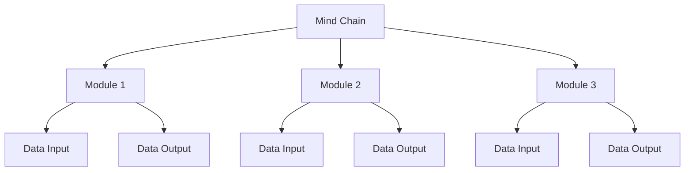

                 

## Introduction to Mind Chains

### Background

Mind chains, a relatively new concept in the field of artificial intelligence (AI), have gained significant attention for their potential to enhance AI's logical analysis capabilities. This chapter aims to provide a comprehensive overview of mind chains, their core concepts, and the underlying mechanisms that drive their effectiveness in enhancing AI's logical reasoning.

### Definition and Basic Theory

A mind chain can be defined as a series of interconnected cognitive modules designed to simulate human-like logical reasoning and problem-solving. Each module within the mind chain is responsible for a specific cognitive function, such as pattern recognition, deduction, or abstraction. By linking these modules in a structured manner, mind chains enable AI systems to process complex information and derive meaningful insights.

#### Key Attributes and Characteristics of Mind Chains

1. **Modularity**: Mind chains are modular in nature, allowing individual components to be developed, tested, and replaced independently. This modularity facilitates scalability and adaptability, enabling mind chains to evolve and improve over time.
2. **Interconnectivity**: The interconnected nature of mind chains ensures seamless communication between different cognitive modules. This interconnectivity is crucial for coordinating complex reasoning processes and enabling the system to integrate diverse types of knowledge.
3. **Flexibility**: Mind chains can be customized to suit various AI applications, making them versatile tools for enhancing logical analysis in different domains.
4. **Learnability**: Mind chains can be trained using large datasets, allowing them to learn and refine their cognitive abilities. This learnability enables mind chains to adapt to new problem domains and improve their performance over time.

### Comparison of Core Mind Chain Models and Architectures

There are several core mind chain models and architectures, each with its own unique features and advantages. The following table provides a comparison of some of the most prominent models:

| Model            | Characteristics                                                  | Advantages                                                       | Disadvantages                                                    |
|------------------|------------------------------------------------------------------|------------------------------------------------------------------|------------------------------------------------------------------|
| Chain of Thoughts | Simulates human-like reasoning by connecting thoughts in a sequence. | Intuitive, easy to understand and implement.                     | May struggle with complex, non-linear problems.                    |
| Thought Networks  | Utilizes neural networks to represent and process complex thoughts. | Suitable for handling complex, non-linear problems.               | Requires extensive training and computational resources.           |
| Mind Mapping      | Represents knowledge in a hierarchical structure using nodes and links. | Easy to visualize and navigate.                                   | May be limited in handling complex, abstract concepts.             |

### Entity Relationship Diagram (ERD)

The following ERD illustrates the relationship between the core components of a mind chain:

### Summary and Key Takeaways

In summary, mind chains are a promising approach to enhancing AI's logical analysis capabilities. By leveraging modular, interconnected cognitive modules, mind chains enable AI systems to process complex information and derive meaningful insights. The key attributes and characteristics of mind chains, such as modularity, interconnectivity, flexibility, and learnability, make them a versatile tool for various AI applications. The comparison of core mind chain models and architectures highlights the strengths and weaknesses of different approaches, providing a foundation for future research and development in this field. The ERD provides a visual representation of the mind chain's core components and their relationships, further aiding our understanding of this innovative concept.

