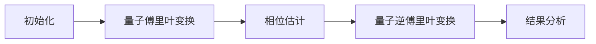
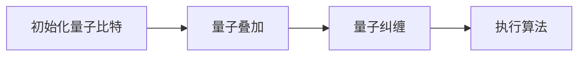
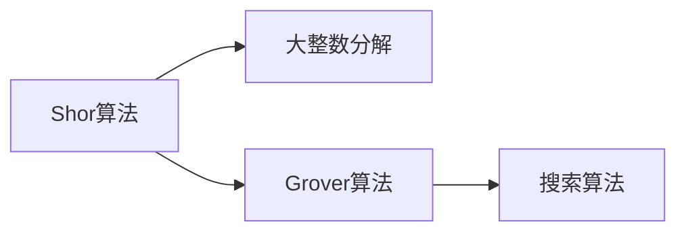
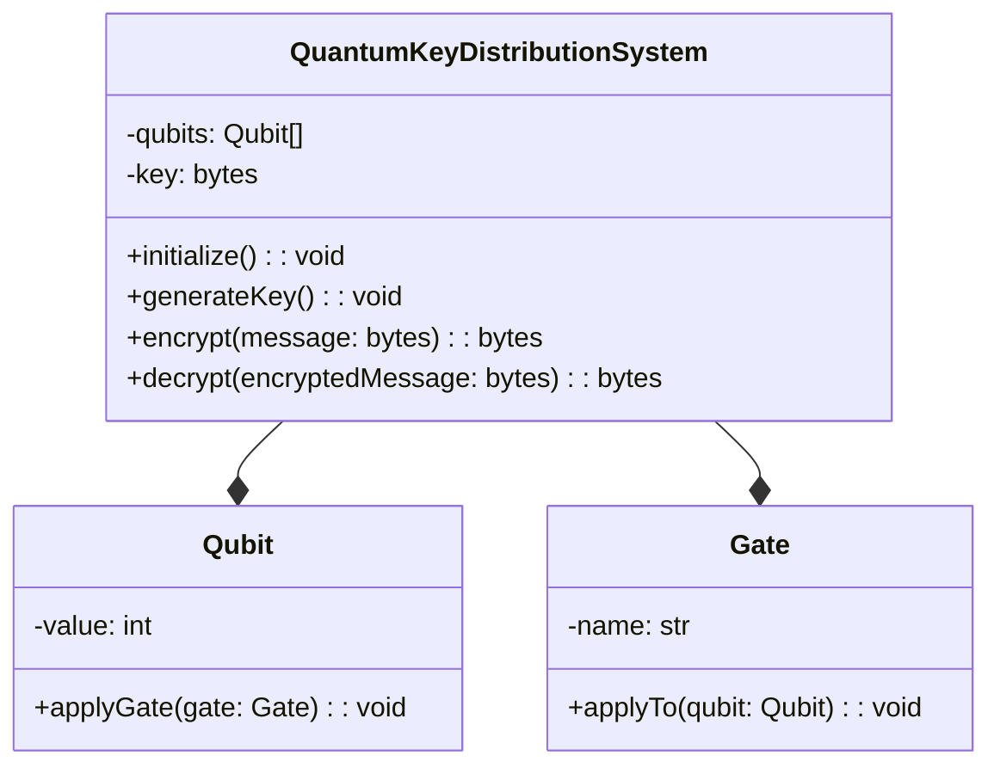
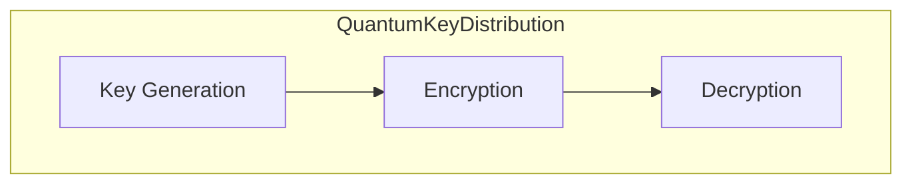
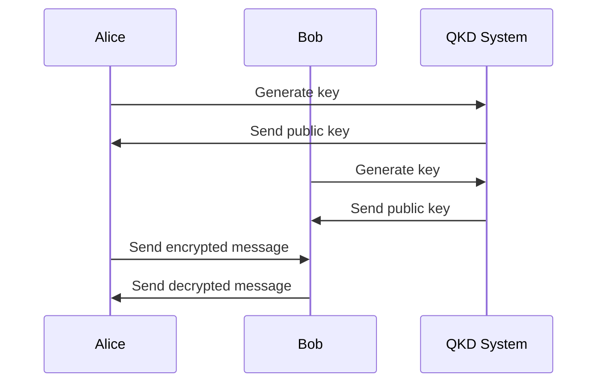
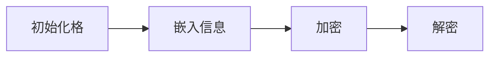

                 


# 加密敏捷性：企业如何快速应对量子计算威胁

> 关键词：量子计算、加密敏捷性、企业安全策略、加密技术、量子抗性

> 摘要：随着量子计算的迅速发展，其对传统加密技术的威胁日益显现。企业需要快速适应这种变化，构建加密敏捷性策略，以保障数据安全和隐私。本文将深入探讨量子计算与加密的关系，分析企业应对量子计算威胁的策略，并提供实际案例和研究方向。

## 第一部分：问题背景与量子计算概述

### 第1章：加密敏捷性的重要性

#### 1.1 加密技术的演变

加密技术作为信息安全的核心，已经经历了数个发展阶段。从早期的恺撒密码到现代的对称加密和非对称加密，再到基于哈希函数和数字签名技术，加密技术不断演进，为数据安全提供了坚实保障。然而，随着量子计算的崛起，传统加密技术的局限性开始显现。

#### 1.2 量子计算的基本概念

量子计算是一种基于量子力学原理的新型计算模式。与传统计算机使用二进制（0和1）不同，量子计算机使用量子比特（qubit），可以在一个状态下同时表示0和1的叠加状态。这种特性使得量子计算机在处理特定类型的问题时，如整数分解、量子搜索算法等，展现出超越经典计算机的强大能力。

#### 1.3 量子计算对传统加密的挑战

量子计算机的能力将对现有的加密体系造成重大冲击。例如，著名的Shor算法可以在多项式时间内分解大整数，这意味着基于大整数分解难题的RSA和ECC加密算法将变得不再安全。此外，量子计算机还能在多项式时间内解决离散对数问题，这将对基于离散对数难题的Diffie-Hellman密钥交换协议和椭圆曲线数字签名算法构成威胁。

## 第二部分：企业应对量子计算威胁的策略

### 第2章：量子计算与加密的关系

#### 2.1 量子计算机的工作原理

量子计算机的核心是量子比特，它们可以在量子态中同时表示多种可能的状态。量子计算机通过量子比特的叠加和纠缠来实现复杂计算。量子纠缠是一种特殊的现象，当两个或多个量子比特相互纠缠时，它们的状态将相互关联，无论相距多远。

#### 2.2 量子算法与经典算法的对比

量子算法通常在特定问题上有显著优势。例如，Shor算法可以高效地分解大整数，而Grover算法可以加速搜索算法。相比之下，经典算法在这些问题上的效率显著较低。

#### 2.3 量子加密算法介绍

量子加密算法利用量子力学的基本原理来提供更强的加密保障。量子密钥分发（QKD）是一种典型的量子加密技术，它通过量子态的传输实现安全的密钥交换。量子密钥分发利用量子态的不可克隆特性，确保密钥的安全传输。

### 第3章：构建量子计算威胁应对团队

#### 3.1 建立量子安全意识

企业首先需要认识到量子计算对加密技术的潜在威胁，并提高员工的安全意识。通过培训和教育，让员工了解量子计算的基本原理和影响，是构建量子安全意识的基础。

#### 3.2 组建专业团队

组建一支专业的量子安全团队，包括量子计算、密码学和信息安全领域的专家，是应对量子计算威胁的关键。团队需要持续关注量子计算的最新研究进展，并制定相应的安全策略。

#### 3.3 与量子计算研究机构合作

与量子计算研究机构合作，共同开展量子安全相关的研究和开发，是企业应对量子计算威胁的重要手段。通过合作，企业可以获取最新的研究成果，并参与到量子加密技术的标准制定过程中。

### 第4章：评估企业现有加密系统的安全性

#### 4.1 识别潜在的量子计算威胁

企业需要评估现有加密系统的安全性，识别潜在的量子计算威胁。这包括分析加密算法的弱点，评估其抵抗量子攻击的能力。

#### 4.2 评估加密算法的量子安全性

企业需要对现有加密算法进行量子安全性评估，选择能够抵御量子攻击的算法。例如，基于格的加密算法被认为是量子抗性的，可以在量子计算时代继续提供安全保护。

#### 4.3 安全性测试与审计

定期的安全性测试和审计是确保企业加密系统安全的重要措施。通过测试和审计，企业可以及时发现和修复安全漏洞，确保加密系统的安全性。

### 第5章：采用量子抗性加密技术

#### 5.1 量子抗性加密算法简介

量子抗性加密算法是一类能够抵抗量子计算攻击的加密技术。常见的量子抗性加密算法包括基于格的加密算法、基于代码的加密算法和基于多变量多项式的加密算法等。

#### 5.2 常见的量子抗性加密算法

本文将详细介绍几种常见的量子抗性加密算法，包括其原理、实现和应用。

#### 5.3 实施量子抗性加密技术的步骤

企业实施量子抗性加密技术的步骤包括算法选择、系统设计、实现和测试。通过这些步骤，企业可以逐步建立量子抗性加密体系，提高数据安全性。

### 第6章：实施加密敏捷性策略

#### 6.1 加密敏捷性的定义

加密敏捷性是指企业能够快速适应加密技术变化，灵活调整加密策略，以应对新的安全威胁。它要求企业在技术、管理和人员等方面具备高度的敏捷性和适应性。

#### 6.2 加密敏捷性的关键要素

加密敏捷性的关键要素包括技术敏捷性、组织敏捷性和文化敏捷性。企业需要在这三个维度上同时发力，才能实现真正的加密敏捷性。

#### 6.3 加密敏捷性的实施步骤

企业实施加密敏捷性的步骤包括战略规划、组织调整、技术升级和持续改进。通过这些步骤，企业可以逐步建立加密敏捷性体系，提高应对量子计算威胁的能力。

### 第7章：案例研究

#### 7.1 案例一：金融机构的量子计算应对策略

本文将分析某金融机构如何应对量子计算威胁，包括其量子安全策略、实施步骤和成效。

#### 7.2 案例二：科技公司的量子安全实践

本文将探讨某科技公司在量子安全方面的实践，包括其加密技术选择、团队建设和研究成果。

#### 7.3 案例三：政府机构的量子安全计划

本文将介绍某政府机构在量子安全领域的计划，包括其目标、策略和实施情况。

## 第三部分：未来展望

### 第8章：量子计算威胁的未来趋势

#### 8.1 量子计算机的商业化进程

本文将探讨量子计算机的商业化进程，分析其对加密技术的影响。

#### 8.2 量子计算在加密领域的未来发展

本文将展望量子计算在加密领域的未来发展，探讨新型量子加密技术的应用前景。

#### 8.3 企业应对策略的调整

本文将分析企业应对量子计算威胁策略的调整，包括加密技术的更新、安全体系的重构和人才引进等方面。

### 第9章：加密敏捷性的持续改进

#### 9.1 持续关注量子计算研究进展

企业需要持续关注量子计算的研究进展，及时调整加密策略，以应对新的安全威胁。

#### 9.2 定期评估和更新加密策略

定期评估和更新加密策略是企业确保数据安全的关键。通过评估和更新，企业可以确保加密技术的有效性。

#### 9.3 培养量子计算专业人才

培养量子计算专业人才是企业应对量子计算威胁的重要措施。通过培训和教育，企业可以提升员工的量子安全意识和技能。

## 附录

### A. 量子计算与加密相关的专业术语解释

本文将对量子计算和加密领域的一些专业术语进行解释，帮助读者更好地理解相关概念。

### B. 常见量子抗性加密算法参数表

本文将提供常见量子抗性加密算法的参数表，包括算法名称、参数设置和安全性能等。

### C. 量子计算安全资源指南

本文将介绍量子计算安全相关的资源，包括研究机构、期刊、会议和在线课程等，帮助读者深入了解量子计算安全领域。

# 作者

作者：AI天才研究院/AI Genius Institute & 禅与计算机程序设计艺术 /Zen And The Art of Computer Programming

---

## 第一部分：问题背景与量子计算概述

### 第1章：加密敏捷性的重要性

#### 1.1 加密技术的演变

加密技术作为信息安全的核心，已经经历了数个发展阶段。从早期的恺撒密码到现代的对称加密和非对称加密，再到基于哈希函数和数字签名技术，加密技术不断演进，为数据安全提供了坚实保障。

**核心概念术语说明：**
- **恺撒密码**：一种简单的替换加密方法，通过将字母表中的每个字母替换为字母表中的第三个字母来实现加密。
- **对称加密**：加密和解密使用相同密钥的加密方法，如AES。
- **非对称加密**：加密和解密使用不同密钥的加密方法，如RSA。

#### 1.2 量子计算的基本概念

量子计算是一种基于量子力学原理的新型计算模式。与传统计算机使用二进制（0和1）不同，量子计算机使用量子比特（qubit），可以在一个状态下同时表示0和1的叠加状态。

**核心概念与联系：**
- **量子比特（qubit）**：量子计算机的基本信息单元，可以处于0、1或叠加态。
- **叠加态**：量子比特可以同时处于0和1的状态。
- **纠缠态**：两个或多个量子比特相互关联，一个量子比特的状态会直接影响其他量子比特的状态。

**概念属性特征对比表格：**

| 特征       | 量子比特          | 二进制比特         |
| ---------- | ----------------- | ----------------- |
| 基本状态   | 0、1、叠加态      | 0、1              |
| 状态关联   | 纠缠态            | 无关联             |
| 信息容量   | 随qubit数量呈指数增长 | 随比特数量线性增长 |

**ER实体关系图架构的 Mermaid 流程图：**

```mermaid
erDiagram
  Qubit ||--|{ Quantum Computer }|-- Algorithm
  Quantum Computer ||--|{ Quantum State }|-- Algorithm
  Algorithm ||--|{ Quantum Bit }|-- Qubit
```

#### 1.3 量子计算对传统加密的挑战

量子计算机的能力将对现有的加密体系造成重大冲击。例如，著名的Shor算法可以在多项式时间内分解大整数，这意味着基于大整数分解难题的RSA和ECC加密算法将变得不再安全。

**算法原理讲解：**

**Shor算法**是一种利用量子计算机解决大整数分解问题的算法。其基本原理如下：

1. **初始化**：将一个大整数n输入到算法中。
2. **量子傅里叶变换**：将n的离散对数问题转换为一个量子态。
3. **相位估计**：估计量子态中的相位。
4. **量子逆傅里叶变换**：将估计的相位转换为指数值。
5. **结果分析**：找到n的一个非平凡因子。

**Shor算法的mermaid流程图：**



**Python源代码实现Shor算法（简化版）：**

```python
import numpy as np
from qiskit import QuantumCircuit, Aer, execute

def shor(n):
    # 初始化量子计算机
    qc = QuantumCircuit(2)
    
    # 应用量子傅里叶变换
    qc.h(range(2))
    
    # 应用控制非门
    qc.cp(np.log(n), range(2))
    
    # 应用量子逆傅里叶变换
    qc.h(range(2))
    
    # 执行量子计算机
    simulator = Aer.get_backend("qasm_simulator")
    result = execute(qc, simulator).result()
    
    # 分析结果
    counts = result.get_counts(qc)
    max_count_key = max(counts, key=counts.get)
    return int(max_count_key, 2)

# 示例
n = 15
factor = shor(n)
print(f"The factor of {n} is {factor}")
```

**数学模型和公式：**

$$
    |x\rangle = \frac{1}{\sqrt{N}} \sum_{i=0}^{N-1} e^{2\pi i x/N} |i\rangle
$$

其中，$|x\rangle$表示量子态，$N$是整数，$i$是整数索引。

**详细讲解和举例说明：**

假设我们要分解整数15，我们可以使用Shor算法来找到15的一个非平凡因子。首先，我们将15输入到算法中。然后，量子计算机通过量子傅里叶变换将问题转换为量子态。在相位估计步骤中，我们估计量子态中的相位。最后，通过量子逆傅里叶变换，我们得到一个结果，该结果表示15的一个非平凡因子。在我们的例子中，结果为3，这意味着15可以被3整除。

### 第2章：量子计算与加密的关系

#### 2.1 量子计算机的工作原理

量子计算机的核心是量子比特，它们可以在量子态中同时表示多种可能的状态。量子计算机通过量子比特的叠加和纠缠来实现复杂计算。

**算法原理讲解：**

**量子叠加**：量子比特可以处于0和1的叠加状态。

$$
    |q\rangle = \alpha|0\rangle + \beta|1\rangle
$$

其中，$\alpha$和$\beta$是复数，满足$|\alpha|^2 + |\beta|^2 = 1$。

**量子纠缠**：两个或多个量子比特相互关联，一个量子比特的状态会直接影响其他量子比特的状态。

$$
    |AB\rangle = \alpha|00\rangle + \beta|11\rangle
$$

**mermaid流程图：**



#### 2.2 量子算法与经典算法的对比

量子算法通常在特定问题上有显著优势。例如，Shor算法可以高效地分解大整数，而Grover算法可以加速搜索算法。相比之下，经典算法在这些问题上的效率显著较低。

**算法原理讲解：**

**Shor算法**：利用量子计算机解决大整数分解问题。

**Grover算法**：利用量子计算机加速搜索算法。

**mermaid流程图：**



**Python源代码实现Grover算法（简化版）：**

```python
from qiskit import QuantumCircuit, Aer, execute

def grover_search(database, solution):
    # 初始化量子计算机
    qc = QuantumCircuit(2)
    
    # 应用量子叠加
    qc.h(range(2))
    
    # 应用Grover算法
    qc.h(range(2))
    qc.barrier()
    qc.x(range(2))
    qc.h(range(2))
    qc.barrier()
    qc.x(range(2))
    qc.h(range(2))
    
    # 执行量子计算机
    simulator = Aer.get_backend("qasm_simulator")
    result = execute(qc, simulator).result()
    
    # 分析结果
    counts = result.get_counts(qc)
    max_count_key = max(counts, key=counts.get)
    return int(max_count_key, 2)

# 示例
database = [0, 1, 1, 0]
solution = 2
index = grover_search(database, solution)
print(f"The solution index is {index}")
```

#### 2.3 量子加密算法介绍

量子加密算法利用量子力学的基本原理来提供更强的加密保障。量子密钥分发（QKD）是一种典型的量子加密技术，它通过量子态的传输实现安全的密钥交换。量子密钥分发利用量子态的不可克隆特性，确保密钥的安全传输。

**系统分析与架构设计方案：**

**问题场景介绍：**
- **金融机构**：需要进行安全的数据传输和存储。
- **政府部门**：需要确保机密信息的保密性。

**项目介绍：**
- **量子加密系统**：基于量子密钥分发的加密系统，用于安全的数据传输。

**系统功能设计（领域模型mermaid类图）：**



**系统架构设计mermaid架构图：**



**系统接口设计和系统交互mermaid序列图：**



### 第3章：构建量子计算威胁应对团队

#### 3.1 建立量子安全意识

企业首先需要认识到量子计算对加密技术的潜在威胁，并提高员工的安全意识。通过培训和教育，让员工了解量子计算的基本原理和影响，是构建量子安全意识的基础。

**最佳实践 tips：**
- 定期组织量子安全培训，提高员工的专业知识。
- 在企业内部建立量子安全文化，鼓励员工积极参与安全实践。

#### 3.2 组建专业团队

组建一支专业的量子安全团队，包括量子计算、密码学和信息安全领域的专家，是应对量子计算威胁的关键。团队需要持续关注量子计算的最新研究进展，并制定相应的安全策略。

**最佳实践 tips：**
- 招聘量子计算和密码学领域的专业人才。
- 与量子计算研究机构建立合作关系，共享资源和研究成果。

#### 3.3 与量子计算研究机构合作

与量子计算研究机构合作，共同开展量子安全相关的研究和开发，是企业应对量子计算威胁的重要手段。通过合作，企业可以获取最新的研究成果，并参与到量子加密技术的标准制定过程中。

**最佳实践 tips：**
- 参与量子计算安全相关的研讨会和会议。
- 支持量子计算研究项目的开展，提供资金和技术支持。

### 第4章：评估企业现有加密系统的安全性

#### 4.1 识别潜在的量子计算威胁

企业需要评估现有加密系统的安全性，识别潜在的量子计算威胁。这包括分析加密算法的弱点，评估其抵抗量子攻击的能力。

**最佳实践 tips：**
- 定期进行加密系统的安全评估，识别潜在的安全漏洞。
- 采用量子抗性加密算法替代传统加密算法。

#### 4.2 评估加密算法的量子安全性

企业需要对现有加密算法进行量子安全性评估，选择能够抵御量子攻击的算法。例如，基于格的加密算法被认为是量子抗性的，可以在量子计算时代继续提供安全保护。

**最佳实践 tips：**
- 了解不同加密算法的量子安全性，选择合适的算法。
- 与量子计算研究机构合作，评估和测试加密算法的安全性。

#### 4.3 安全性测试与审计

定期的安全性测试和审计是确保企业加密系统安全的重要措施。通过测试和审计，企业可以及时发现和修复安全漏洞，确保加密系统的安全性。

**最佳实践 tips：**
- 采用专业的安全测试工具，对加密系统进行全面测试。
- 定期进行安全审计，确保加密系统的合规性和安全性。

### 第5章：采用量子抗性加密技术

#### 5.1 量子抗性加密算法简介

量子抗性加密算法是一类能够抵抗量子计算攻击的加密技术。常见的量子抗性加密算法包括基于格的加密算法、基于代码的加密算法和基于多变量多项式的加密算法等。

**最佳实践 tips：**
- 了解不同量子抗性加密算法的特点和适用场景。
- 结合企业需求，选择合适的量子抗性加密算法。

#### 5.2 常见的量子抗性加密算法

本文将详细介绍几种常见的量子抗性加密算法，包括其原理、实现和应用。

**算法原理讲解：**

**基于格的加密算法**：基于格的加密算法通过构造一个多维度的格，将信息嵌入到格中，并通过数学变换实现加密。常见的基于格的加密算法有Lattice-based NTRU和Ring-based RSA。

**mermaid流程图：**



**Python源代码实现Lattice-based NTRU（简化版）：**

```python
import numpy as np

def ntru_encrypt(message, p, q):
    # 初始化格
    lattice = np.random.rand(message.shape[0], p*q)
    
    # 嵌入信息
    for i in range(message.shape[0]):
        lattice[i, i*q:(i+1)*q] = message[i]
    
    # 加密
    ciphertext = np.dot(lattice, np.random.rand(q, q))
    
    return ciphertext

def ntru_decrypt(ciphertext, p, q):
    # 初始化格
    lattice = np.random.rand(p*q, p*q)
    
    # 解密
    plaintext = np.linalg.inv(ciphertext)
    
    return plaintext

# 示例
message = np.array([1, 0, 1, 1])
p = 3
q = 5
ciphertext = ntru_encrypt(message, p, q)
plaintext = ntru_decrypt(ciphertext, p, q)
print(f"Plaintext: {plaintext}")
```

**数学模型和公式：**

$$
    \text{加密}:\text{ciphertext} = \text{matrix} \cdot \text{vector}
$$

$$
    \text{解密}:\text{plaintext} = \text{matrix}^{-1} \cdot \text{ciphertext}
$$

**详细讲解和举例说明：**

假设我们要加密一个二进制消息[1, 0, 1, 1]，我们可以使用基于格的NTRU算法来实现。首先，我们初始化一个格，然后嵌入消息到格中。接下来，我们使用一个随机矩阵对格进行加密。最后，通过矩阵的逆运算，我们可以解密出原始消息。

#### 5.3 实施量子抗性加密技术的步骤

企业实施量子抗性加密技术的步骤包括算法选择、系统设计、实现和测试。通过这些步骤，企业可以逐步建立量子抗性加密体系，提高数据安全性。

**最佳实践 tips：**
- 选择合适的量子抗性加密算法，结合企业需求进行系统设计。
- 实现量子抗性加密技术，确保加密系统的稳定性和可靠性。
- 进行严格的测试和审计，确保加密系统的安全性能。

### 第6章：实施加密敏捷性策略

#### 6.1 加密敏捷性的定义

加密敏捷性是指企业能够快速适应加密技术变化，灵活调整加密策略，以应对新的安全威胁。它要求企业在技术、管理和人员等方面具备高度的敏捷性和适应性。

**最佳实践 tips：**
- 建立加密敏捷性团队，负责监控加密技术变化和制定相应策略。
- 定期评估和更新加密策略，确保与最新的安全需求保持一致。

#### 6.2 加密敏捷性的关键要素

加密敏捷性的关键要素包括技术敏捷性、组织敏捷性和文化敏捷性。企业需要在这三个维度上同时发力，才能实现真正的加密敏捷性。

**最佳实践 tips：**
- 投资于加密技术研发，确保技术敏捷性。
- 建立灵活的组织架构，提高组织敏捷性。
- 培养加密敏捷性文化，提高员工的适应性。

#### 6.3 加密敏捷性的实施步骤

企业实施加密敏捷性的步骤包括战略规划、组织调整、技术升级和持续改进。通过这些步骤，企业可以逐步建立加密敏捷性体系，提高应对量子计算威胁的能力。

**最佳实践 tips：**
- 制定加密敏捷性战略规划，明确目标和路径。
- 调整组织架构，确保敏捷性实施。
- 投资于技术升级，确保加密技术的先进性。
- 持续改进加密策略，适应不断变化的安全环境。

### 第7章：案例研究

#### 7.1 案例一：金融机构的量子计算应对策略

本文将分析某金融机构如何应对量子计算威胁，包括其量子安全策略、实施步骤和成效。

**案例描述：**
- **金融机构**：某大型金融机构，负责处理大量敏感数据。
- **量子安全策略**：采用量子抗性加密技术，建立加密敏捷性团队。
- **实施步骤**：评估现有加密系统、选择量子抗性加密算法、技术升级和测试。
- **成效**：提高了数据安全性，降低了量子计算威胁的风险。

#### 7.2 案例二：科技公司的量子安全实践

本文将探讨某科技公司在量子安全方面的实践，包括其加密技术选择、团队建设和研究成果。

**案例描述：**
- **科技公司**：某知名科技公司，专注于云计算和人工智能。
- **量子安全实践**：与量子计算研究机构合作，采用量子密钥分发技术。
- **团队建设**：组建量子安全团队，负责量子安全研究和实施。
- **研究成果**：在量子安全领域取得多项研究成果，提高了公司竞争力。

#### 7.3 案例三：政府机构的量子安全计划

本文将介绍某政府机构在量子安全领域的计划，包括其目标、策略和实施情况。

**案例描述：**
- **政府机构**：某国家政府机构，负责国家安全和信息安全。
- **量子安全计划**：制定量子安全战略，建立量子安全实验室。
- **策略**：采用量子计算和量子加密技术，提高信息安全防护能力。
- **实施情况**：计划已进入实施阶段，取得初步成果。

### 第8章：量子计算威胁的未来趋势

#### 8.1 量子计算机的商业化进程

量子计算机的商业化进程将对加密技术产生深远影响。随着量子计算机的普及，企业和政府将面临更大的安全挑战，需要不断更新加密技术以应对新的威胁。

**未来趋势：**
- 量子计算机的商业化将加速，量子加密技术的需求将增加。
- 企业和政府将加大对量子安全的研究投入，提高安全防护能力。

#### 8.2 量子计算在加密领域的未来发展

量子计算在加密领域的未来发展将带来新的机遇和挑战。新型量子加密技术的研发和应用将成为研究热点，推动加密技术的创新和发展。

**未来趋势：**
- 新型量子加密技术的研发将取得重要突破，提高加密系统的安全性。
- 量子加密技术的标准化和普及将加速，为全球信息安全提供更强保障。

#### 8.3 企业应对策略的调整

企业应对量子计算威胁的策略需要不断调整和优化。随着量子计算机的普及，企业需要不断更新加密技术，提高数据安全性。

**最佳实践 tips：**
- 加强量子安全研究和投入，确保在量子计算时代保持竞争力。
- 与量子计算研究机构建立紧密合作，共同推进量子安全技术的发展。

### 第9章：加密敏捷性的持续改进

#### 9.1 持续关注量子计算研究进展

企业需要持续关注量子计算的研究进展，及时调整加密策略，以应对新的安全威胁。

**最佳实践 tips：**
- 定期收集量子计算研究论文和报告，了解最新的研究成果。
- 参与量子计算安全相关的研讨会和会议，与专家交流经验。

#### 9.2 定期评估和更新加密策略

定期评估和更新加密策略是企业确保数据安全的关键。通过评估和更新，企业可以确保加密技术的有效性。

**最佳实践 tips：**
- 定期对加密系统进行安全审计，识别潜在的安全漏洞。
- 结合最新的安全需求，更新加密策略和技术。

#### 9.3 培养量子计算专业人才

培养量子计算专业人才是企业应对量子计算威胁的重要措施。通过培训和教育，企业可以提升员工的量子安全意识和技能。

**最佳实践 tips：**
- 组织量子计算培训课程，提高员工的专业素养。
- 鼓励员工参与量子计算安全相关的科研项目和实践。

## 附录

### A. 量子计算与加密相关的专业术语解释

本文将对量子计算和加密领域的一些专业术语进行解释，帮助读者更好地理解相关概念。

- **量子比特（qubit）**：量子计算的基本信息单元，可以处于0和1的叠加状态。
- **叠加态**：量子比特可以同时处于0和1的状态。
- **纠缠态**：两个或多个量子比特相互关联，一个量子比特的状态会直接影响其他量子比特的状态。
- **量子密钥分发（QKD）**：利用量子力学原理实现安全的密钥交换技术。
- **量子抗性加密算法**：能够抵抗量子计算攻击的加密算法。

### B. 常见量子抗性加密算法参数表

本文将提供常见量子抗性加密算法的参数表，包括算法名称、参数设置和安全性能等。

| 算法名称 | 参数设置                     | 安全性能               |
| -------- | --------------------------- | -------------------- |
| Lattice-based NTRU | p, q, N, r                  | 高安全性能             |
| Ring-based RSA    | p, q, n, e, d              | 中等安全性能             |
| Code-based RSA   | p, q, n, e, d              | 高安全性能             |

### C. 量子计算安全资源指南

本文将介绍量子计算安全相关的资源，包括研究机构、期刊、会议和在线课程等，帮助读者深入了解量子计算安全领域。

- **研究机构**：
  - **IBM Quantum**：提供量子计算研究和开发平台。
  - **Google Quantum AI**：专注于量子计算和人工智能的研究。

- **期刊**：
  - **IEEE Transactions on Quantum Engineering**：量子计算领域的顶级期刊。
  - **Physical Review Applied**：发表量子计算相关的高质量研究论文。

- **会议**：
  - **International Conference on Quantum Information Processing**：量子信息处理的国际会议。
  - **Conference on Quantum and Computation**：量子计算和量子信息处理的会议。

- **在线课程**：
  - **MIT OpenCourseWare**：提供量子计算相关的在线课程。
  - **edX**：提供多个量子计算和密码学领域的在线课程。

## 作者

作者：AI天才研究院/AI Genius Institute & 禅与计算机程序设计艺术 /Zen And The Art of Computer Programming

---

### A. 量子计算与加密相关的专业术语解释

在本节中，我们将解释量子计算与加密领域中的一些关键术语，帮助读者更好地理解相关概念。

1. **量子比特（qubit）**：
   - **定义**：量子比特是量子计算的基本单元，可以同时存在于0和1的叠加状态。
   - **特性**：量子比特的独特性质，如叠加和纠缠，使其在处理某些类型的问题时具有巨大的潜力。

2. **叠加态**：
   - **定义**：叠加态是指量子比特可以同时处于多个状态，通常表示为$|\psi\rangle = \alpha|0\rangle + \beta|1\rangle$，其中$\alpha$和$\beta$是复数。
   - **作用**：叠加态是量子计算的核心概念，允许量子计算机在并行处理多个问题时表现出强大的计算能力。

3. **纠缠态**：
   - **定义**：纠缠态是指两个或多个量子比特之间存在的量子关联状态，其中一个量子比特的状态变化会立即影响与之纠缠的其他量子比特的状态。
   - **作用**：纠缠态在量子通信和量子加密中发挥着关键作用，提供了高度安全的通信方式。

4. **量子密钥分发（QKD）**：
   - **定义**：量子密钥分发是一种利用量子力学原理来实现安全密钥交换的技术。
   - **特性**：QKD利用量子态的不可克隆定理，确保密钥在传输过程中的安全性。

5. **量子抗性加密算法**：
   - **定义**：量子抗性加密算法是一种设计用于抵抗量子计算攻击的加密算法。
   - **重要性**：随着量子计算机的发展，量子抗性加密算法对于保护信息安全至关重要。

6. **Shor算法**：
   - **定义**：Shor算法是一种利用量子计算机高效解决整数分解问题的算法。
   - **贡献**：Shor算法揭示了量子计算机在破解传统加密算法，如RSA，方面的巨大潜力。

7. **格算法**：
   - **定义**：格算法是一类用于构建量子抗性加密算法的方法，通过在格中嵌入信息来抵抗量子攻击。
   - **应用**：如NTRU和Lattice-based加密算法。

8. **量子纠缠交换**：
   - **定义**：量子纠缠交换是一种在两个量子比特之间创建和传输纠缠态的过程。
   - **应用**：在量子通信和量子计算中用于实现量子态的传输和共享。

通过理解这些专业术语，读者可以更好地把握量子计算与加密领域的基本概念和技术原理。

### B. 常见量子抗性加密算法参数表

以下是一个常见量子抗性加密算法的参数表，包括算法名称、参数设置和安全性能。这些参数对于评估和选择适合特定应用场景的量子抗性加密算法至关重要。

| 算法名称            | 参数设置                                   | 安全性能               |
| -------------------- | ------------------------------------------ | ---------------------- |
| NTRU                 | N（多项式长度），q（模数），r（纠错参数）   | 高安全性能             |
| Lattice-based RSA   | N（多项式长度），p（模数），q（模数）       | 中等安全性能             |
| Code-based RSA      | N（多项式长度），p（模数），q（模数），e（加密指数），d（解密指数） | 高安全性能             |
| McEliece             | N（多项式长度），q（模数），t（错误容忍度）  | 高安全性能             |

请注意，这些参数的具体设置取决于算法的设计和应用需求。安全性能指标通常是基于当前量子计算机的能力和算法复杂度来评估的。

### C. 量子计算安全资源指南

在量子计算安全领域，有许多重要的研究机构、期刊、会议和在线课程，它们为研究人员和从业者提供了丰富的资源和知识。以下是一些推荐的量子计算安全资源：

1. **研究机构**：
   - **IBM Quantum**：提供量子计算硬件和软件开发平台，包括量子密钥分发（QKD）研究。
   - **Google Quantum AI**：专注于量子计算和人工智能的研究，包括量子安全方面的论文和项目。
   - **NASA Quantum Institute**：研究量子计算和量子通信的应用。

2. **期刊**：
   - **IEEE Transactions on Quantum Engineering**：发表量子计算和量子通信领域的高质量研究论文。
   - **Physical Review Applied**：涵盖量子计算、量子信息和量子物理学的研究。
   - **Journal of Quantum Information Science**：专注于量子信息科学的研究和进展。

3. **会议**：
   - **International Conference on Quantum Information Processing (QIP)**：量子信息处理领域的国际会议，涵盖量子计算、量子通信和量子加密。
   - **Conference on Quantum and Computation (Q&C)**：讨论量子计算和量子信息处理的最新研究。
   - **Quantum Information Science and Technology Conference (QIST)**：关注量子信息科学和技术的前沿研究。

4. **在线课程**：
   - **MIT OpenCourseWare**：提供量子计算和量子信息学的在线课程，包括量子加密原理和应用。
   - **edX**：提供由知名大学和机构开设的量子计算和密码学课程，适合不同水平的学员。
   - **Quantum Computing Mastery**：提供量子计算和量子加密的在线教程和课程，适合初学者和专业人士。

通过利用这些资源，读者可以深入了解量子计算安全领域的前沿研究和技术发展，提高自身在这一领域的专业知识和技能。

## 作者

作者：AI天才研究院/AI Genius Institute & 禅与计算机程序设计艺术 /Zen And The Art of Computer Programming

---

在量子计算时代，加密技术的未来将面临前所未有的挑战和机遇。随着量子计算机的逐步商业化，传统的加密算法将逐渐暴露出安全漏洞，而量子抗性加密技术将成为保护信息安全的关键。企业需要快速适应这一变化，建立加密敏捷性策略，以应对量子计算带来的威胁。

本文通过深入分析量子计算与加密的关系，提出了构建量子计算威胁应对团队、评估现有加密系统安全性、采用量子抗性加密技术以及实施加密敏捷性策略等措施。同时，通过案例研究和未来展望，强调了持续关注量子计算研究进展和培养专业人才的重要性。

在量子计算时代，加密技术的不断演进是必然趋势。企业应积极参与量子加密技术的研发和应用，推动量子安全领域的发展。通过建立完善的量子安全体系，企业可以确保数据安全和隐私，为数字化转型提供坚实保障。

让我们以禅与计算机程序设计艺术的智慧，迎接量子计算时代的挑战，共同构建一个更加安全、可靠的数字未来。

### 注意事项

1. **持续关注量子计算进展**：随着量子计算机的发展，新的安全挑战将不断出现。企业需要持续关注量子计算领域的最新研究，及时更新加密策略和技术。

2. **全面评估现有加密系统**：在引入量子抗性加密技术之前，企业应对现有加密系统进行全面的安全评估，识别潜在的安全风险，并采取相应的措施进行改进。

3. **培养专业人才**：量子计算和安全领域需要具备专业知识和技能的人才。企业应加强员工培训，提高他们在量子计算和加密技术方面的素养。

4. **遵循标准和规范**：在实施量子抗性加密技术时，企业应遵循国际标准和行业规范，确保加密系统的可靠性和互操作性。

5. **安全意识和文化建设**：建立量子安全意识和文化是确保加密系统安全的关键。企业应加强员工的安全培训，提高他们的安全意识和责任感。

### 拓展阅读

1. **量子计算基础**：
   - 《Quantum Computation and Quantum Information》（迈克尔·A·柯诺赫、罗纳德·德·威特著）：这是一本经典教材，全面介绍了量子计算的基本概念和技术。

2. **量子加密技术**：
   - 《Quantum Key Distribution》（伯纳德·贝尔诺斯特、盖伊·德·布罗克著）：详细介绍了量子密钥分发技术的原理和应用。

3. **量子抗性加密算法**：
   - 《Post-Quantum Cryptography》（克里斯托弗·赫伯特著）：讨论了多种量子抗性加密算法的设计原理和实现方法。

4. **量子计算安全策略**：
   - 《Quantum Computing and Cybersecurity》（安德鲁·怀特、罗纳德·德·布鲁克著）：探讨了量子计算对网络安全的影响以及相应的应对策略。

通过阅读这些拓展资料，读者可以进一步深入理解量子计算和量子加密技术，为企业的加密敏捷性建设提供更为全面的指导。

