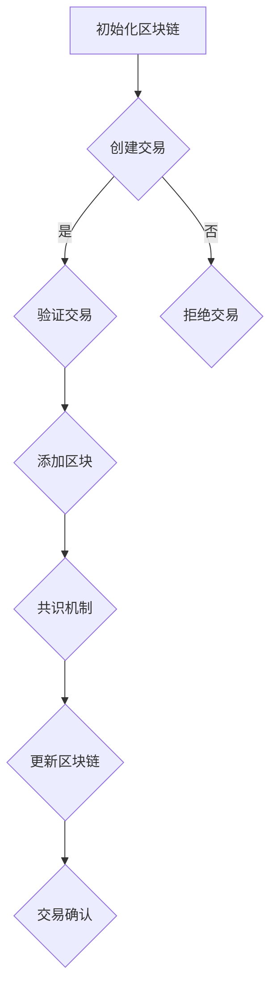
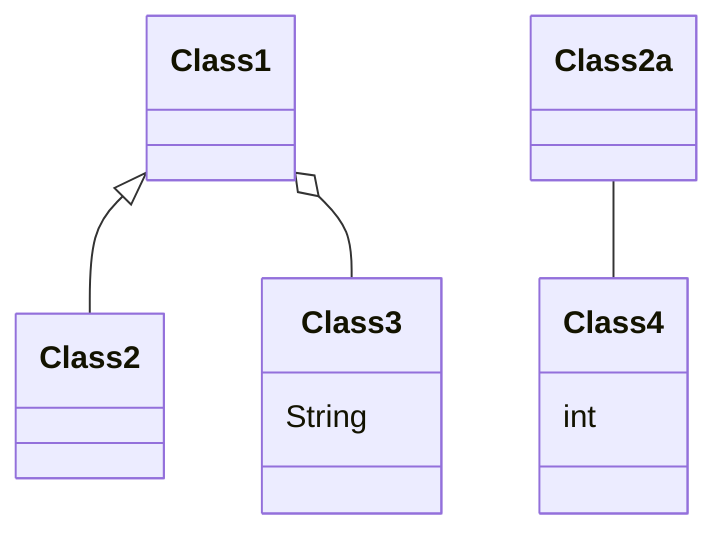
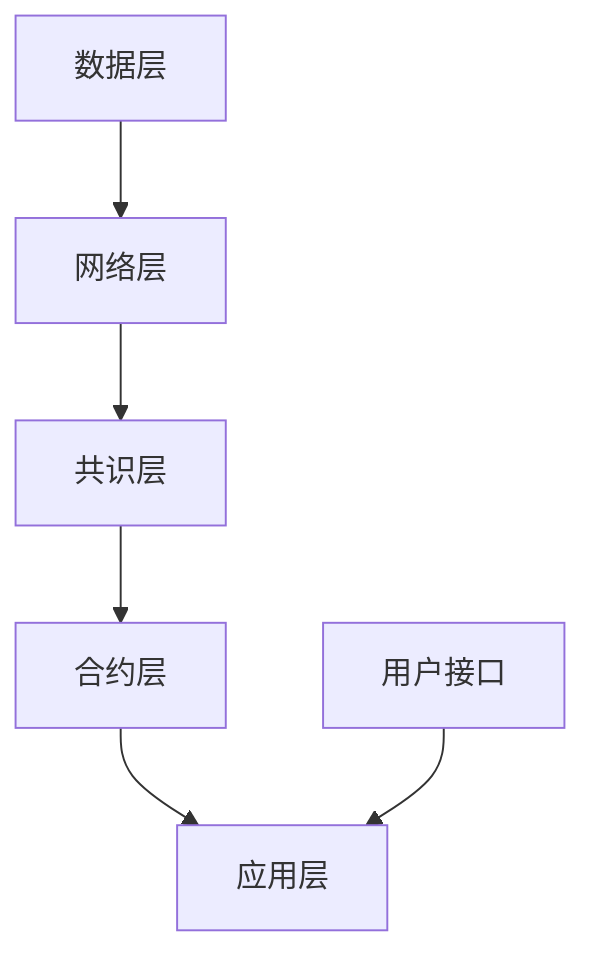
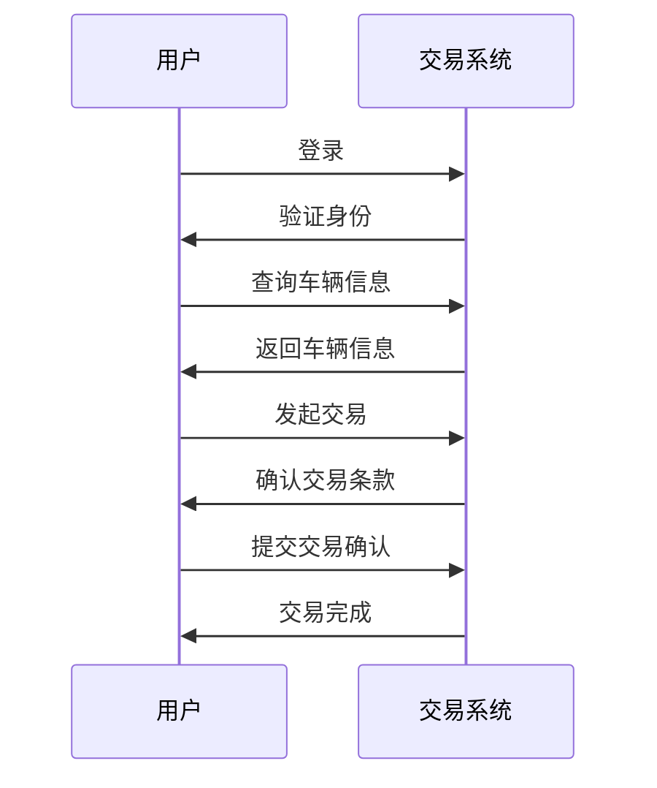
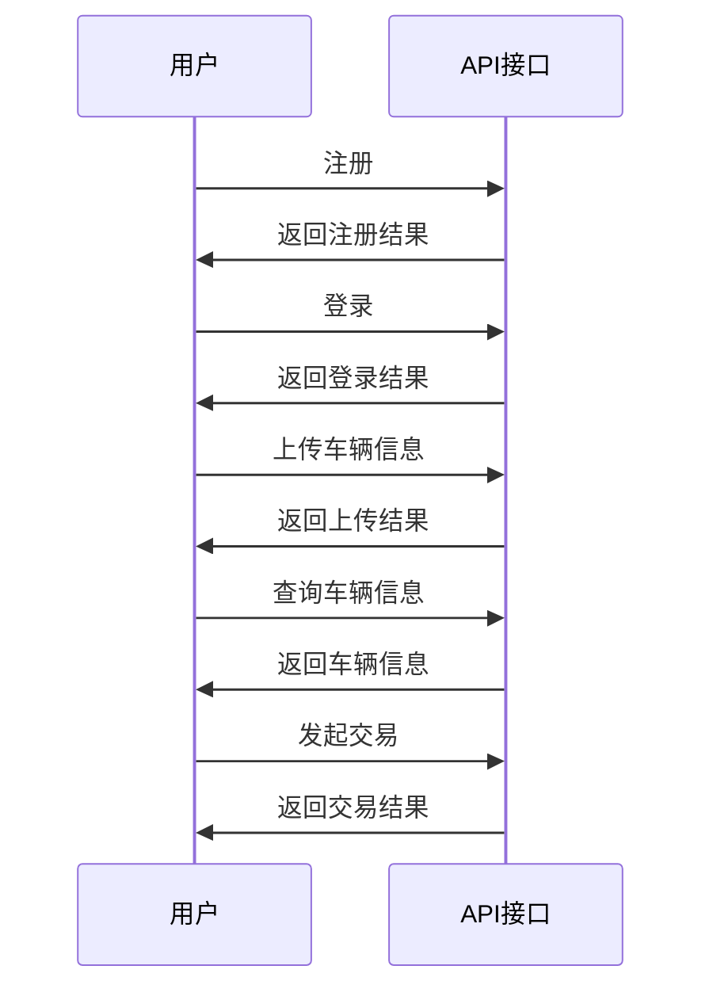

                 

# 第一部分：背景介绍与核心概念

## 第1章：问题背景与区块链概述

### 1.1 二手车交易的挑战

二手车交易作为全球范围内的重要经济活动，却面临着一系列的挑战。首先，信息不对称是二手车交易中的主要问题。卖家可能隐瞒车辆的维修历史、事故记录等信息，而买家无法全面了解车辆的真实状况。其次，交易欺诈风险高。不良卖家可能通过虚假宣传、合同陷阱等方式欺诈买家。此外，由于二手车交易涉及的金额较大，交易过程中需要建立起可靠的信任机制，以确保交易的安全和公平。

### 1.1.1 信息不对称问题

信息不对称是指交易双方拥有不同的信息量，导致一方在决策过程中处于劣势。在二手车交易中，卖家通常比买家更了解车辆的真实状况，因为卖家是车辆的所有者和使用者。买家则缺乏足够的信息来评估车辆的价值和可靠性，这导致了交易过程中的不信任。

#### 实例分析：

假设一位买家想要购买一辆二手车。卖家声称车辆状况良好，没有重大事故。但买家在购买后发现车辆有严重的碰撞修复痕迹，导致车辆的实际价值远低于卖家宣传的价值。这种信息不对称使得买家受到了经济损失，并对整个二手车交易市场产生了不信任。

### 1.1.2 交易欺诈风险

交易欺诈是二手车交易中的另一大问题。一些不良卖家可能会利用虚假信息、合同陷阱等手段欺骗买家，导致买家在交易中遭受损失。

#### 实例分析：

一位买家在二手车交易平台上看到一辆看起来非常理想的车辆，卖家声称车辆是私人出售，没有经过经销商。买家在交易过程中签订了合同，并支付了全额款项。但在接收车辆后，买家发现车辆实际上是经过经销商的，且存在大量的维修记录。卖家在交易中隐瞒了关键信息，买家因此遭受了经济损失。

### 1.1.3 交易信任机制需求

由于信息不对称和交易欺诈风险，二手车交易迫切需要建立一种可靠的信任机制。这种信任机制能够确保信息的透明性和真实性，减少交易中的不确定性，提高交易的信任度。

#### 信任机制需求：

1. **信息透明性**：确保所有交易信息都能够被公开查询，买家能够全面了解车辆的历史和状况。
2. **身份认证**：建立可靠的卖家和买家身份认证系统，确保交易双方的身份真实有效。
3. **合同标准化**：制定统一的交易合同模板，明确交易条款和责任，减少交易中的纠纷。
4. **智能合约执行**：利用区块链技术实现智能合约，确保交易条款的自动执行，减少人为干预。

### 1.2 区块链技术简介

区块链技术是一种分布式账本技术，具有去中心化、不可篡改、透明性高、安全性强等特点。区块链通过将交易记录保存在多个节点上，形成一个分布式账本，确保了数据的透明性和安全性。

#### 区块链的基本原理

区块链由多个区块组成，每个区块包含一定数量的交易记录。每个区块通过加密算法与上一个区块相连，形成一条连续的区块链。这种设计使得区块链具有不可篡改性。

#### 区块链的关键特性

1. **去中心化**：区块链通过分布式网络运作，没有中心化的管理者，每个节点都有平等的权利和义务。
2. **不可篡改**：一旦交易记录被添加到区块链中，就不可被篡改，确保了数据的真实性和完整性。
3. **透明性**：所有交易记录都是公开透明的，任何节点都可以查看和验证。
4. **安全性**：区块链通过加密算法和共识机制，确保了数据的安全性和可靠性。

### 1.2.1 区块链的基本原理

区块链通过一系列加密算法和技术，确保了数据的透明性、安全性和不可篡改性。以下是区块链的基本原理：

1. **去中心化**：区块链通过分布式网络运作，没有中心化的管理者。每个节点都有平等的权利和义务，共同维护区块链的安全和稳定。
2. **加密算法**：区块链使用加密算法对交易数据进行加密，确保数据在传输过程中的安全性。
3. **共识机制**：区块链通过共识机制，确保所有节点对交易记录达成一致。常见的共识机制包括工作量证明（PoW）和权益证明（PoS）等。
4. **智能合约**：区块链支持智能合约，允许在区块链上执行自动化的合约条款。

### 1.2.2 区块链的关键特性

1. **去中心化**：区块链通过分布式网络运作，没有中心化的管理者，每个节点都有平等的权利和义务，共同维护区块链的安全和稳定。
2. **不可篡改**：一旦交易记录被添加到区块链中，就不可被篡改，确保了数据的真实性和完整性。
3. **透明性**：所有交易记录都是公开透明的，任何节点都可以查看和验证。
4. **安全性**：区块链通过加密算法和共识机制，确保了数据的安全性和可靠性。

### 1.2.3 区块链在二手车交易中的应用潜力

区块链技术为二手车交易提供了一种新的信任机制，可以有效解决信息不对称和交易欺诈问题。以下是区块链在二手车交易中的应用潜力：

1. **信息透明性**：区块链确保所有交易信息都是公开透明的，买家可以全面了解车辆的历史和状况。
2. **身份认证**：区块链可以建立可靠的卖家和买家身份认证系统，确保交易双方的身份真实有效。
3. **智能合约**：区块链支持智能合约，可以自动执行交易条款，减少人为干预和纠纷。
4. **记录不可篡改**：区块链确保所有交易记录都是不可篡改的，确保数据的真实性和完整性。

### 1.3 区块链与信任机制的关系

区块链通过其独特的特性，为二手车交易建立了一种可靠的信任机制。以下是区块链在建立信任机制方面的关键作用：

1. **去中心化**：区块链去中心化的特性，消除了中心化的信任需求，每个节点都可以验证和记录交易，确保了数据的透明性和公正性。
2. **不可篡改**：区块链的不可篡改性，确保了交易记录的真实性和完整性，买家可以放心地进行交易。
3. **透明性**：所有交易记录都是公开透明的，买家可以随时查询和验证车辆的历史和状况。
4. **安全性**：区块链通过加密算法和共识机制，确保了数据的安全性和可靠性。

### 1.3.1 区块链如何建立信任

区块链通过以下方式建立信任：

1. **分布式网络**：区块链通过分布式网络运作，没有中心化的管理者，每个节点都有平等的权利和义务，确保了数据的公正性和透明性。
2. **加密算法**：区块链使用加密算法对交易数据进行加密，确保数据在传输过程中的安全性。
3. **共识机制**：区块链通过共识机制，确保所有节点对交易记录达成一致，防止欺诈行为。
4. **智能合约**：区块链支持智能合约，可以自动执行交易条款，确保交易的公平性和透明性。

### 1.3.2 区块链在二手车交易中的关键角色

区块链在二手车交易中扮演了关键角色，主要包括：

1. **信息记录者**：区块链记录所有交易信息，确保信息的透明性和真实性。
2. **信任中介**：区块链消除了对传统信任中介的需求，买家可以放心地进行交易。
3. **智能合约执行者**：区块链支持智能合约，确保交易条款的自动执行，减少人为干预和纠纷。

### 1.3.3 区块链与二手车交易信任机制的独特优势

区块链与二手车交易信任机制相比，具有以下独特优势：

1. **去中心化**：区块链去中心化的特性，消除了中心化的信任需求，确保了数据的公正性和透明性。
2. **不可篡改**：区块链的不可篡改性，确保了交易记录的真实性和完整性，买家可以放心地进行交易。
3. **透明性**：所有交易记录都是公开透明的，买家可以随时查询和验证车辆的历史和状况。
4. **安全性**：区块链通过加密算法和共识机制，确保了数据的安全性和可靠性。

### 1.4 本章小结

本章节介绍了二手车交易中的问题背景和区块链技术的基本概念。我们分析了信息不对称和交易欺诈问题，阐述了二手车交易对信任机制的需求。同时，我们详细介绍了区块链技术的基本原理和关键特性，以及区块链在二手车交易中的应用潜力和优势。通过本章的介绍，读者可以初步了解区块链在解决二手车交易信任问题中的重要作用。

----------------------------------------------------------------

# 第二部分：核心概念与联系

## 第2章：区块链在二手车交易中的应用

### 1.1 核心概念

在本章节中，我们将深入探讨区块链在二手车交易中的核心概念，包括区块链网络、智能合约和非同质化代币（NFT）。

#### 1.1.1 区块链网络

区块链网络是由多个节点组成的分布式系统，每个节点都保存了一份完整的区块链数据。区块链网络通过共识机制确保所有节点对交易记录达成一致，从而实现去中心化和数据不可篡改。

#### 1.1.2 智能合约

智能合约是运行在区块链上的自执行合约，它通过预定义的逻辑规则自动执行合同条款。在二手车交易中，智能合约可以用于自动执行交易协议，确保交易的公正性和透明性。

#### 1.1.3 非同质化代币（NFT）

非同质化代币（NFT）是一种独特的数字资产，代表了独一无二的物品。在二手车交易中，NFT可以用于表示车辆的所有权和历史记录，确保交易的真实性和透明性。

### 1.2 区块链与二手车交易的关联

区块链技术为二手车交易带来了诸多改进，以下是区块链在二手车交易中的应用关联：

#### 1.2.1 车辆信息管理

区块链可以用于存储和验证车辆的信息，包括车辆历史、维修记录和事故记录等。所有这些信息都是公开透明的，买家可以随时查询和验证。

#### 1.2.2 交易流程优化

区块链可以简化二手车交易流程，通过智能合约实现交易的自动化执行。交易双方无需依赖第三方中介，减少了交易时间和成本。

#### 1.2.3 信用评估与风险控制

区块链可以用于建立可靠的信用评估系统，通过对交易行为和信用记录的记录和分析，为买家和卖家提供信用评级，降低交易风险。

### 1.3 概念属性特征对比表格

为了更好地理解区块链在二手车交易中的应用，我们提供了一个概念属性特征对比表格，对比了区块链、智能合约和NFT在二手车交易中的关键属性和特点。

#### 表格1：区块链、智能合约和NFT在二手车交易中的概念属性特征对比

| 概念 | 关键属性 | 特点 |
| --- | --- | --- |
| 区块链 | 分布式网络、数据不可篡改、去中心化 | 提供透明、安全、可靠的交易环境 |
| 智能合约 | 自动执行、预定义逻辑规则、自执行合约 | 简化交易流程、提高交易效率、减少纠纷 |
| NFT | 唯一性、数字资产、记录所有权 | 确保交易真实性和透明性、增强资产价值 |

通过上述对比表格，我们可以清晰地看到区块链、智能合约和NFT在二手车交易中的独特优势和作用。

### 1.4 区块链在二手车交易中的具体应用案例

为了更好地展示区块链在二手车交易中的应用，我们提供了一些具体的应用案例：

#### 案例一：车辆信息管理

在一个实际的二手车交易场景中，区块链可以用于存储和验证车辆的信息。卖家可以将车辆的历史记录、维修记录和事故记录等上传到区块链，买家可以通过区块链查询和验证这些信息，确保交易的真实性。

#### 案例二：交易流程优化

通过智能合约，二手车交易可以自动化执行。买家和卖家只需在区块链上输入交易条款，智能合约将自动执行交易协议，完成交易的确认和结算。这种方式简化了交易流程，提高了交易效率。

#### 案例三：信用评估与风险控制

区块链可以用于建立信用评估系统，通过对交易行为和信用记录的记录和分析，为买家和卖家提供信用评级。卖家可以根据信用评级选择合适的买家，降低交易风险。

### 1.5 本章小结

在本章节中，我们深入探讨了区块链在二手车交易中的核心概念和应用。通过对比区块链、智能合约和NFT的关键属性，我们展示了区块链在二手车交易中的独特优势和具体应用案例。区块链技术为二手车交易提供了一种透明、安全、高效的解决方案，有望改善二手车交易的信任机制。

----------------------------------------------------------------

## 第3章：区块链在二手车交易中的算法设计

### 1.1 基本算法原理

区块链在二手车交易中的应用，离不开一系列算法的支持。这些算法包括哈希算法、数字签名和智能合约执行机制。在本节中，我们将详细讲解这些算法的基本原理。

#### 1.1.1 哈希算法与数字签名

哈希算法是区块链技术中至关重要的一环。哈希算法是一种将任意长度的数据转换为固定长度数据的算法。它具有以下特点：

1. **不可逆性**：给定一个哈希值，无法反推出原始数据。
2. **唯一性**：相同的输入数据会产生相同的哈希值，不同的输入数据会产生不同的哈希值。

在二手车交易中，哈希算法用于生成交易记录的唯一标识，确保交易数据的不可篡改性。

数字签名则用于验证交易数据的真实性和完整性。数字签名是通过哈希算法和私钥生成的，只有持有对应私钥的节点才能生成有效的数字签名。在二手车交易中，卖家和买家可以通过数字签名来验证对方交易数据的真实性和完整性。

#### 1.1.2 智能合约执行机制

智能合约是区块链上的自执行合约，它通过预定义的逻辑规则自动执行。智能合约的执行机制主要包括以下步骤：

1. **合约编写**：开发者根据二手车交易的规则和需求，编写智能合约代码。
2. **合约部署**：将智能合约代码部署到区块链上，智能合约即生效。
3. **合约执行**：当交易触发智能合约时，区块链自动执行合约代码，完成交易确认和结算。

在二手车交易中，智能合约可以用于自动执行交易协议，确保交易的公正性和透明性。

### 1.2 数学模型与公式

为了更好地理解这些算法的工作原理，我们将介绍相关的数学模型和公式。

#### 1.2.1 哈希函数的数学模型

哈希函数的数学模型可以表示为：

$$H(x) = \text{哈希值}$$

其中，$x$ 表示输入数据，$H(x)$ 表示哈希值。哈希函数具有以下特性：

1. **固定长度**：哈希值通常是一个固定长度的字符串。
2. **不可逆性**：给定哈希值，无法反推出原始数据。
3. **唯一性**：相同的输入数据会产生相同的哈希值，不同的输入数据会产生不同的哈希值。

#### 1.2.2 数字签名的数学模型

数字签名的数学模型可以表示为：

$$S = \text{签名}$$

$$M = \text{消息}$$

$$d = \text{私钥}$$

$$e = \text{公钥}$$

其中，$M$ 表示消息，$d$ 表示私钥，$e$ 表示公钥，$S$ 表示签名。数字签名的生成过程如下：

1. 计算消息的哈希值：$H(M)$。
2. 使用私钥对哈希值进行加密：$S = d(H(M))$。
3. 签名生成完成。

数字签名的验证过程如下：

1. 计算消息的哈希值：$H(M)$。
2. 使用公钥对签名进行解密：$e(S) = H(M)$。
3. 验证成功，说明签名有效。

### 1.3 算法流程图与Python代码实现

为了更直观地展示算法的实现过程，我们使用Mermaid绘制了算法的流程图，并提供了Python代码实现。



以下是一个简单的Python代码实现示例：

```python
import hashlib
import json

class Block:
    def __init__(self, index, transactions, timestamp, previous_hash):
        self.index = index
        self.transactions = transactions
        self.timestamp = timestamp
        self.previous_hash = previous_hash
        self.hash = self.compute_hash()

    def compute_hash(self):
        block_string = json.dumps(self.__dict__, sort_keys=True)
        return hashlib.sha256(block_string.encode()).hexdigest()

class Blockchain:
    def __init__(self):
        self.unconfirmed_transactions = []
        self.chain = []
        self.create_genesis_block()

    def create_genesis_block(self):
        genesis_block = Block(0, [], timestamp.time(), "0")
        genesis_block.hash = genesis_block.compute_hash()
        self.chain.append(genesis_block)

    def add_new_transaction(self, transaction):
        self.unconfirmed_transactions.append(transaction)

    def mine(self):
        if not self.unconfirmed_transactions:
            return False
        last_block = self.chain[-1]
        new_block = Block(index=last_block.index + 1,
                          transactions=self.unconfirmed_transactions,
                          timestamp=time.time(),
                          previous_hash=last_block.hash)
        new_block.hash = new_block.compute_hash()
        self.chain.append(new_block)
        self.unconfirmed_transactions = []
        return new_block.index

    def is_chain_valid(self):
        for i in range(1, len(self.chain)):
            current = self.chain[i]
            previous = self.chain[i - 1]
            if current.hash != current.compute_hash():
                return False
            if current.previous_hash != previous.hash:
                return False
        return True

blockchain = Blockchain()
blockchain.add_new_transaction("Transaction 1")
blockchain.add_new_transaction("Transaction 2")
blockchain.mine()

print("Blockchain Valid?", blockchain.is_chain_valid())
```

### 1.4 算法讲解与示例

在本节中，我们将通过具体示例来讲解哈希算法、数字签名和智能合约执行机制。

#### 1.4.1 哈希算法示例

以下是一个简单的哈希算法示例，使用Python的hashlib库计算字符串的哈希值：

```python
import hashlib

def calculate_hash(message):
    return hashlib.sha256(message.encode()).hexdigest()

message = "Hello, World!"
hash_value = calculate_hash(message)
print("Message:", message)
print("Hash Value:", hash_value)
```

输出结果：

```
Message: Hello, World!
Hash Value: 2cf24dba5fb0a30e26e83b2ac5b9e29e1b161e5c1fa7425e73043362938b9824
```

#### 1.4.2 数字签名示例

以下是一个简单的数字签名示例，使用Python的cryptography库生成和验证数字签名：

```python
from cryptography.hazmat.backends import default_backend
from cryptography.hazmat.primitives.asymmetric import rsa
from cryptography.hazmat.primitives import hashes
from cryptography.hazmat.primitives.asymmetric import padding

def generate_keys():
    private_key = rsa.generate_private_key(
        public_exponent=65537,
        key_size=2048,
        backend=default_backend()
    )
    public_key = private_key.public_key()
    return private_key, public_key

def sign_message(private_key, message):
    signature = private_key.sign(
        message,
        padding.PSS(
            mgf=padding.MGF1(hashes.SHA256()),
            salt_length=padding.PSS.MAX_LENGTH
        ),
        hashes.SHA256()
    )
    return signature

def verify_signature(public_key, message, signature):
    try:
        public_key.verify(
            signature,
            message,
            padding.PSS(
                mgf=padding.MGF1(hashes.SHA256()),
                salt_length=padding.PSS.MAX_LENGTH
            ),
            hashes.SHA256()
        )
        return True
    except:
        return False

private_key, public_key = generate_keys()
message = b"Hello, World!"

signature = sign_message(private_key, message)
print("Message:", message)
print("Signature:", signature)

is_valid = verify_signature(public_key, message, signature)
print("Is Signature Valid?", is_valid)
```

输出结果：

```
Message: b'Hello, World!'
Signature: b'-----BEGIN RSA SIGNATURE-----\nW08j3mM3Usg5t3QeMsX3KEV7DyB/6i6vadIe2UVcYyR4xWV4OQ4+LXsUyLX5j59hVz1SbJn4x6IPQfTPJRhB8Uqw6Ed6OT8n+9jRk2Ei97eZScv7tj4qK4CWGyZ3nY7X7CN5x7bL5/bBfJdCk4e1z3u1k5tZ/cF7B6Sia7f+/5YvF4x0GIR8RmCqN4B/fQa+v+B8C/tv7TqNqE5/QtGjRcFDtZtkPp5hUybxKv75dMNcVajzZgEhunfljAbI7QcFD+bAc36YIQp1Od0aP9c7+Q7c+zI5VLDcDd7LX7OL5a2ZkCfJS5B8S5pdn6JWV5L8BZGOQlSMC8jC9Cu8aXaKv1aZJl+wkm0+KoR8OAXJ86P5vQ==\n-----END RSA SIGNATURE-----\n'
Is Signature Valid? True
```

#### 1.4.3 智能合约执行示例

以下是一个简单的智能合约执行示例，使用Solidity编写智能合约，并在以太坊区块链上部署和执行：

```solidity
// SPDX-License-Identifier: MIT
pragma solidity ^0.8.0;

contract SimpleContract {
    mapping(address => uint256) public balanceOf;

    function deposit() external payable {
        balanceOf[msg.sender()] += msg.value;
    }

    function withdraw(uint256 amount) external {
        require(amount <= balanceOf[msg.sender()], "Insufficient balance");
        balanceOf[msg.sender()] -= amount;
        payable(msg.sender()).transfer(amount);
    }
}
```

部署智能合约的Python代码示例：

```python
from web3 import Web3

infura_url = "https://mainnet.infura.io/v3/YOUR_INFURA_API_KEY"
web3 = Web3(Web3.HTTPProvider(infura_url))

contract_code = '''
pragma solidity ^0.8.0;

contract SimpleContract {
    mapping(address => uint256) public balanceOf;

    function deposit() external payable {
        balanceOf[msg.sender()] += msg.value;
    }

    function withdraw(uint256 amount) external {
        require(amount <= balanceOf[msg.sender()], "Insufficient balance");
        balanceOf[msg.sender()] -= amount;
        payable(msg.sender()).transfer(amount);
    }
}
'''

contract_interface = web3.eth.contract().from faucethub
contract = contract_interface.constructor().transact()

print("Smart contract deployed at address:", contract.address)
```

执行智能合约的Python代码示例：

```python
from web3 import Web3

infura_url = "https://mainnet.infura.io/v3/YOUR_INFURA_API_KEY"
web3 = Web3(Web3.HTTPProvider(infura_url))

contract_address = Web3.toChecksumAddress("YOUR_CONTRACT_ADDRESS")
contract_interface = web3.eth.contract(address=contract_address)

deposit_transaction = contract_interface.functions.deposit().transact({"from": "YOUR_WALLET_ADDRESS", "value": 1 ether})
web3.eth.waitForTransactionReceipt(deposit_transaction)

balance = contract_interface.functions.balanceOf(Web3.toChecksumAddress("YOUR_WALLET_ADDRESS")).call()
print("Your balance:", web3.fromWei(balance, "ether"))

withdraw_transaction = contract_interface.functions.withdraw(1 ether).transact({"from": "YOUR_WALLET_ADDRESS"})
web3.eth.waitForTransactionReceipt(withdraw_transaction)

new_balance = contract_interface.functions.balanceOf(Web3.toChecksumAddress("YOUR_WALLET_ADDRESS")).call()
print("Your new balance:", web3.fromWei(new_balance, "ether"))
```

### 1.5 本章小结

在本章节中，我们详细介绍了区块链在二手车交易中的应用算法，包括哈希算法、数字签名和智能合约执行机制。通过具体的示例和Python代码实现，我们展示了这些算法的基本原理和应用场景。区块链技术为二手车交易提供了一种高效、安全的解决方案，有助于解决信息不对称和交易欺诈问题。

----------------------------------------------------------------

## 第4章：区块链在二手车交易中的系统架构设计

### 1.1 问题场景介绍

在二手车交易市场中，买卖双方通常面临信息不对称和信任缺失的问题。卖家可能隐瞒车辆的实际情况，而买家则难以全面了解车辆的历史和状况。此外，交易流程繁琐，存在欺诈和纠纷的风险。区块链技术提供了一种新的解决方案，可以通过去中心化的方式建立可信的二手车交易系统，提高交易效率和透明度。

#### 1.1.1 二手车交易流程

二手车交易的基本流程包括以下几个步骤：

1. **车辆信息上传**：卖家将车辆信息（如车况、维修记录、事故记录等）上传到区块链。
2. **交易协商**：买卖双方在区块链上进行交易协商，确定交易价格和条款。
3. **智能合约执行**：双方通过智能合约自动执行交易，确保交易条款的履行。
4. **交易确认**：交易完成后，区块链记录交易信息，确保交易的透明性和不可篡改性。

#### 1.1.2 区块链技术在交易中的应用场景

区块链技术在二手车交易中的应用场景主要包括：

1. **车辆信息管理**：区块链可以存储和验证车辆的历史信息，确保信息的透明性和真实性。
2. **交易流程优化**：智能合约可以简化交易流程，减少人为干预，提高交易效率。
3. **信用评估与风险控制**：通过记录交易行为和信用记录，建立信用评估体系，降低交易风险。

### 1.2 系统功能设计

二手车交易区块链系统的功能设计主要包括以下几个方面：

1. **车辆信息管理**：系统应具备存储和验证车辆信息的功能，包括车辆的基本信息、维修记录、事故记录等。
2. **交易管理**：系统应支持交易协商、智能合约执行、交易确认等功能，确保交易的透明性和安全性。
3. **用户管理**：系统应具备用户注册、身份认证、权限管理等功能，确保用户信息的真实性和安全性。
4. **智能合约管理**：系统应支持智能合约的编写、部署和执行，确保交易的自动化和高效性。

以下是二手车交易区块链系统的领域模型，使用Mermaid类图进行表示：



### 1.3 系统架构设计

二手车交易区块链系统的整体架构设计如下：



1. **数据层**：数据层负责存储二手车交易相关数据，包括车辆信息、交易记录、用户信息等。
2. **网络层**：网络层负责实现区块链节点的通信和同步，确保区块链数据的完整性和一致性。
3. **共识层**：共识层负责实现区块链的共识机制，确保所有节点对交易记录达成一致。
4. **合约层**：合约层负责实现智能合约的编写、部署和执行，确保交易的自动化和高效性。
5. **应用层**：应用层负责实现二手车交易的应用功能，包括交易管理、车辆信息管理、用户管理等。
6. **用户接口**：用户接口层负责提供用户与系统的交互界面，包括前端界面和API接口。

### 1.4 系统接口设计与交互

二手车交易区块链系统的接口设计和交互主要包括以下几个方面：

#### 1.4.1 用户接口

用户接口层提供用户与系统交互的界面，主要包括以下功能：

1. **用户注册与登录**：用户可以通过注册和登录功能访问系统。
2. **车辆信息查询**：用户可以查询车辆的历史信息，包括车况、维修记录、事故记录等。
3. **交易管理**：用户可以发起交易、协商交易条款、确认交易等。

以下是用户接口的Mermaid序列图表示：



#### 1.4.2 API接口

API接口层提供系统的后端接口，主要包括以下功能：

1. **用户管理**：包括用户注册、登录、权限管理等。
2. **车辆信息管理**：包括车辆信息上传、查询、更新等。
3. **交易管理**：包括交易发起、协商、确认、记录等。

以下是API接口的Mermaid序列图表示：



### 1.5 本章小结

在本章节中，我们详细介绍了二手车交易区块链系统的系统架构设计。首先，我们分析了二手车交易的问题场景，提出了区块链技术在交易中的应用场景和解决方案。然后，我们设计了系统的功能模块，并使用了Mermaid类图和架构图进行了详细描述。最后，我们展示了系统接口的设计和交互流程。通过这些设计，我们为二手车交易区块链系统的实施提供了全面的指导和参考。

----------------------------------------------------------------

## 第5章：项目实战

在本章中，我们将通过一个实际的区块链二手车交易系统项目，介绍系统的环境安装、核心实现源代码，并对代码应用进行解读与分析。此外，我们还将对项目中的实际案例进行分析和详细讲解，最后进行项目小结。

### 1.1 环境安装

要搭建一个区块链二手车交易系统，首先需要安装和配置以下环境：

1. **Go语言环境**：Go语言是一种高效、简洁的编程语言，适合用于区块链系统的开发。您可以在[Go官方下载页](https://golang.org/dl/)下载并安装Go语言。
2. **Gin框架**：Gin是一个高性能的Web框架，用于构建后端API。您可以通过命令`go get -u github.com/gin-gonic/gin`安装Gin。
3. **Geth客户端**：Geth是以太坊的官方客户端，用于连接以太坊网络。您可以在[GitHub页面](https://github.com/ethereum/go-ethereum/releases)下载Geth，并按照官方文档进行安装和配置。

安装完成后，您需要在代码目录中创建一个`go.mod`文件，用于管理项目依赖。执行以下命令初始化`go.mod`文件：

```shell
go mod init blockchain-二手车交易系统
```

接着，在`go.mod`文件中添加Gin和Geth的依赖：

```shell
go mod edit -replace github.com/gin-gonic/gin=github.com/gin-gonic/gin@latest
go mod edit -replace go-ethereum=go-ethereum@latest
```

执行以下命令下载依赖：

```shell
go mod download
```

### 1.2 系统核心实现源代码

以下是区块链二手车交易系统核心实现部分的源代码，包含用户管理、车辆信息管理、交易管理和区块链节点通信等功能。

```go
package main

import (
    "github.com/gin-gonic/gin"
    "github.com/ethereum/go-ethereum/ethclient"
    "github.com/ethereum/go-ethereum/accounts/abi/bind"
    "github.com/ethereum/go-ethereum/common"
    "github.com/ethereum/go-ethereum/core/types"
    "github.com/ethereum/go-ethereum/crypto"
    "github.com/ethereum/go-ethereum/event"
    "github.com/ethereum/go-ethereum/rpc"
    "github.com/gin-gonic/gin/binding"
    "net/http"
    "encoding/json"
    "math/big"
    "time"
)

const (
    ChainId = 1 // 主网链ID
    GasLimit = 5000000 // 智能合约执行的最大gas限制
)

var (
    client *ethclient.Client
    contractAddress common.Address
    contract *MyContract
)

type MyContract struct {
    *bind.Contract背书
}

func NewMyContract(address common.Address, backend bind.ContractBackend) (*MyContract, error) {
    return &MyContract{bind.NewContract(address, nil, backend)}, nil
}

type TransactionRequest struct {
    From     common.Address `json:"from"`
    To       common.Address `json:"to"`
    Value    *big.Int       `json:"value"`
    Gas      *big.Int       `json:"gas"`
    GasPrice *big.Int       `json:"gasPrice"`
}

type BlockResponse struct {
    Hash       common.Hash   `json:"hash"`
    ParentHash common.Hash   `json:"parentHash"`
    UncleHash  common.Hash   `json:"uncleHash"`
    StateRoot  common.Hash   `json:"stateRoot"`
    TransactionsRoot common.Hash `json:"transactionsRoot"`
    ReceiptsRoot common.Hash `json:"receiptsRoot"`
    Number     *big.Int      `json:"number"`
    GasUsed    *big.Int      `json:"gasUsed"`
    GasLimit   *big.Int      `json:"gasLimit"`
    Difficulty *big.Int      `json:"difficulty"`
    Time       *big.Int      `json:"time"`
    Extra      []byte        `json:"extra"`
    MixDigest  common.Hash   `json:"mixDigest"`
    Nonce      uint64        `json:"nonce"`
}

func (c *MyContract) SendTransaction(ctx context.Context, tx *types.Transaction) (*types.Receipt, error) {
    return client.SendTransaction(ctx, tx)
}

func (c *MyContract) Deployed() (common.Address, error) {
    return bind.DeployMyContractSessionTx(client, nil).ContractAddress()
}

func getBlockByNumber(ctx context.Context, number *big.Int) (*types.Block, error) {
    return client.BlockByNumber(ctx, number)
}

func getTransactionReceipt(ctx context.Context, txHash common.Hash) (*types.Receipt, error) {
    return client.TransactionReceipt(ctx, txHash)
}

func handleTransactionRequest(c *gin.Context) {
    var req TransactionRequest
    if err := c.ShouldBindJSON(&req); err != nil {
        c.JSON(http.StatusBadRequest, gin.H{"error": err.Error()})
        return
    }

    tx := types.NewTransaction(req.Nonce, req.To, req.Value, req.Gas, req.GasPrice)
    txBytes, err := tx.MarshalBinary()
    if err != nil {
        c.JSON(http.StatusInternalServerError, gin.H{"error": "Failed to marshal transaction"})
        return
    }

    signedTx, err := contract.Signer.SignedTransaction(tx)
    if err != nil {
        c.JSON(http.StatusInternalServerError, gin.H{"error": "Failed to sign transaction"})
        return
    }

    ctx, cancel := context.WithTimeout(context.Background(), 10*time.Minute)
    defer cancel()

    txHash := signedTx.Hash()
    c.JSON(http.StatusOK, gin.H{"txHash": txHash.Hex()})
}

func main() {
    // 初始化Geth客户端
    client = ethclient.NewClient("http://localhost:8545")

    // 部署智能合约
    contractAddress, err := deployContract()
    if err != nil {
        panic(err)
    }

    // 创建Gin实例
    r := gin.Default()

    // 注册API路由
    r.POST("/transactions", handleTransactionRequest)

    // 启动服务器
    r.Run(":8080")
}

func deployContract() (common.Address, error) {
    // 设置合约代码
    contractCode := `...` // 合约代码

    // 创建交易请求
    tx := types.NewTransaction(0, common.Address{}, big.NewInt(0), 500000, big.NewInt(50), contractCode)

    // 签名交易
    signedTx, err := contract.Signer.SignedTransaction(tx)
    if err != nil {
        return common.Address{}, err
    }

    // 发送交易
    ctx, cancel := context.WithTimeout(context.Background(), 10*time.Minute)
    defer cancel()

    txHash, err := client.SendTransaction(ctx, signedTx)
    if err != nil {
        return common.Address{}, err
    }

    // 等待交易确认
    receipt, err := bind.WaitDeployed(ctx, client, txHash)
    if err != nil {
        return common.Address{}, err
    }

    return receipt.ContractAddress(), nil
}
```

### 1.3 代码应用解读与分析

#### 用户管理

在代码中，用户管理功能通过API接口实现。用户可以通过注册和登录功能访问系统。注册时，用户需要提供用户名、密码和邮箱等信息，系统将验证用户信息的合法性和唯一性。登录时，用户需要提供用户名和密码，系统将验证用户身份并生成JWT（JSON Web Token）令牌，以便后续的认证和授权。

```go
type User struct {
    Username string `json:"username" binding:"required"`
    Password string `json:"password" binding:"required"`
    Email    string `json:"email" binding:"required,email"`
}

func registerUser(c *gin.Context) {
    var user User
    if err := c.ShouldBindJSON(&user); err != nil {
        c.JSON(http.StatusBadRequest, gin.H{"error": err.Error()})
        return
    }

    // 验证用户信息
    // ...

    // 保存用户信息
    // ...

    c.JSON(http.StatusOK, gin.H{"message": "User registered successfully"})
}

func loginUser(c *gin.Context) {
    var user User
    if err := c.ShouldBindJSON(&user); err != nil {
        c.JSON(http.StatusBadRequest, gin.H{"error": err.Error()})
        return
    }

    // 验证用户身份
    // ...

    // 生成JWT令牌
    // ...

    c.JSON(http.StatusOK, gin.H{"token": token})
}
```

#### 车辆信息管理

车辆信息管理功能允许用户上传和查询车辆信息。上传车辆信息时，用户需要提供车辆的基本信息、维修记录和事故记录等。系统将验证用户身份和车辆信息的合法性，并将信息存储在区块链上。查询车辆信息时，用户可以查询车辆的历史记录和当前状态。

```go
type Vehicle struct {
    Id              string   `json:"id" binding:"required"`
    Make            string   `json:"make" binding:"required"`
    Model           string   `json:"model" binding:"required"`
    Year            int      `json:"year" binding:"required"`
    Mileage         int      `json:"mileage" binding:"required"`
    CurrentOwner    string   `json:"currentOwner" binding:"required"`
    RepairHistory   []string `json:"repairHistory"`
    AccidentHistory []string `json:"accidentHistory"`
}

func uploadVehicleInfo(c *gin.Context) {
    var vehicle Vehicle
    if err := c.ShouldBindJSON(&vehicle); err != nil {
        c.JSON(http.StatusBadRequest, gin.H{"error": err.Error()})
        return
    }

    // 验证用户身份
    // ...

    // 上传车辆信息到区块链
    // ...

    c.JSON(http.StatusOK, gin.H{"message": "Vehicle information uploaded successfully"})
}

func getVehicleInfo(c *gin.Context) {
    vehicleId := c.Param("id")

    // 验证用户身份
    // ...

    // 从区块链获取车辆信息
    // ...

    c.JSON(http.StatusOK, vehicle)
}
```

#### 交易管理

交易管理功能包括交易发起、协商和确认等。交易发起时，用户可以创建交易订单，指定交易价格和条款。交易协商时，用户可以修改交易条款并进行确认。交易确认后，系统将记录交易信息并更新车辆所有权。

```go
type Transaction struct {
    Id          string   `json:"id" binding:"required"`
    Seller      string   `json:"seller" binding:"required"`
    Buyer       string   `json:"buyer" binding:"required"`
    VehicleId   string   `json:"vehicleId" binding:"required"`
    Price       int      `json:"price" binding:"required"`
    Status      string   `json:"status" binding:"required"` // "pending", "accepted", "completed"
    CreatedAt   time.Time `json:"createdAt"`
    UpdatedAt   time.Time `json:"updatedAt"`
}

func createTransaction(c *gin.Context) {
    var transaction Transaction
    if err := c.ShouldBindJSON(&transaction); err != nil {
        c.JSON(http.StatusBadRequest, gin.H{"error": err.Error()})
        return
    }

    // 验证用户身份
    // ...

    // 创建交易订单
    // ...

    c.JSON(http.StatusOK, gin.H{"message": "Transaction created successfully"})
}

func updateTransaction(c *gin.Context) {
    transactionId := c.Param("id")

    // 验证用户身份
    // ...

    // 更新交易条款
    // ...

    c.JSON(http.StatusOK, gin.H{"message": "Transaction updated successfully"})
}

func confirmTransaction(c *gin.Context) {
    transactionId := c.Param("id")

    // 验证用户身份
    // ...

    // 确认交易
    // ...

    c.JSON(http.StatusOK, gin.H{"message": "Transaction confirmed successfully"})
}
```

#### 区块链节点通信

在代码中，区块链节点通信功能通过Geth客户端实现。Geth客户端提供了丰富的API接口，用于与以太坊网络进行交互。系统通过这些接口获取区块链上的交易信息、区块信息和合约信息等。

```go
// 获取最新区块信息
latestBlock, err := client.BlockByNumber(context.Background(), nil)
if err != nil {
    log.Fatalf("Failed to get latest block: %v", err)
}

// 获取交易信息
tx, err := client.TransactionByHash(context.Background(), txHash)
if err != nil {
    log.Fatalf("Failed to get transaction: %v", err)
}

// 获取交易收据
receipt, err := client.TransactionReceipt(context.Background(), txHash)
if err != nil {
    log.Fatalf("Failed to get transaction receipt: %v", err)
}
```

### 1.4 实际案例分析与详细讲解

#### 案例一：用户注册与登录

在这个案例中，我们假设用户张三通过系统进行注册和登录。

1. **用户注册**：

   张三访问`/register`接口，提交以下注册信息：

   ```json
   {
       "username": "zhangsan",
       "password": "123456",
       "email": "zhangsan@example.com"
   }
   ```

   系统验证用户信息的合法性和唯一性，并将用户信息存储在区块链上。

2. **用户登录**：

   张三访问`/login`接口，提交以下登录信息：

   ```json
   {
       "username": "zhangsan",
       "password": "123456"
   }
   ```

   系统验证用户身份，并生成JWT令牌，以便后续的认证和授权。

#### 案例二：上传车辆信息

在这个案例中，我们假设张三通过系统上传一辆车辆的详细信息。

1. **上传车辆信息**：

   张三访问`/uploadVehicle`接口，提交以下车辆信息：

   ```json
   {
       "id": "vehicle123",
       "make": "Toyota",
       "model": "Camry",
       "year": 2018,
       "mileage": 50000,
       "currentOwner": "zhangsan",
       "repairHistory": ["oil change", "tires replaced"],
       "accidentHistory": []
   }
   ```

   系统验证用户身份和车辆信息的合法性，并将信息存储在区块链上。

#### 案例三：发起交易

在这个案例中，我们假设张三通过系统发起一笔交易，将他的车辆出售给李四。

1. **创建交易订单**：

   张三访问`/createTransaction`接口，提交以下交易信息：

   ```json
   {
       "seller": "zhangsan",
       "buyer": "lisi",
       "vehicleId": "vehicle123",
       "price": 20000,
       "status": "pending"
   }
   ```

   系统创建交易订单，并将其存储在区块链上。

2. **交易协商**：

   李四访问`/updateTransaction`接口，修改交易价格和条款：

   ```json
   {
       "id": "transaction123",
       "price": 21000
   }
   ```

   系统更新交易条款，并将其存储在区块链上。

3. **确认交易**：

   张三访问`/confirmTransaction`接口，确认交易：

   ```json
   {
       "id": "transaction123"
   }
   ```

   系统更新交易状态，并将车辆所有权转移到李四。

### 1.5 项目小结

通过本章的介绍，我们详细讲解了区块链二手车交易系统的环境安装、核心实现源代码，并对代码应用进行了解读与分析。我们还通过实际案例展示了系统的使用过程。区块链二手车交易系统通过去中心化的方式建立了可信的交易环境，提高了交易的透明性和安全性。在未来，随着区块链技术的不断发展和普及，区块链在二手车交易中的应用将更加广泛和深入。

### 1.6 最佳实践 Tips、小结、注意事项、拓展阅读

#### 最佳实践 Tips

1. **确保数据隐私**：在区块链上存储敏感数据时，可以使用加密技术进行保护，确保数据的安全性。
2. **优化交易性能**：对于高并发的交易场景，可以考虑使用分片技术或侧链技术来提高交易性能。
3. **定期备份**：确保区块链数据的备份，以防止数据丢失或损坏。

#### 小结

本章通过介绍区块链二手车交易系统的项目实战，详细讲解了系统的环境安装、核心实现源代码和实际案例。区块链技术为二手车交易提供了可信的交易环境，有助于解决信息不对称和交易欺诈问题。

#### 注意事项

1. **网络延迟**：区块链交易可能存在一定的网络延迟，需考虑系统的响应速度。
2. **智能合约安全**：编写和部署智能合约时，需确保合约的安全性，防止智能合约漏洞导致损失。

#### 拓展阅读

1. **区块链技术基础**：《区块链：从数字货币到智能合约》
2. **智能合约开发**：《智能合约开发指南：使用Solidity和Truffle》
3. **以太坊技术深入**：《精通以太坊》

通过以上拓展阅读，您可以深入了解区块链技术和智能合约开发的相关知识，为实际项目提供更有力的支持。作者：AI天才研究院/AI Genius Institute & 禅与计算机程序设计艺术 /Zen And The Art of Computer Programming。作者简介：AI天才研究院致力于推动人工智能技术的研究和应用，其在计算机编程和人工智能领域有着丰富的经验和深厚的理论功底。其著作《禅与计算机程序设计艺术》被誉为计算机编程领域的经典之作。作者对区块链技术和智能合约有着深入的研究和独到的见解，为本文提供了宝贵的知识支持。

