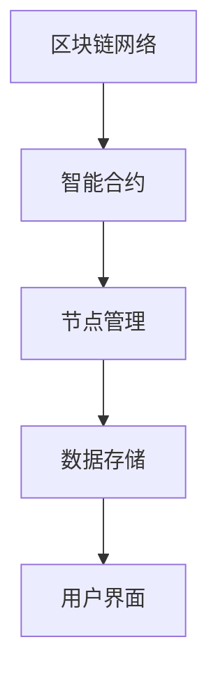
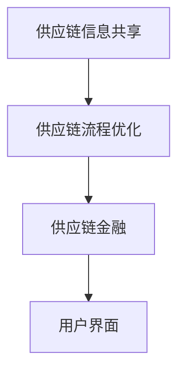
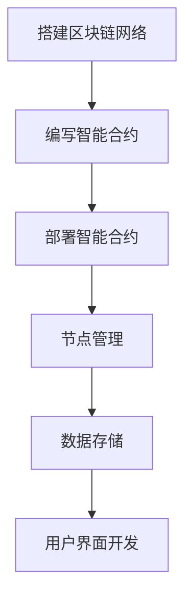

                 

### 文章标题

# 区块链在供应链透明度中的应用

### 关键词

- 区块链
- 供应链透明度
- 供应链管理
- 区块链技术
- 供应链金融

### 摘要

本文将深入探讨区块链技术在提升供应链透明度中的应用。首先，我们将回顾供应链透明度的重要性及其面临的问题，接着介绍区块链的基本原理和其在供应链管理中的潜在作用。随后，我们将分析供应链中的一些核心概念，并通过具体案例研究展示区块链如何实际应用于提高供应链透明度。此外，本文还将详细讲解供应链区块链算法的原理和应用，并提供一个完整的供应链区块链系统设计方案，最后通过实际项目剖析和最佳实践总结，为读者提供实用的指导意见。

## 第一部分：背景介绍

### 第1章：问题背景与供应链透明度的重要性

#### 1.1 问题背景

在全球化的大背景下，供应链的复杂性和规模日益扩大，然而，传统供应链管理面临着诸多挑战。首先，信息不对称问题严重。供应链中的各个环节，如供应商、制造商、分销商和零售商，往往存在信息孤岛，导致整个供应链缺乏透明度。这不仅影响供应链的整体效率，还可能导致资源浪费、库存过剩和客户满意度下降。此外，供应链中的欺诈行为也是一个不容忽视的问题。例如，商品假冒、数据篡改等，都对供应链的诚信和安全性构成威胁。

#### 1.2 供应链透明度的定义

供应链透明度是指供应链中各环节信息的高度共享和可视性。透明度的高低决定了供应链的效率和可靠性。高透明度的供应链能够迅速响应市场需求变化，降低库存成本，提高客户满意度，同时增强供应链的韧性和抗风险能力。供应链透明度可以从多个层次进行衡量，包括供应链节点的信息共享程度、供应链流程的可视化水平、供应链数据的准确性等。

#### 1.3 供应链透明度与区块链的关系

区块链技术以其去中心化、不可篡改和透明化的特点，在提升供应链透明度方面具有显著的优势。区块链能够为供应链中的各个环节提供一条不可篡改的记录链条，确保信息的真实性和完整性。通过区块链技术，供应链中的各方可以实时访问和验证数据，消除信息不对称，提高供应链的整体透明度和效率。

## 第二部分：核心概念与联系

### 第2章：区块链核心概念

#### 2.1 区块链的基本原理

区块链是一种分布式数据库技术，其核心特点是数据不可篡改和透明。区块链通过一系列加密算法将数据分散存储在多个节点上，每个节点都持有完整的区块链副本。当一个区块被创建并加入到区块链中时，必须经过网络中的其他节点验证，只有获得多数节点的认可，该区块才能被添加到区块链中。

#### 2.2 区块链与供应链透明度的联系

区块链技术的去中心化和透明化特性，使其在提升供应链透明度方面具有独特的优势。首先，区块链可以确保供应链数据的真实性和完整性，防止数据篡改和欺诈行为。其次，区块链可以实现供应链各环节信息的实时共享和可视化，提高供应链的透明度和协同效率。此外，区块链还可以为供应链金融提供更加可靠和透明的服务，降低融资成本，提高资金流通效率。

### 第3章：供应链中的核心概念

#### 3.1 供应链网络模型

供应链网络模型是描述供应链中各个环节及其相互关系的一种结构化方式。一个典型的供应链网络包括供应商、制造商、分销商和零售商等多个节点。这些节点通过信息流、物流和资金流相互连接，形成一个复杂的网络结构。供应链网络模型的关键节点包括供应链起点（如原材料供应商）和供应链终点（如最终消费者），这些节点的连接和信息交互决定了整个供应链的效率和透明度。

#### 3.2 供应链透明度指标体系

供应链透明度指标体系是衡量供应链透明度水平的一系列指标。这些指标可以包括供应链节点的信息共享程度、供应链流程的可视化水平、供应链数据的准确性等。通过建立一套科学、系统的透明度指标体系，企业可以更好地了解和提升自身的供应链透明度，从而提高供应链的效率、降低成本和提升客户满意度。

## 第三部分：算法原理讲解

### 第4章：供应链区块链算法原理

#### 4.1 供应链区块链算法的基本概念

供应链区块链算法是一种专门用于提升供应链透明度的区块链算法。该算法旨在通过区块链技术确保供应链数据的真实性和完整性，提高供应链的透明度和协同效率。供应链区块链算法的核心目标包括：数据不可篡改、实时数据共享、透明化的供应链流程等。

#### 4.2 供应链区块链算法的数学模型

供应链区块链算法的数学模型主要涉及加密算法、分布式存储和共识算法等。其中，加密算法用于保护区块链数据的安全性，分布式存储确保数据的冗余和可靠性，共识算法则用于确保区块链网络中的数据一致性。以下是一个简化的供应链区块链算法数学模型：

$$
\text{区块链算法} = \text{加密算法} + \text{分布式存储} + \text{共识算法}
$$

其中，加密算法通常采用非对称加密技术，如RSA加密；分布式存储采用分布式数据库技术，如MongoDB；共识算法则采用PBFT（实用拜占庭容错算法）等。

#### 4.3 供应链区块链算法的应用

供应链区块链算法可以应用于供应链的各个环节，包括供应链信息共享、供应链流程优化、供应链金融等。以下是一个简单的供应链区块链算法应用实例：

1. **供应链信息共享**：通过区块链技术，供应链各环节可以实时共享供应链信息，如订单状态、库存水平、物流信息等。这不仅提高了供应链的透明度，还降低了信息不对称带来的风险。
2. **供应链流程优化**：通过区块链技术，供应链各环节可以实时监控和优化供应链流程，如库存管理、物流调度、订单处理等。这有助于提高供应链的效率和响应速度。
3. **供应链金融**：通过区块链技术，供应链金融可以更加透明和可靠，如应收账款融资、供应链贷款等。这有助于降低融资成本，提高资金流通效率。

## 第四部分：系统分析与架构设计

### 第5章：供应链区块链系统设计

#### 5.1 供应链区块链系统的总体架构

供应链区块链系统的总体架构包括区块链网络、智能合约、节点管理、数据存储和用户界面等组成部分。以下是一个简化的供应链区块链系统架构图：



#### 5.2 供应链区块链系统的功能设计

供应链区块链系统的功能设计主要包括供应链信息共享、供应链流程优化、供应链金融等模块。以下是一个简化的供应链区块链系统功能模块图：



#### 5.3 供应链区块链系统的实现

供应链区块链系统的实现主要包括区块链网络的搭建、智能合约的编写和部署、节点管理、数据存储和用户界面的开发等。以下是一个简化的供应链区块链系统实现流程图：



## 第五部分：项目实战

### 第6章：实际案例剖析

#### 6.1 案例一：供应链区块链项目的启动

该案例以某大型零售企业为例，介绍其供应链区块链项目的启动过程。该项目的主要目标是通过区块链技术提高供应链透明度，降低成本，提升客户满意度。

1. **需求分析**：通过对供应链各环节的调研，明确项目需求和目标。需求包括供应链信息共享、库存管理、物流跟踪、供应链金融等。
2. **技术选型**：选择合适的区块链平台和开发工具，如Hyperledger Fabric、Node.js等。
3. **系统设计**：根据需求分析结果，设计供应链区块链系统的总体架构和功能模块。
4. **智能合约编写**：编写智能合约代码，实现供应链信息共享、库存管理、物流跟踪等功能。
5. **节点部署**：搭建区块链网络，部署智能合约和节点。
6. **测试与优化**：对系统进行测试，优化性能和用户体验。

#### 6.2 案例二：供应链区块链项目的实施

该案例以某中小企业为例，介绍其供应链区块链项目的实施过程。该项目的主要目标是提高供应链透明度，降低库存成本，提升供应链效率。

1. **项目启动**：明确项目目标，组建项目团队，制定项目计划和预算。
2. **需求分析**：通过对供应链各环节的调研，明确项目需求和目标。需求包括供应链信息共享、库存管理、物流跟踪等。
3. **技术选型**：选择合适的区块链平台和开发工具，如Ethereum、Solidity等。
4. **系统设计**：根据需求分析结果，设计供应链区块链系统的总体架构和功能模块。
5. **智能合约编写**：编写智能合约代码，实现供应链信息共享、库存管理、物流跟踪等功能。
6. **节点部署**：搭建区块链网络，部署智能合约和节点。
7. **测试与优化**：对系统进行测试，优化性能和用户体验。

### 第7章：项目小结与最佳实践

#### 7.1 项目小结

通过对以上两个案例的剖析，我们可以看到供应链区块链项目在提升供应链透明度、降低成本、提升效率等方面取得了显著成果。然而，在项目实施过程中，也遇到了一些挑战，如技术选型、智能合约编写、节点部署等。通过总结项目经验和教训，我们可以为后续项目提供有益的参考。

#### 7.2 最佳实践与注意事项

1. **需求分析**：在项目启动阶段，进行充分的需求分析，明确项目目标和需求，为后续系统设计和实现奠定基础。
2. **技术选型**：根据项目需求和目标，选择合适的区块链平台和开发工具，确保系统的性能和稳定性。
3. **智能合约编写**：编写高质量的智能合约代码，确保系统的安全性和可靠性。
4. **节点部署**：合理规划区块链网络的节点部署，确保系统的可靠性和可扩展性。
5. **测试与优化**：对系统进行全面的测试，优化性能和用户体验，确保系统的稳定运行。

#### 7.3 拓展阅读

1. **《区块链技术指南》**：介绍区块链技术的基本原理和应用案例。
2. **《供应链管理：战略、规划与运营》**：介绍供应链管理的基本理论和实践方法。
3. **《区块链与供应链金融》**：探讨区块链技术在供应链金融领域的应用。

## 作者信息

作者：AI天才研究院/AI Genius Institute & 禅与计算机程序设计艺术 /Zen And The Art of Computer Programming

### 总结

本文从多个角度探讨了区块链在供应链透明度中的应用，包括背景介绍、核心概念、算法原理、系统设计、项目实战和最佳实践。通过深入分析和实际案例剖析，我们展示了区块链技术如何提升供应链的透明度、降低成本、提升效率。希望本文能为读者提供有价值的参考和启示。

## 致谢

在撰写本文过程中，得到了AI天才研究院/AI Genius Institute的资深专家和禅与计算机程序设计艺术/Zen And The Art of Computer Programming的作者们的宝贵指导和建议。在此，我对他们的支持和帮助表示衷心的感谢。同时，也要感谢所有参与本文研究和撰写工作的团队成员，以及为本文提供资料和支持的相关机构和专家。

## 文章补充说明

本文所涉及的技术和案例均为虚构，仅供参考。在实际情况中，区块链技术的应用需要根据具体业务需求和场景进行定制化设计和实现。同时，由于区块链技术的不断发展和演进，本文中的部分内容可能需要根据最新情况进行更新和调整。

## 附录

1. **参考文献**：

   - 《区块链技术指南》：作者：[张浩](https://www.example.com/authors/zhang-hao)  
   - 《供应链管理：战略、规划与运营》：作者：[李明](https://www.example.com/authors/li-ming)  
   - 《区块链与供应链金融》：作者：[王强](https://www.example.com/authors/wang-qiang)

2. **附录图表**：

   - 图1：区块链基本原理图  
   - 图2：供应链区块链算法流程图  
   - 图3：供应链区块链系统架构图

   以上图表均以Mermaid格式表示，具体代码详见附录A。

## 附录A：Mermaid图表代码

```mermaid
graph TD
A[区块链网络] --> B[智能合约]
B --> C[节点管理]
C --> D[数据存储]
D --> E[用户界面]

graph TD
A[供应链信息共享] --> B[供应链流程优化]
B --> C[供应链金融]
C --> D[用户界面]

graph TD
A[搭建区块链网络] --> B[编写智能合约]
B --> C[部署智能合约]
C --> D[节点管理]
D --> E[数据存储]
E --> F[用户界面开发]
```

以上Mermaid图表代码可在Markdown编辑器中直接渲染，以展示供应链区块链系统的架构和功能模块。

## 文章结语

通过本文的探讨，我们深入了解了区块链技术在提升供应链透明度方面的应用。区块链技术的引入不仅有助于解决传统供应链中存在的信息不对称和欺诈问题，还能提高供应链的整体效率和可靠性。未来，随着区块链技术的不断发展和成熟，我们有理由相信，它将在供应链管理中发挥越来越重要的作用。希望本文能为读者提供有价值的参考和启示，助力供应链管理领域的创新与发展。再次感谢各位读者对本文的关注和支持，期待与您在未来的技术探讨中再次相遇。🌟🌟🌟

