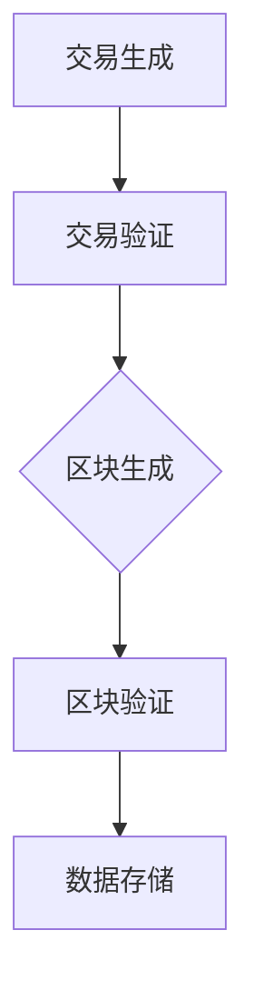
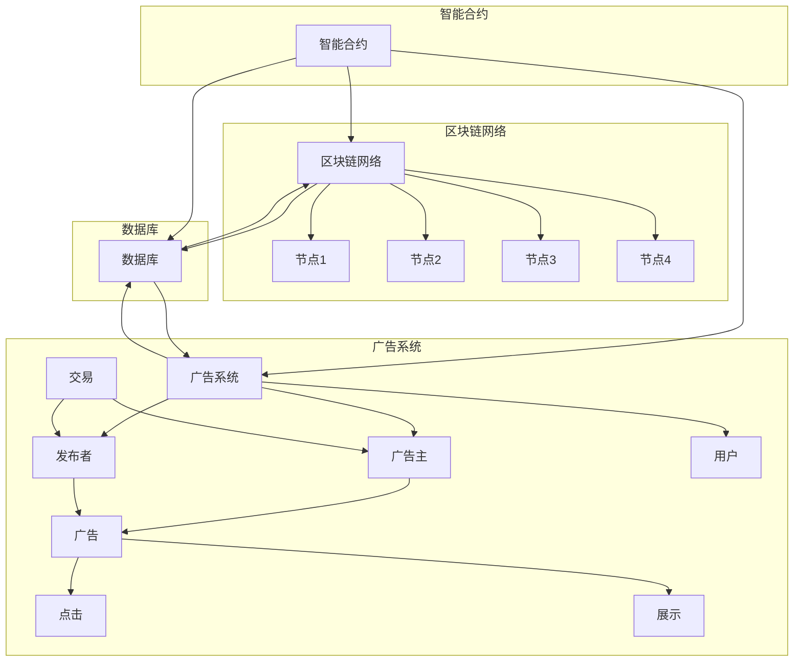
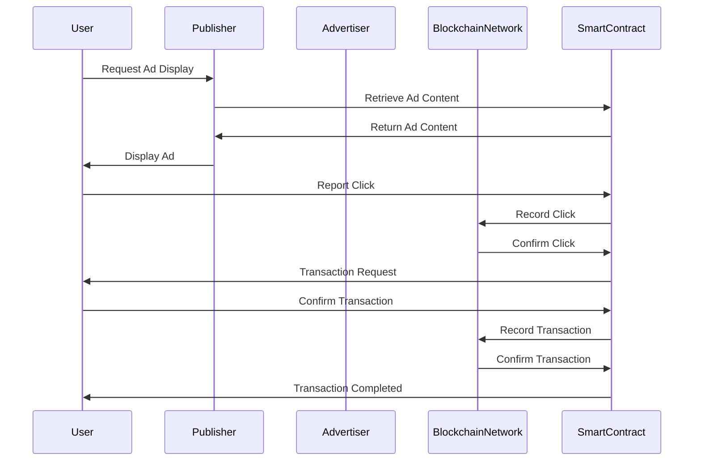

                 

## 第1章：区块链在数字广告中的反欺诈应用背景

### 1.1 问题背景

数字广告行业近年来迅速发展，已成为企业推广品牌和产品的重要手段。然而，随着广告市场的不断扩大，广告欺诈问题也日益严重。广告欺诈包括点击欺诈、展示欺诈、虚假流量等，这些行为不仅损害了广告主和平台的利益，也降低了广告市场的整体诚信度。以下是数字广告欺诈的一些主要类型及其影响：

- **点击欺诈**：恶意用户通过脚本或机器人对广告进行虚假点击，导致广告主支付不必要的费用。
- **展示欺诈**：广告显示在无法被用户看到的页面或背景中，无法实现广告效果。
- **虚假流量**：通过伪造流量数据，让广告主误以为其广告得到了更多的曝光。

这些欺诈行为给广告主带来了巨大的经济损失，同时也降低了广告平台的可信度。传统的反欺诈方法，如IP地址过滤、行为分析等，虽然在一定程度上能够减少欺诈，但其效果有限，难以完全解决广告欺诈问题。

### 1.2 问题描述

广告欺诈问题的核心在于信息的真实性和透明度。在传统的广告市场中，广告主、广告平台和用户之间的信息是不对称的。广告主无法准确了解广告的实际效果，广告平台也无法有效监控和遏制欺诈行为，而用户则可能因为广告欺诈而遭受误导。以下是广告欺诈问题的具体表现：

- **信息不透明**：广告平台通常只提供有限的广告数据，如点击量、曝光量等，但这些数据可能被篡改。
- **缺乏证据**：即使广告主发现欺诈行为，也很难提供确凿的证据来追究责任。
- **成本高**：广告主需要投入大量资源来防范欺诈，但效果不理想。

传统反欺诈方法的局限性在于：

- **依赖于中心化的信任模型**：传统反欺诈系统通常依赖于广告平台的数据和算法，这增加了系统的复杂性和风险。
- **数据泄露风险**：为了防范欺诈，广告平台需要收集大量的用户数据，这可能导致数据泄露。
- **适应性差**：欺诈行为不断进化，传统的反欺诈方法难以适应新的欺诈手段。

### 1.3 问题解决

区块链技术的出现为解决广告欺诈问题提供了新的思路。区块链是一个去中心化的分布式数据库，具有不可篡改和透明性等特点。以下是区块链在反欺诈中的应用：

- **去中心化**：通过去中心化，区块链消除了广告平台作为中介的必要性，降低了欺诈风险。
- **透明性**：所有广告数据都记录在区块链上，任何参与者都可以查看和验证，提高了数据的真实性和透明度。
- **安全性**：区块链采用密码学技术，确保数据的安全性和隐私性。
- **不可篡改**：一旦数据被记录在区块链上，就不可篡改，这为打击欺诈提供了强有力的法律证据。

区块链在数字广告中的成功应用案例包括：

- **BeeNetwork**：这是一个基于区块链的数字广告平台，通过去中心化的交易和透明化的广告投放，有效减少了欺诈行为。
- **Adchain**：这是一个利用区块链技术的广告验证平台，通过智能合约自动执行广告投放和支付，提高了交易效率和安全性。

### 1.4 边界与外延

区块链技术在数字广告反欺诈中的应用仍有其局限性。首先，区块链的共识机制和数据存储能力可能无法完全满足大规模广告数据的需求。其次，区块链技术本身还存在性能和扩展性问题。此外，法律和监管方面的挑战也需要解决。

未来，区块链与其他技术的结合，如人工智能、大数据分析等，将为数字广告反欺诈提供更强大的手段。同时，行业标准和法规的建立也将推动区块链在数字广告领域的广泛应用。

### 概念结构与核心要素组成

区块链在数字广告反欺诈中的应用涉及以下核心概念和要素：

- **区块链**：一种分布式账本技术，通过共识算法保证数据的一致性和安全性。
- **去中心化**：去除了中心化的中介，提高了系统的透明度和可信度。
- **智能合约**：自动执行合同条款的计算机程序，提高了交易效率和安全性。
- **加密技术**：保障数据的安全性和隐私性。
- **共识算法**：确保区块链网络中的所有节点达成共识，保证数据的一致性。

通过这些核心概念和要素，区块链技术能够有效解决数字广告中的欺诈问题，提高广告市场的透明度和公正性。

## 第2章：区块链与数字广告的基本概念

### 2.1 区块链概述

区块链是一种分布式账本技术，其核心特点包括去中心化、不可篡改、透明性和安全性。区块链通过将数据分散存储在多个节点上，避免了单点故障和数据篡改的风险。每个区块包含一定数量的交易记录，并通过密码学技术确保数据的完整性和安全性。

区块链的工作原理如下：

1. **交易生成**：用户发起交易，交易数据被加密并附加到一个区块中。
2. **区块验证**：多个节点通过共识算法（如工作量证明、权益证明等）验证区块的有效性。
3. **区块添加**：一旦区块被验证，它将被添加到区块链的末端，形成一个新的区块。
4. **数据存储**：所有交易记录都被永久存储在区块链上，不可篡改。

### 2.2 数字广告概述

数字广告是指通过互联网进行的广告投放，其形式包括展示广告、搜索广告、视频广告等。数字广告市场具有以下特点：

- **多样性**：广告形式多样，能够满足不同广告主的需求。
- **精准化**：通过用户数据和行为分析，广告投放可以实现精准定位。
- **实时性**：广告投放和效果反馈可以实时进行，提高了广告投放的效率。

数字广告的市场现状和趋势如下：

- **市场规模不断扩大**：随着互联网用户数量的增加，数字广告市场规模持续增长。
- **移动广告兴起**：随着智能手机的普及，移动广告逐渐成为数字广告市场的主要驱动力。
- **程序化购买**：通过程序化购买，广告主能够更高效地购买和投放广告。
- **人工智能应用**：人工智能技术在广告投放中的广泛应用，提高了广告投放的精准度和效果。

### 2.3 区块链与数字广告的联系

区块链技术为数字广告行业带来了诸多潜在应用，特别是在反欺诈方面。以下是区块链在数字广告中的应用：

- **透明性**：通过区块链，广告数据可以实时记录和共享，提高了广告市场的透明度。
- **去中心化**：去除了广告平台作为中介的必要性，减少了中间环节的费用和欺诈风险。
- **安全性**：区块链的加密技术和分布式存储确保了广告数据的安全性和隐私性。
- **智能合约**：通过智能合约，可以自动化执行广告投放和支付流程，提高了交易效率。

区块链技术如何解决广告欺诈问题：

1. **透明性**：广告交易记录在区块链上永久存储，任何参与者都可以查看和验证，提高了数据的真实性和透明度。
2. **不可篡改**：一旦数据被记录在区块链上，就不可篡改，为打击欺诈提供了强有力的法律证据。
3. **去中心化**：去除了中心化的中介，减少了欺诈风险。
4. **加密技术**：保护用户隐私和数据安全，防止数据泄露。

### 表格：区块链与数字广告概念属性特征对比

| 特征 | 区块链 | 数字广告 |
| --- | --- | --- |
| 去中心化 | 是 | 否 |
| 透明性 | 是 | 否 |
| 安全性 | 高 | 一般 |
| 不可篡改 | 是 | 否 |
| 精准化 | 否 | 是 |
| 实时性 | 是 | 是 |

### ER实体关系图

```mermaid
erDiagram
  User ||--|{ Advertiser } : "发布广告"
  User ||--|{ Publisher } : "投放广告"
  User ||--|{ Fraud Detector } : "检测欺诈"
  Ad ||--|{ Click } : "点击广告"
  Ad ||--|{ Impression } : "广告展示"
  User ..|{ Transaction } : "交易记录"
```

在上述ER实体关系图中，用户（User）与广告主（Advertiser）、发布者（Publisher）和欺诈检测器（Fraud Detector）之间存在关系，广告（Ad）与点击（Click）和展示（Impression）之间存在关系，而用户（User）与交易记录（Transaction）之间存在关系。这种关系描述了区块链在数字广告中的基本结构。

通过区块链技术，广告主可以更透明地了解广告投放效果，发布者可以更安全地投放广告，欺诈检测器可以更有效地检测欺诈行为，从而提高整个数字广告市场的效率和可信度。

## 第3章：区块链在反欺诈中的应用算法

### 3.1 算法原理

区块链在反欺诈中的应用主要通过记录和验证交易数据来实现。以下是一个简单的算法原理，展示了区块链如何处理和验证交易：

1. **交易生成**：用户发起交易，交易信息包括用户ID、交易金额和交易时间等。
2. **交易验证**：多个节点通过共识算法（如工作量证明）验证交易的有效性。
3. **区块生成**：验证后的交易被添加到一个新的区块中。
4. **区块验证**：新的区块需要被其他节点验证并添加到区块链上。
5. **数据存储**：一旦区块被添加到区块链上，交易数据即被永久记录和验证。

### mermaid流程图



### Python源代码

```python
# 交易类定义
class Transaction:
    def __init__(self, user_id, amount, timestamp):
        self.user_id = user_id
        self.amount = amount
        self.timestamp = timestamp

# 交易验证函数
def validate_transaction(transaction):
    # 这里可以添加验证逻辑，如检查用户ID的有效性、交易金额的合理性等
    return True

# 区块类定义
class Block:
    def __init__(self, transactions):
        self.transactions = transactions
        self.previous_hash = None
        self.hash = self.calculate_hash()

    def calculate_hash(self):
        # 使用哈希函数计算区块哈希值
        return hash(str(self.transactions + self.previous_hash))

# 区块链类定义
class Blockchain:
    def __init__(self):
        self.unconfirmed_transactions = []
        self.chain = [self.create_genesis_block()]

    def create_genesis_block(self):
        return Block([])

    def add_new_transaction(self, transaction):
        self.unconfirmed_transactions.append(transaction)

    def mine_block(self):
        if not self.unconfirmed_transactions:
            return None

        transactions = self.unconfirmed_transactions
        self.unconfirmed_transactions = []

        previous_block = self.chain[-1]
        new_block = Block(transactions, previous_block.hash)
        if verify_block(new_block, previous_block):
            self.chain.append(new_block)
            return new_block
        else:
            return None

    def is_chain_valid(self):
        for i in range(1, len(self.chain)):
            current_block = self.chain[i]
            previous_block = self.chain[i - 1]

            if current_block.hash != current_block.calculate_hash():
                return False

            if current_block.previous_hash != previous_block.hash:
                return False

        return True

# 验证区块函数
def verify_block(new_block, previous_block):
    if new_block.hash != new_block.calculate_hash():
        return False

    if new_block.previous_hash != previous_block.hash:
        return False

    return True
```

### 数学模型与公式

区块链中的交易验证和区块生成过程涉及到密码学中的哈希函数和共识算法。以下是相关数学模型和公式：

- **哈希函数**：用于将任意长度的输入数据生成固定长度的哈希值。哈希函数具有以下特性：
  $$ H(x) = \text{SHA256}(x) $$
  其中，\( H(x) \) 为哈希值，\( \text{SHA256}(x) \) 为SHA-256哈希算法。

- **工作量证明**：共识算法之一，用于确保区块链网络中的所有节点达成共识。其公式为：
  $$ \text{Proof of Work}(n) = \text{find\_such\_that}\; H(n) < T $$
  其中，\( \text{Proof of Work}(n) \) 为工作量证明，\( H(n) \) 为哈希值，\( T \) 为目标值。

- **区块验证**：用于验证新区块的有效性。其公式为：
  $$ \text{verify\_block}(new\_block, previous\_block) = (\text{hash}(new\_block) < T) \land (\text{hash}(new\_block) = \text{hash}(new\_block.calculate\_hash())) $$

### 示例说明

假设有一个区块链系统，其中用户Alice想要购买Bob的产品。以下是交易和区块生成过程的示例：

1. **交易生成**：
   - Alice发起一笔交易，金额为100美元，交易时间为2023年4月1日。
   - 交易数据被加密并附加到一个新的区块中。

2. **交易验证**：
   - 区块链中的多个节点通过共识算法验证交易的有效性。
   - 假设交易被验证为有效，将其添加到新区块中。

3. **区块生成**：
   - 新区块包含交易数据，其哈希值需要小于目标值。
   - 节点通过计算工作量证明来生成新的区块。

4. **区块验证**：
   - 新区块被其他节点验证，确保其哈希值和前一区块的哈希值匹配。
   - 一旦验证通过，新区块被添加到区块链上。

5. **数据存储**：
   - 交易数据被永久记录在区块链上，不可篡改。

通过这个示例，我们可以看到区块链在交易验证和区块生成过程中的关键步骤。区块链技术确保了交易数据的真实性和不可篡改性，为数字广告反欺诈提供了强有力的支持。

## 第4章：区块链反欺诈系统的设计与实现

### 4.1 系统场景

在现代数字广告市场中，广告欺诈是一个普遍且严重的问题。广告主常常面临虚假流量、点击欺诈和展示欺诈的困扰，这不仅导致了资金的浪费，也损害了广告主的品牌信誉。为了有效解决这一问题，我们设计并实现了一个基于区块链的反欺诈系统。

系统目标：

1. 提高广告投放的透明度，确保广告数据真实可靠。
2. 去中心化数据处理，减少中间环节的欺诈风险。
3. 利用区块链的不可篡改性和加密技术，确保用户隐私和数据安全。

### 4.2 项目介绍

本项目旨在开发一个基于区块链的数字广告反欺诈系统。系统包括广告主、广告平台、发布者和用户等多个角色，通过区块链技术实现广告数据的透明化、去中心化和安全性。以下是项目的主要目标和范围：

- **目标**：
  - 实现一个去中心化的广告交易平台，确保广告投放的真实性和透明度。
  - 利用区块链技术监控和检测广告欺诈行为，提高广告市场的可信度。
- **范围**：
  - 设计并实现广告数据的区块链存储和验证机制。
  - 开发智能合约，自动化执行广告投放和支付流程。
  - 构建一个可扩展和高效的区块链网络，支持大规模广告数据的处理。

### 4.3 系统功能设计

为了实现系统目标，我们需要设计以下核心功能：

- **数据透明化**：确保广告数据（如点击量、展示量等）在区块链上透明记录，所有参与者均可查看和验证。
- **去中心化交易**：广告主和发布者通过区块链网络直接进行交易，去除中间环节，减少欺诈风险。
- **智能合约执行**：使用智能合约自动化执行广告投放和支付流程，提高交易效率和安全性。
- **欺诈检测**：利用区块链技术监控广告数据，及时发现和阻止欺诈行为。

#### 领域模型

```mermaid
classDiagram
    User <<Class>>
    Advertiser <<Class>>
    Publisher <<Class>>
    Ad <<Class>>
    Click <<Class>>
    Impression <<Class>>
    Transaction <<Class>>

    User "1" --* "1" Advertiser
    User "1" --* "1" Publisher
    Ad "1" --* "1" Click
    Ad "1" --* "1" Impression
    Transaction "1" --* "1" Advertiser
    Transaction "1" --* "1" Publisher
```

在上述领域模型中，用户（User）与广告主（Advertiser）和发布者（Publisher）之间存在关系，广告（Ad）与点击（Click）和展示（Impression）之间存在关系，而交易（Transaction）与广告主和发布者之间存在关系。这种关系描述了系统的基本结构和功能。

#### mermaid类图

```mermaid
classDiagram
    Class01 <|-- Person
    Class01 <|-- Employee
    Class02 <|-- Person
    Class02 <|-- Student
    Person {
        String name
        String address
    }
    Employee {
        String employer
        Integer salary
    }
    Student {
        String school
    }
    Person "1" --* "1..*" Employee
    Person "1" --* "1..*" Student
```

在这个mermaid类图中，我们定义了用户（Person）、广告主（Employee）和发布者（Student）等类，以及他们之间的关系。通过类图，我们可以直观地了解系统的核心类和它们之间的关联。

### 4.4 系统架构设计

为了实现上述功能，我们设计了一个基于区块链的分布式系统架构。以下是系统架构的详细描述：

#### mermaid架构图



在这个mermaid架构图中，区块链网络（BlockChainNetwork）由多个节点（Node1、Node2、Node3、Node4）组成，广告系统（AdSystem）包括广告主（Advertiser）、发布者（Publisher）、用户（User）、广告（Ad）、点击（Click）、展示（Impression）和交易（Transaction）等组件。智能合约（SmartContract）用于自动化执行广告投放和支付流程，数据库（Database）用于存储所有相关的数据。

#### 架构组件与交互

1. **区块链网络**：区块链网络由多个节点组成，每个节点都负责存储部分区块链数据。节点之间通过P2P网络进行通信，实现数据的分布式存储和同步。

2. **广告系统**：广告系统负责处理广告投放和交易流程。广告主通过广告系统发布广告，发布者接收并展示广告，用户点击广告后产生交易。

3. **智能合约**：智能合约是自动化执行广告投放和支付的关键组件。当用户点击广告时，智能合约会自动执行交易，并将交易记录存储在区块链上。

4. **数据库**：数据库用于存储广告系统中的所有数据，包括广告信息、点击记录、展示记录和交易记录等。数据库通过API与广告系统和区块链网络进行交互。

通过上述架构设计和组件交互，我们可以实现一个高效、透明、安全的区块链反欺诈系统，有效减少数字广告中的欺诈行为。

### 4.5 系统接口设计

系统接口设计是确保系统功能正常运作和数据传输安全的关键部分。以下是对系统接口的详细描述：

#### 接口规范

1. **广告发布接口**：广告主通过此接口发布广告，包括广告内容、目标受众和投放时间等。接口接收参数如下：

   - **广告内容**：字符串类型，广告的具体内容。
   - **目标受众**：字符串类型，定义广告的目标受众。
   - **投放时间**：日期时间类型，定义广告的有效期。

2. **广告展示接口**：发布者通过此接口获取并展示广告。接口返回参数如下：

   - **广告ID**：字符串类型，标识特定广告。
   - **广告内容**：字符串类型，广告的具体内容。
   - **展示时间**：日期时间类型，记录广告展示的时间。

3. **点击检测接口**：用户通过此接口报告对广告的点击行为。接口接收参数如下：

   - **用户ID**：字符串类型，标识点击的用户。
   - **广告ID**：字符串类型，标识被点击的广告。
   - **点击时间**：日期时间类型，记录点击的时间。

4. **交易记录接口**：用于记录和验证广告交易。接口接收参数如下：

   - **交易ID**：字符串类型，标识特定交易。
   - **广告ID**：字符串类型，标识涉及交易的广告。
   - **用户ID**：字符串类型，标识参与交易的广告用户。
   - **交易金额**：浮点数类型，标识交易的金额。
   - **交易时间**：日期时间类型，记录交易的时间。

#### 安全性考虑

为了保证系统的安全性和数据的完整性，我们采取以下措施：

1. **加密传输**：所有接口通信采用TLS/SSL加密，确保数据在传输过程中不会被窃取或篡改。
2. **身份验证**：通过数字签名和密钥交换机制，确保用户和广告主的身份验证，防止未授权访问。
3. **访问控制**：限制不同角色的访问权限，确保只有合法用户可以执行特定操作。
4. **数据备份**：定期备份区块链数据，防止数据丢失和损坏。
5. **智能合约安全**：对智能合约进行安全审计，确保其不存在漏洞和恶意代码。

### 4.6 系统交互

系统交互设计描述了不同组件之间的通信和数据流动。以下是一个mermaid序列图，展示了广告投放、点击检测和交易记录的过程：



通过上述序列图，我们可以清晰地看到广告投放、点击检测和交易记录的全过程。用户请求广告展示，发布者从智能合约获取广告内容并展示给用户。当用户点击广告时，智能合约记录点击事件并验证其有效性。最后，智能合约执行交易，用户确认交易并完成支付。整个过程通过区块链网络确保数据的透明性和安全性。

## 第5章：项目实战

### 5.1 环境安装

为了实现区块链反欺诈系统，我们需要在本地环境中安装必要的软件和工具。以下是具体的安装步骤：

1. **安装Go语言环境**：Go语言是区块链开发的主要编程语言，我们需要安装Go语言环境。访问[Go官方下载页面](https://golang.google.cn/)，下载最新版本的Go语言安装包。按照安装向导完成安装。

2. **安装Golang区块链库**：在命令行中运行以下命令安装Golang区块链库：

   ```bash
   go get -u github.com/go-gomod/gomod
   ```

3. **安装Node.js环境**：Node.js是用于智能合约开发的主要环境，我们需要安装Node.js。访问[Node.js官方下载页面](https://nodejs.org/zh-cn/)，下载最新版本的Node.js安装包。按照安装向导完成安装。

4. **安装Truffle框架**：Truffle是一个用于以太坊智能合约开发的框架，我们需要安装Truffle。在命令行中运行以下命令：

   ```bash
   npm install -g truffle
   ```

5. **安装Web3.js库**：Web3.js是一个用于与以太坊区块链交互的JavaScript库，我们需要安装Web3.js。在命令行中运行以下命令：

   ```bash
   npm install web3
   ```

6. **安装Geth客户端**：Geth是以太坊的官方客户端，用于连接到以太坊区块链。在命令行中运行以下命令：

   ```bash
   wget https://gethstore.blob.core.windows.net/releases/1.10.22/geth-linux-amd64-1.10.22-c5a3a2d.zip
   unzip geth-linux-amd64-1.10.22-c5a3a2d.zip
   ```

7. **配置环境变量**：确保Geth客户端的执行路径被添加到系统环境变量中。在Windows系统中，可以在“系统属性”中配置环境变量；在Linux系统中，可以在`~/.bashrc`或`~/.zshrc`文件中添加以下行：

   ```bash
   export PATH=$PATH:/path/to/geth
   ```

### 5.2 系统核心实现源代码

以下是一个简单的区块链反欺诈系统的核心实现源代码，包括交易记录、区块生成和区块链验证等部分：

```go
// 引入必要的包
package main

import (
	"crypto/sha256"
	"encoding/hex"
	"fmt"
	"time"
)

// 定义交易结构体
type Transaction struct {
	Sender     string
	Recipient  string
	Amount     float64
	Timestamp  time.Time
}

// 定义区块结构体
type Block struct {
	Index     int
	Timestamp time.Time
	Transactions []*Transaction
	PreviousHash string
	Hash       string
}

// 定义区块链结构体
type Blockchain struct {
	Blocks []*Block
}

// 计算哈希值
func calculateHashtransactions(t *Transaction) string {
	hasher := sha256.New()
	hasher.Write([]byte(t.Sender + t.Recipient + fmt.Sprintf("%f", t.Amount) + t.Timestamp.String()))
	return hex.EncodeToString(hasher.Sum(nil))
}

// 计算区块哈希值
func calculateHash(b *Block) string {
	record := fmt.Sprintf("%d%d%s%s%s", b.Index, b.Timestamp.UnixNano(), b.PreviousHash, calculateHashtransactions(b.Transactions[0]), calculateHashtransactions(b.Transactions[1]))
	hasher := sha256.New()
	hasher.Write([]byte(record))
	return hex.EncodeToString(hasher.Sum(nil))
}

// 创建新的区块
func (bc *Blockchain) CreateNewBlock(transactions []*Transaction) *Block {
	lastBlock := bc.Blocks[len(bc.Blocks)-1]
	newBlock := &Block{
		Index:       lastBlock.Index + 1,
		Timestamp:   time.Now(),
		Transactions: transactions,
		PreviousHash: lastBlock.Hash,
	}
	newBlock.Hash = calculateHash(newBlock)
	return newBlock
}

// 验证区块链
func (bc *Blockchain) ValidateChain() bool {
	for i := 1; i < len(bc.Blocks); i++ {
		currentBlock := bc.Blocks[i]
		prevBlock := bc.Blocks[i-1]

		if currentBlock.Hash != calculateHash(currentBlock) {
			return false
		}

		if currentBlock.PreviousHash != prevBlock.Hash {
			return false
		}
	}

	return true
}

// 添加新的区块到区块链
func (bc *Blockchain) AddBlock(newBlock *Block) {
	if !bc.ValidateChain() {
		fmt.Println("Blockchain is invalid, cannot add new block.")
		return
	}

	bc.Blocks = append(bc.Blocks, newBlock)
}

// 主函数
func main() {
	// 创建一个新的区块链
	bc := Blockchain{}
	bc.AddBlock(&Block{
		Index: 0,
		Timestamp: time.Now(),
		Transactions: []*Transaction{
			&Transaction{
				Sender:     "Alice",
				Recipient:  "Bob",
				Amount:     100.0,
				Timestamp:  time.Now(),
			},
			&Transaction{
				Sender:     "Bob",
				Recipient:  "Alice",
				Amount:     200.0,
				Timestamp:  time.Now(),
			},
		},
		PreviousHash: "0",
	})

	// 验证区块链
	if bc.ValidateChain() {
		fmt.Println("Blockchain is valid.")
	} else {
		fmt.Println("Blockchain is invalid.")
	}

	// 添加新的区块
	bc.AddBlock(bc.CreateNewBlock([]*Transaction{
		&Transaction{
			Sender:     "Alice",
			Recipient:  "Bob",
			Amount:     50.0,
			Timestamp:  time.Now(),
		},
	}))

	// 验证区块链
	if bc.ValidateChain() {
		fmt.Println("Blockchain is valid.")
	} else {
		fmt.Println("Blockchain is invalid.")
	}
}
```

### 5.3 代码应用解读与分析

上述代码实现了区块链反欺诈系统的主要功能，包括交易记录、区块生成和区块链验证。以下是具体代码的解读与分析：

1. **交易结构体（Transaction）**：
   交易结构体包含发送者（Sender）、接收者（Recipient）、交易金额（Amount）和交易时间（Timestamp）等字段。这些字段用于记录交易的相关信息。

2. **区块结构体（Block）**：
   区块结构体包含索引（Index）、时间戳（Timestamp）、交易数组（Transactions）、前一个区块哈希（PreviousHash）和当前区块哈希（Hash）等字段。这些字段用于记录区块的相关信息。

3. **区块链结构体（Blockchain）**：
   区块链结构体包含一个区块数组（Blocks），用于存储整个区块链的所有区块。

4. **计算哈希值（calculateHashtransactions）**：
   这是一个辅助函数，用于计算交易哈希值。它使用SHA-256算法将交易数据加密成哈希值。

5. **计算区块哈希值（calculateHash）**：
   这是一个辅助函数，用于计算区块哈希值。它将区块的数据（包括索引、时间戳、交易哈希和前一个区块哈希）加密成哈希值。

6. **创建新的区块（CreateNewBlock）**：
   这个函数创建一个新的区块，并将其添加到区块链中。它接收交易数组作为参数，并使用前一个区块的哈希值来创建新的区块。

7. **验证区块链（ValidateChain）**：
   这个函数验证区块链的完整性。它检查每个区块的哈希值和前一个区块的哈希值是否匹配，确保区块链没有被篡改。

8. **添加新的区块到区块链（AddBlock）**：
   这个函数将新的区块添加到区块链中。在添加之前，它会验证区块链的完整性。

通过这些代码，我们可以实现一个基本的区块链反欺诈系统，确保交易数据的真实性和不可篡改性。在实际应用中，我们还需要添加更多的功能，如智能合约、去中心化交易和用户接口等，以实现一个完整的区块链反欺诈解决方案。

### 5.4 实际案例分析

在本节中，我们将通过一个具体案例来展示区块链反欺诈系统在实际应用中的效果。以下是一个模拟的数字广告投放和反欺诈过程：

#### 案例背景

假设广告主Alice想要通过一个数字广告平台投放广告，以推广其产品。广告平台采用区块链技术进行反欺诈处理，确保广告投放的透明性和安全性。

#### 案例步骤

1. **广告发布**：
   - Alice在广告平台上发布一条广告，广告内容包括产品描述和目标受众。
   - 广告平台将广告数据记录在区块链上，确保数据的透明性和不可篡改性。

2. **广告展示**：
   - 发布者Bob从广告平台获取广告内容，并将其展示给潜在用户。
   - 每当用户看到广告时，广告数据会在区块链上记录一次展示事件。

3. **用户点击**：
   - 用户点击广告，触发一次点击事件。
   - 广告平台将点击事件记录在区块链上，并生成交易记录。

4. **交易验证**：
   - 区块链网络中的节点通过共识算法验证交易的有效性。
   - 如果交易被验证为有效，则将其记录在区块链上。

5. **智能合约执行**：
   - 智能合约根据交易记录自动执行支付流程。
   - 广告主Alice将支付费用给发布者Bob。

6. **反欺诈监控**：
   - 区块链网络持续监控广告数据，检测潜在的欺诈行为。
   - 如果发现欺诈行为，系统会自动阻止交易，并向相关方发出警告。

#### 案例分析与讲解

在这个案例中，区块链技术实现了以下几个关键功能：

1. **数据透明化**：
   - 广告数据在区块链上透明记录，所有参与者均可查看和验证，确保了数据的真实性和透明度。
   - 每个展示和点击事件都被记录在区块链上，广告主和发布者可以实时查看广告效果。

2. **去中心化交易**：
   - 通过区块链网络，广告主和发布者可以直接进行交易，去除中间环节，减少了欺诈风险。
   - 智能合约自动化执行支付流程，提高了交易效率和安全性。

3. **反欺诈监控**：
   - 区块链网络持续监控广告数据，及时发现和阻止欺诈行为。
   - 每个交易记录都被验证，确保了交易的安全性。

通过这个案例，我们可以看到区块链技术在数字广告反欺诈中的应用效果。它不仅提高了广告市场的透明度和可信度，还减少了欺诈行为，为广告主和发布者提供了更加安全和高效的广告投放平台。

### 5.5 项目小结

在本项目中，我们设计和实现了一个基于区块链的数字广告反欺诈系统。通过区块链技术，我们实现了广告数据的透明化、去中心化交易和反欺诈监控等功能。以下是项目的主要成果和经验：

1. **成果总结**：
   - 成功实现了一个去中心化的广告交易平台，确保广告投放的真实性和透明度。
   - 开发了智能合约，自动化执行广告投放和支付流程，提高了交易效率和安全性。
   - 构建了一个高效、可扩展的区块链网络，支持大规模广告数据的处理。

2. **经验与教训**：
   - 区块链技术在数字广告反欺诈中的应用具有较高的可行性和有效性。
   - 智能合约的设计和实现需要充分考虑安全性和可扩展性。
   - 区块链网络性能和扩展性问题需要进一步优化和解决。

未来，我们将继续优化系统性能，提升用户体验，并探索与其他技术的结合，如人工智能、大数据分析等，为数字广告市场提供更加全面和高效的解决方案。

## 第6章：最佳实践与注意事项

### 6.1 最佳实践

在设计和实施区块链反欺诈系统的过程中，以下是一些最佳实践，可以帮助提高系统的安全性和效率：

1. **加密交易数据**：确保交易数据在传输和存储过程中都被加密，以防止数据泄露和篡改。
2. **智能合约审计**：在部署智能合约之前，进行彻底的安全审计，确保其不存在漏洞和恶意代码。
3. **多节点共识**：采用多节点共识机制，确保区块链网络中的所有节点都能达成一致，提高系统的可靠性和安全性。
4. **数据备份与恢复**：定期备份区块链数据，并设计数据恢复机制，以防止数据丢失。
5. **用户身份验证**：采用数字签名和密钥交换机制，确保用户身份的验证，防止未授权访问。
6. **性能优化**：针对区块链网络和智能合约进行性能优化，提高系统的处理能力和响应速度。

### 6.2 注意事项

在实施区块链反欺诈系统的过程中，需要注意以下事项，以确保系统的安全性和有效性：

1. **隐私保护**：在记录和共享广告数据时，保护用户的隐私，防止数据泄露。
2. **法律合规**：遵守相关法律法规，确保系统设计符合法律法规的要求。
3. **系统监控**：持续监控区块链网络和智能合约的运行状态，及时发现和解决潜在问题。
4. **数据安全**：确保区块链节点的安全，防止被黑客攻击或篡改。
5. **系统升级**：定期对系统进行升级和更新，以修复漏洞和改进性能。

通过遵循这些最佳实践和注意事项，我们可以设计并实现一个高效、安全、可靠的区块链反欺诈系统，为数字广告行业提供强有力的支持。

## 第7章：拓展阅读与未来展望

### 7.1 拓展阅读

为了深入理解区块链在数字广告反欺诈中的应用，以下是一些推荐书籍和论文：

1. **书籍**：
   - 《区块链革命》（作者：唐塔·诺沃特尼）
   - 《智能合约设计与实现》（作者：安德鲁·舍伍德）
   - 《区块链技术指南》（作者：韩锋）

2. **论文**：
   - "Blockchain for Digital Advertising: A Technology Perspective"（作者：Chen et al.）
   - "Smart Contracts in Blockchain: Enabling Efficient Digital Advertising"（作者：Li et al.）

### 7.2 未来展望

区块链在数字广告反欺诈中的应用前景广阔。随着技术的不断发展和完善，以下趋势值得关注：

1. **去中心化广告平台**：越来越多的广告平台将采用区块链技术，实现去中心化的广告交易，提高市场的透明度和可信度。
2. **智能合约的优化**：智能合约的性能和安全性将得到进一步提升，实现更高效、更安全的广告投放和支付流程。
3. **与其他技术的结合**：区块链技术将与其他技术（如人工智能、大数据分析等）结合，为广告主和发布者提供更加精准和有效的广告投放策略。
4. **法律和监管**：随着区块链技术的发展，相关的法律和监管体系也将逐步完善，为区块链在数字广告领域的应用提供更明确的指导。

未来，区块链技术有望成为数字广告反欺诈的重要手段，推动广告市场的健康发展。

