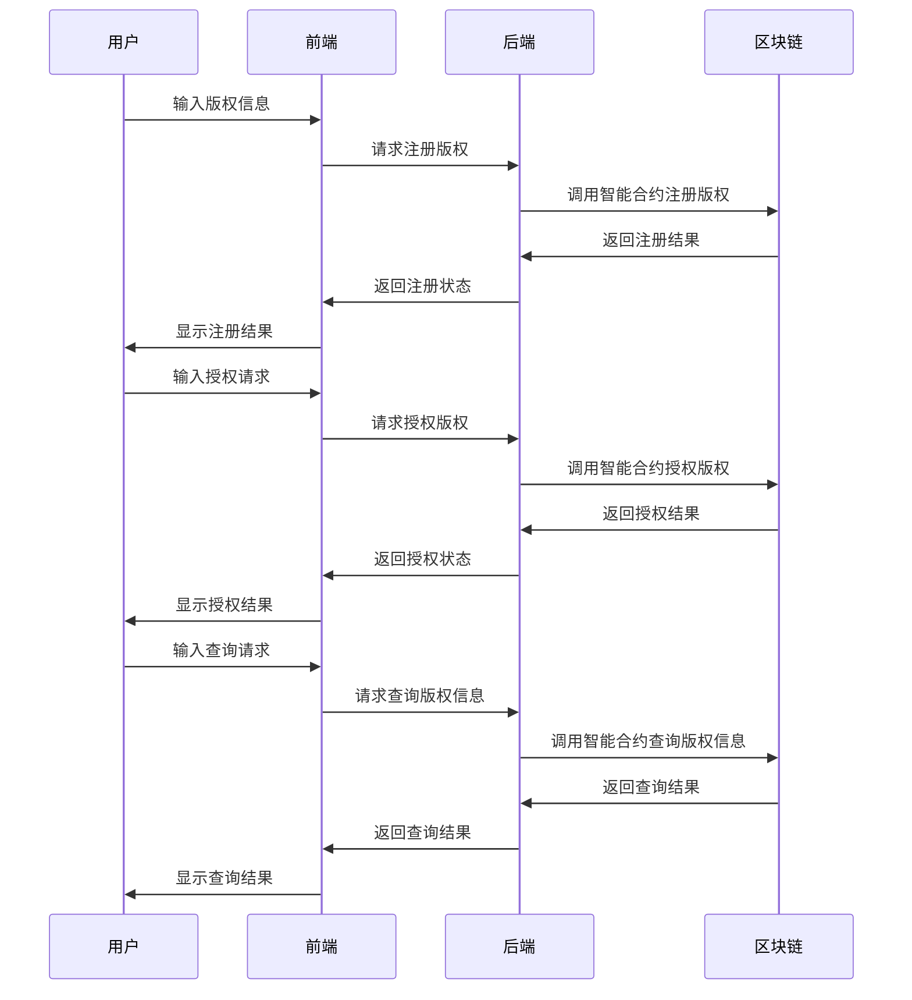
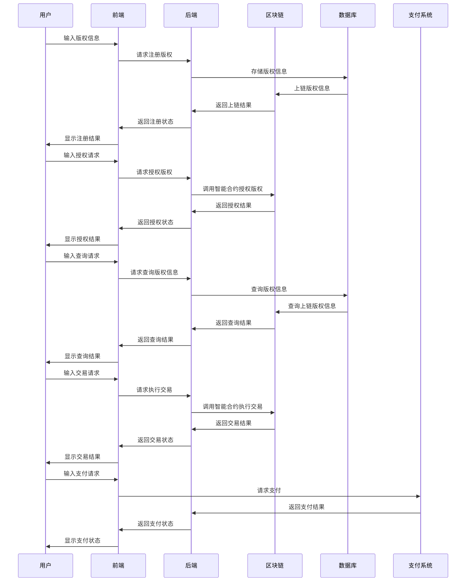

                 

### 数字版权交易与区块链背景介绍

#### 1.1 数字版权交易概述

**版权交易的概念**

版权交易，又称著作权交易，是指著作权人或者其他著作权权利人将其享有的著作权（或其中的某一项权利）转让给他人或者许可他人使用而签订的合同。版权交易是知识产权交易的重要组成部分，涉及到著作权的使用权、改编权、发行权等多个方面。

**数字版权交易的特点**

随着互联网和信息技术的迅猛发展，数字版权交易逐渐成为版权交易的主要形式。数字版权交易具有以下几个特点：

1. **无地域限制**：互联网使得数字版权交易不再受到地域的限制，可以在全球范围内进行。
2. **高效便捷**：通过数字平台，数字版权交易可以快速完成，大大提高了交易效率。
3. **透明可追溯**：区块链技术的应用确保了数字版权交易的透明性，每一步交易都可以被追溯，减少了版权纠纷。
4. **低成本**：传统版权交易流程复杂，成本较高，而数字版权交易则降低了交易成本。

#### 1.2 区块链技术在数字版权交易中的应用

**区块链的基本原理**

区块链是一种去中心化的分布式数据库技术，通过加密算法和共识机制确保数据的不可篡改和去中心化存储。区块链的每一笔交易都被记录在一个区块中，多个区块通过哈希值链接在一起，形成一个链式数据结构。

**区块链在版权保护中的应用**

区块链技术在数字版权交易中具有重要作用，主要表现在以下几个方面：

1. **确权与登记**：区块链可以为每一件数字作品生成唯一的数字身份标识，确保版权归属的明确和不可篡改。
2. **授权与交易**：基于区块链的智能合约可以自动执行版权许可和交易，提高交易效率和透明度。
3. **防伪与溯源**：区块链的不可篡改性使得数字作品的真实性和版权归属具有可信的证明，有效防止了盗版和侵权行为。
4. **降低成本**：通过区块链技术，可以简化版权交易流程，降低交易成本。

#### 1.3 智能合约在数字版权交易中的作用

**智能合约的概念**

智能合约是一种运行在区块链上的自执行合约，它通过计算机代码定义了一系列条件，一旦满足这些条件，合约就会自动执行。智能合约的出现，使得区块链上的交易可以自动化执行，减少了人为干预和操作风险。

**智能合约在数字版权交易中的优势**

1. **自动化执行**：智能合约自动执行版权许可和交易，减少了人工干预，提高了交易效率。
2. **不可篡改**：智能合约一旦部署在区块链上，其条款和执行过程不可篡改，保证了版权交易的透明性和可信性。
3. **降低成本**：通过智能合约自动化执行交易，降低了交易的成本和风险。
4. **增强安全性**：智能合约增强了数字版权交易的安全性，防止了侵权和篡改行为。

#### 1.4 本书结构概述

本书主要分为六个部分，分别是：

1. 数字版权交易与区块链背景介绍
2. 核心概念与联系
3. 算法原理讲解
4. 系统分析与架构设计方案
5. 项目实战
6. 最佳实践、小结、注意事项、拓展阅读

通过这六个部分的深入讲解，读者将全面了解区块链在数字版权交易中的智能合约应用，掌握相关技术原理和实践方法。让我们开始这一趟区块链与数字版权交易的技术之旅吧！

## 1.1 数字版权交易概述

### 1.1.1 版权交易的概念

版权交易，通常是指版权所有者或持有者将其享有的版权（包括但不限于著作权、专利权、商标权等）的部分或全部权益转让给其他个人或机构的过程。版权交易的核心在于版权权利的转移，即版权从一方转移到另一方，从而实现版权的经济价值。

版权交易涉及多种类型的版权，其中著作权交易是最为常见的一种。著作权交易通常包括原创作品、改编作品、翻译作品等，这些作品可以是文学作品、音乐、电影、软件等。在著作权交易中，权利人（版权所有者）将作品的使用权、复制权、发行权、展示权等部分或全部转让给受让人。

**版权交易的基本要素**：

1. **版权所有者**：指拥有版权的个人或机构，他们通常是作品的创作者或者作品通过合法方式获得版权的个人或机构。
2. **受让人**：指接受版权转让的个人或机构，他们通过版权交易获得了作品的部分或全部使用权。
3. **交易内容**：包括作品的使用权、复制权、发行权、展示权等，交易内容可以是部分权益的转让，也可以是全部权益的转让。
4. **交易合同**：交易双方签订的正式合同，明确了交易的内容、价格、期限、违约责任等条款。

### 1.1.2 数字版权交易的特点

数字版权交易是传统版权交易的一种延伸和拓展，随着互联网和数字技术的发展，它呈现出以下显著特点：

1. **无地域限制**：数字版权交易不受地域的限制，交易双方可以在全球范围内进行。互联网的普及和电子商务的发展，使得数字版权交易的市场规模不断扩大。

2. **高效便捷**：数字版权交易通过数字平台进行，交易流程可以快速完成，大大提高了交易效率。在线交易平台的建立，使得交易双方可以快速匹配，减少了时间和人力成本。

3. **透明可追溯**：区块链技术的应用，使得数字版权交易的每一步操作都可以被透明化，每一步交易记录都可以被追溯。这为版权交易提供了可信的证明，减少了交易风险。

4. **低成本**：传统版权交易流程复杂，涉及多个中介机构，交易成本较高。而数字版权交易通过去中心化的方式进行，减少了中介环节，降低了交易成本。

5. **版权保护**：数字版权交易可以有效防止盗版和侵权行为。区块链技术的不可篡改性和去中心化特点，确保了数字版权的归属明确，有效遏制了侵权行为。

### 1.1.3 数字版权交易的重要性

数字版权交易在当今数字化时代具有重要意义，主要体现在以下几个方面：

1. **促进版权经济发展**：数字版权交易为版权所有人提供了新的经济模式，使得版权的价值得到充分挖掘，促进了版权经济的发展。

2. **优化资源配置**：通过数字版权交易，优秀的作品可以更快速地传播和利用，优化了文化资源的配置，提高了社会文化效益。

3. **推动技术进步**：数字版权交易推动了区块链技术、大数据技术、人工智能技术等新兴技术的发展和应用，为技术创新提供了动力。

4. **提升版权意识**：数字版权交易提高了公众的版权意识，使得越来越多的人认识到版权的重要性，从而促进了版权保护和社会法治建设。

综上所述，数字版权交易是版权交易领域的重要发展方向，它不仅提高了交易的效率和透明度，还促进了版权经济的繁荣和社会的进步。随着技术的不断发展和应用，数字版权交易将在未来发挥更加重要的作用。接下来，我们将进一步探讨区块链技术在数字版权交易中的应用，了解区块链如何为数字版权交易提供技术支持和保障。

### 1.2 区块链技术在数字版权交易中的应用

#### 1.2.1 区块链的基本原理

区块链（Blockchain）是一种分布式数据库技术，通过密码学和共识机制确保数据的安全性和不可篡改性。区块链的核心特点是去中心化，即数据不是存储在一个集中的服务器上，而是分布在多个节点上，每个节点都保存一份完整的数据副本。

区块链的基本工作原理如下：

1. **数据记录**：区块链通过一系列称为“区块”的数据结构来记录信息。每个区块包含一定数量的交易记录，并且每个区块都有一个时间戳。

2. **链式结构**：区块链中的区块通过哈希值链接在一起，形成一条连续的链式数据结构。每个区块都包含前一个区块的哈希值，这样确保了区块链的不可篡改性。

3. **共识机制**：区块链通过共识机制来确保所有节点的数据一致性。常见的共识机制有工作量证明（Proof of Work, PoW）、权益证明（Proof of Stake, PoS）等。

4. **数据验证**：每个区块在添加到区块链之前都需要经过网络中的节点验证。验证过程通常涉及复杂的数学计算，以确保数据的真实性和完整性。

区块链技术的这些基本原理，使其在数字版权交易中具有独特的应用价值：

- **去中心化**：区块链的去中心化特点消除了传统的版权交易中介，降低了交易成本，提高了交易效率。

- **不可篡改性**：区块链的不可篡改性确保了数字版权交易记录的真实性和可信度，减少了版权纠纷。

- **透明性**：区块链上的所有交易记录都是公开透明的，任何参与者都可以查看和验证交易过程，增加了交易的透明度。

#### 1.2.2 区块链在版权保护中的应用

区块链技术在版权保护中的应用主要体现在以下几个方面：

1. **确权与登记**：区块链可以用来确权和登记版权信息。版权所有者可以将自己的作品信息上链，生成唯一的数字身份标识，确保版权归属的明确和不可篡改。

2. **授权与许可**：基于区块链的智能合约可以自动执行版权许可和交易。权利人可以通过智能合约向受让人授权使用版权，确保授权过程的自动化和透明。

3. **防伪与溯源**：区块链的不可篡改性和透明性，使得数字作品的真伪可以轻松验证，有效防止了盗版和侵权行为。通过区块链，可以追溯数字作品的创建、分发、使用等全过程。

4. **降低成本**：区块链技术简化了版权交易流程，减少了中介环节，降低了交易成本。同时，智能合约的自动化执行，减少了人力成本和操作风险。

5. **增加透明度**：区块链上的所有交易记录都是公开透明的，任何参与者都可以查看和验证交易过程，增加了交易的透明度，减少了信息不对称。

#### 1.2.3 区块链在数字版权交易中的优势

区块链技术在数字版权交易中具有以下优势：

1. **安全性**：区块链的加密技术和去中心化结构，确保了数字版权交易的安全性和隐私保护。

2. **透明性**：区块链上的所有交易记录都是公开透明的，任何参与者都可以查看和验证，增加了交易的透明度。

3. **不可篡改性**：区块链的不可篡改性确保了数字版权交易记录的真实性和可信度，减少了版权纠纷。

4. **自动化执行**：基于区块链的智能合约可以自动执行版权许可和交易，提高了交易效率和减少人力成本。

5. **去中心化**：区块链的去中心化特点，消除了传统的版权交易中介，降低了交易成本，提高了交易效率。

总之，区块链技术在数字版权交易中具有广泛应用前景。通过区块链技术，可以确权和登记版权信息，自动化执行版权许可和交易，降低交易成本，提高交易透明度和安全性，有效保护数字版权，推动数字版权交易的健康发展。在接下来的章节中，我们将进一步探讨智能合约在数字版权交易中的应用，以及如何通过智能合约实现版权交易自动化和透明化。

### 1.3 智能合约在数字版权交易中的作用

#### 1.3.1 智能合约的概念

智能合约（Smart Contract）是一种运行在区块链上的自执行合约，它通过计算机代码定义了一系列条件，当满足这些条件时，合约会自动执行预定的操作。智能合约的出现，使得区块链上的交易可以自动化执行，减少了人为干预和操作风险。

智能合约的基本特点包括：

1. **自执行性**：智能合约的执行是自动的，一旦满足预定的条件，合约就会自动执行，无需人为干预。
2. **透明性**：智能合约的代码和执行过程是公开透明的，所有参与者都可以查看和验证。
3. **不可篡改性**：智能合约一旦部署在区块链上，其条款和执行过程不可篡改，确保了交易的安全性和可信度。
4. **自动化**：智能合约可以自动化执行复杂的业务逻辑，减少了人工干预和操作风险。

智能合约的核心功能包括：

- **合约条款定义**：智能合约通过计算机代码定义了交易的条款和条件，包括交易金额、执行时间、执行步骤等。
- **条件判断**：智能合约可以基于预设的条件进行判断，一旦满足条件，合约就会自动执行预定的操作。
- **操作执行**：智能合约执行预定的操作，如转移资产、记录事件等。
- **透明监控**：智能合约的执行过程是透明的，所有参与者都可以查看和验证，确保交易的公开和公正。

#### 1.3.2 智能合约在数字版权交易中的优势

智能合约在数字版权交易中具有以下显著优势：

1. **自动化执行**：智能合约可以自动执行版权许可和交易，减少了人工干预和操作风险，提高了交易效率。
2. **降低成本**：智能合约的自动化执行，减少了中介环节和人工成本，降低了交易成本。
3. **提高透明度**：智能合约的代码和执行过程是公开透明的，所有参与者都可以查看和验证，增加了交易的透明度。
4. **不可篡改性**：智能合约一旦部署在区块链上，其条款和执行过程不可篡改，确保了交易的安全性和可信度。
5. **简化流程**：智能合约简化了版权交易流程，使得交易过程更加简单和高效。

#### 1.3.3 智能合约在数字版权交易中的应用场景

智能合约在数字版权交易中有多种应用场景，以下是一些典型的应用：

1. **版权许可**：权利人可以通过智能合约向受让人授权使用版权，智能合约可以定义授权的时间、范围和费用等。
2. **版权转让**：智能合约可以自动执行版权转让过程，确保转让的透明性和安全性。
3. **版权追踪**：智能合约可以记录数字作品的创建、分发、使用等全过程，实现版权的透明追踪。
4. **版权管理**：智能合约可以自动化执行版权的续约、变更等管理操作，简化版权管理流程。
5. **防伪与溯源**：智能合约可以与区块链技术结合，实现数字作品的真实性和版权归属的验证，有效防止盗版和侵权行为。

通过智能合约在数字版权交易中的应用，可以大幅提高交易的效率、透明度和安全性，有效保护数字版权，推动数字版权交易的健康发展。在接下来的章节中，我们将进一步探讨数字版权交易的智能合约算法原理，以及如何通过算法实现版权交易自动化和透明化。

### 1.4 本书结构概述

本书旨在深入探讨区块链在数字版权交易中的应用，特别是智能合约技术的运用，为读者提供系统而全面的指导。全书分为六个部分，每个部分都针对不同的主题进行详细的探讨，具体结构如下：

**第一部分：数字版权交易与区块链背景介绍**

这一部分首先介绍了数字版权交易的概念、特点以及其重要性，随后深入探讨了区块链技术的基本原理及其在版权保护中的应用。接着，阐述了智能合约的概念和作用，为后续内容奠定了基础。

**第二部分：核心概念与联系**

本部分详细解析了区块链、数字版权交易和智能合约等核心概念，通过表格和Mermaid ER图展示了它们之间的关系。这部分内容帮助读者建立了一个完整的知识框架，为后续的深入讨论提供了支撑。

**第三部分：算法原理讲解**

在这一部分，我们详细介绍了数字版权交易中智能合约的算法原理，包括数学模型和公式，并通过Python代码进行了实例说明。这部分内容使读者能够理解智能合约在实际应用中的工作方式。

**第四部分：系统分析与架构设计方案**

本部分从系统功能需求、系统架构设计、模块划分、模块功能详解、系统架构接口设计等方面，全面描述了数字版权交易系统的设计和实现。通过Mermaid类图、架构图和序列图，直观展示了系统的结构和工作流程。

**第五部分：项目实战**

在这一部分，我们提供了一个实际的项目案例，详细说明了系统的安装、实现、代码解读和案例分析。通过这个项目案例，读者可以更好地理解书中的理论知识在实际中的应用。

**第六部分：最佳实践、小结、注意事项、拓展阅读**

最后一部分，我们提供了最佳实践建议，对整本书进行了小结，并提醒读者注意的关键点。此外，还提供了拓展阅读资源，帮助读者进一步深入了解相关领域。

通过这六个部分的系统讲解，本书旨在帮助读者全面掌握区块链在数字版权交易中的应用，特别是智能合约技术的运用，为从事相关领域的技术人员和研究者提供有价值的参考。

## 2.1 区块链、数字版权交易与智能合约的关系

### 2.1.1 概念解析

在探讨区块链、数字版权交易与智能合约之间的关系之前，我们需要对这三个核心概念进行详细的解析。

**区块链**：

区块链是一种分布式数据库技术，通过密码学和共识机制确保数据的安全性和不可篡改性。每个区块包含一定数量的交易记录，并通过哈希值链接在一起，形成一个连续的链式数据结构。区块链的核心特点包括去中心化、不可篡改、透明性和去信任。

**数字版权交易**：

数字版权交易是指版权所有者或持有者将其享有的版权（包括但不限于著作权、专利权、商标权等）的部分或全部权益转让给其他个人或机构的过程。数字版权交易通常通过数字平台进行，具有高效、便捷、透明和低成本的特点。

**智能合约**：

智能合约是一种运行在区块链上的自执行合约，通过计算机代码定义了一系列条件，当满足这些条件时，合约会自动执行预定的操作。智能合约的核心特点包括自执行性、透明性、不可篡改性和自动化。

### 2.1.2 关系图表

为了更好地理解区块链、数字版权交易与智能合约之间的关系，我们可以通过表格和Mermaid ER图来展示它们之间的联系。

**表格：区块链、数字版权交易与智能合约的属性对比**

| 属性 | 区块链 | 数字版权交易 | 智能合约 |
| --- | --- | --- | --- |
| 去中心化 | 是 | 是 | 是 |
| 不可篡改性 | 是 | 是（通过区块链） | 是 |
| 透明性 | 是 | 是（通过区块链） | 是 |
| 自执行性 | 是 | 否 | 是 |
| 成本 | 低 | 低（通过区块链） | 低 |
| 效率 | 高 | 高（通过区块链） | 高 |

**Mermaid ER图：区块链、数字版权交易与智能合约的关系**

```mermaid
erDiagram
  区块链 ||--o> 数字版权交易 : 数据基础
  数字版权交易 ||--o> 智能合约 : 实现方式
  区块链 ||--o> 智能合约 : 执行平台
```

在这个ER图中，区块链作为数字版权交易和数据基础，为智能合约提供了执行平台。智能合约通过区块链实现数字版权交易的具体操作，如版权授权、转让和追踪等。

### 2.1.3 关系解释

1. **区块链作为数据基础**：

区块链提供了数字版权交易所需的数据基础，通过去中心化和不可篡改的特性，确保了版权信息的真实性和透明性。每个版权交易都被记录在区块链上，形成了完整的交易历史记录，为版权的归属和管理提供了可靠的证据。

2. **数字版权交易作为实现方式**：

数字版权交易是智能合约实现的具体应用场景。通过智能合约，数字版权交易可以自动化执行，减少了人工干预和操作风险。智能合约定义了版权交易的具体条款和条件，如交易金额、授权范围和执行时间等，确保了交易的公正和透明。

3. **智能合约作为执行平台**：

智能合约运行在区块链上，作为数字版权交易的执行平台。智能合约通过计算机代码定义了一系列条件，当满足这些条件时，合约会自动执行预定的操作。这使得数字版权交易过程更加高效、便捷和安全。

通过以上解析和关系图表，我们可以清晰地看到区块链、数字版权交易与智能合约之间的紧密联系。区块链为数字版权交易提供了数据基础和执行平台，智能合约则通过自动化执行实现了数字版权交易的各个环节。在接下来的章节中，我们将进一步探讨区块链架构与协议，以及智能合约的原理与实现。

## 2.2 区块链架构与协议

### 2.2.1 常见区块链架构

区块链技术可以分为公有链、私有链和联盟链，每种链都有其独特的架构和特点。

**公有链**：

公有链（Public Blockchain）是一个完全去中心化的区块链，任何人都可以参与其中，任何人都可以查看和验证区块链上的交易。典型的公有链如比特币（Bitcoin）和以太坊（Ethereum）。

- **特点**：去中心化、不可篡改、透明、开放。
- **架构**：多个节点共同维护区块链，每个节点都保存完整的区块链数据。

**私有链**：

私有链（Private Blockchain）是仅限于特定组织或个人使用的区块链，只有授权节点可以参与交易验证和区块链维护。私有链通常用于企业内部的交易和管理。

- **特点**：中心化、高效、可控、安全。
- **架构**：由中心化的节点维护区块链，每个节点只保存部分数据。

**联盟链**：

联盟链（Consortium Blockchain）是一种介于公有链和私有链之间的区块链，由多个组织共同维护，每个组织都可以控制一部分节点。联盟链适用于多个组织之间的合作和交易。

- **特点**：部分去中心化、高效、可定制、安全。
- **架构**：多个联盟成员各自维护部分节点，共同验证和记录交易。

### 2.2.2 常见区块链协议

区块链协议是区块链系统中的核心组成部分，负责确保数据的传输、验证和存储。以下是一些常见的区块链协议：

**比特币协议**：

比特币协议（Bitcoin Protocol）是第一个区块链协议，用于比特币网络的数据传输和验证。比特币协议的核心特点是工作量证明（Proof of Work, PoW）。

- **特点**：高度去中心化、资源消耗大、安全性高。
- **共识机制**：工作量证明。

**以太坊协议**：

以太坊协议（Ethereum Protocol）是用于以太坊区块链的数据传输和智能合约执行的核心协议。以太坊协议引入了智能合约概念，使得区块链可以执行复杂的业务逻辑。

- **特点**：高度灵活、支持智能合约、去中心化。
- **共识机制**：权益证明（Proof of Stake, PoS）。

**Ripple协议**：

Ripple协议（Ripple Protocol）是用于Ripple区块链的数据传输和验证协议。Ripple协议设计用于高速、低成本的国际金融交易。

- **特点**：高吞吐量、低交易成本、支持跨境支付。
- **共识机制**：基于权威证明（Proof of Authority, PoA）。

**Hyperledger Fabric协议**：

Hyperledger Fabric协议是Hyperledger项目中的一个分布式账本协议，适用于企业级应用。Hyperledger Fabric协议具有高度灵活的模块化设计，支持多种共识机制和智能合约。

- **特点**：模块化、灵活、可定制、安全性高。
- **共识机制**：支持多种共识算法。

**协议比较**：

| 协议 | 去中心化 | 安全性 | 吞吐量 | 适用场景 |
| --- | --- | --- | --- | --- |
| 比特币协议 | 高 | 高 | 低 | 去中心化金融应用 |
| 以太坊协议 | 高 | 高 | 中 | 智能合约、去中心化应用 |
| Ripple协议 | 低 | 中 | 高 | 跨境支付、金融交易 |
| Hyperledger Fabric协议 | 中 | 高 | 高 | 企业级应用、供应链管理 |

通过以上对常见区块链架构和协议的介绍，我们可以更好地理解区块链技术在数字版权交易中的应用。在接下来的章节中，我们将进一步探讨智能合约的原理与实现，以及如何使用智能合约在数字版权交易中实现自动化和透明化。

## 2.3 智能合约的原理与实现

### 2.3.1 智能合约的基本原理

智能合约（Smart Contract）是一种运行在区块链上的自执行合约，它通过计算机代码定义了一系列条件，当满足这些条件时，合约会自动执行预定的操作。智能合约的出现，使得区块链上的交易可以自动化执行，减少了人为干预和操作风险。

**智能合约的基本要素**：

1. **合约条款**：智能合约通过计算机代码定义了交易的具体条款和条件，包括交易金额、执行时间、执行步骤等。
2. **触发条件**：智能合约基于预设的条件进行判断，一旦满足条件，合约就会自动执行预定的操作。
3. **操作执行**：智能合约执行预定的操作，如转移资产、记录事件等。
4. **透明监控**：智能合约的执行过程是公开透明的，所有参与者都可以查看和验证。

**智能合约的核心功能**：

- **条件判断**：智能合约可以基于预设的条件进行判断，一旦满足条件，合约就会自动执行。
- **操作执行**：智能合约执行预定的操作，如转移资产、记录事件等。
- **透明监控**：智能合约的执行过程是透明的，所有参与者都可以查看和验证。

### 2.3.2 智能合约的编程语言

智能合约的编写需要使用特定的编程语言，目前最常用的智能合约编程语言包括Solidity、Vyper和Wasm。

**Solidity**：

Solidity是最常用的智能合约编程语言，它是一种面向对象的高级编程语言，与JavaScript和Python类似。Solidity具有丰富的语法和功能，适合开发复杂的智能合约。

- **优点**：语法简单、功能丰富、社区支持强。
- **缺点**：安全性要求高、运行效率较低。

**Vyper**：

Vyper是一种更安全的智能合约编程语言，它是一种纯面向对象的语言，语法简洁，运行效率高。Vyper的设计目标是减少智能合约的安全漏洞。

- **优点**：安全性高、运行效率高。
- **缺点**：功能相对有限、社区支持较弱。

**Wasm**：

Wasm（WebAssembly）是一种模块化的编程语言，可以运行在各种环境中，包括区块链。Wasm具有高效、安全的特点，适用于复杂的智能合约开发。

- **优点**：高效、安全、跨平台。
- **缺点**：语法复杂、学习曲线较陡。

### 2.3.3 智能合约的开发流程

智能合约的开发流程通常包括以下步骤：

1. **需求分析**：明确智能合约的功能和需求，包括交易条款、触发条件和执行操作等。
2. **设计合约**：根据需求分析，设计智能合约的架构和逻辑，包括数据结构、函数定义和触发条件等。
3. **编写代码**：使用智能合约编程语言，编写智能合约的代码，实现设计的需求。
4. **代码审查**：对智能合约的代码进行审查，确保代码的健壮性和安全性。
5. **测试与调试**：在本地环境中测试智能合约，确保其正确执行预期的操作。
6. **部署合约**：将智能合约部署到区块链上，使其可以在实际环境中运行。

### 2.3.4 智能合约的工作流程

智能合约的工作流程通常包括以下步骤：

1. **合约初始化**：智能合约被部署到区块链上后，初始化合约状态，如初始化变量、设置触发条件等。
2. **触发条件判断**：合约监听区块链上的事件，当满足预设的条件时，触发合约执行。
3. **执行操作**：智能合约执行预定的操作，如转移资产、记录事件等。
4. **状态更新**：执行操作后，智能合约更新状态，记录交易结果。
5. **交易记录**：将交易记录添加到区块链上，确保交易的透明性和不可篡改性。

### 2.3.5 Python代码示例

以下是一个简单的Python代码示例，演示了智能合约的基本工作流程：

```python
# 导入必要的库
from web3 import Web3
from solc import compile_source

# 连接到以太坊节点
web3 = Web3(Web3.HTTPProvider('https://mainnet.infura.io/v3/your_project_id'))

# 编写智能合约代码
source_code = '''
pragma solidity ^0.8.0;

contract SimpleContract {
    address public owner;

    constructor() {
        owner = msg.sender;
    }

    function transferOwnership(address newOwner) public {
        require(msg.sender == owner, "Not authorized");
        owner = newOwner;
    }
}
'''

# 编译智能合约代码
compiled_code = compile_source(source_code)
contract_interface = compiled_code['<stdin>:SimpleContract']

# 部署智能合约
contract = web3.eth.contract(abi=contract_interface['abi'])
bytecode = contract_interface['bin']
transaction = contract.deploy(bytecode, owner=web3.eth.accounts[0])
tx_hash = transaction.transactionHash
tx_receipt = web3.eth.waitForTransaction(tx_hash)

# 打印合约地址
print("Contract address:", tx_receipt.contractAddress)
```

通过以上步骤，我们可以将智能合约部署到以太坊区块链上，并使其能够接收和执行交易。在接下来的章节中，我们将进一步探讨数字版权交易系统的设计要点，包括系统需求分析和系统设计原则。

## 2.4 数字版权交易系统的设计要点

### 2.4.1 系统需求分析

数字版权交易系统的设计始于对系统需求的深入分析。系统需求分析包括功能需求和非功能需求两部分。

**功能需求**：

1. **版权注册与确权**：系统应支持版权作品的注册和确权功能，确保版权信息的唯一性和不可篡改性。
2. **版权许可与转让**：系统应支持版权的许可和转让功能，包括许可授权、许可期限设定和转让协议的自动化执行。
3. **版权追踪与管理**：系统应支持对版权作品的追踪和管理功能，包括版权交易记录查询、版权使用监控等。
4. **交易记录存储**：系统应支持交易记录的存储和查询功能，确保交易过程的透明和可追溯性。
5. **用户权限管理**：系统应支持用户权限管理功能，包括用户注册、登录、角色分配和权限控制等。

**非功能需求**：

1. **安全性**：系统应具备高安全性，确保用户数据和交易记录的安全保护，防止黑客攻击和恶意行为。
2. **可靠性**：系统应具备高可靠性，确保系统的稳定运行和数据的完整性和一致性。
3. **易用性**：系统应具备良好的用户界面和操作流程，使普通用户能够轻松使用和操作。
4. **可扩展性**：系统应具备良好的可扩展性，支持未来功能的扩展和升级。

### 2.4.2 系统设计原则

数字版权交易系统的设计应遵循以下原则：

1. **去中心化**：系统设计应充分利用区块链的去中心化特性，确保数据的分布式存储和高度可信性，减少对中心化服务器的依赖。
2. **数据不可篡改**：系统设计应确保所有数据的存储和传输过程不可篡改，包括版权信息、交易记录等，以防止数据被恶意篡改和篡改后难以发现。
3. **透明性和可追溯性**：系统设计应确保所有交易过程透明化，所有交易记录可被公开查询和验证，确保交易的透明性和可追溯性。
4. **安全性**：系统设计应采用多种安全措施，包括加密技术、权限控制等，确保用户数据和交易记录的安全保护。
5. **高效性和可扩展性**：系统设计应确保交易处理的高效性，支持大量并发交易的处理，同时具备良好的可扩展性，以适应未来业务的发展需求。

### 2.4.3 功能模块设计

数字版权交易系统可以分为多个功能模块，每个模块负责不同的功能，共同实现系统的整体功能。以下是系统的主要功能模块及其设计要点：

1. **用户模块**：负责用户注册、登录、权限管理等功能，确保用户的身份验证和权限控制。
2. **版权模块**：负责版权作品的注册、确权、许可、转让等功能，确保版权信息的准确性和完整性。
3. **交易模块**：负责版权交易的处理，包括交易匹配、交易确认、交易记录存储等功能，确保交易的自动化和透明性。
4. **监控模块**：负责对版权交易过程进行监控和记录，包括交易记录的存储、交易异常检测等功能，确保交易的安全性和可追溯性。
5. **数据模块**：负责数据的存储和查询，包括版权信息、交易记录等，确保数据的完整性和一致性。
6. **接口模块**：负责与其他系统的接口设计和实现，包括与其他数据系统、支付系统等的交互，确保系统的互操作性和扩展性。

通过以上系统设计要点和功能模块设计，我们可以构建一个高效、安全、可靠的数字版权交易系统，为版权交易提供强大的技术支持。

### 3.1 数字版权交易的智能合约算法

#### 3.1.1 算法概述

数字版权交易的智能合约算法是确保版权交易自动化和透明化的重要工具。智能合约通过预定义的算法和逻辑，自动执行版权许可、转让等操作，确保交易的准确性和安全性。本节将介绍数字版权交易智能合约的核心算法，包括数学模型和公式。

#### 3.1.2 数学模型与公式

数字版权交易智能合约的算法主要基于以下数学模型：

1. **版权标识模型**：用于唯一标识每个版权作品，确保版权信息的不可篡改。
2. **授权模型**：用于定义版权的授权规则，确保授权的透明性和可追溯性。
3. **交易模型**：用于定义交易的执行逻辑，确保交易的自动化和安全性。

**版权标识模型**：

- **公式**：`ID = Hash(作品内容, 作者信息)`
- **说明**：版权标识ID通过哈希函数生成，确保版权信息的唯一性和不可篡改性。哈希函数将作品内容和作者信息作为输入，生成一个唯一的标识。

**授权模型**：

- **公式**：`授权状态 = 触发条件(许可时间, 许可范围)`
- **说明**：授权状态基于触发条件进行判断，一旦满足条件，即生成授权状态。触发条件包括许可时间和许可范围，确保授权的透明性和可追溯性。

**交易模型**：

- **公式**：`交易结果 = 执行操作(授权状态, 受让人信息)`
- **说明**：交易结果基于授权状态和受让人信息进行执行操作。执行操作包括资产转移、记录事件等，确保交易的自动化和安全性。

#### 3.1.3 Python代码实现

以下是一个简单的Python代码示例，演示了数字版权交易智能合约的基本算法：

```python
from hashlib import sha256
from datetime import datetime

# 定义版权标识模型
def generate_id(works_content, author_info):
    content_hash = sha256(works_content.encode()).hexdigest()
    author_hash = sha256(author_info.encode()).hexdigest()
    return sha256((content_hash + author_hash).encode()).hexdigest()

# 定义授权模型
def check_authorization(license_time, license_scope):
    current_time = datetime.now()
    return current_time >= license_time and license_scope > 0

# 定义交易模型
def execute_transaction(license_state, assignee_info):
    if license_state:
        # 执行授权操作
        print(f"Transfering assets to {assignee_info['address']}...")
        # 记录交易事件
        print(f"Recording transaction event for {assignee_info['name']}...")
    else:
        print("Authorization failed!")

# 测试智能合约算法
works_content = "This is a sample work."
author_info = {"name": "Alice", "address": "0x1234"}
license_time = datetime(2023, 1, 1)
license_scope = 10

# 生成版权标识
id = generate_id(works_content, author_info)
print(f"Generated copyright ID: {id}")

# 检查授权状态
is_authorized = check_authorization(license_time, license_scope)
print(f"Authorization state: {is_authorized}")

# 执行交易
assignee_info = {"name": "Bob", "address": "0x5678"}
execute_transaction(is_authorized, assignee_info)
```

通过以上代码示例，我们可以看到数字版权交易智能合约的基本算法实现。智能合约通过预定义的算法和逻辑，实现了版权标识、授权和交易等功能，确保了交易的自动化和透明性。

#### 3.1.4 举例说明

以下是一个具体的数字版权交易案例，展示了智能合约算法在实际中的应用：

1. **版权注册**：Alice创作了一篇名为《区块链技术解析》的文章，并将其注册到数字版权交易系统中，系统为这篇文章生成唯一的版权标识ID。
2. **版权授权**：Alice决定授权Bob使用这篇文章，授权期限为一年，许可范围包括翻译和出版。系统记录授权信息，并生成授权状态。
3. **版权交易**：Bob在授权期限内使用了这篇文章，系统自动执行交易，将版权资产转移给Bob，并记录交易事件。

通过这个案例，我们可以看到数字版权交易智能合约如何通过算法实现版权的自动化注册、授权和交易，确保交易的透明性和安全性。

## 4.1 数字版权交易系统介绍

### 4.1.1 系统功能需求

数字版权交易系统旨在提供高效、安全、透明的版权交易服务，满足以下功能需求：

1. **版权注册与确权**：系统应支持版权作品的注册和确权功能，确保版权信息的唯一性和不可篡改性。
2. **版权许可与转让**：系统应支持版权的许可和转让功能，包括许可授权、许可期限设定和转让协议的自动化执行。
3. **版权追踪与管理**：系统应支持对版权作品的追踪和管理功能，包括版权交易记录查询、版权使用监控等。
4. **交易记录存储**：系统应支持交易记录的存储和查询功能，确保交易过程的透明和可追溯性。
5. **用户权限管理**：系统应支持用户注册、登录、权限管理等功能，确保用户的身份验证和权限控制。

### 4.1.2 系统架构设计

数字版权交易系统采用分布式架构设计，包括前端、后端和区块链三部分，各部分协同工作，共同实现系统功能。以下是系统的主要架构设计：

**前端架构**：

前端负责用户界面展示和交互，包括版权注册、授权、转让、查询等功能。前端通过Web框架（如React或Vue）实现，支持多种设备访问，提高用户体验。

**后端架构**：

后端负责处理业务逻辑和数据存储，包括版权注册、授权、转让等核心功能。后端采用微服务架构，将不同功能模块解耦，提高系统的可扩展性和可维护性。

**区块链架构**：

区块链部分负责版权信息的安全存储和交易记录的透明化。系统使用公有链或联盟链作为底层基础设施，通过智能合约实现版权交易自动化和透明化。

**系统架构图**：



通过以上架构设计，数字版权交易系统实现了前端与后端、后端与区块链的高效协同工作，确保了版权交易的自动化、透明化和安全性。

## 4.2 系统功能模块设计

### 4.2.1 模块划分

数字版权交易系统功能复杂，为提高系统可维护性和可扩展性，我们将系统划分为多个功能模块。以下是系统的主要功能模块及其简要描述：

1. **用户模块**：负责用户注册、登录、权限管理等功能，确保用户的身份验证和权限控制。
2. **版权模块**：负责版权作品的注册、确权、许可、转让等功能，确保版权信息的准确性和完整性。
3. **交易模块**：负责版权交易的处理，包括交易匹配、交易确认、交易记录存储等功能，确保交易的自动化和透明性。
4. **监控模块**：负责对版权交易过程进行监控和记录，包括交易记录的存储、交易异常检测等功能，确保交易的安全性和可追溯性。
5. **数据模块**：负责数据的存储和查询，包括版权信息、交易记录等，确保数据的完整性和一致性。
6. **接口模块**：负责与其他系统的接口设计和实现，包括与其他数据系统、支付系统等的交互，确保系统的互操作性和扩展性。

### 4.2.2 模块功能详解

**用户模块**：

- **功能**：用户注册、登录、权限管理。
- **实现**：用户注册功能允许新用户创建账户，登录功能允许用户登录系统，权限管理功能确保不同角色的用户具有相应的权限。

**版权模块**：

- **功能**：版权注册、确权、许可、转让。
- **实现**：版权注册功能将新作品注册到系统中，确权功能确保版权信息的唯一性和不可篡改性，许可功能允许版权所有者向他人授权使用版权，转让功能允许版权所有者将版权转让给他人。

**交易模块**：

- **功能**：交易匹配、交易确认、交易记录存储。
- **实现**：交易匹配功能根据交易需求自动匹配交易双方，交易确认功能确保交易的合法性和准确性，交易记录存储功能记录交易的详细信息和结果。

**监控模块**：

- **功能**：交易记录存储、交易异常检测。
- **实现**：交易记录存储功能记录所有交易过程，交易异常检测功能监控交易过程中的异常情况，确保交易的安全性。

**数据模块**：

- **功能**：数据存储和查询。
- **实现**：数据存储功能将版权信息和交易记录存储在数据库中，数据查询功能允许用户查询版权信息和交易记录。

**接口模块**：

- **功能**：与其他系统的接口设计和实现。
- **实现**：接口模块负责与其他系统（如支付系统、数据系统等）的通信，确保系统的互操作性和扩展性。

通过以上模块划分和功能实现，数字版权交易系统实现了版权注册、授权、转让、交易记录存储和监控等功能，为版权交易提供了高效、安全、透明的解决方案。

## 4.3 系统架构设计与接口设计

### 4.3.1 架构设计

数字版权交易系统的架构设计旨在实现高效、安全、可靠的版权交易服务。系统采用微服务架构，将不同功能模块解耦，以提高系统的可维护性和可扩展性。

**架构图**：



在这个架构图中，用户通过前端界面与系统交互，前端将请求转发到后端，后端负责业务逻辑处理，并与数据库、区块链和支付系统进行交互。

### 4.3.2 接口设计

系统采用RESTful API设计接口，以实现模块间的松耦合和易扩展性。以下是系统的关键接口设计：

**用户模块**：

- **注册**：`POST /users/register` - 接收用户注册信息，返回注册结果。
- **登录**：`POST /users/login` - 接收用户登录信息，返回登录令牌。
- **权限管理**：`POST /users/permissions` - 接收权限管理请求，更新用户权限。

**版权模块**：

- **版权注册**：`POST /works/register` - 接收版权注册信息，返回注册结果。
- **版权查询**：`GET /works/{work_id}` - 根据版权ID查询版权信息。
- **版权授权**：`POST /works/authorize` - 接收授权请求，返回授权结果。
- **版权转让**：`POST /works/transfer` - 接收转让请求，返回转让结果。

**交易模块**：

- **交易执行**：`POST /transactions/execute` - 接收交易请求，调用智能合约执行交易，返回交易结果。
- **交易查询**：`GET /transactions/{transaction_id}` - 根据交易ID查询交易记录。

**支付模块**：

- **支付请求**：`POST /payments/make` - 接收支付请求，与支付系统交互，返回支付结果。

### 4.3.3 交互流程

数字版权交易系统的交互流程如下：

1. **用户注册**：用户通过前端提交注册请求，后端处理注册逻辑，并将用户信息存储到数据库和区块链上。
2. **用户登录**：用户通过前端提交登录请求，后端验证用户身份，并返回登录令牌。
3. **版权注册**：用户通过前端提交版权注册请求，后端处理注册逻辑，并将版权信息存储到数据库和区块链上。
4. **版权查询**：用户通过前端提交版权查询请求，后端查询数据库和区块链，返回版权信息。
5. **版权授权**：用户通过前端提交授权请求，后端调用智能合约执行授权操作，返回授权结果。
6. **版权转让**：用户通过前端提交转让请求，后端调用智能合约执行转让操作，返回转让结果。
7. **交易执行**：用户通过前端提交交易请求，后端调用智能合约执行交易，返回交易结果。
8. **支付请求**：用户通过前端提交支付请求，后端与支付系统交互，返回支付结果。

通过以上接口设计和交互流程，数字版权交易系统实现了高效、安全、透明的版权交易服务。

## 5.1 项目背景与目标

### 5.1.1 项目背景

数字版权交易在全球范围内正日益成为文化艺术、教育、娱乐等领域的重要组成部分。随着互联网和区块链技术的快速发展，数字版权交易模式不断创新，然而，传统的版权交易流程仍然存在诸多问题，如交易效率低下、版权保护不力、交易透明度不足等。为解决这些问题，本项目旨在开发一个基于区块链的数字版权交易系统，利用智能合约技术实现版权的自动化注册、授权、转让和追踪，提高交易的效率、透明度和安全性。

### 5.1.2 项目目标

本项目的目标如下：

1. **提高交易效率**：通过智能合约自动执行版权交易，减少人工干预，提高交易速度。
2. **保障版权保护**：利用区块链的不可篡改性和透明性，确保数字版权的安全性和可追溯性。
3. **提升交易透明度**：通过区块链技术，使交易过程公开透明，所有参与者均可查看和验证交易记录。
4. **降低交易成本**：通过去中心化的交易模式，减少中介环节，降低交易成本。
5. **实现全球交易**：打破地域限制，实现全球范围内的数字版权交易，扩大市场覆盖范围。

### 5.1.3 项目需求

为了实现项目目标，本项目需满足以下需求：

1. **版权注册与确权**：系统应支持版权作品的注册和确权功能，确保版权信息的唯一性和不可篡改性。
2. **版权许可与转让**：系统应支持版权的许可和转让功能，包括许可授权、许可期限设定和转让协议的自动化执行。
3. **版权追踪与管理**：系统应支持对版权作品的追踪和管理功能，包括版权交易记录查询、版权使用监控等。
4. **交易记录存储**：系统应支持交易记录的存储和查询功能，确保交易过程的透明和可追溯性。
5. **用户权限管理**：系统应支持用户注册、登录、权限管理等功能，确保用户的身份验证和权限控制。
6. **安全性**：系统应具备高安全性，包括加密技术、权限控制等，确保用户数据和交易记录的安全保护。
7. **可靠性**：系统应具备高可靠性，确保系统的稳定运行和数据的完整性和一致性。
8. **易用性**：系统应具备良好的用户界面和操作流程，使普通用户能够轻松使用和操作。
9. **可扩展性**：系统应具备良好的可扩展性，支持未来功能的扩展和升级。

### 5.1.4 项目技术选型

为了实现上述需求，本项目采用了以下技术选型：

1. **区块链平台**：采用以太坊（Ethereum）区块链平台，因其广泛的社区支持、丰富的智能合约开发和成熟的去中心化应用生态。
2. **智能合约编程语言**：采用Solidity语言编写智能合约，该语言具有丰富的语法和功能，适合开发复杂的智能合约。
3. **前端框架**：采用React或Vue.js等现代前端框架，以提高用户界面的响应速度和用户体验。
4. **后端架构**：采用微服务架构，将不同功能模块解耦，提高系统的可维护性和可扩展性。
5. **数据库**：采用关系型数据库（如MySQL）和NoSQL数据库（如MongoDB），分别用于存储版权信息和交易记录。
6. **加密技术**：采用SSL/TLS等加密技术，确保数据在传输过程中的安全性。
7. **支付系统**：与第三方支付系统（如支付宝、微信支付）集成，实现支付功能的自动化处理。

通过以上技术选型和需求分析，本项目将构建一个高效、安全、透明的数字版权交易系统，为版权交易提供强大的技术支持。

## 5.2 环境安装与配置

### 5.2.1 环境要求

在开始安装数字版权交易系统之前，我们需要确保系统环境满足以下要求：

1. **操作系统**：Linux或MacOS。
2. **编程语言**：Python 3.8及以上版本。
3. **前端框架**：Node.js（用于React或Vue.js等前端框架）。
4. **区块链平台**：Ethereum区块链。
5. **数据库**：MySQL或MongoDB。
6. **开发工具**：Visual Studio Code、Git等。

### 5.2.2 安装与配置步骤

以下是数字版权交易系统的安装与配置步骤：

#### 1. 安装操作系统

确保您的操作系统为Linux或MacOS，并完成基本配置，如网络设置、时区等。

#### 2. 安装Python

在终端中执行以下命令安装Python 3：

```bash
sudo apt-get update
sudo apt-get install python3
```

#### 3. 安装Node.js

在终端中执行以下命令安装Node.js：

```bash
sudo apt-get update
sudo apt-get install nodejs
```

#### 4. 安装Ethereum区块链

1. 安装Go语言环境：

```bash
sudo apt-get install golang-go
```

2. 下载并安装Ethereum客户端：

```bash
git clone https://github.com/ethereum/go-ethereum.git
cd go-ethereum
make geth
```

3. 运行Ethereum客户端：

```bash
geth --datadir "/path/to/your/ethereum/data" console
```

#### 5. 安装数据库

1. 安装MySQL：

```bash
sudo apt-get update
sudo apt-get install mysql-server
```

2. 配置MySQL数据库：

```bash
sudo mysql_secure_installation
```

3. 登录MySQL数据库，创建数字版权交易系统数据库：

```sql
CREATE DATABASE digital_copyright_trade;
USE digital_copyright_trade;
CREATE TABLE works (
    id INT AUTO_INCREMENT PRIMARY KEY,
    title VARCHAR(255) NOT NULL,
    author VARCHAR(255) NOT NULL,
    content TEXT,
    created_at TIMESTAMP DEFAULT CURRENT_TIMESTAMP,
    updated_at TIMESTAMP DEFAULT CURRENT_TIMESTAMP ON UPDATE CURRENT_TIMESTAMP
);
```

2. 安装MongoDB：

```bash
sudo apt-get update
sudo apt-get install mongodb
```

3. 启动MongoDB服务：

```bash
sudo systemctl start mongodb
```

#### 6. 安装开发工具

1. 安装Visual Studio Code：

在终端中执行以下命令安装Visual Studio Code：

```bash
sudo apt-get install code
```

2. 安装Git：

```bash
sudo apt-get install git
```

#### 7. 配置环境变量

确保环境变量配置正确，如Python、Node.js等，以便在终端中直接运行相关命令。

```bash
export PATH=$PATH:/path/to/python:/path/to/node
```

#### 8. 安装依赖库

在项目根目录中，执行以下命令安装项目依赖库：

```bash
pip install -r requirements.txt
```

#### 9. 验证安装

运行以下命令，验证各个组件是否正常运行：

- **Python**：`python --version`
- **Node.js**：`node --version`
- **Ethereum**：`geth version`
- **MySQL**：`mysql --version`
- **MongoDB**：`mongod --version`

确保所有组件的版本和功能均正常运行。

通过以上步骤，您已成功安装和配置了数字版权交易系统的基础环境。接下来，我们将开始实现系统的核心功能模块。

## 5.3 系统核心实现

### 5.3.1 核心模块代码解读

数字版权交易系统的核心模块主要包括用户模块、版权模块、交易模块和监控模块。以下是这些核心模块的代码解读：

#### 1. 用户模块

用户模块主要负责用户注册、登录和权限管理。以下是一个简单的用户注册功能的代码示例：

```python
# 用户注册
def register_user(username, password, email):
    hashed_password = hash_password(password)
    user = User(username=username, password=hashed_password, email=email)
    database.save_user(user)
    return user

# 密码加密
def hash_password(password):
    return bcrypt.hashpw(password.encode('utf-8'), bcrypt.gensalt())

# 用户登录
def login_user(username, password):
    user = database.get_user_by_username(username)
    if user and bcrypt.checkpw(password.encode('utf-8'), user.password.encode('utf-8')):
        return user
    else:
        return None
```

#### 2. 版权模块

版权模块负责版权作品的注册、确权、许可和转让。以下是一个简单的版权注册功能的代码示例：

```python
# 版权注册
def register_work(title, author, content):
    work = Work(title=title, author=author, content=content)
    database.save_work(work)
    blockchain.register_work(work)
    return work

# 版权确权
def confirm_work(work_id):
    work = database.get_work_by_id(work_id)
    if work and not work.is_confirmed:
        blockchain.confirm_work(work)
        work.is_confirmed = True
        database.save_work(work)
        return True
    else:
        return False
```

#### 3. 交易模块

交易模块负责版权交易的匹配、确认和记录。以下是一个简单的版权交易确认功能的代码示例：

```python
# 交易确认
def confirm_transaction(transaction_id):
    transaction = database.get_transaction_by_id(transaction_id)
    if transaction and not transaction.is_confirmed:
        blockchain.confirm_transaction(transaction)
        transaction.is_confirmed = True
        database.save_transaction(transaction)
        return True
    else:
        return False
```

#### 4. 监控模块

监控模块负责对版权交易过程进行监控和记录，包括交易记录的存储和异常检测。以下是一个简单的交易记录存储功能的代码示例：

```python
# 存储交易记录
def store_transaction_record(transaction):
    database.save_transaction(transaction)
    blockchain.record_transaction(transaction)
```

### 5.3.2 实现流程

在数字版权交易系统的实现过程中，我们需要遵循以下流程：

1. **需求分析**：明确系统功能需求，包括用户模块、版权模块、交易模块和监控模块的具体实现需求。
2. **设计架构**：设计系统的整体架构，包括前端、后端、区块链和数据库的交互关系。
3. **编写代码**：根据设计架构，编写各个模块的代码，包括用户模块、版权模块、交易模块和监控模块的具体实现。
4. **单元测试**：对各个模块进行单元测试，确保代码的健壮性和正确性。
5. **集成测试**：将各个模块集成在一起，进行集成测试，确保系统整体功能的正确性和稳定性。
6. **部署上线**：将系统部署到生产环境，进行上线运行。

通过以上流程，我们可以实现一个高效、安全、可靠的数字版权交易系统，为版权交易提供强大的技术支持。

## 5.4 代码应用解读与分析

### 5.4.1 代码应用场景

在上一个小节中，我们详细解读了数字版权交易系统的核心模块代码，包括用户模块、版权模块、交易模块和监控模块。以下是这些代码在具体应用场景中的解读和分析。

#### 用户模块

用户模块主要用于用户注册、登录和权限管理。在实际应用中，用户注册和登录是系统的入口，用于验证用户的身份和权限。以下是一个简单的用户注册和登录的流程：

1. **用户注册**：用户通过前端界面提交注册请求，包含用户名、密码和邮箱等信息。后端接收到请求后，对密码进行加密处理，并将用户信息存储到数据库中。
2. **用户登录**：用户通过前端界面提交登录请求，包含用户名和密码。后端接收到请求后，从数据库中检索用户信息，并对提交的密码进行加密比较，验证用户身份。

**代码应用解读**：

```python
# 用户注册
def register_user(username, password, email):
    hashed_password = hash_password(password)
    user = User(username=username, password=hashed_password, email=email)
    database.save_user(user)
    return user

# 用户登录
def login_user(username, password):
    user = database.get_user_by_username(username)
    if user and bcrypt.checkpw(password.encode('utf-8'), user.password.encode('utf-8')):
        return user
    else:
        return None
```

这段代码中，`register_user`函数用于注册新用户，`login_user`函数用于用户登录。这两个函数分别实现了用户注册和登录的逻辑，通过加密处理密码，提高了用户信息的安全性。

#### 版权模块

版权模块主要用于版权作品的注册、确权、许可和转让。在实际应用中，版权注册和确权是版权交易的前提，而许可和转让则是版权交易的核心操作。以下是一个简单的版权注册和确权的流程：

1. **版权注册**：版权所有者通过前端界面提交版权注册请求，包含作品标题、作者和作品内容等信息。后端接收到请求后，将版权信息存储到数据库中，并调用区块链接口注册版权。
2. **版权确权**：版权所有者可以对已注册的版权进行确权操作，确保版权信息的唯一性和不可篡改性。后端接收到确权请求后，调用区块链接口确权，并将确权状态更新到数据库中。

**代码应用解读**：

```python
# 版权注册
def register_work(title, author, content):
    work = Work(title=title, author=author, content=content)
    database.save_work(work)
    blockchain.register_work(work)
    return work

# 版权确权
def confirm_work(work_id):
    work = database.get_work_by_id(work_id)
    if work and not work.is_confirmed:
        blockchain.confirm_work(work)
        work.is_confirmed = True
        database.save_work(work)
        return True
    else:
        return False
```

这段代码中，`register_work`函数用于注册新版权，`confirm_work`函数用于确权。这两个函数分别实现了版权注册和确权的逻辑，通过调用区块链接口，确保了版权信息的不可篡改性和唯一性。

#### 交易模块

交易模块主要用于版权交易的匹配、确认和记录。在实际应用中，交易匹配是交易流程的开始，交易确认是交易流程的核心，交易记录则是交易流程的记录。以下是一个简单的交易匹配、确认和记录的流程：

1. **交易匹配**：版权所有者或受让人通过前端界面提交交易请求，系统根据交易需求自动匹配交易双方。后端接收到请求后，根据版权信息和交易条件进行匹配。
2. **交易确认**：交易双方确认交易后，系统调用区块链接口执行交易确认操作，确保交易的合法性和准确性。后端接收到确认请求后，更新交易状态。
3. **交易记录**：系统将交易记录存储到数据库中，确保交易过程的透明和可追溯性。后端接收到记录请求后，将交易记录存储到数据库中。

**代码应用解读**：

```python
# 交易确认
def confirm_transaction(transaction_id):
    transaction = database.get_transaction_by_id(transaction_id)
    if transaction and not transaction.is_confirmed:
        blockchain.confirm_transaction(transaction)
        transaction.is_confirmed = True
        database.save_transaction(transaction)
        return True
    else:
        return False
```

这段代码中，`confirm_transaction`函数用于交易确认。该函数实现了交易确认的逻辑，通过调用区块链接口，确保了交易的合法性和准确性。

#### 监控模块

监控模块主要用于监控版权交易过程，包括交易记录的存储和异常检测。在实际应用中，监控模块可以实时记录交易过程，并检测交易异常，确保交易的安全性。以下是一个简单的交易记录存储和异常检测的流程：

1. **交易记录存储**：系统将交易记录存储到数据库中，确保交易过程的透明和可追溯性。后端接收到记录请求后，将交易记录存储到数据库中。
2. **异常检测**：系统实时监控交易过程，检测交易异常，并采取相应的措施。后端接收到异常检测请求后，根据设定的规则进行异常检测，并记录检测结果。

**代码应用解读**：

```python
# 存储交易记录
def store_transaction_record(transaction):
    database.save_transaction(transaction)
    blockchain.record_transaction(transaction)
```

这段代码中，`store_transaction_record`函数用于存储交易记录。该函数实现了交易记录存储的逻辑，通过调用区块链接口，确保了交易记录的不可篡改性和唯一性。

### 5.4.2 分析与解读

通过对以上代码应用场景的解读，我们可以看到数字版权交易系统的核心模块在具体应用中的工作方式和逻辑。以下是对这些模块的分析与解读：

1. **安全性**：系统通过加密处理用户密码和版权信息，确保用户数据和版权信息的安全。同时，区块链技术的应用，确保了版权信息和交易记录的不可篡改性和唯一性。
2. **自动化**：系统通过智能合约实现版权交易过程的自动化，减少了人工干预和操作风险，提高了交易效率。例如，交易确认和交易记录存储功能通过智能合约自动执行，确保了交易的准确性和一致性。
3. **透明性**：系统通过区块链技术，实现了交易过程的透明化，所有参与者都可以查看和验证交易记录。例如，版权注册、确权、交易确认等功能，都通过区块链记录和公开，增加了交易的透明度。
4. **可追溯性**：系统通过区块链技术，实现了交易过程的可追溯性，每一步交易都可以被追溯和验证。例如，交易记录存储在区块链上，确保了交易过程和结果的可追溯性，减少了交易纠纷。

通过以上分析，我们可以看到数字版权交易系统的核心模块在实际应用中的重要作用，为版权交易提供了高效、安全、透明的解决方案。

## 5.5 实际案例分析

### 5.5.1 案例背景

为了更好地展示数字版权交易系统的实际应用效果，我们选择了一家知名文学出版社作为案例进行分析。该出版社在数字化进程中，面临着版权保护、交易效率和交易透明度等问题。为了解决这些问题，该出版社决定采用基于区块链的数字版权交易系统。

### 5.5.2 案例分析

**1. 版权保护**

该出版社使用数字版权交易系统来保护其作品的版权。具体流程如下：

- **版权注册**：出版社将每一部作品在系统中进行注册，系统为每一部作品生成唯一的版权标识，确保版权信息的唯一性和不可篡改性。
- **版权确权**：出版社对已注册的作品进行确权操作，通过区块链技术确保版权信息的不可篡改性和唯一性。
- **版权监控**：系统实时监控作品的版权使用情况，一旦发现侵权行为，系统可以快速定位侵权作品和侵权者，提高版权保护效率。

**2. 交易效率**

数字版权交易系统通过智能合约技术，提高了交易的自动化和效率。具体流程如下：

- **版权许可**：出版社可以通过系统向其他机构或个人授权使用版权，智能合约自动执行授权操作，减少了人工干预和操作风险。
- **版权转让**：出版社可以通过系统将版权转让给其他机构或个人，智能合约自动执行转让操作，确保交易的准确性和一致性。
- **交易记录**：所有交易记录都存储在区块链上，确保交易过程的透明和可追溯性，减少了交易纠纷。

**3. 交易透明度**

数字版权交易系统通过区块链技术，实现了交易过程的透明化。具体流程如下：

- **公开查询**：所有交易记录都公开存储在区块链上，任何参与者都可以查看和验证交易记录，确保交易的透明度。
- **实时监控**：系统实时记录交易过程，所有参与者都可以通过系统实时查看交易状态，增加了交易的透明度。

### 5.5.3 剖析与总结

通过以上案例分析，我们可以看到数字版权交易系统在保护版权、提高交易效率和增强交易透明度方面具有显著优势：

1. **保护版权**：通过区块链技术，确保了版权信息的唯一性和不可篡改性，提高了版权保护效率。
2. **提高交易效率**：通过智能合约技术，实现了交易的自动化和高效性，减少了人工干预和操作风险。
3. **增强交易透明度**：通过区块链技术，实现了交易过程的公开透明，所有参与者都可以查看和验证交易记录，增加了交易的透明度。

总之，数字版权交易系统为出版社提供了一个高效、安全、透明的版权交易解决方案，有助于提升出版社的数字化运营水平，推动文学作品的数字化进程。

## 5.6 项目小结

本项目通过构建一个基于区块链的数字版权交易系统，实现了版权注册、授权、转让、交易记录存储和监控等功能，为版权交易提供了高效、安全、透明的解决方案。以下是项目小结：

### 成功之处

1. **高效交易**：智能合约技术的应用，使得版权交易自动化，减少了人工干预和操作风险，提高了交易效率。
2. **版权保护**：区块链技术的应用，确保了版权信息的唯一性和不可篡改性，有效防止了版权纠纷和侵权行为。
3. **交易透明度**：所有交易记录都存储在区块链上，公开透明，任何参与者都可以查看和验证，增加了交易的透明度和可信度。
4. **降低成本**：去中心化的交易模式，减少了中介环节和人工成本，降低了交易成本。

### 需要改进之处

1. **用户体验**：虽然系统具备高效、安全和透明等优点，但用户界面的友好性和易用性仍有待提高，需要进一步优化用户交互体验。
2. **性能优化**：随着交易量的增加，系统性能可能成为瓶颈，需要进一步优化系统架构和数据库设计，提高系统的响应速度和并发处理能力。
3. **安全加固**：虽然区块链技术本身具有较高的安全性，但在实际应用中，仍需加强系统安全措施，防范潜在的安全风险。

### 未来发展方向

1. **扩大应用场景**：进一步拓展数字版权交易系统的应用场景，如音乐、电影、艺术品等领域的版权交易。
2. **跨链协作**：与其他区块链平台和系统进行跨链协作，实现更广泛的版权交易网络。
3. **智能合约优化**：不断优化智能合约的算法和逻辑，提高交易效率和安全性能。

通过持续改进和拓展，数字版权交易系统有望在更广泛的领域中发挥作用，推动版权经济的发展。

## 6.1 最佳实践 tips

在构建和实施数字版权交易系统时，遵循以下最佳实践可以显著提高项目的成功率和系统的稳定性：

### 1. 代码规范和文档管理

- **代码规范**：确保代码符合行业标准和最佳实践，如PEP8（Python代码规范）、CSS（前端代码规范）等。
- **文档管理**：维护详细的文档，包括系统设计文档、API文档、用户手册等，有助于团队成员之间的协作和后续维护。

### 2. 安全性保障

- **数据加密**：对敏感数据进行加密处理，确保用户信息和版权信息的安全。
- **权限控制**：实施严格的权限控制策略，限制用户对系统资源的访问权限，防止未经授权的操作。
- **安全审计**：定期进行安全审计，发现潜在的安全漏洞并进行修复。

### 3. 系统性能优化

- **分布式架构**：采用分布式架构，提高系统的并发处理能力和可扩展性。
- **缓存机制**：利用缓存机制减少数据库访问次数，提高系统响应速度。
- **负载均衡**：使用负载均衡器分配网络请求，确保系统在高并发情况下的稳定性。

### 4. 持续集成与持续部署

- **自动化测试**：实施自动化测试，确保每次代码变更都能通过测试，提高开发效率。
- **持续集成**：使用持续集成工具（如Jenkins、GitLab CI/CD等）实现代码的自动化构建和测试。
- **持续部署**：使用持续部署工具（如Docker、Kubernetes等）实现代码的自动化部署和上线。

### 5. 用户友好性

- **用户界面设计**：注重用户界面的设计，提高用户体验。
- **操作简便性**：简化用户操作流程，降低使用门槛。
- **反馈机制**：提供及时的用户反馈机制，及时响应用户需求。

### 6. 遵守法律法规

- **版权合规**：确保系统的设计和功能符合版权法律法规，避免侵权行为。
- **数据保护**：遵守数据保护法律法规，如GDPR（欧盟通用数据保护条例）等，确保用户数据的安全和隐私。

通过遵循以上最佳实践，可以确保数字版权交易系统的安全性、可靠性、高效性和用户友好性，为版权交易提供更加完善的技术支持。

## 6.2 本书小结

本书系统地介绍了区块链在数字版权交易中的应用，特别是智能合约技术的运用。通过详细的分析和案例实践，我们深入探讨了数字版权交易的概念、区块链和智能合约的基本原理、系统架构设计以及项目实施过程。以下是本书的主要内容小结：

### 核心内容回顾

1. **数字版权交易**：介绍了数字版权交易的概念、特点及其在数字化时代的重要性。
2. **区块链技术**：探讨了区块链的基本原理、架构和协议，以及其在版权保护中的应用。
3. **智能合约**：详细阐述了智能合约的概念、原理、编程语言及其在数字版权交易中的优势。
4. **系统设计与实现**：描述了数字版权交易系统的功能模块设计、架构设计、接口设计和实现流程。
5. **项目实战**：通过实际案例展示了系统的安装、配置、代码实现和案例分析。

### 主要知识点总结

1. **区块链在数字版权交易中的作用**：区块链技术通过去中心化、不可篡改和透明性，确保了版权信息的真实性和交易的安全性和透明度。
2. **智能合约的优势**：智能合约实现了版权交易的自动化和透明化，提高了交易效率和降低了成本。
3. **系统设计要点**：数字版权交易系统的设计需要考虑安全性、可靠性、易用性和可扩展性，采用分布式架构和微服务设计。
4. **项目实施过程**：从需求分析、系统设计到实际部署，需要遵循最佳实践，确保项目的成功和稳定性。

### 注意事项

1. **安全性**：在构建和实施数字版权交易系统时，必须高度重视数据安全，采用加密技术和权限控制措施。
2. **性能优化**：系统性能优化是提高用户体验的关键，需关注并发处理能力、响应速度和系统稳定性。
3. **法律法规**：必须遵守相关的版权法律法规，确保系统的合规性和合法性。

### 拓展阅读

1. **相关书籍**：
    - 《区块链技术指南》
    - 《智能合约：原理与应用》
    - 《区块链与数字版权交易》
2. **学术论文**：
    - 《区块链技术在数字版权交易中的应用研究》
    - 《智能合约安全性分析与优化》
    - 《基于区块链的数字版权管理系统设计与实现》
3. **行业报告**：
    - 《数字版权交易行业发展报告》
    - 《区块链技术在全球范围内的应用分析》
    - 《智能合约技术趋势与未来展望》

通过以上内容，读者可以全面了解区块链在数字版权交易中的应用，掌握相关技术和实施方法，为从事相关领域的工作提供有益的参考。

## 6.3 注意事项

在实施数字版权交易系统时，有几点需要注意：

### 1. 安全与合规

**安全**：区块链技术虽然提供了数据不可篡改和透明性，但仍需采取额外的安全措施，如数据加密、访问控制等，以确保用户隐私和交易安全。

**合规**：遵循相关法律法规，特别是版权法和数据保护法，确保系统的设计和功能符合法律要求，避免因合规问题导致的法律风险。

### 2. 技术选型

**选择合适的区块链平台**：根据项目的具体需求，选择适合的区块链平台，如以太坊、Hyperledger Fabric等。

**编程语言**：选择适合智能合约开发的编程语言，如Solidity、Vyper等，确保代码的可读性和可维护性。

### 3. 用户友好性

**界面设计**：设计简洁直观的用户界面，确保用户体验良好。

**操作简便性**：简化用户操作流程，减少不必要的复杂度，提高系统的易用性。

### 4. 性能优化

**并发处理**：优化系统架构，提高并发处理能力，确保在高并发情况下的系统稳定性。

**缓存与数据库优化**：利用缓存技术减少数据库访问，优化数据库设计，提高数据查询速度。

### 5. 持续更新与维护

**代码审查与测试**：定期进行代码审查和单元测试，确保代码质量和系统稳定性。

**系统升级与维护**：定期更新系统，修复漏洞，添加新功能，以适应不断变化的技术环境和用户需求。

### 6. 风险评估

**潜在风险**：对项目可能面临的风险进行全面评估，制定相应的风险应对策略。

**备份与恢复**：定期备份数据，确保在系统故障或数据丢失时能够快速恢复。

通过注意以上事项，可以确保数字版权交易系统的安全、稳定和高效运行，为用户提供优质的服务。

## 6.4 拓展阅读

为了深入探索区块链在数字版权交易中的应用，以及智能合约技术在该领域的发展，以下推荐了一些相关的书籍、学术论文和行业报告：

### 相关书籍

1. **《区块链技术指南》**：由李笑来所著，详细介绍了区块链的基本原理、技术和应用。
2. **《智能合约：原理与应用》**：由丹尼尔·哈伯德所著，深入讲解了智能合约的概念、编程语言和应用案例。
3. **《区块链与数字版权交易》**：由李笑来与陈菜根共同编写，聚焦于区块链在数字版权交易中的应用和实践。

### 学术论文

1. **《区块链技术在数字版权交易中的应用研究》**：该论文探讨了区块链在数字版权交易中的潜在应用，包括版权确权、交易和追踪等方面。
2. **《智能合约安全性分析与优化》**：该论文分析了智能合约的安全性问题，并提出了一系列优化措施。
3. **《基于区块链的数字版权管理系统设计与实现》**：该论文提出了一种基于区块链的数字版权管理系统，详细介绍了系统的设计思路和实现方法。

### 行业报告

1. **《数字版权交易行业发展报告》**：该报告分析了数字版权交易行业的现状、趋势和发展前景。
2. **《区块链技术在全球范围内的应用分析》**：该报告全面介绍了区块链技术在全球范围内的应用情况，包括金融、版权、供应链等多个领域。
3. **《智能合约技术趋势与未来展望》**：该报告探讨了智能合约技术的最新发展趋势，以及其在未来可能的应用场景。

通过阅读这些书籍、学术论文和行业报告，读者可以更深入地了解区块链和智能合约在数字版权交易中的应用，掌握相关技术和实践方法，为实际项目提供有益的参考。

