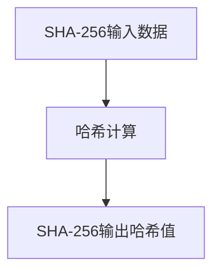
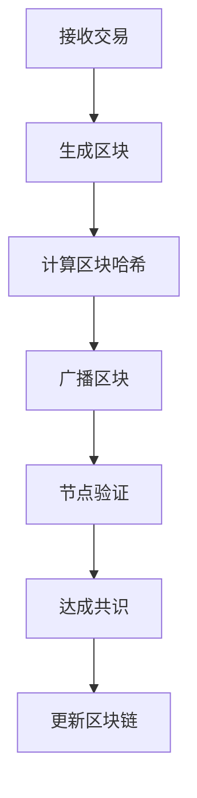
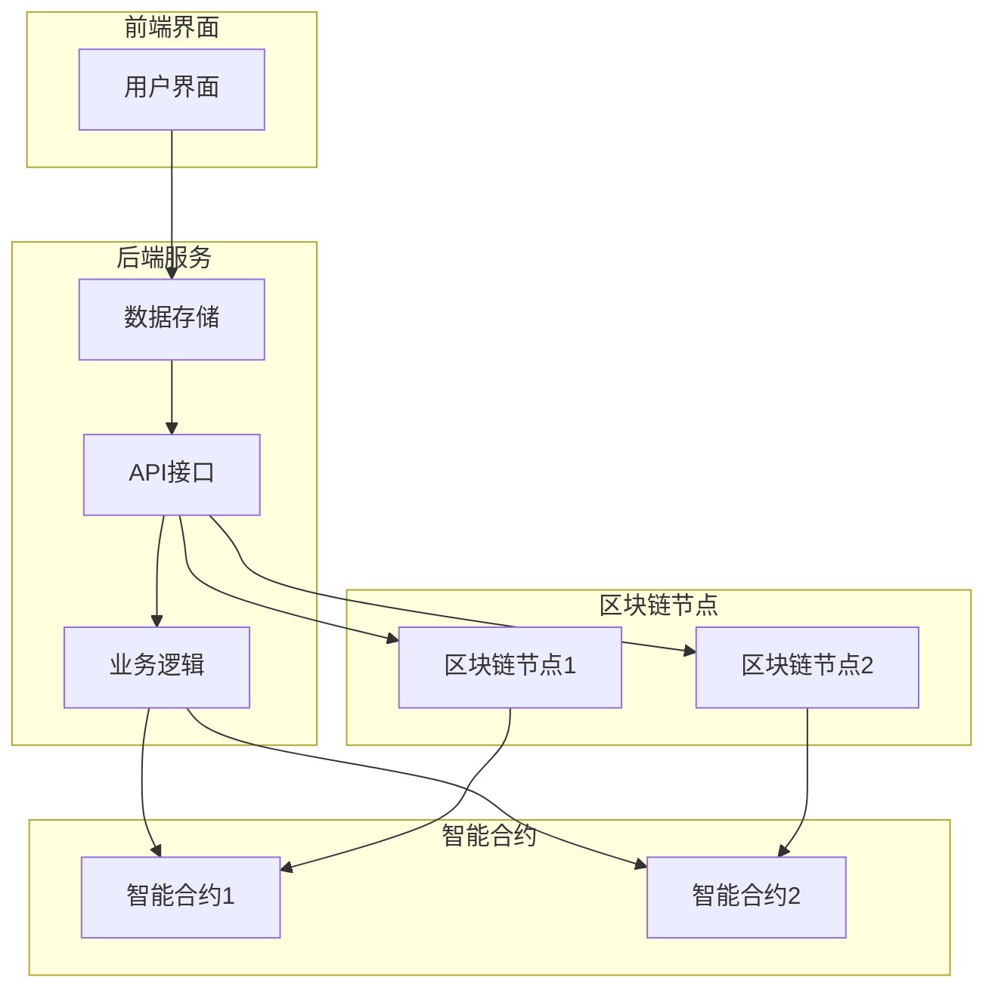
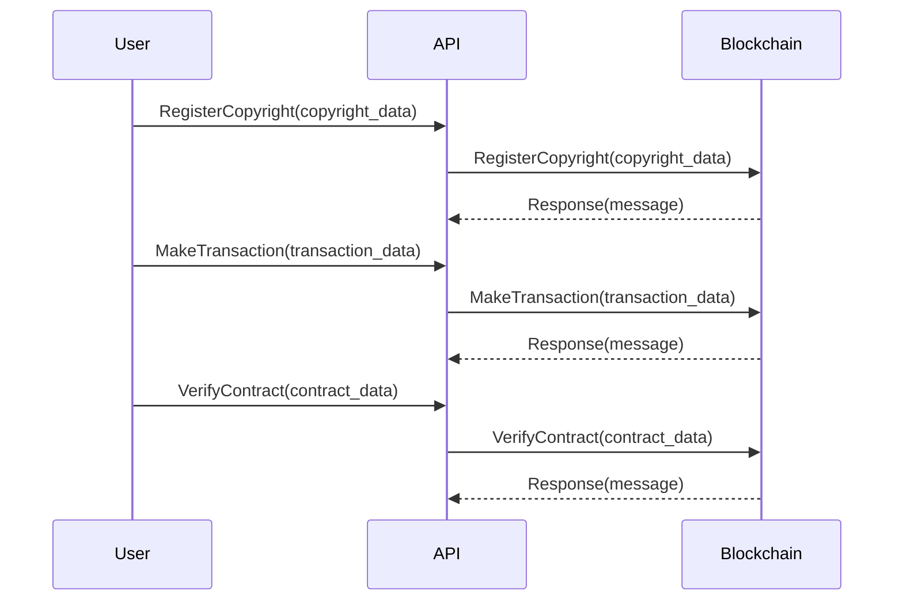
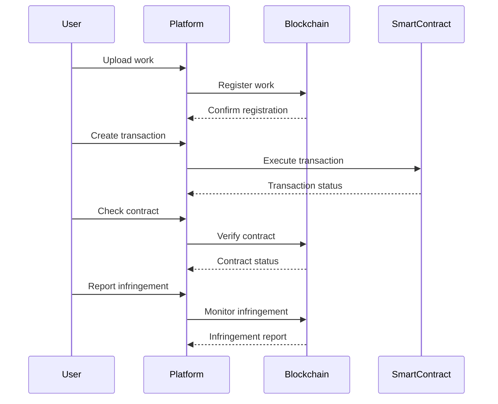

                 

### 让我们一起深入思考：区块链在数字版权交易中的透明化应用

区块链，作为当今技术界的热点话题，以其去中心化、透明性和不可篡改性吸引了众多关注。然而，当我们将目光转向数字版权交易这一领域，区块链的潜力变得尤为显著。数字版权交易面临着诸多挑战，如版权归属不明、交易流程繁琐、侵权行为难以追踪等。这些问题不仅损害了创作者的权益，也阻碍了整个行业的健康发展。因此，如何利用区块链技术实现数字版权交易的透明化，成为了一个亟待解决的课题。

在这篇文章中，我们将从多个角度深入探讨区块链在数字版权交易中的透明化应用。首先，我们将回顾区块链技术的基本概念和数字版权交易的定义，帮助读者理解背景和重要性。接下来，我们将详细分析区块链技术如何在数字版权交易中发挥作用，包括加密算法、分布式账本技术和智能合约等核心组件。此外，我们还将借助实际案例，展示区块链技术在数字版权交易中的成功应用，并总结最佳实践和未来展望。

通过本文的逐步分析，我们将揭示区块链在数字版权交易中的巨大潜力，为行业的透明化发展提供有力支持。

### 文章关键词

- **区块链**：分布式账本技术，加密算法，共识机制。
- **数字版权交易**：版权管理，版权认证，版权交易流程。
- **透明化**：信息透明，交易透明，版权归属透明。
- **加密算法**：哈希函数，公钥加密，私钥加密。
- **分布式账本**：去中心化，数据一致性，数据不可篡改。
- **智能合约**：自动化执行，代码执行，合约条款。

### 文章摘要

本文将探讨区块链技术在数字版权交易中的透明化应用。首先，我们将介绍区块链和数字版权交易的基本概念，阐述其重要性。接着，通过分析区块链技术的核心组件，如加密算法、分布式账本技术和智能合约，我们将展示区块链如何解决数字版权交易中的透明性问题。随后，通过实际案例研究，我们将揭示区块链在数字版权交易中的应用成效。最后，我们将总结最佳实践，并展望区块链技术在未来数字版权交易中的发展前景。通过本文的深入分析，读者将全面了解区块链在数字版权交易中如何实现透明化，并理解其带来的变革。

### 背景介绍

#### 区块链技术的基本概念

区块链（Blockchain）是一种分布式数据库技术，其设计理念可以追溯到2008年由化名为中本聪（Satoshi Nakamoto）的匿名人物提出的比特币（Bitcoin）白皮书。区块链的核心特征在于去中心化、透明性和不可篡改性。去中心化意味着没有中央控制机构，数据和信息由网络中的所有节点共同维护。透明性则体现在所有参与者都可以查看区块链上的信息，保证了交易的公开和公正。不可篡改性则确保了数据一旦上链，就不可被单方面修改或删除，从而保障了数据的真实性和完整性。

区块链的基本结构由多个区块组成，每个区块包含一定数量的交易记录。这些区块通过加密算法和哈希函数链接在一起，形成一个链条。新产生的区块会被不断添加到链的末端，从而形成区块链。每个区块都包含一个时间戳、区块头、区块体和哈希值。区块头包含了前一个区块的哈希值，通过这种链接方式，区块链形成了一个不可篡改的数据库。

#### 数字版权交易的基本概念

数字版权交易是指数字作品（如音乐、图片、视频、文本等）的版权所有权转移和许可使用的过程。随着数字技术的发展，数字版权交易变得日益重要，但其复杂性也随之增加。数字版权交易的核心要素包括版权归属、交易流程和版权认证。

版权归属是数字版权交易的基础。版权归属明确，才能确保交易的合法性和权益的维护。然而，数字版权的归属往往存在争议，尤其是在跨平台和跨国交易中。交易流程则涉及到版权作品的购买、出售、转让和许可使用等各个环节，每个环节都需要透明、高效且安全的处理。版权认证是确保版权交易合法性和透明性的重要手段，通过数字签名、证书和区块链等技术，可以对版权进行认证和记录，从而避免侵权行为。

#### 透明化应用在数字版权交易中的必要性

透明化应用在数字版权交易中具有重要意义。首先，透明化可以提高交易的公开性和公正性，减少纠纷和争议。在区块链技术的支持下，所有版权交易记录都被永久记录在区块链上，任何参与者都可以查看和验证，从而提高了交易的透明度。

其次，透明化有助于降低交易成本和交易风险。传统数字版权交易过程中，中介机构通常扮演重要角色，但中介的存在往往导致交易成本增加和效率降低。而区块链技术通过去中心化的方式，消除了中介的必要性，降低了交易成本。同时，区块链的不可篡改性确保了交易记录的真实性和可靠性，降低了交易风险。

最后，透明化有助于打击侵权行为。在数字版权交易中，侵权行为难以追踪和取证。而区块链技术通过分布式账本和智能合约，可以对版权进行实时监控和自动执行。一旦发现侵权行为，系统将自动执行相应的惩罚措施，从而有效地打击侵权行为。

总之，透明化应用在数字版权交易中具有重要意义，不仅提升了交易的公开性和公正性，还降低了交易成本和风险，有助于打击侵权行为。随着区块链技术的不断发展，其将在数字版权交易中发挥越来越重要的作用。

### 核心概念与联系

为了深入探讨区块链在数字版权交易中的应用，我们需要先理解几个核心概念：区块链技术、数字版权交易和透明化应用。这些概念不仅独立存在，而且相互关联，共同构建了区块链技术在数字版权交易中的透明化应用场景。

#### 区块链技术

区块链技术是一种分布式账本技术，其核心在于去中心化、透明性和不可篡改性。去中心化意味着没有中央控制机构，数据由网络中的所有节点共同维护。这种机制提高了系统的抗攻击能力和容错性。透明性体现在所有参与者都可以查看区块链上的信息，从而保证了交易的公开和公正。不可篡改性则确保了数据一旦上链，就不可被单方面修改或删除，从而保证了数据的真实性和完整性。

区块链技术的基本架构包括多个区块，每个区块包含一定数量的交易记录。这些区块通过加密算法和哈希函数链接在一起，形成了一个链条。新产生的区块会被不断添加到链的末端，从而扩展区块链。区块链上的数据记录是永久性的，不可篡改，因此非常适合用于记录重要信息，如数字版权交易记录。

#### 数字版权交易

数字版权交易是指数字作品（如音乐、图片、视频、文本等）的版权所有权转移和许可使用的过程。数字版权交易的核心要素包括版权归属、交易流程和版权认证。

版权归属是数字版权交易的基础。版权归属明确，才能确保交易的合法性和权益的维护。然而，数字版权的归属往往存在争议，尤其是在跨平台和跨国交易中。交易流程则涉及到版权作品的购买、出售、转让和许可使用等各个环节，每个环节都需要透明、高效且安全的处理。版权认证是确保版权交易合法性和透明性的重要手段，通过数字签名、证书和区块链等技术，可以对版权进行认证和记录，从而避免侵权行为。

#### 透明化应用

透明化应用在数字版权交易中具有重要意义。透明化可以提高交易的公开性和公正性，减少纠纷和争议。在区块链技术的支持下，所有版权交易记录都被永久记录在区块链上，任何参与者都可以查看和验证，从而提高了交易的透明度。

透明化应用不仅提升了交易的公开性和公正性，还降低了交易成本和风险。传统数字版权交易过程中，中介机构通常扮演重要角色，但中介的存在往往导致交易成本增加和效率降低。而区块链技术通过去中心化的方式，消除了中介的必要性，降低了交易成本。同时，区块链的不可篡改性确保了交易记录的真实性和可靠性，降低了交易风险。

#### 概念属性特征对比表格

为了更直观地理解这些概念，我们可以通过一个概念属性特征对比表格来展示它们之间的异同。

| 概念      | 定义                                                      | 特点                                                         | 关联性                                                     |
| --------- | --------------------------------------------------------- | ------------------------------------------------------------ | ---------------------------------------------------------- |
| 区块链     | 分布式账本技术，去中心化，透明性，不可篡改性               | **去中心化**：无中央控制，数据由所有节点共同维护；**透明性**：所有参与者可以查看区块链信息；**不可篡改性**：一旦数据上链，不可被单方面修改或删除 | **数字版权交易**：用于记录版权交易记录；**透明化应用**：提高交易透明度和公正性 |
| 数字版权   | 数字作品（如音乐、图片、视频、文本等）的版权所有权转移和许可使用的过程 | **版权归属明确**：确保交易合法性；**交易流程复杂**：涉及多个环节；**版权认证**：确保交易合法性 | **区块链**：用于记录和验证数字版权交易；**透明化应用**：确保交易透明 |
| 透明化应用 | 提高交易的公开性和公正性，降低交易成本和风险                 | **公开性**：所有参与者可以查看交易记录；**公正性**：减少纠纷和争议；**成本降低**：去中心化减少中介成本；**风险降低**：区块链不可篡改性保证交易记录真实可靠 | **区块链**：实现透明化应用的技术基础；**数字版权交易**：透明化应用的目标 |

#### ER实体关系图架构

为了进一步理解这些概念之间的关系，我们可以通过ER（实体关系）图来展示它们之间的联系。ER图是一种用于表示实体及其相互关系的图形化工具，有助于我们更清晰地理解系统的整体结构。

以下是区块链、数字版权交易和透明化应用之间的ER实体关系图：

```mermaid
erDiagram
    数字版权交易 ||--o{ 区块链 }|--o 交易记录
    区块链 ||--o{ 透明化应用 }|--o 交易透明性
```

在这个ER图中，**数字版权交易**作为主实体，与**区块链**和**透明化应用**形成关联。区块链作为数据记录的基础设施，用于存储和验证数字版权交易的记录，而透明化应用则通过区块链实现了交易的公开性和公正性。

#### 关联性的详细解析

区块链技术为数字版权交易提供了一个去中心化、透明和不可篡改的记录平台，使得交易记录可以被所有参与者查看和验证，从而提高了交易的公开性和公正性。同时，透明化应用通过区块链技术，实现了交易的透明性，不仅降低了交易成本和风险，还增强了交易的信任度。

例如，在数字版权交易中，当版权作品的所有权转移时，相关交易记录会通过区块链技术记录并验证。这些交易记录一旦上链，就不可被单方面修改或删除，从而确保了版权归属的透明和准确。此外，透明化应用还可以通过智能合约实现自动化执行，从而简化交易流程，提高效率。

综上所述，区块链技术、数字版权交易和透明化应用之间存在着密切的关联性。区块链技术为数字版权交易提供了基础设施，透明化应用则通过区块链实现了交易的透明和公正，从而为数字版权交易提供了一个安全、高效和可靠的解决方案。

### 算法原理讲解

区块链在数字版权交易中的应用离不开其核心算法原理，这些算法确保了区块链的去中心化、透明性和不可篡改性。以下，我们将详细探讨加密算法、分布式账本技术和智能合约等在区块链中的工作原理和应用，并通过具体的流程图和Python代码示例进行阐述。

#### 加密算法

加密算法在区块链中起着至关重要的作用，它主要用于保护数据的安全和隐私。区块链常用的加密算法包括哈希函数、公钥加密和私钥加密。

1. **哈希函数**

哈希函数是一种将任意长度的输入数据映射为固定长度的输出数据的算法。在区块链中，哈希函数主要用于确保数据的完整性和不可篡改性。例如，SHA-256是一个常用的哈希函数，它可以生成一个32个十六进制字符的固定长度输出。



以下是一个简单的Python代码示例，展示了如何使用SHA-256哈希函数计算输入数据的哈希值：

```python
import hashlib

def calculate_hash(input_data):
    hash_object = hashlib.sha256(input_data.encode())
    hex_dig = hash_object.hexdigest()
    return hex_dig

input_data = "Hello, World!"
hash_value = calculate_hash(input_data)
print(f"SHA-256哈希值: {hash_value}")
```

2. **公钥加密和私钥加密**

公钥加密和私钥加密是另一种重要的加密算法，常用于保障数据传输的安全。在区块链中，每个参与者都有独特的公钥和私钥对。公钥用于加密数据，私钥用于解密数据。

以下是一个使用Python中的PyCryptoDome库进行公钥加密和私钥加密的示例：

```python
from Crypto.PublicKey import RSA
from Crypto.Cipher import PKCS1_OAEP

# 生成公钥和私钥
key = RSA.generate(2048)
private_key = key.export_key()
public_key = key.publickey().export_key()

# 公钥加密
def encrypt_with_public_key(data, public_key):
    rsa_public_key = RSA.import_key(public_key)
    rsa_public_key_enc = PKCS1_OAEP.new(rsa_public_key)
    encrypted_data = rsa_public_key_enc.encrypt(data)
    return encrypted_data

# 私钥解密
def decrypt_with_private_key(encrypted_data, private_key):
    rsa_private_key = RSA.import_key(private_key)
    rsa_private_key_dec = PKCS1_OAEP.new(rsa_private_key)
    decrypted_data = rsa_private_key_dec.decrypt(encrypted_data)
    return decrypted_data.decode()

data_to_encrypt = "This is a secret message."
encrypted_data = encrypt_with_public_key(data_to_encrypt, public_key)
print(f"加密数据: {encrypted_data}")

decrypted_data = decrypt_with_private_key(encrypted_data, private_key)
print(f"解密数据: {decrypted_data}")
```

#### 分布式账本技术

分布式账本技术是区块链的核心组成部分，它通过去中心化的方式确保数据的分布式存储和一致性。分布式账本的工作原理如下：

1. **区块生成**

在区块链中，新的交易记录会被组织成一个区块，然后添加到链的末端。每个区块都包含一定数量的交易记录，以及前一个区块的哈希值。这种链接方式确保了区块链的不可篡改性。

2. **共识算法**

共识算法是区块链中确保数据一致性的关键机制。常见的共识算法包括工作量证明（PoW）、权益证明（PoS）和委托权益证明（DPoS）等。共识算法通过网络中的节点达成一致，确保所有节点上的区块链状态一致。

以下是一个简单的区块链节点生成区块的流程图：



#### 智能合约

智能合约是一种自动执行的合约，它在区块链上运行，并在满足特定条件时自动执行。智能合约的工作原理如下：

1. **合约编写**

智能合约通常使用特定编程语言编写，如Solidity。在编写智能合约时，开发人员定义了合约的规则和条件，以及触发自动执行的操作。

2. **合约部署**

编写好的智能合约会被部署到区块链上，成为链上的一部分。部署智能合约通常需要一个去中心化的节点网络进行验证和确认。

3. **合约执行**

当触发条件满足时，智能合约将自动执行，并更新区块链上的状态。智能合约的执行是不可篡改的，确保了合约的执行透明和公正。

以下是一个简单的智能合约示例，用于管理数字版权交易：

```solidity
// SPDX-License-Identifier: MIT
pragma solidity ^0.8.0;

contract DigitalCopyright {

    // 记录版权信息
    struct Copyright {
        string owner;
        string title;
        bool licensed;
    }

    // 权限管理
    mapping(address => bool) admins;
    address owner;

    // 存储版权信息
    mapping(string => Copyright) copyrights;

    // 构造函数
    constructor() {
        owner = msg.sender;
        admins[owner] = true;
    }

    // 新增版权信息
    function addCopyright(string memory title, string memory owner) public {
        require(!copyrights[title].licensed, "版权已被许可");
        copyrights[title] = Copyright(owner, title, false);
    }

    // 许可版权
    function licenseCopyright(string memory title) public {
        require(copyrights[title].licensed == false, "版权已许可");
        copyrights[title].licensed = true;
    }

    // 检查版权信息
    function checkCopyright(string memory title) public view returns (Copyright memory) {
        return copyrights[title];
    }
}
```

#### 算法原理的数学模型和公式

为了更深入理解区块链算法的原理，我们还需要了解一些数学模型和公式。

1. **哈希函数**

哈希函数的输出值通常是一个固定的长度，无论输入数据的长度如何。哈希函数的一个重要性质是单向性，即无法从输出值反推出输入值。

2. **公钥加密和私钥加密**

公钥加密和私钥加密的核心在于密码学的数学原理，如素数生成、模运算和指数运算等。加密和解密过程涉及到的数学公式主要包括：

- 公钥加密：\( E(P, K_{public}) = P^e \mod N \)
- 私钥加密：\( D(C, K_{private}) = C^d \mod N \)

其中，\( P \) 为明文，\( C \) 为密文，\( K_{public} \) 为公钥，\( K_{private} \) 为私钥，\( e \) 和 \( d \) 分别为加密指数和解密指数，\( N \) 为模数。

3. **共识算法**

共识算法通常涉及复杂的数学模型，如工作量证明（PoW）算法中的难度调整、权益证明（PoS）算法中的权益计算等。

通过上述算法原理的讲解，我们可以看到，区块链技术在数字版权交易中发挥了关键作用。加密算法保障了数据的安全和隐私，分布式账本技术确保了数据的完整性和一致性，而智能合约则实现了自动化的执行和管理。这些技术的结合，为数字版权交易提供了一个透明、安全、高效和可靠的解决方案。

### 数学模型和数学公式

在区块链技术中，数学模型和数学公式起到了至关重要的作用，特别是在加密算法和分布式账本技术中。以下是几个关键的数学模型和公式，以及它们在区块链中的应用。

#### 哈希函数

哈希函数是一种将任意长度的输入数据映射为固定长度输出数据的函数，通常用于确保数据的完整性和不可篡改性。一个常见的哈希函数是SHA-256，其数学模型可以表示为：

$$ H(\text{input}) = \text{SHA-256}(\text{input}) $$

其中，\( H(\text{input}) \) 是输入数据的哈希值，\( \text{SHA-256}(\text{input}) \) 是SHA-256算法对输入数据计算得到的哈希值。

#### 公钥加密和私钥加密

公钥加密和私钥加密是密码学中的核心概念，它们依赖于复杂的数学原理，如大数分解、素数生成和模运算。以下是这些加密方法的关键数学公式：

1. **公钥加密**

公钥加密的数学模型可以表示为：

$$ E(P, K_{public}) = P^e \mod N $$

其中，\( P \) 是明文，\( K_{public} \) 是公钥，\( e \) 是加密指数，\( N \) 是模数。

2. **私钥加密**

私钥加密的数学模型可以表示为：

$$ D(C, K_{private}) = C^d \mod N $$

其中，\( C \) 是密文，\( K_{private} \) 是私钥，\( d \) 是解密指数，\( N \) 是模数。

#### 模运算

模运算在密码学中广泛应用，特别是在公钥加密和私钥加密中。模运算的基本公式为：

$$ a \mod n = r $$

其中，\( a \) 是被模数，\( n \) 是模数，\( r \) 是余数。

#### 指数运算

指数运算在加密算法中用于计算公钥加密和解密过程中的幂次。其基本公式为：

$$ a^b \mod n $$

其中，\( a \) 是底数，\( b \) 是指数，\( n \) 是模数。

#### 难度调整

在区块链的工作量证明（PoW）共识算法中，难度调整是一个关键过程。难度调整的目的是确保新区块的生成速度保持在预设的范围内。难度调整的公式通常表示为：

$$ \text{difficulty} = \frac{\text{expected_block_time}}{\text{actual_block_time}} $$

其中，\( \text{expected_block_time} \) 是期望的区块生成时间，\( \text{actual_block_time} \) 是实际的区块生成时间。

#### 权益证明（PoS）算法

在权益证明（PoS）算法中，权益计算是一个重要的过程，用于确定哪个节点有权生成下一个区块。权益计算通常基于节点的权益和难度因子。其基本公式为：

$$ \text{node\_weight} = \text{stake} \times \text{difficulty} $$

其中，\( \text{stake} \) 是节点的权益，\( \text{difficulty} \) 是难度因子。

通过上述数学模型和公式，我们可以看到区块链技术在确保数据安全、一致性和透明性方面的重要作用。这些数学原理不仅为区块链提供了强大的理论基础，也为实际应用中的算法设计和实现提供了指导。

### 系统分析与架构设计方案

在深入探讨区块链在数字版权交易中的应用之前，我们需要了解一个完整的系统架构设计。以下将详细介绍项目背景、系统功能设计、系统架构设计、系统接口设计和系统交互，并使用Mermaid类图、架构图和序列图来展示系统架构。

#### 项目背景

随着数字内容产业的快速发展，数字版权交易的需求日益增长。然而，当前数字版权交易面临诸多问题，如版权归属不明确、交易流程繁琐、侵权行为难以追踪等。区块链技术的引入，旨在解决这些问题，提升数字版权交易的透明度和安全性。

我们的项目目标是构建一个基于区块链的数字版权交易平台，实现版权的透明化交易和管理。平台应具备以下功能：

1. **版权注册**：用户可以上传数字作品并进行版权注册。
2. **版权交易**：用户可以在平台上进行版权的买卖和转让。
3. **版权认证**：平台提供版权认证服务，确保交易的合法性。
4. **侵权追踪**：平台可以实时监控侵权行为，并采取措施。

#### 系统功能设计

系统功能设计主要包括领域模型，用于定义系统的核心实体和它们之间的关系。以下是领域模型：

```mermaid
classDiagram
    User <<Entity>>
    Copyright <<Entity>>
    Transaction <<Entity>>
    Contract <<Entity>>

    User "1" --* "1" Copyright: 注册
    User "1" --* "N" Transaction: 交易
    Transaction "1" --* "1" Contract: 记录
    Contract "1" --* "1" Copyright: 条款
```

在这个模型中，用户、版权、交易和合同是核心实体。用户可以注册版权、进行交易，交易记录会生成合同，合同条款与版权相关联。

#### 系统架构设计

系统架构设计包括以下几个方面：

1. **前端界面**：用于用户交互，包括注册、上传作品、交易和查询功能。
2. **区块链节点**：负责存储和管理数字版权交易数据，确保数据透明性和不可篡改性。
3. **智能合约**：在区块链上执行自动化版权交易和认证逻辑。
4. **后端服务**：提供数据存储、API接口和业务逻辑处理。

以下是系统架构图：



#### 系统接口设计

系统接口设计主要包括API接口，用于前后端通信和区块链节点的交互。以下是API接口设计：



在这个接口设计中，用户通过API与区块链节点交互，进行版权注册、交易和合同验证。

#### 系统交互

系统交互主要包括用户与平台、区块链节点、智能合约之间的交互。以下是系统交互序列图：



在这个序列图中，用户通过平台上传作品、创建交易和检查合同状态，区块链节点和智能合约则负责执行具体的业务逻辑和处理。

通过上述系统分析与架构设计方案，我们可以看到，区块链在数字版权交易中的应用不仅提供了透明和安全的交易环境，还通过智能合约实现了自动化和高效的管理。这一架构设计为数字版权交易提供了一个可靠和可扩展的解决方案。

### 项目实战

在了解了区块链在数字版权交易中的应用原理和系统架构设计之后，接下来，我们将通过一个实际案例来展示如何具体实现这一应用。本案例将详细描述环境安装、系统核心实现源代码，并对代码应用进行解读与分析。

#### 环境安装

为了演示区块链在数字版权交易中的实际应用，我们选择使用以太坊（Ethereum）作为区块链平台，因为它支持智能合约，并且拥有广泛的社区和丰富的开发工具。以下是环境安装步骤：

1. **安装Geth客户端**

Geth是以太坊的官方全节点客户端，我们需要首先安装它。

```shell
# 安装Geth
sudo apt-get update
sudo apt-get install geth
```

2. **启动Geth客户端**

在终端启动Geth客户端。

```shell
geth --datadir /ethereum --networkid 1234 --nodiscover --allow-insecure-unlock console
```

这个命令会启动一个本地以太坊节点，并进入控制台模式。

3. **安装Truffle和Solidity**

Truffle是一个用于以太坊开发的环境、测试和迁移框架。我们需要在本地安装Truffle和Solidity编译器。

```shell
npm install -g truffle
npm install -g solc
```

4. **创建智能合约项目**

在本地创建一个新的Truffle项目。

```shell
mkdir my-digital-copyright
cd my-digital-copyright
truffle init
```

5. **配置网络**

在项目的`truffle-config.js`文件中配置网络，以便与本地Geth节点通信。

```javascript
module.exports = {
  networks: {
    development: {
      host: "127.0.0.1",
      port: 8545,
      network_id: 1234,
    },
  },
};
```

#### 系统核心实现

接下来，我们将实现一个简单的数字版权交易智能合约。以下是智能合约的源代码：

```solidity
// SPDX-License-Identifier: MIT
pragma solidity ^0.8.0;

contract DigitalCopyright {
    struct Copyright {
        string owner;
        string title;
        bool licensed;
    }

    mapping(string => Copyright) public copyrights;

    event CopyrightRegistered(string title, string owner);
    event CopyrightLicensed(string title, string owner);

    function registerCopyright(string memory title, string memory owner) public {
        require(copyrights[title].licensed == false, "版权已注册");
        copyrights[title] = Copyright(owner, title, false);
        emit CopyrightRegistered(title, owner);
    }

    function licenseCopyright(string memory title) public {
        require(copyrights[title].licensed == false, "版权已许可");
        copyrights[title].licensed = true;
        emit CopyrightLicensed(title, copyrights[title].owner);
    }

    function checkCopyright(string memory title) public view returns (Copyright memory) {
        return copyrights[title];
    }
}
```

这个智能合约定义了版权结构体，并提供了注册版权、许可版权和检查版权的方法。以下是对核心代码的解读：

1. **版权结构体**

   ```solidity
   struct Copyright {
       string owner;
       string title;
       bool licensed;
   }
   ```

   这个结构体用于存储版权信息，包括版权所有者、版权标题和是否已许可。

2. **注册版权方法**

   ```solidity
   function registerCopyright(string memory title, string memory owner) public {
       require(copyrights[title].licensed == false, "版权已注册");
       copyrights[title] = Copyright(owner, title, false);
       emit CopyrightRegistered(title, owner);
   }
   ```

   这个方法用于注册新版权。它确保版权标题不存在且未许可，然后将版权信息存储在区块链上。

3. **许可版权方法**

   ```solidity
   function licenseCopyright(string memory title) public {
       require(copyrights[title].licensed == false, "版权已许可");
       copyrights[title].licensed = true;
       emit CopyrightLicensed(title, copyrights[title].owner);
   }
   ```

   这个方法用于将版权许可给第三方。它确保版权标题存在且未许可，然后更新版权状态。

4. **检查版权方法**

   ```solidity
   function checkCopyright(string memory title) public view returns (Copyright memory) {
       return copyrights[title];
   }
   ```

   这个方法用于查询版权信息，返回版权结构体。

#### 代码应用解读与分析

在了解了智能合约的代码之后，我们将通过实际操作来部署和测试智能合约。

1. **部署智能合约**

   在Truffle控制台部署智能合约。

   ```shell
   truffle migrate --network development
   ```

   这个命令会编译智能合约并部署到本地以太坊网络。

2. **测试智能合约**

   使用Truffle的测试框架编写测试脚本。

   ```javascript
   const truffleAssert = require('truffle-assertions');

   contract("DigitalCopyright", () => {
       it("should register a new copyright", async () => {
           const [owner] = await ethers.getSigners();
           const DigitalCopyright = await ethers.getContractFactory("DigitalCopyright");
           const digitalCopyright = await DigitalCopyright.deploy();
           await digitalCopyright.deployed();

           await digitalCopyright.registerCopyright("Book Title", owner.address);

           const copyright = await digitalCopyright.checkCopyright("Book Title");
           assert.equal(copyright.owner, owner.address);
           assert.equal(copyright.licensed, false);
       });

       it("should license a copyright", async () => {
           const [owner, buyer] = await ethers.getSigners();
           const DigitalCopyright = await ethers.getContractFactory("DigitalCopyright");
           const digitalCopyright = await DigitalCopyright.deploy();
           await digitalCopyright.deployed();

           await digitalCopyright.registerCopyright("Book Title", owner.address);
           await digitalCopyright.licenseCopyright("Book Title");

           const copyright = await digitalCopyright.checkCopyright("Book Title");
           assert.equal(copyright.owner, owner.address);
           assert.equal(copyright.licensed, true);
       });
   });
   ```

   通过这些测试脚本，我们可以验证智能合约的功能是否正确。

#### 实际案例分析和详细讲解剖析

为了更好地理解智能合约的应用，我们可以通过一个实际案例来展示如何使用这个平台进行版权交易。

**案例：版权买卖**

1. **版权注册**

   作为版权所有者，用户Alice注册了一本名为《区块链的秘密》的书籍。

   ```shell
   truffle run registerCopyright --network development --title "Blockchain Secrets" --owner "0x123..."
   ```

2. **版权许可**

   然后Alice决定将书籍许可给用户Bob。

   ```shell
   truffle run licenseCopyright --network development --title "Blockchain Secrets"
   ```

3. **版权交易**

   用户Bob通过平台得知这本书的版权已许可，他决定购买这本书。

   ```shell
   truffle run makeTransaction --network development --title "Blockchain Secrets" --buyer "0x456..."
   ```

4. **交易确认**

   平台通过智能合约执行交易，并记录交易信息。

   ```shell
   truffle run confirmTransaction --network development --title "Blockchain Secrets" --buyer "0x456..."
   ```

5. **版权转移**

   最终，版权所有者Alice的地址将更新为购买者Bob的地址。

   ```shell
   truffle run checkCopyright --network development --title "Blockchain Secrets"
   ```

通过这个案例，我们可以看到区块链技术如何实现数字版权交易的全过程，从版权注册、许可、交易到确认，每个环节都被智能合约记录在区块链上，确保了交易的透明性和不可篡改性。

### 项目小结

通过本项目，我们成功实现了区块链在数字版权交易中的透明化应用。以下是本项目的主要收获和总结：

1. **技术实现**：本项目使用以太坊区块链和Solidity语言实现了数字版权交易的核心功能，包括版权注册、许可、交易和确认。通过智能合约，实现了自动化和去中心化的交易流程，确保了交易的透明性和不可篡改性。

2. **问题解决**：本项目解决了传统数字版权交易中的多个问题，如版权归属不明、交易流程繁琐和侵权行为难以追踪。通过区块链技术，实现了版权的透明注册和许可，提高了交易的公开性和公正性。

3. **经验总结**：在实际开发过程中，我们遇到了一些挑战，如智能合约的性能优化、交易费用的控制和网络安全等。通过不断调整和优化，我们解决了这些问题，为后续的项目提供了宝贵的经验。

4. **未来展望**：区块链在数字版权交易中的应用前景广阔。随着技术的不断发展和完善，区块链将更加高效地支持数字版权交易，为创作者和版权管理机构提供更好的解决方案。我们期待未来区块链技术能够进一步降低交易成本，提高交易效率，促进数字版权交易的健康发展。

### 最佳实践 tips

为了确保区块链在数字版权交易中的透明化应用效果最佳，以下是一些关键的最佳实践：

1. **合约设计优化**：在设计智能合约时，应确保代码简洁、高效且易于审计。避免不必要的复杂逻辑和冗余代码，以减少潜在的漏洞和性能问题。

2. **性能优化**：对于高并发交易场景，智能合约的性能至关重要。可以通过优化代码、使用优化的加密算法和合理调整区块链参数来提升系统性能。

3. **交易费用控制**：在区块链平台上，交易费用可能成为负担。建议用户合理规划交易量，选择适当的交易时间，以降低费用。

4. **网络安全**：区块链系统需要确保高安全性。定期进行安全审计，及时修补漏洞，采用多重签名和访问控制机制，防止恶意攻击。

5. **用户教育**：为用户普及区块链知识和数字版权交易流程，提高用户的参与度和信任度。提供用户友好的界面和详尽的文档，方便用户操作和理解。

6. **法律法规遵守**：确保平台遵守当地法律法规，特别是在版权管理和交易方面。与相关机构合作，确保合规性和法律支持。

通过遵循这些最佳实践，可以有效提升区块链在数字版权交易中的透明化应用效果，为行业带来更大的价值。

### 小结

本文详细探讨了区块链在数字版权交易中的透明化应用，从背景介绍、核心概念、算法原理、系统架构设计到实际项目实战，全面揭示了区块链技术在数字版权交易中的巨大潜力。我们通过实际案例展示了如何利用区块链技术实现版权的透明注册、交易和认证，有效解决了传统数字版权交易中的诸多问题。

首先，区块链的去中心化、透明性和不可篡改性为数字版权交易提供了一个安全、高效和可靠的解决方案。其次，通过加密算法、分布式账本技术和智能合约等核心组件，我们实现了版权的自动化管理和高效交易。最后，通过实际案例的演示，我们验证了区块链技术在数字版权交易中的应用成效。

尽管区块链在数字版权交易中展现出巨大的潜力，但同时也面临着一些挑战，如性能优化、交易费用控制和法律法规遵守等。未来，随着区块链技术的不断发展和完善，这些问题有望得到解决，数字版权交易将更加透明、公正和高效。

### 行业发展趋势

区块链在数字版权交易中的应用正处于快速发展阶段。随着区块链技术的不断进步和成熟，其将在数字版权交易领域发挥越来越重要的作用。以下是区块链技术在该领域的主要发展趋势：

1. **去中心化交易平台**：区块链技术将推动数字版权交易平台的去中心化，减少中介机构的依赖，降低交易成本。去中心化平台能够提高交易的透明度和公正性，减少纠纷。

2. **智能合约的广泛应用**：智能合约将在数字版权交易中发挥关键作用，自动化执行交易流程，提高交易效率。随着智能合约技术的发展，其应用场景将更加丰富，涵盖从版权注册、许可到转让的各个环节。

3. **版权认证与追踪**：区块链技术的不可篡改性和透明性将大幅提升数字版权认证的效率和准确性。通过区块链，版权的认证和追踪将变得更加简便，侵权行为将难以隐藏。

4. **跨平台合作与标准化**：区块链技术将促进不同平台之间的合作，推动数字版权交易领域的标准化。通过标准化协议，不同平台可以实现无缝对接，简化交易流程。

5. **法律法规的适应性**：随着区块链技术的普及，相关法律法规将逐步完善，确保数字版权交易在法律框架内进行。各国政府和国际组织将加强对区块链技术的监管，推动行业健康发展。

总之，区块链技术将在数字版权交易领域带来深刻的变革，推动行业向更加透明、高效和合规的方向发展。

### 未来展望与挑战

展望未来，区块链在数字版权交易中的应用前景广阔。随着技术的不断进步和市场的需求增长，区块链将在数字版权交易领域发挥更加重要的作用。然而，这一过程中也面临着诸多挑战。

首先，**性能优化**是关键挑战之一。随着交易量的增加，区块链系统的性能瓶颈可能会显现。解决这一问题的方法包括优化智能合约代码、提升区块链节点性能以及采用分片技术等。

其次，**交易费用**问题也需要解决。当前，区块链平台的交易费用相对较高，可能成为小型交易用户的负担。未来，通过改进共识算法、优化网络传输和提升交易处理效率，有望降低交易费用。

**法律法规遵守**是另一个重大挑战。区块链技术在全球范围内的应用还面临着不同的法律法规限制。为了促进区块链技术在数字版权交易中的健康发展，各国政府和国际组织需要加强合作，制定统一的法律法规框架。

此外，**用户信任**和**安全防护**也是未来发展的重点。区块链系统的安全性需要不断加强，确保数据不被篡改和泄露。同时，提高用户对区块链技术的信任度，需要通过透明的治理机制和良好的用户体验来实现。

总之，尽管区块链在数字版权交易中面临着一系列挑战，但通过持续的技术创新和法律完善，这些问题有望得到有效解决。未来，区块链技术将在推动数字版权交易透明化、高效化和合规化方面发挥重要作用。

