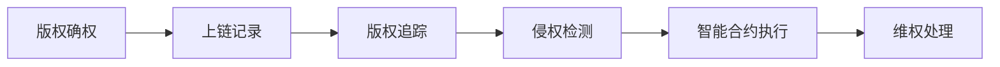

                 

### 《区块链在数字版权保护中的创新：保护创作者权益》

> 关键词：区块链、数字版权保护、创作者权益、去中心化、智能合约

> 摘要：本文探讨了区块链技术在数字版权保护中的创新应用，通过详细分析区块链的定义与特点、数字版权保护的核心概念与联系，以及区块链在数字版权保护中的应用场景，展示了区块链如何保护创作者的权益，提高版权管理的效率和透明度。文章还通过案例分析、算法原理讲解、系统分析与架构设计方案以及项目实战，全面剖析了区块链在数字版权保护中的实际应用。

### 第一部分：背景介绍

#### 1.1 问题背景

随着互联网和数字技术的飞速发展，数字内容的创作与传播变得前所未有的便捷。然而，这一便利同时也带来了严重的数字版权保护问题。创作者的权益受到侵犯，侵权行为屡见不鲜，导致版权保护难度加大。传统的版权保护机制如DRM（数字版权管理）等，由于技术局限性，已无法有效应对复杂多变的数字版权环境。

#### 1.2 问题描述

数字版权保护的核心问题包括版权确权、版权追踪、版权交易和版权维权。在数字环境中，这些问题的复杂性大大增加。具体表现为：

- **版权确权**：如何确保创作者的作品得到合法认证，防止未经授权的使用。
- **版权追踪**：如何追踪作品的传播路径，及时发现侵权行为。
- **版权交易**：如何简化版权交易流程，提高交易效率。
- **版权维权**：如何降低维权成本，提高维权成功率。

#### 1.3 问题解决

区块链技术的出现为数字版权保护提供了新的解决方案。区块链的去中心化、不可篡改和透明性，使其成为保护创作者权益的有力工具。通过区块链，可以实现：

- **版权确权**：利用区块链技术记录和存储版权信息，确保版权的权威性和不可篡改性。
- **版权追踪**：利用区块链的分布式账本，实时追踪作品的传播路径，提高侵权检测的效率。
- **版权交易**：通过智能合约自动化执行版权交易，提高交易的透明度和效率。
- **版权维权**：利用区块链的透明性和可追溯性，简化维权流程，降低维权成本。

#### 1.4 边界与外延

数字版权保护不仅涉及创作者的权益保护，还包括消费者权益的保护。在数字环境中，消费者对数字内容的获取和使用方式发生了变化，这也对数字版权保护提出了新的要求。例如，如何平衡创作者的权益和消费者的使用自由，如何确保消费者的隐私和安全等。

#### 1.5 概念结构与核心要素组成

数字版权保护的核心概念包括：

- **版权**：创作者对其智力成果所享有的专有权利。
- **区块链**：去中心化的分布式账本技术，具有不可篡改性和透明性。
- **去中心化**：去除了中心化机构的控制，所有节点均可参与网络。
- **智能合约**：自动执行合约条款的计算机协议，确保交易的安全和透明。

核心要素包括：

- **版权确权**：记录和存储版权信息，确保版权的权威性和不可篡改性。
- **版权追踪**：实时追踪作品的传播路径，提高侵权检测的效率。
- **版权交易**：自动化执行版权交易，提高交易的透明度和效率。
- **版权维权**：利用区块链的透明性和可追溯性，简化维权流程，降低维权成本。

### 第二部分：核心概念与联系

#### 2.1 区块链的定义与特点

区块链是一种去中心化的数据库技术，通过分布式网络中的多个节点共同维护一个数据库，每个节点都存储完整的数据副本。区块链具有以下特点：

- **去中心化**：去除了中心化机构的控制，所有节点均可参与网络。
- **不可篡改**：一旦数据被记录在区块链上，便无法被篡改。
- **透明性**：所有节点均可查看区块链上的数据，确保数据的透明性。
- **安全性**：利用加密算法和共识机制，保障数据的安全性和完整性。

#### 2.2 数字版权保护的核心概念

数字版权保护的核心概念包括：

- **版权**：创作者对其智力成果所享有的专有权利。
- **区块链**：去中心化的分布式账本技术，用于记录和存储版权信息。
- **智能合约**：自动执行合约条款的计算机协议，用于实现版权交易。
- **数字版权管理（DRM）**：用于控制数字内容的访问和使用。

#### 2.3 核心概念属性特征对比表格

| 概念             | 定义                                                         | 属性特征                     |
|------------------|------------------------------------------------------------|-----------------------------|
| 版权             | 创作者的智力成果权                                           | 独创性、时间性、地域性       |
| 区块链           | 去中心化的分布式账本系统                                     | 不可篡改、透明、可追溯       |
| 智能合约         | 自动执行合约条款的计算机协议                                 | 自动执行、去中心化、透明     |
| 数字版权管理（DRM）| 用于控制数字内容的访问和使用                                 | 权限管理、加密、追踪          |

#### 2.4 ER实体关系图架构

```mermaid
erDiagram
  Creator ||--|{ Work }|| Authorship
  Work ||--|{ License }|| LicenseContract
  License ||--|{ DRM }|| DigitalRightsManagement
  Work ||--|{ Distribution }|| DistributionChannel
```

### 第三部分：区块链在数字版权保护中的应用

#### 3.1 区块链在数字版权保护中的应用场景

区块链技术在数字版权保护中具有广泛的应用场景，主要包括以下几个方面：

##### 3.1.1 版权确权

创作者可以通过区块链技术对作品进行上链确权，将作品的版权信息记录在区块链上，确保版权的权威性和不可篡改性。创作者只需将作品的哈希值上链，即可证明其对作品的版权拥有权。

##### 3.1.2 版权追踪

通过区块链的分布式账本，可以实时追踪作品的传播路径，及时发现和解决侵权行为。区块链的透明性和不可篡改性，使得版权追踪更加高效和可信。

##### 3.1.3 版权交易

利用区块链的智能合约，可以实现版权的自动化交易，提高交易的透明度和效率。智能合约自动执行交易条款，确保交易的安全和公正。

##### 3.1.4 版权维权

区块链的透明性和可追溯性，为创作者提供了有力的维权工具。创作者可以快速维权，降低维权成本。区块链记录的版权信息，为维权提供了有力的证据支持。

#### 3.2 案例分析

以某知名音乐平台为例，分析区块链在数字版权保护中的应用，包括版权确权、版权追踪、版权交易和维权等具体操作。

#### 3.3 智能合约应用

详细介绍区块链在数字版权保护中智能合约的编写和应用，包括版权授权、版权转让、版权许可等。智能合约确保了版权交易的自动化和透明性，提高了版权管理的效率。

### 第四部分：算法原理讲解

#### 4.1 算法mermaid流程图



#### 4.2 算法原理

##### 4.2.1 版权确权

版权确权的过程主要包括以下几个步骤：

1. **作品哈希化**：将作品内容进行哈希处理，生成哈希值。
2. **签名验证**：创作者对哈希值进行数字签名，确保创作者身份的真实性。
3. **上链记录**：将哈希值和签名信息上传到区块链，记录版权信息。

##### 4.2.2 版权追踪

版权追踪的过程主要包括以下几个步骤：

1. **分布式账本存储**：将版权信息存储在区块链的分布式账本中。
2. **实时监控**：通过区块链节点监控版权信息的变动。
3. **侵权检测**：利用区块链的透明性和不可篡改性，实时检测侵权行为。

##### 4.2.3 版权交易

版权交易的过程主要包括以下几个步骤：

1. **智能合约编写**：根据版权交易的要求，编写智能合约。
2. **合约执行**：当交易条件满足时，智能合约自动执行，完成版权交易。
3. **交易记录**：将交易记录上链，确保交易的透明性和不可篡改性。

##### 4.2.4 版权维权

版权维权的过程主要包括以下几个步骤：

1. **侵权证据收集**：收集侵权行为的证据，包括侵权内容、侵权时间等。
2. **上链记录**：将侵权证据上传到区块链，记录侵权信息。
3. **维权处理**：根据区块链记录的侵权信息，进行维权处理，包括警告、诉讼等。

### 第五部分：系统分析与架构设计方案

#### 5.1 问题场景介绍

以数字音乐平台为例，介绍数字版权保护的问题场景。创作者在平台上发布音乐作品，消费者可以付费购买或订阅音乐，然而侵权行为频发，创作者的权益受到侵害。

#### 5.2 项目介绍

介绍一个基于区块链的数字版权保护平台，实现版权确权、追踪、交易和维权等功能，保护创作者的权益。

#### 5.3 系统功能设计

使用Mermaid类图，详细描述系统的功能设计，包括版权管理、交易管理、维权管理等功能模块。

#### 5.4 系统架构设计

使用Mermaid架构图，展示系统的整体架构设计，包括前端、后端、数据库、区块链等模块，以及各模块之间的交互关系。

#### 5.5 系统接口设计

详细描述系统的接口设计，包括版权接口、交易接口、维权接口等，以及接口的输入输出参数和返回结果。

#### 5.6 系统交互

使用Mermaid序列图，展示系统各模块之间的交互过程，包括版权确权、追踪、交易和维权等操作。

### 第六部分：项目实战

#### 6.1 环境安装

介绍搭建区块链数字版权保护平台所需的开发环境，包括区块链节点搭建、智能合约开发工具等。

#### 6.2 系统核心实现

详细讲解系统核心功能的实现，包括版权确权、追踪、交易和维权等，通过Python源代码展示实现细节。

#### 6.3 代码应用解读与分析

分析系统核心代码的实现，讲解关键算法和数据结构的使用，以及代码的优化和改进。

#### 6.4 实际案例分析和详细讲解剖析

通过实际案例，展示区块链在数字版权保护中的应用效果，详细分析案例中的问题解决方法和优化策略。

#### 6.5 项目小结

总结项目的实施过程，分析项目取得的成果和不足，为后续项目的改进提供参考。

### 第七部分：最佳实践 tips、小结、注意事项、拓展阅读等内容

#### 7.1 最佳实践 tips

分享一些区块链在数字版权保护中的最佳实践，包括版权确权的最佳时机、追踪策略的优化、交易流程的简化等。

#### 7.2 小结

总结文章的核心观点，强调区块链在数字版权保护中的重要性，以及其如何提升版权管理的效率和透明度。

#### 7.3 注意事项

提醒读者在应用区块链技术进行数字版权保护时需要注意的事项，包括数据安全性、隐私保护、合规性等。

#### 7.4 拓展阅读

推荐一些与区块链和数字版权保护相关的优秀文献、论文和技术博客，供读者进一步学习和研究。

### 作者信息

作者：AI天才研究院/AI Genius Institute & 禅与计算机程序设计艺术 /Zen And The Art of Computer Programming

[END]

