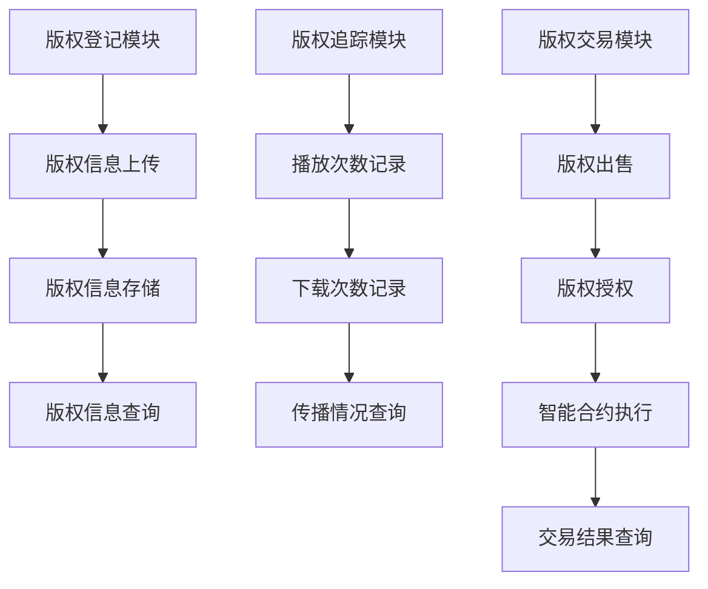
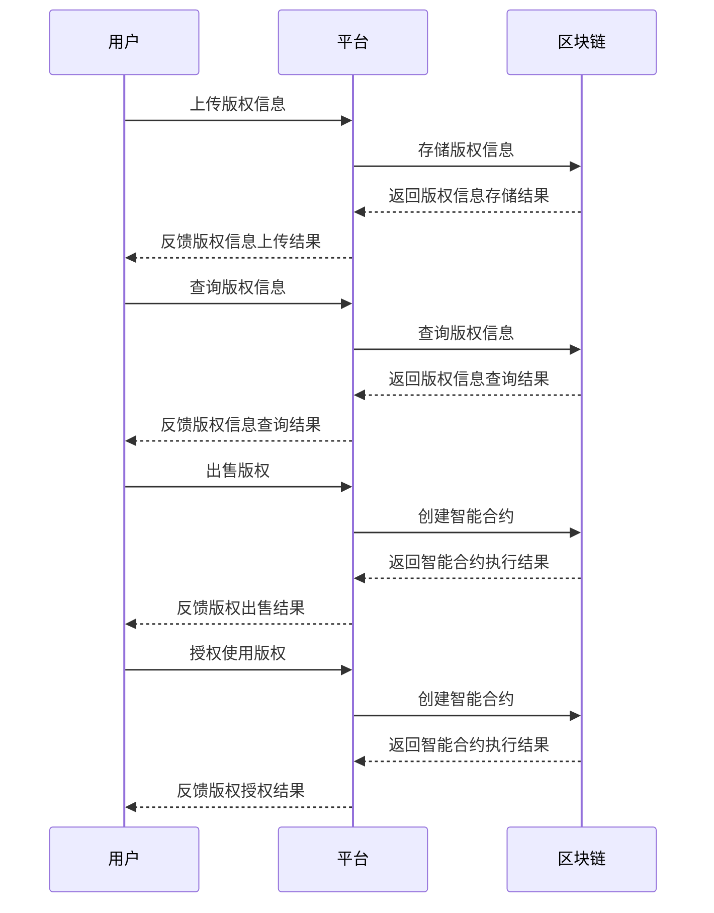
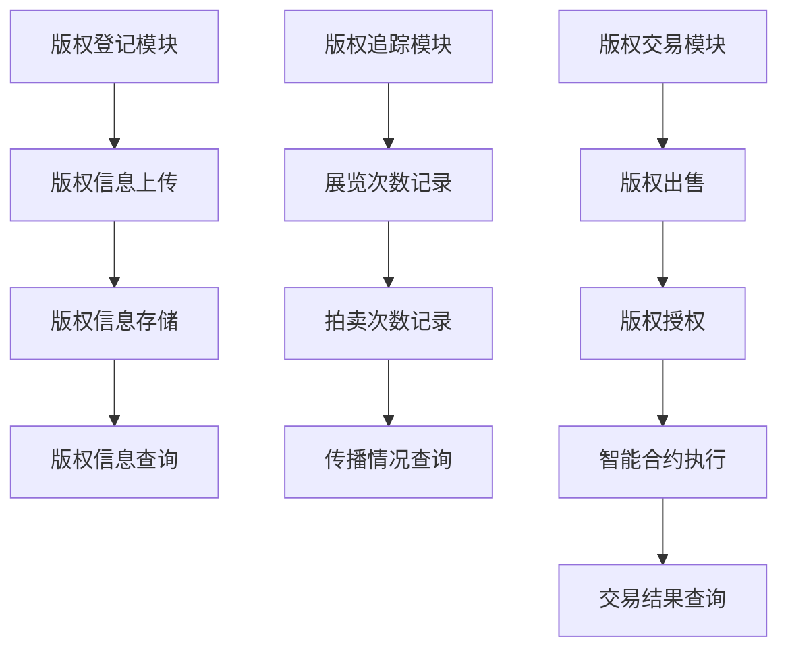

                 

### 文章标题

《区块链在数字版权保护中的新模式》

### 文章关键词

区块链，数字版权保护，智能合约，去中心化存储，数字版权追踪，版权交易

### 摘要

随着数字技术的发展，数字版权保护成为了一个重要的议题。区块链技术的兴起，为数字版权保护提供了一种新的解决方案。本文将介绍区块链在数字版权保护中的新模式，通过详细分析区块链的核心概念、应用模式、案例研究等，探讨区块链技术如何有效解决数字版权保护的问题，并对未来发展趋势进行展望。

## 引言

### 1.1 区块链技术的基本概念

区块链技术是一种去中心化的数据库技术，通过多个节点共同维护数据的一致性。区块链的基本架构包括数据块、链式结构和共识机制。数据块是区块链的基本单位，包含一定数量的交易记录；链式结构使数据块按照时间顺序链接在一起，形成一个不可篡改的数据链；共识机制则是节点之间达成一致的过程，确保区块链的可靠性和安全性。

### 1.2 数字版权保护的问题与挑战

数字版权保护面临诸多问题，包括版权认定、版权追踪、版权交易和版权维权等。传统的数字版权保护方法依赖于第三方机构或中心化平台，存在数据易篡改、交易不透明、维权困难等问题。区块链技术以其去中心化、透明性和不可篡改的特性，为解决这些问题提供了新的思路。

### 1.3 本书的目的和结构

本书旨在介绍区块链在数字版权保护中的应用，分析其核心概念、应用模式、案例研究和未来趋势。具体章节安排如下：

1. 引言：介绍区块链技术和数字版权保护的背景，以及本书的目的和结构。
2. 核心概念：讲解区块链技术的基本概念和原理，以及数字版权保护的核心概念和挑战。
3. 区块链在数字版权保护中的应用：介绍区块链技术在数字版权保护中的应用模式，以及如何实现这些模式。
4. 案例研究：分析一些实际案例，展示区块链在数字版权保护中的应用效果。
5. 结论：总结本书的主要观点，讨论区块链在数字版权保护中的未来趋势。

## 核心概念

### 2.1 区块链技术的核心概念与原理

#### 数据块

数据块是区块链的基本单位，包含一定数量的交易记录。每个数据块都有唯一的标识，通过哈希算法与前一个数据块链接，形成一个不可篡改的数据链。

#### 链式结构

链式结构是指数据块按照时间顺序链接在一起，形成一个链式结构。这种结构使得区块链中的数据具有高度的可靠性和不可篡改性。

#### 共识机制

共识机制是区块链的核心机制，用于节点之间达成一致。常见的共识机制包括工作量证明（PoW）、权益证明（PoS）等。

### 2.2 数字版权保护的核心概念与挑战

#### 版权认定

版权认定是指确定某个数字作品是否受版权保护的过程。在数字版权保护中，版权认定是首要问题。

#### 版权追踪

版权追踪是指对数字作品的传播、使用和收益进行追踪的过程。版权追踪对于维权和监管具有重要意义。

#### 版权交易

版权交易是指数字作品版权的买卖和转让过程。在数字版权保护中，版权交易需要透明、高效和可信。

#### 版权维权

版权维权是指权利人通过法律手段维护自身版权权益的过程。在数字版权保护中，维权难度较大，需要有效的手段。

### 2.3 区块链在数字版权保护中的核心概念与原理

#### 智能合约

智能合约是一种基于区块链技术的自动执行合约。在数字版权保护中，智能合约可以用于版权交易、授权管理和收益分配等。

#### 去中心化存储

去中心化存储是指数据存储在多个节点上，而不是集中在一个中心化的服务器上。在数字版权保护中，去中心化存储可以确保数据的可靠性和安全性。

#### 数字版权追踪

数字版权追踪是指利用区块链技术对数字作品的传播、使用和收益进行实时追踪。在数字版权保护中，数字版权追踪有助于提高维权效率。

### 2.4 核心概念属性特征对比表格

| 概念       | 特性                                                         |
| ---------- | ------------------------------------------------------------ |
| 区块链     | 去中心化、分布式、不可篡改、透明性                         |
| 数字版权   | 不可分割、可转让、唯一性                                   |
| 智能合约   | 自动执行、可信、透明、高效                                 |
| 去中心化存储 | 分布式存储、安全性高、可靠性高、数据不可篡改               |
| 数字版权追踪 | 实时性、高效性、透明性、可信性                             |

### 2.5 ER实体关系图架构

```mermaid
erDiagram
  rightnote over Blockchain {
    去中心化、分布式、不可篡改、透明性
  }

  rightnote over DigitalCopyright {
    不可分割、可转让、唯一性
  }

  rightnote over SmartContract {
    自动执行、可信、透明、高效
  }

  rightnote over DecentralizedStorage {
    分布式存储、安全性高、可靠性高、数据不可篡改
  }

  rightnote over DigitalCopyrightTracking {
    实时性、高效性、透明性、可信性
  }

  Blockchain ||--|{ DigitalCopyright }|-- DigitalCopyright
  Blockchain ||--|{ SmartContract }|-- SmartContract
  Blockchain ||--|{ DecentralizedStorage }|-- DecentralizedStorage
  Blockchain ||--|{ DigitalCopyrightTracking }|-- DigitalCopyrightTracking
```

## 区块链在数字版权保护中的应用模式

### 3.1 智能合约在版权交易中的应用

#### 智能合约的基本原理

智能合约是一种基于区块链技术的自动执行合约，其代码存储在区块链上，一旦条件满足，智能合约会自动执行。在数字版权保护中，智能合约可以用于版权交易、授权管理和收益分配等。

#### 应用模式

1. **版权交易**：权利人可以将数字作品上传到区块链，并创建一个智能合约，定义作品的版权信息、交易价格、交易流程等。买家支付相应金额后，智能合约会自动转移版权所有权。

2. **授权管理**：权利人可以通过智能合约向第三方授权使用数字作品。智能合约可以定义授权的具体条件，如使用范围、授权期限等。一旦条件满足，智能合约会自动授权。

3. **收益分配**：智能合约可以用于数字作品收益的分配。例如，权利人可以将数字作品上传到区块链，并创建一个智能合约，定义创作者、发行商、平台等各方的收益比例。智能合约会自动按照约定比例分配收益。

#### 应用示例

**示例1：数字音乐版权交易**

假设A是一位音乐创作者，其创作的歌曲名为《梦幻之夜》。A希望将这首歌曲版权出售给B，价格为100个加密货币单位。

1. A创建一个智能合约，定义歌曲名称、版权信息、交易价格、交易流程等。
2. B支付100个加密货币单位，智能合约自动执行，将版权所有权转移给B。
3. B获得《梦幻之夜》的版权，可以自由使用、复制、传播这首歌曲。

**示例2：数字图片版权授权**

假设C是一位摄影师，其拍摄的一张图片名为《晨曦之光》。C希望将这张图片授权给D，用于商业用途，授权期限为一年，授权费用为50个加密货币单位。

1. C创建一个智能合约，定义图片名称、版权信息、授权条件、授权费用等。
2. D支付50个加密货币单位，智能合约自动执行，授权D在商业用途下使用《晨曦之光》。
3. D获得《晨曦之光》的授权，可以在授权期限内合法使用这张图片。

### 3.2 去中心化存储在版权管理中的应用

#### 去中心化存储的基本原理

去中心化存储是指数据存储在多个节点上，而不是集中在一个中心化的服务器上。在数字版权保护中，去中心化存储可以确保数据的可靠性和安全性，同时降低存储成本。

#### 应用模式

1. **版权信息存储**：权利人可以将数字作品的版权信息存储在去中心化存储中，如作品的名称、创作者、创作时间、版权状态等。这些信息可以被全球的节点访问和验证，确保版权信息的真实性和不可篡改性。

2. **作品存储**：权利人可以将数字作品本身存储在去中心化存储中，如音频、视频、图片等。这些作品可以被全球的节点访问和下载，提高作品的传播效率。

3. **分布式备份**：去中心化存储可以提供分布式备份功能，确保数字作品的安全性。即使某个节点发生故障，其他节点仍然可以提供作品，确保作品的持续可用性。

#### 应用示例

**示例1：数字音频版权管理**

假设E是一位音乐制作人，其制作的一首歌曲名为《浪漫之旅》。E希望将这首歌曲的版权信息存储在去中心化存储中，确保版权信息的真实性和不可篡改性。

1. E将歌曲《浪漫之旅》的版权信息上传到去中心化存储，如作品的名称、创作者、创作时间、版权状态等。
2. 去中心化存储确保版权信息的真实性和不可篡改性，其他用户可以访问和验证这些信息。
3. E可以随时更新版权信息，如版权状态、授权条件等。

**示例2：数字视频版权管理**

假设F是一位电影导演，其拍摄的一部电影名为《英雄之旅》。F希望将这部电影存储在去中心化存储中，确保电影的安全性和可用性。

1. F将电影《英雄之旅》上传到去中心化存储。
2. 去中心化存储提供分布式备份功能，确保电影的安全性和可用性。
3. 其他用户可以通过去中心化存储下载和观看电影《英雄之旅》，提高电影的传播效率。

### 3.3 区块链在版权追踪与取证中的应用

#### 版权追踪的基本原理

版权追踪是指对数字作品的传播、使用和收益进行实时追踪的过程。区块链技术可以提供透明、高效和可信的版权追踪机制。

#### 应用模式

1. **实时追踪**：区块链技术可以实时记录数字作品的使用情况和收益分配，确保版权信息的透明性和准确性。

2. **取证**：区块链上的数据具有不可篡改性和可追溯性，可以作为法律证据用于版权维权。

3. **智能合约触发**：当数字作品的使用达到一定条件时，智能合约可以自动触发相应的操作，如收益分配、版权转让等。

#### 应用示例

**示例1：数字书籍版权追踪**

假设G是一位作家，其创作的一本小说名为《奇幻之旅》。G希望对这本小说的传播、使用和收益进行实时追踪。

1. G将小说《奇幻之旅》上传到区块链，并创建一个智能合约，记录作品的传播、使用和收益分配。
2. 区块链技术实时记录小说的传播情况，如阅读次数、下载次数等。
3. 智能合约根据约定条件自动分配收益，如订阅费用、广告收入等。

**示例2：数字视频版权取证**

假设H是一位电影制片人，其拍摄的一部电影名为《英雄之旅》。H希望利用区块链技术对电影的版权进行取证。

1. H将电影《英雄之旅》的相关信息上传到区块链，如影片名称、创作者、版权状态等。
2. 当电影《英雄之旅》的版权被侵犯时，H可以从区块链上获取相关证据，用于维权。
3. 区块链上的数据具有不可篡改性和可追溯性，可以作为法律证据。

## 案例研究

### 4.1 案例一：音乐版权保护平台

#### 案例背景

某音乐版权保护平台利用区块链技术为音乐创作者提供版权登记、版权追踪和版权交易等服务。该平台的目标是提高音乐作品的版权保护效率，降低维权成本。

#### 项目介绍

1. **版权登记**：音乐创作者可以将作品的版权信息上传到区块链，实现版权登记。版权信息包括作品名称、创作者、创作时间等。

2. **版权追踪**：平台利用区块链技术实时记录音乐作品的传播情况，如播放次数、下载次数等。创作者可以随时查询作品的传播情况。

3. **版权交易**：平台提供版权交易平台，创作者可以将版权出售或授权给第三方。版权交易过程通过智能合约自动执行，确保交易过程透明、高效和可信。

#### 系统功能设计

1. **版权登记模块**：实现版权信息的上传、存储和查询功能。

2. **版权追踪模块**：实现音乐作品传播情况的实时记录和查询功能。

3. **版权交易模块**：实现版权交易过程的自动化和透明化。

#### 系统架构设计



#### 系统接口设计和系统交互



### 4.2 案例二：电子书版权管理平台

#### 案例背景

某电子书版权管理平台利用区块链技术为电子书创作者提供版权登记、版权追踪和版权交易等服务。该平台的目标是提高电子书版权保护效率，降低维权成本。

#### 项目介绍

1. **版权登记**：电子书创作者可以将电子书的版权信息上传到区块链，实现版权登记。版权信息包括书名、作者、出版时间等。

2. **版权追踪**：平台利用区块链技术实时记录电子书的传播情况，如阅读次数、下载次数等。创作者可以随时查询电子书的传播情况。

3. **版权交易**：平台提供版权交易平台，创作者可以将电子书的版权出售或授权给第三方。版权交易过程通过智能合约自动执行，确保交易过程透明、高效和可信。

#### 系统功能设计

1. **版权登记模块**：实现电子书版权信息的上传、存储和查询功能。

2. **版权追踪模块**：实现电子书传播情况的实时记录和查询功能。

3. **版权交易模块**：实现电子书版权交易过程的自动化和透明化。

#### 系统架构设计


#### 系统接口设计和系统交互


### 4.3 案例三：艺术品版权追踪平台

#### 案例背景

某艺术品版权追踪平台利用区块链技术为艺术品创作者提供版权登记、版权追踪和版权交易等服务。该平台的目标是提高艺术品版权保护效率，降低维权成本。

#### 项目介绍

1. **版权登记**：艺术品创作者可以将艺术品的版权信息上传到区块链，实现版权登记。版权信息包括艺术品名称、创作者、创作时间等。

2. **版权追踪**：平台利用区块链技术实时记录艺术品的传播情况，如展览次数、拍卖次数等。创作者可以随时查询艺术品的传播情况。

3. **版权交易**：平台提供版权交易平台，创作者可以将艺术品的版权出售或授权给第三方。版权交易过程通过智能合约自动执行，确保交易过程透明、高效和可信。

#### 系统功能设计

1. **版权登记模块**：实现艺术品版权信息的上传、存储和查询功能。

2. **版权追踪模块**：实现艺术品传播情况的实时记录和查询功能。

3. **版权交易模块**：实现艺术品版权交易过程的自动化和透明化。

#### 系统架构设计



#### 系统接口设计和系统交互


## 结论

### 5.1 区块链在数字版权保护中的优势与挑战

#### 优势

1. **去中心化**：区块链技术去中心化，使数字版权保护更加透明和公正。
2. **不可篡改**：区块链上的数据具有不可篡改性和可追溯性，提高了版权保护的可靠性和安全性。
3. **智能合约**：智能合约可以自动执行版权交易、授权管理和收益分配等操作，提高了版权保护的效率和便捷性。

#### 挑战

1. **技术成熟度**：区块链技术仍处于发展过程中，需要进一步优化和升级。
2. **法律法规**：数字版权保护需要相应的法律法规支持，目前全球范围内的法律法规尚不完善。
3. **用户接受度**：区块链技术在数字版权保护中的应用需要用户的接受和认可，这需要时间来推广和普及。

### 5.2 区块链在数字版权保护中的未来趋势

#### 技术进步

1. **性能优化**：区块链技术将在性能、可扩展性、安全性等方面进行持续优化。
2. **跨链技术**：跨链技术将实现不同区块链之间的互操作，提高数字版权保护的整体效率。
3. **去中心化身份认证**：去中心化身份认证技术将应用于数字版权保护，提高用户的身份认证安全性。

#### 法规完善

1. **全球统一法规**：全球范围内的数字版权保护法律法规将逐步统一，为区块链技术在数字版权保护中的应用提供更好的法律环境。
2. **知识产权保护**：各国政府将加大对知识产权保护的力度，推动区块链技术在数字版权保护中的应用。

#### 用户普及

1. **降低门槛**：区块链技术在数字版权保护中的应用将更加普及，降低用户的参与门槛。
2. **教育推广**：政府和行业组织将加大对区块链技术在数字版权保护中的应用进行教育和推广，提高用户的认知和接受度。

### 5.3 本书总结与展望

本书从区块链技术和数字版权保护的背景出发，介绍了区块链在数字版权保护中的新模式，包括智能合约、去中心化存储、数字版权追踪等。通过案例分析，展示了区块链技术在数字版权保护中的应用效果。未来，随着区块链技术的不断进步和法律法规的完善，区块链在数字版权保护中的应用将越来越广泛，为数字版权保护提供更加可靠、高效和便捷的解决方案。

## 作者信息

作者：AI天才研究院/AI Genius Institute & 禅与计算机程序设计艺术 /Zen And The Art of Computer Programming

---

### 结语

区块链在数字版权保护中的应用，不仅是一种技术革新，更是一种新的商业模式和产业生态。通过本文的介绍和分析，我们看到了区块链技术为数字版权保护带来的巨大潜力和广阔前景。希望本文能够为读者提供有益的参考和启示，共同探索区块链技术在数字版权保护中的新模式。让我们携手前行，共同迎接数字版权保护的新时代。

