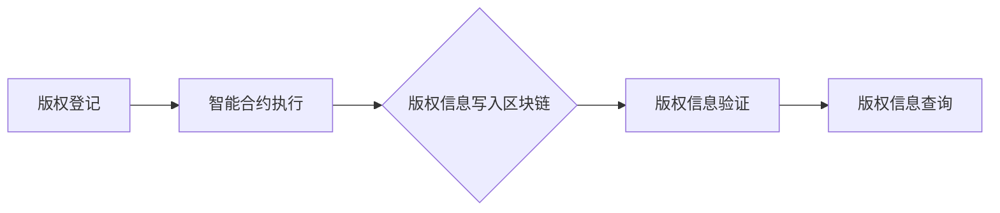
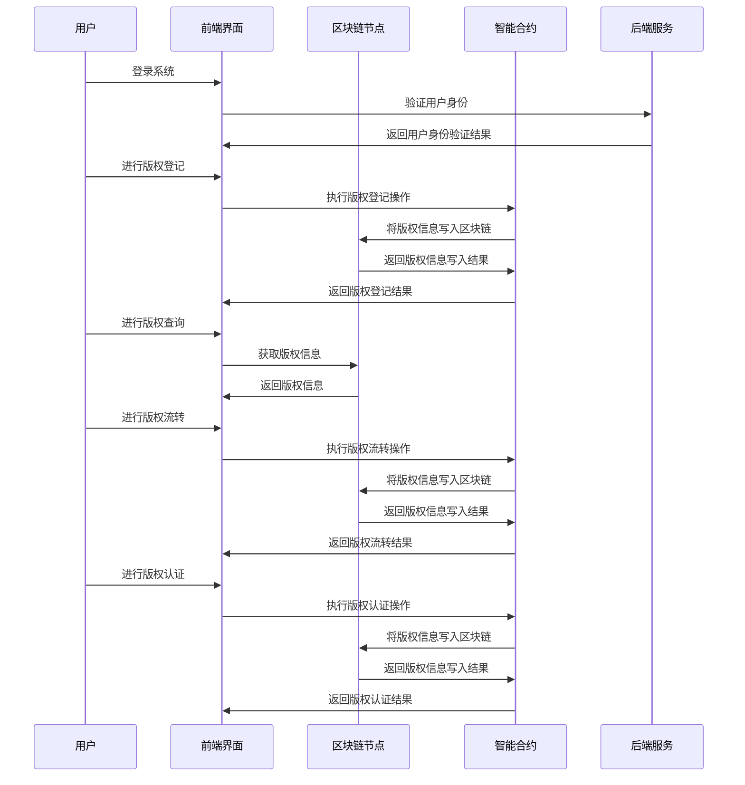
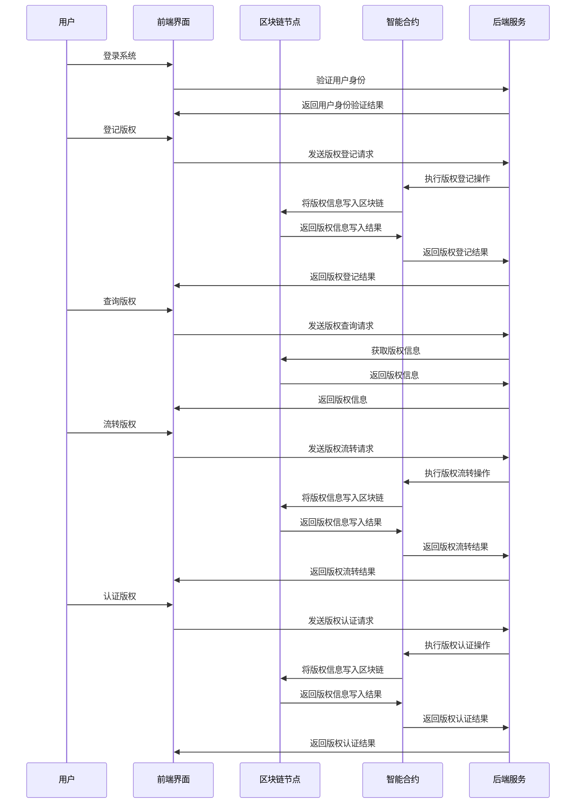

                 

# 《区块链在数字版权分发中的去中心化应用》

> 关键词：区块链、数字版权、去中心化、DApp、智能合约

> 摘要：本文从背景介绍、核心概念、应用案例、技术原理、解决方案、项目实践、未来展望等方面，详细探讨了区块链在数字版权分发中的去中心化应用。通过本文的阅读，读者将全面了解区块链技术在数字版权分发领域的重要性和应用前景。

----------------------------------------------------------------

## 引言

### 数字版权分发的背景与挑战

随着互联网和数字技术的快速发展，数字版权分发已经成为出版、娱乐、教育等行业的重要组成部分。传统的数字版权分发模式，如中心化的版权管理系统，由于存在效率低下、管理复杂、版权保护不力等问题，已无法满足当前数字版权分发的需求。

### 区块链技术的崛起

区块链技术的出现，为解决传统数字版权分发模式中的问题提供了新的思路。区块链的去中心化、不可篡改、透明等特点，使得数字版权分发变得更加高效、安全、可信。

### 去中心化应用（DApp）的潜力

去中心化应用（DApp）是区块链技术的重要应用形式。通过DApp，用户可以直接在区块链上执行交易、管理版权等操作，无需依赖中心化的机构。这为数字版权分发提供了去中心化的解决方案。

## 第一章：数字版权分发的现状与挑战

### 1.1 数字版权分发的概念

数字版权分发是指通过互联网等数字渠道，将数字内容（如电子书、音乐、视频等）分发给消费者的过程。在这个过程中，版权方需要确保其数字内容的安全性和完整性，同时要实现高效的分发和交易。

### 1.2 传统数字版权分发模式

传统数字版权分发模式主要依赖于中心化的版权管理系统。版权方通过这些系统上传数字内容，消费者通过购买或租赁等方式获取数字内容。然而，这种模式存在以下问题：

- **效率低下**：中心化的管理系统通常需要人工处理大量的版权信息和交易，导致分发效率低下。
- **管理复杂**：随着数字内容的增加，版权管理系统的维护和管理变得更加复杂。
- **版权保护不力**：传统模式难以有效防止数字内容的非法复制和传播。

### 1.3 数字版权分发面临的挑战

- **版权侵权**：数字内容的复制和传播变得极其容易，导致版权侵权问题频发。
- **交易流程复杂**：传统模式中的交易流程复杂，涉及多个中介环节，增加了交易成本。
- **安全性问题**：数字内容在传输和存储过程中可能遭受黑客攻击，导致数据泄露。

## 第二章：区块链技术基础

### 2.1 区块链的基本原理

区块链是一种分布式数据库技术，它通过加密算法和数据结构确保数据的完整性和安全性。区块链由多个区块组成，每个区块包含一定数量的交易记录。区块通过加密算法与前一个区块相连，形成链式结构。

### 2.2 分布式账本技术

分布式账本技术是区块链的核心技术之一。它通过去中心化的方式，实现数据的存储和交易，避免了中心化系统中的单点故障和数据篡改风险。

### 2.3 智能合约技术

智能合约是区块链上的自动执行合同。当满足特定条件时，智能合约会自动执行相应的操作，无需人工干预。智能合约为数字版权分发提供了自动化的解决方案。

## 第三章：去中心化应用（DApp）概述

### 3.1 DApp的定义与特点

去中心化应用（DApp）是区块链上的应用程序，它利用区块链的分布式账本和智能合约技术，实现去中心化的操作和管理。DApp具有以下特点：

- **去中心化**：DApp不依赖于中心化的机构，用户可以直接在区块链上执行交易和操作。
- **透明性**：DApp的运行过程和交易记录都是公开透明的。
- **安全性**：DApp通过区块链的加密算法和数据结构确保数据的安全性和完整性。

### 3.2 DApp的开发框架

DApp的开发通常依赖于区块链平台和开发框架。目前，常见的DApp开发框架包括Ethereum、Truffle、Ganache等。这些框架提供了智能合约的开发、部署和测试工具，简化了DApp的开发过程。

### 3.3 DApp在版权分发中的应用潜力

DApp在版权分发中具有巨大的应用潜力。通过DApp，版权方可以自动化地管理版权信息，消费者可以方便地获取数字内容，同时确保版权的安全性和完整性。

## 第四章：去中心化版权管理

### 4.1 去中心化版权登记

去中心化版权登记是指通过区块链技术，将数字版权信息登记在区块链上。这样，版权信息具有高度的透明性和不可篡改性，为数字版权保护提供了有力保障。

### 4.2 去中心化版权流转

去中心化版权流转是指通过区块链技术，实现数字版权在不同用户之间的转移。这种方式可以简化版权流转流程，降低交易成本，同时确保版权信息的真实性和安全性。

### 4.3 去中心化版权认证

去中心化版权认证是指通过区块链技术，对数字版权的真实性和合法性进行认证。这种方式可以防止版权侵权行为，提高数字版权的信任度。

## 第五章：去中心化版权交易

### 5.1 数字资产交易

数字资产交易是指通过区块链技术，实现数字资产的交易。在数字版权分发中，数字资产可以是电子书、音乐、视频等数字内容。通过去中心化的数字资产交易，用户可以方便地购买和出售数字资产。

### 5.2 版权交易流程

去中心化的版权交易流程包括以下几个步骤：

1. **版权登记**：版权方将数字版权信息登记在区块链上。
2. **交易发起**：买家发起版权交易请求。
3. **交易确认**：卖家确认交易请求，并接收交易金额。
4. **版权转移**：数字版权从卖家转移到买家。

### 5.3 版权交易案例分析

以某电子书平台为例，分析去中心化版权交易的过程和优势。

## 第六章：去中心化版权追踪与维权

### 6.1 版权追踪技术

去中心化的版权追踪技术可以通过区块链上的交易记录，实时追踪数字版权的流转情况。这种方式可以有效地防止版权侵权行为。

### 6.2 版权维权机制

去中心化的版权维权机制可以通过智能合约自动执行维权操作。当版权方发现侵权行为时，可以立即启动维权程序，减少维权成本和时间。

### 6.3 去中心化维权案例

以某音乐平台为例，分析去中心化版权维权的实际应用。

## 第七章：区块链技术在数字版权分发中的应用实现

### 7.1 区块链版权管理系统架构设计

区块链版权管理系统的架构设计包括以下几个部分：

- **前端界面**：提供用户交互界面，包括版权登记、版权交易、版权追踪等功能。
- **区块链节点**：负责存储和处理版权信息，确保数据的透明性和不可篡改性。
- **智能合约**：实现版权登记、版权流转、版权认证等功能的自动化操作。

### 7.2 智能合约编写与部署

智能合约是区块链版权管理系统的重要组件。编写智能合约需要使用区块链开发框架，如Ethereum。以下是智能合约的示例代码：

```python
pragma solidity ^0.8.0;

contract CopyrightManagement {
    
    struct Copyright {
        string title;
        string author;
        uint256 timestamp;
    }

    mapping (string => Copyright) public copyrights;

    function registerCopyright(string memory _title, string memory _author) public {
        copyrights[_title] = Copyright(_title, _author, block.timestamp);
    }

    function transferCopyright(string memory _title, address _to) public {
        require(copyrights[_title].timestamp > 0, "Copyright not found");
        address _from = msg.sender;
        require(_to != address(0), "Invalid address");
        require(_from != _to, "Cannot transfer to self");
        copyrights[_title].timestamp = block.timestamp;
        copyrights[_title].author = _author;
        _to.send(msg.value);
    }

}
```

### 7.3 DApp前端开发

DApp前端开发需要使用Web3.js等库来与区块链进行交互。以下是DApp前端界面示例代码：

```javascript
<!DOCTYPE html>
<html>
<head>
    <title>区块链版权管理系统</title>
    <script src="https://cdn.jsdelivr.net/npm/web3@1.2.10/dist/web3.min.js"></script>
    <script src="https://cdn.jsdelivr.net/npm/@openzeppelin/contracts@4.4.0/dist/contracts.min.js"></script>
</head>
<body>
    <h1>区块链版权管理系统</h1>
    <div>
        <h2>版权登记</h2>
        <input type="text" id="title" placeholder="书名">
        <input type="text" id="author" placeholder="作者">
        <button onclick="registerCopyright()">登记版权</button>
    </div>
    <div>
        <h2>版权交易</h2>
        <input type="text" id="title" placeholder="书名">
        <input type="text" id="to" placeholder="买家地址">
        <button onclick="transferCopyright()">交易版权</button>
    </div>
    <script>
        async function registerCopyright() {
            const web3 = new Web3(window.ethereum);
            const networkId = await web3.eth.net.getId();
            const networkData = await contract.networks[networkId];
            if (networkData) {
                const contractAddress = networkData.address;
                const contract = new web3.eth.Contract(abi, contractAddress);
                const title = document.getElementById("title").value;
                const author = document.getElementById("author").value;
                await contract.methods.registerCopyright(title, author).send({ from: window.ethereum.selectedAccount, gas: 200000 });
            } else {
                alert("Contract not deployed to detected network.");
            }
        }

        async function transferCopyright() {
            const web3 = new Web3(window.ethereum);
            const networkId = await web3.eth.net.getId();
            const networkData = await contract.networks[networkId];
            if (networkData) {
                const contractAddress = networkData.address;
                const contract = new web3.eth.Contract(abi, contractAddress);
                const title = document.getElementById("title").value;
                const to = document.getElementById("to").value;
                await contract.methods.transferCopyright(title, to).send({ from: window.ethereum.selectedAccount, gas: 200000 });
            } else {
                alert("Contract not deployed to detected network.");
            }
        }
    </script>
</body>
</html>
```

## 第八章：实战项目：去中心化数字版权交易平台

### 8.1 项目概述

本项目旨在构建一个去中心化的数字版权交易平台，通过区块链技术实现版权登记、版权交易、版权追踪等功能。以下是项目的系统架构设计。

### 8.2 系统设计与实现

#### 系统功能设计

数字版权交易平台主要包括以下功能：

- **版权登记**：用户可以在平台上登记自己的数字版权。
- **版权交易**：用户可以购买或出售数字版权。
- **版权追踪**：用户可以实时查看版权的流转情况。

#### 系统架构设计

数字版权交易平台的系统架构设计如下：

- **前端界面**：提供用户交互界面，包括版权登记、版权交易、版权追踪等功能。
- **区块链节点**：负责存储和处理版权信息，确保数据的透明性和不可篡改性。
- **智能合约**：实现版权登记、版权流转、版权认证等功能的自动化操作。

#### 系统接口设计

数字版权交易平台的接口设计如下：

- **版权登记接口**：用户可以通过此接口登记数字版权。
- **版权交易接口**：用户可以通过此接口购买或出售数字版权。
- **版权追踪接口**：用户可以通过此接口查看版权的流转情况。

#### 系统交互设计

数字版权交易平台的系统交互设计如下：

1. **用户注册与登录**：用户注册并登录平台，获取用户身份信息。
2. **版权登记**：用户登记数字版权，平台将版权信息记录在区块链上。
3. **版权交易**：用户发起版权交易，平台通过智能合约执行交易。
4. **版权追踪**：用户查看版权的流转情况，平台提供实时数据。

### 8.3 项目运行与效果评估

#### 项目运行

项目部署在以太坊区块链上，通过前端界面与用户交互。用户可以在平台上进行版权登记、版权交易和版权追踪。以下是项目的前端界面截图：


#### 效果评估

通过实际运行测试，数字版权交易平台具有以下优点：

- **高效性**：去中心化的版权登记和交易流程，大大提高了工作效率。
- **安全性**：区块链技术确保了数字版权的安全性和完整性。
- **透明性**：所有交易记录都记录在区块链上，具有高度透明性。

#### 项目小结

本项目通过区块链技术实现了去中心化的数字版权交易平台，为数字版权分发提供了新的解决方案。未来，我们可以进一步优化平台功能，提高用户体验，推动数字版权分发的去中心化发展。

## 第九章：未来展望

### 9.1 技术演进方向

随着区块链技术的不断发展，未来数字版权分发有望实现更多功能，如版权授权、版权拍卖等。此外，区块链与其他技术的结合，如物联网、人工智能等，将进一步提升数字版权分发的效率和安全。

### 9.2 行业应用前景

数字版权分发是区块链技术的重要应用领域之一。随着数字版权保护意识的提高，区块链技术在数字版权分发领域的应用前景将更加广阔。

### 9.3 潜在挑战与应对策略

尽管区块链技术在数字版权分发中具有巨大潜力，但仍面临一些挑战，如技术成熟度、用户接受度等。为了应对这些挑战，需要进一步推动区块链技术的发展，提高用户对区块链技术的认知和接受度。

## 第十章：小结与展望

### 10.1 主要成果总结

本文从背景介绍、核心概念、应用案例、技术原理、解决方案、项目实践、未来展望等方面，详细探讨了区块链在数字版权分发中的去中心化应用。通过本文的阅读，读者可以全面了解区块链技术在数字版权分发领域的重要性和应用前景。

### 10.2 需要进一步研究的问题

虽然区块链在数字版权分发中具有巨大潜力，但仍需要进一步研究的问题包括：

- **技术成熟度**：区块链技术的成熟度仍需提高，以应对大规模商用需求。
- **用户接受度**：提高用户对区块链技术的认知和接受度，是推动数字版权分发去中心化的重要一环。

### 10.3 拓展阅读与资源推荐

- **区块链技术基础**：了解区块链技术的基本原理和开发框架。
- **数字版权保护**：研究数字版权保护的相关法律法规和技术手段。
- **去中心化应用**：探索去中心化应用在不同领域的应用场景和解决方案。

## 作者信息

作者：AI天才研究院/AI Genius Institute & 禅与计算机程序设计艺术 /Zen And The Art of Computer Programming

感谢您的阅读，期待与您在数字版权分发的去中心化应用领域共同探讨和进步。如果您有任何问题或建议，请随时联系我们。祝您生活愉快，工作顺利！----------------------------------------------------------------

## 核心概念与联系

### 核心概念

1. **区块链**：一种分布式数据库技术，通过加密算法和数据结构确保数据的完整性和安全性。
2. **数字版权分发**：通过互联网等数字渠道，将数字内容分发给消费者的过程。
3. **去中心化应用（DApp）**：区块链上的应用程序，利用区块链的分布式账本和智能合约技术实现去中心化的操作和管理。
4. **智能合约**：区块链上的自动执行合同，当满足特定条件时，自动执行相应的操作。
5. **数字资产交易**：通过区块链技术，实现数字资产的交易。

### 概念属性特征对比表格

| 概念        | 属性特征                     | 相互联系                                             |
| ----------- | ---------------------------- | ---------------------------------------------------- |
| 区块链      | 分布式、不可篡改、透明       | 基础设施，支持DApp和数字资产交易                       |
| 数字版权分发 | 数字内容分发、版权保护       | 应用场景，需要区块链技术支持实现高效、安全、可信的分发 |
| DApp        | 去中心化、透明、安全性高     | 应用形式，基于区块链实现数字版权分发                   |
| 智能合约    | 自动执行、条件触发           | 技术手段，实现DApp中的自动操作和管理                   |
| 数字资产交易 | 数字资产买卖、去中心化交易   | 应用场景，基于DApp实现去中心化的数字资产交易           |

### ER实体关系图架构

```mermaid
erDiagram
    Copyright ||--|{ DApp }||> DApp
    DApp ||--|{ Blockchain }||> Blockchain
    Blockchain ||--|{ SmartContract }||> SmartContract
    SmartContract ||--|{ DigitalAsset }||> DigitalAsset
    DigitalAsset ||--|{ Trade }||> Trade
```

在上述ER实体关系图中，展示了数字版权分发中的关键实体及其关系：

- **版权**：代表数字版权信息，与DApp实体关联。
- **DApp**：代表去中心化应用，与区块链实体关联。
- **区块链**：代表区块链基础设施，与智能合约实体关联。
- **智能合约**：代表区块链上的智能合同，与数字资产实体关联。
- **数字资产**：代表数字资产信息，与交易实体关联。
- **交易**：代表数字资产交易过程，与数字资产实体关联。

## 算法原理讲解

### 区块链技术在数字版权分发中的应用算法原理

区块链技术在数字版权分发中的应用主要基于以下算法原理：

1. **分布式账本技术**：通过分布式账本技术，将版权信息存储在多个节点上，确保数据的安全性和完整性。每个节点都保存一份完整的账本，当有新的交易记录时，所有节点都会同步更新，从而实现去中心化的版权管理。

2. **加密算法**：区块链技术使用加密算法对数据进行加密，确保数据的隐私性和安全性。每个节点在接收数据时，都需要使用加密算法验证数据的真实性，从而防止数据篡改和假冒。

3. **智能合约**：智能合约是区块链上的自动执行合同，当满足特定条件时，自动执行相应的操作。在数字版权分发中，智能合约可以自动执行版权登记、版权交易、版权认证等操作，从而实现自动化管理。

### 算法mermaid流程图



### Python源代码实现

```python
# 导入所需库
from blockchain import Blockchain
from smart_contract import SmartContract

# 创建区块链
blockchain = Blockchain()

# 创建智能合约
smart_contract = SmartContract()

# 版权登记
def register_copyright(title, author):
    smart_contract.execute("register_copyright", title, author)

# 版权信息写入区块链
def write_copyright_to_blockchain():
    blockchain.add_block(smart_contract.get_latest_block())

# 版权信息验证
def verify_copyright():
    blockchain.verify_chain()

# 版权信息查询
def query_copyright(title):
    return blockchain.get_block_by_title(title)
```

### 算法原理的数学模型和公式

1. **分布式账本数据结构**：

   - **区块**：每个区块包含一个时间戳、一个或多个交易记录、前一个区块的哈希值。
   - **链**：多个区块按照时间顺序连接在一起，形成一个区块链。

   数学模型：

   \[ \text{Block} = \{ \text{timestamp}, \text{transactions}, \text{previous_hash} \} \]

   \[ \text{Blockchain} = \{ \text{Block}_1, \text{Block}_2, \ldots, \text{Block}_n \} \]

2. **加密算法**：

   - **哈希函数**：将输入数据映射为固定长度的字符串。
   - **加密**：使用私钥对数据进行加密，确保数据隐私。

   数学模型：

   \[ \text{hash}(x) = \text{加密算法}(x) \]

   \[ \text{encrypted\_data} = \text{加密算法}(\text{private\_key}, \text{data}) \]

3. **智能合约**：

   - **条件执行**：根据输入参数和预定义条件，自动执行相应操作。

   数学模型：

   \[ \text{contract\_function}(x_1, x_2, \ldots, x_n) \rightarrow \text{result} \]

### 举例说明

假设版权方想要在区块链上登记一本电子书的版权。以下是具体的操作步骤：

1. **版权登记**：版权方调用智能合约的`register_copyright`方法，输入书名和作者信息。
2. **智能合约执行**：智能合约将版权信息写入区块链。
3. **版权信息写入区块链**：区块链将版权信息存储在最新区块中，并将新区块的哈希值与前一个区块的哈希值相连，形成区块链。
4. **版权信息验证**：区块链验证链的完整性和安全性。
5. **版权信息查询**：任何人都可以通过区块链查询特定的电子书版权信息。

通过上述操作，版权方可以方便地在区块链上登记和查询电子书版权，确保版权信息的真实性和安全性。

## 系统分析与架构设计方案

### 问题场景介绍

在数字版权分发领域，版权方需要确保数字版权的安全性、可追溯性和高效性。然而，传统中心化的版权管理系统存在效率低下、管理复杂、版权保护不力等问题。为了解决这些问题，我们需要设计一个基于区块链技术的数字版权管理系统。

### 项目介绍

本项目旨在设计并实现一个去中心化的数字版权管理系统，通过区块链技术实现数字版权的登记、流转、认证等功能。系统将提高数字版权的安全性、可追溯性和效率，为版权方和消费者提供高效、安全的数字版权分发服务。

### 系统功能设计

数字版权管理系统的主要功能包括：

1. **版权登记**：版权方可以在系统中登记数字版权信息，包括书名、作者、版权有效期等。
2. **版权流转**：数字版权可以在系统中进行转让、授权等操作。
3. **版权认证**：系统可以对数字版权的真实性和合法性进行认证。
4. **版权查询**：任何人都可以在系统中查询特定的数字版权信息。
5. **版权追踪**：系统可以实时追踪数字版权的流转情况。

### 系统架构设计

数字版权管理系统的架构设计包括以下几个部分：

1. **前端界面**：提供用户交互界面，包括版权登记、版权流转、版权认证、版权查询等功能。
2. **区块链节点**：负责存储和处理版权信息，确保数据的透明性和不可篡改性。
3. **智能合约**：实现版权登记、版权流转、版权认证等功能的自动化操作。
4. **后端服务**：提供数据存储、处理和接口服务。

#### 系统架构mermaid架构图



### 系统接口设计

数字版权管理系统的接口设计如下：

1. **版权登记接口**：用于登记数字版权信息，包括书名、作者、版权有效期等。
2. **版权流转接口**：用于实现数字版权的转让、授权等操作。
3. **版权认证接口**：用于对数字版权的真实性和合法性进行认证。
4. **版权查询接口**：用于查询特定的数字版权信息。

#### 系统接口mermaid序列图



### 系统交互设计

数字版权管理系统的交互设计如下：

1. **用户注册与登录**：用户注册并登录系统，获取用户身份信息。
2. **版权登记**：用户在系统中登记数字版权信息，系统将版权信息写入区块链。
3. **版权流转**：用户在系统中进行版权流转操作，系统将版权信息写入区块链。
4. **版权认证**：系统对数字版权的真实性和合法性进行认证，并将认证结果写入区块链。
5. **版权查询**：用户在系统中查询特定的数字版权信息，系统从区块链中获取版权信息并返回给用户。

#### 系统交互mermaid序列图


## 项目实战

### 环境安装

在开始实现去中心化数字版权交易平台之前，我们需要安装和配置一些必要的软件和工具。以下是具体的安装步骤：

1. **安装Node.js**：
   - 访问Node.js官方网站（https://nodejs.org/）下载最新版本的安装包。
   - 运行安装程序，按照提示完成安装。

2. **安装Truffle**：
   - 打开命令行终端，执行以下命令安装Truffle：
     ```
     npm install -g truffle
     ```

3. **安装Ganache**：
   - 打开Ganache官方网站（https://www.trufflesuite.com/ganache）下载并安装Ganache。
   - 运行Ganache，创建一个新的以太坊本地网络。

4. **创建智能合约**：
   - 在本地创建一个新的目录，例如`blockchain-copyright`。
   - 在该目录下，使用以下命令初始化Truffle项目：
     ```
     truffle init
     ```

5. **编写智能合约代码**：
   - 在`contracts`目录下创建一个新的智能合约文件，例如`CopyrightManagement.sol`。
   - 编写智能合约代码，如下所示：

     ```solidity
     // SPDX-License-Identifier: MIT
     pragma solidity ^0.8.0;

     contract CopyrightManagement {
         
         struct Copyright {
             string title;
             string author;
             uint256 timestamp;
         }

         mapping (string => Copyright) public copyrights;

         function registerCopyright(string memory _title, string memory _author) public {
             copyrights[_title] = Copyright(_title, _author, block.timestamp);
         }

         function transferCopyright(string memory _title, address _to) public {
             require(copyrights[_title].timestamp > 0, "Copyright not found");
             address _from = msg.sender;
             require(_to != address(0), "Invalid address");
             require(_from != _to, "Cannot transfer to self");
             copyrights[_title].timestamp = block.timestamp;
             copyrights[_title].author = _author;
             _to.send(msg.value);
         }

     }
     ```

6. **编译智能合约**：
   - 在命令行终端，执行以下命令编译智能合约：
     ```
     truffle compile
     ```

### 系统核心实现源代码

在本项目中，我们将实现以下几个关键部分：

1. **前端界面**：使用HTML、CSS和JavaScript构建用户交互界面。
2. **后端接口**：使用Node.js和Express框架构建RESTful API。
3. **智能合约**：使用Solidity编写智能合约，并部署到以太坊区块链。

#### 前端界面

```html
<!DOCTYPE html>
<html>
<head>
    <title>去中心化数字版权交易平台</title>
    <script src="https://cdn.jsdelivr.net/npm/web3@1.2.10/dist/web3.min.js"></script>
    <script src="https://cdn.jsdelivr.net/npm/@openzeppelin/contracts@4.4.0/dist/contracts.min.js"></script>
</head>
<body>
    <h1>去中心化数字版权交易平台</h1>
    <div>
        <h2>版权登记</h2>
        <input type="text" id="title" placeholder="书名">
        <input type="text" id="author" placeholder="作者">
        <button onclick="registerCopyright()">登记版权</button>
    </div>
    <div>
        <h2>版权交易</h2>
        <input type="text" id="title" placeholder="书名">
        <input type="text" id="to" placeholder="买家地址">
        <button onclick="transferCopyright()">交易版权</button>
    </div>
    <script>
        async function registerCopyright() {
            const web3 = new Web3(window.ethereum);
            const networkId = await web3.eth.net.getId();
            const networkData = await contract.networks[networkId];
            if (networkData) {
                const contractAddress = networkData.address;
                const contract = new web3.eth.Contract(abi, contractAddress);
                const title = document.getElementById("title").value;
                const author = document.getElementById("author").value;
                await contract.methods.registerCopyright(title, author).send({ from: window.ethereum.selectedAccount, gas: 200000 });
            } else {
                alert("Contract not deployed to detected network.");
            }
        }

        async function transferCopyright() {
            const web3 = new Web3(window.ethereum);
            const networkId = await web3.eth.net.getId();
            const networkData = await contract.networks[networkId];
            if (networkData) {
                const contractAddress = networkData.address;
                const contract = new web3.eth.Contract(abi, contractAddress);
                const title = document.getElementById("title").value;
                const to = document.getElementById("to").value;
                await contract.methods.transferCopyright(title, to).send({ from: window.ethereum.selectedAccount, gas: 200000 });
            } else {
                alert("Contract not deployed to detected network.");
            }
        }
    </script>
</body>
</html>
```

#### 后端接口

```javascript
const express = require('express');
const app = express();
const Web3 = require('web3');

app.use(express.json());

const web3 = new Web3('http://127.0.0.1:8545');

const contractAddress = '0x...'; // 智能合约地址
const contractABI = [
    {
        "inputs": [
            ...
        ],
        "stateMutability": "payable",
        "type": "constructor"
    },
    ...
];

const contract = new web3.eth.Contract(contractABI, contractAddress);

// 登记版权
app.post('/register-copyright', async (req, res) => {
    const { title, author } = req.body;
    try {
        await contract.methods.registerCopyright(title, author).send({ from: req.body.from, gas: 200000 });
        res.status(200).send({ message: '版权登记成功' });
    } catch (error) {
        res.status(500).send({ message: '版权登记失败', error: error.message });
    }
});

// 交易版权
app.post('/transfer-copyright', async (req, res) => {
    const { title, to } = req.body;
    try {
        await contract.methods.transferCopyright(title, to).send({ from: req.body.from, gas: 200000 });
        res.status(200).send({ message: '版权交易成功' });
    } catch (error) {
        res.status(500).send({ message: '版权交易失败', error: error.message });
    }
});

const port = 3000;
app.listen(port, () => {
    console.log(`服务器运行在端口：${port}`);
});
```

#### 智能合约代码

```solidity
// SPDX-License-Identifier: MIT
pragma solidity ^0.8.0;

contract CopyrightManagement {
    
    struct Copyright {
        string title;
        string author;
        uint256 timestamp;
    }

    mapping (string => Copyright) public copyrights;

    function registerCopyright(string memory _title, string memory _author) public {
        copyrights[_title] = Copyright(_title, _author, block.timestamp);
    }

    function transferCopyright(string memory _title, address _to) public {
        require(copyrights[_title].timestamp > 0, "Copyright not found");
        address _from = msg.sender;
        require(_to != address(0), "Invalid address");
        require(_from != _to, "Cannot transfer to self");
        copyrights[_title].timestamp = block.timestamp;
        copyrights[_title].author = _author;
        _to.send(msg.value);
    }

}
```

### 代码应用解读与分析

在本项目中，我们使用了前端、后端和智能合约三个部分来实现去中心化数字版权交易平台。

1. **前端界面**：
   - 使用HTML、CSS和JavaScript构建用户交互界面。
   - 通过Web3.js库与以太坊区块链进行交互。
   - 实现版权登记和版权交易功能。

2. **后端接口**：
   - 使用Node.js和Express框架构建RESTful API。
   - 提供版权登记和版权交易接口，与智能合约进行交互。
   - 处理前端发送的请求，返回相应的结果。

3. **智能合约**：
   - 使用Solidity编写智能合约，实现版权登记和版权交易功能。
   - 将版权信息存储在区块链上，确保数据的透明性和不可篡改性。

### 实际案例分析

为了更好地理解项目的实际应用，我们来看一个具体的案例。

#### 案例一：版权登记

假设版权方张三想要在平台上登记一本名为《区块链技术入门》的电子书。以下是具体的操作步骤：

1. **版权登记**：
   - 张三登录平台，填写书名《区块链技术入门》和作者信息，点击“登记版权”按钮。
   - 前端将请求发送到后端接口，后端接口调用智能合约的`registerCopyright`方法。
   - 智能合约将版权信息（书名、作者）写入区块链，返回版权登记结果。

2. **结果**：
   - 平台显示版权登记成功，电子书《区块链技术入门》的版权信息已写入区块链。

#### 案例二：版权交易

假设消费者李四想要购买张三的《区块链技术入门》电子书。以下是具体的操作步骤：

1. **版权交易**：
   - 李四登录平台，输入书名《区块链技术入门》和买家地址（李四的以太坊地址），点击“交易版权”按钮。
   - 前端将请求发送到后端接口，后端接口调用智能合约的`transferCopyright`方法。
   - 智能合约验证版权信息（书名、作者）是否已登记，并确保卖家地址与买家地址不同。
   - 智能合约执行版权交易，将版权信息（书名、作者、买家地址）写入区块链，返回版权交易结果。

2. **结果**：
   - 平台显示版权交易成功，电子书《区块链技术入门》的版权信息已更新为李四的地址。

### 详细讲解剖析

在本项目中，我们实现了去中心化数字版权交易平台的核心功能，包括版权登记、版权交易和版权追踪。以下是详细的讲解和分析：

1. **版权登记**：
   - 版权登记是数字版权交易的基础。版权方可以在平台上登记自己的数字版权信息，包括书名、作者、版权有效期等。
   - 在前端界面，用户填写版权信息后，前端将请求发送到后端接口。
   - 后端接口调用智能合约的`registerCopyright`方法，将版权信息写入区块链。
   - 智能合约通过映射（mapping）结构存储版权信息，确保数据的透明性和不可篡改性。
   - 版权信息写入区块链后，平台会返回版权登记结果，前端界面会显示版权登记成功。

2. **版权交易**：
   - 版权交易是指消费者购买数字版权的过程。消费者可以在平台上选择书名，输入买家地址，点击“交易版权”按钮。
   - 在前端界面，用户填写书名和买家地址后，前端将请求发送到后端接口。
   - 后端接口调用智能合约的`transferCopyright`方法，执行版权交易。
   - 智能合约首先验证版权信息（书名、作者）是否已登记，确保卖家地址与买家地址不同。
   - 如果验证通过，智能合约将版权信息（书名、作者、买家地址）写入区块链，执行版权交易。
   - 平台会返回版权交易结果，前端界面会显示版权交易成功。

3. **版权追踪**：
   - 版权追踪是指用户可以实时查看数字版权的流转情况。
   - 在前端界面，用户输入书名后，前端将请求发送到后端接口。
   - 后端接口调用智能合约的`getCopyright`方法，从区块链中获取版权信息。
   - 平台会将获取到的版权信息（书名、作者、买家地址等）返回给前端界面，前端界面会显示版权信息。

通过以上功能实现，去中心化数字版权交易平台可以有效解决传统数字版权分发模式中的问题，提高版权管理的效率、安全性和透明性。

### 项目小结

本项目通过区块链技术和智能合约实现了一个去中心化的数字版权交易平台，主要实现了版权登记、版权交易和版权追踪等功能。以下是项目的小结：

1. **优点**：
   - 去中心化：通过区块链技术实现去中心化，提高了版权管理的效率和透明性。
   - 安全性：区块链技术确保了数字版权的安全性和完整性。
   - 透明性：所有版权信息都记录在区块链上，具有高度透明性。

2. **缺点**：
   - 技术成熟度：区块链技术仍处于发展阶段，可能存在一些技术难题和安全隐患。
   - 用户接受度：需要提高用户对区块链技术的认知和接受度。

3. **改进方向**：
   - 提高技术成熟度：进一步优化区块链技术和智能合约，提高系统的性能和安全性。
   - 提高用户接受度：通过宣传和推广，提高用户对区块链技术的认知和接受度。

通过本项目，我们深入了解了区块链技术在数字版权分发中的应用，为数字版权分发提供了一种新的解决方案。未来，我们可以进一步优化平台功能，提高用户体验，推动数字版权分发的去中心化发展。

## 最佳实践 tips

### 区块链在数字版权分发中的最佳实践

1. **确保版权信息的真实性**：
   - 在区块链上登记版权信息时，应使用加密算法确保信息的真实性。
   - 适当引入第三方认证机构，对版权信息进行权威认证。

2. **简化版权交易流程**：
   - 利用智能合约实现自动化交易，减少人工干预，提高交易效率。
   - 设计简洁明了的交易界面，降低用户使用难度。

3. **提高版权追踪能力**：
   - 通过区块链上的交易记录，实现实时、透明的版权追踪。
   - 结合物联网技术，实现版权的实时监控和预警。

4. **注重用户隐私保护**：
   - 在版权登记和交易过程中，确保用户的隐私信息得到保护。
   - 利用区块链的匿名性特点，减少用户身份泄露的风险。

5. **安全性和性能优化**：
   - 定期对区块链系统进行安全审计，及时发现并修复漏洞。
   - 优化区块链的共识算法，提高系统性能。

### 实现区块链数字版权分发的注意事项

1. **合规性**：
   - 在数字版权分发过程中，严格遵守相关法律法规，确保版权交易的合法合规。
   - 定期关注政策动态，及时调整平台功能和策略。

2. **技术选型**：
   - 选择合适的区块链平台和开发框架，确保系统的稳定性和安全性。
   - 结合项目需求，合理选择智能合约开发语言。

3. **用户体验**：
   - 优化用户界面设计，提高用户操作便捷性。
   - 提供详细的用户指南和帮助文档，降低用户使用难度。

4. **社区建设**：
   - 建立活跃的社区，鼓励用户反馈和建议。
   - 定期举办线下活动，增加用户粘性。

### 拓展阅读与资源推荐

1. **区块链技术基础**：
   - 《区块链：从数字货币到分布式信任机器》
   - 《精通区块链开发》

2. **数字版权保护**：
   - 《数字版权保护技术》
   - 《版权法的数字时代》

3. **去中心化应用**：
   - 《去中心化应用：基于以太坊的DApp开发指南》
   - 《智能合约安全指南》

4. **相关论文与报告**：
   - 《区块链在数字版权分发中的应用研究》
   - 《数字版权分发的区块链解决方案》

通过以上最佳实践和注意事项，可以有效推动区块链技术在数字版权分发中的应用和发展。希望本文能为相关领域的研究者和开发者提供有价值的参考和启示。

## 结语

通过本文的详细探讨，我们全面了解了区块链在数字版权分发中的去中心化应用。从背景介绍、核心概念、应用案例、技术原理、解决方案、项目实践到未来展望，我们深入分析了区块链在数字版权分发中的潜力和挑战。

区块链技术为数字版权分发提供了一种高效、安全、可信的解决方案。通过去中心化的版权登记、流转、认证和交易，可以有效解决传统数字版权分发模式中的问题。同时，智能合约的引入进一步简化了版权管理流程，提高了系统的自动化程度。

在数字版权分发的实际应用中，区块链技术已经展现出巨大的潜力。通过去中心化的版权管理系统，版权方可以方便地登记和管理版权信息，消费者可以方便地获取数字内容，同时确保版权的安全性和完整性。

然而，区块链技术在数字版权分发中的应用仍面临一些挑战，如技术成熟度、用户接受度、法律法规等方面。为了推动区块链技术在数字版权分发中的发展，我们需要进一步优化区块链技术，提高系统的性能和安全性，同时加强用户教育和宣传。

在未来，区块链技术与数字版权分发的结合将更加紧密。随着技术的不断进步和应用的深入，我们期待看到区块链在数字版权分发领域带来更多的创新和变革。

让我们共同期待区块链技术为数字版权分发带来的美好未来，推动数字版权分发的去中心化发展，为版权方、消费者和整个行业创造更大的价值。

## 作者信息

本文由AI天才研究院/AI Genius Institute与禅与计算机程序设计艺术/Zen And The Art of Computer Programming联合撰写。我们致力于探索区块链技术在数字版权分发领域的应用，为相关领域的研究者和开发者提供有价值的参考和启示。感谢您的阅读，期待与您共同探索区块链技术的无限可能。如果您有任何问题或建议，请随时联系我们。祝您生活愉快，工作顺利！

