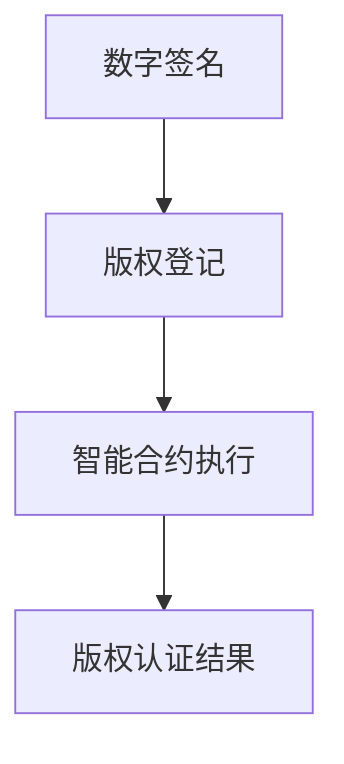
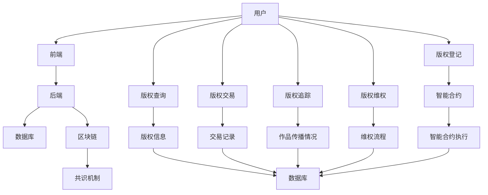
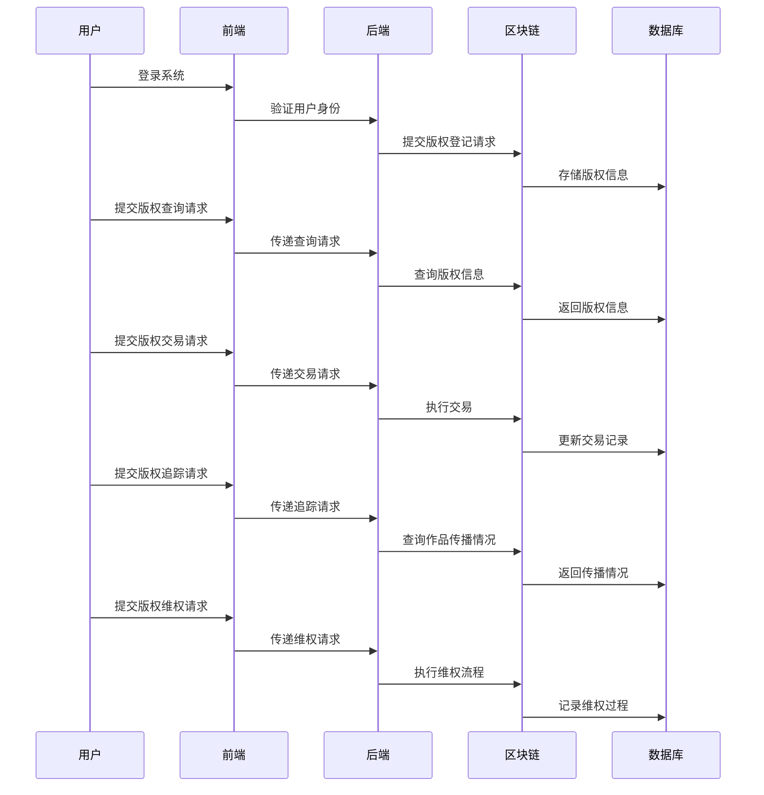

                 


## 文章标题：区块链在数字版权管理中的应用：保护创作者权益

### 关键词：
- 区块链
- 数字版权管理
- 创作者权益
- 智能合约
- 去中心化
- 版权认证

### 摘要：
本文旨在深入探讨区块链技术在数字版权管理中的应用，以及如何通过区块链技术保护创作者的合法权益。文章首先介绍了区块链和数字版权管理的基本概念，然后分析了区块链在数字版权管理中的优势和应用场景。接着，本文详细阐述了区块链版权认证算法，并通过一个实际案例展示了其在保护创作者权益方面的应用。最后，文章对区块链数字版权管理的未来进行了展望，并提出了相关最佳实践。

## 第一部分：背景介绍

### 第1章 区块链与数字版权管理概述

#### 1.1 区块链技术的基本原理

区块链是一种分布式数据库技术，它通过加密算法和共识机制确保数据的不可篡改和透明性。区块链的核心特点包括去中心化、安全性和透明性。

去中心化：区块链不依赖于中央机构，数据分布在网络中的各个节点上，每个节点都存储一份完整的数据副本。

安全性：区块链使用加密算法确保数据的完整性和安全性，任何尝试篡改数据的操作都会被其他节点识别并拒绝。

透明性：区块链上的数据对所有节点都是可见的，任何交易记录都可以被任何人查看。

#### 1.2 数字版权管理的现状与挑战

数字版权管理（DRM）是指通过技术手段保护数字内容版权的过程。目前，数字版权管理面临以下挑战：

盗版问题：随着互联网的普及，数字内容的盗版问题日益严重，创作者的权益受到侵害。

追踪困难：传统版权管理方式难以对数字内容的使用和传播进行有效追踪。

透明度不足：数字版权管理过程中，权利人、授权者和使用者之间的信息不对称，导致权利分配不透明。

#### 1.3 区块链在数字版权管理中的角色与意义

区块链技术在数字版权管理中具有以下角色和意义：

**角色**：

- **版权认证**：通过区块链技术，创作者可以对其作品进行数字签名，确保版权的唯一性和不可篡改性。
- **版权交易**：区块链为版权交易提供了一个去中心化的平台，简化了交易流程，降低了交易成本。
- **版权追踪**：区块链的分布式特性使得版权的追踪变得更加容易，每个交易记录都公开透明。

**意义**：

- **保护创作者权益**：通过区块链技术，创作者可以更好地保护其作品的版权，防止盗版和未经授权的传播。
- **提高透明度**：区块链技术确保版权管理过程的透明度，减少权利纠纷。
- **降低成本**：去中心化的版权交易降低了中介费用，提高了市场效率。

#### 1.4 研究范围与方法

本研究将重点关注以下内容：

- 区块链技术的基本原理和结构。
- 数字版权管理的核心概念和挑战。
- 区块链在数字版权管理中的应用场景。
- 区块链版权认证算法的实现和案例分析。

研究方法包括：

- 文献综述：分析现有关于区块链和数字版权管理的相关研究。
- 理论分析：探讨区块链技术如何解决数字版权管理的挑战。
- 实证研究：通过实际案例展示区块链在数字版权管理中的应用效果。

## 第二部分：核心概念与联系

### 第2章 区块链核心概念与结构

#### 2.1 区块链的基本概念

区块链是一种分布式账本技术，由一系列按时间顺序排列的数据块组成。每个数据块包含一定数量的交易记录，并通过密码学技术确保数据的完整性和安全性。

#### 2.2 区块链的技术架构

区块链的技术架构主要包括以下部分：

- **节点**：区块链网络中的每个计算机都可以成为一个节点，负责存储和验证数据。
- **挖矿**：节点通过解决加密难题来添加新数据块到区块链，这一过程称为挖矿。
- **共识算法**：共识算法是区块链中节点达成一致意见的机制，常用的共识算法包括工作量证明（PoW）和权益证明（PoS）。

#### 2.3 智能合约与去中心化应用（DApp）

智能合约是区块链上的可编程合约，它可以在满足特定条件时自动执行。去中心化应用（DApp）是运行在区块链上的应用，它通过智能合约实现去中心化的功能。

#### 2.4 区块链的安全性与隐私保护

区块链的安全性依赖于其去中心化和加密技术。然而，区块链也存在一些隐私保护方面的挑战，如交易地址的透明度等。为了解决这些问题，研究者们提出了多种隐私保护方案，如零知识证明和同态加密。

### 第3章 数字版权管理的核心概念

#### 3.1 版权的定义与法律框架

版权是指创作者对其作品享有的专有权利。根据《伯尔尼公约》等国际法律框架，版权包括复制权、发行权、展示权和表演权等。

#### 3.2 数字版权的特性

数字版权具有以下特性：

- **易复制性**：数字内容可以轻松复制和传播，这给版权管理带来了挑战。
- **分散性**：数字版权涉及多个权利人，管理起来相对复杂。
- **不可篡改性**：数字版权一旦创建，就很难更改，这有利于保护创作者的权益。

#### 3.3 数字版权管理的关键要素

数字版权管理的关键要素包括：

- **版权认证**：确保作品版权的合法性和唯一性。
- **版权交易**：简化版权交易流程，提高市场效率。
- **版权追踪**：实时监控作品的传播和使用情况。
- **版权维权**：为创作者提供有效的维权手段。

#### 3.4 数字版权管理与区块链的关联

区块链技术为数字版权管理提供了以下关联：

- **版权认证**：区块链的不可篡改性确保了版权认证的可靠性。
- **版权交易**：区块链的去中心化特性简化了版权交易流程，降低了交易成本。
- **版权追踪**：区块链的分布式特性使得版权追踪更加高效。
- **版权维权**：区块链为创作者提供了透明的维权渠道，减少了权利纠纷。

## 第三部分：算法原理讲解

### 第4章 区块链在数字版权管理中的应用

#### 4.1 区块链在版权认证中的应用

区块链在版权认证中的应用主要体现在以下几个方面：

- **版权登记**：创作者可以将作品的版权信息登记在区块链上，确保版权的唯一性和不可篡改性。
- **数字签名**：创作者对作品进行数字签名，确保作品的版权归属。
- **智能合约**：智能合约自动执行版权认证流程，确保版权认证的自动化和高效性。

#### 4.2 区块链在版权交易中的应用

区块链在版权交易中的应用主要体现在以下几个方面：

- **去中心化交易平台**：创作者可以直接在区块链上进行版权交易，无需通过中介。
- **智能合约**：智能合约自动执行版权交易合同，确保交易的透明和可靠性。
- **分润机制**：智能合约可以自动计算并分配版权分润，确保权利人的权益。

#### 4.3 区块链在版权追踪与维权中的应用

区块链在版权追踪与维权中的应用主要体现在以下几个方面：

- **版权追踪**：区块链的分布式特性使得版权追踪变得更加高效和透明。
- **智能合约**：智能合约自动执行版权维权流程，减少权利纠纷。
- **去中心化仲裁**：区块链平台可以提供去中心化的仲裁服务，为创作者提供高效的维权渠道。

#### 4.4 区块链在数字内容分润中的应用

区块链在数字内容分润中的应用主要体现在以下几个方面：

- **透明分润机制**：智能合约可以自动计算并分配数字内容分润，确保分润的透明和公平。
- **去中心化平台**：创作者可以直接在区块链上进行内容分润，无需通过中介。
- **自动化执行**：智能合约自动执行分润合同，确保分润的及时和准确。

### 第5章 区块链版权认证算法

#### 5.1 算法概述

区块链版权认证算法主要包括以下几个步骤：

- **数字签名**：创作者对作品进行数字签名，确保作品的版权归属。
- **版权登记**：创作者将作品的版权信息登记在区块链上，确保版权的唯一性和不可篡改性。
- **智能合约执行**：智能合约自动执行版权认证流程，确保版权认证的自动化和高效性。

#### 5.2 算法原理

区块链版权认证算法的原理基于区块链的不可篡改性和分布式特性。具体原理如下：

- **数字签名**：创作者对作品进行数字签名，生成的签名与作品的内容相关联，确保版权归属。
- **版权登记**：创作者将版权信息上传到区块链，其他节点可以验证版权信息的合法性和唯一性。
- **智能合约执行**：智能合约自动执行版权认证流程，确保版权认证的自动化和高效性。

#### 5.3 Mermaid算法流程图



#### 5.4 Python代码实现

```python
import hashlib
import json
from Cryptodome.PublicKey import RSA

# 生成RSA密钥对
private_key = RSA.generate(2048)
public_key = private_key.publickey()

# 对作品内容进行哈希运算
def hash_content(content):
    return hashlib.sha256(content.encode('utf-8')).hexdigest()

# 对哈希值进行数字签名
def sign_content(content, private_key):
    signature = private_key.sign(hash_content(content), 'DER')
    return signature

# 将版权信息上传到区块链
def register_content_on_blockchain(content, signature, blockchain):
    content_json = {
        'content': content,
        'signature': signature
    }
    blockchain.add_block(json.dumps(content_json))

# 智能合约执行版权认证
def execute_contract(content, signature, public_key, blockchain):
    if verify_signature(content, signature, public_key):
        blockchain.mine_block()
        return '版权认证成功'
    else:
        return '版权认证失败'

# 验证签名
def verify_signature(content, signature, public_key):
    try:
        public_key.verify(hash_content(content), signature)
        return True
    except:
        return False

# 测试
content = "这是一部小说。"
signature = sign_content(content, private_key)
register_content_on_blockchain(content, signature, blockchain)
print(execute_contract(content, signature, public_key, blockchain))
```

#### 5.5 算法讲解与举例说明

区块链版权认证算法通过数字签名和区块链技术确保版权的合法性和唯一性。下面通过一个简单的例子进行说明：

假设一位小说作家创作了一部小说，并将其内容存储在文件中。作家首先使用RSA密钥对生成数字签名，然后将作品内容和签名上传到区块链。当其他人想要验证作品的版权时，可以通过区块链查询版权信息，并使用作家的公钥验证签名。如果签名验证成功，则证明该作品的版权归属作家。

## 第四部分：系统分析与架构设计

### 第6章 数字版权管理系统架构设计

#### 6.1 系统功能需求

数字版权管理系统需要实现以下功能：

- **版权登记**：创作者可以上传作品和版权信息，登记在区块链上。
- **版权查询**：用户可以查询区块链上的版权信息，验证版权归属。
- **版权交易**：创作者可以通过区块链进行版权交易，实现去中心化的交易。
- **版权追踪**：系统可以实时追踪作品的传播和使用情况。
- **版权维权**：创作者可以通过系统进行维权，解决版权纠纷。

#### 6.2 系统架构设计

数字版权管理系统的架构设计包括以下几个方面：

- **前端**：提供用户界面，实现版权登记、查询、交易等功能。
- **后端**：实现区块链的搭建和智能合约的执行。
- **数据库**：存储版权信息、用户数据和交易记录。
- **共识机制**：确保区块链的可靠性和安全性。

#### 6.3 Mermaid领域模型类图

```mermaid
classDiagram
    User <|-- Creator
    User <|-- Consumer
    Content <<-- Creator
    Content <<-- Contract
    Contract <|-- SmartContract
    Block <<-- Blockchain
    Transaction <<-- Blockchain
    Node <<-- Blockchain
    Consensus <<-- Blockchain
endclass
```

#### 6.4 Mermaid系统架构图



#### 6.5 系统接口设计与系统交互序列图



## 第五部分：项目实战

### 第7章 区块链数字版权管理项目实战

#### 7.1 环境搭建与准备工作

为了实现区块链数字版权管理项目，我们需要以下准备工作：

- **搭建区块链节点**：使用Go语言搭建一个简单的区块链节点，实现基本的区块链功能。
- **部署智能合约**：使用Solidity语言编写智能合约，并在区块链节点上部署。
- **搭建前端界面**：使用React框架搭建前端界面，实现用户交互。

#### 7.2 系统核心实现

系统核心实现包括以下几个方面：

- **版权登记**：用户可以上传作品和版权信息，登记在区块链上。
- **版权查询**：用户可以查询区块链上的版权信息，验证版权归属。
- **版权交易**：用户可以通过区块链进行版权交易，实现去中心化的交易。
- **版权追踪**：系统可以实时追踪作品的传播和使用情况。
- **版权维权**：用户可以通过系统进行维权，解决版权纠纷。

#### 7.3 代码应用解读与分析

以下是一个简单的版权登记和查询功能的代码示例：

```solidity
// SPDX-License-Identifier: MIT
pragma solidity ^0.8.0;

contract CopyrightManagement {
    mapping(string => bool) public copyrights;

    function registerCopyright(string memory content) public {
        require(!copyrights[content], "版权已登记");
        copyrights[content] = true;
    }

    function queryCopyright(string memory content) public view returns (bool) {
        return copyrights[content];
    }
}
```

这个智能合约实现了版权登记和查询功能。注册版权时，通过调用`registerCopyright`函数，将作品内容作为参数传入，并将版权状态设置为`true`。查询版权时，通过调用`queryCopyright`函数，传入作品内容，返回版权状态。

#### 7.4 实际案例分析

以下是一个实际案例，展示了如何使用区块链数字版权管理系统进行版权登记和查询：

1. **版权登记**：

   - 用户上传一部小说，调用`registerCopyright`函数，将小说内容作为参数传入。
   - 区块链节点将小说内容和版权状态存储在区块链上。

2. **版权查询**：

   - 用户查询某部小说的版权状态，调用`queryCopyright`函数，传入小说内容。
   - 区块链节点返回小说的版权状态。

通过这个案例，我们可以看到区块链数字版权管理系统如何帮助用户实现版权登记和查询，从而保护创作者的权益。

#### 7.5 项目总结与拓展

区块链数字版权管理系统为创作者提供了方便的版权登记、查询和交易功能，有助于保护创作者的权益。在实际应用中，我们可以进一步拓展系统的功能，如版权追踪、维权等。此外，还可以考虑与其他区块链平台合作，实现跨链版权管理，提高系统的兼容性和扩展性。

## 第六部分：最佳实践与拓展

### 第8章 最佳实践与未来展望

#### 8.1 区块链数字版权管理的最佳实践

为了实现区块链数字版权管理的最佳实践，我们可以采取以下措施：

- **确保版权登记的合法性和唯一性**：创作者在登记版权时，需要提供有效的证明文件，确保版权的合法性和唯一性。
- **加强版权追踪**：通过区块链技术，实现作品的实时追踪，确保作品的传播和使用情况透明化。
- **简化版权交易流程**：利用智能合约，简化版权交易流程，降低交易成本。
- **提供去中心化的维权渠道**：通过区块链平台，提供去中心化的维权渠道，减少权利纠纷。

#### 8.2 未来发展趋势与挑战

区块链数字版权管理的发展趋势包括：

- **跨链版权管理**：随着区块链技术的不断演进，实现跨链版权管理将成为未来趋势，提高系统的兼容性和扩展性。
- **智能化版权管理**：利用人工智能技术，实现更智能的版权管理和维权。
- **全球版权合作**：通过区块链技术，实现全球范围内的版权合作，打破地域限制。

然而，区块链数字版权管理也面临以下挑战：

- **技术成熟度**：区块链技术仍处于发展阶段，需要进一步提高技术成熟度。
- **隐私保护**：区块链的透明性可能对创作者的隐私构成威胁，需要加强隐私保护措施。
- **法律法规**：不同国家和地区的法律法规对数字版权管理的要求不同，需要建立统一的法律法规框架。

#### 8.3 拓展阅读与资源推荐

为了深入了解区块链数字版权管理，以下是一些建议的拓展阅读和资源：

- **书籍**：《区块链技术指南》、《数字版权管理：理论与实践》
- **论文**：《区块链在数字版权管理中的应用研究》、《区块链版权管理机制设计与实现》
- **在线课程**：《区块链开发实战》、《智能合约开发入门》
- **开源项目**：Ethereum、EOSIO、Hyperledger Fabric等区块链平台上的数字版权管理项目。

#### 8.4 小结

区块链数字版权管理为创作者提供了方便的版权登记、查询和交易功能，有助于保护创作者的权益。通过最佳实践和未来展望，我们可以看到区块链数字版权管理的广阔前景。然而，技术成熟度、隐私保护和法律法规等方面仍需进一步探讨和改进。希望本文能为读者在区块链数字版权管理领域提供有益的参考和启示。

## 作者信息

作者：AI天才研究院/AI Genius Institute & 禅与计算机程序设计艺术 /Zen And The Art of Computer Programming

### 背景介绍

#### 核心概念术语说明

在本文中，我们将介绍以下核心概念术语：

- **区块链（Blockchain）**：一种分布式数据库技术，通过加密算法和共识机制确保数据的不可篡改和透明性。
- **数字版权管理（DRM）**：通过技术手段保护数字内容版权的过程。
- **创作者权益**：创作者对其作品享有的专有权利。
- **智能合约**：区块链上的可编程合约，可以在满足特定条件时自动执行。
- **去中心化**：不依赖于中央机构，数据分布在网络中的各个节点上。
- **版权认证**：确保作品版权的合法性和唯一性。
- **版权交易**：简化版权交易流程，提高市场效率。

#### 问题背景

随着互联网的普及，数字内容的创作和传播速度越来越快，然而数字版权管理面临诸多挑战，如盗版、追踪困难、透明度不足等。创作者的权益受到侵害，市场秩序受到威胁。为了解决这些问题，区块链技术被认为是一种潜在解决方案。

#### 问题描述

数字版权管理存在的问题主要包括：

1. **盗版问题**：数字内容的易复制性使得盗版问题严重，创作者的权益受到侵害。
2. **追踪困难**：传统版权管理方式难以对数字内容的使用和传播进行有效追踪。
3. **透明度不足**：数字版权管理过程中，权利人、授权者和使用者之间的信息不对称，导致权利分配不透明。

#### 问题解决

区块链技术在数字版权管理中具有以下优势：

1. **版权认证**：通过区块链技术，创作者可以对其作品进行数字签名，确保版权的唯一性和不可篡改性。
2. **版权交易**：区块链为版权交易提供了一个去中心化的平台，简化了交易流程，降低了交易成本。
3. **版权追踪**：区块链的分布式特性使得版权的追踪变得更加容易，每个交易记录都公开透明。
4. **透明度提高**：区块链技术确保版权管理过程的透明度，减少权利纠纷。

#### 边界与外延

数字版权管理的边界主要涉及创作者、使用者和授权者之间的权利分配和交易。数字版权管理的外延包括版权认证、版权交易、版权追踪、版权维权等多个方面。

#### 概念结构与核心要素组成

数字版权管理的基本概念结构和核心要素包括：

1. **版权认证**：确保作品版权的合法性和唯一性。
2. **版权交易**：简化版权交易流程，提高市场效率。
3. **版权追踪**：实时监控作品的传播和使用情况。
4. **版权维权**：为创作者提供有效的维权手段。

### 核心概念与联系

#### 核心概念原理

区块链技术的核心概念包括：

1. **分布式数据库**：区块链是一种分布式数据库，数据分布在网络中的各个节点上。
2. **加密算法**：区块链使用加密算法确保数据的完整性和安全性。
3. **共识机制**：区块链中的节点通过共识机制达成一致意见，确保数据的可靠性。

数字版权管理的核心概念包括：

1. **版权认证**：确保作品版权的合法性和唯一性。
2. **版权交易**：简化版权交易流程，提高市场效率。
3. **版权追踪**：实时监控作品的传播和使用情况。
4. **版权维权**：为创作者提供有效的维权手段。

#### 概念属性特征对比表格

| 概念          | 区块链                 | 数字版权管理                |
|---------------|----------------------|--------------------------|
| 基本原理      | 分布式数据库、加密算法、共识机制 | 版权认证、版权交易、版权追踪、版权维权 |
| 特性          | 去中心化、安全性、透明性      | 不可篡改、易追踪、高效性、低成本      |
| 关键要素      | 数据存储、交易记录、智能合约  | 版权信息、交易记录、监控机制、维权渠道 |

#### ER实体关系图架构

```mermaid
erDiagram
    Creator ||--|{ Content }|--|| Consumer
    Content ||--|{ Contract }|--|| Blockchain
    Contract ||--|{ Transaction }|--|| Blockchain
```

### 算法原理讲解

#### 算法概述

区块链版权认证算法的主要步骤包括：

1. **数字签名**：创作者对作品进行数字签名，确保作品的版权归属。
2. **版权登记**：创作者将作品的版权信息登记在区块链上，确保版权的唯一性和不可篡改性。
3. **智能合约执行**：智能合约自动执行版权认证流程，确保版权认证的自动化和高效性。

#### 算法原理

区块链版权认证算法的原理基于区块链的不可篡改性和分布式特性。具体原理如下：

1. **数字签名**：创作者对作品进行数字签名，生成的签名与作品的内容相关联，确保版权归属。
2. **版权登记**：创作者将版权信息上传到区块链，其他节点可以验证版权信息的合法性和唯一性。
3. **智能合约执行**：智能合约自动执行版权认证流程，确保版权认证的自动化和高效性。

#### Mermaid算法流程图


#### Python代码实现

```python
import hashlib
import json
from Cryptodome.PublicKey import RSA

# 生成RSA密钥对
private_key = RSA.generate(2048)
public_key = private_key.publickey()

# 对作品内容进行哈希运算
def hash_content(content):
    return hashlib.sha256(content.encode('utf-8')).hexdigest()

# 对哈希值进行数字签名
def sign_content(content, private_key):
    signature = private_key.sign(hash_content(content), 'DER')
    return signature

# 将版权信息上传到区块链
def register_content_on_blockchain(content, signature, blockchain):
    content_json = {
        'content': content,
        'signature': signature
    }
    blockchain.add_block(json.dumps(content_json))

# 智能合约执行版权认证
def execute_contract(content, signature, public_key, blockchain):
    if verify_signature(content, signature, public_key):
        blockchain.mine_block()
        return '版权认证成功'
    else:
        return '版权认证失败'

# 验证签名
def verify_signature(content, signature, public_key):
    try:
        public_key.verify(hash_content(content), signature)
        return True
    except:
        return False

# 测试
content = "这是一部小说。"
signature = sign_content(content, private_key)
register_content_on_blockchain(content, signature, blockchain)
print(execute_contract(content, signature, public_key, blockchain))
```

#### 算法讲解与举例说明

区块链版权认证算法通过数字签名和区块链技术确保版权的合法性和唯一性。下面通过一个简单的例子进行说明：

假设一位小说作家创作了一部小说，并将其内容存储在文件中。作家首先使用RSA密钥对生成数字签名，然后将作品内容和签名上传到区块链。当其他人想要验证作品的版权时，可以通过区块链查询版权信息，并使用作家的公钥验证签名。如果签名验证成功，则证明该作品的版权归属作家。

### 系统分析与架构设计

#### 问题场景介绍

随着数字内容创作和传播的迅速增长，数字版权管理成为了一个重要的问题。创作者希望确保其作品的版权得到保护，而消费者则需要方便地获取和验证作品的真实性和版权信息。为了解决这些问题，我们需要设计一个数字版权管理系统，该系统能够支持版权登记、查询、交易、追踪和维权等功能。

#### 项目介绍

本项目旨在开发一个基于区块链技术的数字版权管理系统，旨在保护创作者的权益，提高版权管理的效率。系统将实现以下核心功能：

- **版权登记**：创作者可以上传作品并登记版权信息。
- **版权查询**：用户可以查询作品的版权状态。
- **版权交易**：创作者可以在线交易其作品的版权。
- **版权追踪**：系统可以实时监控作品的传播和使用情况。
- **版权维权**：创作者可以通过系统进行维权操作。

#### 系统功能设计

系统功能设计主要包括以下几个方面：

1. **版权登记**：
   - 功能描述：创作者上传作品并登记版权信息。
   - 输入参数：作品名称、作品内容、版权信息。
   - 输出结果：版权信息登记成功或失败。

2. **版权查询**：
   - 功能描述：用户查询作品的版权状态。
   - 输入参数：作品名称或版权信息。
   - 输出结果：作品的版权状态。

3. **版权交易**：
   - 功能描述：创作者可以在线交易其作品的版权。
   - 输入参数：版权信息、交易价格。
   - 输出结果：交易成功或失败。

4. **版权追踪**：
   - 功能描述：系统实时监控作品的传播和使用情况。
   - 输入参数：作品名称。
   - 输出结果：作品的使用情况和传播路径。

5. **版权维权**：
   - 功能描述：创作者可以通过系统进行维权操作。
   - 输入参数：版权信息、维权理由。
   - 输出结果：维权操作成功或失败。

#### 系统架构设计

系统架构设计包括以下几个方面：

1. **前端**：提供用户界面，实现版权登记、查询、交易、追踪和维权等功能。
2. **后端**：实现区块链的搭建和智能合约的执行。
3. **数据库**：存储版权信息、用户数据和交易记录。
4. **共识机制**：确保区块链的可靠性和安全性。

#### 系统架构图


#### 系统接口设计与交互序列图


### 项目实战

#### 7.1 环境搭建与准备工作

为了实现区块链数字版权管理项目，我们需要以下准备工作：

1. **搭建区块链节点**：使用Go语言搭建一个简单的区块链节点，实现基本的区块链功能。
2. **部署智能合约**：使用Solidity语言编写智能合约，并在区块链节点上部署。
3. **搭建前端界面**：使用React框架搭建前端界面，实现用户交互。

具体步骤如下：

1. **搭建区块链节点**：
   - 安装Go语言环境。
   - 使用Go语言编写区块链节点代码，包括区块结构、区块链结构、挖矿算法、共识机制等。
   - 运行区块链节点，启动网络。

2. **部署智能合约**：
   - 安装Node.js和Truffle框架。
   - 使用Solidity语言编写智能合约代码，包括版权登记、版权查询、版权交易、版权追踪、版权维权等。
   - 使用Truffle框架部署智能合约到区块链节点。

3. **搭建前端界面**：
   - 使用React框架搭建前端界面，包括版权登记、查询、交易、追踪、维权等页面。
   - 连接区块链节点，实现与智能合约的交互。

#### 7.2 系统核心实现

系统核心实现包括以下几个方面：

1. **版权登记**：
   - 实现用户注册和登录功能。
   - 实现版权登记页面，允许用户上传作品并登记版权信息。
   - 使用智能合约将版权信息存储在区块链上。

2. **版权查询**：
   - 实现版权查询页面，允许用户输入作品名称或版权信息进行查询。
   - 调用智能合约查询版权信息，并在前端显示结果。

3. **版权交易**：
   - 实现版权交易页面，允许用户发布作品交易信息。
   - 实现交易确认和支付功能，使用智能合约执行交易。

4. **版权追踪**：
   - 实现版权追踪页面，允许用户查看作品的使用情况和传播路径。
   - 调用智能合约获取作品的使用和传播记录。

5. **版权维权**：
   - 实现版权维权页面，允许用户提交维权申请。
   - 实现维权审核和执行功能，使用智能合约处理维权请求。

#### 7.3 代码应用解读与分析

以下是一个简单的版权登记和查询功能的代码示例：

```solidity
// SPDX-License-Identifier: MIT
pragma solidity ^0.8.0;

contract CopyrightManagement {
    mapping(string => bool) public copyrights;

    function registerCopyright(string memory content) public {
        require(!copyrights[content], "版权已登记");
        copyrights[content] = true;
    }

    function queryCopyright(string memory content) public view returns (bool) {
        return copyrights[content];
    }
}
```

这个智能合约实现了版权登记和查询功能。注册版权时，通过调用`registerCopyright`函数，将作品内容作为参数传入，并将版权状态设置为`true`。查询版权时，通过调用`queryCopyright`函数，传入作品内容，返回版权状态。

#### 7.4 实际案例分析

以下是一个实际案例，展示了如何使用区块链数字版权管理系统进行版权登记和查询：

1. **版权登记**：

   - 用户上传一部小说，调用`registerCopyright`函数，将小说内容作为参数传入。
   - 区块链节点将小说内容和版权状态存储在区块链上。

2. **版权查询**：

   - 用户查询某部小说的版权状态，调用`queryCopyright`函数，传入小说内容。
   - 区块链节点返回小说的版权状态。

通过这个案例，我们可以看到区块链数字版权管理系统如何帮助用户实现版权登记和查询，从而保护创作者的权益。

#### 7.5 项目总结与拓展

区块链数字版权管理系统为创作者提供了方便的版权登记、查询和交易功能，有助于保护创作者的权益。在实际应用中，我们可以进一步拓展系统的功能，如版权追踪、维权等。此外，还可以考虑与其他区块链平台合作，实现跨链版权管理，提高系统的兼容性和扩展性。

### 最佳实践与拓展

#### 8.1 最佳实践

在区块链数字版权管理中，最佳实践包括以下几个方面：

1. **版权登记的合法性和唯一性**：确保创作者在登记版权时提供有效的证明文件，如版权证书、创作证明等，以保障版权的合法性和唯一性。
2. **版权追踪的实时性和准确性**：利用区块链技术的分布式特性，实现作品传播和使用情况的实时监控，提高追踪的准确性和效率。
3. **版权交易的透明和高效**：通过智能合约自动化执行版权交易流程，减少人为干预，提高交易透明度和效率。
4. **版权维权的便捷和公正**：建立去中心化的仲裁机制，为创作者提供便捷的维权渠道，确保维权过程的公正性和效率。

#### 8.2 未来发展趋势与挑战

区块链数字版权管理的未来发展趋势包括：

1. **跨链版权管理**：实现不同区块链平台之间的版权信息共享和互认，提高系统的兼容性和扩展性。
2. **智能化版权管理**：利用人工智能技术，实现更智能的版权追踪、维权和分润管理。
3. **全球版权合作**：通过区块链技术，实现全球范围内的版权合作和交易，打破地域限制。

然而，区块链数字版权管理也面临以下挑战：

1. **技术成熟度**：区块链技术仍需进一步提高，以满足数字版权管理的高性能和安全性要求。
2. **隐私保护**：区块链的透明性可能对创作者的隐私构成威胁，需要加强隐私保护措施。
3. **法律法规**：不同国家和地区的法律法规对数字版权管理的要求不同，需要建立统一的法律法规框架。

#### 8.3 拓展阅读与资源推荐

为了深入了解区块链数字版权管理，以下是一些建议的拓展阅读和资源：

1. **书籍**：
   - 《区块链技术指南》
   - 《数字版权管理：理论与实践》
2. **论文**：
   - 《区块链在数字版权管理中的应用研究》
   - 《区块链版权管理机制设计与实现》
3. **在线课程**：
   - 《区块链开发实战》
   - 《智能合约开发入门》
4. **开源项目**：
   - Ethereum
   - EOSIO
   - Hyperledger Fabric

通过阅读这些资源，读者可以更深入地了解区块链数字版权管理的原理、技术和应用。

#### 8.4 小结

区块链数字版权管理为创作者提供了一个安全、高效、透明的版权管理解决方案。通过最佳实践和未来展望，我们可以看到区块链数字版权管理的广阔前景。然而，技术成熟度、隐私保护和法律法规等方面仍需进一步探讨和改进。希望本文能为读者在区块链数字版权管理领域提供有益的参考和启示。作者：AI天才研究院/AI Genius Institute & 禅与计算机程序设计艺术 /Zen And The Art of Computer Programming。

