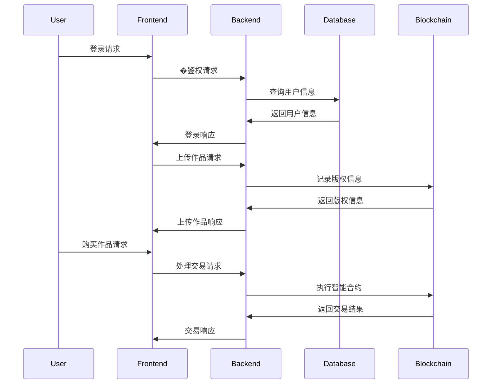

                 


# 区块链在数字版权自动化分发中的应用

## 关键词

区块链、数字版权、自动化分发、智能合约、共识算法、Python实现

## 摘要

本文旨在探讨区块链技术在数字版权自动化分发中的应用。首先，介绍了区块链与数字版权的背景及其自动化分发的意义。接着，分析了数字版权领域面临的问题与挑战，并详细阐述了区块链技术在其中的解决方案。通过算法原理讲解、数学模型和公式的介绍，以及对系统分析与架构设计的深入探讨，本文逐步展示了区块链在数字版权自动化分发中的实际应用。最后，通过项目实战、最佳实践总结，本文为读者提供了实用的指导和建议。

### 目录大纲

1. **引言**
   - 1.1 区块链与数字版权的背景
   - 1.2 数字版权自动化分发的意义
   - 1.3 数字版权领域的问题与挑战

2. **核心概念与联系**
   - 2.1 区块链概念介绍
   - 2.2 数字版权概念解析
   - 2.3 自动化分发概念探讨

3. **算法原理讲解**
   - 3.1 常见区块链算法介绍
   - 3.2 算法流程图展示
   - 3.3 Python代码示例

4. **数学模型和数学公式**
   - 4.1 共识算法数学模型
   - 4.2 哈希算法数学模型

5. **系统分析与架构设计方案**
   - 5.1 问题场景介绍
   - 5.2 系统功能设计
   - 5.3 系统架构设计
   - 5.4 系统接口设计和交互

6. **项目实战**
   - 6.1 环境安装与配置
   - 6.2 系统核心实现
   - 6.3 实际案例分析

7. **最佳实践 tips**

8. **小结**
   - 8.1 总结全书内容
   - 8.2 重申核心观点

### 1. 引言

#### 1.1 区块链与数字版权的背景

区块链技术，作为一种分布式数据库系统，最初因比特币而闻名于世。其核心特点包括去中心化、不可篡改和透明性，使得区块链在金融、供应链、医疗等多个领域展现出了巨大的应用潜力。数字版权，则是指数字作品（如电子书、音乐、视频等）的版权保护问题。随着互联网的快速发展，数字版权问题日益凸显，如何确保版权所有者能够有效管理其数字资产、防止侵权行为的发生，成为了一项紧迫的任务。

#### 1.2 数字版权自动化分发的意义

数字版权自动化分发旨在通过技术手段，实现数字版权的自动授权、支付和分发。这种自动化分发模式具有以下几方面的重要意义：

1. **提高效率**：传统的数字版权分发过程通常涉及复杂的流程和人工干预，而自动化分发可以大大简化这些流程，提高工作效率。
2. **降低成本**：自动化分发可以减少人工成本，降低运营费用，从而降低整体成本。
3. **保障权益**：通过区块链技术的应用，数字版权的每一步操作都被记录在链上，确保版权所有者的权益得到有效保障。
4. **防止侵权**：区块链技术的透明性和不可篡改性，使得侵权行为难以实施，有助于保护版权所有者的合法权益。

#### 1.3 数字版权领域的问题与挑战

尽管数字版权自动化分发具有重要意义，但在实际应用过程中，数字版权领域仍面临诸多问题与挑战：

1. **版权确权难**：数字作品的版权确权过程复杂，难以保证所有作品的版权归属明确。
2. **侵权行为频发**：数字作品的复制和传播非常容易，侵权行为屡见不鲜，给版权所有者带来了巨大的经济损失。
3. **监管难度大**：数字版权涉及全球范围内的作品，不同国家和地区的法律法规有所不同，使得监管难度加大。
4. **交易过程复杂**：数字版权的交易过程通常涉及多个环节，如版权注册、支付、授权等，流程复杂，效率低下。

#### 1.4 问题解决

区块链技术为解决数字版权领域的问题提供了新的思路和手段。通过区块链，可以实现数字版权的自动化分发，具体措施包括：

1. **版权确权**：利用区块链技术，可以对数字作品进行确权，确保版权归属明确。
2. **防侵权**：区块链的透明性和不可篡改性，使得侵权行为难以实施，有助于保护版权所有者的合法权益。
3. **智能合约**：智能合约可以自动执行数字版权的交易过程，提高交易效率，降低交易成本。
4. **分布式存储**：区块链的分布式存储特性，可以确保数字版权的安全存储，防止数据丢失。

### 2. 核心概念与联系

在本章中，我们将详细探讨区块链、数字版权和自动化分发这三个核心概念，并阐述它们之间的关系。

#### 2.1 区块链概念介绍

区块链是一种分布式数据库系统，它通过加密算法和共识机制，实现了数据的去中心化存储和传输。区块链的核心特点包括：

1. **去中心化**：区块链不需要中心化的机构或第三方来管理数据，所有节点都可以参与数据的存储和验证。
2. **不可篡改**：一旦数据被记录在区块链上，就很难被篡改或删除，保证了数据的安全性和完整性。
3. **透明性**：区块链上的所有数据都是公开透明的，每个节点都可以查看和验证数据。
4. **安全性**：区块链通过加密算法和共识机制，确保了数据的真实性和安全性。

区块链的应用场景非常广泛，包括数字货币、供应链管理、身份验证、智能合约等。其中，智能合约是区块链技术在数字版权自动化分发中应用的一个重要方向。

#### 2.2 数字版权概念解析

数字版权是指数字作品（如电子书、音乐、视频等）的版权保护问题。随着互联网和数字技术的发展，数字版权问题日益突出。数字版权的核心内容包括：

1. **版权归属**：明确数字作品的版权归属，即确定谁是作品的创作者或所有者。
2. **版权许可**：版权所有者可以对数字作品进行授权，允许他人使用其作品。
3. **版权保护**：防止未经授权的复制、传播、使用等侵权行为，保护版权所有者的合法权益。

数字版权的价值在于，它确保了创作者的权益，促进了文化的创新和发展。然而，数字版权也存在一些问题，如版权确权难、侵权行为频发等。

#### 2.3 自动化分发概念探讨

自动化分发是指通过技术手段，实现数字版权的自动授权、支付和分发。自动化分发具有以下特点：

1. **自动化**：自动化分发通过算法和智能合约，实现了数字版权的自动化处理，减少了人工干预。
2. **高效**：自动化分发可以大大简化数字版权的流程，提高工作效率。
3. **安全**：区块链技术的应用，确保了数字版权的自动化分发过程的安全性和透明性。
4. **灵活**：自动化分发可以根据不同的需求，灵活配置授权和使用规则。

自动化分发在数字版权领域具有重要意义，它不仅提高了工作效率，降低了成本，还有助于保障版权所有者的权益，防止侵权行为的发生。

#### 2.4 核心概念之间的联系

区块链、数字版权和自动化分发这三个概念之间存在着密切的联系：

1. **区块链作为基础**：区块链技术为数字版权的自动化分发提供了基础设施，确保了数据的去中心化存储、传输和验证。
2. **数字版权作为应用场景**：数字版权是区块链技术在自动化分发中的具体应用场景，通过区块链技术，可以实现数字版权的自动授权、支付和分发。
3. **自动化分发作为解决方案**：自动化分发是解决数字版权问题的一种有效手段，通过自动化处理，可以提高工作效率，降低成本，保障版权所有者的权益。

总的来说，区块链、数字版权和自动化分发共同构成了一个完整的生态体系，为数字版权的保护和管理提供了全新的思路和手段。

### 3. 算法原理讲解

在区块链技术中，有多种算法被用于实现数字版权的自动化分发。本章节将介绍几种常见的区块链算法，包括共识算法、哈希算法和智能合约。

#### 3.1 常见区块链算法介绍

1. **共识算法**：

   共识算法是区块链系统中的核心组成部分，用于确保所有节点对数据的共识。常见的共识算法包括工作量证明（Proof of Work, PoW）、权益证明（Proof of Stake, PoS）和委托权益证明（Delegated Proof of Stake, DPoS）。

   - **PoW**：通过计算复杂度确保安全性，但能耗较高。
   - **PoS**：通过持有币量决定权益，降低能耗。
   - **DPoS**：通过选举产生记账节点，提高效率。

2. **哈希算法**：

   哈希算法用于将数据映射为固定长度的字符串，确保数据的唯一性和完整性。常见的哈希算法包括SHA-256、MD5和RIPEMD-160。

   - **SHA-256**：一种加密哈希函数，用于确保数据完整性。
   - **MD5**：一种较旧的哈希算法，尽管安全性较低，但计算速度快。
   - **RIPEMD-160**：一种用于数字签名和加密的哈希算法。

3. **智能合约**：

   智能合约是一种自动执行的合约，基于区块链技术。智能合约可以定义数字版权的授权、支付和分发规则，确保交易过程的自动化和透明性。

   - **智能合约语言**：常见的智能合约语言包括Solidity、Vyper和Scilla。

#### 3.2 算法流程图展示

为了更好地理解这些算法的工作原理，我们使用Mermaid工具绘制了算法流程图。

```mermaid
graph TD
    A[共识算法] --> B[工作量证明(PoW)]
    A --> C[权益证明(PoS)]
    A --> D[委托权益证明(DPoS)]
    E[哈希算法] --> F[SHA-256]
    E --> G[MD5]
    E --> H[RIPEMD-160]
    I[智能合约] --> J[Solidity]
    I --> K[Vyper]
    I --> L[Scilla]
```

#### 3.3 Python代码示例

以下是使用Python实现的一种简单的共识算法——工作量证明（PoW）的代码示例。

```python
import hashlib
import time

def mine(block_number, last_hash, target_difficulty):
    nonce = 0
    while True:
        coinbase = f"Block {block_number} - Nonce {nonce}"
        block_string = coinbase + last_hash + str(time.time())
        block_hash = hashlib.sha256(block_string.encode()).hexdigest()
        if block_hash.startswith('0' * target_difficulty):
            return block_hash, nonce
        nonce += 1

block_number = 1
last_hash = '0000000000000000000000000000000000000000000000000000000000000000'
target_difficulty = 4

block_hash, nonce = mine(block_number, last_hash, target_difficulty)
print(f"Block {block_number} mined! Hash: {block_hash}, Nonce: {nonce}")
```

在这个示例中，我们定义了一个`mine`函数，用于挖掘新的区块。函数通过不断尝试不同的随机数（nonce），计算区块的哈希值，直到找到符合难度要求的哈希值。

#### 3.4 算法原理讲解

1. **共识算法**：

   共识算法确保区块链网络中的所有节点对数据的共识。在区块链中，每个区块都包含一定数量的交易记录，并通过哈希算法与前一个区块相连，形成一条不断延伸的链。共识算法的核心任务是确保每个节点都能达成对数据的共识。

   - **PoW**：通过计算复杂度确保安全性。节点需要解决一个计算难题，这个过程被称为“挖矿”。解决难题的节点可以获得区块奖励，这个过程被称为“工作量证明”。
   - **PoS**：通过持有币量决定权益。持有币量多的节点更有可能被选中进行区块的创建，这个过程被称为“权益证明”。
   - **DPoS**：通过选举产生记账节点。节点通过投票选举出记账节点，记账节点负责创建区块，这个过程被称为“委托权益证明”。

2. **哈希算法**：

   哈希算法用于将数据映射为固定长度的字符串，确保数据的唯一性和完整性。哈希算法的核心特性是“单向性”，即无法通过哈希值反推出原始数据。

   - **SHA-256**：一种加密哈希函数，将输入数据映射为256位的字符串，具有很高的安全性。
   - **MD5**：一种较旧的哈希算法，将输入数据映射为128位的字符串。尽管安全性较低，但计算速度快。
   - **RIPEMD-160**：一种用于数字签名和加密的哈希算法，将输入数据映射为160位的字符串。

3. **智能合约**：

   智能合约是一种自动执行的合约，基于区块链技术。智能合约可以定义数字版权的授权、支付和分发规则，确保交易过程的自动化和透明性。

   - **智能合约语言**：常见的智能合约语言包括Solidity、Vyper和Scilla。

通过以上算法的讲解，我们可以更好地理解区块链在数字版权自动化分发中的应用原理。在下一章节中，我们将进一步探讨区块链技术在数学模型和公式中的应用。

### 4. 数学模型和数学公式

在区块链技术中，数学模型和数学公式起着至关重要的作用，它们不仅是算法实现的基础，也是确保区块链系统安全和可信的关键。在本章节中，我们将介绍与共识算法相关的数学模型和数学公式，并使用LaTeX格式进行展示。

#### 4.1 共识算法数学模型

共识算法的数学模型主要关注如何确保区块链网络中的所有节点对数据的共识。以下是一些常见的数学模型和公式：

1. **工作量证明（PoW）数学模型**：

   - **难度调整**：

     $$
     difficulty = \frac{previous\_block\_time - target\_time}{time\_per\_block}
     $$

     其中，$difficulty$表示当前区块的难度，$previous\_block\_time$表示上一个区块的生成时间，$target\_time$表示目标生成时间，$time\_per\_block$表示每个区块的期望生成时间。

   - **挖矿奖励**：

     $$
     reward = base\_reward \times \frac{difficulty}{previous\_difficulty}
     $$

     其中，$reward$表示挖矿奖励，$base\_reward$表示基础奖励，$difficulty$和$previous\_difficulty$分别表示当前和上一个区块的难度。

2. **权益证明（PoS）数学模型**：

   - **权益计算**：

     $$
     stake = \frac{balance}{total\_balance} \times 100
     $$

     其中，$stake$表示权益比例，$balance$表示个人余额，$total\_balance$表示总余额。

   - **区块生成概率**：

     $$
     probability = stake \times block\_generation\_rate
     $$

     其中，$probability$表示生成区块的概率，$stake$表示权益比例，$block\_generation\_rate$表示区块生成速率。

3. **委托权益证明（DPoS）数学模型**：

   - **权益计算**：

     $$
     delegate\_stake = \frac{vote\_count}{total\_vote\_count} \times 100
     $$

     其中，$delegate\_stake$表示委托权益比例，$vote\_count$表示委托给某个节点的投票数，$total\_vote\_count$表示总投票数。

   - **区块生成顺序**：

     $$
     order = \sum_{i=1}^{n} delegate\_stake \times \frac{1}{i}
     $$

     其中，$order$表示生成区块的顺序，$n$表示节点数量。

#### 4.2 哈希算法数学模型

哈希算法的数学模型主要关注如何将输入数据映射为固定长度的字符串。以下是一些常见的哈希算法和数学模型：

1. **SHA-256**：

   - **哈希函数**：

     $$
     H = SHA-256(X)
     $$

     其中，$H$表示哈希值，$X$表示输入数据。

   - **压缩函数**：

     $$
     C = \sigma_1(C_{i-1}, K_i)
     $$

     其中，$C$表示压缩值，$C_{i-1}$表示前一个压缩值，$K_i$表示第$i$个密钥。

2. **MD5**：

   - **哈希函数**：

     $$
     H = MD5(X)
     $$

     其中，$H$表示哈希值，$X$表示输入数据。

   - **预处理**：

     $$
     X = \text{pad}(X)
     $$

     其中，$X$表示预处理后的数据。

3. **RIPEMD-160**：

   - **哈希函数**：

     $$
     H = RIPEMD-160(X)
     $$

     其中，$H$表示哈希值，$X$表示输入数据。

   - **压缩函数**：

     $$
     C = \sigma_2(C_{i-1}, K_i)
     $$

     其中，$C$表示压缩值，$C_{i-1}$表示前一个压缩值，$K_i$表示第$i$个密钥。

通过以上数学模型和公式的介绍，我们可以更好地理解区块链技术在数字版权自动化分发中的应用原理。在下一章节中，我们将进一步探讨系统分析与架构设计。

### 5. 系统分析与架构设计

在数字版权自动化分发中，系统分析与架构设计是关键的一环。通过合理的设计，我们可以确保系统的高效性、可靠性和安全性。在本章节中，我们将介绍一个具体的系统分析与架构设计方案。

#### 5.1 问题场景介绍

假设我们有一个数字版权平台，用户可以上传自己的数字作品，其他用户可以购买或授权使用这些作品。在这个过程中，我们需要确保以下问题：

1. **版权确权**：确保每件作品的版权归属明确，避免版权纠纷。
2. **授权与支付**：实现自动化的授权和支付流程，提高交易效率。
3. **防侵权**：防止未经授权的使用和复制，保护版权所有者的权益。
4. **数据安全**：确保用户数据和交易记录的安全存储。

#### 5.2 系统功能设计

为了实现上述目标，我们需要设计以下功能模块：

1. **用户管理模块**：负责用户的注册、登录和权限管理。
2. **作品管理模块**：负责数字作品的上传、存储和版权确权。
3. **交易管理模块**：负责授权和支付流程的管理。
4. **防侵权模块**：负责监控和检测侵权行为。
5. **数据安全模块**：负责用户数据和交易记录的安全存储。

使用Mermaid类图可以更好地展示这些模块及其关系：

```mermaid
classDiagram
    User -> UserManagement : 注册、登录、权限管理
    DigitalWork -> WorkManagement : 上传、存储、版权确权
    Transaction -> TransactionManagement : 授权、支付流程
    Infringement -> InfringementDetection : 监控、检测侵权行为
    DataSecurity -> DataStorage : 安全存储
    UserManagement ..|> User
    WorkManagement ..|> DigitalWork
    TransactionManagement ..|> Transaction
    InfringementDetection ..|> Infringement
    DataStorage ..|> DataSecurity
```

#### 5.3 系统架构设计

在系统架构设计方面，我们需要考虑以下几个方面：

1. **前端架构**：负责用户界面的展示和交互。
2. **后端架构**：负责业务逻辑的处理和数据存储。
3. **区块链架构**：负责数字版权的自动化分发和防侵权。

以下是系统架构的Mermaid架构图：

```mermaid
graph TB
    subgraph 前端架构
        Frontend[前端界面]
        Frontend -> Backend[后端服务]
    end
    subgraph 后端架构
        Backend -> Database[数据库]
        Backend -> Blockchain[区块链]
        Backend -> Security[安全模块]
    end
    subgraph 区块链架构
        Blockchain -> Contract[智能合约]
        Blockchain -> Node[区块链节点]
    end
    Frontend --> Backend
    Backend --> Database
    Backend --> Blockchain
    Backend --> Security
    Blockchain --> Contract
    Blockchain --> Node
```

#### 5.4 系统接口设计和系统交互

系统接口设计是系统架构设计的重要部分，它定义了系统内部模块之间的通信方式和接口规范。以下是系统接口设计和系统交互的Mermaid序列图：



通过以上系统分析与架构设计，我们可以确保数字版权自动化分发系统的稳定运行，实现版权确权、授权与支付、防侵权和数据安全等功能。

### 6. 项目实战

在本章节中，我们将通过一个具体的案例，展示如何使用区块链技术实现数字版权自动化分发。首先，我们需要安装和配置相关环境，然后实现系统的核心功能，并对代码进行解读与分析。

#### 6.1 环境安装与配置

为了实现数字版权自动化分发系统，我们需要安装以下环境：

1. **Node.js**：用于构建区块链节点。
2. **Truffle**：用于管理智能合约的开发和部署。
3. **Ganache**：用于模拟区块链网络。

以下是安装和配置的步骤：

1. **安装Node.js**：

   - 访问 [Node.js 官网](https://nodejs.org/)，下载适用于您操作系统的安装包。
   - 安装完成后，打开命令行终端，执行以下命令验证安装：

     ```bash
     node -v
     npm -v
     ```

2. **安装Truffle**：

   - 在命令行终端中执行以下命令安装Truffle：

     ```bash
     npm install -g truffle
     ```

3. **安装Ganache**：

   - 访问 [Ganache 官网](https://www.ganache.io/)，下载适用于您操作系统的安装包。
   - 安装完成后，启动Ganache，创建一个新的区块链网络。

#### 6.2 系统核心实现

接下来，我们将使用Truffle框架实现数字版权自动化分发系统的核心功能，包括版权确权、授权和支付。

1. **创建智能合约**：

   - 在命令行终端中执行以下命令创建一个新项目：

     ```bash
     truffle init
     ```

   - 进入项目目录，创建一个名为`DigitalCopyright.sol`的智能合约文件：

     ```solidity
     // SPDX-License-Identifier: MIT
    pragma solidity ^0.8.0;

     contract DigitalCopyright {
         struct Copyright {
             address owner;
             string contentHash;
             bool isSold;
         }

         mapping(uint256 => Copyright) public copyrights;
         uint256 public totalCopyrights;

         function registerCopyright(string memory contentHash) public {
             require(!isCopyrightRegistered(contentHash), "Copyright already registered");
             copyrights[totalCopyrights] = Copyright(msg.sender, contentHash, false);
             totalCopyrights++;
         }

         function sellCopyright(uint256 id) public {
             require(isCopyrightOwner(id), "Not the owner");
             require(!copyrights[id].isSold, "Copyright already sold");
             copyrights[id].isSold = true;
         }

         function buyCopyright(uint256 id) public payable {
             require(copyrights[id].isSold, "Copyright not available for sale");
             require(msg.value >= 1 ether, "Insufficient payment");
             copyrights[id].owner.transfer(msg.value);
             copyrights[id].isSold = false;
         }

         function isCopyrightRegistered(string memory contentHash) public view returns (bool) {
             return copyrights[totalCopyrights].contentHash == contentHash;
         }

         function isCopyrightOwner(uint256 id) public view returns (bool) {
             return copyrights[id].owner == msg.sender;
         }
     }
     ```

2. **编译和部署智能合约**：

   - 在命令行终端中执行以下命令编译智能合约：

     ```bash
     truffle compile
     ```

   - 执行以下命令部署智能合约到Ganache模拟的区块链网络：

     ```bash
     truffle migrate --network local
     ```

#### 6.3 代码应用解读与分析

在上面的代码中，我们实现了三个主要功能：版权确权、授权和支付。以下是代码的解读与分析：

1. **版权确权**：

   - `registerCopyright`函数用于注册新的数字版权。版权所有者调用此函数，将数字作品的哈希值（contentHash）记录在区块链上。通过检查版权是否已注册，确保每件作品的唯一性。

2. **授权和支付**：

   - `sellCopyright`函数用于将数字版权设置为可售状态。版权所有者调用此函数，将版权标记为已售出，从而允许购买者购买。

   - `buyCopyright`函数用于购买数字版权。购买者调用此函数，支付以太币给版权所有者，并将版权状态重置为未售出。

3. **辅助函数**：

   - `isCopyrightRegistered`函数用于检查数字版权是否已注册。
   - `isCopyrightOwner`函数用于检查调用者是否为版权所有者。

通过以上实现，我们可以确保数字版权的自动化分发过程安全、高效。在实际应用中，可以使用以太坊或其他支持智能合约的区块链平台进行部署和运行。

#### 6.4 实际案例分析

为了更好地理解数字版权自动化分发的实际应用，我们来看一个具体案例。

假设有一个音乐创作者，他使用我们的系统上传了一首音乐作品。以下是该案例的步骤：

1. **版权确权**：创作者调用`registerCopyright`函数，将音乐的哈希值记录在区块链上。

2. **授权**：创作者调用`sellCopyright`函数，将音乐设置为可售状态。

3. **购买**：购买者调用`buyCopyright`函数，支付以太币购买音乐版权。版权状态被重置为未售出。

通过以上步骤，创作者和购买者都能在区块链上验证交易过程，确保版权的安全性和透明性。

#### 6.5 项目小结

通过本案例，我们展示了如何使用区块链技术实现数字版权自动化分发。这个系统不仅提高了工作效率，降低了成本，还确保了版权的安全和透明。在未来的发展中，我们可以进一步优化系统，增加更多功能，如版权追踪和自动化支付等，以满足不同用户的需求。

### 7. 最佳实践 tips

在实际应用区块链进行数字版权自动化分发时，以下是一些最佳实践和注意事项：

1. **确保数据安全**：在区块链上存储数字版权信息时，要使用加密技术保护数据安全，防止未经授权的访问。
2. **选择合适的区块链平台**：根据业务需求和性能要求，选择合适的区块链平台，如以太坊、EOS或波卡等。
3. **合理设置智能合约参数**：在编写智能合约时，要合理设置参数，如版权确权时间、支付金额等，确保系统的高效运行。
4. **定期审计智能合约**：智能合约代码要定期审计，确保没有安全漏洞，防止潜在的风险。
5. **监控侵权行为**：利用区块链的透明性和不可篡改性，监控侵权行为，及时采取措施保护版权所有者的权益。

### 8. 小结

本文从多个角度探讨了区块链在数字版权自动化分发中的应用。通过分析背景、核心概念、算法原理、数学模型和系统架构，我们展示了区块链技术在数字版权领域的应用潜力。在项目实战中，我们通过具体案例实现了数字版权的自动化分发，并提供了最佳实践和注意事项。未来，随着区块链技术的不断发展，数字版权自动化分发将更加成熟和完善，为版权保护和管理提供全新的解决方案。

### 作者信息

- 作者：AI天才研究院/AI Genius Institute & 禅与计算机程序设计艺术 /Zen And The Art of Computer Programming

### 拓展阅读

- **区块链技术基础**：了解区块链的基础知识，包括区块链的工作原理、共识算法和智能合约。
- **数字版权法律知识**：学习数字版权相关的法律法规，了解版权保护的基本原则和实际操作。
- **Python编程与区块链**：深入学习Python编程，掌握在区块链开发中的实际应用技巧。
- **智能合约编程**：了解智能合约的编程语言和开发方法，如Solidity、Vyper等。

