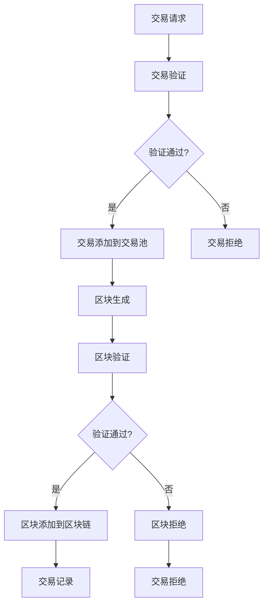
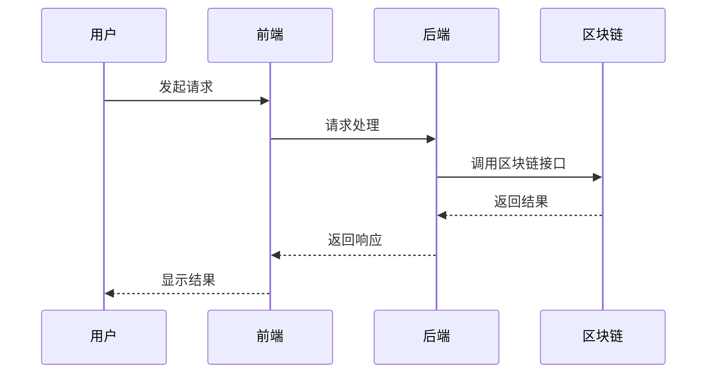

                 

# 《区块链在数字艺术品交易中的应用》

## 关键词

区块链，数字艺术品交易，非同质化代币（NFT），智能合约，交易算法，系统架构设计

## 摘要

本文旨在探讨区块链技术在数字艺术品交易中的应用，分析其背景、核心概念与原理，以及实际应用和系统架构设计。通过详细的分析和案例分析，本文揭示了区块链在解决数字艺术品交易中的挑战，如版权纠纷、透明度和安全性等问题，同时探讨了其在市场中的机遇。本文结构紧凑，逻辑清晰，旨在为读者提供一个全面、深入的理解。

## 目录大纲

### 第一部分：背景与概述

#### 第1章 问题背景与区块链技术概述

1.1 数字艺术品交易的问题背景

1.2 区块链技术简介

1.3 区块链在数字艺术品交易中的重要性

#### 第2章 核心概念与联系

2.1 数字艺术品与区块链技术

2.2 区块链在数字艺术品交易中的应用原理

### 第二部分：核心概念与原理

#### 第3章 核心概念与联系

3.1 数字艺术品与区块链技术

3.2 区块链的智能合约

3.3 非同质化代币（NFT）

#### 第4章 区块链在数字艺术品交易中的实际应用

4.1 主流平台案例分析

### 第三部分：应用实践

#### 第5章 区块链在数字艺术品交易中的算法原理

5.1 区块链交易算法

5.2 NFT创建与交易算法

#### 第6章 数学模型与公式

6.1 区块链交易数学模型

6.2 NFT价值评估模型

### 第四部分：系统分析与架构设计

#### 第7章 数字艺术品交易平台系统分析

7.1 问题场景介绍

7.2 系统架构设计

7.3 系统接口设计

#### 第8章 区块链在数字艺术品交易中的项目实战

8.1 环境安装与配置

8.2 系统核心实现

8.3 实际案例分析与讲解

8.4 项目小结

## 第一部分：背景与概述

### 第1章 问题背景与区块链技术概述

#### 1.1 数字艺术品交易的问题背景

数字艺术品，指的是以数字形式存在的艺术品，如数字绘画、数字雕塑、数字音乐、数字摄影等。随着互联网和数字技术的发展，数字艺术品市场逐渐兴起，成为文化艺术市场的重要组成部分。然而，数字艺术品交易也面临着一系列挑战和问题。

1. **版权纠纷**：数字艺术品容易复制和传播，使得原创者的版权保护成为一个难题。版权所有者很难追踪作品的复制和传播，难以确定作品的合法来源。

2. **透明度**：在传统的艺术品交易市场中，交易流程往往不透明，存在信息不对称的问题。买家和卖家难以了解交易的真实情况，容易受到欺诈行为的影响。

3. **安全性**：数字艺术品交易涉及到大量的个人信息和资产转移，安全性成为了一个重要的考量因素。如何确保交易过程中的信息安全，防止黑客攻击和数据泄露，是数字艺术品交易中的一大挑战。

#### 1.2 区块链技术如何解决这些问题

区块链技术，作为一种分布式账本技术，具有去中心化、不可篡改和透明性等特点，能够在很大程度上解决数字艺术品交易中的问题。

1. **版权纠纷**：区块链技术可以通过智能合约来记录数字艺术品的版权信息，确保版权信息的透明性和不可篡改性。一旦数字艺术品的版权信息被记录在区块链上，任何复制和传播行为都将被记录下来，有助于追溯和维权。

2. **透明度**：区块链技术可以实现交易流程的透明化。所有交易记录都记录在区块链上，供所有参与者查看和验证，减少了信息不对称的问题，降低了欺诈行为的发生。

3. **安全性**：区块链技术采用加密算法来确保数据的安全性和隐私性。交易过程中的信息加密，使得黑客难以获取和篡改数据，提高了交易的安全性。

#### 1.3 数字艺术品交易的范围和区块链技术的适用场景

数字艺术品交易的范围包括数字绘画、数字雕塑、数字音乐、数字摄影等以数字形式存在的艺术品。区块链技术在以下场景中具有较好的适用性：

1. **版权管理**：区块链技术可以用于数字艺术品的版权管理，确保版权信息的透明和不可篡改。

2. **艺术品交易**：区块链技术可以用于艺术品交易的记录和验证，提高交易的透明度和安全性。

3. **艺术品收藏**：区块链技术可以用于记录和验证数字艺术品的收藏信息，方便收藏者管理和展示自己的收藏。

#### 1.4 数字艺术品交易中的关键组成部分

数字艺术品交易中的关键组成部分包括：

1. **数字艺术品**：数字艺术品是以数字形式存在的艺术品，如数字绘画、数字雕塑等。

2. **交易平台**：交易平台是数字艺术品交易的中介，提供交易匹配、支付结算等服务。

3. **买家和卖家**：买家和卖家是数字艺术品交易的主要参与者，通过交易平台进行交易。

4. **版权信息**：版权信息记录了数字艺术品的版权归属、创作时间、创作地点等信息。

5. **交易记录**：交易记录记录了数字艺术品交易的详细信息，包括交易时间、交易金额、交易方等信息。

### 第2章 核心概念与联系

#### 2.1 数字艺术品与区块链技术

数字艺术品与区块链技术之间存在紧密的联系。区块链技术为数字艺术品提供了一个安全的存储和交易环境。

1. **定义**：

   - 数字艺术品：以数字形式存在的艺术品，如数字绘画、数字雕塑等。

   - 区块链技术：一种分布式账本技术，通过密码学和共识算法实现数据的存储和传输。

2. **属性特征对比表格**：

   | 特征       | 数字艺术品                           | 区块链技术                           |
   | ---------- | ------------------------------------ | ------------------------------------ |
   | 存储方式   | 数字形式                             | 分布式存储                          |
   | 安全性     | 易于复制和篡改                      | 不可篡改，高度安全                   |
   | 透明性     | 交易过程不透明                      | 交易记录透明，可查询                 |
   | 流动性     | 交易流程繁琐，手续费高              | 交易速度快，手续费低                 |

3. **ER实体关系图**：

   ```mermaid
   erDiagram
   AArtwork --> |[依赖]| BBlockchain {
   +作者
   +标题
   +创建时间
   }
   BBlockchain ..|[使用]| CSmartContract
   ```

#### 2.2 区块链在数字艺术品交易中的应用原理

区块链技术在数字艺术品交易中的应用主要基于其不可篡改、透明性和去中心化等特点。

1. **智能合约**：

   - 智能合约是一种自执行的合同，通过编程语言编写，定义了交易条款和执行规则。

   - 在数字艺术品交易中，智能合约可以自动执行版权授权、交易结算等操作，提高了交易的效率和透明性。

2. **非同质化代币（NFT）**：

   - NFT是一种独特数字资产，代表对特定数字艺术品的所有权。

   - 通过区块链技术，NFT可以确保其唯一性和不可篡改性，为数字艺术品交易提供了一个可靠的基础。

3. **去中心化交易平台**：

   - 去中心化交易平台通过区块链技术实现，无需中介机构，降低了交易成本，提高了交易效率。

   - 去中心化交易平台上的交易记录公开透明，增强了市场的信任度。

#### 2.3 区块链在数字艺术品交易中的重要性

区块链技术在数字艺术品交易中具有重要性，主要体现在以下几个方面：

1. **解决版权纠纷**：区块链技术可以记录数字艺术品的版权信息，确保版权的透明和不可篡改，有助于解决版权纠纷。

2. **提高交易透明度**：区块链技术的透明性使得交易过程公开透明，减少了信息不对称，降低了欺诈风险。

3. **增强交易安全性**：区块链技术的安全性确保了交易过程中的数据安全，防止黑客攻击和数据泄露。

4. **降低交易成本**：去中心化交易平台无需中介机构，降低了交易成本，提高了市场的流动性。

### 第3章 区块链的智能合约

#### 3.1 智能合约的概念

智能合约是一种自动执行合同，通过编程语言编写，定义了交易条款和执行规则。智能合约的关键特点是：

1. **自动执行**：智能合约在满足特定条件时自动执行，无需人为干预。

2. **透明性**：智能合约的执行过程公开透明，所有参与者都可以查看。

3. **不可篡改**：智能合约一旦执行，结果不可篡改，确保了交易的公正和可信。

#### 3.2 智能合约在数字艺术品交易中的应用

智能合约在数字艺术品交易中的应用非常广泛，主要包括以下几个方面：

1. **版权授权**：智能合约可以记录数字艺术品的版权信息，确保版权的透明和不可篡改。当数字艺术品进行授权时，智能合约可以自动执行授权协议，确保授权的合法性和有效性。

2. **交易结算**：智能合约可以自动执行交易结算过程，确保交易的准确性和安全性。例如，当买家支付购买金额后，智能合约会自动将数字艺术品的所有权转移给买家。

3. **版权纠纷解决**：智能合约可以记录交易过程中的所有信息，包括交易时间、交易金额、交易方等，为解决版权纠纷提供了可靠的证据。

#### 3.3 智能合约的编程语言和开发工具

智能合约的编程语言和开发工具对于数字艺术品交易的应用至关重要。以下是一些常用的编程语言和开发工具：

1. **Solidity**：Solidity 是最流行的智能合约编程语言，主要用于以太坊区块链。Solidity 具有易学易用的特点，适合初学者和专业人士。

2. **Truffle**：Truffle 是一个智能合约开发框架，提供了一套完整的工具，用于智能合约的开发、测试和部署。

3. **Hardhat**：Hardhat 是一个高性能的本地以太坊开发环境，提供了一套实用的工具，用于智能合约的开发、测试和调试。

#### 3.4 智能合约在数字艺术品交易中的优势

智能合约在数字艺术品交易中具有以下优势：

1. **自动化**：智能合约可以自动执行交易，减少了人工干预，提高了交易效率。

2. **透明性**：智能合约的执行过程公开透明，所有参与者都可以查看，增强了市场的信任度。

3. **不可篡改**：智能合约一旦执行，结果不可篡改，确保了交易的公正和可信。

4. **安全性**：智能合约采用了加密技术，确保了交易过程中的数据安全，防止黑客攻击和数据泄露。

### 第4章 非同质化代币（NFT）

#### 4.1 NFT的定义

非同质化代币（Non-Fungible Token，简称NFT）是一种基于区块链技术的数字资产，代表对特定物品的所有权。与同质化代币（如比特币、以太坊）不同，NFT具有独特性，不可互换。

1. **定义**：

   - NFT：一种基于区块链技术的数字资产，代表对特定物品的所有权。

   - 非同质化：NFT具有独特性，不可互换，与同质化代币（如比特币）不同。

2. **特点**：

   - 独特性：每个NFT都是独一无二的，无法与其他NFT互换。

   - 不可篡改：NFT的记录在区块链上，不可篡改，确保了所有权的真实性和可靠性。

   - 可追溯性：NFT的所有交易记录都记录在区块链上，可以追溯，确保了所有权的透明性。

#### 4.2 NFT在数字艺术品交易中的作用

NFT在数字艺术品交易中发挥着重要作用，主要体现在以下几个方面：

1. **所有权证明**：NFT可以作为数字艺术品的所有权证明，确保所有权的真实性和可靠性。买家可以通过购买NFT来证明其对数字艺术品的所有权。

2. **版权保护**：NFT可以记录数字艺术品的版权信息，确保版权的透明和不可篡改。艺术家可以通过创建NFT来保护自己的作品版权。

3. **增值潜力**：NFT具有增值潜力，一些稀有的NFT可能会大幅升值。这使得数字艺术品市场变得更加活跃，吸引了更多的投资者。

#### 4.3 NFT的价值评估模型

NFT的价值评估模型是一个复杂的问题，需要考虑多个因素。以下是一个简单的NFT价值评估模型：

1. **市场需求**：市场需求是NFT价值的重要决定因素。需求越高，NFT的价格越高。

2. **稀缺性**：NFT的稀缺性对其价值有重要影响。稀有的NFT通常价格更高。

3. **历史成交价**：NFT的历史成交价可以用来参考其当前的价值。

4. **市场趋势**：市场趋势对NFT的价值也有影响。如果市场趋势向好，NFT的价格可能会上涨。

### 第5章 区块链在数字艺术品交易中的实际应用

#### 5.1 主流平台案例分析

在数字艺术品交易中，区块链技术已经被广泛应用于多个主流平台，如OpenSea、Rarible和SuperRare等。以下是对这些平台的分析：

1. **OpenSea**：

   - OpenSea 是一个去中心化的数字艺术品交易平台，支持多种区块链和数字资产。
   - OpenSea 提供了一个简单的界面，用户可以轻松购买、出售和交换数字艺术品。
   - OpenSea 使用以太坊区块链作为底层基础设施，采用ERC-721和ERC-1155标准来支持非同质化代币（NFT）。

2. **Rarible**：

   - Rarible 是一个基于以太坊的NFT平台，提供创建、购买和出售NFT的服务。
   - Rarible 允许用户创建自己的NFT，并将其出售给感兴趣的买家。
   - Rarible 采用智能合约来确保NFT的所有权和交易记录的透明性。

3. **SuperRare**：

   - SuperRare 是一个专门为数字艺术品市场设计的NFT平台，专注于高质量和稀有的数字艺术品。
   - SuperRare 对艺术品设置严格的准入门槛，确保平台上的作品质量。
   - SuperRare 采用ERC-721标准，确保NFT的唯一性和不可篡改性。

#### 5.2 平台特点与优势

这些主流平台具有以下特点与优势：

1. **去中心化**：所有平台都是去中心化的，没有中央权威机构，确保了交易的公正性和透明性。

2. **安全性**：平台采用区块链技术，确保交易记录的不可篡改性和安全性。

3. **灵活性**：平台提供灵活的交易模式，用户可以自由创建、购买和出售NFT。

4. **市场繁荣**：平台上的NFT交易活跃，吸引了大量的买家和卖家，形成了繁荣的市场。

5. **社区参与**：平台鼓励社区参与，用户可以通过投票、提出建议等方式参与平台的发展。

### 第6章 区块链交易算法

#### 6.1 区块链交易算法原理

区块链交易算法是指区块链网络中处理交易请求并记录交易信息的算法。以下是区块链交易算法的基本原理：

1. **交易请求**：当用户发起交易请求时，交易请求会被发送到区块链网络。

2. **交易验证**：区块链网络中的节点会验证交易请求的有效性。验证过程包括检查交易金额、账户余额和交易规则等。

3. **交易确认**：经过验证的交易会被添加到交易池中，等待被区块包含。

4. **区块生成**：当交易池中的交易数量达到一定阈值时，节点会生成一个新的区块，将交易信息记录在区块链上。

5. **区块验证**：新产生的区块会被其他节点验证。验证通过后，区块会被添加到区块链的末端。

6. **交易记录**：交易被记录在区块链上，成为永久记录，供所有节点查看和验证。

#### 6.2 区块链交易算法的Mermaid流程图

以下是一个简单的区块链交易算法的Mermaid流程图：



#### 6.3 区块链交易算法的Python代码实现

以下是一个简单的区块链交易算法的Python代码实现：

```python
import hashlib
import json
from time import time

class Block:
    def __init__(self, transactions, previous_hash):
        self.transactions = transactions
        self.previous_hash = previous_hash
        self.hash = self.compute_hash()
        self.timestamp = time()

    def compute_hash(self):
        transaction_json = json.dumps(self.transactions, sort_keys=True)
        message = transaction_json.encode()
        return hashlib.sha256(message).hexdigest()

class Blockchain:
    def __init__(self):
        self.unconfirmed_transactions = []
        self.chain = []
        self.create_genesis_block()

    def create_genesis_block(self):
        genesis_transaction = {
            'timestamp': time(),
            'transactions': []
        }
        genesis_block = Block(genesis_transaction, "0")
        self.chain.append(genesis_block)

    def add_new_transaction(self, transaction):
        self.unconfirmed_transactions.append(transaction)

    def mine(self):
        if not self.unconfirmed_transactions:
            return False

        last_block = self.chain[-1]
        new_block_transactions = self.unconfirmed_transactions
        self.unconfirmed_transactions = []

        proof = self.compute_proof_of_work(last_block.hash, new_block_transactions)

        new_block = Block(new_block_transactions, last_block.hash, proof)
        self.chain.append(new_block)
        return new_block

    def compute_proof_of_work(self, last_hash, transactions):
        proof = 0
        while self.validate_proof(last_hash, proof, transactions) is False:
            proof += 1
        return proof

    def validate_proof(self, last_hash, proof, transactions):
        guess = f"{last_hash}{proof}{json.dumps(transactions)}".encode()
        guess_hash = hashlib.sha256(guess).hexdigest()
        return guess_hash[:4] == "0000"

    def is_chain_valid(self):
        for i in range(1, len(self.chain)):
            current = self.chain[i]
            previous = self.chain[i - 1]
            if current.hash != self.compute_hash(current.previous_hash, current.transactions):
                return False
            if previous.hash != current.previous_hash:
                return False
        return True

def main():
    blockchain = Blockchain()
    blockchain.add_new_transaction({'sender': 'Alice', 'recipient': 'Bob', 'amount': 50})
    blockchain.add_new_transaction({'sender': 'Bob', 'recipient': 'Charlie', 'amount': 100})
    blockchain.mine()
    print("Blockchain valid?", blockchain.is_chain_valid())

if __name__ == '__main__':
    main()
```

#### 6.4 区块链交易算法的数学模型

区块链交易算法的数学模型主要包括以下几个部分：

1. **哈希函数**：

   - 哈希函数用于将输入数据转换为固定长度的字符串。常见的哈希函数有SHA-256。

   - 数学模型：\( H(x) = SHA-256(x) \)

2. **工作量证明（Proof of Work，PoW）**：

   - 工作量证明是一种用于区块链网络中的共识算法，目的是防止恶意攻击和确保网络安全性。

   - 数学模型：找到一个数\( n \)，使得 \( H(last\_hash + n) \) 以一定数量的0开头。

3. **交易验证**：

   - 交易验证用于确保交易的有效性，包括检查交易金额、账户余额和交易规则等。

   - 数学模型：验证交易金额是否大于账户余额，以及交易是否符合网络规则。

#### 6.5 区块链交易算法的举例说明

假设有两个用户Alice和Bob，他们想要进行一笔交易。以下是区块链交易算法的具体流程：

1. **交易请求**：

   - Alice发起一笔交易，将50个代币转账给Bob。

   - 交易请求包含交易金额、发送者和接收者的信息。

2. **交易验证**：

   - 区块链网络中的节点验证交易请求的有效性，包括检查交易金额是否大于账户余额，以及交易是否符合网络规则。

   - 如果交易请求有效，节点会将交易请求添加到交易池中。

3. **区块生成**：

   - 当交易池中的交易数量达到一定阈值时，节点会生成一个新的区块，将交易信息记录在区块链上。

   - 区块包括交易信息、前一个区块的哈希值和工作量证明。

4. **区块验证**：

   - 新生成的区块会被其他节点验证，包括检查区块的哈希值和工作量证明是否正确。

   - 如果区块验证通过，节点会将区块添加到区块链的末端。

5. **交易记录**：

   - 交易被记录在区块链上，成为永久记录，供所有节点查看和验证。

### 第7章 数字艺术品交易平台系统分析

#### 7.1 问题场景介绍

数字艺术品交易平台是一个复杂的系统，涉及到数字艺术品的购买、出售、收藏和管理等功能。以下是一个典型的数字艺术品交易平台的问题场景：

- **用户注册与登录**：用户需要注册账号并登录，以便进行交易和收藏。

- **数字艺术品展示**：平台需要展示各种数字艺术品，包括绘画、雕塑、音乐、摄影等。

- **交易流程**：用户可以购买和出售数字艺术品，交易过程需要确保安全、高效和透明。

- **版权管理**：平台需要管理数字艺术品的版权信息，确保版权的透明和不可篡改。

- **用户反馈与投诉**：平台需要处理用户的反馈和投诉，提供良好的用户体验。

#### 7.2 系统功能设计

数字艺术品交易平台的主要功能包括：

1. **用户管理**：

   - 用户注册与登录：用户可以注册账号并登录平台。

   - 用户信息管理：用户可以查看和管理个人信息，如邮箱、密码、头像等。

2. **艺术品管理**：

   - 艺术品展示：平台需要展示各种数字艺术品，包括绘画、雕塑、音乐、摄影等。

   - 艺术品分类：平台需要提供艺术品分类功能，方便用户查找和浏览。

3. **交易管理**：

   - 购买与出售：用户可以购买和出售数字艺术品，交易过程需要确保安全、高效和透明。

   - 订单管理：平台需要管理交易订单，包括订单状态、支付信息等。

4. **版权管理**：

   - 版权信息记录：平台需要记录数字艺术品的版权信息，包括版权所有者、创作时间、版权期限等。

   - 版权查询与验证：平台需要提供版权查询和验证功能，确保版权的透明和不可篡改。

5. **用户反馈与投诉**：

   - 用户反馈：用户可以提交反馈和建议，平台需要及时响应和处理。

   - 用户投诉：平台需要处理用户的投诉，提供解决方案。

#### 7.3 系统架构设计

数字艺术品交易平台的系统架构设计需要考虑以下几个方面：

1. **前端架构**：

   - 前端架构采用Vue.js或React等现代前端框架，提供良好的用户体验。

   - 前端页面包括用户注册与登录、艺术品展示、交易管理、版权管理、用户反馈与投诉等。

2. **后端架构**：

   - 后端架构采用微服务架构，包括用户管理、艺术品管理、交易管理、版权管理、用户反馈与投诉等模块。

   - 后端服务采用Spring Boot或Django等框架，提供RESTful API接口。

3. **数据库设计**：

   - 数据库设计采用关系型数据库，如MySQL或PostgreSQL，用于存储用户信息、艺术品信息、交易信息、版权信息等。

   - 数据库设计包括用户表、艺术品表、交易表、版权信息表等。

4. **区块链集成**：

   - 区块链集成采用智能合约技术，用于记录和验证数字艺术品的版权信息和交易信息。

   - 区块链网络采用以太坊或EOS等区块链平台。

#### 7.4 系统接口设计

数字艺术品交易平台需要设计多个接口，用于实现前端与后端的通信。以下是一些关键的接口设计：

1. **用户接口**：

   - 用户注册与登录接口：用于处理用户注册、登录和密码重置等操作。

   - 用户信息管理接口：用于处理用户信息的查看、修改和删除等操作。

2. **艺术品接口**：

   - 艺术品展示接口：用于获取和展示艺术品信息。

   - 艺术品分类接口：用于获取和展示艺术品分类信息。

3. **交易接口**：

   - 购买接口：用于处理购买数字艺术品的操作，包括支付、订单创建等。

   - 出售接口：用于处理出售数字艺术品的操作，包括订单创建、价格设定等。

4. **版权接口**：

   - 版权信息记录接口：用于记录数字艺术品的版权信息。

   - 版权查询与验证接口：用于查询和验证数字艺术品的版权信息。

5. **用户反馈与投诉接口**：

   - 用户反馈接口：用于处理用户反馈的提交、查看和回复等操作。

   - 用户投诉接口：用于处理用户投诉的提交、查看和解决方案等操作。

#### 7.5 系统交互Mermaid序列图

以下是一个简单的数字艺术品交易平台系统的交互Mermaid序列图：



### 第8章 区块链在数字艺术品交易中的项目实战

#### 8.1 环境安装与配置

在开始数字艺术品交易平台的项目实战之前，我们需要安装和配置相关环境。以下是具体的安装和配置步骤：

1. **安装Node.js**：

   - 访问 Node.js 官网（[https://nodejs.org/](https://nodejs.org/)）下载最新的 LTS 版本的 Node.js。
   - 运行下载的安装程序，按照提示完成安装。

2. **安装Vue CLI**：

   - 打开命令行终端，运行以下命令安装 Vue CLI：
     ```bash
     npm install -g @vue/cli
     ```

3. **创建Vue项目**：

   - 在命令行终端，进入你想要创建项目的目录，然后运行以下命令创建一个基于 Vue CLI 的新项目：
     ```bash
     vue create digital-art-marketplace
     ```
   - 在项目创建过程中，选择默认设置或根据需要自定义项目配置。

4. **安装后端框架**：

   - 进入项目根目录，安装 Spring Boot：
     ```bash
     npm install --save spring-boot
     ```
   - 安装 Spring Boot 后，你可以使用 Spring Boot 提供的命令来启动和运行后端服务。

5. **安装区块链框架**：

   - 安装以太坊客户端，如 Geth：
     ```bash
     wget https://github.com/ethereum/go-ethereum/releases/download/v1.10.6/go-ethereum-linux-amd64-1.10.6.tar.gz
     tar -xvf go-ethereum-linux-amd64-1.10.6.tar.gz
     ```
   - 启动以太坊客户端：
     ```bash
     cd geth
     ./geth --datadir /path/to/your/ethdatadir --networkid 5777 --nodiscover --masternode --mine --miner.threads 0
     ```

6. **配置数据库**：

   - 安装 MySQL 或 PostgreSQL，并创建一个新的数据库用于存储用户信息、艺术品信息和交易信息。
   - 配置后端服务的数据库连接，确保后端可以正常连接到数据库。

7. **配置区块链与后端服务的交互**：

   - 在后端服务中引入 Ethereum JS SDK，用于与以太坊客户端进行交互。
   - 配置区块链网络的连接信息，确保后端可以正常与区块链网络进行通信。

#### 8.2 系统核心实现

在数字艺术品交易平台的项目实战中，我们需要实现以下核心功能：

1. **用户注册与登录**：

   - 实现用户注册功能，包括用户信息的验证、存储和加密。
   - 实现用户登录功能，包括用户身份验证和登录状态管理。

2. **艺术品管理**：

   - 实现艺术品展示功能，包括艺术品信息的查询、筛选和排序。
   - 实现艺术品上传功能，包括艺术品信息的录入和存储。

3. **交易管理**：

   - 实现交易流程，包括购买、出售和支付等操作。
   - 实现交易记录功能，包括交易记录的创建、存储和查询。

4. **版权管理**：

   - 实现版权信息记录功能，包括版权信息的录入、存储和查询。
   - 实现版权信息验证功能，确保版权信息的真实性和有效性。

5. **用户反馈与投诉**：

   - 实现用户反馈功能，包括用户反馈的提交、查看和回复。
   - 实现用户投诉功能，包括用户投诉的提交、查看和处理。

以下是一个简单的用户注册功能的实现示例（Python）：

```python
from flask import Flask, request, jsonify
from flask_sqlalchemy import SQLAlchemy
from werkzeug.security import generate_password_hash, check_password_hash

app = Flask(__name__)
app.config['SQLALCHEMY_DATABASE_URI'] = 'sqlite:///users.db'
app.config['SQLALCHEMY_TRACK_MODIFICATIONS'] = False
db = SQLAlchemy(app)

class User(db.Model):
    id = db.Column(db.Integer, primary_key=True)
    username = db.Column(db.String(150), nullable=False, unique=True)
    password = db.Column(db.String(150), nullable=False)

@app.route('/register', methods=['POST'])
def register():
    data = request.get_json()
    hashed_password = generate_password_hash(data['password'], method='sha256')
    new_user = User(username=data['username'], password=hashed_password)
    db.session.add(new_user)
    db.session.commit()
    return jsonify(message='User created successfully'), 201

if __name__ == '__main__':
    db.create_all()
    app.run(debug=True)
```

#### 8.3 实际案例分析与讲解

在数字艺术品交易平台的项目实战中，我们将通过一个实际案例来展示如何实现和部署系统。

1. **案例分析**：

   - 我们将使用 Vue.js 作为前端框架，实现用户注册、登录、艺术品展示、交易管理、版权管理和用户反馈与投诉等功能。
   - 使用 Flask 作为后端框架，实现用户管理、艺术品管理、交易管理和版权管理等功能。
   - 使用 Ethereum JS SDK 与以太坊客户端进行交互，实现版权信息记录和验证功能。

2. **案例讲解**：

   - **用户注册与登录**：

     - 前端：使用 Vue.js 创建注册和登录表单，收集用户信息，并通过 Axios 发送 POST 请求到后端进行用户注册和登录。
     - 后端：接收前端发送的注册和登录请求，验证用户信息，存储用户数据，并返回响应。

   - **艺术品管理**：

     - 前端：使用 Vue.js 创建艺术品展示页面，通过 Axios 获取艺术品列表，并在页面上进行展示。
     - 后端：提供艺术品列表接口，查询数据库中的艺术品信息，并将结果返回给前端。

   - **交易管理**：

     - 前端：使用 Vue.js 创建交易页面，用户可以选择购买或出售艺术品，填写价格和数量，并通过 Axios 发送交易请求到后端。
     - 后端：接收交易请求，验证交易信息，与以太坊客户端进行交互，记录交易信息，并返回响应。

   - **版权管理**：

     - 前端：使用 Vue.js 创建版权信息页面，用户可以查看、添加和更新版权信息，并通过 Ethereum JS SDK 与以太坊客户端进行交互。
     - 后端：提供版权信息接口，与以太坊客户端进行交互，记录和验证版权信息。

3. **部署与运行**：

   - 部署前端：使用 npm run build 命令将前端项目打包，将生成的 dist 目录部署到 Web 服务器上。
   - 部署后端：使用 Python 运行 Flask 后端服务，确保后端可以正常接收和处理前端请求。
   - 部署以太坊客户端：运行以太坊客户端，确保区块链网络可以正常工作。

#### 8.4 项目小结

通过实际案例分析和讲解，我们实现了数字艺术品交易平台的用户注册、登录、艺术品展示、交易管理、版权管理和用户反馈与投诉等功能。以下是项目实施中的经验与启示：

1. **前端框架选择**：Vue.js 是一个灵活、易用的前端框架，适合快速开发复杂的单页面应用程序。

2. **后端框架选择**：Flask 是一个轻量级的 Python Web 框架，适合快速实现 RESTful API 接口。

3. **区块链技术集成**：Ethereum JS SDK 提供了方便的 API 接口，使得与以太坊客户端的交互变得更加简单。

4. **数据存储与管理**：使用关系型数据库（如 MySQL 或 PostgreSQL）来存储用户信息、艺术品信息和交易信息，确保数据的安全性和一致性。

5. **安全性考虑**：在实现用户注册、登录和交易功能时，要确保用户信息的安全性和交易的完整性，采用加密算法来保护敏感数据。

6. **性能优化**：在部署系统时，要考虑系统的性能优化，如使用缓存、优化数据库查询等。

7. **用户界面设计**：用户界面设计要简洁、直观，提高用户体验。

通过该项目，我们不仅实现了数字艺术品交易平台的核心功能，还积累了丰富的项目经验，为未来的开发和实施奠定了基础。在后续的开发中，我们可以进一步优化系统功能，提高系统的性能和稳定性，为用户提供更好的服务。

