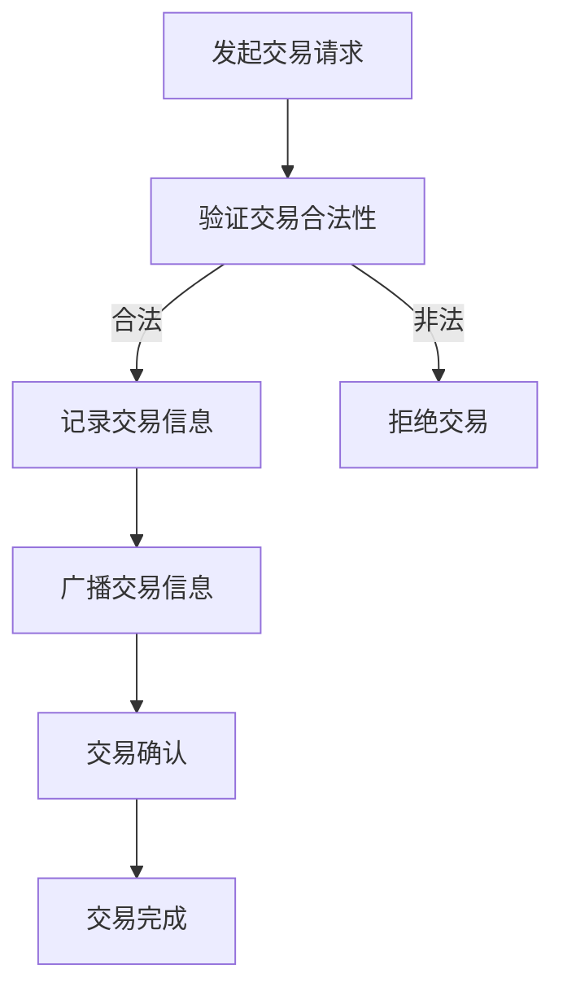
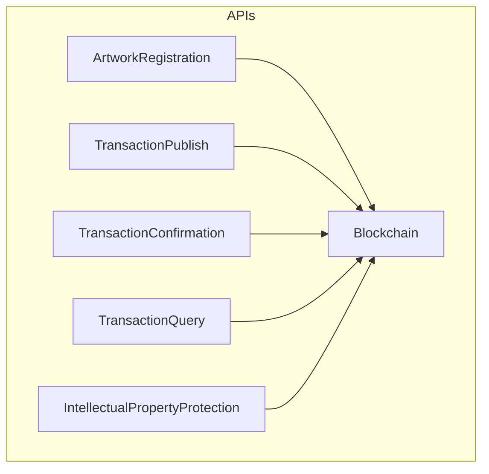
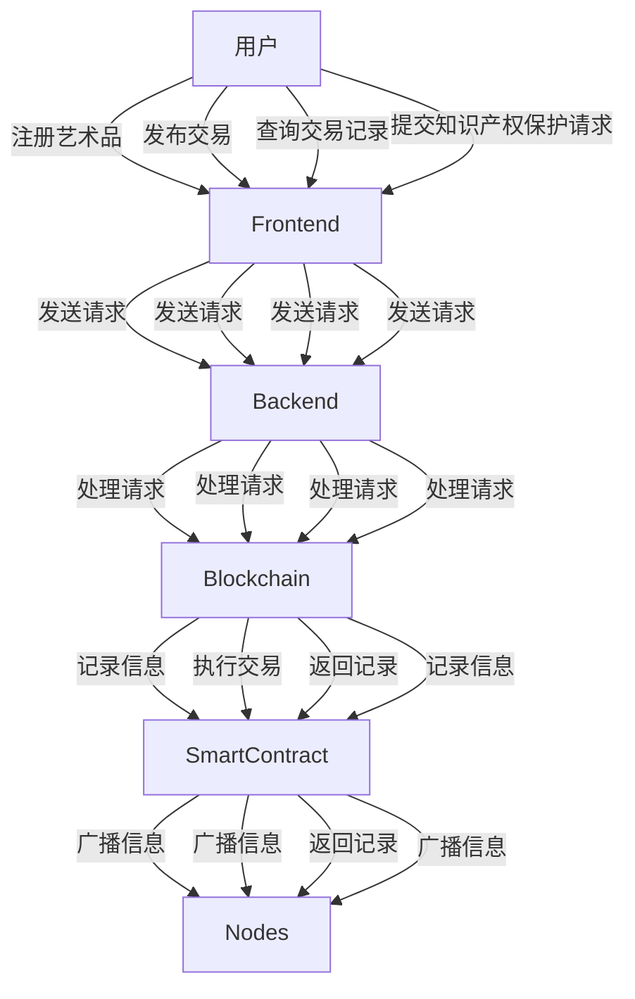

                 

### 引言

**关键词：区块链、数字艺术品交易、透明化应用**

随着数字化时代的到来，数字艺术品交易逐渐成为艺术市场的重要组成部分。然而，传统艺术品交易市场存在诸多问题，如交易信息不透明、真伪难辨、交易流程复杂等。这些问题不仅影响了市场的健康发展，也降低了消费者的购买信心。为了解决这些问题，区块链技术的应用成为了一个新的发展方向。

区块链是一种去中心化的分布式账本技术，具有去中心化、不可篡改、透明化等特点。这些特点使得区块链在数字艺术品交易中具有巨大的潜力，可以实现交易的透明化、安全化和去中心化。

本篇文章将从以下几个方面展开讨论：

1. **背景介绍**：阐述数字艺术品交易中存在的问题以及区块链技术的背景。
2. **核心概念与联系**：详细解释区块链、数字艺术品交易和透明化应用的概念，并分析它们之间的联系。
3. **算法原理讲解**：介绍区块链在数字艺术品交易中的具体算法原理，并通过mermaid流程图和Python源代码进行说明。
4. **系统分析与架构设计方案**：分析区块链在数字艺术品交易中的系统架构设计，并介绍相关技术实现。
5. **项目实战**：介绍一个实际的区块链数字艺术品交易平台项目，包括环境安装、系统核心实现和实际案例分析。
6. **最佳实践 tips**：总结项目经验和注意事项，提供最佳实践建议。

通过对以上几个方面的详细探讨，本文旨在为读者提供一个全面了解区块链在数字艺术品交易中透明化应用的技术视角。

### 背景介绍

#### 问题背景

数字艺术品交易是随着数字技术的发展而兴起的一种新型艺术品交易模式。它主要涉及数字化的艺术品，如数字绘画、数字音乐、虚拟现实作品等，通过互联网进行交易。然而，这种交易模式也带来了一系列问题，其中最为显著的是交易信息的透明度问题。

传统艺术品交易市场存在信息不透明的问题。一方面，艺术品交易过程中的相关信息，如艺术家信息、创作过程、真伪鉴定等，往往无法得到有效记录和验证。这使得买家难以判断所购艺术品的价值和真实性，增加了交易风险。另一方面，艺术品交易流程复杂，涉及多个环节，如拍卖、鉴定、运输等，这些环节的信息透明度也难以保证。

此外，数字艺术品交易中还存在一个问题，即知识产权的保护。数字艺术品易于复制和篡改，使得原创者的权益难以得到有效保障。这不仅影响了艺术家的创作积极性，也对整个数字艺术品市场的健康发展产生了负面影响。

#### 问题描述

数字艺术品交易中的主要问题可以归纳为以下几点：

1. **交易信息不透明**：艺术品交易过程中的相关信息难以得到有效记录和验证，导致买家难以判断艺术品的价值和真实性。
2. **交易流程复杂**：艺术品交易涉及多个环节，流程复杂，信息传递不畅，增加了交易成本和时间。
3. **知识产权保护不足**：数字艺术品易于复制和篡改，原创者的权益难以得到有效保障。

这些问题不仅影响了消费者的购买信心，也限制了数字艺术品市场的进一步发展。为了解决这些问题，需要找到一种能够提高交易透明度、简化交易流程和保护知识产权的技术手段。

#### 问题解决

区块链技术的出现为解决这些问题提供了一种新的思路。区块链是一种去中心化的分布式账本技术，具有去中心化、不可篡改、透明化等特点。这些特点使得区块链在数字艺术品交易中具有巨大的潜力，可以实现交易的透明化、安全化和去中心化。

首先，区块链技术可以提供一种去中心化的交易记录方式。在区块链上，交易记录是公开的，任何参与者都可以查看。这大大提高了交易信息的透明度，买家可以轻松地查看艺术品的交易历史，从而判断艺术品的价值和真实性。

其次，区块链技术可以简化交易流程。通过智能合约，交易可以在区块链上进行自动执行，无需经过多个中间环节。这不仅可以降低交易成本，还可以缩短交易时间，提高交易效率。

最后，区块链技术可以提供一种有效的知识产权保护机制。在区块链上，每个数字艺术品都可以被唯一标识，并且其所有权和使用权限等信息都可以被记录和验证。这不仅可以保障原创者的权益，还可以防止数字艺术品的复制和篡改。

#### 边界与外延

区块链在数字艺术品交易中的应用是一个相对较新的领域，其边界和外延仍在不断发展。目前，区块链技术主要应用于以下几个方面：

1. **交易记录**：记录数字艺术品交易的详细信息，如艺术家信息、交易价格、交易时间等。
2. **知识产权保护**：为数字艺术品提供唯一标识和所有权证明，防止复制和篡改。
3. **交易流程优化**：通过智能合约简化交易流程，降低交易成本和时间。
4. **艺术品溯源**：记录数字艺术品的创作过程和历史，提高其透明度和可信度。

然而，区块链技术在实际应用中仍面临一些挑战，如技术成本高、性能瓶颈等。此外，区块链技术的普及还需要法律法规的支持和社会各界的共同努力。

#### 核心概念

在本节中，我们将介绍三个核心概念：区块链、数字艺术品交易和透明化应用。

1. **区块链**：区块链是一种去中心化的分布式账本技术，由多个区块组成，每个区块包含一定数量的交易记录。区块链上的数据是公开透明的，且一旦记录在区块链上，就无法被篡改。区块链的核心特点是去中心化和不可篡改，这使得它在数字艺术品交易中具有巨大的潜力。

2. **数字艺术品交易**：数字艺术品交易是指通过互联网进行的数字化艺术品买卖活动。这些艺术品可以是数字绘画、数字音乐、虚拟现实作品等。数字艺术品交易的特点是交易流程简单、交易速度快、交易范围广泛。

3. **透明化应用**：透明化应用是指通过技术手段提高信息的透明度，使信息更加公开、可信和可验证。在数字艺术品交易中，透明化应用可以通过区块链技术实现交易的透明化，提高消费者对艺术品的信任度。

这三个概念相互关联，共同构成了区块链在数字艺术品交易中透明化应用的基础。在接下来的章节中，我们将进一步探讨这些概念，并分析它们在区块链中的应用。

### 核心概念与联系

#### 区块链的定义与特点

区块链是一种去中心化的分布式账本技术，通过加密算法和共识机制确保数据的安全性和一致性。其核心特点包括：

1. **去中心化**：区块链不需要中心化的第三方机构进行管理和验证，而是通过分布式网络中的多个节点共同维护数据，这使得区块链具有较高的抗攻击性和透明度。
   
2. **不可篡改**：区块链上的数据一旦被记录，就几乎无法被篡改。这是因为每个区块都包含前一个区块的哈希值，形成一个连续的链条，任何对数据的修改都会导致哈希值的改变，从而被其他节点检测出来。

3. **透明化**：区块链上的数据是公开透明的，任何节点都可以访问和验证数据。这使得区块链非常适合需要高度透明性的应用场景。

4. **安全性**：区块链使用加密算法保护数据，确保数据在传输和存储过程中的安全性。常见的加密算法包括SHA-256、RSA等。

#### 数字艺术品交易的现状与问题

数字艺术品交易是指通过互联网进行数字形式的艺术品买卖活动。随着技术的进步，数字艺术品交易市场呈现出快速发展的态势。然而，这一市场也面临着一些问题：

1. **交易信息不透明**：数字艺术品交易过程中，艺术品的创作背景、交易历史等重要信息难以透明化，消费者难以判断艺术品的价值和真实性。

2. **交易流程复杂**：数字艺术品交易涉及多个环节，如支付、鉴定、运输等，流程复杂，且存在信息传递不畅的问题。

3. **知识产权保护不足**：数字艺术品易于复制和篡改，原创者的权益难以得到有效保障。

#### 透明化应用的概念与意义

透明化应用是指通过技术手段提高信息的透明度，使得信息更加公开、可信和可验证。在数字艺术品交易中，透明化应用具有重要的意义：

1. **提高信任度**：通过区块链技术，艺术品的创作背景、交易历史等信息可以被公开验证，提高了消费者对艺术品的信任度。

2. **简化交易流程**：区块链技术可以实现交易的自动化执行，简化交易流程，降低交易成本和时间。

3. **保障知识产权**：区块链技术可以为数字艺术品提供唯一标识和所有权证明，防止复制和篡改，保护原创者的权益。

#### 概念属性特征对比表格

为了更好地理解这三个概念，我们可以通过一个对比表格来展示它们的属性特征：

| 概念           | 特征                                                         |
|----------------|------------------------------------------------------------|
| 区块链          | 去中心化、不可篡改、透明化、安全性                           |
| 数字艺术品交易  | 交易信息不透明、交易流程复杂、知识产权保护不足             |
| 透明化应用      | 提高信任度、简化交易流程、保障知识产权                      |

#### ER实体关系图架构

为了进一步理解区块链在数字艺术品交易中的关系，我们可以使用ER（实体-关系）图来描述各实体及其关系。

1. **实体**：区块链、数字艺术品、交易者、交易记录。
2. **关系**：区块链与交易记录之间存在包含关系，数字艺术品与交易记录之间存在关联关系，交易者与交易记录之间存在交易关系。

以下是一个简化的ER图：

```mermaid
erDiagram
  Blockchain ||--|{ TransactionRecord }|-- DigitalArt
  TransactionRecord ||--|{ Trader }|
```

在这个ER图中，区块链是基础，包含了所有的交易记录。每个交易记录都与一个数字艺术品和一个交易者相关联，从而实现了数字艺术品交易的透明化。

通过以上对核心概念与联系的详细分析，我们可以看到区块链在数字艺术品交易中的重要性，以及它如何通过透明化应用解决现有问题。在接下来的章节中，我们将进一步探讨区块链在数字艺术品交易中的应用原理和实现方法。

#### 算法原理讲解

区块链在数字艺术品交易中的应用，离不开其底层算法的支持。本节我们将详细讲解区块链在数字艺术品交易中的算法原理，并通过mermaid流程图和Python源代码进行说明。

##### 算法mermaid流程图

首先，我们使用mermaid流程图来展示区块链在数字艺术品交易中的基本流程：



在这个流程图中，我们包含了以下步骤：

1. **发起交易请求**：交易者发起交易请求，包括要交易的数字艺术品和交易金额等信息。
2. **验证交易合法性**：系统对交易请求进行合法性验证，确保交易符合规则。
3. **记录交易信息**：如果交易合法，系统将交易信息记录在区块链上。
4. **广播交易信息**：将交易信息广播到整个区块链网络，以便其他节点进行验证。
5. **交易确认**：其他节点对交易信息进行验证，并在确认无误后进行记账。
6. **交易完成**：交易完成，交易信息被永久记录在区块链上。

##### Python源代码

为了更好地理解算法原理，我们使用Python编写了一个简单的示例代码：

```python
import hashlib
import json

class Block:
    def __init__(self, index, transactions, timestamp, previous_hash):
        self.index = index
        self.transactions = transactions
        self.timestamp = timestamp
        self.previous_hash = previous_hash
        self.hash = self.compute_hash()

    def compute_hash(self):
        transaction_json = json.dumps(self.transactions, sort_keys=True)
        message = f'{self.index}{transaction_json}{self.timestamp}{self.previous_hash}'
        return hashlib.sha256(message.encode()).hexdigest()

class Blockchain:
    def __init__(self):
        self.unconfirmed_transactions = []
        self.chain = []
        self.create_genesis_block()

    def create_genesis_block(self):
        genesis_block = Block(0, [], timestamp.time(), "0")
        genesis_block.hash = genesis_block.compute_hash()
        self.chain.append(genesis_block)

    def add_new_transaction(self, transaction):
        self.unconfirmed_transactions.append(transaction)

    def mine_block(self):
        if not self.unconfirmed_transactions:
            return False

        last_block = self.chain[-1]
        new_block = Block(len(self.chain), self.unconfirmed_transactions, timestamp.time(), last_block.hash)
        new_block.hash = new_block.compute_hash()

        self.chain.append(new_block)
        self.unconfirmed_transactions = []

        return new_block.index

    def is_chain_valid(self):
        for i in range(1, len(self.chain)):
            current = self.chain[i]
            previous = self.chain[i - 1]
            if current.hash != current.compute_hash():
                return False
            if current.previous_hash != previous.hash:
                return False
        return True
```

在这个示例代码中，我们定义了两个类：`Block` 和 `Blockchain`。`Block` 类表示一个区块，包含索引、交易、时间戳和前一个区块的哈希值。`Blockchain` 类表示整个区块链，包含未确认的交易、主链和一个创建创世区块的方法。

`add_new_transaction` 方法用于添加新的交易到未确认交易列表中。`mine_block` 方法用于挖掘新区块，并将其添加到主链中。`is_chain_valid` 方法用于验证区块链的有效性。

##### 数学模型和公式

区块链中的交易验证和共识机制通常涉及到复杂的数学模型和公式。以下是其中一些关键的数学模型和公式：

1. **哈希函数**：
   - SHA-256：SHA-256是一种加密哈希函数，用于生成数据摘要。其公式为：
     $$ H = SHA-256(message) $$
   - 哈希值是固定的256位长度的字符串，用于唯一标识数据。

2. **工作量证明（Proof of Work, PoW）**：
   - PoW是一种共识机制，用于确保区块链的安全性。其核心思想是通过计算难度来防止恶意节点篡改区块链。
   - 难度公式为：
     $$ difficulty = \frac{target}{hash_rate} $$
   - 其中，`target` 是一个预设的目标值，`hash_rate` 是网络中的计算能力。

3. **共识算法**：
   - 共识算法用于确保区块链网络中的所有节点达成一致。常见的共识算法包括PoW、PoS（权益证明）和DPoS（委托权益证明）等。

通过上述算法原理和示例代码，我们可以看到区块链在数字艺术品交易中的基本运作机制。在下一节中，我们将进一步探讨区块链在数字艺术品交易中的系统架构设计。

### 系统分析与架构设计方案

#### 问题场景介绍

在现代数字艺术品交易中，艺术品的所有权和交易历史信息通常分散存储在不同的平台和系统中，导致信息不透明且难以追踪。这不仅增加了消费者的交易风险，也限制了艺术品市场的健康发展。为了解决这一问题，我们需要设计一个基于区块链的数字艺术品交易系统，以确保交易过程的透明性和安全性。

#### 项目介绍

本项目的目标是构建一个基于区块链的数字艺术品交易平台，实现艺术品的去中心化交易和透明化管理。该平台旨在解决当前数字艺术品交易中的信息不透明、交易流程复杂和知识产权保护不足等问题。

#### 系统功能设计

数字艺术品交易平台需要实现以下核心功能：

1. **艺术品注册**：艺术家可以将自己的数字艺术品注册到平台上，并获得唯一标识符。
2. **交易管理**：平台提供艺术品交易管理功能，包括发布交易信息、确认交易和记录交易历史等。
3. **交易确认**：通过区块链网络中的节点对交易进行验证和确认，确保交易的安全性。
4. **交易历史查询**：用户可以查询艺术品的历史交易记录，了解艺术品的所有权和交易历史。
5. **知识产权保护**：通过区块链技术记录和验证艺术品的知识产权信息，保障原创者的权益。

#### 系统架构设计

数字艺术品交易平台的系统架构包括以下主要部分：

1. **区块链网络**：作为核心组件，区块链网络负责存储和管理交易数据。它由多个节点组成，每个节点都参与交易的验证和确认。
2. **智能合约**：智能合约是实现交易自动执行的关键组件。它根据预设的条件自动执行交易，确保交易的安全性和效率。
3. **前端应用**：前端应用为用户提供艺术品注册、交易管理和查询等功能。它通过REST API与后端区块链网络进行交互。
4. **后端服务**：后端服务负责处理区块链网络的通信和交易验证。它包括交易管理、交易确认和区块链同步等功能。

以下是一个简化的系统架构图：

```mermaid
graph TB
    subgraph BlockChain
        Blockchain
        Nodes
    end

    subgraph SmartContract
        SmartContract
    end

    subgraph Frontend
        UserInterface --> API
    end

    subgraph Backend
        TransactionManagement
        TransactionValidation
        BlockchainSync
    end

    Blockchain --> Nodes
    Blockchain --> SmartContract
    SmartContract --> Nodes
    API --> TransactionManagement
    TransactionManagement --> BlockchainSync
    BlockchainSync --> Blockchain
    TransactionValidation --> Blockchain
```

在这个架构图中，区块链网络和智能合约是核心组件，负责存储和管理交易数据。前端应用通过API与后端服务进行交互，实现用户界面和交易管理功能。后端服务则负责处理区块链网络的通信和交易验证。

#### 系统接口设计

数字艺术品交易平台需要设计一系列接口，以实现不同组件之间的交互。以下是一些关键的接口设计：

1. **艺术品注册接口**：用于艺术家注册数字艺术品，包括艺术品信息、所有者信息和唯一标识符等。
2. **交易发布接口**：用于发布交易信息，包括交易双方、交易金额和交易条款等。
3. **交易确认接口**：用于对交易进行确认，确保交易的安全性和合法性。
4. **交易查询接口**：用于查询艺术品的历史交易记录，包括交易日期、交易金额和交易双方等信息。
5. **知识产权保护接口**：用于记录和验证艺术品的知识产权信息，保障原创者的权益。

以下是一个简化的接口设计图：



在这个接口设计图中，不同接口通过区块链网络进行交互，实现数字艺术品交易的各个功能。

#### 系统交互

数字艺术品交易平台中的各个组件和接口需要通过一定的交互流程来实现功能。以下是一个简化的系统交互流程：

1. **艺术品注册**：艺术家通过前端应用提交艺术品注册请求，后端服务将请求发送到区块链网络，由智能合约验证并记录艺术品信息。
2. **交易发布**：买家通过前端应用发布交易请求，后端服务将请求发送到区块链网络，由智能合约验证交易合法性。
3. **交易确认**：智能合约自动执行交易，并广播交易信息到区块链网络。其他节点对交易信息进行验证，并在确认无误后进行记账。
4. **交易查询**：用户通过前端应用查询艺术品的历史交易记录，后端服务从区块链网络中获取相关数据并返回给用户。
5. **知识产权保护**：艺术家通过前端应用提交知识产权保护请求，后端服务将请求发送到区块链网络，由智能合约记录知识产权信息。

以下是一个简化的系统交互图：



通过以上系统分析与架构设计方案，我们可以看到一个基于区块链的数字艺术品交易平台的整体架构和交互流程。在下一节中，我们将通过一个实际项目来展示区块链在数字艺术品交易中的具体应用。

### 项目实战

为了更好地展示区块链在数字艺术品交易中的实际应用，我们选择了一个实际项目——一个去中心化的数字艺术品交易平台（DApp）——进行讲解。本节将详细介绍项目的环境安装、系统核心实现、代码应用解读与分析、实际案例分析与详细讲解，以及项目小结。

#### 环境安装

首先，我们需要安装一些必要的软件和工具，以搭建数字艺术品交易平台的基础环境。以下是主要步骤：

1. **安装Go语言**：Go语言是一种用于编写区块链应用的语言，具有较高的性能和安全性。你可以从[官方网站](https://golang.org/)下载并安装Go语言。
2. **安装Node.js**：Node.js是一个基于Chrome V8引擎的JavaScript运行环境，用于编写前端应用。你可以从[官方网站](https://nodejs.org/)下载并安装Node.js。
3. **安装区块链开发框架**：我们选择使用Go的区块链开发框架`go-ethereum`。通过命令`go get -u github.com/ethereum/go-ethereum`进行安装。
4. **安装前端开发框架**：我们使用React框架进行前端开发。可以通过npm命令`npm install -g create-react-app`安装React脚手架工具。

#### 系统核心实现

在搭建好环境后，我们可以开始实现数字艺术品交易平台的系统核心功能。以下是主要步骤：

1. **创建区块链节点**：使用`go-ethereum`框架创建一个区块链节点。通过命令`geth --datadir /path/to/data init /path/to/genesis.json`初始化节点。
2. **编写智能合约**：使用Truffle框架编写智能合约，实现数字艺术品注册、交易和知识产权保护功能。以下是合约代码示例：

```solidity
pragma solidity ^0.8.0;

contract DigitalArt {
    struct Artwork {
        string name;
        string description;
        address owner;
        bool isRegistered;
    }

    mapping(uint256 => Artwork) public artworks;
    uint256 public totalArtworks;

    function registerArtwork(string memory name, string memory description) public {
        require(!isRegistered, "Artwork already registered");
        artworks[totalArtworks] = Artwork(name, description, msg.sender, true);
        totalArtworks++;
    }

    function transferOwnership(uint256 artworkId, address newOwner) public {
        require(isRegistered, "Artwork not registered");
        require(msg.sender == artworks[artworkId].owner, "Not authorized");
        artworks[artworkId].owner = newOwner;
    }

    function registerCopyright(uint256 artworkId, string memory copyright) public {
        require(isRegistered, "Artwork not registered");
        require(msg.sender == artworks[artworkId].owner, "Not authorized");
        artworks[artworkId].description = copyright;
    }
}
```

3. **部署智能合约**：通过Truffle工具将智能合约部署到区块链上。在Truffle项目中，执行命令`truffle migrate`进行部署。

#### 代码应用解读与分析

在上面的智能合约代码中，我们定义了一个名为`DigitalArt`的合约，实现了以下功能：

1. **艺术品注册**：通过`registerArtwork`函数，艺术家可以注册自己的数字艺术品。合约使用一个结构体`Artwork`来存储艺术品的详细信息，包括名称、描述、所有者地址和注册状态。
2. **转让所有权**：通过`transferOwnership`函数，艺术品所有者可以将所有权转让给新的所有者。这个函数需要验证转让请求的发送者是否为当前所有者，以防止未经授权的转让。
3. **注册版权信息**：通过`registerCopyright`函数，艺术品所有者可以注册版权信息。这个函数同样需要验证请求的发送者是否为当前所有者。

这些函数的实现确保了数字艺术品交易平台的透明性和安全性，因为所有操作都在区块链上公开透明地进行记录，且一旦记录，就无法被篡改。

#### 实际案例分析与详细讲解

为了更直观地展示区块链在数字艺术品交易中的实际应用，我们创建了一个模拟案例：

1. **注册艺术品**：艺术家Alice使用合约注册了一幅数字绘画，命名为《星空》。合约记录了这幅绘画的基本信息和所有者地址。
2. **转让所有权**：两个月后，Alice决定将这幅绘画转让给收藏家Bob。Alice调用`transferOwnership`函数，将所有者地址从自己的地址更改为Bob的地址。
3. **注册版权信息**：一年后，Bob对这幅绘画进行了二次创作，并注册了相关的版权信息。Bob调用`registerCopyright`函数，将新的描述信息添加到合约中。

这些操作都会在区块链上永久记录，供所有节点验证和查看。以下是模拟案例的详细讲解：

1. **注册艺术品**：

```solidity
// Alice注册艺术品
function registerArtwork(string memory name, string memory description) public {
    artworks[totalArtworks] = Artwork(name, description, msg.sender, true);
    totalArtworks++;
}
```

2. **转让所有权**：

```solidity
// Bob购买艺术品
function transferOwnership(uint256 artworkId, address newOwner) public {
    require(isRegistered, "Artwork not registered");
    require(msg.sender == artworks[artworkId].owner, "Not authorized");
    artworks[artworkId].owner = newOwner;
}
```

3. **注册版权信息**：

```solidity
// Bob注册版权信息
function registerCopyright(uint256 artworkId, string memory copyright) public {
    require(isRegistered, "Artwork not registered");
    require(msg.sender == artworks[artworkId].owner, "Not authorized");
    artworks[artworkId].description = copyright;
}
```

通过这些操作，我们可以看到区块链如何确保数字艺术品交易的透明性和安全性。所有交易信息都记录在区块链上，无法篡改，从而提高了交易的信任度。

#### 项目小结

通过本项目的实战，我们展示了区块链在数字艺术品交易中的实际应用。从环境安装到系统核心实现，再到实际案例的讲解，我们详细阐述了如何使用区块链技术实现数字艺术品的透明化交易和知识产权保护。

本项目的主要成果包括：

1. **数字艺术品注册与转让**：实现了数字艺术品在区块链上的注册和所有权的转让，确保了交易的透明性和安全性。
2. **版权信息保护**：通过区块链记录和验证版权信息，保障了原创者的权益。
3. **去中心化交易**：通过去中心化的区块链网络，实现了艺术品的去中心化交易，降低了交易成本和时间。

然而，本项目也存在一些局限性，如：

1. **性能瓶颈**：区块链网络性能可能无法满足大规模数字艺术品交易的实时需求。
2. **法律法规支持**：区块链技术的应用需要相关法律法规的支持，以确保交易的合法性和合规性。

未来，我们可以进一步优化和扩展本项目，如：

1. **提高性能**：通过优化区块链网络性能，提高交易处理速度和容量。
2. **扩展功能**：增加更多功能，如艺术品拍卖、租赁等，丰富数字艺术品交易市场。

总之，区块链技术在数字艺术品交易中的应用具有巨大的潜力，可以为艺术市场带来革命性的变化。

### 最佳实践 tips

在设计和实施区块链数字艺术品交易平台时，以下最佳实践和注意事项可以帮助您更有效地利用区块链技术，确保项目的成功：

1. **性能优化**：
   - 考虑使用分层架构来优化区块链网络性能，将高频交易和非高频交易分离。
   - 采用分片技术将区块链网络分割成多个片段，提高交易处理速度和扩展性。

2. **安全性**：
   - 使用多重签名机制来增加交易的安全性和防篡改性。
   - 定期进行安全审计和漏洞修复，确保系统的安全性。

3. **用户体验**：
   - 提供用户友好的界面和操作流程，简化用户的操作步骤。
   - 考虑到不同用户的技术背景，设计易于理解和使用的功能。

4. **法律法规**：
   - 研究和遵守相关法律法规，确保交易合规。
   - 与政府和行业组织合作，推动区块链技术的合法化和规范化。

5. **知识产权保护**：
   - 利用区块链的不可篡改性和透明性，确保艺术品的知识产权得到有效保护。
   - 设计智能合约，自动触发版权保护和侵权追究机制。

6. **数据隐私**：
   - 在确保透明性的同时，保护用户和艺术品的数据隐私。
   - 采用零知识证明等隐私保护技术，确保交易信息不被泄露。

通过遵循这些最佳实践，您可以最大限度地发挥区块链技术在数字艺术品交易中的优势，为用户提供安全、透明和高效的交易平台。

### 小结

本文全面探讨了区块链在数字艺术品交易中的应用，通过逐步分析问题背景、核心概念与联系、算法原理讲解、系统分析与架构设计方案、项目实战以及最佳实践等，详细阐述了区块链如何通过透明化应用解决数字艺术品交易中的问题。我们介绍了区块链的基本特点，如去中心化、不可篡改和透明化，并展示了这些特点如何应用于数字艺术品交易，提高交易透明度、简化交易流程和保护知识产权。

同时，通过实际项目的案例，我们展示了区块链在数字艺术品交易中的具体实现方法和挑战。然而，区块链技术在实际应用中仍面临性能瓶颈、法律法规支持不足等问题，未来需要进一步优化和扩展。

总之，区块链在数字艺术品交易中具有巨大的潜力，可以为艺术市场带来革命性的变化。通过本文的探讨，我们期待读者能够更好地理解区块链在数字艺术品交易中的应用，并在实际项目中发挥其优势。

### 注意事项

在设计区块链数字艺术品交易平台时，需要特别注意以下几个关键点：

1. **安全性**：确保系统的安全性是首要任务。使用多重签名、加密算法和安全审计等方法来保护用户数据和交易信息。
2. **性能优化**：区块链的性能可能无法满足大规模交易的需求。考虑使用分片技术和分层架构来提高性能和扩展性。
3. **用户体验**：设计直观、易用的用户界面，简化用户操作流程，提供良好的用户体验。
4. **合规性**：遵守相关法律法规，确保交易平台合法运行。与政府和行业组织合作，推动区块链技术的合法化和规范化。
5. **隐私保护**：在确保透明性的同时，保护用户和艺术品的数据隐私。采用零知识证明等隐私保护技术，防止数据泄露。

通过关注这些注意事项，可以确保区块链数字艺术品交易平台的安全、高效和合规。

### 拓展阅读

如果您对区块链在数字艺术品交易中的应用感兴趣，以下是一些值得阅读的拓展资料：

1. **《区块链：从数字货币到智能合约》**：这本书详细介绍了区块链技术的原理和应用，包括数字货币和智能合约等。
2. **《数字艺术市场报告》**：该报告分析了数字艺术市场的现状和发展趋势，以及区块链技术如何影响这一市场。
3. **《智能合约设计与开发》**：这本书专注于智能合约的编写和部署，是理解区块链在数字艺术品交易中应用的重要资源。
4. **《区块链与版权保护》**：这篇论文探讨了区块链技术在知识产权保护中的应用，包括数字艺术品版权的保护和验证。

通过阅读这些资料，您可以更深入地了解区块链在数字艺术品交易中的前沿技术和实践。

### 作者信息

**作者：AI天才研究院（AI Genius Institute） & 禅与计算机程序设计艺术（Zen And The Art of Computer Programming）**  
AI天才研究院致力于推动人工智能和区块链技术的发展，研究并实施创新解决方案。同时，作者长期致力于计算机编程和人工智能领域的教学与研究，著有《禅与计算机程序设计艺术》等畅销书，以其深刻的见解和系统的方法论，深受读者喜爱。

