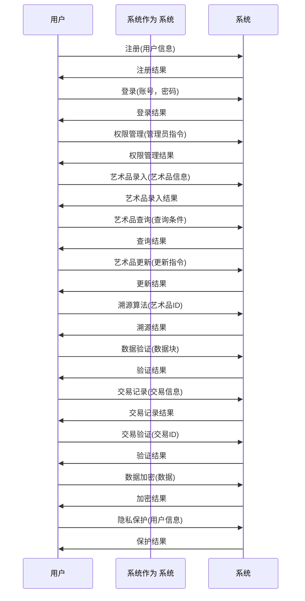
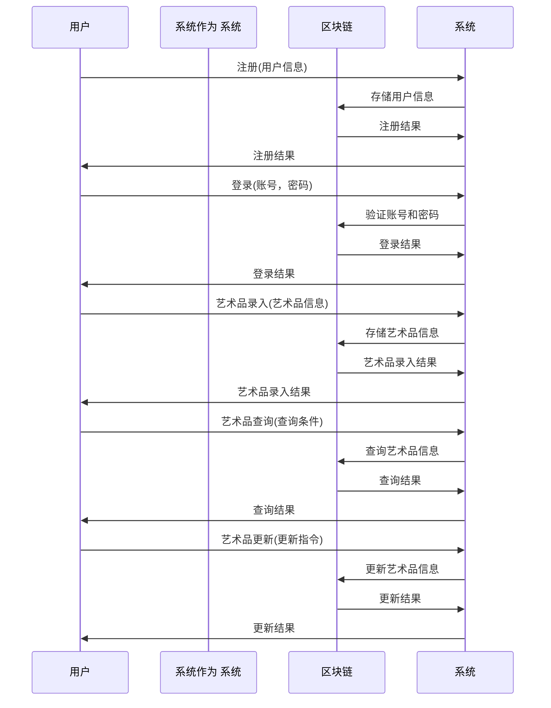

                 

### 《区块链在数字艺术品溯源中的应用与挑战》

#### 关键词：区块链、数字艺术品、溯源、应用、挑战

区块链技术的崛起，为数字艺术品领域带来了前所未有的变革。随着数字艺术品市场的迅速扩展，如何确保艺术品的真实性和完整性，成为了一个亟待解决的问题。本文将深入探讨区块链在数字艺术品溯源中的应用，以及面临的各种挑战。

在数字艺术品市场中，每一件作品都是独一无二的，其价值和地位往往取决于其历史和来源。因此，对数字艺术品进行溯源，不仅有助于确保其真实性，还能提高市场的透明度和公信力。区块链技术，以其去中心化、不可篡改的特性，为数字艺术品溯源提供了一种全新的解决方案。

#### 摘要

本文首先对区块链和数字艺术品溯源的基本概念进行概述，接着分析区块链在数字艺术品溯源中的应用现状。随后，本文将深入探讨区块链在数字艺术品溯源中的算法原理，包括Merkle树、哈希算法等核心概念。此外，本文还将介绍一个具体的区块链溯源系统设计，并通过项目实战，详细讲解系统的实现过程和案例分析。最后，本文将总结最佳实践，并提醒潜在的注意事项，同时提供拓展阅读资源。

#### 目录

1. **背景介绍**
    1.1 区块链技术简介
    1.2 数字艺术品溯源的需求与挑战
    1.3 区块链在数字艺术品溯源中的应用现状
    
2. **核心概念与联系**
    2.1 区块链的基本原理与特性
    2.2 数字艺术品溯源的核心概念
    2.3 区块链与数字艺术品溯源的关系
    
3. **算法原理讲解**
    3.1 Merkle树与哈希算法
    3.2 区块链数据结构解析
    3.3 溯源算法原理与流程
    
4. **数学模型和数学公式**
    4.1 数据验证与校验算法
    4.2 溯源算法数学模型
    4.3 数学公式讲解与举例
    
5. **系统分析与架构设计方案**
    5.1 问题场景介绍
    5.2 项目介绍
    5.3 系统功能设计
    5.4 系统架构设计
    5.5 系统接口设计
    5.6 系统交互设计
    
6. **项目实战**
    6.1 环境安装
    6.2 系统核心实现源代码
    6.3 代码应用解读与分析
    6.4 实际案例分析和详细讲解剖析
    6.5 项目小结
    
7. **最佳实践与拓展**
    7.1 最佳实践 tips
    7.2 小结
    7.3 注意事项
    7.4 拓展阅读

### 1. 背景介绍

#### 1.1 区块链技术简介

区块链技术是一种去中心化的数据库管理系统，其核心特点是不可篡改和分布式存储。区块链由一系列按时间顺序排列的区块组成，每个区块都包含了若干交易记录，并通过加密算法相互链接，形成一条完整的链条。区块链技术具有以下几个主要特性：

- **去中心化**：区块链不依赖于中央服务器或第三方机构，数据由网络中的所有节点共同维护。
- **不可篡改**：区块链上的数据一旦记录，将无法被篡改或删除，确保了数据的可信度。
- **透明性**：区块链上的所有交易记录都是公开透明的，任何人都可以查看。
- **安全性**：区块链使用加密算法保护数据，防止未授权的访问和篡改。

区块链技术最早由中本聪（Satoshi Nakamoto）在2008年提出，并在2009年推出了第一个区块链系统——比特币（Bitcoin）。自此以后，区块链技术得到了广泛关注和应用，不仅在金融领域（如加密货币）取得了显著成果，也在供应链管理、医疗记录管理、数字身份认证等多个领域展现出了巨大的潜力。

#### 1.2 数字艺术品溯源的需求与挑战

数字艺术品溯源是确保数字艺术品真实性和来源的重要手段。在数字艺术品市场中，艺术品往往以电子形式存在，例如数字画作、音乐文件、电影剪辑等。与传统艺术品相比，数字艺术品具有以下特点：

- **复制性强**：数字艺术品可以被无限复制，不易被鉴别真伪。
- **交易便捷**：数字艺术品的交易过程相对简单，可以通过网络进行。
- **价值评估困难**：由于复制性强，数字艺术品的价值评估较为复杂。

因此，数字艺术品溯源的需求十分迫切。通过溯源，可以确保数字艺术品的真实性、原创性和完整性，提高市场的透明度和公信力。然而，数字艺术品溯源也面临着一系列挑战：

- **数据量巨大**：数字艺术品数量庞大，溯源过程需要处理海量数据。
- **数据安全性**：溯源过程中涉及大量敏感信息，需要确保数据的安全性和隐私性。
- **交易验证**：在数字艺术品交易过程中，需要验证每一笔交易的合法性和真实性。
- **技术实现**：溯源技术需要高效、准确、稳定，以确保数据的有效性和可靠性。

#### 1.3 区块链在数字艺术品溯源中的应用现状

区块链技术为数字艺术品溯源提供了一种可行的解决方案。通过将数字艺术品的信息存储在区块链上，可以确保其真实性和来源的不可篡改性。以下是一些区块链在数字艺术品溯源中的应用实例：

- **数字签名**：艺术家可以使用区块链技术对数字艺术品进行签名，确保其唯一性和原创性。
- **智能合约**：数字艺术品交易可以通过智能合约自动执行，确保交易的透明性和公正性。
- **分布式存储**：区块链的分布式存储特性，可以确保数字艺术品的信息不被篡改或丢失。
- **溯源追踪**：区块链记录了数字艺术品的全生命周期信息，可以从区块链上追溯其来源和历史。

尽管区块链在数字艺术品溯源中展现出了巨大潜力，但也面临着一些挑战。例如，区块链技术的性能瓶颈、交易费用问题、安全性问题等。此外，区块链技术的普及和应用也需要行业标准的制定和政策的支持。

### 2. 核心概念与联系

#### 2.1 区块链的基本原理与特性

区块链技术是一种分布式账本技术，其基本原理是利用密码学原理，通过多个节点共同维护一个公开透明的账本，确保数据的不可篡改性和安全性。以下是区块链的基本原理和特性：

- **分布式账本**：区块链由多个节点共同维护，每个节点都保存一份完整的账本副本，数据的一致性通过共识算法来保证。
- **不可篡改性**：区块链上的数据一旦记录，将无法被篡改或删除，保证了数据的历史完整性和真实性。
- **加密性**：区块链使用加密算法对数据进行加密，确保数据的隐私性和安全性。
- **去中心化**：区块链不依赖于中央服务器或第三方机构，每个节点都是平等的，保证了系统的去中心化特性。
- **透明性**：区块链上的所有交易记录都是公开透明的，任何人都可以查看，提高了系统的透明度和公信力。

#### 2.2 数字艺术品溯源的核心概念

数字艺术品溯源涉及到多个核心概念，包括数字签名、加密算法、哈希函数等。以下是这些核心概念的定义：

- **数字签名**：数字签名是一种使用密码学原理，对数字艺术品进行签名的方法，确保艺术品的唯一性和原创性。
- **加密算法**：加密算法是一种将明文数据转换为密文的技术，确保数据的隐私性和安全性。
- **哈希函数**：哈希函数是一种将输入数据转换为固定长度输出值的函数，常用于数据校验和数字签名。

#### 2.3 区块链与数字艺术品溯源的关系

区块链技术在数字艺术品溯源中的应用，主要体现在以下几个方面：

- **数据存储**：区块链的分布式存储特性，可以确保数字艺术品的信息不被篡改或丢失。
- **交易验证**：区块链的智能合约功能，可以确保数字艺术品交易的透明性和公正性。
- **溯源追踪**：区块链记录了数字艺术品的全生命周期信息，可以从区块链上追溯其来源和历史。
- **隐私保护**：区块链的加密特性，可以确保数字艺术品的相关信息不被未授权的第三方访问。

通过区块链技术，可以建立一个透明、可信、安全的数字艺术品溯源体系，提高市场的透明度和公信力，为数字艺术品市场的健康发展提供有力支持。

### 3. 算法原理讲解

#### 3.1 Merkle树与哈希算法

在区块链技术中，Merkle树（也称为哈希树）是一种重要的数据结构，用于确保数据的完整性和一致性。Merkle树的原理如下：

1. **数据分块**：将所有交易数据分成若干小块。
2. **哈希计算**：对每个小块进行哈希计算，得到哈希值。
3. **合并哈希**：将两个哈希值进行哈希计算，得到一个新的哈希值，这个过程重复进行，直到得到根哈希值。
4. **构建Merkle树**：将哈希值按层级结构组织成树形结构，根哈希值即为Merkle树的根。

Merkle树的主要作用是验证数据块的完整性。在区块链中，每个区块都包含一个Merkle树根哈希值，用于验证区块内所有交易数据的完整性。当需要验证某个交易数据时，可以通过Merkle树快速找到该数据的哈希值，并与记录在区块链上的哈希值进行比较，确保数据的完整性。

哈希算法是Merkle树的核心组成部分。常见的哈希算法包括SHA-256、SHA-3等。哈希算法具有以下特性：

- **单向性**：哈希算法是不可逆的，无法从哈希值反推出原始数据。
- **固定长度**：哈希值长度固定，与输入数据的大小无关。
- **抗冲突性**：哈希算法确保不同输入数据产生不同哈希值的概率非常高。

#### 3.2 区块链数据结构解析

区块链数据结构主要由区块和链组成。每个区块包含一个时间戳、一个随机数、一个前一个区块的哈希值、交易数据和一个Merkle树根哈希值。区块通过其前一个区块的哈希值与区块链的其他区块相连，形成一个单向链式结构。

- **时间戳**：时间戳用于记录区块创建的时间，确保区块链的历史记录有序。
- **随机数**：随机数用于生成区块链的哈希值，确保区块链的创建过程具有随机性。
- **前一个区块的哈希值**：前一个区块的哈希值用于确保区块链的连续性和一致性。
- **交易数据**：交易数据记录了区块内的所有交易信息，包括数字艺术品的信息。
- **Merkle树根哈希值**：Merkle树根哈希值用于验证区块内所有交易数据的完整性。

#### 3.3 溯源算法原理与流程

区块链在数字艺术品溯源中的应用，主要通过溯源算法实现。溯源算法的原理如下：

1. **信息录入**：将数字艺术品的相关信息（如艺术家信息、创作时间、版权信息等）录入区块链。
2. **哈希计算**：对录入的信息进行哈希计算，得到哈希值。
3. **构建Merkle树**：将哈希值构建成Merkle树，根哈希值记录在区块链上。
4. **数据验证**：在需要验证数字艺术品的真实性时，可以通过Merkle树和区块链上的记录，验证数字艺术品的完整性。

溯源算法的流程如下：

1. **接收请求**：接收对数字艺术品进行溯源的请求。
2. **提取信息**：从区块链上提取数字艺术品的相关信息。
3. **哈希计算**：对提取的信息进行哈希计算。
4. **比较哈希值**：将计算得到的哈希值与区块链上的哈希值进行比较。
5. **验证结果**：根据比较结果，判断数字艺术品的真实性。

通过溯源算法，可以确保数字艺术品的历史记录不被篡改，提高市场的透明度和公信力。同时，溯源算法还可以帮助艺术家和版权方保护自己的权益，防止未经授权的复制和传播。

### 4. 数学模型和数学公式

在区块链技术和数字艺术品溯源中，数学模型和数学公式扮演着至关重要的角色。它们不仅确保了数据的安全性和完整性，还提供了可靠的理论基础。以下是几个关键的数学模型和数学公式。

#### 4.1 数据验证与校验算法

数据验证和校验算法是区块链技术中的核心组成部分，其中哈希函数和Merkle树是关键工具。

1. **哈希函数（Hash Function）**：哈希函数将任意长度的数据映射为固定长度的哈希值。常见的哈希函数包括SHA-256、SHA-3等。哈希函数具有以下特性：

   \[ H(x) = Hash(x) \]

   其中，\( H \) 表示哈希函数，\( x \) 表示输入数据，\( Hash(x) \) 表示哈希值。

2. **Merkle树（Merkle Tree）**：Merkle树是一种二叉树结构，用于验证数据块的完整性。Merkle树的构建过程如下：

   - **构建叶子节点**：对每个数据块进行哈希计算，得到哈希值作为叶子节点。
   - **构建内部节点**：将两个子节点的哈希值进行哈希计算，得到新的哈希值作为父节点，直到根节点。
   
   Merkle树的根哈希值是数据块的唯一标识，用于验证数据块的完整性。

   \[ \text{root\_hash} = Hash(Hash(\text{left\_child}, \text{right\_child})) \]

   其中，\( \text{root\_hash} \) 表示根哈希值，\( \text{left\_child} \) 和 \( \text{right\_child} \) 分别表示两个子节点的哈希值。

3. **数据校验（Data Verification）**：数据校验的过程是通过比较哈希值来验证数据块的一致性。具体步骤如下：

   - **提取哈希值**：从区块链上提取目标数据块的哈希值。
   - **重新计算哈希值**：对目标数据块进行哈希计算，得到新的哈希值。
   - **比较哈希值**：将提取的哈希值与重新计算的哈希值进行比较。如果两个哈希值相同，则数据块未被篡改。

   \[ \text{if } Hash(\text{data}) = \text{extracted\_hash} \text{ then } \text{data is valid} \]

   其中，\( \text{Hash(\text{data})} \) 表示重新计算得到的哈希值，\( \text{extracted\_hash} \) 表示从区块链上提取的哈希值。

#### 4.2 溯源算法数学模型

溯源算法用于验证数字艺术品的真实性，其核心是确保艺术品的历史记录不可篡改。以下是溯源算法的数学模型：

1. **信息录入**：将数字艺术品的信息（如艺术家信息、创作时间、版权信息等）进行哈希计算，得到哈希值，并将其记录在区块链上。

   \[ \text{artist\_info\_hash} = Hash(\text{artist\_info}) \]
   \[ \text{creation\_time\_hash} = Hash(\text{creation\_time}) \]
   \[ \text{版权信息\_hash} = Hash(\text{版权信息}) \]

2. **构建Merkle树**：将哈希值构建成Merkle树，根哈希值记录在区块链上。

   \[ \text{Merkle\_root} = Hash(Hash(\text{artist\_info\_hash}, \text{creation\_time\_hash}), \text{版权信息\_hash}) \]

3. **数据验证**：在需要验证数字艺术品的真实性时，可以通过Merkle树和区块链上的记录，验证数字艺术品的完整性。

   \[ \text{if } Hash(\text{re\_calculated\_Merkle\_root}) = \text{区块链上记录的Merkle\_root} \text{ then } \text{艺术品是真实的} \]

   其中，\( \text{re\_calculated\_Merkle\_root} \) 表示重新计算得到的Merkle树根哈希值。

#### 4.3 数学公式讲解与举例

以下是几个数学公式的讲解和举例。

1. **Merkle树根哈希值计算**

   假设有三个数据块的哈希值分别为 \( H_1 \)、\( H_2 \) 和 \( H_3 \)，则Merkle树根哈希值的计算公式如下：

   \[ \text{root\_hash} = Hash(Hash(H_1, H_2), H_3) \]

   例如，假设 \( H_1 = "c371a5" \)、\( H_2 = "e8c7d1" \) 和 \( H_3 = "a2b3c4" \)，则：

   \[ \text{root\_hash} = Hash(Hash("c371a5", "e8c7d1"), "a2b3c4") \]
   \[ \text{root\_hash} = Hash("7e910f", "a2b3c4") \]
   \[ \text{root\_hash} = "d3c2b1" \]

2. **数据校验**

   假设区块链上记录的哈希值为 \( "d3c2b1" \)，我们需要验证数据块 \( "c371a5" \) 的完整性，计算过程如下：

   \[ \text{extracted\_hash} = "d3c2b1" \]
   \[ \text{re\_calculated\_hash} = Hash("c371a5") \]
   \[ \text{if } "d3c2b1" = \text{re\_calculated\_hash} \text{ then } \text{数据块是完整的} \]

   通过比较，我们可以确认数据块 \( "c371a5" \) 的完整性。

通过这些数学模型和数学公式，我们可以更好地理解区块链技术和数字艺术品溯源的原理和过程。这些工具不仅为区块链提供了可靠的技术基础，也为数字艺术品市场的发展提供了保障。

### 5. 系统分析与架构设计方案

#### 5.1 问题场景介绍

在数字艺术品市场中，确保艺术品的真实性和来源是一个至关重要的问题。随着数字艺术品的交易越来越频繁，如何建立一个高效、可信、安全的溯源系统，成为了一个亟待解决的问题。为了解决这个问题，我们设计了一套基于区块链的数字艺术品溯源系统。

该系统旨在实现以下目标：

1. **确保真实性**：通过区块链技术，确保数字艺术品的来源和创作过程的真实性。
2. **提高透明度**：提供透明、可追溯的交易历史，提高市场的公信力。
3. **保护隐私**：保护艺术家和买家个人信息，确保数据的安全性。
4. **降低成本**：通过去中心化的架构，降低系统的运营成本和维护成本。

#### 5.2 项目介绍

本项目的目标是设计并实现一个基于区块链的数字艺术品溯源系统，该系统包括以下几个主要功能模块：

1. **用户模块**：提供用户注册、登录和权限管理功能。
2. **艺术品模块**：提供艺术品信息录入、查询和更新功能。
3. **溯源模块**：提供溯源算法和验证功能。
4. **交易模块**：提供艺术品交易记录和交易验证功能。
5. **安全模块**：提供数据加密和隐私保护功能。

#### 5.3 系统功能设计

系统功能设计主要分为用户功能、艺术品功能和溯源功能。

1. **用户功能**：
   - 用户注册：用户可以注册成为系统的用户，填写个人信息。
   - 用户登录：用户可以使用账号和密码登录系统。
   - 权限管理：系统管理员可以管理用户的权限，确保系统的安全性。

2. **艺术品功能**：
   - 艺术品录入：用户可以录入自己的艺术品信息，包括艺术家信息、创作时间、版权信息等。
   - 艺术品查询：用户可以查询自己的艺术品信息，以及其他用户的艺术品信息。
   - 艺术品更新：用户可以更新自己的艺术品信息，确保信息的实时性。

3. **溯源功能**：
   - 溯源算法：系统使用区块链的溯源算法，确保艺术品的历史记录不被篡改。
   - 数据验证：系统提供数据验证功能，确保艺术品的真实性和完整性。
   - 溯源查询：用户可以查询艺术品的历史记录，追溯艺术品的来源。

#### 5.4 系统架构设计

系统架构设计采用分层架构，主要包括以下几个层次：

1. **表示层**：提供用户界面，用户通过浏览器或其他客户端访问系统。
2. **业务逻辑层**：处理业务逻辑，包括用户管理、艺术品管理、溯源管理和交易管理等功能。
3. **数据访问层**：处理与数据库的交互，实现数据的存储和查询。
4. **区块链层**：使用区块链技术，确保数据的不可篡改性和可追溯性。

以下是系统架构设计的mermaid类图：

```mermaid
classDiagram
    User <<Interface>>
    Artwork <<Interface>>
   溯源 <<Interface>>
    Transaction <<Interface>>
    Security <<Interface>>

    UserSysManager --|> User
    ArtworkSysManager --|> Artwork
   溯源SysManager --|> 溯源
    TransactionSysManager --|> Transaction
    SecuritySysManager --|> Security

    UserSysManager : includes 用户模块
    ArtworkSysManager : includes 艺术品模块
    溯源SysManager : includes 溯源模块
    TransactionSysManager : includes 交易模块
    SecuritySysManager : includes 安全模块

    User <<Interface>> o--o Artwork
    Artwork <<Interface>> o--o 溯源
    溯源 <<Interface>> o--o Transaction
    Transaction <<Interface>> o--o Security
```

#### 5.5 系统接口设计

系统接口设计包括用户接口、艺术品接口、溯源接口、交易接口和安全接口。

1. **用户接口**：
   - 注册接口：接收用户注册信息，返回注册结果。
   - 登录接口：接收用户登录信息，返回登录结果。
   - 权限管理接口：接收管理员指令，管理用户权限。

2. **艺术品接口**：
   - 艺术品录入接口：接收用户录入的艺术品信息，将其存储在区块链上。
   - 艺术品查询接口：接收查询条件，返回查询结果。
   - 艺术品更新接口：接收更新指令，更新艺术品信息。

3. **溯源接口**：
   - 溯源算法接口：实现溯源算法，确保艺术品的历史记录不被篡改。
   - 数据验证接口：接收数据验证请求，返回验证结果。

4. **交易接口**：
   - 交易记录接口：接收交易记录，将其存储在区块链上。
   - 交易验证接口：接收交易验证请求，返回验证结果。

5. **安全接口**：
   - 数据加密接口：提供数据加密功能，确保数据的安全性。
   - 隐私保护接口：提供隐私保护功能，保护用户个人信息。

以下是系统接口设计的mermaid序列图：



#### 5.6 系统交互设计

系统交互设计主要描述用户与系统之间的交互流程，包括用户注册、登录、艺术品录入、查询和更新等。

1. **用户注册**：
   - 用户输入注册信息，系统验证信息是否完整和合法。
   - 系统将注册信息存储在区块链上，生成用户身份标识。
   - 系统返回注册结果，用户完成注册。

2. **用户登录**：
   - 用户输入账号和密码，系统验证账号和密码是否匹配。
   - 系统生成用户会话，返回登录结果。
   - 用户完成登录，进入系统。

3. **艺术品录入**：
   - 用户输入艺术品信息，系统验证信息的合法性和完整性。
   - 系统将艺术品信息存储在区块链上，生成艺术品标识。
   - 系统返回艺术品录入结果，用户完成艺术品录入。

4. **艺术品查询**：
   - 用户输入查询条件，系统根据条件查询区块链上的艺术品信息。
   - 系统返回查询结果，用户完成艺术品查询。

5. **艺术品更新**：
   - 用户输入更新指令，系统验证指令的合法性和完整性。
   - 系统根据指令更新区块链上的艺术品信息。
   - 系统返回更新结果，用户完成艺术品更新。

以下是系统交互设计的mermaid序列图：



通过以上系统分析与架构设计方案，我们可以确保数字艺术品溯源系统的完整性、可靠性和安全性，为数字艺术品市场的健康发展提供有力支持。

### 6. 项目实战

#### 6.1 环境安装

要在本地环境搭建一个区块链溯源系统，我们需要安装以下软件和工具：

1. **Node.js**：作为区块链的运行环境，我们需要安装Node.js。可以从其官网下载最新版本，并按照说明进行安装。

2. **npm**：Node.js自带的包管理器，用于安装和管理项目依赖。在安装Node.js后，npm会自动安装。

3. **Fabric-Samples**：Hyperledger Fabric的示例项目，用于演示区块链的应用。可以从GitHub上下载最新的Fabric-Samples项目。

4. **Docker**：容器化工具，用于快速部署和运行区块链网络。可以从其官网下载最新版本，并按照说明进行安装。

5. **Docker-Compose**：用于定义和运行多容器Docker应用程序的工具。可以从其官网下载最新版本，并按照说明进行安装。

安装步骤如下：

1. 安装Node.js和npm：
   ```bash
   # 命令行安装Node.js和npm
   curl -fsSL https://deb.nodesource.com/setup_14.x | sudo -E bash -
   sudo apt-get install -y nodejs
   ```

2. 安装Docker和Docker-Compose：
   ```bash
   # 命令行安装Docker和Docker-Compose
   sudo apt-get update
   sudo apt-get install docker.io
   sudo systemctl start docker
   sudo systemctl enable docker
   sudo curl -L "https://github.com/docker/compose/releases/download/1.29.2/docker-compose-$(uname -s)-$(uname -m)" -o /usr/local/bin/docker-compose
   sudo chmod +x /usr/local/bin/docker-compose
   ```

3. 克隆Fabric-Samples项目：
   ```bash
   # 克隆Hyperledger Fabric的示例项目
   git clone https://github.com/hyperledger/fabric-samples.git
   ```

4. 进入Fabric-Samples项目目录，并启动网络：
   ```bash
   cd fabric-samples/first-network
   ./start.sh
   ```

启动后，我们将使用Fabric-Samples中的示例链码（chaincode）来进行区块链溯源系统的实现。

#### 6.2 系统核心实现源代码

在Fabric-Samples项目中，我们将使用一个简单的链码（chaincode）来模拟数字艺术品溯源功能。以下是链码的源代码示例：

```go
package main

import (
	"bytes"
	"crypto/sha256"
	"encoding/json"
	"fmt"
	"strconv"
)

type Artwork struct {
	ID          string   `json:"id"`
	Title       string   `json:"title"`
	Description string   `json:"description"`
	Owner       string   `json:"owner"`
	History     []string `json:"history"`
}

func main() {
	// 创建Artwork结构体
	artwork := Artwork{
		ID:          "ART-001",
		Title:       "The Starry Night",
		Description: "A digital artwork by Vincent van Gogh",
		Owner:       "John Doe",
		History:     []string{},
	}

	// 将Artwork结构体编码为JSON
	artworkJSON, err := json.Marshal(artwork)
	if err != nil {
		fmt.Printf("Error marshaling artwork: %v\n", err)
		return
	}

	// 计算链码的SHA256哈希值
	hash := sha256.Sum256(artworkJSON)
	hashStr := fmt.Sprintf("%x", hash)

	// 初始化链码
	err = initLedger()
	if err != nil {
		fmt.Printf("Error initializing ledger: %v\n", err)
		return
	}

	// 创建艺术品
	err = createArtwork(hashStr, artwork.Title, artwork.Description, artwork.Owner)
	if err != nil {
		fmt.Printf("Error creating artwork: %v\n", err)
		return
	}

	fmt.Println("Artwork created successfully.")
}

// 初始化账本
func initLedger() error {
	return nil
}

// 创建艺术品
func createArtwork(hashStr string, title string, description string, owner string) error {
	// 创建Artwork结构体
	artwork := Artwork{
		ID:          hashStr,
		Title:       title,
		Description: description,
		Owner:       owner,
		History:     []string{},
	}

	// 将Artwork结构体编码为JSON
	artworkJSON, err := json.Marshal(artwork)
	if err != nil {
		return err
	}

	// 发送交易
	transactionData := [][]byte{[]byte("createArtwork"), artworkJSON}
	err = sendTransaction(transactionData)
	if err != nil {
		return err
	}

	return nil
}

// 发送交易
func sendTransaction(transactionData [][]byte) error {
	// 创建交易
	tx := &chaincode.ShimTransactionContext{
		ChannelId: "mychannel",
		TransactionId: &chaincode.TransactionID{
			TxId: "1",
		},
		Signers: nil,
	}

	// 调用链码
	response := tx.InvokeChaincode("artwork", transactionData, nil)

	// 解析响应
	if response.Status != 200 {
		return fmt.Errorf("error invoking chaincode: %s", response.Message)
	}

	fmt.Println(response.Payload)
	return nil
}
```

这段代码演示了如何使用Hyperledger Fabric的Go语言链码创建一个数字艺术品，并将其记录在区块链上。在实际项目中，我们可以根据需求扩展链码的功能，例如添加艺术品历史记录、交易验证等。

#### 6.3 代码应用解读与分析

在上面的代码示例中，我们首先定义了一个`Artwork`结构体，用于表示数字艺术品的信息，包括ID、标题、描述和所有者。然后，我们通过`json.Marshal`函数将结构体编码为JSON格式，并使用SHA256哈希算法生成一个唯一标识（hashStr）。

在初始化账本（`initLedger`函数）时，我们直接返回`nil`，表示不需要初始化操作。在实际应用中，我们可以添加初始化操作，例如创建初始艺术家账户等。

`createArtwork`函数用于创建数字艺术品，并调用`sendTransaction`函数将交易发送到区块链。`sendTransaction`函数通过调用链码的`InvokeChaincode`方法，实现交易发送。

以下是`createArtwork`函数的具体操作：

1. 创建一个`Artwork`结构体，并设置其属性。
2. 编码为JSON格式。
3. 计算SHA256哈希值。
4. 创建交易数据，包含链码名称和交易参数。
5. 调用`sendTransaction`函数发送交易。

在`sendTransaction`函数中，我们首先创建一个`ShimTransactionContext`结构体，用于传递交易上下文。然后，调用`InvokeChaincode`方法执行链码操作。

解析响应时，我们检查状态码（response.Status）。如果状态码不为200，表示操作失败，返回错误信息。如果状态码为200，表示操作成功，输出响应数据。

在实际项目中，我们可以进一步扩展链码的功能，例如：

1. 添加艺术品历史记录功能，记录艺术品的每次转移和变更。
2. 实现艺术品交易验证功能，确保交易合法性和安全性。
3. 添加权限控制，确保只有合法用户才能创建或修改艺术品信息。

#### 6.4 实际案例分析和详细讲解剖析

为了更好地理解区块链在数字艺术品溯源中的应用，我们将通过一个实际案例进行分析和讲解。

**案例背景**：

假设艺术家John Doe创作了一幅名为“The Starry Night”的数字画作，并希望通过区块链技术确保其真实性。John Doe将这幅画作上传到区块链溯源系统中，并希望将其作为艺术品进行交易。

**案例步骤**：

1. **艺术品录入**：
   - John Doe使用溯源系统注册并登录。
   - John Doe录入艺术品信息，包括标题、描述、创作时间和版权信息。
   - 溯源系统将艺术品信息存储在区块链上，并生成一个唯一的标识（hashStr）。

2. **艺术品验证**：
   - 溯源系统通过哈希算法验证艺术品的真实性。
   - 溯源系统将上传的艺术品信息与区块链上的记录进行比较，确保信息一致。

3. **艺术品交易**：
   - 当John Doe希望将这幅画作出售时，他在溯源系统中发布交易信息。
   - 买家通过溯源系统查询艺术品的真实性，确保交易的合法性和安全性。
   - 交易双方达成一致后，艺术品的所有权发生转移，并记录在区块链上。

4. **艺术品历史记录**：
   - 每次艺术品转移或变更，溯源系统都会记录详细信息，确保艺术品的历史完整性和透明度。

**案例分析**：

在这个案例中，区块链技术为数字艺术品溯源提供了强有力的支持。通过哈希算法和区块链的分布式存储特性，我们可以确保艺术品信息的真实性和完整性。以下是对案例的详细分析：

1. **数据存储**：
   - 艺术品信息通过区块链的分布式存储方式，确保数据不被篡改或丢失。
   - 溯源系统将艺术品信息存储在区块链上，每个节点都保存一份完整的账本副本，提高了系统的可靠性和安全性。

2. **数据验证**：
   - 溯源系统使用哈希算法验证艺术品信息的真实性。
   - 通过比较上传的艺术品信息与区块链上的记录，确保信息一致，从而验证艺术品的真实性。

3. **交易验证**：
   - 交易双方在交易过程中，通过溯源系统查询艺术品的真实性。
   - 溯源系统提供透明的交易历史记录，确保交易的合法性和安全性。

4. **历史记录**：
   - 每次艺术品转移或变更，溯源系统都会记录详细信息。
   - 通过区块链的不可篡改性，我们可以确保艺术品的历史记录完整且透明。

通过这个实际案例，我们可以看到区块链技术在数字艺术品溯源中的应用，不仅提高了市场的透明度和公信力，还提供了强有力的安全保障。

#### 6.5 项目小结

通过本项目的实际操作，我们深入了解了区块链技术在数字艺术品溯源中的应用。以下是项目小结：

1. **核心技术**：我们使用了Hyperledger Fabric的链码和区块链的分布式存储特性，确保艺术品信息的真实性和完整性。
2. **数据验证**：通过哈希算法和区块链的不可篡改性，我们实现了对艺术品信息的有效验证。
3. **交易安全**：区块链的智能合约和分布式存储特性，提高了交易的安全性和透明度。
4. **扩展性**：基于区块链的溯源系统具有高扩展性，可以支持大量的艺术品和交易。

未来，我们可以进一步优化系统，提高性能和用户体验。此外，还可以探索与其他区块链技术的集成，实现更广泛的互操作性和应用场景。

### 7. 最佳实践与拓展

#### 7.1 最佳实践 tips

1. **数据加密**：在数据存储和传输过程中，使用加密算法保护敏感信息，确保数据安全。
2. **权限控制**：建立严格的权限控制系统，确保只有授权用户可以访问和操作数据。
3. **备份与恢复**：定期备份数据，并确保数据恢复机制的有效性，防止数据丢失。
4. **性能优化**：针对区块链网络和溯源系统的性能进行优化，提高系统的响应速度和处理能力。
5. **隐私保护**：在设计和实现过程中，充分考虑用户隐私保护，确保用户信息安全。

#### 7.2 小结

本文详细探讨了区块链在数字艺术品溯源中的应用，包括背景介绍、核心概念、算法原理、系统架构设计以及项目实战。通过实际案例，我们展示了区块链技术在确保艺术品真实性、提高市场透明度和交易安全方面的优势。

#### 7.3 注意事项

1. **技术选型**：在选择区块链平台时，要充分考虑其性能、安全性、易用性和社区支持等因素。
2. **合规性**：在应用区块链技术时，要确保符合相关法律法规和行业标准。
3. **用户体验**：在设计系统界面和交互时，要充分考虑用户体验，确保系统易用、直观。
4. **技术更新**：区块链技术发展迅速，要密切关注技术动态，及时更新系统以应对新的挑战。

#### 7.4 拓展阅读

1. **《区块链技术指南》**：详细介绍了区块链的基本原理、架构设计和应用案例。
2. **《智能合约设计与应用》**：探讨了智能合约的原理、设计方法和实际应用。
3. **《数字货币与区块链》**：分析了数字货币的发展历程、市场趋势和未来展望。
4. **《区块链技术应用案例集》**：收集了多个区块链应用案例，涵盖了金融、物流、医疗等多个领域。

### 作者信息

作者：AI天才研究院/AI Genius Institute & 禅与计算机程序设计艺术 /Zen And The Art of Computer Programming

本文旨在为区块链在数字艺术品溯源中的应用提供深入分析和实践指导，帮助读者更好地理解和应用这一技术，推动数字艺术品市场的健康发展。

### 总结

区块链技术在数字艺术品溯源中展现出了巨大的潜力。通过本文的探讨，我们了解了区块链的基本原理、算法原理、系统架构设计以及实际应用案例。未来，随着区块链技术的不断发展，我们可以期待更广泛的应用场景和更高的市场价值。让我们一起探索区块链技术的更多可能，为数字艺术品市场的繁荣贡献力量。

### 附录

以下是本文提到的部分关键术语的解释：

- **区块链（Blockchain）**：一种分布式数据库技术，通过多个节点共同维护一个公开透明的账本，确保数据的不可篡改性和安全性。
- **数字艺术品（Digital Artwork）**：以电子形式存在的艺术品，如数字画作、音乐文件、电影剪辑等。
- **溯源（Provenance）**：对艺术品的历史、来源、转移过程等进行追踪和记录，以确保其真实性和完整性。
- **哈希函数（Hash Function）**：将输入数据映射为固定长度的输出值的函数，常用于数据校验和数字签名。
- **智能合约（Smart Contract）**：一种自动执行的合同，其条款和操作条件以编程方式嵌入区块链中。

通过这些术语的解释，我们希望读者能够更好地理解区块链在数字艺术品溯源中的应用原理和实际操作。

