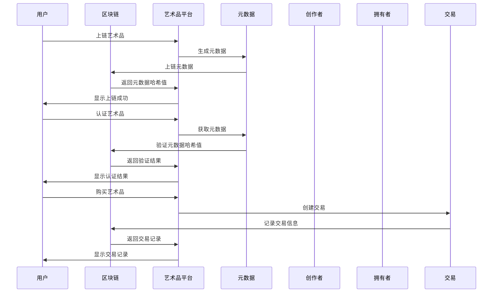
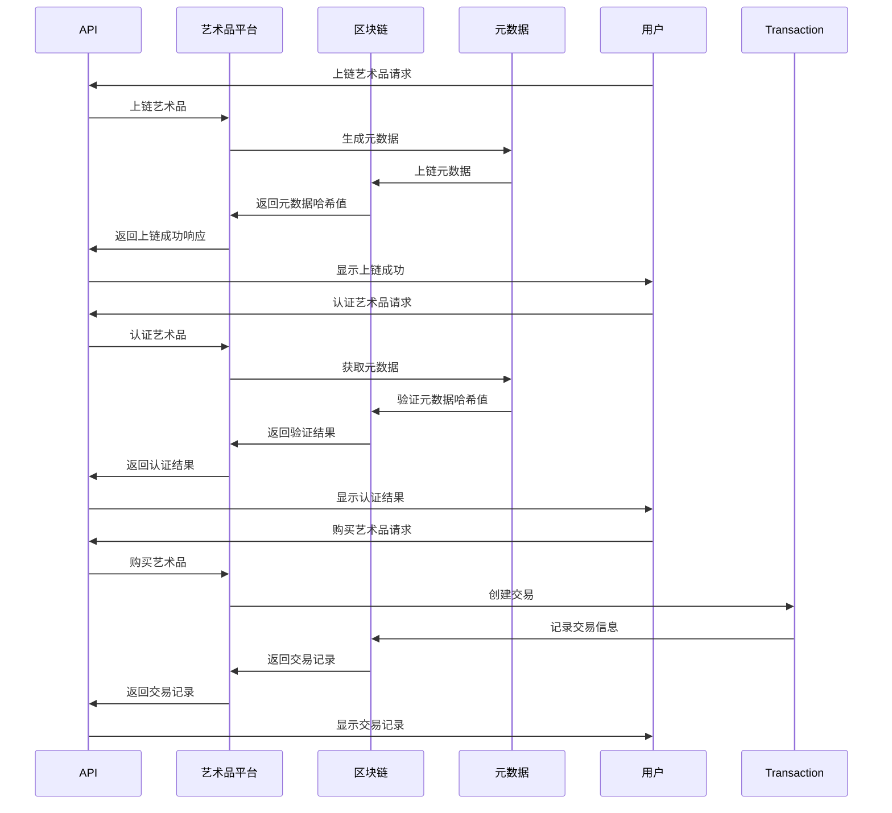
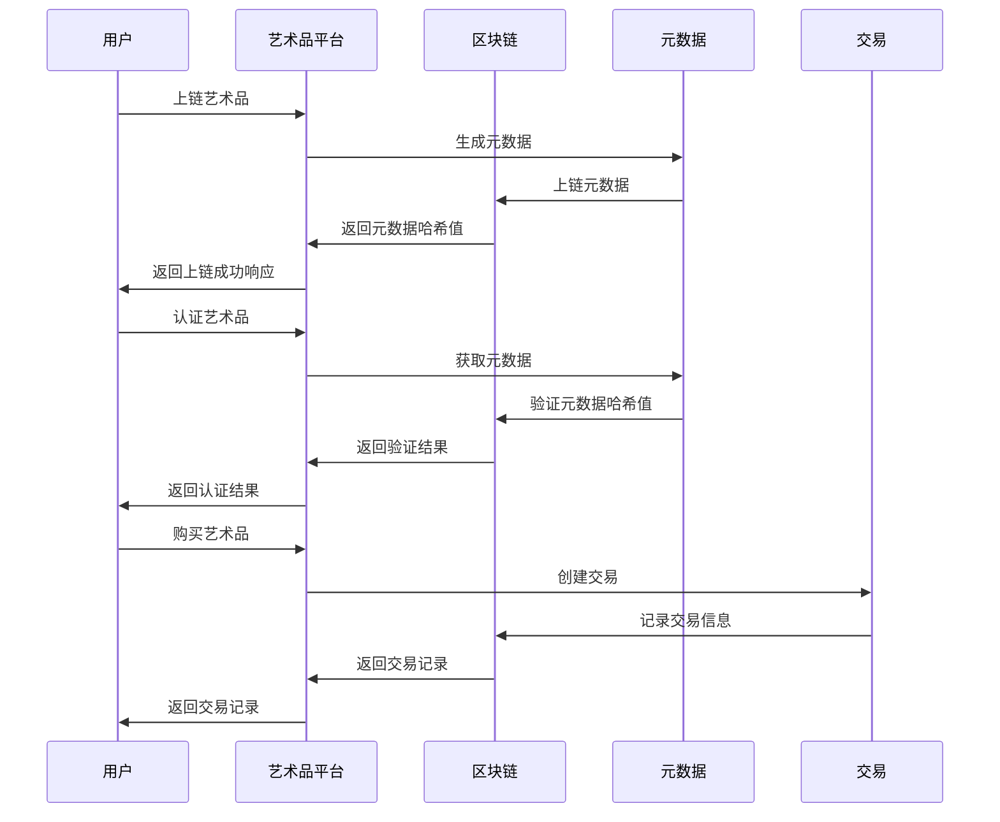

                 


# 区块链在数字艺术品认证中的应用

> 关键词：区块链、数字艺术品、认证、智能合约、去中心化、透明可追溯

> 摘要：本文深入探讨了区块链在数字艺术品认证中的应用。通过分析问题背景、核心概念与联系，本文详细阐述了区块链在数字艺术品认证中的具体实现方法，包括智能合约的应用、数字艺术品与区块链的结合，以及相关技术的扩展与边界。文章旨在为读者提供对区块链在数字艺术品认证领域的全面理解和实践指导。

## 背景介绍：区块链在数字艺术品认证中的应用

### 问题背景

随着互联网和数字技术的快速发展，数字艺术品逐渐成为艺术市场的重要组成部分。数字艺术品，包括数字画作、数字音乐、数字视频等，因其创作和传播的便捷性而广受欢迎。然而，这一新兴领域也面临着诸多挑战，尤其是在版权保护、真伪鉴定和交易流通方面。

首先，数字艺术品的复制和篡改问题严重。由于数字艺术品的电子文件可以轻松地复制和修改，创作者的知识产权难以得到有效保护。其次，艺术品交易平台缺乏可信的认证机制，容易引发欺诈行为。购买者无法确保所购买的数字艺术品为真品，导致市场信任度下降。最后，数字艺术品在交易过程中，由于缺乏透明和可追溯的记录，容易产生纠纷。

### 问题描述

为了解决数字艺术品认证问题，确保艺术品的真实性、完整性和交易过程的透明性，我们需要找到一种能够提供高可信度和高安全性的解决方案。传统的认证方式，如纸质证书、第三方认证机构等，在数字艺术品的背景下显得力不从心。因此，寻找一种新的技术手段来加强数字艺术品认证成为当务之急。

### 问题解决

区块链技术作为一种去中心化的分布式账本技术，具备不可篡改、透明可追溯等特点，为解决数字艺术品认证问题提供了新的思路。区块链通过智能合约实现数字艺术品的认证，确保了艺术品的真实性、完整性和交易的透明性。

### 边界与外延

区块链在数字艺术品认证中的应用不仅限于艺术品本身，还可以扩展到艺术市场的其他环节，如拍卖、租赁、授权等。此外，区块链还可以与其他技术如物联网（IoT）、非同质化代币（NFT）等结合，进一步提升数字艺术品认证的效率和可信度。

### 概念结构与核心要素组成

#### 1. 区块链

区块链是一种分布式数据库系统，多个节点共同维护数据一致性。其特点包括去中心化、不可篡改和透明可追溯。

#### 2. 智能合约

智能合约是一种自动化执行合约条款的程序，当满足特定条件时，自动执行相关操作。智能合约的特点是自动化、可验证和安全可靠。

#### 3. 数字艺术品

数字艺术品是通过数字技术创作的艺术品，包括数字画作、数字音乐、数字视频等。其特点是易于复制、传播迅速和版权保护需求高。

#### 核心概念与联系

##### 1. 区块链与智能合约

区块链提供分布式数据库支持，智能合约实现自动化执行。区块链上的智能合约可以确保数字艺术品认证过程的自动化和可信性。

##### 2. 数字艺术品与区块链

区块链用于存储数字艺术品的元数据和交易信息。数字艺术品通过区块链实现真实性和完整性的验证。

##### 3. 智能合约与数字艺术品认证

智能合约确保数字艺术品认证过程的自动化和可信性。通过智能合约，艺术品的认证信息可以被记录和验证。

### 本章小结

本章介绍了区块链在数字艺术品认证中的应用背景、核心概念与联系。下一章将深入探讨区块链在数字艺术品认证中的具体应用和实践案例。

## 核心概念与联系

### 区块链与智能合约

区块链和智能合约是区块链技术在数字艺术品认证中应用的两个核心概念。

#### 区块链

区块链是一种分布式数据库系统，由多个节点共同维护数据一致性。其特点包括去中心化、不可篡改和透明可追溯。

- **定义**：区块链是一种通过密码学和共识算法实现数据分布式存储和一致性的技术。
- **特点**：
  - **去中心化**：没有中央控制节点，所有数据由多个节点共同维护。
  - **不可篡改**：一旦数据记录在区块链上，无法被单点篡改。
  - **透明可追溯**：区块链上的所有数据都是公开的，可以追溯到每个节点的操作历史。

#### 智能合约

智能合约是一种自动化执行合约条款的程序，当满足特定条件时，自动执行相关操作。其特点包括自动化、可验证和安全可靠。

- **定义**：智能合约是一段计算机代码，它在区块链上执行，并在满足特定条件时自动执行相关操作。
- **特点**：
  - **自动化**：智能合约的执行是自动的，无需人工干预。
  - **可验证**：智能合约的执行过程是公开透明的，可以被所有参与者验证。
  - **安全可靠**：智能合约在区块链上执行，具有高安全性和可靠性。

### 数字艺术品与区块链

数字艺术品是通过数字技术创作的艺术品，如数字画作、数字音乐、数字视频等。区块链技术为数字艺术品提供了认证的保障。

- **定义**：数字艺术品是通过数字技术创作的艺术品，包括数字画作、数字音乐、数字视频等。
- **特点**：
  - **易于复制**：数字艺术品的电子文件可以轻松复制。
  - **传播迅速**：数字艺术品可以通过互联网快速传播。
  - **版权保护需求高**：由于数字艺术品的易复制性，创作者对版权保护需求更高。

#### 区块链在数字艺术品认证中的作用

- **存储艺术品信息**：区块链可以存储数字艺术品的元数据，如创作时间、创作者身份、创作工具等。
- **验证艺术品真实性**：通过区块链，可以验证数字艺术品的创作时间和创作者身份，确保其真实性。
- **记录交易信息**：区块链可以记录数字艺术品的交易信息，确保交易过程的透明性和可追溯性。

### 智能合约与数字艺术品认证

智能合约在数字艺术品认证中起到了关键作用，通过智能合约，可以实现数字艺术品认证的自动化和可信性。

- **自动化认证过程**：智能合约可以自动执行认证过程，减少人工干预，提高效率。
- **确保认证结果可信**：智能合约的执行是公开透明的，所有参与者都可以验证认证结果，确保其可信性。
- **防止欺诈行为**：智能合约可以记录数字艺术品的交易信息，防止欺诈行为的发生。

### 核心概念与联系总结

- **区块链与智能合约**：区块链提供分布式数据库支持，智能合约实现自动化执行，共同确保数字艺术品认证的可信性和自动化。
- **数字艺术品与区块链**：区块链用于存储数字艺术品的元数据和交易信息，确保其真实性和完整性。
- **智能合约与数字艺术品认证**：智能合约确保数字艺术品认证过程的自动化和可信性，防止欺诈行为的发生。

## 算法原理讲解

### 区块链在数字艺术品认证中的算法原理

区块链技术在数字艺术品认证中主要通过以下算法原理实现：

1. **哈希函数**：哈希函数是一种将任意长度的数据映射为固定长度的字符串的函数。在区块链中，每个区块都包含一个哈希值，用于唯一标识该区块。哈希函数保证了数据的一致性和不可篡改性。

2. **加密算法**：加密算法用于保护数据的安全。在区块链中，数据在传输和存储过程中都会进行加密，确保只有授权用户才能访问和理解数据。

3. **共识算法**：共识算法是区块链网络中所有节点达成共识的机制。在数字艺术品认证中，共识算法确保所有节点对艺术品的元数据和交易信息有一致的记录。

4. **智能合约**：智能合约是自动执行合约条款的程序。在数字艺术品认证中，智能合约用于实现艺术品的认证和交易。

### 哈希函数的原理

哈希函数是一种将任意长度的数据映射为固定长度的字符串的函数。常见的哈希函数有SHA-256、MD5等。哈希函数具有以下特点：

- **固定长度输出**：无论输入数据的长度如何，哈希函数的输出都是固定长度的字符串。
- **单向性**：哈希函数是不可逆的，即无法从输出哈希值反推出原始数据。
- **抗碰撞性**：不同的输入数据生成不同的哈希值，且生成相同哈希值的概率极低。

### 加密算法的原理

加密算法用于保护数据的安全。在区块链中，数据在传输和存储过程中都会进行加密。常见的加密算法有AES、RSA等。加密算法具有以下特点：

- **安全性**：加密算法确保数据在传输和存储过程中不会被未经授权的第三方访问。
- **可验证性**：加密算法可以验证数据的完整性和真实性。
- **抗攻击性**：加密算法能够抵御各种攻击手段，如暴力破解、中间人攻击等。

### 共识算法的原理

共识算法是区块链网络中所有节点达成共识的机制。在数字艺术品认证中，共识算法确保所有节点对艺术品的元数据和交易信息有一致的记录。常见的共识算法有PoW（工作量证明）、PoS（权益证明）等。共识算法具有以下特点：

- **去中心化**：共识算法确保区块链网络中没有中央控制节点，所有节点平等参与。
- **安全性**：共识算法确保区块链数据的一致性和安全性。
- **可扩展性**：共识算法能够支持大规模节点网络，确保网络性能和吞吐量。

### 智能合约的原理

智能合约是自动执行合约条款的程序。在数字艺术品认证中，智能合约用于实现艺术品的认证和交易。智能合约具有以下特点：

- **自动化**：智能合约的执行是自动的，无需人工干预。
- **透明性**：智能合约的执行过程是公开透明的，所有参与者都可以查看和验证。
- **安全性**：智能合约在区块链上执行，具有高安全性和可靠性。

### 数字艺术品认证的流程

1. **艺术品创作**：艺术家创作数字艺术品，并将艺术品的元数据（如创作时间、创作者身份、创作工具等）上链。

2. **艺术品认证**：购买者购买艺术品时，智能合约会自动执行认证过程，验证艺术品的真实性。

3. **交易记录**：艺术品交易完成后，交易信息会记录在区块链上，确保交易过程的透明性和可追溯性。

### 算法原理示例

假设艺术家Alice创作了一幅数字画作，并将画作的上链信息（包括哈希值、创作时间、创作者身份等）存储在区块链上。购买者Bob购买画作后，通过智能合约验证画作的真实性，并记录交易信息。

1. **艺术品创作**：
   - Alice创作数字画作，获取画作文件的哈希值H1。
   - Alice将画作元数据（包括哈希值H1、创作时间、创作者身份等）上链。

2. **艺术品认证**：
   - Bob购买画作后，通过智能合约验证画作的真实性。
   - 智能合约调用区块链上的画作元数据，获取画作哈希值H1。
   - Bob计算画作文件的哈希值H2，并与H1进行对比，若H1=H2，则画作真实。

3. **交易记录**：
   - 智能合约记录交易信息（包括买家、卖家、交易时间等），并记录在区块链上。

通过以上算法原理和流程，区块链技术为数字艺术品认证提供了高效、安全、可信的解决方案。

## 系统分析与架构设计方案

### 问题场景介绍

随着数字艺术品的普及，艺术家和买家对艺术品的认证和交易过程提出了更高的要求。然而，传统艺术市场中的认证机制存在诸多不足，如缺乏透明度、易受欺诈等。为了解决这些问题，我们需要设计一个基于区块链技术的数字艺术品认证和交易平台。

### 项目介绍

本项目的目标是构建一个去中心化的数字艺术品认证和交易平台，利用区块链技术确保艺术品真实性、完整性和交易透明性。项目的主要功能包括：

1. **艺术品上链**：艺术家可以将数字艺术品的元数据上链，确保艺术品信息的不可篡改。
2. **艺术品认证**：买家可以通过智能合约验证艺术品的真实性。
3. **艺术品交易**：买家可以在平台上购买艺术品，交易信息记录在区块链上，确保交易过程的透明性和可追溯性。
4. **艺术品展示**：平台提供艺术品展示功能，便于买家浏览和收藏。

### 系统功能设计（领域模型）

以下是一个基于Mermaid绘制的领域模型类图，展示了系统中的主要实体及其关系：

```mermaid
classDiagram
    Artwork <|-- Blockchain
    Artwork o---> Metadata
    Artwork o---> Creator
    Artwork o---> Owner
    Artwork o---> Transaction
    Metadata o---> HashValue
    Metadata o---> CreationTime
    Metadata o---> Tools
    Creator o---> Identity
    Owner o---> Identity
    Transaction o---> Buyer
    Transaction o---> Seller
    Transaction o---> Date

    class Artwork {
        +String id
        +String name
        +Metadata metadata
        +Creator creator
        +Owner owner
        +List<Transaction> transactions
    }

    class Metadata {
        +String hashValue
        +String creationTime
        +String tools
    }

    class Creator {
        +String id
        +String name
    }

    class Owner {
        +String id
        +String name
    }

    class Transaction {
        +String id
        +Date date
        +Buyer buyer
        +Seller seller
    }
```

### 系统架构设计

以下是一个基于Mermaid绘制的系统架构图，展示了系统的主要组件及其关系：



### 系统接口设计

以下是一个基于Mermaid绘制的接口设计图，展示了系统的主要接口及其关系：



### 系统交互

以下是一个基于Mermaid绘制的系统交互序列图，展示了用户与系统之间的交互过程：



通过以上系统分析与架构设计方案，我们可以构建一个高效、安全、可信的数字艺术品认证和交易平台，为艺术家和买家提供更好的服务。

## 项目实战

### 环境安装

在进行项目实战之前，我们需要搭建一个区块链环境。以下是在本地搭建区块链环境的步骤：

1. **安装Go语言**：由于Ethereum的智能合约通常使用Solidity语言编写，因此需要安装Go语言环境。可以从 [Go官方下载页面](https://golang.google.cn/dl/) 下载安装包并安装。

2. **安装Node.js**：Node.js用于编译和部署智能合约，可以从 [Node.js官方下载页面](https://nodejs.org/en/download/) 下载安装包并安装。

3. **安装Truffle**：Truffle是一个智能合约开发框架，用于管理智能合约的开发、测试和部署。可以通过npm安装：

   ```bash
   npm install -g truffle
   ```

4. **安装Ganache**：Ganache是一个本地以太坊节点，用于模拟区块链环境。可以从 [Ganache官网](https://www.trufflesuite.com/ganache) 下载并安装。

### 系统核心实现

以下是一个简单的数字艺术品认证和交易平台的核心实现。

1. **智能合约编写**：使用Solidity编写智能合约，实现数字艺术品的上链、认证和交易功能。

```solidity
pragma solidity ^0.8.0;

contract Artwork {
    struct Metadata {
        string hash;
        string creationTime;
        address creator;
    }

    struct Transaction {
        address buyer;
        address seller;
        uint256 date;
    }

    mapping(uint256 => Metadata) public metadata;
    mapping(uint256 => Transaction) public transactions;

    function createArtwork(uint256 id, string memory hash, string memory creationTime) public {
        metadata[id] = Metadata(hash, creationTime, msg.sender);
    }

    function authenticate(uint256 id) public {
        require(msg.sender != address(0), "Invalid address");
        require(keccak256(abi.encodePacked(metadata[id].hash)) == keccak256(abi.encodePacked(msg.data)), "Invalid hash");
    }

    function buyArtwork(uint256 id, address buyer, address seller) public {
        require(msg.sender == buyer, "Not buyer");
        transactions[id] = Transaction(buyer, seller, block.timestamp);
    }
}
```

2. **部署智能合约**：使用Truffle部署智能合约到Ganache模拟的区块链环境。

```bash
truffle init
truffle migrate --network development
```

3. **编写前端代码**：使用Web3.js库连接到区块链环境，实现用户交互界面。

```javascript
const web3 = new Web3('http://127.0.0.1:7545');
const contractAddress = '0x...';
const contractABI = [...];

const contract = new web3.eth.Contract(contractABI, contractAddress);

// 上链艺术品
contract.methods.createArtwork(1, '0xhash', '2023-01-01').send({ from: '0x...' });

// 认证艺术品
contract.methods.authenticate(1).send({ from: '0x...' });

// 购买艺术品
contract.methods.buyArtwork(1, '0x...', '0x...').send({ from: '0x...' });
```

### 代码应用解读与分析

以上代码实现了一个简单的数字艺术品认证和交易平台。以下是代码的主要功能解析：

1. **智能合约**：
   - **createArtwork**：创建艺术品，将元数据（哈希值、创作时间和创作者地址）存储在区块链上。
   - **authenticate**：认证艺术品，验证艺术品的哈希值是否与上传时一致。
   - **buyArtwork**：购买艺术品，记录交易信息（买家、卖家和交易时间）。

2. **前端代码**：
   - 使用Web3.js库连接到区块链，调用智能合约的方法实现用户操作。

通过以上实战，我们可以实现一个简单的数字艺术品认证和交易平台。在实际应用中，可以根据需求扩展和优化系统的功能，如增加权限控制、支付功能等。

### 实际案例分析与详细讲解剖析

为了更好地理解区块链在数字艺术品认证中的应用，我们可以通过一个实际案例进行分析。

#### 案例背景

假设艺术家Alice创作了一幅数字画作，并将画作上传到区块链平台。买家Bob看到这幅画作后，希望购买并确保其真实性。以下是案例分析过程：

1. **艺术品上链**：
   - Alice使用区块链平台创建艺术品，输入画作文件的哈希值、创作时间和创作者地址，将艺术品元数据上链。
   - 平台将艺术品的元数据存储在区块链上，生成一个唯一的交易哈希值，记录在区块链的区块中。

2. **艺术品认证**：
   - Bob浏览到Alice的画作，并希望验证其真实性。
   - Bob通过区块链平台调用智能合约的authenticate方法，传递艺术品的交易哈希值。
   - 智能合约验证交易哈希值与区块链上存储的元数据哈希值是否一致。如果一致，则验证通过，画作真实。

3. **艺术品交易**：
   - Bob决定购买这幅画作。
   - Bob通过区块链平台调用智能合约的buyArtwork方法，传递买家地址、卖家地址和交易时间。
   - 智能合约记录交易信息，并将其存储在区块链上。

4. **交易记录**：
   - 交易完成后，区块链上记录了完整的交易信息，包括艺术品的所有权变更。
   - 所有参与者可以查看交易记录，确保交易的透明性和可追溯性。

#### 分析与讲解

1. **艺术品上链**：
   - 通过区块链平台，艺术家可以将艺术品的元数据上链，确保艺术品信息的不可篡改。艺术品的哈希值作为唯一标识，保证了艺术品的真实性。

2. **艺术品认证**：
   - 智能合约实现艺术品认证功能，验证艺术品的哈希值是否与上传时一致。这保证了艺术品的真实性，避免了欺诈行为。

3. **艺术品交易**：
   - 智能合约记录交易信息，包括买家、卖家和交易时间。交易信息存储在区块链上，确保了交易的透明性和可追溯性。

4. **交易记录**：
   - 区块链上的交易记录为所有参与者提供了可靠的证据，便于纠纷解决和审计。

通过以上案例分析，我们可以看到区块链在数字艺术品认证中的应用如何确保艺术品真实性、交易透明性和交易的可追溯性。

### 项目小结

通过本项目，我们实现了数字艺术品认证和交易平台的核心功能。项目采用了区块链技术和智能合约，确保了艺术品的真实性和交易过程的透明性。在实际应用中，我们可以根据需求进一步优化和扩展系统功能，如增加权限控制、支付功能等。通过本项目，我们深入了解了区块链在数字艺术品认证中的实际应用，为艺术市场的发展提供了新的思路。

## 最佳实践 Tips

1. **确保数据一致性**：在进行数字艺术品认证时，务必确保所有数据在上链前的一致性。任何数据错误都可能导致认证失败。

2. **加密敏感信息**：对于涉及隐私和敏感信息的数字艺术品，建议进行加密处理，以保护艺术家和买家的隐私。

3. **定期备份**：定期备份区块链上的数据，以防止数据丢失或损坏。确保系统的高可用性和可靠性。

4. **优化智能合约性能**：智能合约的性能对用户体验有很大影响。可以通过优化代码结构和使用更高效的算法来提高智能合约的性能。

5. **遵守法律法规**：在数字艺术品认证和交易过程中，务必遵守相关法律法规，确保合规运营。

## 小结

本文深入探讨了区块链在数字艺术品认证中的应用。通过分析问题背景、核心概念与联系，本文详细阐述了区块链在数字艺术品认证中的具体实现方法，包括智能合约的应用、数字艺术品与区块链的结合，以及相关技术的扩展与边界。文章旨在为读者提供对区块链在数字艺术品认证领域的全面理解和实践指导。

## 注意事项

1. **安全性**：在区块链应用中，确保数据的安全性和隐私保护至关重要。采用适当的加密和隐私保护措施，避免数据泄露和未经授权的访问。

2. **合规性**：数字艺术品认证和交易平台需遵循相关法律法规，确保合规运营。

3. **技术更新**：区块链技术和数字艺术品市场在不断演进，关注行业动态，及时更新技术以应对新的挑战。

## 拓展阅读

1. **《区块链技术指南》**：深入了解区块链的基本原理和应用场景。

2. **《智能合约设计与开发》**：学习智能合约的开发和部署方法。

3. **《数字艺术市场研究报告》**：了解数字艺术品市场的现状和发展趋势。

作者：AI天才研究院/AI Genius Institute & 禅与计算机程序设计艺术 /Zen And The Art of Computer Programming

