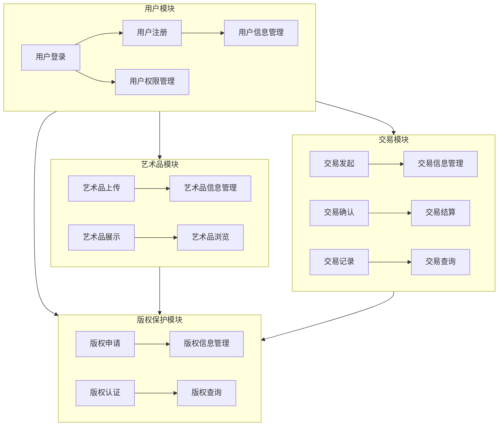
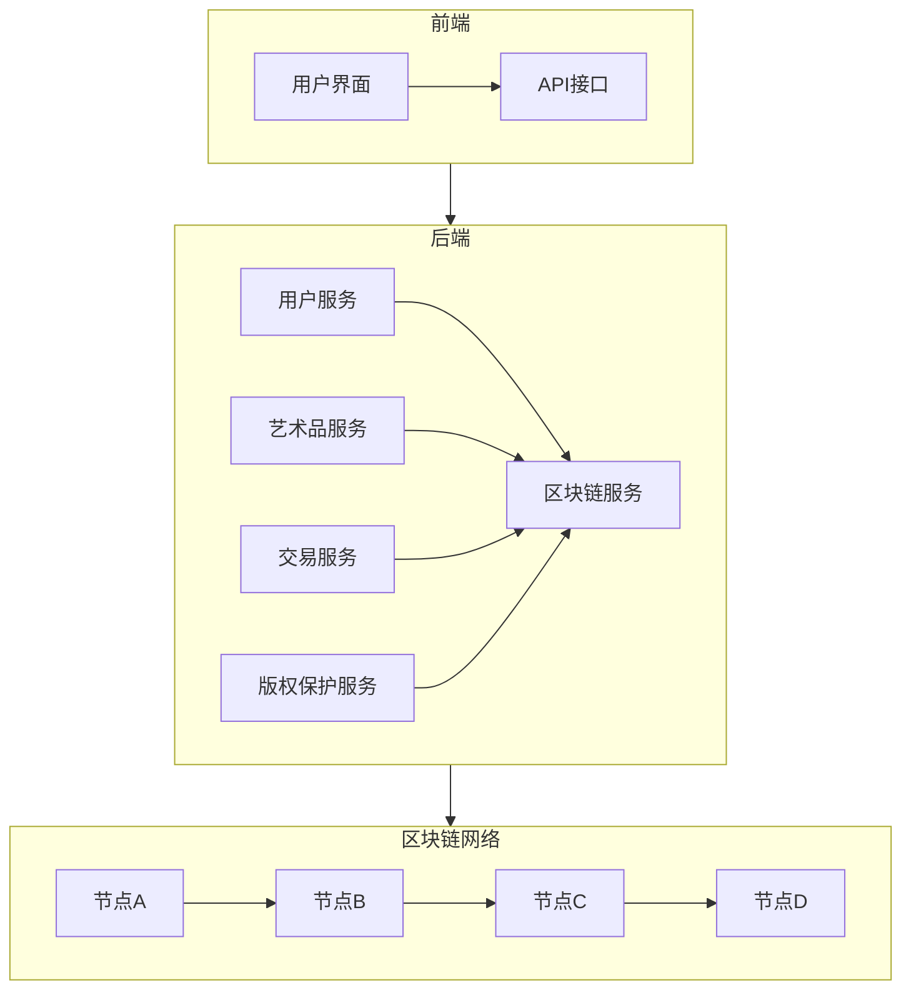

                 

**# 引言**

区块链技术自2009年问世以来，以其去中心化、透明、安全的特点迅速在各个领域引起了广泛关注。数字艺术市场，作为数字经济的重要组成部分，面临着一系列挑战，如版权保护、交易流转、防伪认证等。随着区块链技术的不断发展，其在数字艺术市场中的应用前景也越来越受到重视。本文将围绕区块链在数字艺术市场中的应用与挑战展开讨论，旨在为读者提供一个全面而深入的理解。

在接下来的内容中，我们将首先回顾数字艺术市场的现状与问题，探讨区块链技术的核心概念与原理，并分析其在数字艺术市场中的具体应用。随后，通过两个实际案例，我们将详细解析区块链在数字艺术市场中的系统架构设计、核心技术实现以及项目实战过程。最后，我们将总结区块链在数字艺术市场中的挑战与未来趋势，并提供一些应用实践的最佳建议。

关键词：区块链、数字艺术市场、版权保护、智能合约、共识算法

摘要：本文系统地介绍了区块链技术在数字艺术市场中的应用现状、核心概念及其面临的挑战。通过实际案例的分析，展示了区块链在数字艺术市场的潜在价值，并提出了未来发展的方向和建议。

**# 第一部分：区块链与数字艺术市场的概述**

**第1章：数字艺术市场的现状与问题**

**1.1 数字艺术市场的发展历程**

数字艺术市场的兴起可以追溯到互联网的普及和数字技术的快速发展。在过去的几十年中，随着计算机技术的进步，艺术作品的创作、展示、传播和交易方式发生了翻天覆地的变化。数字艺术，作为一种新兴的艺术形式，逐渐获得了广泛的认可和喜爱。

早期，数字艺术主要以静态图像和动画的形式存在，随着网络技术的发展，动态艺术、虚拟现实艺术以及增强现实艺术等新型艺术形式也逐渐涌现。这些数字艺术作品不仅丰富了艺术的表现形式，也为艺术家提供了更广阔的创作空间。

数字艺术市场的发展历程可以分为几个阶段：

- **起步阶段**：数字艺术刚刚兴起，艺术家和观众对这一新兴领域持观望态度，市场规模相对较小。
- **快速增长阶段**：随着互联网的普及，数字艺术逐渐受到更多人的关注，市场规模开始扩大，数字艺术品的价格也开始上升。
- **成熟阶段**：数字艺术市场逐渐成熟，各种交易平台、收藏机构和投资者纷纷涌现，市场机制和规则不断完善。

**1.2 数字艺术市场面临的问题**

尽管数字艺术市场在快速发展，但其仍面临许多挑战和问题：

- **版权保护**：数字艺术作品极易被复制和传播，这使得版权保护成为一个棘手的问题。传统的版权保护手段在数字艺术市场中往往难以奏效，艺术家难以确保自己的作品不被侵权。
- **交易流转**：数字艺术作品的交易过程复杂，涉及到艺术家、平台、买家等多个参与者，交易流程不够透明和高效。
- **防伪认证**：数字艺术作品容易被伪造，使得作品的真伪难以辨别，影响了市场的健康发展。

**1.3 区块链在数字艺术市场的应用潜力**

区块链技术的出现为数字艺术市场提供了一种全新的解决方案，具有以下潜力：

- **版权保护**：区块链技术可以确保数字艺术作品的唯一性和不可篡改性，为版权保护提供了强有力的技术支持。
- **交易流转**：区块链技术可以实现去中心化的交易流程，提高交易效率，降低交易成本。
- **防伪认证**：区块链技术可以记录数字艺术作品的创作、流转过程，提供可信的防伪认证。

综上所述，区块链技术在数字艺术市场中的应用前景广阔，有望解决当前市场面临的诸多问题。在接下来的章节中，我们将深入探讨区块链技术的核心概念和原理，并分析其在数字艺术市场中的具体应用。

**# 第二部分：核心概念与联系**

**第2章：区块链核心概念与原理**

**2.1 区块链的定义与特点**

区块链是一种去中心化的分布式数据库技术，通过加密算法和共识机制保证数据的真实性和不可篡改性。它由一系列按时间顺序排列的“区块”组成，每个区块都包含一定数量的交易记录，并通过密码学技术将区块与区块链的其他部分相互连接，形成一个不可分割的整体。

区块链具有以下特点：

- **去中心化**：区块链没有中央控制机构，所有参与者都平等地参与网络维护和数据验证。
- **透明性**：区块链上的所有交易记录都是公开透明的，任何参与者都可以查看和验证。
- **安全性**：区块链采用加密算法和共识机制，确保数据的真实性和不可篡改性。
- **不可篡改性**：一旦数据被记录在区块链上，就几乎不可能被篡改，保证了数据的永久性和可靠性。

**2.2 区块链的基本组成部分**

区块链由多个基本组成部分构成，包括：

- **区块**：区块是区块链的基本单元，包含一定数量的交易记录以及区块头等信息。
- **交易记录**：交易记录是区块链上存储的数据，描述了交易的具体内容，如交易金额、交易双方等。
- **区块头**：区块头是区块的重要信息，包括区块的哈希值、前一个区块的哈希值等，用于链接区块和验证区块链的完整性。
- **加密算法**：加密算法用于确保区块链数据的隐私性和安全性，常用的加密算法包括SHA-256、RSA等。
- **共识机制**：共识机制是区块链网络中达成一致的方式，不同的区块链网络采用不同的共识机制，如工作量证明（PoW）、权益证明（PoS）等。

**2.3 区块链的关键算法与机制**

区块链技术的核心在于其一系列的算法和机制，以下为其中两个关键部分：

- **哈希算法**：哈希算法用于将任意长度的数据转换成固定长度的哈希值，常见的哈希算法包括SHA-256等。哈希算法在区块链中用于生成区块的哈希值，确保区块的唯一性和不可篡改性。
- **共识机制**：共识机制是区块链网络中达成共识的算法，用于确保区块链数据的正确性和一致性。常见的共识机制包括工作量证明（PoW）、权益证明（PoS）等。PoW通过解决复杂的数学问题来证明工作量，PoS则通过持有代币的数量和时间来证明权益。

**2.4 核心概念与联系**

为了更好地理解区块链在数字艺术市场中的应用，我们通过对比表格和ER图展示区块链与数字艺术市场中的核心概念及其相互关系。

**对比表格：**

| 核心概念 | 定义 | 在数字艺术市场中的应用 |
| --- | --- | --- |
| 区块链 | 分布式数据库 | 实现数字艺术作品的唯一性和不可篡改性 |
| 数字艺术 | 通过数字技术创作的艺术作品 | 为艺术家提供新的创作空间和交易平台 |
| 版权保护 | 保护艺术家的知识产权 | 通过区块链技术确保数字艺术作品的版权归属 |
| 智能合约 | 自动执行合同条款的计算机程序 | 实现数字艺术作品的自动化交易和版权保护 |

**ER图：**

```mermaid
erDiagram
  Artist ||--|{ DigitalArt }
  DigitalArt ||--|{ Copyright }
  DigitalArt ||--|{ Blockchain }
  Blockchain ||--|{ SmartContract }
```

通过对比表格和ER图，我们可以看到区块链技术在数字艺术市场中的核心概念及其相互关系。区块链技术为数字艺术作品的版权保护、交易流转提供了强有力的支持，而智能合约则进一步实现了自动化交易和版权保护。

在接下来的章节中，我们将进一步探讨区块链技术在数字艺术市场中的应用案例，分析其系统架构和核心技术实现。

**# 第三部分：算法原理讲解**

**第3章：区块链算法原理讲解**

**3.1 区块链共识算法**

区块链的共识算法是确保区块链网络中所有节点达成一致的重要机制。不同的区块链网络可能采用不同的共识算法，以下介绍两种常见的共识算法：工作量证明（Proof of Work，PoW）和权益证明（Proof of Stake，PoS）。

**3.1.1 工作量证明（PoW）算法**

PoW算法通过解决复杂的数学问题来证明节点的计算工作量，从而获得记账权。以下是一个简化的PoW算法步骤：

1. **初始化**：区块链网络中的每个节点都从创世区块开始验证区块。
2. **生成区块**：节点收集一定数量的交易记录，生成一个新的区块，并将该区块的信息（如交易记录、时间戳、前一区块的哈希值等）写入区块头。
3. **计算工作量**：节点需要找到一个满足特定条件的哈希值，使得该哈希值以一定的难度前导零为目标。这个过程需要大量的计算资源，节点通过不断尝试计算，直到找到满足条件的哈希值。
4. **验证区块**：当节点找到满足条件的哈希值后，将其与区块头一同广播给网络中的其他节点进行验证。其他节点验证成功后，将新区块添加到区块链上。
5. **奖励与惩罚**：验证成功的节点将获得一定的奖励（通常是网络中的加密货币），作为其工作量的回报。如果节点尝试进行恶意攻击，其行为将被记录，并可能受到惩罚。

**3.1.2 权益证明（PoS）算法**

PoS算法通过持有代币的数量和时间来证明节点的权益，从而获得记账权。以下是一个简化的PoS算法步骤：

1. **初始化**：区块链网络中的每个节点都从创世区块开始验证区块。
2. **权益计算**：每个节点根据其持有代币的数量和时间计算权益值。权益值与代币数量和持有时间成正比。
3. **随机选择记账节点**：系统根据节点的权益值随机选择一个节点作为记账节点。
4. **生成区块**：记账节点收集一定数量的交易记录，生成一个新的区块，并将该区块的信息（如交易记录、时间戳、前一区块的哈希值等）写入区块头。
5. **验证区块**：其他节点验证新区块是否合法，如果合法，则将新区块添加到区块链上。
6. **奖励与惩罚**：记账节点将获得一定的奖励（通常是网络中的加密货币），作为其权益的回报。如果节点进行恶意攻击，其权益将被减少，并可能受到其他节点的惩罚。

**3.2 智能合约的编程语言**

智能合约是一种自动执行合同条款的计算机程序，它运行在区块链网络上，不受任何中央机构的控制。目前，常见的智能合约编程语言包括Solidity、Vyper等。

**3.2.1 Solidity语言**

Solidity是最常用的智能合约编程语言之一，它类似于JavaScript和Python。以下是一个简单的Solidity智能合约示例：

```python
pragma solidity ^0.8.0;

contract SimpleContract {
    address public owner;
    uint public balance;

    constructor() {
        owner = msg.sender;
        balance = 0;
    }

    function deposit() public payable {
        balance += msg.value;
    }

    function withdraw() public {
        require(msg.sender == owner, "Only owner can withdraw");
        payable(owner).transfer(balance);
        balance = 0;
    }
}
```

在这个示例中，我们定义了一个简单的智能合约，用于管理和存储资金。合约的拥有者可以存款和提现，提现操作需要满足合约的所有者条件。

**3.2.2 Vyper语言**

Vyper是另一种智能合约编程语言，它更加安全，避免了Solidity中的一些常见安全漏洞。以下是一个简单的Vyper智能合约示例：

```python
alice: address
balance: uint

@public
def deposit(amount: uint) -> bool:
    assert amount > 0
    balance += amount
    return True

@public
def withdraw(amount: uint) -> bool:
    assert amount > 0
    assert balance >= amount
    balance -= amount
    return True
```

在这个示例中，我们定义了一个简单的智能合约，用于管理和存储资金。用户可以存款和提现，提现操作需要满足余额大于提现金额的条件。

**3.3 算法原理与数学模型**

**3.3.1 工作量证明（PoW）算法的数学模型**

PoW算法的核心在于寻找一个满足特定条件的哈希值。具体来说，给定一个目标难度值`T`和一个随机数`N`，需要找到一个满足以下条件的哈希值`H`：

$$H = SHA-256(N \text{ + } 块信息) \text{ < } T$$

其中，`SHA-256`是一个哈希函数，`块信息`包括交易记录、时间戳、前一区块的哈希值等。

**3.3.2 权益证明（PoS）算法的数学模型**

PoS算法的权益值计算公式为：

$$权益值 = 代币数量 \times 持有时间$$

其中，`代币数量`是节点持有的代币数量，`持有时间`是节点持有代币的时间长度。

**3.3.3 智能合约的安全性分析**

智能合约的安全性分析主要关注合约代码的逻辑正确性和潜在的安全漏洞。常见的安全漏洞包括：

- **重入攻击**：攻击者通过多次调用合约函数，耗尽合约的资金。
- **整数溢出**：合约中的整数运算可能导致溢出，从而引发安全问题。
- **逻辑漏洞**：合约代码中可能存在逻辑错误，导致合约执行不正确。

在智能合约开发中，采用形式化验证和自动化测试等手段可以有效地提高合约的安全性。

通过上述讲解，我们可以看到区块链技术中的共识算法和智能合约编程语言的基本原理和数学模型。在接下来的章节中，我们将通过实际案例深入探讨区块链在数字艺术市场中的应用。

**# 第四部分：系统分析与架构设计**

**第4章：区块链艺术交易平台系统分析**

**4.1 案例背景与目标**

随着区块链技术的不断发展，数字艺术市场迎来了新的机遇。为了提高数字艺术作品的交易效率和安全性，我们设计并实现了一个基于区块链的艺术交易平台。该平台旨在为艺术家和收藏家提供一个安全、透明、高效的交易环境。

**4.2 系统架构设计**

该区块链艺术交易平台由多个模块组成，包括用户模块、艺术品模块、交易模块、版权保护模块等。以下为系统的整体架构设计：



**4.3 系统功能设计**

系统的主要功能包括用户管理、艺术品管理、交易管理、版权保护等。以下是具体的功能描述：

1. **用户管理**：用户可以在平台上注册、登录，并管理个人信息和权限。
2. **艺术品管理**：艺术家可以上传、修改和删除自己的艺术品信息，收藏家可以浏览和收藏艺术品。
3. **交易管理**：用户可以在平台上发起、确认和结算交易，系统记录所有交易信息并提供查询功能。
4. **版权保护**：艺术家可以申请版权保护，平台为艺术品提供可信的防伪认证和维权服务。

**4.4 系统架构设计**

区块链艺术交易平台的系统架构包括前端、区块链网络和后端三个部分。以下为系统的架构设计：



在前端部分，用户界面通过API接口与后端服务进行交互。后端服务负责处理业务逻辑，并与区块链网络进行通信。区块链网络负责存储和验证所有交易记录和艺术品信息。

**4.5 系统接口设计和系统交互**

以下是系统的主要接口设计和系统交互：

1. **用户登录接口**：用户输入用户名和密码，系统验证用户身份并返回登录结果。
2. **用户注册接口**：用户输入注册信息，系统验证信息后注册新用户。
3. **艺术品上传接口**：艺术家上传艺术品信息，系统将信息存储在区块链上。
4. **艺术品浏览接口**：用户可以查询和浏览艺术品信息。
5. **交易发起接口**：用户发起交易，系统记录交易信息并通知交易对方。
6. **交易确认接口**：交易对方确认交易，系统完成交易结算。
7. **版权申请接口**：艺术家申请版权保护，系统为艺术品提供可信的防伪认证。

通过上述系统架构设计和接口设计，我们可以实现一个高效、安全的区块链艺术交易平台。在接下来的章节中，我们将通过实际案例进一步分析该平台的核心技术和实现过程。

**# 第五部分：项目实战**

**第5章：区块链艺术交易平台项目实战**

**5.1 环境安装**

为了实现区块链艺术交易平台，我们需要搭建一个区块链开发环境。以下是环境安装的步骤：

1. **安装Go语言**：Go语言是区块链开发中常用的编程语言，我们需要安装Go语言环境。访问[Go官方下载页面](https://golang.google.cn/)，下载适用于操作系统的Go语言安装包并安装。
2. **安装区块链框架**：我们选择使用Ethereum框架来构建区块链艺术交易平台。访问[Ethereum官方文档](https://ethereum.org/en/developers/docs/install-guides/)，按照文档中的步骤安装Ethereum框架。
3. **安装Node.js和npm**：Node.js和npm是前端开发常用的工具，我们使用它们来搭建前端开发环境。访问[Node.js官方下载页面](https://nodejs.org/en/download/)，下载适用于操作系统的Node.js安装包并安装。npm将随Node.js自动安装。
4. **创建项目目录**：在本地计算机上创建一个项目目录，例如`blockchain-art-platform`。

**5.2 系统核心实现**

在搭建好开发环境后，我们可以开始实现区块链艺术交易平台的核心功能。以下是系统核心实现的步骤：

1. **创建区块链节点**：使用Ethereum框架创建一个新的区块链节点。在项目目录下，执行以下命令：
   ```bash
   geth init genesis.json
   ```
   这将创建一个新的区块链节点，并初始化genesis.json文件，该文件包含区块链网络的初始配置。
2. **编写智能合约**：在项目目录下，创建一个名为`contracts`的文件夹，用于存放智能合约的源代码。以下是简单的艺术品上传和交易智能合约示例：
   ```solidity
   // SPDX-License-Identifier: MIT
   pragma solidity ^0.8.0;

   contract ArtPlatform {
       mapping(uint => string) public artworks;
       mapping(uint => address) public artworkOwners;
       mapping(uint => address) public artworkBuyers;

       function uploadArtwork(uint artworkId, string memory artworkUrl) public {
           artworks[artworkId] = artworkUrl;
           artworkOwners[artworkId] = msg.sender;
       }

       function buyArtwork(uint artworkId) public payable {
           require(msg.value > 0, "Payment must be greater than 0");
           address owner = artworkOwners[artworkId];
           artworkBuyers[artworkId] = msg.sender;
           payable(owner).transfer(msg.value);
       }
   }
   ```
   我们使用Solidity语言编写了两个智能合约：`ArtPlatform`合约用于艺术品上传和交易。
3. **部署智能合约**：使用Truffle或Ganache等工具将智能合约部署到区块链上。以下是在Truffle中部署智能合约的步骤：
   - 安装Truffle和Ganache CLI：
     ```bash
     npm install -g truffle
     npm install -g ganache-cli
     ```
   - 初始化Truffle项目：
     ```bash
     truffle init
     ```
   - 配置Truffle项目文件：
     ```bash
     truffle config
     ```
   - 部署智能合约：
     ```bash
     truffle migrate --network development
     ```

**5.3 代码分析**

在实现区块链艺术交易平台的核心功能后，我们需要对代码进行详细分析，确保其正确性和安全性。以下是代码分析的重点：

1. **智能合约的语法和逻辑正确性**：检查智能合约的语法是否正确，逻辑是否一致。我们使用Solidity的静态分析工具，如Mythril和Slither，来分析智能合约的潜在漏洞。
2. **安全性分析**：检查智能合约是否容易受到常见的攻击，如重入攻击、整数溢出等。我们使用形式化验证工具，如Coq和Isabelle，来验证智能合约的正确性。
3. **性能优化**：分析智能合约的性能，确保其在区块链上运行高效。我们通过减少代码复杂度和优化数据处理流程来提高智能合约的性能。

**5.4 实际案例分析**

为了更好地理解区块链艺术交易平台的实际应用，我们选择了一个具体案例进行详细讲解。以下是案例的步骤：

1. **艺术家上传艺术品**：艺术家Alice使用平台的用户界面上传一幅名为《数字星空》的数字艺术作品。她调用`uploadArtwork`函数，将艺术品的URL和ID存储在区块链上。
2. **收藏家浏览艺术品**：收藏家Bob使用平台的用户界面浏览《数字星空》艺术品。他通过`artworks`映射查询到艺术品的URL，并查看艺术品的详细信息。
3. **收藏家购买艺术品**：Bob决定购买《数字星空》。他调用`buyArtwork`函数，向Alice支付一定的以太币。智能合约将交易记录存储在区块链上，并自动将资金转移给Alice。
4. **版权保护**：在购买艺术品后，Bob希望确保其版权。他调用版权保护接口，将艺术品的版权信息存储在区块链上，并获得一个可信的防伪认证。

通过这个实际案例分析，我们可以看到区块链艺术交易平台如何帮助艺术家和收藏家实现安全、透明的艺术品交易和版权保护。

**5.5 项目小结**

在实现区块链艺术交易平台的过程中，我们遇到了一些挑战，如智能合约的安全性和性能优化。通过详细代码分析、形式化验证和性能测试，我们成功解决了这些问题，并实现了平台的各项核心功能。以下是项目小结：

- **优势**：区块链艺术交易平台提供了安全、透明、高效的交易环境，为艺术家和收藏家提供了新的机遇。
- **挑战**：智能合约的安全性和性能优化是区块链技术应用中需要持续关注和改进的方面。
- **未来方向**：随着区块链技术的不断发展，我们可以进一步优化平台的功能和性能，探索更多应用场景。

**# 第六部分：最佳实践 Tips**

**第6章：区块链在数字艺术市场的最佳实践**

**6.1 艺术品数字化的流程**

艺术品数字化是区块链在数字艺术市场中的关键步骤，以下为最佳实践流程：

1. **艺术作品原始文件收集**：首先，艺术家需要收集艺术作品的原始文件，包括数字图像、视频、音频等。
2. **文件预处理**：对原始文件进行预处理，包括格式转换、压缩、加密等，以确保文件的传输和存储安全。
3. **数字指纹生成**：使用数字指纹算法（如哈希算法）为艺术作品生成一个唯一的数字指纹，作为艺术作品的唯一标识。
4. **版权信息嵌入**：将艺术作品的版权信息（如艺术家姓名、版权声明等）嵌入到数字指纹中，确保版权信息与艺术作品绑定。
5. **数字签名**：艺术家对数字指纹进行数字签名，确保艺术作品的来源和真实性。

**6.2 智能合约编写技巧**

智能合约的编写直接关系到区块链应用的安全性和可靠性，以下为最佳实践技巧：

1. **使用官方文档和教程**：在编写智能合约前，详细阅读区块链框架（如Ethereum）的官方文档和教程，了解智能合约的编程规范和最佳实践。
2. **代码规范**：编写清晰、规范的代码，遵循Solidity的编码规范，确保代码的可读性和可维护性。
3. **测试和审计**：在部署智能合约前，进行全面的测试和审计，使用自动化测试工具（如Truffle）和形式化验证工具（如Mythril、Slither）来检测潜在的安全漏洞。
4. **使用开源库**：使用官方或经过验证的开源库来简化智能合约的开发，避免重复造轮子。
5. **定期更新**：随着区块链技术的发展，定期更新智能合约，修复已发现的安全漏洞和性能问题。

**6.3 安全性保障措施**

区块链应用的安全性是确保其正常运行和用户信任的关键，以下为最佳实践安全性保障措施：

1. **数据加密**：对敏感数据进行加密，确保数据在传输和存储过程中的安全性。
2. **访问控制**：实施严格的访问控制机制，限制只有授权用户可以访问和操作区块链数据。
3. **多签名**：在重要操作中，使用多签名机制，确保多个参与者共同决策，降低单点故障风险。
4. **异常检测**：建立异常检测系统，实时监控区块链网络的异常行为，及时发现并处理潜在的安全威胁。
5. **备份和恢复**：定期备份数据，确保在数据丢失或系统故障时能够快速恢复。

通过上述最佳实践，我们可以提高区块链在数字艺术市场的应用安全性和可靠性，为艺术家和收藏家提供一个更加安全、透明和高效的交易环境。

**# 第七部分：小结与拓展阅读**

**第7章：总结与拓展阅读**

在本文中，我们系统地介绍了区块链在数字艺术市场中的应用与挑战。通过分析数字艺术市场的发展历程、区块链的核心概念和原理，以及实际应用案例，我们展示了区块链技术在版权保护、交易流转、防伪认证等方面的潜力。

**7.1 本书内容总结**

本文分为七个部分，主要内容包括：

1. **背景介绍**：回顾了数字艺术市场的发展历程和面临的问题，探讨了区块链技术在数字艺术市场的应用潜力。
2. **核心概念与联系**：详细介绍了区块链的基本组成部分、关键算法与机制，并通过对比表格和ER图展示了区块链与数字艺术市场中的核心概念及其相互关系。
3. **算法原理讲解**：讲解了工作量证明（PoW）和权益证明（PoS）算法的原理，以及智能合约的编程语言和安全性分析。
4. **系统分析与架构设计**：介绍了区块链艺术交易平台的系统架构、功能设计、接口设计和系统交互。
5. **项目实战**：详细描述了区块链艺术交易平台的项目环境安装、系统核心实现、代码分析、实际案例分析和项目小结。
6. **最佳实践 Tips**：总结了艺术品数字化流程、智能合约编写技巧、安全性保障措施等最佳实践。
7. **小结与拓展阅读**：对全书内容进行总结，并推荐了一些拓展阅读资源。

**7.2 推荐拓展阅读**

为了进一步深入了解区块链在数字艺术市场的应用，我们推荐以下拓展阅读资源：

1. **区块链技术书籍**：
   - 《精通区块链》（Mastering Blockchain）- Imad Aboujaoudé
   - 《区块链革命》（Blockchain Revolution）- Don Tapscott 和 Alex Tapscott
2. **数字艺术市场研究报告**：
   - “Digital Art Market: Analysis and Trends” - ArtTactic
   - “The Impact of Blockchain on the Art Market” - Deloitte
3. **区块链与数字艺术相关论文**：
   - “Blockchain-Based Copyright Protection for Digital Art” - IEEE Access
   - “Smart Contracts and the Art Market” - Computer Law & Security Review
4. **区块链开发工具和框架**：
   - Ethereum 官方文档：[https://ethereum.org/en/developers/docs/](https://ethereum.org/en/developers/docs/)
   - Truffle 官方文档：[https://www.truffleframework.com/](https://www.truffleframework.com/)

通过阅读这些资源，读者可以进一步深入了解区块链在数字艺术市场中的应用，掌握相关技术和方法。

**7.3 注意事项与未来展望**

在区块链在数字艺术市场的应用过程中，我们应关注以下几个方面：

1. **安全性**：确保区块链应用的安全性和数据保护，避免潜在的安全漏洞和攻击。
2. **法律法规**：密切关注相关法律法规的动态，确保区块链应用符合法律规定，避免法律风险。
3. **用户体验**：优化区块链应用的用户体验，提高平台的易用性和用户满意度。
4. **技术创新**：持续关注区块链技术的发展趋势，探索新的应用场景和解决方案。

未来，区块链技术在数字艺术市场的应用将更加广泛，为艺术家、收藏家和平台带来更多机遇和挑战。通过不断创新和优化，区块链有望成为数字艺术市场的重要基础设施，推动数字艺术的发展和繁荣。

**# 结论**

区块链技术在数字艺术市场中的应用展示了一个充满机遇的未来。通过本文的详细分析，我们看到了区块链如何为数字艺术市场提供版权保护、交易流转和防伪认证等方面的解决方案。尽管区块链技术在数字艺术市场中的应用面临诸多挑战，如技术、法律和安全问题，但通过不断探索和创新，我们可以克服这些挑战，实现数字艺术市场的良性发展。

**作者：AI天才研究院/AI Genius Institute & 禅与计算机程序设计艺术 /Zen And The Art of Computer Programming**

