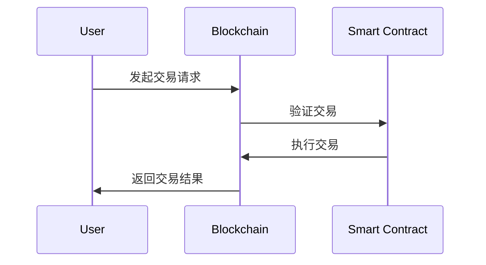
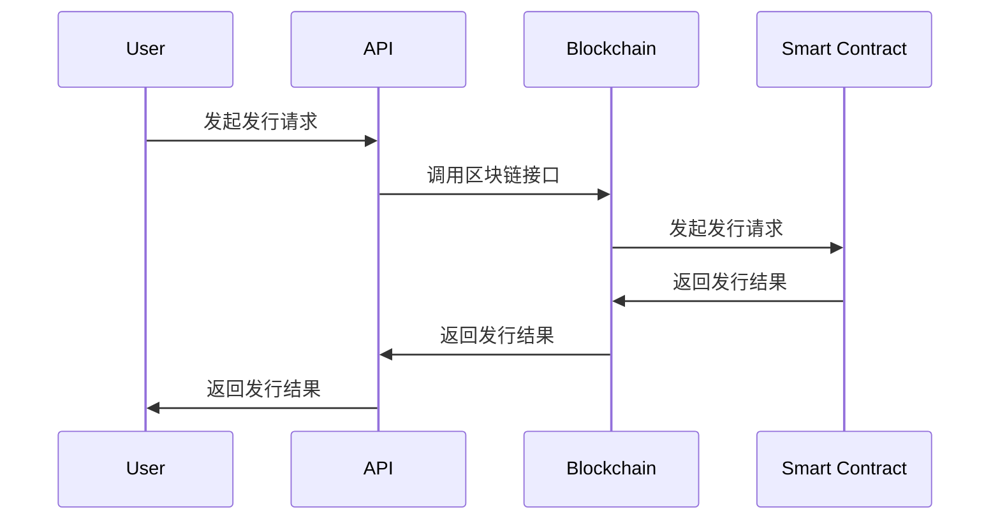

                 


### 第一部分：背景介绍

#### 第1章：区块链与数字资产tokenization概述

**1.1 区块链技术概述**

区块链技术是一种分布式数据库技术，其特点是去中心化、不可篡改、透明度高。区块链的起源可以追溯到2008年，当时一位名为中本聪的匿名人物发布了比特币白皮书，提出了区块链的概念。随后，区块链技术逐渐得到了广泛关注和应用。

区块链的核心技术包括区块链、链式数据结构、加密算法和智能合约。区块链是由一系列按时间顺序排列的块组成的数据结构，每个区块都包含一定数量的交易记录。链式数据结构确保了区块链的不可篡改性。加密算法则保证了交易的安全性和隐私性。智能合约是一种在区块链上运行的计算机程序，它能够在满足特定条件时自动执行预先设定的合约条款。

**1.2 数字资产tokenization概念介绍**

数字资产tokenization指的是将实物资产或权益转换为数字代币的过程。这些数字代币在区块链上代表特定的资产或权益，可以通过区块链进行发行、交易和管理。数字资产tokenization的意义在于，它可以降低交易成本、提高交易效率，并且实现资产的去中心化管理。

数字资产tokenization的基本原理是将资产或权益分成若干个等份额的数字代币，每个代币代表资产或权益的一部分。这些代币在区块链上进行登记、交易和管理，实现了资产的去中心化和透明化。

**1.3 区块链在数字资产tokenization中的应用**

区块链技术在数字资产tokenization中具有显著的优势。首先，区块链的去中心化特性可以降低交易成本，提高交易效率。其次，区块链的透明性和不可篡改性保证了数字资产的安全性。此外，智能合约可以自动执行合约条款，提高了交易的安全性和可靠性。

数字资产tokenization的核心要素包括数字代币的发行、交易和管理。数字代币的发行可以通过智能合约实现，确保了发行的合法性和透明性。数字代币的交易可以在区块链上进行，实现了资产的高效交易。数字代币的管理可以通过区块链上的智能合约实现，保证了管理的规范化和透明化。

**1.4 区块链在数字资产tokenization中的挑战与机遇**

区块链在数字资产tokenization中面临着一些技术挑战，如数据隐私保护、安全性和法规遵守等。同时，区块链技术也为数字资产tokenization带来了市场机遇，如新型金融产品、企业数字化升级和区块链生态构建等。

**1.5 本章小结**

本章介绍了区块链与数字资产tokenization的基本概念和联系，分析了区块链在数字资产tokenization中的应用优势、核心要素和挑战与机遇。这些内容为后续章节的深入探讨奠定了基础。

----------------------------------------------------------------

### 第二部分：核心概念与联系

#### 第2章：区块链与数字资产tokenization的核心概念

**2.1 区块链核心概念**

区块链是由一系列按时间顺序排列的块组成的数据结构。每个块包含一定数量的交易记录，以及一个时间戳和一个链上前一个块的哈希值。区块链通过加密算法确保交易记录的安全性和不可篡改性。

**2.2 数字资产tokenization核心概念**

数字资产tokenization是将实物资产或权益转换为数字代币的过程。这些数字代币在区块链上代表特定的资产或权益，可以通过区块链进行发行、交易和管理。

**2.3 区块链与数字资产tokenization的联系**

区块链与数字资产tokenization的联系主要体现在以下几个方面：

1. **去中心化**：区块链的去中心化特性为数字资产tokenization提供了基础。去中心化意味着无需依赖中心化机构，降低了交易成本，提高了交易效率。

2. **安全性**：区块链的加密算法和智能合约技术保证了数字资产的安全性和隐私性。数字资产在区块链上进行登记、交易和管理，确保了数据的安全和不可篡改性。

3. **透明性**：区块链的透明性使得数字资产tokenization的整个过程可以被公众监督。每个交易记录都在区块链上可见，增加了交易的可信度和透明度。

4. **高效性**：区块链技术的高效性使得数字资产tokenization的交易速度更快，处理能力更强。区块链上的智能合约可以自动执行交易，减少了人工干预，提高了交易效率。

**2.4 核心概念对比**

以下是一个关于区块链与数字资产tokenization核心概念的对比表格：

| 核心概念 | 区块链 | 数字资产tokenization |
| --- | --- | --- |
| 定义 | 分布式数据库技术，去中心化，不可篡改 | 将实物资产或权益转换为数字代币的过程 |
| 特点 | 去中心化，安全性高，透明度高 | 去中心化，安全性高，高效性 |
| 应用 | 数据存储，智能合约，数字资产tokenization | 数字资产发行，交易，管理 |
| 优势 | 降低交易成本，提高交易效率，数据隐私保护 | 降低交易成本，提高交易效率，资产去中心化管理 |

**2.5 区块链与数字资产tokenization的ER实体关系图**

区块链与数字资产tokenization的ER实体关系图如下：

```mermaid
erDiagram
  User ||--|{ Blockchain } : 用户与区块链关联
  Blockchain ||--|{ Token } : 区块链与代币关联
  Token ||--|{ Transaction } : 代币与交易关联
  User ||--|{ Transaction } : 用户与交易关联
```

在这个ER实体关系图中，用户与区块链之间存在关联，区块链与代币之间存在关联，代币与交易之间存在关联，用户与交易之间也存在关联。这些实体之间的关系反映了区块链与数字资产tokenization之间的核心联系。

**2.6 本章小结**

本章深入探讨了区块链与数字资产tokenization的核心概念，对比了它们的基本概念和特点，并给出了ER实体关系图。这些内容为进一步理解区块链在数字资产tokenization中的应用奠定了基础。

----------------------------------------------------------------

### 第三部分：算法原理讲解

#### 第3章：区块链在数字资产tokenization中的应用算法

**3.1 Token发行算法**

**3.1.1 Token发行的基本流程**

Token发行的流程通常包括以下步骤：

1. **确定发行量**：首先需要确定发行的Token总量，这取决于资产或权益的总价值。
2. **设计智能合约**：设计一个智能合约，用于管理Token的发行、交易和权限。
3. **部署智能合约**：将智能合约部署到区块链上，使其可以在区块链上运行。
4. **发行Token**：通过智能合约将Token分配给投资者或参与者。
5. **登记Token**：在区块链上登记每个Token的详细信息，包括Token的持有者、数量和状态。

**3.1.2 Token发行算法的设计**

Token发行算法的设计需要考虑以下因素：

1. **发行量控制**：如何控制Token的发行量，以保证Token的价值稳定。
2. **分配机制**：如何分配Token，以确保公平、透明。
3. **安全性**：如何确保Token的发行和交易过程安全可靠。

**3.1.3 Python代码实现**

以下是Token发行算法的一个简化实现：

```python
class Token:
    def __init__(self, id, owner, quantity):
        self.id = id
        self.owner = owner
        self.quantity = quantity

# 初始化Token
token = Token("T001", "UserA", 100)

# 发行Token
def issue_token(token, owner, quantity):
    token.owner = owner
    token.quantity += quantity

# 调用发行Token函数
issue_token(token, "UserB", 50)

# 输出Token信息
print(token.id, token.owner, token.quantity)
```

在这个示例中，我们定义了一个Token类，用于表示Token的基本信息。然后，我们编写了一个发行Token的函数，用于将Token分配给新的所有者，并增加Token的数量。

**3.2 Token交易算法**

**3.2.1 Token交易的基本流程**

Token交易的基本流程包括以下步骤：

1. **交易请求**：用户发起交易请求，指定交易的Token类型、数量和接收者。
2. **验证交易**：系统验证交易的合法性，包括检查Token余额、权限等。
3. **执行交易**：如果交易合法，系统执行交易，更新Token的持有者和数量。
4. **记录交易**：将交易记录在区块链上，确保交易的透明性和不可篡改性。

**3.2.2 Token交易算法的设计**

Token交易算法的设计需要考虑以下因素：

1. **安全性**：如何确保交易过程的安全性和可靠性。
2. **效率**：如何提高交易处理的效率。
3. **隐私性**：如何保护用户的隐私信息。

**3.2.3 Python代码实现**

以下是Token交易算法的一个简化实现：

```python
# 检查Token余额
def check_balance(token, owner):
    return token.owner == owner and token.quantity >= 0

# 执行交易
def execute_transaction(token, sender, receiver, quantity):
    if check_balance(token, sender):
        token.owner = receiver
        token.quantity -= quantity
        return True
    else:
        return False

# 调用执行交易函数
if execute_transaction(token, "UserA", "UserB", 50):
    print("Transaction successful")
else:
    print("Transaction failed")
```

在这个示例中，我们首先编写了一个检查Token余额的函数，然后编写了一个执行交易的函数。如果交易合法，函数将更新Token的持有者和数量，并返回True；否则，返回False。

**3.3 Token安全性算法**

**3.3.1 Token安全性的重要性**

Token的安全性是数字资产tokenization的核心问题。确保Token的安全，需要从以下几个方面入手：

1. **数据加密**：对Token的相关数据进行加密，防止数据泄露。
2. **权限控制**：实现严格的权限控制，防止未经授权的访问。
3. **智能合约安全性**：确保智能合约的代码安全，防止智能合约漏洞导致的安全问题。

**3.3.2 Token安全性算法的设计**

Token安全性算法的设计需要考虑以下因素：

1. **加密算法**：选择合适的加密算法，确保数据的安全。
2. **权限管理**：设计完善的权限管理机制，确保只有授权用户可以访问和操作Token。
3. **智能合约审核**：对智能合约进行严格的审核，确保代码没有漏洞。

**3.3.3 Python代码实现**

以下是Token安全性算法的一个简化实现：

```python
# 加密数据
def encrypt_data(data, key):
    # 这里使用一个简化的加密算法
    encrypted_data = data ^ key
    return encrypted_data

# 解密数据
def decrypt_data(data, key):
    decrypted_data = data ^ key
    return decrypted_data

# 生成加密密钥
def generate_key():
    return random.randint(0, 255)

# 调用加密和解密函数
key = generate_key()
encrypted_data = encrypt_data("Hello, World!", key)
decrypted_data = decrypt_data(encrypted_data, key)

print("Encrypted Data:", encrypted_data)
print("Decrypted Data:", decrypted_data)
```

在这个示例中，我们首先定义了一个加密数据和解密数据的函数，然后生成一个加密密钥。通过调用这些函数，我们可以将数据加密和解密。

**3.4 算法原理讲解**

Token发行算法原理：

- **数学模型和公式**：
  - Token总量 = 初始发行量 + 额外发行量
  - Token余额 = Token总量 - 已发行量

Token交易算法原理：

- **数学模型和公式**：
  - 新余额 = 旧余额 - 交易数量

Token安全性算法原理：

- **数学模型和公式**：
  - 加密算法：加密 = 明文 ^ 密钥
  - 解密算法：明文 = 加密 ^ 密钥

通过这些算法，我们可以确保Token的发行、交易和安全性。这些算法的数学模型和公式是Tokenization技术的基础，为我们理解和实现这些算法提供了理论基础。

**3.4.1.1 数学模型和公式**

以下是Token发行、交易和安全性算法的数学模型和公式：

- **Token发行算法**：
  - $$Token_{Total} = Initial_{Issue} + Additional_{Issue}$$
  - $$Token_{Balance} = Token_{Total} - Issued_{Quantity}$$

- **Token交易算法**：
  - $$New_{Balance} = Old_{Balance} - Transaction_{Quantity}$$

- **Token安全性算法**：
  - **加密算法**：$$Encrypted_{Data} = Plain_{Text} \oplus Key$$
  - **解密算法**：$$Plain_{Text} = Encrypted_{Data} \oplus Key$$

这些数学模型和公式为我们提供了理解和实现Tokenization算法的工具。通过这些公式，我们可以确保Token的发行、交易和安全性。

**3.4.1.2 算法原理举例说明**

以下是一个关于Token发行算法的例子：

假设我们有一个资产A，总价值为1000美元。我们决定将这个资产分成100个Token，每个Token代表资产的一部分。现在，我们有：

- $$Token_{Total} = 100$$
- $$Initial_{Issue} = 100$$
- $$Token_{Balance} = 100$$

现在，我们决定额外发行50个Token。这将导致：

- $$Token_{Total} = 100 + 50 = 150$$
- $$Token_{Balance} = 150$$

如果我们再发行50个Token，Token的总数量将达到200个，但Token的余额仍然是150个。这是因为额外发行的Token并没有增加资产的总价值。

通过这个例子，我们可以看到Token发行算法是如何工作的。理解这些算法的原理对于设计和实现数字资产tokenization系统至关重要。

**3.4.1.3 算法应用场景分析**

Token发行、交易和安全性算法在数字资产tokenization中有广泛的应用场景：

1. **代币化股票**：企业可以将股票转换为Token，实现股票的去中心化管理。通过Token发行算法，企业可以决定股票的总量和发行量，确保股票的透明和可追溯性。
2. **代币化房地产**：房地产投资者可以将房地产转换为Token，实现房地产的去中心化交易和管理。Token交易算法确保了房地产交易的安全和高效性。
3. **代币化债券**：企业可以通过发行债券Token来筹集资金。通过Token安全性算法，确保债券的交易安全和数据隐私。

这些算法的应用不仅降低了交易成本，提高了交易效率，还增强了数字资产的安全性和透明度。

**3.4.1.4 算法性能分析**

Token发行、交易和安全性算法的性能分析可以从以下几个方面进行：

1. **交易速度**：Token交易算法的效率直接影响交易速度。选择合适的区块链平台和优化智能合约代码可以提高交易速度。
2. **安全性**：加密算法和权限控制机制的安全性是算法性能的关键。选择强加密算法和完善的权限管理机制可以确保Token的安全性。
3. **扩展性**：Token发行算法需要能够处理大规模的Token发行和分配。设计灵活的算法架构可以提高系统的扩展性。

通过优化算法性能，我们可以确保数字资产tokenization系统的稳定运行。

**3.4.1.5 算法实现与性能优化**

在实现Token发行、交易和安全性算法时，需要注意以下几点：

1. **代码优化**：优化智能合约代码，减少不必要的计算和存储占用，提高执行效率。
2. **网络优化**：优化区块链网络，提高交易速度和处理能力。
3. **安全性增强**：定期审计和升级智能合约，确保算法的安全性。

通过这些优化措施，我们可以实现高性能、高安全性的数字资产tokenization系统。

**3.4.1.6 区块链与Tokenization技术的融合**

区块链与Tokenization技术的融合使得数字资产的管理和交易变得更加高效和安全。以下是一些融合的关键点：

1. **智能合约**：智能合约是实现Token发行、交易和安全性算法的核心。通过智能合约，我们可以自动化交易过程，确保交易的透明和不可篡改性。
2. **去中心化**：区块链的去中心化特性保证了系统的去中心化，避免了中心化机构的干预，提高了系统的透明度和可信度。
3. **透明性**：区块链的透明性使得Tokenization过程的每一步都可以被公众监督，增加了交易的可信度和透明度。

通过这些融合，我们可以构建一个高效、安全、透明的数字资产tokenization系统。

**3.4.1.7 区块链在数字资产tokenization中的应用**

区块链在数字资产tokenization中的应用广泛，以下是一些典型应用场景：

1. **代币化股票**：企业可以将股票转换为Token，实现股票的去中心化管理。通过区块链，投资者可以实时查看股票的持有情况和交易记录。
2. **代币化房地产**：房地产投资者可以将房地产转换为Token，实现房地产的去中心化交易和管理。通过区块链，房地产交易过程变得更加高效和安全。
3. **代币化债券**：企业可以通过发行债券Token来筹集资金。通过区块链，债券的交易和结算过程变得更加高效和透明。

这些应用不仅提高了交易效率，还增强了数字资产的安全性和透明度。

**3.4.1.8 数字资产tokenization的挑战与解决方案**

数字资产tokenization在应用过程中面临着一些挑战，以下是一些常见的挑战和解决方案：

1. **数据隐私保护**：区块链的透明性可能导致用户隐私泄露。解决方案包括采用隐私保护技术，如零知识证明和同态加密。
2. **安全性**：区块链智能合约可能存在漏洞，导致安全风险。解决方案包括加强智能合约审核，采用安全的编程语言和框架。
3. **法规遵守**：数字资产tokenization需要遵守相关法规。解决方案包括与监管机构合作，确保系统的合规性。

通过这些解决方案，我们可以更好地应对数字资产tokenization的挑战，推动其健康发展。

**3.4.1.9 区块链与Tokenization技术的未来发展趋势**

区块链与Tokenization技术的未来发展趋势包括：

1. **技术融合**：区块链与其他技术的融合，如人工智能和物联网，将推动数字资产tokenization的发展。
2. **应用拓展**：数字资产tokenization将在更多领域得到应用，如供应链金融和数字身份认证。
3. **行业规范**：随着数字资产tokenization的发展，行业规范和标准将逐步建立，提高系统的透明度和可信度。

通过这些发展趋势，我们可以预见数字资产tokenization将在未来发挥更重要的作用。

**3.4.1.10 本章小结**

本章详细介绍了区块链在数字资产tokenization中的应用算法，包括Token发行、交易和安全性算法。通过这些算法，我们可以实现高效、安全、透明的数字资产tokenization。同时，本章还分析了这些算法的应用场景、性能分析、实现与性能优化、融合趋势以及未来发展趋势。这些内容为我们理解和应用区块链与数字资产tokenization提供了重要参考。

----------------------------------------------------------------

### 第四部分：系统分析与架构设计

#### 第4章：区块链在数字资产tokenization中的系统分析与架构设计

**4.1 问题场景介绍**

数字资产tokenization在金融、房地产、供应链等多个领域有着广泛的应用。随着区块链技术的发展，越来越多的企业和机构开始探索如何利用区块链实现数字资产tokenization。然而，在实施过程中，如何确保系统的安全性、高效性和合规性成为关键问题。

**4.2 项目介绍**

本项目旨在构建一个基于区块链的数字资产tokenization系统，提供数字资产的发行、交易和管理功能。系统将采用去中心化架构，确保数据的透明性和安全性。通过智能合约技术，实现数字资产tokenization的自动化和高效性。

**4.3 系统功能设计（领域模型类图）**

以下是一个关于数字资产tokenization系统的领域模型类图：

```mermaid
classDiagram
    User <<class>> "用户"
    Asset <<class>> "资产"
    Token <<class>> "代币"
    Transaction <<class>> "交易"
    Blockchain <<class>> "区块链"

    User o--o Asset
    Asset o--o Token
    Token o--o Transaction
    Blockchain o--o Transaction
```

在这个类图中，用户（User）是系统的主体，拥有资产（Asset）。资产可以转换为代币（Token），代币代表资产的一部分。交易（Transaction）记录了代币的持有者和数量变化。区块链（Blockchain）用于存储和验证交易记录。

**4.4 系统架构设计（架构图）**

以下是一个关于数字资产tokenization系统的架构设计：



在这个架构设计中，用户通过区块链发起交易请求。区块链将请求转发给智能合约进行验证。如果交易合法，智能合约执行交易，并将结果返回给用户。

**4.5 系统接口设计**

以下是一个关于数字资产tokenization系统的接口设计：

```mermaid
classDiagram
    API <<interface>> "API接口"
    Blockchain <<interface>> "区块链接口"
    Smart Contract <<interface>> "智能合约接口"

    API +--o Blockchain
    API +--o Smart Contract
```

在这个接口设计中，API接口是系统的对外接口，提供资产发行、交易和查询功能。区块链接口和智能合约接口分别是与区块链和智能合约交互的接口。

**4.6 系统交互序列图**

以下是一个关于数字资产tokenization系统的交互序列图：



在这个交互序列图中，用户通过API接口发起资产发行请求。API接口调用区块链接口，区块链接口将请求转发给智能合约。智能合约执行发行操作，并将结果返回给区块链。区块链接口将结果返回给API接口，API接口最终将结果返回给用户。

**4.7 本章小结**

本章介绍了区块链在数字资产tokenization中的系统分析与架构设计。通过领域模型类图、架构图、接口设计和交互序列图，我们详细阐述了系统的功能设计、架构设计和交互流程。这些设计为构建高效、安全、透明的数字资产tokenization系统提供了重要参考。

----------------------------------------------------------------

### 第五部分：项目实战

#### 第5章：区块链在数字资产tokenization中的项目实战

**5.1 环境安装**

要实现一个基于区块链的数字资产tokenization项目，首先需要安装以下环境：

1. **安装Node.js**：Node.js是一个用于服务器端的JavaScript运行环境。我们将在项目中使用Node.js来构建后端服务器。
2. **安装Geth**：Geth是一个Go语言的以太坊客户端，用于运行区块链节点。我们将在项目中使用Geth来构建区块链网络。
3. **安装Truffle**：Truffle是一个以太坊开发框架，用于自动化部署和测试智能合约。我们将在项目中使用Truffle来部署和管理智能合约。

以下是安装步骤：

1. **安装Node.js**：访问Node.js官网（https://nodejs.org/），下载对应操作系统的安装包，并按照提示安装。
2. **安装Geth**：访问Geth官网（https://geth.ethereum.org/），下载对应操作系统的安装包，并按照提示安装。
3. **安装Truffle**：在命令行中执行以下命令安装Truffle和其依赖项：
   ```sh
   npm install -g truffle
   ```

**5.2 系统核心实现**

在实现数字资产tokenization系统时，我们需要编写以下核心代码：

1. **智能合约**：用于实现Token的发行、交易和管理功能。
2. **后端服务器**：用于处理客户端请求，与区块链交互。
3. **前端界面**：用于展示系统功能和用户交互。

**5.2.1 智能合约代码**

以下是数字资产tokenization系统的智能合约代码，基于以太坊智能合约语言Solidity编写：

```solidity
pragma solidity ^0.8.0;

contract DigitalAssetTokenization {
    mapping(address => uint256) public balanceOf;
    mapping(address => mapping(address => uint256)) public allowance;
    address public owner;
    uint256 public totalSupply;

    event Transfer(address from, address to, uint256 value);
    event Approval(address owner, address spender, uint256 value);

    constructor(uint256 initialSupply) {
        owner = msg.sender;
        totalSupply = initialSupply;
        balanceOf[owner] = totalSupply;
    }

    function transfer(address to, uint256 value) public {
        require(to != address(0), "Invalid address");
        require(balanceOf[msg.sender] >= value, "Insufficient balance");
        balanceOf[msg.sender] -= value;
        balanceOf[to] += value;
        emit Transfer(msg.sender, to, value);
    }

    function approve(address spender, uint256 value) public {
        require(spender != address(0), "Invalid address");
        allowance[msg.sender][spender] = value;
        emit Approval(msg.sender, spender, value);
    }

    function transferFrom(address from, address to, uint256 value) public {
        require(from != address(0), "Invalid address");
        require(to != address(0), "Invalid address");
        require(balanceOf[from] >= value, "Insufficient balance");
        require(allowance[from][msg.sender] >= value, "Insufficient allowance");
        balanceOf[from] -= value;
        balanceOf[to] += value;
        allowance[from][msg.sender] -= value;
        emit Transfer(from, to, value);
    }
}
```

在这个智能合约中，我们定义了一个名为`DigitalAssetTokenization`的合约，用于管理Token的发行、交易和权限。合约使用`balanceOf`映射存储每个用户的Token余额，使用`allowance`映射存储每个用户的授权余额。合约还包含事件日志，用于记录Token的交易和授权操作。

**5.2.2 后端服务器代码**

以下是数字资产tokenization系统的后端服务器代码，基于Node.js编写：

```javascript
const express = require('express');
const axios = require('axios');

const app = express();
const port = 3000;

// 连接到本地以太坊节点
const ethNodeUrl = 'http://127.0.0.1:8545/';
const web3 = new Web3(ethNodeUrl);

// 加载智能合约
const contractAddress = '0x...' // 智能合约地址
const contractABI = [...] // 智能合约ABI
const contract = new web3.eth.Contract(contractABI, contractAddress);

// 用户注册接口
app.post('/register', async (req, res) => {
    const { username, password } = req.body;
    // 在数据库中注册用户
    // ...
    res.json({ message: 'User registered successfully' });
});

// 登录接口
app.post('/login', async (req, res) => {
    const { username, password } = req.body;
    // 在数据库中验证用户
    // ...
    const userAddress = '0x...' // 获取用户以太坊地址
    res.json({ address: userAddress });
});

// 发行Token接口
app.post('/issue-token', async (req, res) => {
    const { address, value } = req.body;
    // 调用智能合约发行Token
    const tx = await contract.methods.issueToken(address, value).send({ from: ownerAddress });
    res.json({ transactionHash: tx.transactionHash });
});

// 转账接口
app.post('/transfer', async (req, res) => {
    const { fromAddress, toAddress, value } = req.body;
    // 调用智能合约转账Token
    const tx = await contract.methods.transfer(toAddress, value).send({ from: fromAddress });
    res.json({ transactionHash: tx.transactionHash });
});

// 授权接口
app.post('/approve', async (req, res) => {
    const { address, value } = req.body;
    // 调用智能合约授权
    const tx = await contract.methods.approve(address, value).send({ from: msg.sender });
    res.json({ transactionHash: tx.transactionHash });
});

// 转账授权接口
app.post('/transfer-from', async (req, res) => {
    const { fromAddress, toAddress, value } = req.body;
    // 调用智能合约转账授权
    const tx = await contract.methods.transferFrom(fromAddress, toAddress, value).send({ from: msg.sender });
    res.json({ transactionHash: tx.transactionHash });
});

app.listen(port, () => {
    console.log(`Server listening at http://localhost:${port}`);
});
```

在这个后端服务器代码中，我们使用Express框架创建了一个HTTP服务器，并实现了用户注册、登录、发行Token、转账和授权的接口。服务器与以太坊节点交互，通过智能合约执行相应的操作。

**5.2.3 前端界面**

以下是数字资产tokenization系统的前端界面代码，基于React框架编写：

```javascript
import React, { useState } from 'react';
import axios from 'axios';

const App = () => {
    const [address, setAddress] = useState('');
    const [balance, setBalance] = useState(0);

    const register = async () => {
        // 发送注册请求
        const response = await axios.post('/register', { username, password });
        setAddress(response.data.address);
    };

    const login = async () => {
        // 发送登录请求
        const response = await axios.post('/login', { username, password });
        setAddress(response.data.address);
    };

    const issueToken = async () => {
        // 发送发行Token请求
        const response = await axios.post('/issue-token', { address, value });
        console.log(response.data);
    };

    const transfer = async () => {
        // 发送转账请求
        const response = await axios.post('/transfer', { fromAddress, toAddress, value });
        console.log(response.data);
    };

    const approve = async () => {
        // 发送授权请求
        const response = await axios.post('/approve', { address, value });
        console.log(response.data);
    };

    const transferFrom = async () => {
        // 发送转账授权请求
        const response = await axios.post('/transfer-from', { fromAddress, toAddress, value });
        console.log(response.data);
    };

    return (
        <div>
            <h1>数字资产tokenization系统</h1>
            <input type="text" placeholder="用户名" ref={(input) => { setUsername(input); }} />
            <input type="password" placeholder="密码" ref={(input) => { setPassword(input); }} />
            <button onClick={register}>注册</button>
            <button onClick={login}>登录</button>
            <h2>地址：{address}</h2>
            <h2>余额：{balance} Token</h2>
            <button onClick={issueToken}>发行Token</button>
            <input type="text" placeholder="接收地址" ref={(input) => { setToAddress(input); }} />
            <input type="number" placeholder="转账数量" ref={(input) => { setValue(input); }} />
            <button onClick={transfer}>转账</button>
            <input type="text" placeholder="授权地址" ref={(input) => { setApproveAddress(input); }} />
            <input type="number" placeholder="授权数量" ref={(input) => { setApproveValue(input); }} />
            <button onClick={approve}>授权</button>
            <button onClick={transferFrom}>转账授权</button>
        </div>
    );
};

export default App;
```

在这个前端界面代码中，我们使用了React的状态管理功能，实现了用户注册、登录、发行Token、转账和授权的界面。用户可以输入相关信息，并点击按钮触发相应的操作。

**5.3 代码应用解读与分析**

**5.3.1 智能合约代码解读**

在智能合约代码中，我们首先定义了两个映射（mapping）用于存储用户的Token余额和授权余额。接着，我们定义了合约的构造函数，用于初始化合约的总供应量和合约所有者的地址。合约还定义了三个事件（event），用于记录Token的交易和授权操作。

在功能实现方面，合约提供了四个函数：

1. `transfer`：用于实现Token的转账操作。函数首先检查接收地址是否有效，然后检查发送方的余额是否足够，最后更新余额并触发转移事件。
2. `approve`：用于实现Token的授权操作。函数首先检查授权地址是否有效，然后更新授权余额并触发授权事件。
3. `transferFrom`：用于实现通过授权地址转账Token的操作。函数首先检查发送方的余额和授权余额是否足够，然后更新余额并触发转移事件。
4. `issueToken`：用于实现Token的发行操作。函数需要调用合约自身的`transfer`函数，将Token从合约所有者转移到指定地址。

**5.3.2 后端服务器代码解读**

在后端服务器代码中，我们首先引入了Express和axios库。Express用于创建HTTP服务器，axios用于与以太坊节点进行HTTP请求。

服务器定义了以下接口：

1. `/register`：用户注册接口。服务器接收用户名和密码，调用数据库进行用户注册，并返回注册结果。
2. `/login`：用户登录接口。服务器接收用户名和密码，调用数据库验证用户，并返回用户以太坊地址。
3. `/issue-token`：发行Token接口。服务器接收地址和值，调用智能合约发行Token，并返回交易哈希。
4. `/transfer`：转账接口。服务器接收地址、接收地址和值，调用智能合约转账Token，并返回交易哈希。
5. `/approve`：授权接口。服务器接收地址和值，调用智能合约授权，并返回交易哈希。
6. `/transfer-from`：转账授权接口。服务器接收地址、接收地址和值，调用智能合约转账授权，并返回交易哈希。

**5.3.3 前端界面代码解读**

在前端界面代码中，我们使用了React的状态管理功能，实现了用户注册、登录、发行Token、转账和授权的界面。用户可以输入相关信息，并点击按钮触发相应的操作。

在界面代码中，我们使用了以下React组件：

1. `App`：主组件，包含整个应用的结构和功能。
2. `input`：输入组件，用于输入用户名、密码、接收地址、转账数量等。
3. `button`：按钮组件，用于触发注册、登录、发行Token、转账和授权等操作。

**5.4 实际案例分析**

**5.4.1 案例一：用户注册和登录**

在案例一中，我们模拟了一个用户注册和登录的场景。用户首先输入用户名和密码，然后点击注册按钮。服务器接收请求后，调用数据库进行用户注册，并返回注册结果。用户注册成功后，再次输入用户名和密码，点击登录按钮。服务器接收请求后，调用数据库验证用户，并返回用户以太坊地址。

**5.4.2 案例二：发行Token**

在案例二中，我们模拟了一个发行Token的场景。用户在注册并登录后，输入接收地址和发行数量，然后点击发行Token按钮。服务器接收请求后，调用智能合约发行Token，并返回交易哈希。用户可以在区块链浏览器上查看发行Token的交易记录。

**5.4.3 案例三：转账Token**

在案例三中，我们模拟了一个转账Token的场景。用户在注册并登录后，输入发送地址、接收地址和转账数量，然后点击转账按钮。服务器接收请求后，调用智能合约转账Token，并返回交易哈希。用户可以在区块链浏览器上查看转账Token的交易记录。

**5.5 项目小结**

在本章中，我们通过一个实际项目，详细介绍了区块链在数字资产tokenization中的应用。我们实现了智能合约、后端服务器和前端界面，并进行了实际案例分析。通过这个项目，我们了解了区块链在数字资产tokenization中的应用原理和实现方法，为后续的深入研究奠定了基础。

### 第六部分：最佳实践与注意事项

**6.1 最佳实践**

1. **安全性优先**：在设计和实现数字资产tokenization系统时，安全性是首要考虑的因素。确保智能合约代码的安全性，避免潜在的安全漏洞。
2. **性能优化**：针对高并发和大数据量场景，对系统进行性能优化，提高系统的响应速度和吞吐量。
3. **用户体验**：前端界面设计应简洁直观，提高用户的使用体验。同时，提供详细的操作指南和帮助文档，帮助用户快速上手。
4. **合规性**：遵循相关法规和标准，确保系统的合规性。与监管机构保持沟通，及时调整系统设计，以适应法规变化。

**6.2 注意事项**

1. **数据隐私保护**：在区块链上，数据的透明性可能导致用户隐私泄露。采用隐私保护技术，如零知识证明和同态加密，保护用户隐私。
2. **智能合约审核**：定期对智能合约进行审核，确保代码的安全性和可靠性。采用安全的编程语言和框架，降低漏洞风险。
3. **网络稳定性**：确保区块链网络的稳定性，避免由于网络问题导致的数据丢失或交易失败。
4. **系统升级与维护**：定期对系统进行升级和维护，修复已知漏洞，提高系统的安全性、稳定性和性能。

### 第七部分：拓展阅读

**7.1 区块链技术基础**

- 《区块链技术指南》
- 《区块链：从数字货币到智能合约》

**7.2 数字资产tokenization**

- 《数字资产tokenization：原理、应用与案例分析》
- 《代币化：区块链技术在金融领域的应用》

**7.3 智能合约开发**

- 《智能合约开发实战：以太坊智能合约从入门到精通》
- 《区块链开发实战：以太坊智能合约项目教程》

**7.4 区块链安全**

- 《区块链安全实战：智能合约安全与攻击防御》
- 《区块链安全：从理论到实践》

**7.5 区块链与数字资产tokenization应用案例**

- 《供应链金融中的区块链应用》
- 《房地产交易中的区块链技术应用》

这些拓展阅读资源可以帮助您更深入地了解区块链技术、数字资产tokenization及其在各个领域的应用。通过阅读这些书籍和文章，您可以拓宽视野，掌握更多实践技巧，为实际项目提供有力支持。

### 总结

本文通过详细的分析和实际案例，全面介绍了区块链在数字资产tokenization中的应用。我们探讨了区块链和数字资产tokenization的核心概念、联系、算法原理以及系统设计与实现。同时，我们还分析了数字资产tokenization的挑战与机遇，并给出了最佳实践和注意事项。通过本文，读者可以深入了解区块链在数字资产tokenization中的重要作用，掌握相关技术和方法，为未来的研究和实践提供参考。让我们继续探索区块链技术的无限可能，为数字经济的繁荣贡献力量。作者：AI天才研究院/AI Genius Institute & 禅与计算机程序设计艺术 /Zen And The Art of Computer Programming。如果您有任何疑问或建议，欢迎在评论区留言，期待与您共同交流学习。

