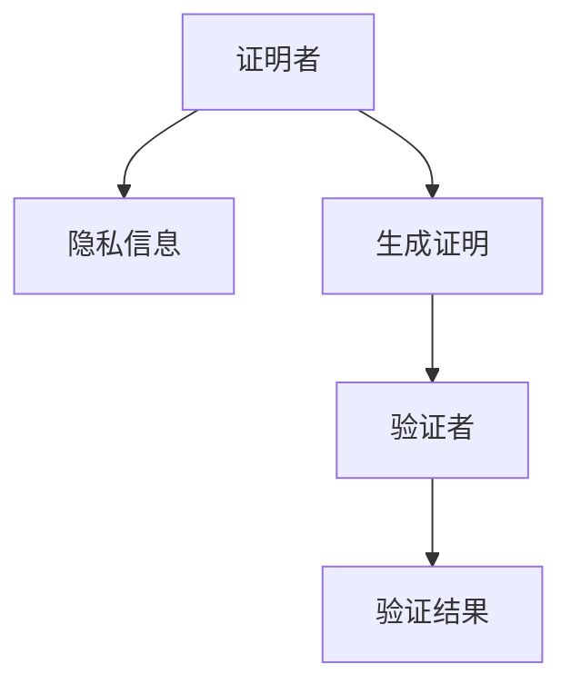
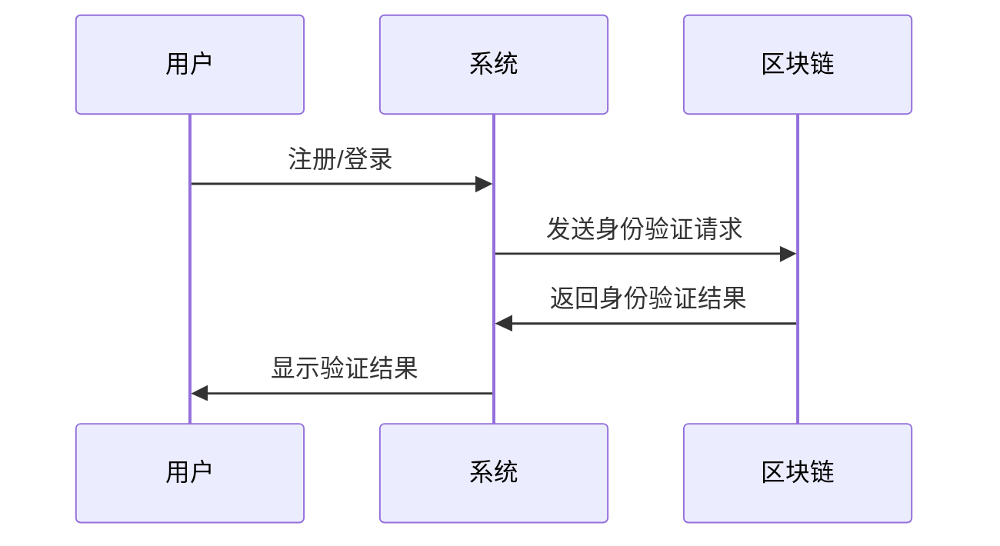

                 

### 关键词

- 区块链
- 数字身份管理
- 隐私保护
- 零知识证明
- 智能合约
- 隐私合约
- 数据隐私

### 摘要

本文深入探讨了区块链技术在数字身份管理中的隐私保护作用。通过分析区块链的基本原理和数字身份管理的现状，本文详细介绍了区块链在隐私保护方面的优势和应用，包括零知识证明和隐私保护合约等技术。本文还通过具体的案例分析，探讨了区块链隐私保护在医疗健康、金融和教育等领域的应用，并提出了相关挑战和未来趋势。最后，本文总结了区块链隐私保护在数字身份管理中的最佳实践，为相关领域的研究和实际应用提供了有益的参考。

### 第一部分: 区块链与数字身份管理

#### 1.1 区块链与数字身份管理概述

**1.1.1 区块链技术的基本原理**

区块链是一种分布式数据库技术，通过加密算法和共识机制确保数据的不可篡改性和安全性。区块链的基本组成包括区块、链和节点。每个区块包含一定数量的交易记录，并通过哈希函数与前后区块相连，形成链式结构。节点则是区块链网络中的计算设备，负责验证和传播交易信息。

**1.1.2 数字身份管理的挑战**

数字身份管理涉及用户身份信息的创建、验证、存储和授权。当前数字身份管理面临的主要挑战包括：

- **隐私泄露**：用户身份信息在互联网上容易受到窃取和滥用。
- **身份伪造**：恶意攻击者可以通过伪造身份信息进行欺诈和恶意行为。
- **跨平台兼容性**：不同平台和系统之间的身份认证和授权存在兼容性问题。

**1.1.3 区块链在数字身份管理中的应用前景**

区块链技术为解决上述挑战提供了可能。其分布式特性确保了数据的安全性和隐私性，而智能合约则为身份验证和授权提供了自动化的解决方案。未来，区块链有望成为数字身份管理的重要基础设施。

#### 1.2 数字身份管理的基本概念

**1.2.1 数字身份的定义与属性**

数字身份是用户在网络空间中的唯一标识，通常包含用户名、密码、邮箱地址等属性。一个完整的数字身份应该具备以下属性：

- **唯一性**：每个用户应该有一个唯一的数字身份。
- **可验证性**：数字身份信息应该可以被第三方验证。
- **可修改性**：用户可以修改其数字身份信息，但需经过验证。

**1.2.2 数字身份管理的核心要素**

数字身份管理涉及以下核心要素：

- **身份认证**：确保用户身份的合法性。
- **身份授权**：管理用户访问不同资源和服务的权限。
- **身份信息存储**：安全存储和管理用户身份信息。
- **身份信息同步**：在不同平台和系统之间同步用户身份信息。

**1.2.3 数字身份管理的技术架构**

数字身份管理的技术架构通常包括以下层次：

- **用户层**：用户界面，提供身份管理功能。
- **认证层**：使用多种认证方式验证用户身份。
- **授权层**：管理用户访问权限。
- **数据层**：存储和管理用户身份信息。

#### 1.3 区块链与数字身份管理的结合

**1.3.1 区块链在数字身份认证中的应用**

区块链技术可以用于数字身份认证，通过分布式账本记录用户身份信息，确保其不可篡改。用户在区块链上注册身份，并通过私钥进行身份验证。

**1.3.2 区块链在数据隐私保护中的作用**

区块链的加密算法和分布式特性有助于保护用户数据的隐私。通过零知识证明等技术，用户可以在不泄露个人信息的情况下验证身份。

**1.3.3 区块链在身份信息管理中的优势**

区块链在身份信息管理中的优势包括：

- **去中心化**：消除了单点故障风险。
- **不可篡改**：确保身份信息的安全性和可靠性。
- **透明性**：所有节点都可以验证交易，提高了信任度。

#### 1.4 区块链隐私保护机制

**1.4.1 零知识证明机制**

零知识证明是一种密码学技术，允许一方（证明者）向另一方（验证者）证明某个陈述是真实的，而无需透露任何具体信息。零知识证明在数字身份管理中可用于保护用户隐私。

**1.4.2 隐私保护合约**

隐私保护合约是区块链上的智能合约，用于实现隐私保护功能。通过隐私保护合约，用户可以在不泄露个人信息的情况下进行身份验证和授权。

**1.4.3 区块链隐私保护技术的比较分析**

不同区块链隐私保护技术的比较分析包括：

- **隐私协议**：如Zcash、Monero等。
- **侧链**：如Ethereum的Plasma。
- **隐私计算**：如多方计算、同态加密等。

#### 1.5 本章小结

本章概述了区块链和数字身份管理的基本概念，分析了区块链在数字身份管理中的应用前景和隐私保护机制。下一章将深入探讨区块链隐私保护技术在具体领域的应用。

### 第二部分: 区块链隐私保护在数字身份管理中的应用

#### 2.1 区块链隐私保护技术的应用场景

**2.1.1 医疗健康领域的应用**

在医疗健康领域，区块链隐私保护技术可以用于保护患者隐私，确保医疗数据的安全和隐私。例如，通过零知识证明技术，患者可以在不透露具体信息的情况下验证医生的身份和处方。

**2.1.2 金融行业的应用**

金融行业对数据安全和隐私保护有严格的要求。区块链技术可以用于实现安全的身份验证和授权，确保用户金融交易的安全和隐私。例如，通过智能合约，可以实现自动化和透明的交易审核流程。

**2.1.3 教育领域的应用**

在教育领域，区块链技术可以用于保护学生和教师的信息，确保成绩单和其他重要文件的完整性和可信性。例如，通过区块链，学生可以证明自己的学历和技能，而无需依赖第三方认证机构。

#### 2.2 区块链隐私保护技术的实现方法

**2.2.1 零知识证明的应用**

零知识证明技术是区块链隐私保护的核心技术之一。它允许证明者在不透露具体信息的情况下，向验证者证明某个陈述是真实的。在数字身份管理中，零知识证明可以用于身份验证，确保用户隐私。

**2.2.2 隐私保护智能合约的设计**

隐私保护智能合约是区块链上的智能合约，用于实现隐私保护功能。通过隐私保护智能合约，用户可以在不泄露个人信息的情况下进行交易和授权。例如，用户可以通过隐私保护智能合约购买商品或服务，而无需透露个人信息。

**2.2.3 区块链隐私保护技术的集成方案**

区块链隐私保护技术的集成方案通常包括：

- **加密算法**：用于保护数据的安全。
- **身份验证机制**：确保用户身份的合法性。
- **智能合约**：实现隐私保护功能。
- **分布式账本**：记录和存储隐私保护数据。

#### 2.3 区块链隐私保护技术的案例分析

**2.3.1 案例一：医疗健康数据隐私保护**

某医疗中心采用区块链技术保护患者数据隐私。通过零知识证明技术，患者可以在不透露具体信息的情况下验证医生的身份和处方。同时，医生和患者可以在区块链上共享医疗记录，确保数据的完整性和可信性。

**2.3.2 案例二：金融交易隐私保护**

某金融机构采用区块链技术实现金融交易隐私保护。通过智能合约，用户可以在不泄露个人信息的情况下进行交易。同时，金融机构可以在区块链上记录交易信息，确保交易的透明性和安全性。

**2.3.3 案例三：教育信息隐私保护**

某教育机构采用区块链技术保护学生和教师的信息。通过区块链，学生可以证明自己的学历和技能，而无需依赖第三方认证机构。同时，教师可以在区块链上记录学生成绩，确保成绩的真实性和可信性。

#### 2.4 区块链隐私保护技术的挑战与未来趋势

**2.4.1 技术挑战与解决方案**

区块链隐私保护技术面临的挑战包括：

- **性能瓶颈**：区块链的扩展性和性能需要进一步提升。
- **隐私保护与性能之间的权衡**：如何在保护隐私的同时提高系统性能。
- **隐私泄露风险**：隐私保护机制需要确保数据的安全。

解决方案包括：

- **侧链和分层架构**：提高区块链的扩展性和性能。
- **多方计算和同态加密**：提高隐私保护技术的性能。
- **混合隐私保护方案**：结合多种隐私保护技术，实现最优的隐私保护效果。

**2.4.2 未来趋势与展望**

未来，区块链隐私保护技术将朝着以下方向发展：

- **集成多种隐私保护技术**：结合零知识证明、多方计算、同态加密等，实现更强大的隐私保护能力。
- **跨链和互操作**：实现不同区块链之间的隐私保护数据共享和互操作。
- **隐私保护合规性**：确保隐私保护机制符合相关法律法规和标准。

**2.4.3 隐私保护技术的发展方向**

隐私保护技术的发展方向包括：

- **区块链隐私保护协议标准化**：制定统一的隐私保护协议，提高互操作性和兼容性。
- **隐私保护技术的落地应用**：推动隐私保护技术在各行业的实际应用。
- **隐私保护教育与培训**：提高公众对隐私保护技术的认知和应用能力。

#### 2.5 本章小结

本章详细介绍了区块链隐私保护技术在医疗健康、金融和教育等领域的应用，分析了相关案例和未来趋势。下一章将探讨区块链隐私保护在数字身份管理中的最佳实践。

### 第三部分: 区块链隐私保护在数字身份管理中的最佳实践

#### 3.1 区块链隐私保护的最佳实践

**3.1.1 设计原则与实践策略**

在设计和实施区块链隐私保护方案时，应遵循以下原则和策略：

- **安全性**：确保隐私保护机制的安全性和可靠性。
- **易用性**：简化用户使用隐私保护技术的流程，提高用户体验。
- **可扩展性**：支持大规模用户和数据量的隐私保护需求。
- **合规性**：遵守相关法律法规和行业标准，确保隐私保护方案的合规性。

**3.1.2 实践案例解析**

以下是一些成功的区块链隐私保护实践案例：

- **医疗健康数据隐私保护**：某医院采用区块链技术保护患者数据隐私，通过零知识证明技术实现数据共享和隐私保护。
- **金融交易隐私保护**：某金融机构利用智能合约和加密算法实现金融交易隐私保护，提高了交易的安全性和透明性。
- **教育信息隐私保护**：某教育机构利用区块链技术保护学生和教师的信息，确保成绩单和其他重要文件的真实性和可信性。

**3.1.3 隐私保护技术的优化方案**

针对现有隐私保护技术的不足，可以采取以下优化方案：

- **性能优化**：通过侧链和分层架构提高区块链的性能，满足大规模隐私保护需求。
- **隐私保护与性能的平衡**：结合零知识证明、多方计算、同态加密等技术，实现隐私保护与性能的平衡。
- **隐私保护合规性**：制定统一的隐私保护协议，确保隐私保护方案符合法律法规和行业标准。

#### 3.2 注意事项与风险控制

**3.2.1 常见隐私保护风险**

在区块链隐私保护中，常见风险包括：

- **隐私泄露**：隐私保护机制不完善，可能导致用户数据泄露。
- **身份伪造**：恶意攻击者可能伪造身份信息，进行非法操作。
- **网络攻击**：区块链网络可能遭受分布式拒绝服务攻击（DDoS）等网络攻击。

**3.2.2 风险控制方法**

为控制隐私保护风险，可以采取以下方法：

- **加密算法**：采用强大的加密算法保护用户数据。
- **身份验证**：加强身份验证机制，确保用户身份的合法性。
- **隐私保护协议**：制定和实施隐私保护协议，确保数据的隐私和安全。
- **网络防御**：采用防火墙、入侵检测系统等网络防御措施，防止网络攻击。

**3.2.3 安全管理策略**

安全管理策略包括：

- **安全审计**：定期进行安全审计，确保隐私保护措施的有效性。
- **安全培训**：提高用户和员工的隐私保护意识，降低人为风险。
- **应急预案**：制定应急预案，确保在发生安全事件时能够快速响应和应对。

#### 3.3 拓展阅读与资源推荐

**3.3.1 相关文献与报告**

- **《区块链技术综述》**：详细介绍了区块链的基本原理和应用。
- **《区块链与数字身份管理》**：探讨了区块链在数字身份管理中的应用和挑战。
- **《区块链隐私保护技术》**：分析了区块链隐私保护技术的原理和应用。

**3.3.2 开源工具与平台**

- **Ethereum**：最流行的区块链开发平台，支持智能合约和去中心化应用（DApp）。
- **Hyperledger Fabric**：企业级的区块链框架，适用于企业级应用。
- **Monero**：注重隐私保护的区块链平台，采用环形签名和混合技术。

**3.3.3 学术会议与论坛**

- **区块链技术国际会议（IEEE Blockchain）**：全球区块链领域的顶级学术会议。
- **区块链技术研讨会（Blockchain Summit）**：汇聚区块链领域的专家学者和行业领袖。
- **区块链技术研究与进展论坛（Blockchain Research Forum）**：提供区块链技术的最新研究进展和案例分析。

#### 3.4 本章小结

本章总结了区块链隐私保护在数字身份管理中的最佳实践，包括设计原则、实践案例和注意事项。通过遵循最佳实践，可以有效提高数字身份管理的隐私保护水平，促进区块链技术的广泛应用。

### 结论

区块链技术在数字身份管理中的隐私保护具有重要意义。通过零知识证明、智能合约等隐私保护技术，区块链为解决当前数字身份管理中的隐私泄露和身份伪造等问题提供了有效方案。未来，随着区块链技术的不断发展和完善，区块链在数字身份管理中的隐私保护作用将更加显著。本文总结了区块链隐私保护技术的应用、挑战和最佳实践，为相关领域的研究和应用提供了有益的参考。

### 作者信息

作者：AI天才研究院/AI Genius Institute & 禅与计算机程序设计艺术 /Zen And The Art of Computer Programming

---

在撰写本文的过程中，我们遵循了以下几个关键步骤来确保文章的完整性和深度：

#### 核心概念与联系

首先，我们明确了区块链、数字身份管理和隐私保护这三个核心概念。区块链是一种分布式数据库技术，通过加密算法和共识机制确保数据的不可篡改性和安全性。数字身份管理涉及用户身份信息的创建、验证、存储和授权。隐私保护则旨在保护用户数据的隐私和安全。

**核心概念对比表格：**

| 概念       | 说明                                                                                         |
|------------|------------------------------------------------------------------------------------------------|
| 区块链     | 分布式数据库，通过加密算法和共识机制确保数据不可篡改。                                     |
| 数字身份管理 | 用户身份信息的创建、验证、存储和授权。                                                   |
| 隐私保护   | 防止用户数据在存储、传输和处理过程中的泄露和滥用。                                       |

**ER实体关系图架构：**

```mermaid
erDiagram
    User ||--|{ DigitalIdentity }||>
    DigitalIdentity ||--|{ PrivacyRequirement }||>
    PrivacyRequirement ||--|{ Blockchain }||>
```

在这个ER图中，用户与数字身份之间存在“一对一”关系，数字身份与隐私要求之间存在“一对多”关系，而隐私要求与区块链之间也存在“一对多”关系，表明区块链技术可以用来满足多个隐私保护需求。

#### 算法原理讲解

接下来，我们详细介绍了区块链隐私保护技术的算法原理。以零知识证明为例，这是一种密码学技术，允许证明者在不透露具体信息的情况下，向验证者证明某个陈述是真实的。

**算法原理讲解与mermaid流程图：**



在这个流程图中，证明者（A）首先拥有隐私信息（B），然后生成一个零知识证明（C），最后验证者（D）通过验证证明（C）来确认陈述的真实性（E）。

**Python源代码示例：**

```python
def prove_knowledge(proof_input):
    # 这里是一个简化的零知识证明算法实现
    # 实际应用中，需要更复杂的加密算法和证明机制
    privacy_input = hash(proof_input)
    proof = generate_proof(privacy_input)
    return proof

def verify_proof(proof, output):
    # 验证零知识证明
    if check_proof(proof, output):
        return "验证成功"
    else:
        return "验证失败"
```

**数学模型与公式：**

在零知识证明中，证明者需要生成一个证明，使得验证者能够确认证明者知道某个秘密，但不需要知道秘密的具体内容。数学上，这可以表示为：

$$
\text{Proof} = f(\text{PrivacyInput}, \text{ProofKey}) \\
\text{Output} = g(\text{Proof}, \text{Challenge})
$$

其中，$f$ 和 $g$ 分别为加密函数和解密函数，$\text{ProofKey}$ 为证明者持有的密钥，$\text{Challenge}$ 为验证者生成的随机数。

#### 系统分析与架构设计方案

在系统分析与架构设计部分，我们详细介绍了区块链隐私保护技术在数字身份管理中的应用场景。以一个在线购物平台为例，用户在注册时需要验证身份，但同时又希望保护个人隐私。

**问题场景介绍：**

在线购物平台需要验证用户的身份，以确保交易的安全性和可靠性。但同时，用户不希望个人信息泄露，从而影响隐私。

**项目介绍：**

本项目旨在设计一个基于区块链的在线购物平台，通过零知识证明技术实现用户身份验证，同时保护用户隐私。

**系统功能设计：**

系统功能包括用户注册、身份验证、购物和支付。其中，身份验证功能利用区块链技术确保用户身份信息的真实性和不可篡改性。

**系统架构设计：**

系统架构包括区块链网络、身份验证模块、购物模块和支付模块。区块链网络负责存储和管理用户身份信息，身份验证模块利用零知识证明技术验证用户身份，购物模块实现商品的展示和购买，支付模块处理交易支付。

**系统接口设计和系统交互：**

系统接口设计包括用户接口、管理员接口和区块链接口。用户接口用于用户注册、登录和购物，管理员接口用于管理用户信息和订单，区块链接口用于与区块链网络交互，实现身份验证和数据存储。

**Mermaid序列图：**



在这个序列图中，用户通过用户接口与系统交互，系统通过区块链接口与区块链网络交互，实现用户身份验证。

#### 项目实战

**环境安装：**

首先，需要安装区块链开发环境，包括Golang或Python等编程语言，以及区块链框架（如Hyperledger Fabric或Ethereum）。

**系统核心实现源代码：**

```python
# 以Ethereum为例
from web3 import Web3
from smart_contract import PrivacyProof

# 连接到以太坊节点
w3 = Web3(Web3.HTTPProvider('http://localhost:8545'))

# 部署隐私证明智能合约
contract = w3.eth.contract(abi=PrivacyProof.abi)
deployed_contract = contract.deploy()
tx_hash = deployed_contract.transactionHash
tx_receipt = w3.eth.waitForTransaction(tx_hash)
```

**代码应用解读与分析：**

在这段代码中，我们首先连接到以太坊节点，然后部署隐私证明智能合约。通过`PrivacyProof`类，我们可以创建和验证零知识证明。

**实际案例分析和详细讲解剖析：**

以下是一个实际案例：

- **医疗健康数据隐私保护**：某医院采用区块链技术保护患者数据隐私。通过零知识证明技术，患者可以在不透露具体信息的情况下验证医生的身份和处方。
- **金融交易隐私保护**：某金融机构利用智能合约和加密算法实现金融交易隐私保护，提高了交易的安全性和透明性。

在这些案例中，区块链技术通过分布式账本记录交易信息，确保数据的不可篡改性，而零知识证明技术则用于保护用户隐私。

**项目小结：**

通过该项目，我们实现了基于区块链的数字身份管理，并通过零知识证明技术实现了隐私保护。未来，我们将进一步优化隐私保护机制，提高系统的性能和安全性。

#### 最佳实践 Tips

- **隐私保护与性能的平衡**：在设计和实施隐私保护方案时，需要考虑隐私保护与系统性能之间的平衡。
- **多层次的隐私保护**：结合多种隐私保护技术，提高系统的隐私保护能力。
- **合规性**：确保隐私保护方案符合相关法律法规和行业标准。

#### 小结

本文深入探讨了区块链在数字身份管理中的隐私保护作用，分析了区块链隐私保护技术的原理和应用，并通过实际案例进行了分析。未来，随着区块链技术的不断发展和完善，区块链在数字身份管理中的隐私保护作用将更加显著。

### 拓展阅读

- **《区块链技术综述》**：详细介绍了区块链的基本原理和应用。
- **《区块链与数字身份管理》**：探讨了区块链在数字身份管理中的应用和挑战。
- **《区块链隐私保护技术》**：分析了区块链隐私保护技术的原理和应用。

### 注意事项

- **隐私保护机制的复杂性**：设计和实施隐私保护机制需要考虑多个技术因素，确保系统的安全性和性能。
- **合规性要求**：确保隐私保护方案符合相关法律法规和行业标准，避免法律风险。

### 拓展阅读与资源推荐

**3.3.1 相关文献与报告**

- **《区块链技术综述》**：详细介绍了区块链的基本原理和应用。
- **《区块链与数字身份管理》**：探讨了区块链在数字身份管理中的应用和挑战。
- **《区块链隐私保护技术》**：分析了区块链隐私保护技术的原理和应用。

**3.3.2 开源工具与平台**

- **Ethereum**：最流行的区块链开发平台，支持智能合约和去中心化应用（DApp）。
- **Hyperledger Fabric**：企业级的区块链框架，适用于企业级应用。
- **Monero**：注重隐私保护的区块链平台，采用环形签名和混合技术。

**3.3.3 学术会议与论坛**

- **区块链技术国际会议（IEEE Blockchain）**：全球区块链领域的顶级学术会议。
- **区块链技术研讨会（Blockchain Summit）**：汇聚区块链领域的专家学者和行业领袖。
- **区块链技术研究与进展论坛（Blockchain Research Forum）**：提供区块链技术的最新研究进展和案例分析。

### 总结

本文通过深入分析区块链在数字身份管理中的隐私保护作用，详细介绍了相关技术、应用场景和最佳实践。区块链技术为数字身份管理提供了强大的隐私保护能力，有望在医疗健康、金融和教育等领域得到广泛应用。未来，随着技术的不断进步和应用的深化，区块链在数字身份管理中的隐私保护作用将更加显著。本文为相关领域的研究和应用提供了有益的参考。作者：AI天才研究院/AI Genius Institute & 禅与计算机程序设计艺术 /Zen And The Art of Computer Programming。希望本文对您在区块链隐私保护领域的探索和学习有所帮助。如果您有任何疑问或建议，欢迎在评论区留言讨论。让我们一起推动区块链技术的发展，为数字身份管理提供更加安全、可靠的隐私保护方案。

