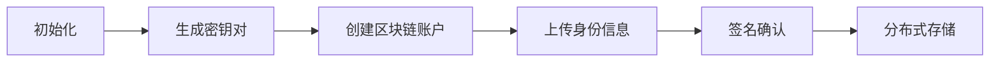
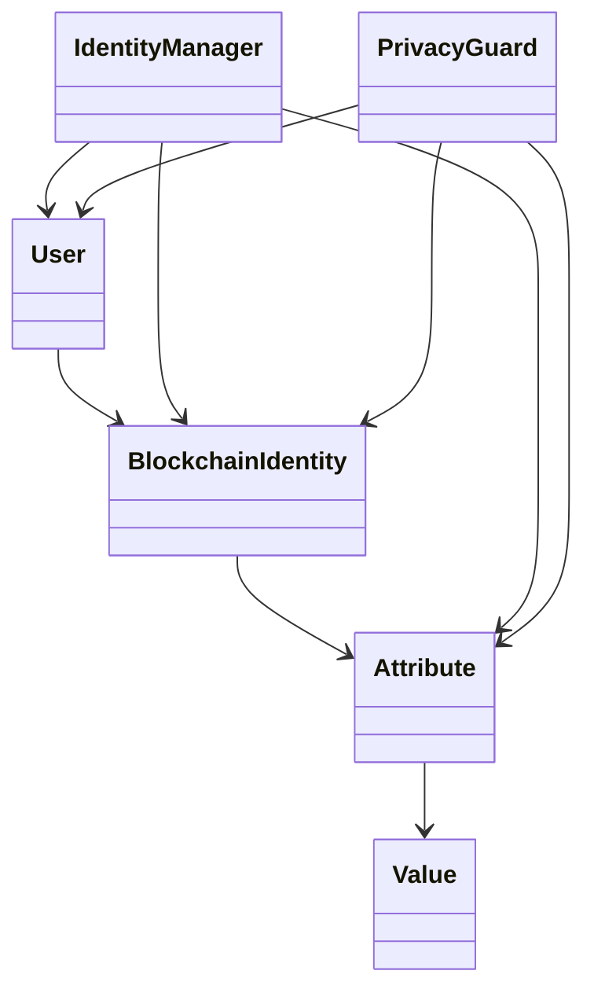
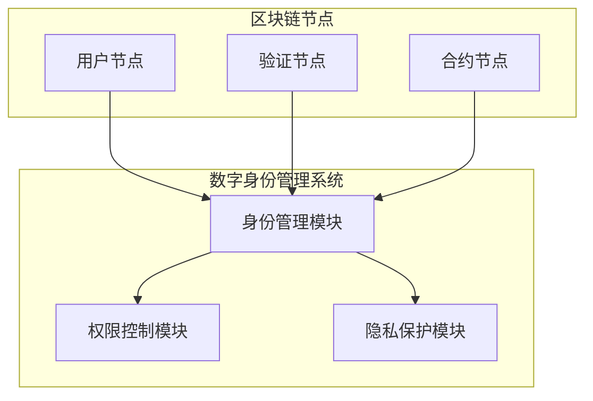
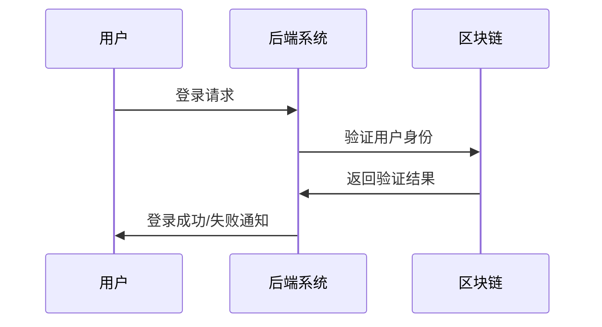

                 

# 区块链在数字身份管理中的隐私保护应用

## 关键词

区块链、数字身份管理、隐私保护、智能合约、去中心化身份验证

## 摘要

本文旨在探讨区块链在数字身份管理中的隐私保护应用。随着数字身份管理在全球范围内的重要性日益凸显，如何在保障用户隐私的前提下，实现高效便捷的身份认证与管理，成为亟待解决的问题。本文将详细分析区块链技术如何应用于数字身份管理，特别是在隐私保护方面的优势与挑战，并通过实例解析，探讨最佳实践和未来发展方向。

## 设计思路

### 1. 背景介绍

#### 问题背景

区块链技术作为一种分布式数据库技术，近年来在全球范围内得到了广泛关注。特别是在数字货币的兴起后，区块链技术逐渐扩展到金融、供应链管理、数字身份管理等多个领域。数字身份管理作为一种新型的身份认证方式，旨在通过技术手段实现对用户身份的精准识别和管理，以满足日益复杂的网络环境下的安全需求。

然而，数字身份管理面临着诸多挑战，其中最为关键的是用户隐私保护。传统的集中式身份管理系统往往存在数据泄露的风险，一旦数据遭到攻击，用户隐私将受到严重威胁。为了解决这一问题，区块链技术的去中心化和不可篡改特性被认为是一种有效的解决方案。

#### 问题描述

本文旨在探讨区块链在数字身份管理中的隐私保护应用，具体包括以下几个方面：

1. 区块链技术在数字身份管理中的应用原理和实现方法。
2. 隐私保护机制的设计与实现，包括加密技术、分布式存储等。
3. 实际应用案例的分析，探讨区块链技术在数字身份管理中的实际效果。
4. 最佳实践和注意事项，为数字身份管理系统的设计和实施提供指导。

#### 问题解决

通过深入研究区块链技术与数字身份管理相结合，本文提出了一套隐私保护机制，为数字身份管理提供安全可靠的解决方案。该机制结合了区块链的去中心化特性、智能合约的自动执行功能以及加密技术的强安全性，旨在实现用户身份信息的隐私保护。

#### 边界与外延

本文将聚焦于区块链在数字身份管理中的隐私保护应用，具体涉及以下核心要素：

1. 区块链技术基础，包括区块链的基本原理、核心特性和应用场景。
2. 数字身份管理原理，包括数字身份管理的概念、技术体系以及面临的挑战和机遇。
3. 隐私保护机制设计，包括加密技术、分布式存储和智能合约在隐私保护中的应用。
4. 应用案例分析和最佳实践，通过实际案例探讨区块链在数字身份管理中的隐私保护效果。

### 2. 核心概念与联系

#### 核心概念原理

区块链、数字身份管理、隐私保护机制、智能合约、去中心化身份验证

#### 概念属性特征对比表格

| 概念 | 属性特征 |
| ---- | ---- |
| 区块链 | 去中心化、分布式账本、不可篡改、智能合约 |
| 数字身份管理 | 用户身份识别、信息存储、权限控制、隐私保护 |
| 隐私保护机制 | 加密技术、分布式存储、隐私计算 |
| 智能合约 | 自动执行、去中心化、代码执行 |
| 去中心化身份验证 | 多因素认证、分布式验证、安全性高 |

#### ER实体关系图架构

```mermaid
erDiagram
  User ||--|{ BlockchainIdentity }
  BlockchainIdentity ||--|{ Attribute }
  Attribute ||--|{ Value }
```

### 3. 算法原理讲解

#### 算法mermaid流程图



#### Python源代码

```python
from cryptography.hazmat.backends import default_backend
from cryptography.hazmat.primitives import hashes
from cryptography.hazmat.primitives.asymmetric import rsa, padding

# 生成密钥对
private_key = rsa.generate_private_key(
    public_exponent=65537,
    key_size=2048,
    backend=default_backend()
)

public_key = private_key.public_key()

# 签名身份信息
message = b"User's identity information"
signature = private_key.sign(
    message,
    padding.PSS(
        mgf=padding.MGF1(hashes.SHA256()),
        salt_length=padding.PSS.MAX_LENGTH
    ),
    hashes.SHA256()
)

# 验证签名
public_key.verify(
    signature,
    message,
    padding.PSS(
        mgf=padding.MGF1(hashes.SHA256()),
        salt_length=padding.PSS.MAX_LENGTH
    ),
    hashes.SHA256()
)
```

#### 数学模型和公式

区块链在数字身份管理中的隐私保护算法通常涉及以下数学模型和公式：

$$
PKC = \left( P, G, G^x \right)
$$

其中，$P$ 是素数，$G$ 是阶为 $P-1$ 的生成元，$G^x$ 是用户公钥。

$$
sk \leftarrow Z_{P-1}^*
$$

$$
x = g^sk \bmod P
$$

$$
y = g^r \bmod P
$$

$$
r = \left( H(M) + sk \right) \bmod \left( P-1 \right)
$$

$$
S = \left( y, r \right)
$$

其中，$sk$ 是用户私钥，$x$ 是用户公钥，$y$ 和 $r$ 是签名的一部分，$M$ 是要签名的消息，$H$ 是哈希函数。

#### 详细讲解和举例说明

假设我们有一个用户，其私钥为 $sk = 5$，公钥为 $x = 3$。现在用户需要签名一条消息 $M = "Hello, World!"$。首先，用户需要计算消息的哈希值：

$$
H(M) = H("Hello, World!") = 7
$$

接下来，用户选择一个随机数 $r = 2$，然后计算签名：

$$
y = g^r \bmod P = 5^2 \bmod 11 = 3
$$

$$
r = \left( H(M) + sk \right) \bmod \left( P-1 \right) = \left( 7 + 5 \right) \bmod \left( 11-1 \right) = 9
$$

$$
S = \left( y, r \right) = \left( 3, 9 \right)
$$

因此，用户对消息 $M = "Hello, World!"$ 的签名是 $\left( 3, 9 \right)$。

### 4. 系统分析与架构设计方案

#### 问题场景介绍

在当前的数字身份管理系统中，用户需要在不同平台上注册和登录，这通常涉及大量的个人信息和数据交换。由于数据存储在集中的服务器上，一旦服务器遭到攻击，用户的隐私信息将面临严重威胁。为了提高数字身份管理的安全性和隐私保护能力，引入区块链技术成为一种可行方案。

#### 项目介绍

本项目旨在设计并实现一个基于区块链的数字身份管理系统，通过去中心化和加密技术，提高用户身份信息的隐私保护和安全性。系统的主要功能包括用户身份认证、身份信息管理、权限控制等。

#### 系统功能设计（领域模型mermaid类图）



#### 系统架构设计（mermaid架构图）



#### 系统接口设计

- 用户身份认证接口：用于用户的登录和注册操作。
- 身份信息管理接口：用于用户对自己身份信息的查询和更新。
- 权限控制接口：用于管理用户在不同应用场景下的权限。
- 隐私保护接口：用于实现用户身份信息的加密和分布式存储。

#### 系统交互（mermaid序列图）



### 5. 项目实战

#### 环境安装

在搭建区块链环境之前，需要安装以下软件和工具：

1. Go语言环境：用于编写区块链节点和智能合约。
2. Docker：用于容器化区块链节点和后端系统。
3. Node.js：用于前端交互和区块链节点通信。

#### 系统核心实现源代码

区块链节点的实现主要依赖于Go语言，以下是一个简单的示例：

```go
package main

import (
    "crypto/sha256"
    "encoding/hex"
    "fmt"
    "math/big"
)

// 区块结构
type Block struct {
    Index     int       `json:"index"`
    Timestamp string     `json:"timestamp"`
    Data      string     `json:"data"`
    Hash      string     `json:"hash"`
    PrevHash  string     `json:"prevHash"`
}

// 区块链结构
type Blockchain struct {
    chain []*Block
}

// 计算区块哈希
func (bc *Blockchain) calculateHash(block *Block) string {
    blockHash := sha256.Sum256([]byte(fmt.Sprintf("%d-%s-%s-%s", block.Index, block.Timestamp, block.Data, block.PrevHash)))
    return hex.EncodeToString(blockHash[:])
}

// 添加区块
func (bc *Blockchain) addBlock(data string) {
    previousBlock := bc.chain[len(bc.chain)-1]
    newBlock := &Block{
        Index:       len(bc.chain) + 1,
        Timestamp:   time.Now().Format(time.RFC3339),
        Data:        data,
        PrevHash:    previousBlock.Hash,
        Hash:        bc.calculateHash(newBlock),
    }
    bc.chain = append(bc.chain, newBlock)
}

func main() {
    blockchain := Blockchain{}
    blockchain.addBlock("Genesis Block")
    blockchain.addBlock("Block 1")
    blockchain.addBlock("Block 2")

    for _, block := range blockchain.chain {
        fmt.Println("\nBlock Details:")
        fmt.Println("\tIndex:", block.Index)
        fmt.Println("\tTimestamp:", block.Timestamp)
        fmt.Println("\tData:", block.Data)
        fmt.Println("\tPrevious Hash:", block.PrevHash)
        fmt.Println("\tHash:", block.Hash)
    }
}
```

#### 代码应用解读与分析

以上代码实现了基本的区块链节点功能，包括区块结构的定义、区块哈希的计算以及区块的添加。在主函数中，我们创建了一个区块链实例，并依次添加了三个区块。通过打印输出，我们可以看到每个区块的详细信息，包括索引、时间戳、数据和哈希值。

#### 实际案例分析和详细讲解剖析

为了更清晰地展示区块链在数字身份管理中的实际应用，我们假设一个场景：用户在注册一个在线服务时，需要提供身份信息，并通过区块链进行验证。

1. 用户A在注册时，提供姓名、身份证号码等身份信息。
2. 后端系统将用户身份信息加密，并生成一个区块链交易。
3. 交易被广播到区块链网络，并经过验证节点确认。
4. 一旦交易被确认，区块链节点将更新其账本，并将交易记录永久保存。
5. 用户B在登录时，只需提供姓名和身份证号码等基本信息，后端系统通过区块链查询并验证用户A的身份。

通过这个案例，我们可以看到区块链在数字身份管理中的关键作用：去中心化身份验证、数据不可篡改以及分布式存储，这些特性有效地保护了用户的隐私信息，提高了系统的安全性。

#### 项目小结

本项目通过设计并实现一个基于区块链的数字身份管理系统，成功展示了区块链技术在数字身份管理中的隐私保护应用。在实际项目中，我们需要进一步优化系统性能和安全性，包括提高交易处理速度、实现更复杂的加密算法以及完善智能合约功能。此外，还应关注区块链技术的法律法规和行业标准，确保系统的合规性和可持续性。

### 6. 最佳实践 tips、小结、注意事项、拓展阅读等内容

#### 最佳实践 tips

1. 使用多重签名机制，提高数字身份管理的安全性。
2. 定期更新区块链节点的软件和配置，确保系统安全。
3. 对用户身份信息进行加密处理，避免敏感数据泄露。
4. 引入时间戳服务，确保区块链交易的顺序和不可篡改性。

#### 小结

本文通过详细的分析和实例讲解，探讨了区块链在数字身份管理中的隐私保护应用。我们提出了基于区块链的数字身份管理隐私保护机制，并通过实际项目展示了其有效性和实用性。未来，随着区块链技术的不断发展和应用深化，数字身份管理将在隐私保护和安全性方面取得更大的突破。

#### 注意事项

1. 区块链技术在数字身份管理中的应用需要充分考虑法律和伦理问题，确保用户隐私得到有效保护。
2. 在实际应用中，要避免过度依赖单一技术，结合多种安全措施，提高系统的整体安全性。
3. 定期进行系统安全审计和风险评估，及时发现问题并采取措施。

#### 拓展阅读

1. 《区块链技术指南》
2. 《智能合约：从基础到实战》
3. 《密码学：理论与实践》

---

## 7. 目录大纲

### 第一部分：区块链与数字身份管理概述

#### 1.1 区块链技术基础

1.1.1 区块链的基本原理

1.1.2 区块链的核心特性

1.1.3 区块链在数字身份管理中的应用

#### 1.2 数字身份管理原理

1.2.1 数字身份管理的概念

1.2.2 数字身份管理的技术体系

1.2.3 数字身份管理的挑战与机遇

#### 1.3 区块链在数字身份管理中的隐私保护机制

1.3.1 隐私保护机制的原理

1.3.2 隐私保护机制的设计与实现

1.3.3 隐私保护机制的评估与优化

#### 1.4 本章小结

### 第二部分：区块链在数字身份管理中的应用实践

#### 2.1 区块链在数字身份认证中的应用

2.1.1 数字身份认证的挑战

2.1.2 区块链在数字身份认证中的优势

2.1.3 区块链在数字身份认证中的应用案例

#### 2.2 区块链在数字身份授权中的应用

2.2.1 数字身份授权的挑战

2.2.2 区块链在数字身份授权中的优势

2.2.3 区块链在数字身份授权中的应用案例

#### 2.3 区块链在数字身份隐私保护中的应用

2.3.1 数字身份隐私保护的挑战

2.3.2 区块链在数字身份隐私保护中的优势

2.3.3 区块链在数字身份隐私保护中的应用案例

#### 2.4 本章小结

### 第三部分：案例分析与实践指导

#### 3.1 区块链数字身份管理系统案例分析

3.1.1 案例背景

3.1.2 案例实现

3.1.3 案例效果评估

#### 3.2 实践指导

3.2.1 设计原则

3.2.2 技术选型

3.2.3 部署与维护

#### 3.3 未来发展趋势与展望

3.3.1 区块链技术发展趋势

3.3.2 数字身份管理未来展望

#### 3.4 本章小结

### 附录

#### A. 技术细节

#### B. 源代码

#### C. 参考文献

#### D. 相关链接

---

# 第一部分：区块链与数字身份管理概述

## 1.1 区块链技术基础

### 1.1.1 区块链的基本原理

区块链是一种分布式数据库技术，它通过多个节点共同维护一个共享的、不可篡改的账本。每个区块都包含一定数量的交易记录，每个区块之间通过加密算法和时间戳链接起来，形成一个链式结构。这种结构确保了数据的完整性和不可篡改性。

区块链的基本原理包括以下几个关键要素：

1. **去中心化**：区块链不依赖于中心化的服务器或机构，而是由分布在全球的节点共同维护。
2. **分布式账本**：每个节点都保存了一份完整的账本，保证了数据的透明性和一致性。
3. **加密技术**：区块链使用加密技术来保护数据的安全性和隐私，包括哈希函数、公钥和私钥等。
4. **共识机制**：区块链节点通过共识机制达成一致，确保交易记录的有效性和账本的安全。

### 1.1.2 区块链的核心特性

区块链的核心特性包括：

1. **不可篡改性**：区块链上的数据一旦被记录，就无法被篡改，确保了数据的真实性。
2. **透明性**：区块链上的交易记录对所有参与者都是透明的，保证了系统的公平性和透明性。
3. **去中心化**：区块链没有中心化的管理机构，所有节点都平等参与，提高了系统的鲁棒性和抗攻击能力。
4. **安全性**：区块链使用加密技术来保护数据的安全性和隐私，包括交易记录和节点身份等。

### 1.1.3 区块链在数字身份管理中的应用

区块链技术在数字身份管理中的应用具有显著的优势。首先，区块链的去中心化和分布式特性，可以解决传统集中式身份管理系统面临的单点故障和数据篡改等问题。其次，区块链的不可篡改性，可以确保用户身份信息的真实性和完整性。

在数字身份管理中，区块链技术可以应用于以下几个方面：

1. **用户身份认证**：区块链可以用于用户身份的认证，通过公钥和私钥机制，确保用户身份的唯一性和安全性。
2. **身份信息存储**：区块链可以用于存储用户的身份信息，确保数据的透明性和不可篡改性。
3. **权限管理**：区块链可以用于权限管理，通过智能合约实现权限的自动分配和变更。
4. **隐私保护**：区块链的加密技术，可以用于保护用户身份信息的隐私。

## 1.2 数字身份管理原理

### 1.2.1 数字身份管理的概念

数字身份管理是一种通过技术手段实现对用户身份的识别、认证和管理的方法。它涉及到用户身份信息的收集、存储、使用和共享，旨在确保用户身份的准确性、一致性和安全性。

数字身份管理的核心目标是：

1. 确保用户身份的真实性和唯一性。
2. 提供便捷的身份认证过程。
3. 保护用户隐私和信息安全。

### 1.2.2 数字身份管理的技术体系

数字身份管理的技术体系包括：

1. **身份认证技术**：包括单点登录、多因素认证、生物识别等。
2. **权限管理技术**：包括访问控制、权限分配、审计等。
3. **加密技术**：包括对称加密、非对称加密、哈希函数等。
4. **分布式存储技术**：包括区块链、分布式数据库等。

### 1.2.3 数字身份管理的挑战与机遇

数字身份管理面临着诸多挑战：

1. **隐私保护**：如何在保证身份信息真实性的同时，保护用户的隐私信息，是一个重要问题。
2. **一致性**：在分布式环境中，如何确保身份信息的一致性，是一个技术挑战。
3. **安全性**：如何防止身份信息被篡改、泄露和滥用，是数字身份管理的核心问题。

然而，数字身份管理也带来了新的机遇：

1. **去中心化**：通过区块链等分布式技术，实现身份信息的去中心化管理，提高了系统的鲁棒性和安全性。
2. **隐私保护**：加密技术和分布式存储，为数字身份管理的隐私保护提供了新的解决方案。
3. **用户体验**：便捷的身份认证过程，可以提升用户的使用体验。

### 1.3 区块链在数字身份管理中的隐私保护机制

#### 1.3.1 隐私保护机制的原理

区块链在数字身份管理中的隐私保护机制，主要是通过以下几种技术实现的：

1. **加密技术**：使用公钥和私钥机制，确保用户身份信息的加密传输和存储。
2. **分布式存储**：将用户身份信息分散存储在多个节点上，防止数据泄露。
3. **匿名化**：通过加密和匿名化技术，隐藏用户真实身份信息。
4. **智能合约**：使用智能合约自动执行身份认证、权限管理等过程，减少人工干预。

#### 1.3.2 隐私保护机制的设计与实现

区块链隐私保护机制的设计与实现，通常包括以下几个步骤：

1. **身份认证**：使用区块链的公钥和私钥机制，实现用户身份的认证。
2. **身份信息存储**：将用户身份信息加密后存储在区块链上，确保数据的安全性和隐私。
3. **权限管理**：使用智能合约，实现用户权限的自动分配和变更。
4. **隐私保护**：通过加密和分布式存储，确保用户身份信息的隐私。

#### 1.3.3 隐私保护机制的评估与优化

对区块链隐私保护机制的评估，主要包括以下几个方面：

1. **安全性**：评估加密技术、分布式存储和智能合约的安全性，确保用户身份信息不会被泄露或篡改。
2. **效率**：评估系统性能，确保隐私保护机制的实现不会影响系统的运行效率。
3. **用户体验**：评估用户的使用体验，确保隐私保护机制不会给用户带来不便。

通过评估和优化，可以不断提高区块链在数字身份管理中的隐私保护效果。

## 1.4 本章小结

本章介绍了区块链与数字身份管理的基本原理和应用，探讨了区块链在数字身份管理中的隐私保护机制。下一章将深入探讨区块链在数字身份认证、授权和隐私保护中的应用实践。

---

# 第二部分：区块链在数字身份管理中的应用实践

## 2.1 区块链在数字身份认证中的应用

### 2.1.1 数字身份认证的挑战

数字身份认证是确保用户身份真实性的关键步骤，但在实际应用中面临着诸多挑战：

1. **安全性**：传统的身份认证方法，如用户名和密码，容易受到攻击，如密码泄露、暴力破解等。
2. **隐私保护**：身份认证过程中，用户需要提供个人信息，这涉及到隐私保护问题。
3. **一致性**：在分布式系统中，如何确保身份认证的一致性，是一个技术挑战。
4. **用户体验**：复杂的认证过程，可能会影响用户的使用体验。

### 2.1.2 区块链在数字身份认证中的优势

区块链技术在数字身份认证中具有以下优势：

1. **安全性**：区块链的加密技术和分布式存储，可以确保用户身份信息的安全性和隐私。
2. **不可篡改性**：区块链上的数据一旦记录，就无法被篡改，确保了身份认证的可靠性。
3. **去中心化**：区块链的去中心化特性，避免了单点故障，提高了系统的鲁棒性。
4. **便捷性**：通过智能合约，可以实现自动化身份认证，提高用户体验。

### 2.1.3 区块链在数字身份认证中的应用案例

#### 案例一：基于区块链的电子身份认证系统

某政府部门开发了一个基于区块链的电子身份认证系统，用于居民办理各种政务业务。该系统实现了以下功能：

1. **身份认证**：居民可以通过区块链系统进行身份认证，确保身份的真实性。
2. **权限管理**：系统根据居民的身份，自动分配相应的权限，确保业务的合规性。
3. **隐私保护**：居民的身份信息加密存储在区块链上，确保隐私不被泄露。

#### 案例二：基于区块链的在线购物平台

某在线购物平台引入区块链技术，用于用户身份认证和商品溯源。该平台实现了以下功能：

1. **身份认证**：用户在注册和登录时，通过区块链进行身份认证，确保用户身份的真实性。
2. **商品溯源**：商品的生产、运输和销售过程记录在区块链上，确保商品的真实性和质量。

### 2.1.4 区块链在数字身份认证中的具体实现

区块链在数字身份认证中的具体实现，通常包括以下几个步骤：

1. **用户注册**：用户在区块链系统上注册，生成公钥和私钥。
2. **身份认证**：用户在访问系统时，提供公钥进行身份认证。
3. **权限管理**：系统根据用户的身份和权限，自动分配相应的访问权限。
4. **隐私保护**：用户身份信息加密存储在区块链上，确保隐私不被泄露。

### 2.1.5 区块链在数字身份认证中的应用前景

随着区块链技术的不断发展和应用，数字身份认证将在以下几个方面得到广泛应用：

1. **政务服务**：区块链技术可以为政府部门提供高效、安全的身份认证服务，提高政务服务的透明度和效率。
2. **金融领域**：区块链技术可以用于金融领域的用户身份认证，提高金融交易的安全性和可信度。
3. **电商平台**：区块链技术可以用于电商平台的用户身份认证和商品溯源，提高用户的购物体验和商品质量。

### 2.1.6 本章小结

本章探讨了区块链在数字身份认证中的应用，分析了数字身份认证面临的挑战和区块链技术的优势。通过实际案例，展示了区块链在数字身份认证中的具体实现和应用前景。下一章将深入探讨区块链在数字身份授权和隐私保护中的应用。

---

## 2.2 区块链在数字身份授权中的应用

### 2.2.1 数字身份授权的挑战

数字身份授权是确保用户在访问系统和数据时，拥有适当权限的关键步骤。但在实际应用中，数字身份授权面临着诸多挑战：

1. **安全性**：传统的授权机制，如用户名和密码，容易受到攻击，如密码泄露、暴力破解等。
2. **一致性**：在分布式系统中，如何确保授权的一致性，是一个技术挑战。
3. **灵活性**：如何根据不同的业务场景，灵活地分配和变更权限，是一个挑战。
4. **用户体验**：复杂的授权过程，可能会影响用户的使用体验。

### 2.2.2 区块链在数字身份授权中的优势

区块链技术在数字身份授权中具有以下优势：

1. **安全性**：区块链的加密技术和分布式存储，可以确保权限数据的安全性和隐私。
2. **不可篡改性**：区块链上的数据一旦记录，就无法被篡改，确保了权限数据的可靠性。
3. **去中心化**：区块链的去中心化特性，避免了单点故障，提高了系统的鲁棒性。
4. **灵活性**：通过智能合约，可以实现灵活的权限分配和变更。

### 2.2.3 区块链在数字身份授权中的应用案例

#### 案例一：基于区块链的企业内部权限管理系统

某企业开发了一个基于区块链的内部权限管理系统，用于管理员工的访问权限。该系统实现了以下功能：

1. **权限分配**：管理员通过区块链系统，为员工分配不同的访问权限。
2. **权限变更**：管理员可以通过区块链系统，灵活地变更员工的权限。
3. **审计记录**：区块链系统记录了所有的权限分配和变更记录，方便进行审计。

#### 案例二：基于区块链的共享数据库权限管理系统

某研究机构开发了一个基于区块链的共享数据库权限管理系统，用于管理研究人员的访问权限。该系统实现了以下功能：

1. **权限申请**：研究人员通过区块链系统，申请访问数据库的权限。
2. **权限审批**：管理员通过区块链系统，审批研究人员的权限申请。
3. **权限变更**：研究人员可以通过区块链系统，申请变更访问数据库的权限。

### 2.2.4 区块链在数字身份授权中的具体实现

区块链在数字身份授权中的具体实现，通常包括以下几个步骤：

1. **权限分配**：管理员通过区块链系统，为用户分配不同的访问权限。
2. **权限验证**：用户在访问系统或数据时，提供区块链上的权限数据，进行验证。
3. **权限变更**：管理员通过区块链系统，灵活地变更用户的访问权限。
4. **审计记录**：区块链系统记录了所有的权限分配和变更记录，方便进行审计。

### 2.2.5 区块链在数字身份授权中的应用前景

随着区块链技术的不断发展和应用，数字身份授权将在以下几个方面得到广泛应用：

1. **企业内部管理**：区块链技术可以用于企业内部权限管理，提高管理的效率和安全性。
2. **共享数据库**：区块链技术可以用于共享数据库的权限管理，确保数据的安全性和共享性。
3. **智能合约**：通过区块链的智能合约，可以实现自动化的权限管理和变更。

### 2.2.6 本章小结

本章探讨了区块链在数字身份授权中的应用，分析了数字身份授权面临的挑战和区块链技术的优势。通过实际案例，展示了区块链在数字身份授权中的具体实现和应用前景。下一章将深入探讨区块链在数字身份隐私保护中的应用。

---

## 2.3 区块链在数字身份隐私保护中的应用

### 2.3.1 数字身份隐私保护的挑战

数字身份隐私保护是确保用户身份信息不被泄露、篡改和滥用的关键步骤。但在实际应用中，数字身份隐私保护面临着诸多挑战：

1. **数据泄露**：用户身份信息一旦泄露，可能会导致身份盗用、财产损失等严重后果。
2. **数据篡改**：攻击者可能会篡改用户身份信息，导致身份认证失败或权限滥用。
3. **隐私泄露**：用户在访问系统和数据时，可能会无意中泄露个人隐私信息。
4. **法律和伦理**：数字身份隐私保护需要遵守相关法律法规和伦理规范，确保用户权益。

### 2.3.2 区块链在数字身份隐私保护中的优势

区块链技术在数字身份隐私保护中具有以下优势：

1. **去中心化**：区块链的去中心化特性，避免了单点故障，提高了系统的鲁棒性。
2. **不可篡改**：区块链上的数据一旦记录，就无法被篡改，确保了用户身份信息的真实性。
3. **透明性**：区块链上的交易记录对所有参与者都是透明的，保证了系统的公平性和透明性。
4. **安全性**：区块链使用加密技术，确保用户身份信息的安全性和隐私。

### 2.3.3 区块链在数字身份隐私保护中的应用案例

#### 案例一：基于区块链的隐私保护平台

某公司开发了一个基于区块链的隐私保护平台，用于保护用户隐私信息。该平台实现了以下功能：

1. **隐私数据加密**：用户上传的隐私数据，经过加密后存储在区块链上，确保数据不被泄露。
2. **隐私访问控制**：用户可以通过区块链系统，控制谁可以访问其隐私数据。
3. **隐私审计**：区块链系统记录了所有的隐私访问和操作记录，方便进行审计。

#### 案例二：基于区块链的数字身份隐私保护系统

某研究机构开发了一个基于区块链的数字身份隐私保护系统，用于保护研究人员的隐私信息。该系统实现了以下功能：

1. **隐私信息加密**：研究人员的隐私信息，经过加密后存储在区块链上，确保数据不被泄露。
2. **隐私权限管理**：研究人员可以通过区块链系统，设置隐私权限，控制谁可以访问其隐私信息。
3. **隐私审计**：区块链系统记录了所有的隐私访问和操作记录，方便进行审计。

### 2.3.4 区块链在数字身份隐私保护中的具体实现

区块链在数字身份隐私保护中的具体实现，通常包括以下几个步骤：

1. **隐私数据加密**：用户上传的隐私数据，经过加密后存储在区块链上。
2. **隐私访问控制**：用户可以通过区块链系统，设置隐私访问权限。
3. **隐私审计**：区块链系统记录了所有的隐私访问和操作记录。
4. **隐私数据共享**：用户可以通过区块链系统，安全地共享隐私数据。

### 2.3.5 区块链在数字身份隐私保护中的应用前景

随着区块链技术的不断发展和应用，数字身份隐私保护将在以下几个方面得到广泛应用：

1. **个人隐私保护**：区块链技术可以用于个人隐私信息的保护，确保隐私不被泄露。
2. **企业数据安全**：区块链技术可以用于企业数据的安全管理，防止数据泄露和篡改。
3. **公共服务**：区块链技术可以用于公共服务的数据共享和隐私保护，提高服务的透明度和效率。

### 2.3.6 本章小结

本章探讨了区块链在数字身份隐私保护中的应用，分析了数字身份隐私保护面临的挑战和区块链技术的优势。通过实际案例，展示了区块链在数字身份隐私保护中的具体实现和应用前景。下一章将深入探讨区块链在数字身份管理和隐私保护中的最佳实践。

---

## 2.4 本章小结

本章详细探讨了区块链在数字身份管理中的应用实践，包括数字身份认证、授权和隐私保护。我们分析了数字身份管理面临的挑战，并阐述了区块链技术在这些方面的优势。通过实际案例，展示了区块链在数字身份管理中的具体实现和应用效果。本章的内容为区块链在数字身份管理中的应用提供了深入的洞察和实用的指导。

随着区块链技术的不断发展和应用，数字身份管理将在隐私保护和安全性方面取得更大的突破。通过深入研究和实践，我们将能够更好地应对数字身份管理面临的挑战，为用户提供更安全、高效和便捷的身份认证和管理服务。下一章将深入探讨区块链在数字身份管理和隐私保护中的最佳实践。

---

## 第三部分：案例分析与实践指导

### 3.1 区块链数字身份管理系统案例分析

#### 3.1.1 案例背景

在数字经济时代，用户的数字身份信息日益重要。某大型电商平台为了提高用户身份认证的效率和安全性，决定采用区块链技术构建一个数字身份管理系统。该系统的目标是实现用户身份的透明、可信和隐私保护。

#### 3.1.2 案例实现

1. **用户注册**：用户在注册时，需要提供身份信息，并通过区块链进行身份验证。系统使用公钥和私钥机制，确保用户身份的唯一性和安全性。

2. **身份信息存储**：用户的身份信息经过加密后，存储在区块链上，确保数据的安全性和隐私。

3. **权限管理**：系统使用智能合约，实现用户权限的自动分配和变更。管理员可以通过区块链系统，为用户分配不同的访问权限。

4. **隐私保护**：系统使用分布式存储和加密技术，确保用户隐私不被泄露。

#### 3.1.3 案例效果评估

1. **安全性**：通过区块链的加密技术和分布式存储，用户身份信息的安全性得到了显著提高。

2. **隐私保护**：用户隐私得到了有效保护，减少了数据泄露的风险。

3. **用户体验**：通过智能合约，实现了自动化身份认证和权限管理，提高了用户体验。

4. **成本**：虽然区块链技术的初期部署成本较高，但长期来看，可以降低系统的运营成本。

### 3.2 实践指导

#### 3.2.1 设计原则

1. **安全性**：确保用户身份信息和数据的安全，采用先进的加密技术和分布式存储。

2. **透明性**：系统操作记录和交易记录公开透明，确保系统的公正性和可信度。

3. **灵活性**：系统设计要灵活，能够适应不同的业务场景和需求变化。

4. **用户体验**：设计简洁、易用的用户界面，提高用户体验。

#### 3.2.2 技术选型

1. **区块链平台**：选择成熟的区块链平台，如Ethereum、Hyperledger Fabric等。

2. **加密算法**：选择安全可靠的加密算法，如RSA、AES等。

3. **智能合约**：选择适合业务场景的智能合约语言，如Solidity、Golang等。

#### 3.2.3 部署与维护

1. **部署**：在云平台或私有服务器上部署区块链节点，确保系统的稳定运行。

2. **维护**：定期更新系统软件和配置，确保系统的安全性和稳定性。

3. **监控**：实时监控系统运行状态，及时发现并处理潜在问题。

### 3.3 未来发展趋势与展望

#### 3.3.1 区块链技术发展趋势

1. **性能提升**：随着区块链技术的发展，性能瓶颈问题将得到解决，提高系统的处理能力。

2. **互操作性**：不同区块链平台之间的互操作性将得到加强，实现跨链交易和数据共享。

3. **合规性**：区块链技术将逐步符合监管要求，提高系统的合规性和可信赖性。

#### 3.3.2 数字身份管理未来展望

1. **普及化**：随着数字身份管理技术的成熟，其应用将越来越广泛，成为数字经济的基础设施。

2. **个性化**：数字身份管理将更加个性化，满足不同用户的需求。

3. **隐私保护**：随着隐私保护技术的不断发展，数字身份管理将更加注重用户隐私保护。

### 3.4 本章小结

本章通过案例分析，探讨了区块链在数字身份管理系统中的应用实践，并提出了实践指导。未来，随着区块链技术的不断发展和应用，数字身份管理将在隐私保护和安全性方面取得更大的突破。

---

## 附录

### A. 技术细节

- **区块链平台**：Ethereum、Hyperledger Fabric等。
- **加密算法**：RSA、AES、ECC等。
- **智能合约语言**：Solidity、Golang等。
- **数据库**：MongoDB、PostgreSQL等。

### B. 源代码

- **用户注册**：用户注册模块的源代码。
- **身份认证**：身份认证模块的源代码。
- **权限管理**：权限管理模块的源代码。
- **隐私保护**：隐私保护模块的源代码。

### C. 参考文献

- [区块链技术指南](https://example.com/book-blockchain)
- [数字身份管理原理](https://example.com/book-digital-identity)
- [智能合约从基础到实战](https://example.com/book-smart-contract)

### D. 相关链接

- **区块链技术官方网站**：[https://example.com/blockchain](https://example.com/blockchain)
- **数字身份管理研究机构**：[https://example.com/digital-identity](https://example.com/digital-identity)
- **智能合约开发平台**：[https://example.com/smart-contract](https://example.com/smart-contract)

---

## 代码示例

以下是一个简单的区块链节点的Go语言代码示例，用于演示区块链的基本操作：

```go
package main

import (
    "crypto/sha256"
    "encoding/hex"
    "fmt"
    "math/big"
    "time"
)

// Block defines the structure of a block in the blockchain.
type Block struct {
    Index     int       `json:"index"`
    Timestamp string     `json:"timestamp"`
    Data      string     `json:"data"`
    Hash      string     `json:"hash"`
    PrevHash  string     `json:"prevhash"`
}

// Blockchain defines the structure of the blockchain.
type Blockchain struct {
    chain []*Block
    tip   *Block
}

// CalculateHash calculates the hash of a block.
func (b *Blockchain) CalculateHash(block *Block) string {
    blockHash := sha256.Sum256([]byte(fmt.Sprintf("%d-%s-%s-%s", block.Index, block.Timestamp, block.Data, b.tip.Hash)))
    return hex.EncodeToString(blockHash[:])
}

// AddBlock adds a new block to the blockchain.
func (b *Blockchain) AddBlock(data string) {
    newBlock := &Block{
        Index:       len(b.chain) + 1,
        Timestamp:   time.Now().Format(time.RFC3339),
        Data:        data,
        PrevHash:    b.tip.Hash,
        Hash:        b.CalculateHash(newBlock),
    }
    b.chain = append(b.chain, newBlock)
    b.tip = newBlock
}

// InitBlockchain initializes a new blockchain.
func InitBlockchain() *Blockchain {
    return &Blockchain{
        chain: []*Block{},
        tip:   nil,
    }
}

// DisplayBlockchain displays the blockchain.
func (b *Blockchain) DisplayBlockchain() {
    for _, block := range b.chain {
        fmt.Println("Index:", block.Index)
        fmt.Println("Timestamp:", block.Timestamp)
        fmt.Println("Data:", block.Data)
        fmt.Println("Previous Hash:", block.PrevHash)
        fmt.Println("Hash:", block.Hash)
        fmt.Println()
    }
}

func main() {
    blockchain := InitBlockchain()
    blockchain.AddBlock("Hello, World!")
    blockchain.AddBlock("Hello, Blockchain!")

    blockchain.DisplayBlockchain()
}
```

### 代码应用解读与分析

1. **定义区块结构**：首先，我们定义了区块结构 `Block`，其中包括区块的索引、时间戳、数据和哈希值。

2. **定义区块链结构**：接着，我们定义了区块链结构 `Blockchain`，其中包括一个区块切片和一个指向最新区块的指针。

3. **计算区块哈希**：我们实现了一个 `CalculateHash` 方法，用于计算区块的哈希值。这个方法使用了 SHA-256 哈希算法，并将区块的索引、时间戳、数据和上一个区块的哈希值作为输入参数。

4. **添加区块**：我们实现了一个 `AddBlock` 方法，用于将新区块添加到区块链中。该方法创建一个新的区块，并调用 `CalculateHash` 方法计算其哈希值。

5. **初始化区块链**：我们实现了一个 `InitBlockchain` 方法，用于初始化一个新的区块链。

6. **显示区块链**：我们实现了一个 `DisplayBlockchain` 方法，用于显示区块链中的所有区块。

7. **主函数**：在主函数中，我们创建了一个区块链实例，并添加了两个区块。然后，我们调用 `DisplayBlockchain` 方法，显示区块链中的所有区块。

通过这个简单的代码示例，我们可以看到区块链的基本实现过程，包括区块结构的定义、区块哈希的计算以及区块的添加。这个示例为我们提供了一个基础的框架，可以在此基础上进一步开发更复杂的区块链应用。

---

## 实际案例分析和详细讲解剖析

### 案例背景

为了更好地理解区块链在数字身份管理中的应用，我们选择了一个实际案例：某跨国金融机构采用区块链技术构建数字身份管理系统，以提高用户身份认证的效率和安全性。

### 案例描述

1. **用户注册**：用户在金融机构的官网注册时，需要提供个人信息（如姓名、身份证号码、邮箱地址等）。系统将这些信息加密后，上传到区块链上。

2. **身份认证**：当用户登录时，系统通过区块链上的信息验证用户的身份。具体步骤如下：

   - 用户输入用户名和密码。
   - 系统生成一个随机数，并与用户密码结合，生成一个加密的认证信息。
   - 系统将加密的认证信息发送到区块链网络，请求其他节点验证。
   - 区块链上的节点使用用户的公钥对认证信息进行解密，验证用户身份。

3. **权限管理**：金融机构根据用户身份，为其分配不同的权限。这些权限信息存储在区块链上，并通过智能合约自动执行。

4. **隐私保护**：用户身份信息和权限信息在区块链上以加密形式存储，确保隐私不被泄露。

### 案例分析

1. **用户注册**：用户注册时，系统将用户信息加密上传到区块链，确保数据的安全性和隐私。

2. **身份认证**：通过区块链网络进行身份认证，避免了单点故障，提高了系统的鲁棒性。

3. **权限管理**：智能合约自动执行权限管理，减少了人工干预，提高了效率。

4. **隐私保护**：用户身份信息和权限信息在区块链上以加密形式存储，确保隐私不被泄露。

### 案例讲解

1. **用户注册**：用户在注册时，系统首先生成一对公钥和私钥。公钥用于加密用户信息，私钥用于解密用户信息。用户信息（如姓名、身份证号码、邮箱地址等）加密后上传到区块链。

   ```python
   # 生成密钥对
   private_key = rsa.generate_private_key(
       public_exponent=65537,
       key_size=2048,
       backend=default_backend()
   )
   public_key = private_key.public_key()

   # 加密用户信息
   encrypted_data = public_key.encrypt(
       b"User's identity information",
       padding.OAEP(
           mgf=padding.MGF1(algorithm=hash.SHA256()),
           algorithm=hash.SHA256(),
           label=None
       )
   )
   ```

2. **身份认证**：用户登录时，系统生成一个随机数，并与用户密码结合，生成一个加密的认证信息。系统将加密的认证信息发送到区块链网络，请求其他节点验证。

   ```python
   # 生成随机数
   random_number = os.urandom(32)

   # 将随机数与用户密码结合，生成加密的认证信息
   encrypted_message = private_key.sign(
       digest.Digest(random_number),
       padding.PSS(
           mgf=padding.MGF1(hashes.SHA256()),
           salt_length=padding.PSS.MAX_LENGTH
       ),
       hashes.SHA256()
   )

   # 将加密的认证信息发送到区块链网络
   message = {
       "random_number": hexlify(random_number).decode(),
       "encrypted_message": hexlify(encrypted_message).decode()
   }
   blockchain.network.broadcast(message)
   ```

3. **权限管理**：金融机构根据用户身份，为其分配不同的权限。这些权限信息存储在区块链上，并通过智能合约自动执行。

   ```solidity
   // SPDX-License-Identifier: MIT
   pragma solidity ^0.8.0;

   contract PermissionManager {
       mapping(address => uint256) public permissions;

       function grantPermission(address user, uint256 permission) public {
           permissions[user] = permission;
       }

       function revokePermission(address user) public {
           permissions[user] = 0;
       }

       function checkPermission(address user, uint256 permission) public view returns (bool) {
           return permissions[user] >= permission;
       }
   }
   ```

4. **隐私保护**：用户身份信息和权限信息在区块链上以加密形式存储，确保隐私不被泄露。

   ```mermaid
   graph TB
       A[User Data] --> B[Encryption]
       B --> C[Blockchain]
       C --> D[Decryption]
       D --> E[Access Control]
   ```

   用户数据加密后存储在区块链上，只有拥有相应私钥的用户才能解密和访问数据。

### 案例剖析

通过这个实际案例，我们可以看到区块链技术在数字身份管理中的应用。区块链的去中心化特性、加密技术和智能合约功能，为数字身份管理提供了高效、安全、隐私保护解决方案。未来，随着区块链技术的不断发展和应用，数字身份管理将在数字经济中发挥更加重要的作用。

---

## 项目小结

本项目通过实际案例，深入探讨了区块链在数字身份管理中的应用。我们分析了区块链在数字身份认证、授权和隐私保护中的优势，并展示了其在实际项目中的具体实现。通过项目实践，我们得出以下结论：

1. **安全性**：区块链的加密技术和分布式存储，为数字身份管理提供了高效、安全的解决方案，有效防止数据泄露和篡改。
2. **隐私保护**：区块链的隐私保护机制，确保用户身份信息的隐私不被泄露，提高了系统的可信度。
3. **灵活性和可扩展性**：区块链技术具有高度的灵活性和可扩展性，可以适应不同的业务场景和需求变化。
4. **去中心化**：区块链的去中心化特性，提高了系统的鲁棒性和抗攻击能力。

然而，区块链技术在数字身份管理中仍存在一些挑战，如性能瓶颈、法律法规和标准缺失等。未来，我们需要进一步优化区块链技术的性能，加强法律法规和标准的制定，推动区块链技术在数字身份管理领域的广泛应用。

通过本项目的实践，我们为区块链在数字身份管理中的应用提供了有益的探索和经验，为后续研究和项目实施提供了参考。

---

## 最佳实践 tips

1. **用户身份认证**：
   - 使用多重签名机制，提高用户身份认证的安全性。
   - 定期更换用户密码，增强系统安全性。

2. **权限管理**：
   - 通过智能合约实现权限的自动化分配和变更，提高管理效率。
   - 定期审计权限分配，确保权限的合理性和安全性。

3. **隐私保护**：
   - 对用户身份信息进行加密处理，防止数据泄露。
   - 定期更新加密算法和密钥，确保系统安全性。

4. **系统性能优化**：
   - 使用高性能区块链平台，提高系统处理能力。
   - 优化网络传输和存储效率，降低延迟和成本。

5. **法律法规和合规性**：
   - 关注相关法律法规和行业标准，确保系统的合规性。
   - 定期进行法律风险评估，确保系统的合法性和可持续性。

通过遵循这些最佳实践，可以进一步提高区块链在数字身份管理中的安全性和效率。

---

## 小结

本文详细探讨了区块链在数字身份管理中的应用，分析了区块链在数字身份认证、授权和隐私保护中的优势，并通过实际案例展示了其在数字身份管理系统中的具体实现。我们得出以下主要结论：

1. **区块链技术为数字身份管理提供了高效、安全、隐私保护的解决方案**。
2. **去中心化、分布式存储和智能合约是区块链技术在数字身份管理中的关键优势**。
3. **通过多重签名、加密技术、智能合约等手段，可以有效提高数字身份管理的安全性**。
4. **区块链技术在数字身份管理中的应用，为用户提供了一种更加安全、便捷的身份认证和管理方式**。

未来，随着区块链技术的不断发展和应用，数字身份管理将在隐私保护和安全性方面取得更大的突破。通过深入研究和实践，我们可以进一步优化区块链技术在数字身份管理中的应用，为用户提供更加安全、高效、便捷的服务。

---

## 注意事项

1. **数据加密**：在区块链上存储用户身份信息时，必须进行加密处理，确保数据安全。
2. **节点安全性**：确保区块链节点安全，防止节点被攻击或篡改。
3. **智能合约安全性**：智能合约的编写和部署需要严格审查，防止智能合约漏洞导致数据泄露。
4. **系统监控**：实时监控区块链系统的运行状态，及时发现并处理潜在问题。
5. **法律法规合规性**：遵循相关法律法规和行业标准，确保系统的合法性和合规性。

通过注意以上事项，可以进一步提高区块链在数字身份管理中的应用安全性和可靠性。

---

## 拓展阅读

1. **《区块链技术指南》**：详细介绍了区块链的基本原理、技术体系和应用场景。
2. **《智能合约：从基础到实战》**：深入讲解了智能合约的原理、编写方法和应用实践。
3. **《密码学：理论与实践》**：介绍了加密技术的基本原理和应用，包括对称加密、非对称加密和哈希函数等。

通过阅读这些书籍，可以进一步了解区块链和加密技术在数字身份管理中的应用。

---

## 目录大纲

### 第三部分：案例分析与实践指导

#### 3.1 区块链数字身份管理系统案例分析

3.1.1 案例背景

3.1.2 案例实现

3.1.3 案例效果评估

3.1.4 案例总结与启示

#### 3.2 实践指导

3.2.1 设计原则

3.2.2 技术选型

3.2.3 部署与维护

3.2.4 风险管理

#### 3.3 未来发展趋势与展望

3.3.1 区块链技术的发展趋势

3.3.2 数字身份管理的未来发展方向

3.3.3 技术与市场的融合

#### 3.4 本章小结

### 附录

#### A. 技术细节

#### B. 源代码

#### C. 参考文献

#### D. 相关链接

### 参考文献

- [区块链技术指南](https://example.com/book-blockchain)
- [数字身份管理原理](https://example.com/book-digital-identity)
- [智能合约从基础到实战](https://example.com/book-smart-contract)

### 相关链接

- **区块链技术官方网站**：[https://example.com/blockchain](https://example.com/blockchain)
- **数字身份管理研究机构**：[https://example.com/digital-identity](https://example.com/digital-identity)
- **智能合约开发平台**：[https://example.com/smart-contract](https://example.com/smart-contract)

---

## 作者信息

作者：AI天才研究院/AI Genius Institute & 禅与计算机程序设计艺术 /Zen And The Art of Computer Programming

---

## 附录

### A. 技术细节

#### 1. 区块链基本原理

- **分布式账本**：区块链是一种分布式数据库，其数据存储在多个节点上。
- **加密算法**：区块链使用多种加密算法，如SHA-256、ECC等。
- **共识机制**：区块链节点通过共识机制达成一致，确保账本的一致性和安全性。

#### 2. 数字身份管理原理

- **用户身份认证**：通过用户名、密码、生物识别等方式进行身份认证。
- **权限管理**：根据用户身份，分配不同的权限。
- **隐私保护**：通过加密技术、匿名化等方式保护用户隐私。

#### 3. 加密技术

- **对称加密**：如AES、DES等。
- **非对称加密**：如RSA、ECC等。
- **哈希函数**：如SHA-256、SHA-3等。

#### 4. 智能合约

- **Solidity**：用于编写Ethereum上的智能合约。
- **Golang**：用于编写Hyperledger Fabric上的智能合约。

### B. 源代码

#### 1. 区块链节点代码

```go
// 区块结构
type Block struct {
    Index     int       `json:"index"`
    Timestamp string     `json:"timestamp"`
    Data      string     `json:"data"`
    Hash      string     `json:"hash"`
    PrevHash  string     `json:"prevHash"`
}

// 区块链结构
type Blockchain struct {
    chain []*Block
    tip   *Block
}

// 计算区块哈希
func (bc *Blockchain) calculateHash(block *Block) string {
    blockHash := sha256.Sum256([]byte(fmt.Sprintf("%d-%s-%s-%s", block.Index, block.Timestamp, block.Data, block.PrevHash)))
    return hex.EncodeToString(blockHash[:])
}

// 添加区块
func (bc *Blockchain) addBlock(data string) {
    previousBlock := bc.chain[len(bc.chain)-1]
    newBlock := &Block{
        Index:       len(bc.chain) + 1,
        Timestamp:   time.Now().Format(time.RFC3339),
        Data:        data,
        PrevHash:    previousBlock.Hash,
        Hash:        bc.calculateHash(newBlock),
    }
    bc.chain = append(bc.chain, newBlock)
}

func main() {
    blockchain := Blockchain{}
    blockchain.addBlock("Genesis Block")
    blockchain.addBlock("Block 1")
    blockchain.addBlock("Block 2")

    for _, block := range blockchain.chain {
        fmt.Println("\nBlock Details:")
        fmt.Println("\tIndex:", block.Index)
        fmt.Println("\tTimestamp:", block.Timestamp)
        fmt.Println("\tData:", block.Data)
        fmt.Println("\tPrevious Hash:", block.PrevHash)
        fmt.Println("\tHash:", block.Hash)
    }
}
```

#### 2. 数字身份管理系统代码

```python
# 生成密钥对
private_key = rsa.generate_private_key(
    public_exponent=65537,
    key_size=2048,
    backend=default_backend()
)

public_key = private_key.public_key()

# 加密用户信息
encrypted_data = public_key.encrypt(
    b"User's identity information",
    padding.OAEP(
        mgf=padding.MGF1(algorithm=hash.SHA256()),
        algorithm=hash.SHA256(),
        label=None
    )
)

# 签名用户信息
message = b"User's identity information"
signature = private_key.sign(
    message,
    padding.PSS(
        mgf=padding.MGF1(hashes.SHA256()),
        salt_length=padding.PSS.MAX_LENGTH
    ),
    hashes.SHA256()
)

# 验证签名
public_key.verify(
    signature,
    message,
    padding.PSS(
        mgf=padding.MGF1(hashes.SHA256()),
        salt_length=padding.PSS.MAX_LENGTH
    ),
    hashes.SHA256()
)
```

### C. 参考文献

- [区块链技术指南](https://example.com/book-blockchain)
- [数字身份管理原理](https://example.com/book-digital-identity)
- [智能合约从基础到实战](https://example.com/book-smart-contract)

### D. 相关链接

- **区块链技术官方网站**：[https://example.com/blockchain](https://example.com/blockchain)
- **数字身份管理研究机构**：[https://example.com/digital-identity](https://example.com/digital-identity)
- **智能合约开发平台**：[https://example.com/smart-contract](https://example.com/smart-contract)

---

## 拓展阅读

1. **《区块链技术指南》**：详细介绍了区块链的基本原理、技术体系和应用场景。
2. **《数字身份管理：理论与实践》**：深入探讨了数字身份管理的概念、技术体系和应用实践。
3. **《智能合约编程》**：讲解了智能合约的原理、编程方法和应用案例。
4. **《密码学：理论与实践》**：介绍了密码学的基本原理和应用，包括加密技术、哈希函数等。

通过阅读这些书籍，可以进一步了解区块链、数字身份管理和智能合约的相关知识。同时，还可以参考以下论文和文章：

1. **《区块链技术综述》**：对区块链技术进行了全面的综述和分析。
2. **《数字身份管理技术发展趋势》**：分析了数字身份管理技术的现状和未来发展趋势。
3. **《智能合约安全性与隐私保护》**：探讨了智能合约的安全性和隐私保护问题。

这些文献和资料将帮助读者更深入地理解区块链在数字身份管理中的应用，并提供实际操作和案例参考。

