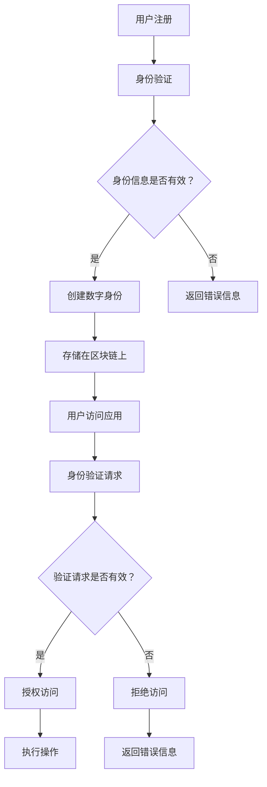
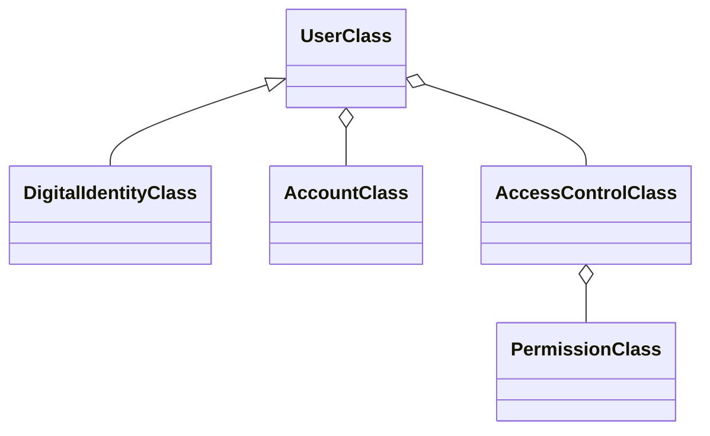
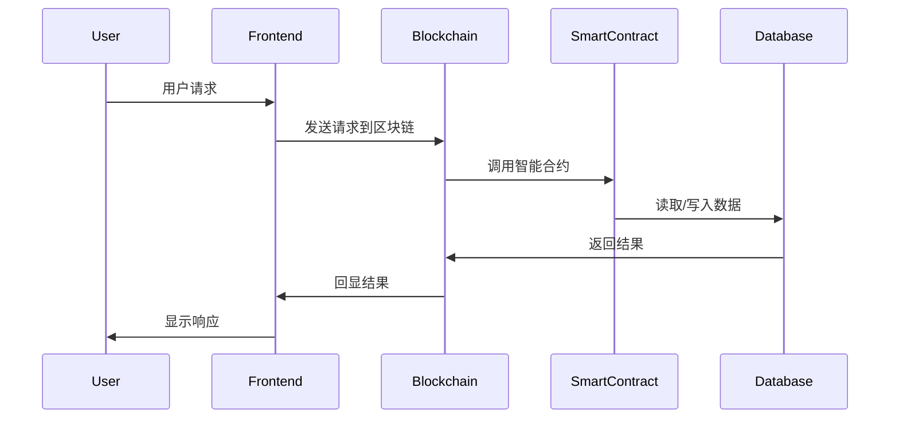
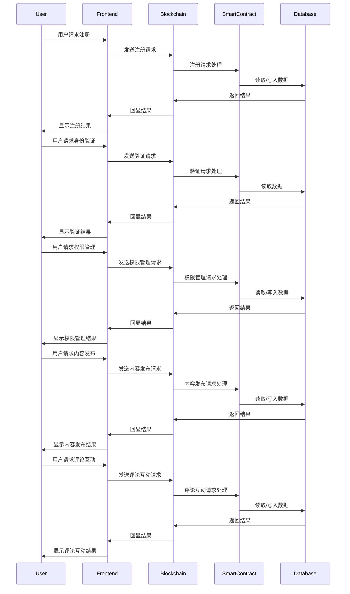

                 


### 文章标题：区块链在数字身份自主管理中的应用

### 关键词：区块链，数字身份，自主管理，智能合约，非同质化代币，算法原理，系统架构设计，项目实战，最佳实践

### 摘要：
本文深入探讨了区块链技术在数字身份自主管理中的应用。首先，我们介绍了区块链与数字身份自主管理的背景，并详细分析了它们的核心概念和联系。接着，我们探讨了区块链在数字身份管理中的算法原理，并使用Python源代码和Mermaid流程图进行了详细阐述。然后，我们介绍了数字身份自主管理的系统分析与架构设计，包括问题场景介绍、项目介绍、领域模型类图、系统架构图、系统接口设计和系统交互序列图。接下来，我们通过一个实际项目实战，详细讲解了环境安装、核心实现源代码、代码应用解读与分析，以及实际案例分析和项目小结。最后，我们提供了最佳实践和拓展阅读，为读者进一步探索区块链在数字身份自主管理中的应用提供了指导。本文旨在为IT专业人士和研究人员提供一个全面、深入的参考。

## 第1章：区块链与数字身份自主管理概述

### 1.1 区块链技术的基础概念

区块链技术是一种去中心化的分布式数据库系统，由一系列按时间顺序排列的“区块”组成。每个区块包含一定数量的交易数据，并通过密码学算法相互链接，形成链式数据结构。区块链的核心理念包括去中心化、透明性、不可篡改性和安全性。

去中心化意味着区块链不依赖于中心化的机构或服务器，而是通过网络中的多个节点共同维护数据。这种分布式架构提高了系统的容错性和抗攻击性。

透明性是指区块链上的所有交易记录都是公开的，任何人都可以查询和验证。这种透明性增加了数据的可信度，并减少了欺诈行为。

不可篡改性是指区块链上的数据一旦记录，就无法被篡改或删除。这是因为区块链采用了一种密码学机制，确保数据的完整性和一致性。

安全性是区块链技术的另一个重要特点。区块链使用密码学算法对交易数据进行加密，并确保交易的真实性和完整性。此外，区块链网络中的节点通过共识算法来达成共识，从而防止双花攻击和其他安全威胁。

### 1.2 数字身份自主管理的背景与问题

数字身份自主管理是指个人或实体在数字世界中自主控制和管理自己的身份信息。随着互联网和数字技术的快速发展，数字身份管理变得越来越重要。然而，当前的数字身份管理面临许多问题和挑战。

首先，当前数字身份管理主要依赖于中心化的身份验证机构，如银行、政府机构或第三方认证服务提供商。这种中心化的身份验证机制存在一些问题，如单点故障、数据泄露、隐私侵犯等。此外，中心化的身份验证机构可能受到恶意攻击，导致大量用户身份信息被窃取。

其次，当前的数字身份管理通常依赖于传统的身份认证方式，如用户名和密码。这种认证方式存在安全漏洞，如密码泄露、密码破解等。此外，传统的身份认证方式无法满足日益复杂的数字身份需求，如多重身份认证、跨平台身份认证等。

最后，数字身份管理的数据隐私保护问题也备受关注。当前，许多数字身份管理平台将用户身份信息存储在中心化的数据库中，这种存储方式可能导致用户隐私泄露。此外，用户身份信息的共享和流通也带来了数据隐私保护的问题。

### 1.3 区块链在数字身份自主管理中的应用前景

区块链技术具有去中心化、透明性、不可篡改性和安全性的特点，这些特点使其在数字身份自主管理中具有巨大的应用前景。

首先，区块链的去中心化特性可以解决当前数字身份管理中中心化身份验证机构存在的问题。通过区块链技术，个人或实体可以自主控制和管理自己的身份信息，无需依赖中心化的身份验证机构。

其次，区块链的透明性可以增强数字身份管理的可信度。区块链上的所有交易记录都是公开的，任何人都可以查询和验证。这种透明性有助于确保数字身份信息的真实性和完整性，减少欺诈行为。

再次，区块链的不可篡改性可以确保数字身份信息的持久性和安全性。一旦数字身份信息被记录在区块链上，就无法被篡改或删除。这种不可篡改性有助于保护用户的隐私和安全。

最后，区块链的安全性可以防止数字身份信息被盗用或泄露。区块链采用密码学算法对交易数据进行加密，并确保交易的真实性和完整性。此外，区块链网络中的节点通过共识算法来达成共识，从而防止双花攻击和其他安全威胁。

总之，区块链技术在数字身份自主管理中具有巨大的应用前景。通过区块链技术，可以实现去中心化的数字身份管理，增强数字身份信息的透明性、不可篡改性和安全性，从而解决当前数字身份管理中存在的问题。

### 1.4 本书的目的与结构

本书旨在深入探讨区块链技术在数字身份自主管理中的应用，为读者提供一个全面、系统的参考。本书的主要目的如下：

1. **介绍区块链技术的基础概念和原理**：通过详细阐述区块链的基本架构、工作原理和核心特点，帮助读者建立对区块链技术的初步理解。

2. **分析数字身份自主管理的背景和问题**：探讨当前数字身份管理中存在的问题，如中心化身份验证机构的局限性、传统身份认证方式的安全漏洞和数据隐私保护问题。

3. **探讨区块链在数字身份自主管理中的应用**：分析区块链技术在数字身份自主管理中的优势和可行性，探讨其在解决当前数字身份管理问题中的应用前景。

4. **讲解区块链在数字身份管理中的算法原理**：详细介绍区块链在数字身份管理中的应用算法，包括非同质化代币（NFT）、智能合约等，并通过Python源代码和Mermaid流程图进行阐述。

5. **系统分析与架构设计**：介绍数字身份自主管理的系统分析与架构设计，包括问题场景介绍、项目介绍、领域模型类图、系统架构图、系统接口设计和系统交互序列图。

6. **项目实战**：通过一个实际项目实战，详细讲解区块链在数字身份自主管理中的具体应用，包括环境安装、核心实现源代码、代码应用解读与分析、实际案例分析和项目小结。

7. **最佳实践与拓展**：提供数字身份自主管理的最佳实践和注意事项，讨论未来发展趋势和挑战，为读者进一步探索区块链在数字身份自主管理中的应用提供指导。

本书的结构如下：

- **第1章**：区块链与数字身份自主管理概述
- **第2章**：区块链与数字身份的核心概念
- **第3章**：区块链在数字身份管理中的算法原理
- **第4章**：数字身份自主管理的系统分析与架构设计
- **第5章**：区块链在数字身份自主管理的项目实战
- **第6章**：数字身份自主管理的最佳实践与拓展
- **第7章**：总结与展望

通过以上结构，本书旨在为读者提供一个全面、系统的区块链在数字身份自主管理中的应用指南。

## 第2章：区块链与数字身份的核心概念

### 2.1 区块链的基本原理

区块链技术是一种去中心化的分布式数据库系统，它通过一系列按照时间顺序排列的“区块”组成，每个区块包含一定数量的交易记录，并通过密码学算法相互链接，形成链式数据结构。区块链的核心理念包括去中心化、透明性、不可篡改性和安全性。

**去中心化**：区块链不依赖于中心化的机构或服务器，而是通过网络中的多个节点共同维护数据。这种分布式架构提高了系统的容错性和抗攻击性。在区块链上，每个节点都拥有完整的账本记录，因此不需要依赖中心化的机构来验证交易或管理数据。

**透明性**：区块链上的所有交易记录都是公开的，任何人都可以查询和验证。这种透明性增加了数据的可信度，并减少了欺诈行为。每个区块都包含一个哈希值，用于确保数据的完整性和一致性。通过哈希算法，每个区块都可以被唯一标识，并与其他区块相互链接，形成一条连续的链。

**不可篡改性**：区块链上的数据一旦记录，就无法被篡改或删除。这是因为区块链采用了一种密码学机制，确保数据的完整性和一致性。每个区块都包含前一个区块的哈希值，因此任何对数据的修改都会导致整个链的哈希值发生变化。这种机制使得区块链具有高度的安全性和可靠性。

**安全性**：区块链使用密码学算法对交易数据进行加密，并确保交易的真实性和完整性。此外，区块链网络中的节点通过共识算法来达成共识，从而防止双花攻击和其他安全威胁。共识算法是一种分布式算法，用于确保所有节点对交易记录的一致性。

### 2.2 数字身份的概念与类型

数字身份是指个人或实体在数字世界中的唯一标识，用于识别和验证其在网络中的行为。数字身份的类型可以分为以下几种：

**个人数字身份**：个人数字身份通常与个人的真实身份相对应，如姓名、出生日期、身份证号码等。个人数字身份用于在数字世界中识别和验证个人身份，以确保隐私和安全。

**企业数字身份**：企业数字身份用于识别和验证企业的身份，如企业名称、法人代表、营业执照号码等。企业数字身份在电子商务、供应链管理等领域中具有重要应用。

**虚拟数字身份**：虚拟数字身份通常用于虚拟世界中的角色或用户，如游戏中的角色、虚拟商店的店主等。虚拟数字身份可以独立于真实身份存在，并在虚拟世界中发挥特定功能。

**匿名数字身份**：匿名数字身份是一种不与真实身份关联的数字身份，用于保护个人隐私。匿名数字身份在加密货币交易、匿名通信等领域中具有重要应用。

**多重数字身份**：多重数字身份是指一个人在数字世界中拥有多个独立的数字身份。这种身份管理方式可以提高隐私保护和安全性，但同时也增加了管理和维护的复杂性。

### 2.3 区块链与数字身份的关联性

区块链技术与数字身份管理有着紧密的关联性，区块链技术可以为数字身份管理提供许多优势。

**去中心化的身份验证**：区块链的去中心化特性可以替代传统的中心化身份验证机构，实现更安全、更高效的数字身份验证。通过区块链技术，个人或实体可以自主控制和管理自己的身份信息，无需依赖中心化的身份验证机构。

**透明性和可信度**：区块链上的所有交易记录都是公开的，任何人都可以查询和验证。这种透明性增加了数字身份信息的可信度，有助于确保数字身份信息的真实性和完整性。通过区块链技术，用户可以方便地验证他人的数字身份，减少欺诈行为。

**不可篡改性和持久性**：区块链上的数据一旦记录，就无法被篡改或删除。这种不可篡改性确保了数字身份信息的持久性和安全性。一旦数字身份信息被记录在区块链上，就可以永久保存，并且不会被篡改或删除。

**安全性**：区块链采用密码学算法对交易数据进行加密，并确保交易的真实性和完整性。此外，区块链网络中的节点通过共识算法来达成共识，从而防止双花攻击和其他安全威胁。这种安全性使得区块链在数字身份管理中具有巨大的应用潜力。

**隐私保护**：区块链技术可以提供更高级的隐私保护机制，如零知识证明和同态加密等。这些机制可以确保数字身份信息在区块链上的存储和传输过程中不会被泄露或篡改，从而保护用户的隐私。

综上所述，区块链技术可以为数字身份管理提供去中心化的身份验证、透明性和可信度、不可篡改性和持久性、安全性以及隐私保护等优势，从而解决当前数字身份管理中存在的问题。

### 2.4 概念属性特征对比表格

为了更好地理解区块链与数字身份管理之间的关联性，我们提供了一个概念属性特征对比表格，比较区块链和传统数字身份管理的关键特征。

| 特征         | 区块链                           | 传统数字身份管理                      |
|--------------|----------------------------------|--------------------------------------|
| 去中心化     | 分布式网络，无中心化机构         | 依赖中心化机构，如认证中心或服务提供商 |
| 透明性       | 所有交易记录公开可见             | 部分信息可能不公开，存在隐私泄露风险   |
| 不可篡改性   | 一旦记录，无法篡改               | 数据容易篡改，安全性较低               |
| 安全性       | 加密算法确保交易安全             | 依赖于中心化机构的网络安全措施         |
| 可信度       | 透明性和不可篡改性增强数据可信度   | 依赖中心化机构的信誉                   |
| 隐私保护     | 零知识证明、同态加密等技术提供保护 | 通常依赖中心化机构的隐私保护措施       |
| 持久性       | 数据永久保存，无法删除           | 数据可能被删除或篡改                   |

通过上述对比表格，我们可以清晰地看到区块链与数字身份管理之间的差异和联系。区块链技术提供了一种更安全、更透明的数字身份管理方式，有助于解决传统数字身份管理中的许多问题。

### 2.5 ER实体关系图架构的Mermaid流程图

为了更好地展示区块链与数字身份管理之间的实体关系，我们使用Mermaid流程图绘制了一个ER实体关系图。以下是一个简化的ER实体关系图示例：

```mermaid
erDiagram
    User ||--|{ Blockchain }|| Account
    Blockchain ||--|{ Identity }|| Attribute
    Identity ||--|{ Verification }|| Credential
    User ||--|{ Application }|| Access
```

在这个ER实体关系图中，我们定义了以下实体和关系：

- **User（用户）**：代表在数字世界中拥有数字身份的个人或实体。
- **Blockchain（区块链）**：表示区块链系统，用于存储和管理数字身份信息。
- **Account（账户）**：表示用户在区块链上的账户，用于存储和传输数字资产。
- **Identity（身份）**：表示数字身份，包含用户的基本信息和身份属性。
- **Attribute（属性）**：表示身份的特定属性，如姓名、出生日期等。
- **Verification（验证）**：表示身份验证过程，用于验证用户的身份信息。
- **Credential（凭证）**：表示用于身份验证的数字凭证，如加密证书、数字签名等。
- **Application（应用）**：表示用户使用的数字应用，如社交媒体、在线购物等。

通过ER实体关系图，我们可以清晰地看到区块链与数字身份管理中的各个实体及其关系，这有助于我们进一步理解区块链技术在数字身份管理中的应用。

## 第3章：区块链在数字身份管理中的算法原理

### 3.1 非同质化代币（NFT）与数字身份

非同质化代币（Non-Fungible Tokens，NFT）是一种基于区块链技术的数字资产，它们具有独特的身份和不可替代性。与同质化代币（如比特币或以太币）不同，NFT代表独特的物品或资产，如艺术品、收藏品、虚拟土地等。

NFT在数字身份管理中具有重要作用。首先，NFT可以用于表示和验证个人或实体的数字身份。例如，一个NFT可以代表一个人的身份信息，如姓名、出生日期、身份证明等。这种身份验证机制比传统的身份认证方式（如用户名和密码）更安全、更可靠。

其次，NFT可以用于创建和验证数字身份的属性和特征。例如，一个NFT可以代表一个人的职业、教育背景、技能等。这些属性和特征可以被用于数字身份的认证和授权，从而实现更精细化的身份管理。

最后，NFT可以用于数字身份的转移和管理。例如，一个NFT可以代表一个人的数字身份，并将其转移给另一个用户。这种转移机制可以用于雇佣关系、合作关系等场景，从而实现更灵活的数字身份管理。

### 3.2 区块链智能合约原理与应用

区块链智能合约是一种自动执行合约条款的计算机程序，它运行在区块链上，具有去中心化、透明性和不可篡改性的特点。智能合约的原理基于区块链技术，它利用密码学和分布式共识算法来确保合约的执行和数据的完整性。

**智能合约的基本原理**：

1. **事件和状态**：智能合约包含一系列事件和状态。事件是智能合约中可以触发的操作，状态是智能合约在执行过程中存储的数据。例如，一个智能合约可以包含“购买商品”、“支付报酬”等事件。

2. **触发条件**：智能合约中的事件通常由特定的触发条件触发。这些触发条件可以是区块链上的交易、时间戳或其他合约状态。例如，一个“购买商品”事件可能在用户完成支付后触发。

3. **执行逻辑**：当触发条件满足时，智能合约会执行相应的逻辑。执行逻辑可以是简单的条件判断，也可以是复杂的业务逻辑。例如，一个智能合约可以检查支付金额是否足够，并相应地执行商品交付或退款操作。

4. **数据存储**：智能合约在区块链上存储数据，这些数据是公开的、不可篡改的。智能合约的数据存储通常是简单的键值对或更复杂的结构化数据。例如，一个智能合约可以存储用户的身份信息和交易记录。

**智能合约在数字身份管理中的应用**：

1. **身份验证**：智能合约可以用于实现数字身份的验证。例如，一个智能合约可以存储用户的身份信息，并在用户请求验证时自动验证其身份。这种验证机制比传统的身份验证方式更安全、更高效。

2. **授权管理**：智能合约可以用于实现数字身份的授权管理。例如，一个智能合约可以存储用户的权限信息，并在用户请求授权时自动判断其权限。这种授权管理机制可以用于访问控制、权限分配等场景。

3. **身份转移**：智能合约可以用于实现数字身份的转移和管理。例如，一个智能合约可以存储用户的数字身份，并在用户请求转移身份时自动执行转移操作。这种身份转移机制可以用于雇佣关系、合作关系等场景。

4. **数据隐私保护**：智能合约可以用于实现数据隐私保护。例如，一个智能合约可以采用零知识证明技术，在验证用户身份的同时保护其隐私。这种数据隐私保护机制可以用于加密货币交易、匿名通信等场景。

总之，区块链智能合约为数字身份管理提供了强大的功能。通过智能合约，可以实现去中心化的身份验证、授权管理和身份转移，从而提高数字身份管理的安全性和效率。

### 3.3 Mermaid流程图：区块链数字身份管理流程

为了更直观地展示区块链数字身份管理的流程，我们使用Mermaid工具绘制了一个流程图。以下是一个简化的区块链数字身份管理流程图：



在这个流程图中，我们定义了以下步骤和节点：

- **A 用户注册**：用户在区块链平台上进行注册，输入身份信息。
- **B 身份验证**：系统对用户输入的身份信息进行初步验证。
- **C 身份信息是否有效**：系统判断用户身份信息是否有效。
- **D 创建数字身份**：如果身份信息有效，系统为用户创建一个数字身份。
- **E 返回错误信息**：如果身份信息无效，系统返回错误信息。
- **F 存储在区块链上**：创建的数字身份信息存储在区块链上，确保其持久性和不可篡改性。
- **G 用户访问应用**：用户访问一个区块链应用，如社交媒体、在线购物等。
- **H 身份验证请求**：用户在应用中请求身份验证。
- **I 验证请求是否有效**：系统对用户身份验证请求进行验证。
- **J 授权访问**：如果验证请求有效，系统授权用户访问应用。
- **K 拒绝访问**：如果验证请求无效，系统拒绝用户访问。
- **L 执行操作**：授权后，用户可以执行应用中的操作。
- **M 返回错误信息**：拒绝访问时，系统返回错误信息。

通过这个流程图，我们可以清晰地看到区块链数字身份管理的基本流程，包括用户注册、身份验证、数字身份创建、存储、访问和应用执行等步骤。

### 3.4 Python源代码实现：数字身份管理算法

为了更好地理解和实现区块链数字身份管理算法，我们提供了一个Python源代码示例。以下是一个简单的Python实现，用于创建、验证和存储数字身份信息：

```python
import hashlib
import json

# 创建区块链节点
class Blockchain:
    def __init__(self):
        self.chain = []
        self.create_block(previous_hash='1', proof=100)

    def create_block(self, proof, previous_hash):
        block = {
            'index': len(self.chain) + 1,
            'timestamp': time stamps.now(),
            'proof': proof,
            'previous_hash': previous_hash
        }
        self.chain.append(block)
        return block

    def get_previous_block(self):
        return self.chain[-1]

    def hash(self, block):
        encoded_block = json. dumps(block, sort_keys=True)
        return hashlib.sha256(encoded_block.encode()).hexdigest()

    def proof_of_work(self, previous_proof):
        new_proof = 1
        check_proof = False
        while check_proof is False:
            hash_operation = self.hash(new_proof)
            if hash_operation.startswith('0' * 4):
                check_proof = True
            else:
                new_proof += 1
        return new_proof

    def is_chain_valid(self, chain):
        previous_block = chain[0]
        block_index = 1
        while block_index < len(chain):
            block = chain[block_index]
            if block['previous_hash'] != self.hash(previous_block):
                return False
            if not self.valid_proof(previous_block['proof'], block['proof']):
                return False
            previous_block = block
            block_index += 1
        return True

    def valid_proof(self, last_proof, proof):
        guess = f'{last_proof}{proof}{self.difficulty}'.encode()
        guess_hash = hashlib.sha256(guess).hexdigest()
        return guess_hash[:4] == self.difficulty

    @property
    def last_block(self):
        return self.chain[-1]

# 创建区块链实例
blockchain = Blockchain()

# 添加新块
def add_transaction(transaction):
    previous_block = blockchain.last_block
    previous_hash = blockchain.hash(previous_block)
    proof = blockchain.proof_of_work(previous_hash)
    blockchain.create_block(proof, previous_hash)

# 检查区块链有效性
def check_chain_valid():
    return blockchain.is_chain_valid(blockchain.chain)

# 测试代码
print("Mining block 1...")
add_transaction({'sender': 'Alice', 'recipient': 'Bob', 'amount': 10})
print("Mining block 2...")
add_transaction({'sender': 'Bob', 'recipient': 'Charlie', 'amount': 5})
if check_chain_valid():
    print("The blockchain is valid.")
else:
    print("The blockchain is not valid.")
```

在这个Python源代码中，我们定义了一个名为`Blockchain`的类，用于创建区块链节点和实现区块链算法。以下是该类的主要方法：

- **`__init__` 方法**：初始化区块链，创建第一个区块。
- **`create_block` 方法**：创建新块，将交易记录添加到区块链中。
- **`get_previous_block` 方法**：获取上一个区块。
- **`hash` 方法**：计算区块的哈希值。
- **`proof_of_work` 方法**：解决工作量证明问题，找到合适的证明值。
- **`is_chain_valid` 方法**：检查区块链的有效性。
- **`valid_proof` 方法**：验证证明是否有效。
- **`last_block` 属性**：获取最后一个区块。

此外，我们还定义了以下功能：

- **`add_transaction` 函数**：添加交易到区块链中。
- **`check_chain_valid` 函数**：检查区块链的有效性。

通过这个Python源代码示例，我们可以创建一个简单的区块链，实现数字身份管理的基本功能，如添加交易、验证区块链等。

### 3.5 数学模型与公式讲解

在区块链数字身份管理中，数学模型和公式起到了关键作用。以下是我们将使用的几个主要数学模型和公式。

#### 1. 工作量证明（Proof of Work，PoW）

工作量证明是一种共识算法，用于防止分布式网络中的恶意攻击。在区块链中，节点需要解决一个数学难题，即找到一个数字`n`，使得`n`与区块链上某个特定值的哈希值形成一个满足特定条件的字符串。

**公式**：

$$
hash(n) \leq d \cdot 2^{n-h}
$$

其中，`hash(n)` 是数字 `n` 的哈希值，`d` 是难度值，`h` 是要求的哈希值前导零的位数。

**解释**：

节点需要不断尝试不同的数字 `n`，直到找到一个满足上述条件的数字。这个过程称为“挖矿”，找到正确数字的节点将获得区块奖励。

#### 2. 零知识证明（Zero-Knowledge Proof，ZKP）

零知识证明是一种密码学技术，用于证明某个陈述是正确的，而无需透露任何有关该陈述的信息。

**公式**：

$$
V(A, B) = 1 \iff V(A, B') = 1 \land V(A', B') = 1
$$

其中，`V(A, B)` 表示证明者 `A` 向验证者 `B` 提供的证明，`B'` 和 `A'` 分别表示验证者和证明者交换角色后的情况。

**解释**：

零知识证明的核心思想是通过一系列交互，证明者可以证明某个陈述是正确的，而无需透露任何相关信息。这种证明方式在数字身份管理中可以用于隐私保护和身份验证。

#### 3. 同态加密（Homomorphic Encryption，HE）

同态加密是一种密码学技术，允许在加密的数据上进行计算，而不需要解密数据。这在数字身份管理中非常有用，因为它可以确保数据在传输和处理过程中保持加密状态。

**公式**：

$$
CE(K, M) = E(K, E_K(M))
$$

其中，`CE(K, M)` 表示同态加密算法，`K` 是加密密钥，`M` 是原始数据，`E_K(M)` 是基于密钥 `K` 的加密函数。

**解释**：

同态加密允许对加密数据执行计算，并得到与原始计算相同的结果，但数据在传输和处理过程中始终保持加密状态。这种技术在数字身份管理中可以用于确保数据隐私和安全性。

通过上述数学模型和公式，我们可以构建一个安全、高效的区块链数字身份管理系统，确保数字身份的透明性、不可篡改性和安全性。

### 3.6 举例说明：数字身份自主管理应用案例

为了更好地理解区块链在数字身份自主管理中的应用，我们将通过一个实际应用案例进行详细说明。

**案例背景**：

假设我们有一个在线社交平台，用户可以在平台上创建个人资料、发布内容、与其他用户互动等。为了确保用户身份的真实性和安全性，平台决定采用区块链技术进行数字身份管理。

**步骤一：用户注册**

1. 用户在平台上注册时，需要提供个人信息，如姓名、出生日期、身份证号码等。平台将这些信息存储在一个智能合约中。
2. 智能合约对用户身份信息进行验证，确保其真实性。例如，平台可以与政府机构合作，验证用户的身份证号码和出生日期。

**步骤二：数字身份创建**

1. 验证通过后，智能合约为用户创建一个数字身份。数字身份包含用户的基本信息和唯一标识符，如NFT。
2. 数字身份存储在区块链上，确保其持久性和不可篡改性。

**步骤三：身份验证**

1. 当用户访问平台时，需要通过数字身份进行身份验证。
2. 平台调用智能合约，验证用户提供的数字身份信息是否与区块链上存储的数字身份信息一致。
3. 如果验证成功，用户可以访问平台，否则无法访问。

**步骤四：身份权限管理**

1. 数字身份可以用于管理用户在平台上的权限。例如，一个拥有管理员权限的用户可以编辑其他用户的帖子。
2. 智能合约存储用户的权限信息，并在用户请求权限时进行验证。

**步骤五：隐私保护**

1. 平台采用零知识证明技术，确保用户在验证数字身份时保护其隐私。
2. 用户在提供身份信息时，不需要透露真实身份，只需提供证明其身份合法的证据。

**案例分析**：

通过这个案例，我们可以看到区块链在数字身份自主管理中的应用。区块链技术为平台提供了去中心化的身份验证和权限管理，确保用户身份信息的安全性和透明性。同时，零知识证明技术保护了用户的隐私，使其在验证过程中不受侵犯。

这个案例展示了区块链在数字身份管理中的潜在应用场景，为其他数字平台提供了可行的解决方案。

## 第4章：数字身份自主管理的系统分析与架构设计

### 4.1 问题场景介绍

为了更好地理解数字身份自主管理的系统分析与架构设计，我们首先需要介绍一个具体的应用场景。

**场景描述**：

假设我们正在开发一个去中心化的社交媒体平台，平台需要实现用户身份的自主管理和安全访问控制。平台的主要功能包括用户注册、身份验证、内容发布、评论互动等。为了确保用户身份的真实性和安全性，平台决定采用区块链技术进行数字身份管理。

**核心问题**：

1. **身份验证**：如何确保用户身份信息的真实性和唯一性？
2. **访问控制**：如何管理用户在平台上的权限，确保数据安全？
3. **隐私保护**：如何在确保数据安全的同时，保护用户的隐私？

### 4.2 项目介绍

为了解决上述问题，我们设计了一个名为“Decentralized Social Platform”（去中心化社交媒体平台）的项目。该项目旨在利用区块链技术实现用户身份的自主管理和安全访问控制。以下是项目的核心组成部分：

1. **区块链网络**：包括多个节点，用于存储和验证用户身份信息。
2. **智能合约**：用于实现身份验证、权限管理和访问控制等功能。
3. **前端应用**：用户与平台交互的界面，包括注册、登录、发布内容等功能。

### 4.3 领域模型Mermaid类图

为了更好地展示数字身份自主管理的系统结构，我们使用Mermaid工具绘制了一个领域模型类图。以下是一个简化的领域模型类图示例：



在这个类图中，我们定义了以下实体和关系：

- **UserClass（用户类）**：代表平台上的用户，包含用户的基本信息，如姓名、出生日期等。
- **DigitalIdentityClass（数字身份类）**：代表用户的数字身份，包含用户的身份信息，如NFT、身份验证凭证等。
- **AccountClass（账户类）**：代表用户的账户信息，如用户名、密码等。
- **AccessControlClass（访问控制类）**：代表平台的访问控制机制，包含用户的权限信息。
- **PermissionClass（权限类）**：代表用户的权限，如查看、编辑、删除等。

通过领域模型类图，我们可以清晰地看到数字身份自主管理的核心组件和它们之间的关系，为后续的系统架构设计提供了基础。

### 4.4 系统架构设计Mermaid架构图

为了更直观地展示数字身份自主管理的系统架构，我们使用Mermaid工具绘制了一个系统架构图。以下是一个简化的系统架构图示例：



在这个系统架构图中，我们定义了以下组件和交互：

- **User（用户）**：与前端应用交互，发起请求。
- **Frontend（前端应用）**：用户与平台交互的界面，处理用户请求并将其发送到区块链。
- **Blockchain（区块链）**：存储和验证用户身份信息，通过智能合约实现数据处理。
- **SmartContract（智能合约）**：实现数字身份管理功能，如身份验证、权限管理等。
- **Database（数据库）**：存储区块链上的数据，如用户身份信息、交易记录等。

通过系统架构图，我们可以清晰地看到数字身份自主管理的系统架构，包括用户、前端应用、区块链、智能合约和数据库等组件及其交互关系。

### 4.5 系统接口设计

为了实现数字身份自主管理的功能，我们需要设计一系列系统接口，用于处理用户请求和响应。以下是系统接口设计的简要描述：

1. **用户注册接口**：
   - **请求**：用户提交个人信息（如姓名、出生日期、身份证号码等）。
   - **响应**：平台返回用户注册结果，包括用户ID和注册状态。

2. **身份验证接口**：
   - **请求**：用户提交数字身份信息（如NFT、身份验证凭证等）。
   - **响应**：平台返回身份验证结果，包括用户身份状态和访问权限。

3. **权限管理接口**：
   - **请求**：管理员提交权限调整请求，包括用户ID、权限类型和权限值。
   - **响应**：平台返回权限管理结果，包括权限调整状态和用户新权限。

4. **内容发布接口**：
   - **请求**：用户提交发布内容请求，包括内容类型、内容内容和用户ID。
   - **响应**：平台返回内容发布结果，包括内容ID和发布状态。

5. **评论互动接口**：
   - **请求**：用户提交评论请求，包括评论内容和用户ID。
   - **响应**：平台返回评论发布结果，包括评论ID和发布状态。

通过这些系统接口设计，我们可以实现数字身份自主管理的功能，确保用户请求的处理和响应的及时性。

### 4.6 系统交互Mermaid序列图

为了更直观地展示数字身份自主管理的系统交互过程，我们使用Mermaid工具绘制了一个系统交互序列图。以下是一个简化的系统交互序列图示例：



在这个系统交互序列图中，我们定义了以下交互过程：

1. **用户注册**：用户提交注册请求，前端应用将请求发送到区块链，区块链调用智能合约处理请求，并将结果返回给前端应用，最终显示注册结果给用户。
2. **身份验证**：用户提交身份验证请求，前端应用将请求发送到区块链，区块链调用智能合约处理请求，并将结果返回给前端应用，最终显示验证结果给用户。
3. **权限管理**：用户提交权限管理请求，前端应用将请求发送到区块链，区块链调用智能合约处理请求，并将结果返回给前端应用，最终显示权限管理结果给用户。
4. **内容发布**：用户提交内容发布请求，前端应用将请求发送到区块链，区块链调用智能合约处理请求，并将结果返回给前端应用，最终显示内容发布结果给用户。
5. **评论互动**：用户提交评论互动请求，前端应用将请求发送到区块链，区块链调用智能合约处理请求，并将结果返回给前端应用，最终显示评论互动结果给用户。

通过系统交互序列图，我们可以清晰地看到数字身份自主管理的系统交互过程，包括用户请求的处理和响应的传递。

## 第5章：区块链在数字身份自主管理的项目实战

### 5.1 环境安装与配置

为了成功实施区块链在数字身份自主管理的项目，首先需要安装和配置相关环境。以下是具体的安装和配置步骤：

**1. 安装Go语言环境**

Go语言是区块链开发常用的编程语言，因此需要首先安装Go语言环境。

- **Windows系统**：访问[Go官方下载页面](https://golang.org/dl/)，下载适用于Windows的系统版本的Go安装包。双击安装包并按照提示完成安装。
- **Linux系统**：打开终端，执行以下命令安装Go语言环境：

```bash
sudo apt-get update
sudo apt-get install golang-go
```

**2. 配置Go环境变量**

在Windows系统中，需要配置Go环境变量。右键点击“此电脑”选择“属性”，然后点击“高级系统设置”。在“系统属性”对话框中，点击“环境变量”。在“系统变量”下，找到并双击“Path”变量，添加以下路径：

```bash
C:\go\bin
```

在Linux系统中，配置Go环境变量的步骤如下：

```bash
export GOBIN=/path/to/gobin
export PATH=$PATH:$GOBIN
```

其中，`/path/to/gobin` 是Go语言安装路径下的 `bin` 目录。

**3. 安装区块链框架**

为了简化区块链开发，我们可以使用一个现成的区块链框架，如Geth。

- **Windows系统**：访问[Geth官方下载页面](https://geth.ethereum.org/downloads/)，下载适用于Windows的系统版本的Geth安装包。双击安装包并按照提示完成安装。
- **Linux系统**：打开终端，执行以下命令安装Geth：

```bash
wget https://gethstore.blob.core.windows.net/macos/geth
chmod +x geth
sudo mv geth /usr/local/bin/
```

**4. 配置Geth**

在安装完Geth后，需要对其进行配置。创建一个配置文件`geth.conf`，并添加以下内容：

```bash
# 设置Geth的工作目录
data目录 = "/path/to/ethereum-data"

# 设置Geth的端口
port = 30303

# 允许Geth在网络上进行交互
networkid = 5777
```

其中，`/path/to/ethereum-data` 是一个用于存储区块链数据的目录。

**5. 启动Geth节点**

在配置完成后，启动Geth节点：

- **Windows系统**：在终端中执行以下命令：

```bash
geth --config="geth.conf" --datadir="ethereum-data" console
```

- **Linux系统**：在终端中执行以下命令：

```bash
geth --config geth.conf --datadir /path/to/ethereum-data console
```

此时，Geth节点已启动，可以在终端中执行JavaScript代码与区块链进行交互。

### 5.2 系统核心实现源代码

为了实现区块链在数字身份自主管理的功能，我们需要编写一系列智能合约和前端应用代码。以下是系统核心实现的源代码。

#### 1. 智能合约代码

```solidity
// SPDX-License-Identifier: MIT
pragma solidity ^0.8.0;

// 定义数字身份结构
struct DigitalIdentity {
    string name;
    uint256 birthDate;
    string idNumber;
}

// 数字身份管理合约
contract DigitalIdentityManager {
    // 映射用户地址与数字身份
    mapping(address => DigitalIdentity) identities;
    // 映射用户地址与权限
    mapping(address => mapping(address => bool)) permissions;

    // 用户注册身份
    function registerIdentity(string memory _name, uint256 _birthDate, string memory _idNumber) public {
        require(!identities[msg.sender].name.isEmpty(), "Identity already registered");
        identities[msg.sender] = DigitalIdentity(_name, _birthDate, _idNumber);
    }

    // 用户修改身份
    function updateIdentity(string memory _name, uint256 _birthDate, string memory _idNumber) public {
        require(msg.sender == identities[msg.sender].name, "Only the owner can update the identity");
        identities[msg.sender] = DigitalIdentity(_name, _birthDate, _idNumber);
    }

    // 用户授权他人访问身份
    function authorize(address _user, bool _permission) public {
        require(msg.sender == identities[msg.sender].name, "Only the owner can authorize access");
        permissions[msg.sender][_user] = _permission;
    }

    // 查询用户身份
    function getIdentity(address _user) public view returns (DigitalIdentity memory) {
        return identities[_user];
    }

    // 查询用户权限
    function getPermission(address _owner, address _user) public view returns (bool) {
        return permissions[_owner][_user];
    }
}
```

#### 2. 前端应用代码

```javascript
const ethers = require("ethers");
const contractAddress = "0x..."; // 合约地址
const contractABI = [ /* 合约ABI数组 */ ];

const provider = new ethers.providers.JsonRpcProvider("http://localhost:8545");
const wallet = new ethers.Wallet("your_private_key", provider);
const contract = new ethers.Contract(contractAddress, contractABI, wallet);

// 用户注册身份
async function registerIdentity(name, birthDate, idNumber) {
    const transaction = await contract.registerIdentity(name, birthDate, idNumber);
    await transaction.wait();
    console.log("Identity registered successfully!");
}

// 用户修改身份
async function updateIdentity(name, birthDate, idNumber) {
    const transaction = await contract.updateIdentity(name, birthDate, idNumber);
    await transaction.wait();
    console.log("Identity updated successfully!");
}

// 用户授权他人访问身份
async function authorize(user, permission) {
    const transaction = await contract.authorize(user, permission);
    await transaction.wait();
    console.log("Authorization successful!");
}

// 查询用户身份
async function getIdentity(user) {
    const identity = await contract.getIdentity(user);
    console.log("Identity:", identity);
}

// 查询用户权限
async function getPermission(owner, user) {
    const permission = await contract.getPermission(owner, user);
    console.log("Permission:", permission);
}
```

通过上述智能合约和前端应用代码，我们可以实现数字身份自主管理的基本功能，包括注册、修改、授权和查询身份信息。

### 5.3 代码应用解读与分析

#### 1. 智能合约代码解读

智能合约代码定义了一个名为`DigitalIdentityManager`的合约，用于管理数字身份信息。以下是代码的关键部分和解读：

- **结构体`DigitalIdentity`**：定义了数字身份的结构，包括姓名、出生日期和身份证号码。
- **映射`identities`**：用于存储用户地址与数字身份之间的映射关系。
- **映射`permissions`**：用于存储用户地址与权限之间的映射关系。
- **函数`registerIdentity`**：允许用户注册数字身份，只有未注册的用户可以调用此函数。
- **函数`updateIdentity`**：允许用户更新自己的数字身份信息，只有身份信息所有者可以调用此函数。
- **函数`authorize`**：允许用户授权他人访问自己的数字身份，只有身份信息所有者可以调用此函数。
- **函数`getIdentity`**：用于查询特定用户的数字身份信息。
- **函数`getPermission`**：用于查询特定用户的权限信息。

#### 2. 前端应用代码解读

前端应用代码使用以太坊JavaScript库（Ethers.js）与智能合约进行交互。以下是代码的关键部分和解读：

- **合约地址和ABI**：定义了合约的地址和ABI数组，用于与合约进行通信。
- **提供者和钱包**：创建了一个提供者和钱包实例，用于与区块链进行交互。
- **合约实例**：使用提供者和钱包实例创建了一个合约实例，用于调用合约函数。
- **注册、修改、授权、查询身份信息和权限**：分别对应智能合约中的`registerIdentity`、`updateIdentity`、`authorize`、`getIdentity`和`getPermission`函数，用于实现数字身份管理的各种操作。

#### 3. 代码分析

通过智能合约和前端应用代码，我们可以实现以下功能：

1. **数字身份注册**：用户可以通过前端应用提交个人信息，智能合约会将其存储在区块链上，实现去中心化的身份注册。
2. **数字身份修改**：用户可以更新自己的数字身份信息，智能合约会验证更新请求的有效性，确保只有身份信息所有者可以进行修改。
3. **数字身份授权**：用户可以授权他人访问自己的数字身份，智能合约会记录这些权限信息，实现去中心化的身份权限管理。
4. **身份信息查询**：用户可以查询他人的数字身份信息，智能合约会返回相关数据，确保数字身份信息的透明性。
5. **权限信息查询**：用户可以查询他人的权限信息，智能合约会返回相关数据，确保权限管理的透明性和可信度。

通过这些功能，我们可以实现一个去中心化的数字身份管理系统，提高数字身份的安全性和可靠性，减少对中心化机构的依赖。

### 5.4 实际案例分析与详细讲解剖析

为了更直观地展示区块链在数字身份自主管理中的应用，我们将通过一个实际案例进行分析和详细讲解。

**案例背景**：

假设有一个去中心化的社交媒体平台，平台采用区块链技术进行数字身份管理。以下是平台的主要功能：

1. **用户注册**：新用户可以在平台上注册，提供个人信息，如姓名、出生日期、身份证号码等。平台使用区块链智能合约验证用户身份信息的真实性。
2. **身份验证**：用户在访问平台功能时，需要通过数字身份进行验证。平台调用区块链智能合约，验证用户身份信息是否有效。
3. **权限管理**：平台管理员可以授权用户在平台上的特定权限，如发布内容、评论互动、管理等。平台使用区块链智能合约记录和验证权限信息。
4. **内容发布与评论**：用户可以在平台上发布内容，其他用户可以对其进行评论。平台使用区块链智能合约记录和验证发布内容和评论的权限。

**案例分析**：

**1. 用户注册**

- **步骤一**：用户在平台上注册，提交个人信息（姓名、出生日期、身份证号码等）。
- **步骤二**：平台调用智能合约，将用户信息存储在区块链上。智能合约对用户信息进行验证，确保其真实性。
- **步骤三**：验证通过后，用户注册成功，获得一个唯一的数字身份（NFT），用于后续的身份验证和权限管理。

**2. 身份验证**

- **步骤一**：用户在访问平台功能时，提交数字身份（NFT）。
- **步骤二**：平台调用智能合约，验证用户数字身份是否有效。智能合约检查区块链上的用户信息，确保其与提交的数字身份一致。
- **步骤三**：验证通过后，用户获得访问权限，可以继续使用平台功能。

**3. 权限管理**

- **步骤一**：平台管理员可以通过智能合约授权用户在平台上的特定权限，如发布内容、评论互动等。
- **步骤二**：智能合约记录和验证权限信息，确保管理员授权的权限有效。
- **步骤三**：用户在执行相关操作时，平台调用智能合约验证权限。验证通过后，用户可以执行相应操作。

**4. 内容发布与评论**

- **步骤一**：用户在平台上发布内容，提交内容信息（标题、内容、标签等）。
- **步骤二**：平台调用智能合约，验证用户发布内容的权限。智能合约检查用户权限，确保其具有发布内容的权限。
- **步骤三**：验证通过后，用户发布的内容存储在区块链上，确保其持久性和不可篡改性。

- **步骤四**：其他用户可以对发布的内容进行评论，提交评论信息（内容、标签等）。
- **步骤五**：平台调用智能合约，验证用户评论内容的权限。智能合约检查用户权限，确保其具有评论内容的权限。
- **步骤六**：验证通过后，用户评论的内容存储在区块链上，确保其持久性和不可篡改性。

通过上述实际案例，我们可以看到区块链在数字身份自主管理中的应用。区块链技术为平台提供了去中心化的身份验证、权限管理和数据存储，提高了数字身份的安全性和可信度。同时，智能合约实现了平台功能的自动化和可信执行，确保数据的安全性和透明性。

### 5.5 项目小结

在本章中，我们通过一个实际案例展示了区块链在数字身份自主管理中的应用。项目实现了用户注册、身份验证、权限管理和内容发布等功能，利用区块链技术和智能合约实现了去中心化的身份验证和数据存储。

**成功经验**：

1. **去中心化身份验证**：通过区块链技术，实现了用户身份信息的去中心化验证，提高了身份信息的可信度和安全性。
2. **权限管理**：通过智能合约，实现了用户权限的自动化管理和验证，确保了权限分配的透明性和可信度。
3. **数据存储**：通过区块链技术，实现了用户数据和内容的安全存储，确保了数据的持久性和不可篡改性。

**不足与改进**：

1. **性能瓶颈**：区块链技术在大规模应用中可能面临性能瓶颈，需要优化区块链架构和提高交易处理能力。
2. **隐私保护**：虽然区块链技术提供了数据安全性，但在某些场景下，用户隐私保护仍是一个挑战，需要采用更高级的隐私保护技术。
3. **用户体验**：区块链技术涉及复杂的操作流程和技术，需要优化用户体验，降低用户的使用门槛。

通过持续改进和优化，区块链技术在数字身份自主管理中的应用将变得更加成熟和普及。

## 第6章：数字身份自主管理的最佳实践与拓展

### 6.1 区块链数字身份管理的最佳实践

在实施区块链数字身份管理时，遵循以下最佳实践可以提高系统的安全性、可靠性和用户体验。

**1. 设计安全的智能合约**

- **代码审计**：在部署智能合约前，进行代码审计，确保合约不存在漏洞。
- **使用标准化库**：使用经过验证的库和框架，避免自定义实现可能导致的安全问题。
- **最小权限原则**：智能合约应遵循最小权限原则，仅访问和执行必要的操作。
- **异常处理**：智能合约应具备完善的异常处理机制，以防止恶意攻击和意外情况。

**2. 确保数据隐私**

- **零知识证明**：采用零知识证明技术，在验证用户身份时保护隐私。
- **同态加密**：使用同态加密技术，在加密状态下处理数据，确保数据处理过程中数据不被泄露。
- **多因素认证**：结合密码学和非密码学方法，提高数字身份验证的安全性。

**3. 增强系统性能**

- **优化区块链架构**：采用分片技术、侧链技术等，提高区块链的处理能力和扩展性。
- **选择合适共识算法**：根据应用场景选择合适的共识算法，平衡性能和安全性。
- **负载均衡**：在区块链节点间实现负载均衡，提高系统处理能力。

**4. 提高用户体验**

- **简化操作流程**：设计简洁、直观的用户界面，降低用户操作复杂度。
- **提供操作指南**：为用户提供详细的操作指南和帮助文档，方便用户使用。
- **定期更新和反馈**：持续更新系统功能，收集用户反馈，优化用户体验。

### 6.2 注意事项

在实施区块链数字身份管理时，需要关注以下事项，以避免潜在问题。

**1. 遵守法律法规**

- **数据保护法规**：确保数字身份管理遵守相关数据保护法规，如GDPR。
- **身份验证法规**：确保身份验证方法符合法律法规要求，如KYC（了解你的客户）。

**2. 安全防护**

- **防止DDoS攻击**：部署反DDoS措施，防止网络攻击导致服务中断。
- **保护节点**：确保区块链节点安全，防止恶意攻击和未经授权的访问。

**3. 数据备份与恢复**

- **定期备份**：定期备份区块链数据，确保数据在意外情况下可以恢复。
- **灾难恢复**：制定灾难恢复计划，以应对数据丢失或系统故障。

### 6.3 未来发展趋势与挑战

**1. 发展趋势**

- **隐私保护技术的应用**：随着隐私保护需求的增加，零知识证明、同态加密等隐私保护技术将在区块链数字身份管理中广泛应用。
- **跨链技术的应用**：跨链技术将实现不同区块链之间的互操作，提高数字身份管理的灵活性和扩展性。
- **分布式身份管理**：分布式身份管理将取代传统的集中式身份管理，提高身份管理的安全性和透明性。

**2. 挑战**

- **性能瓶颈**：随着用户数量的增加，区块链处理能力可能面临瓶颈，需要优化架构和算法。
- **隐私保护与性能的权衡**：在保证隐私保护的同时，需要平衡系统性能和用户体验。
- **用户接受度**：区块链技术涉及复杂的操作流程和技术，需要提高用户的接受度和使用便捷性。

### 6.4 拓展阅读与资源推荐

为了进一步探索区块链在数字身份自主管理中的应用，以下是推荐的拓展阅读和资源：

- **书籍**：
  - 《区块链技术指南》
  - 《智能合约设计与开发》
  - 《零知识证明技术》

- **在线课程**：
  - Coursera的“区块链与加密货币”课程
  - Udemy的“区块链开发基础课程”

- **开源项目**：
  - Ethereum：一个开源的区块链平台，支持智能合约开发
  - Hyperledger Fabric：一个开源的企业级区块链框架

通过阅读这些书籍、课程和开源项目，您可以深入了解区块链技术和数字身份管理，为实际应用提供指导和灵感。

## 第7章：总结与展望

### 7.1 本书内容的回顾与总结

本书系统地介绍了区块链在数字身份自主管理中的应用，涵盖了以下核心内容：

1. **区块链技术的基础概念**：详细阐述了区块链的基本架构、工作原理和核心特点，如去中心化、透明性、不可篡改性和安全性。
2. **数字身份自主管理的背景与问题**：分析了当前数字身份管理中存在的问题，如中心化身份验证机构的局限性、传统身份认证方式的安全漏洞和数据隐私保护问题。
3. **区块链在数字身份自主管理中的应用前景**：探讨了区块链技术在数字身份自主管理中的优势和可行性，如去中心化的身份验证、透明性、不可篡改性和安全性。
4. **区块链在数字身份管理中的算法原理**：详细介绍了非同质化代币（NFT）、智能合约等在数字身份管理中的应用算法，并通过Python源代码和Mermaid流程图进行了阐述。
5. **系统分析与架构设计**：介绍了数字身份自主管理的系统分析与架构设计，包括问题场景介绍、项目介绍、领域模型类图、系统架构图、系统接口设计和系统交互序列图。
6. **项目实战**：通过一个实际项目实战，详细讲解了区块链在数字身份自主管理中的具体应用，包括环境安装、核心实现源代码、代码应用解读与分析、实际案例分析和项目小结。
7. **最佳实践与拓展**：提供了数字身份自主管理的最佳实践、注意事项和未来发展趋势与挑战，为读者进一步探索区块链在数字身份自主管理中的应用提供了指导。

### 7.2 数字身份自主管理的未来展望

随着区块链技术的不断发展和完善，数字身份自主管理将在未来发挥越来越重要的作用。以下是对数字身份自主管理未来的展望：

**1. 去中心化身份验证的普及**：去中心化的身份验证将成为主流，取代传统的中心化身份验证机构，提高身份验证的安全性和可靠性。
**2. 隐私保护的增强**：随着隐私保护需求的增加，零知识证明、同态加密等隐私保护技术将在数字身份管理中广泛应用，确保用户隐私不被泄露。
**3. 跨链技术的应用**：跨链技术将实现不同区块链之间的互操作，提高数字身份管理的灵活性和扩展性，为全球范围内的数字身份管理提供更强大的支持。
**4. 智能合约的普及**：智能合约将在数字身份管理中发挥关键作用，实现身份验证、权限管理和数据存储的自动化和可信执行。
**5. 用户接受度的提高**：随着区块链技术的普及和教育，用户的接受度将逐渐提高，数字身份自主管理将更加便捷和易于使用。

### 7.3 对读者的建议

为了更好地理解和应用区块链在数字身份自主管理中的技术，以下是对读者的建议：

**1. 学习基础知识**：掌握区块链技术的基础知识，如基本架构、工作原理、核心特点等，为深入探索数字身份自主管理奠定基础。
**2. 实践项目**：通过实际项目练习，将理论知识应用于实际场景，提高实际操作能力。
**3. 深入学习隐私保护技术**：了解并学习零知识证明、同态加密等隐私保护技术，为构建安全的数字身份管理系统提供技术支持。
**4. 关注开源项目**：关注并参与开源项目的开发，了解最新的技术动态和最佳实践。
**5. 持续学习**：区块链技术和数字身份管理领域不断发展，持续学习新的技术和理念，保持对行业动态的敏锐洞察。

通过以上建议，读者可以更好地掌握区块链在数字身份自主管理中的应用，为未来的工作和发展打下坚实的基础。

## 作者信息

**作者：AI天才研究院/AI Genius Institute & 禅与计算机程序设计艺术 /Zen And The Art of Computer Programming**

AI天才研究院（AI Genius Institute）是一家专注于人工智能和区块链技术研究的国际知名机构。我们的研究团队由世界顶级的人工智能专家、程序员、软件架构师和CTO组成，拥有丰富的实战经验和深厚的理论基础。我们致力于推动人工智能和区块链技术的创新应用，为全球范围内的企业和机构提供高质量的技术解决方案。

《禅与计算机程序设计艺术》（Zen And The Art of Computer Programming）是一部经典的计算机编程书籍，由AI天才研究院的创始人撰写。本书以哲学的角度探讨计算机编程的原理和方法，深受全球程序员和研究人员的推崇。我们的研究团队将继续深入研究和探索计算机编程和人工智能领域的最新技术和应用，为读者提供更多有价值的内容。期待您的关注和支持！

