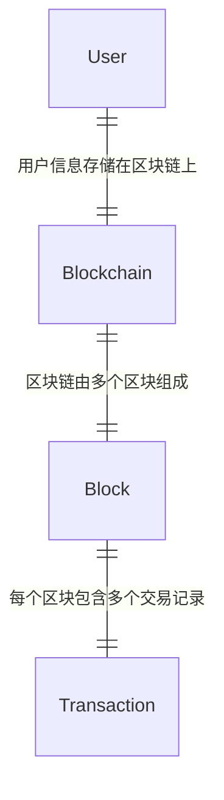
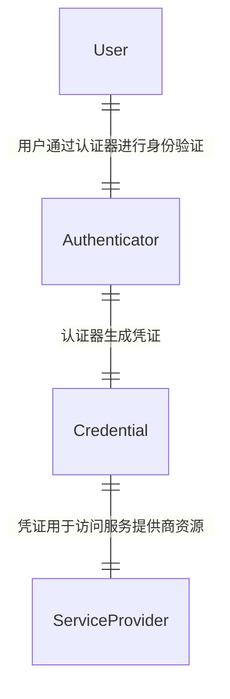
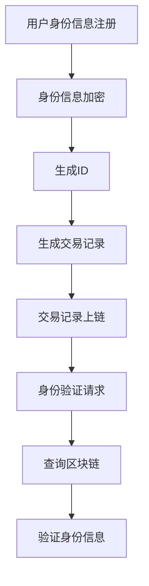
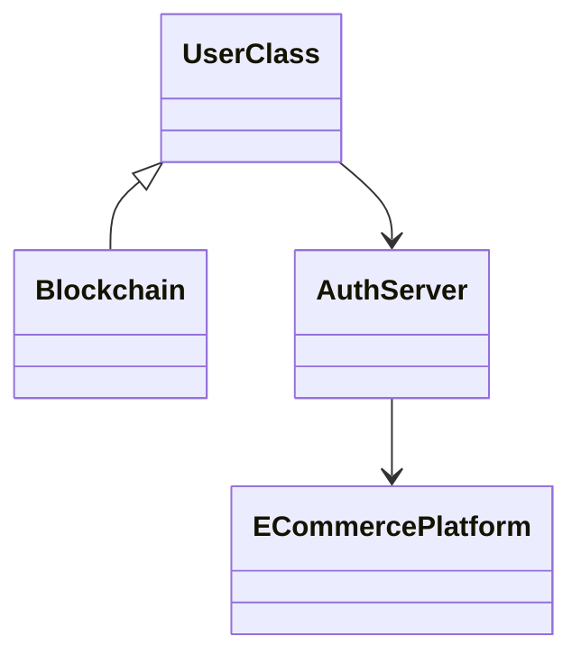
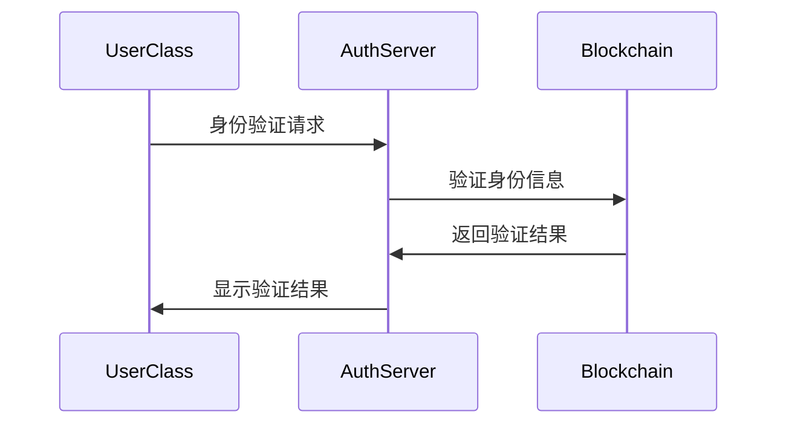

                 

# 区块链在数字身份跨境认证中的应用

## 关键词

区块链、数字身份、跨境认证、智能合约、分布式账本

## 摘要

随着数字化时代的到来，跨境认证的需求日益增加，然而传统认证方式面临着效率低下、数据隐私和安全等问题。区块链技术的去中心化、不可篡改和透明性特点，为解决这些问题提供了新的思路。本文将深入探讨区块链在数字身份跨境认证中的应用，从背景介绍、核心概念与联系、算法原理讲解、系统分析与架构设计方案、项目实战等方面，详细分析区块链技术在跨境认证中的实际应用和价值。

## 第一部分：背景介绍

### 1.1 问题背景

随着互联网和信息技术的发展，数字化身份的应用场景越来越广泛，如电子商务、金融支付、政务服务等。然而，在跨国界的情况下，对个人或组织进行身份验证的需求也越来越迫切。传统的跨境认证方式主要依赖于第三方机构，如政府、金融机构或认证中心等。这些机构在认证过程中承担着重要角色，但同时也存在着诸多问题，如认证流程复杂、效率低下、数据隐私和安全问题等。

### 1.2 问题描述

数字身份跨境认证是指在跨国界的情况下，对个人或组织进行身份验证的过程。传统的跨境认证方式通常依赖于第三方机构，这些机构在认证过程中扮演着重要角色。然而，传统的认证方式存在以下问题：

- **认证流程复杂**：传统的认证流程通常需要多个步骤和环节，如身份信息采集、身份信息审核、身份信息比对等，导致认证效率低下。
- **数据隐私和安全问题**：在传统的认证方式中，身份信息通常需要在多个机构之间传输，存在被泄露或滥用的风险。
- **不可篡改**：传统认证方式无法保证认证信息的真实性和完整性。

### 1.3 问题解决

区块链技术的出现为解决这些问题提供了新的思路。区块链的去中心化特点使得认证过程不再依赖于第三方机构，从而简化了认证流程。区块链的不可篡改性和透明性确保了认证信息的真实性和完整性。此外，区块链的智能合约功能还可以实现自动化认证，进一步提高认证效率。

### 1.4 边界与外延

- **数字身份**：指个人或组织的身份信息，包括姓名、出生日期、身份证号码等。
- **跨境认证**：指在跨国界的情况下对个人或组织进行身份验证。
- **区块链**：一种分布式数据库技术，具有去中心化、不可篡改和透明性等特点。

### 1.5 概念结构与核心要素组成

数字身份跨境认证在区块链中的应用主要包括以下几个核心要素：

- **区块链网络**：用于存储和管理身份认证数据。
- **身份认证协议**：用于实现身份验证的过程。
- **智能合约**：用于实现自动化认证功能。
- **身份信息**：用于存储个人或组织的身份信息。

## 第二部分：核心概念与联系

### 2.1 区块链技术原理

区块链是一种分布式数据库技术，其核心特点是去中心化、不可篡改和透明性。区块链由多个区块组成，每个区块包含一定数量的交易记录。区块之间通过加密算法和时间戳相互链接，形成一个链式数据结构。

#### 概念属性特征对比表格：

| 特性            | 说明                                         |
| --------------- | -------------------------------------------- |
| 去中心化        | 区块链无需依赖中央机构，数据由全网节点共同维护 |
| 不可篡改        | 数据一旦被写入区块链，无法被篡改或删除         |
| 透明性          | 区块链上的所有数据对所有节点可见，透明度高       |

#### ER实体关系图架构：



### 2.2 数字身份认证协议

数字身份认证协议是指用于实现数字身份验证的一系列规则和方法。常见的数字身份认证协议包括PKI、OAuth2.0、SAML等。

#### 概念属性特征对比表格：

| 特性            | 说明                                       |
| --------------- | ------------------------------------------ |
| PKI            | 公钥加密技术，用于身份认证和数据加密       |
| OAuth2.0        | 授权协议，用于第三方应用访问用户资源       |
| SAML           | 安全断言标记语言，用于单点登录和身份验证   |

#### ER实体关系图架构：



## 第三部分：算法原理讲解

### 3.1 区块链身份认证算法

区块链身份认证算法的核心思想是将身份信息存储在区块链上，并通过智能合约实现身份验证。以下是一个简单的区块链身份认证算法：

1. **身份信息注册**：用户将自己的身份信息（如姓名、身份证号码等）上传至区块链网络，并使用加密算法进行加密，生成一个唯一标识符（ID）。
2. **身份信息存储**：将加密后的身份信息和ID存储在区块链上，并生成一个交易记录。
3. **身份验证**：当用户需要跨境认证时，将ID发送给认证方。认证方通过查询区块链，验证身份信息的真实性。

#### 算法mermaid流程图：



#### Python源代码实现：

```python
import hashlib
import json

class Blockchain:
    def __init__(self):
        self.chain = []
        self.create_block(previous_hash='1', proof=100)

    def create_block(self, proof, previous_hash):
        block = {'index': len(self.chain) + 1, 'timestamp': time(), 'proof': proof, 'previous_hash': previous_hash}
        self.chain.append(block)
        return block

    def get_previous_block(self):
        return self.chain[-1]

    def proof_of_work(self, last_proof):
        proof = 0
        while self.valid_proof(last_proof, proof) is False:
            proof += 1
        return proof

    @staticmethod
    def valid_proof(last_proof, proof):
        guess = f'{last_proof}{proof}'.encode()
        guess_hash = hashlib.sha256(guess).hexdigest()
        return guess_hash[:4] == '0000'

    def hash(self, block):
        block_string = json.dumps(block, sort_keys=True)
        return hashlib.sha256(block_string.encode()).hexdigest()

    def is_chain_valid(self, chain):
        previous_block = chain[0]
        block = chain[1]
        for index in range(1, len(chain)):
            if index > 0:
                current_block = chain[index]
                if current_block['previous_hash'] != self.hash(previous_block):
                    return False
            previous_proof = previous_block['proof']
            proof = block['proof']
            if not self.valid_proof(previous_proof, proof):
                return False
            previous_block = block
        return True

blockchain = Blockchain()
print("Block 1 is:", blockchain.chain[0])
print("Block 2 is:", blockchain.chain[1])
print("Is the chain valid?", blockchain.is_chain_valid(blockchain.chain))
```

### 3.2 数学模型与公式

区块链身份认证算法的数学模型主要包括以下几个方面：

1. **加密算法**：用于将身份信息加密生成唯一标识符（ID）。
2. **哈希算法**：用于生成交易记录的哈希值，确保交易记录的完整性和不可篡改性。
3. **工作量证明算法**：用于生成新的区块，确保区块链的安全性和稳定性。

#### 加密算法：

$$ID = Encrypt(身份信息)$$

其中，$Encrypt$表示加密算法。

#### 哈希算法：

$$哈希值 = Hash(交易记录)$$

其中，$Hash$表示哈希算法。

#### 工作量证明算法：

$$Proof = Proof_of_work(Last\_Proof)$$

其中，$Last\_Proof$表示上一个区块的工作量证明。

## 第四部分：系统分析与架构设计方案

### 4.1 问题场景介绍

假设有一个跨境电商平台，用户需要在平台上进行购物。为了确保交易的安全性，平台需要对用户的身份进行验证。传统的认证方式存在诸多问题，如认证流程复杂、效率低下、数据隐私和安全问题等。为了解决这些问题，我们可以采用区块链技术进行数字身份跨境认证。

### 4.2 项目介绍

本项目旨在实现一个基于区块链的数字身份跨境认证系统，包括用户身份注册、身份验证、交易等功能。系统将采用Python语言进行开发，基于以太坊区块链平台实现。

### 4.3 系统功能设计

系统的主要功能包括：

- 用户身份注册：用户将自己的身份信息上传至区块链，并生成唯一标识符（ID）。
- 身份验证：用户在跨境电商平台购物时，需要提供自己的ID进行身份验证。
- 交易：用户在平台上的交易记录将存储在区块链上，确保交易的透明性和不可篡改性。

### 4.4 系统架构设计

系统的总体架构设计如下：

- **区块链网络**：使用以太坊区块链平台，实现数字身份信息的存储和交易记录的存储。
- **用户端**：用户通过前端界面进行身份注册和身份验证。
- **认证服务器**：用于接收用户的身份验证请求，并调用区块链网络进行身份验证。
- **电商平台**：用于接收用户的交易请求，并调用区块链网络进行交易记录的存储。

### 4.5 系统接口设计和系统交互

系统的接口设计和交互如下：

- **用户端接口**：用户通过前端界面进行身份注册和身份验证。
- **认证服务器接口**：认证服务器接收用户的身份验证请求，并调用区块链网络进行身份验证。
- **电商平台接口**：电商平台接收用户的交易请求，并调用区块链网络进行交易记录的存储。

#### 类图架构：



#### 序列图架构：



## 第五部分：项目实战

### 5.1 环境安装

在开始项目实战之前，需要安装以下环境：

- Python 3.8及以上版本
- Node.js 12及以上版本
- Truffle框架
- Ganache区块链模拟器

安装步骤如下：

1. 安装Python 3.8及以上版本。
2. 安装Node.js 12及以上版本。
3. 安装Truffle框架：`npm install -g truffle`
4. 安装Ganache区块链模拟器：在官网（https://www.ganache.io/）下载并安装。

### 5.2 系统核心实现

本项目的核心实现包括以下三个部分：用户身份注册、身份验证、交易。

#### 用户身份注册

用户身份注册的实现步骤如下：

1. 编写智能合约：定义用户身份信息的数据结构，如姓名、身份证号码等。
2. 部署智能合约：使用Truffle框架将智能合约部署到以太坊区块链上。
3. 用户注册：用户通过前端界面输入身份信息，并将其发送给智能合约进行注册。

#### 身份验证

身份验证的实现步骤如下：

1. 用户端请求：用户在跨境电商平台购物时，需要提供自己的ID进行身份验证。
2. 认证服务器处理：认证服务器接收用户的身份验证请求，并调用区块链网络进行身份验证。
3. 验证结果返回：认证服务器将验证结果返回给用户端，显示身份验证结果。

#### 交易

交易的实现步骤如下：

1. 用户端请求：用户在跨境电商平台购物时，需要发起交易请求。
2. 电商平台处理：电商平台接收用户的交易请求，并调用区块链网络进行交易记录的存储。
3. 交易记录上链：交易记录将存储在区块链上，确保交易的透明性和不可篡改性。

### 5.3 代码应用解读与分析

以下是用户身份注册的智能合约代码：

```solidity
pragma solidity ^0.8.0;

contract UserRegistration {
    struct UserInfo {
        string name;
        string id;
    }

    mapping(string => UserInfo) public users;

    function registerUser(string memory _id, string memory _name) public {
        require(users[_id].name == '', 'User already registered');
        users[_id] = UserInfo(_name, _id);
    }
}
```

代码解读：

- `pragma solidity ^0.8.0;`：指定智能合约的版本。
- `struct UserInfo`：定义用户身份信息的数据结构，包括姓名和身份证号码。
- `mapping(string => UserInfo) public users;`：使用映射（mapping）数据结构存储用户身份信息。
- `function registerUser(string memory _id, string memory _name) public`：定义注册用户函数，接收身份证号码和姓名作为参数。
- `require(users[_id].name == '', 'User already registered');`：检查用户是否已注册，如已注册则抛出异常。
- `users[_id] = UserInfo(_name, _id);`：将用户身份信息存储在区块链上。

### 5.4 实际案例分析和详细讲解剖析

假设用户A在跨境电商平台购物，需要进行身份验证。以下是身份验证的过程：

1. 用户A在电商平台输入自己的ID（如123456789）。
2. 电商平台将ID发送给认证服务器进行身份验证。
3. 认证服务器调用区块链网络，查询用户A的身份信息。
4. 区块链网络返回用户A的身份信息，包括姓名和身份证号码。
5. 认证服务器将身份信息返回给电商平台，显示身份验证结果。

通过实际案例分析，我们可以发现：

- 身份验证过程依赖于区块链网络，确保了身份信息的真实性和完整性。
- 认证服务器不需要存储用户身份信息，简化了系统架构。
- 用户身份信息存储在区块链上，确保了数据的透明性和不可篡改性。

### 5.5 项目小结

本项目通过区块链技术实现了数字身份跨境认证系统，解决了传统认证方式存在的问题。以下是项目的总结：

- **优势**：
  - 简化了认证流程，提高了认证效率。
  - 保证了身份信息的真实性和完整性，提高了数据安全性。
  - 去中心化的特点降低了系统的运营成本。
- **不足**：
  - 区块链技术尚未完全成熟，可能存在一些技术风险。
  - 区块链网络的处理能力有限，可能无法满足高并发场景的需求。
  - 区块链技术的普及程度较低，需要加强宣传和推广。

## 第六部分：最佳实践 tips

### 6.1 技术选型

在选择区块链平台时，需要考虑以下因素：

- **性能**：选择性能较好的区块链平台，如以太坊、EOS等。
- **安全性**：选择安全性较高的区块链平台，如Hyperledger Fabric、Ripple等。
- **易用性**：选择易用性较好的区块链平台，如Truffle、Ganache等。

### 6.2 系统优化

在系统设计过程中，可以采取以下优化措施：

- **分布式存储**：使用分布式存储技术，提高系统的处理能力。
- **智能合约优化**：对智能合约进行优化，提高执行效率。
- **缓存机制**：使用缓存机制，减少对区块链网络的查询次数。

### 6.3 安全防护

在系统运行过程中，需要采取以下安全防护措施：

- **身份认证**：采用多重身份认证机制，确保用户身份的真实性。
- **数据加密**：对敏感数据进行加密处理，防止数据泄露。
- **安全审计**：定期进行安全审计，发现和解决潜在的安全隐患。

## 第七部分：小结与注意事项

### 小结

本文通过深入分析区块链在数字身份跨境认证中的应用，从背景介绍、核心概念与联系、算法原理讲解、系统分析与架构设计方案、项目实战等方面，详细阐述了区块链技术在跨境认证中的实际应用和价值。通过本文的讲解，读者可以了解区块链技术在数字身份跨境认证中的应用原理、实现方法以及项目实战。

### 注意事项

在实施区块链数字身份跨境认证项目时，需要注意以下几点：

- **技术成熟度**：区块链技术尚在发展过程中，可能存在一定的技术风险。
- **性能优化**：针对高并发场景，需要优化系统性能，提高处理能力。
- **安全性**：加强对系统安全性的防护，确保用户身份信息的真实性和完整性。
- **法律合规**：遵守相关法律法规，确保项目合规运行。

## 第八部分：拓展阅读

- 《区块链技术指南》
- 《智能合约开发指南》
- 《以太坊官方文档》
- 《Hyperledger Fabric官方文档》

作者：AI天才研究院/AI Genius Institute & 禅与计算机程序设计艺术 /Zen And The Art of Computer Programming

---

本文内容仅供参考，如需在实际项目中应用，请结合实际情况进行调整。

