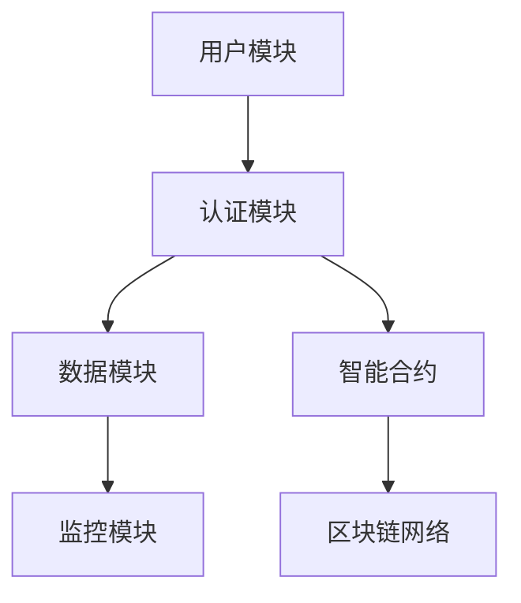
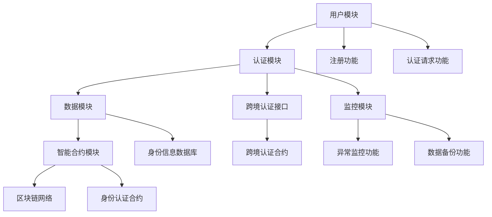
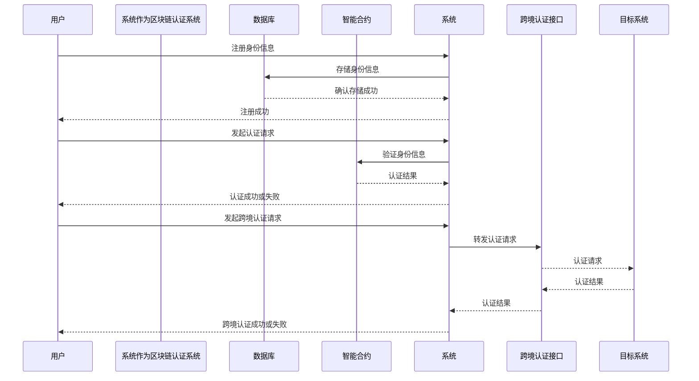
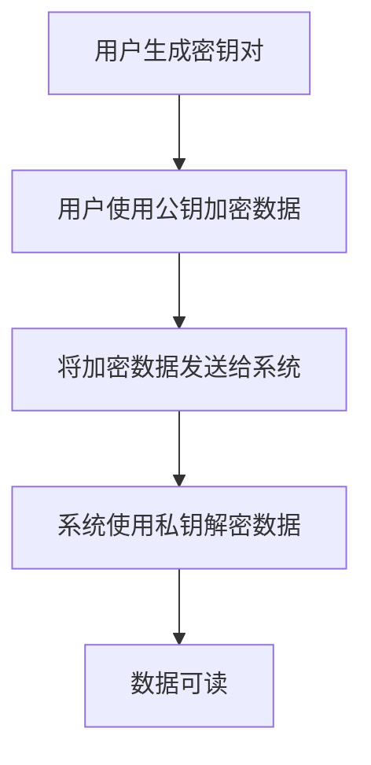
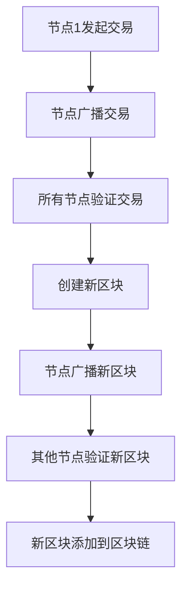
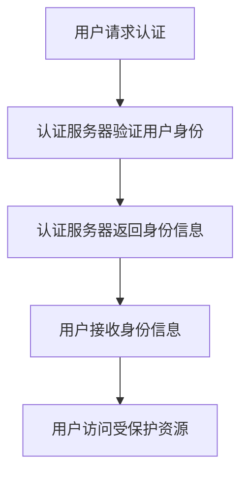

                 

### 第1章: 问题背景与核心概念

在当今信息化、全球化的时代，数字身份跨境认证已成为一个不可忽视的重要议题。随着互联网技术的飞速发展和跨境电子商务的蓬勃兴起，各国公民和企业需要频繁地在全球范围内进行身份验证和信息交换。然而，传统的认证方式往往存在着诸多问题，如信息孤岛、认证效率低、安全性不足等。这些问题不仅制约了跨境认证的发展，也影响了数字经济和国际贸易的进一步融合。

#### 1.1.1 问题背景

数字身份跨境认证的需求源自以下几个方面：

1. **跨境电子商务**：在全球范围内，跨境电子商务的交易额逐年攀升，为消费者提供了极大的便利。然而，跨境交易需要可靠的数字身份认证，以确保交易双方的身份真实性和交易安全。
2. **全球支付系统**：随着电子支付手段的普及，跨境支付的需求日益增长。然而，现有的支付系统在跨境认证方面存在瓶颈，影响了支付效率和用户体验。
3. **国际法律监管**：为了打击跨国犯罪和非法活动，各国政府需要建立有效的跨境身份认证体系，以便及时识别和追踪嫌疑人。

#### 1.1.2 核心概念

1. **数字身份认证**：是指通过数字技术对个人或组织的身份进行验证的过程。其核心目标是在线识别和验证用户的真实身份，确保信息安全和隐私保护。
2. **跨境认证**：是指跨越不同国家或地区的身份认证过程。这要求认证系统能够兼容不同的数据标准和技术架构，实现跨域认证互操作性。

#### 1.1.3 概念联系与边界

数字身份认证与跨境认证之间存在紧密联系。数字身份认证是跨境认证的基础，而跨境认证则是数字身份认证在全球化背景下的延伸。两者的边界在于：

- **应用范围**：数字身份认证主要关注在线身份验证，而跨境认证则涉及跨国界的信息交换和合作。
- **技术实现**：数字身份认证通常采用单一系统进行，而跨境认证则需要多个系统间的协同工作。

#### 关键术语定义

- **数字身份**：指个人或组织在数字世界中的唯一标识，通常包括身份信息、身份凭证和身份验证机制。
- **跨境认证互操作性**：指不同认证系统之间能够互相识别和验证身份信息的能力。

#### 概念结构与核心要素组成

数字身份认证和跨境认证的核心要素包括：

1. **身份信息**：包括个人的姓名、出生日期、身份证号码等基本信息。
2. **身份凭证**：包括身份证、护照等官方文件，以及数字证书等电子凭证。
3. **身份验证机制**：包括生物识别技术、密码学技术、智能卡技术等。

这些要素共同构成了数字身份认证和跨境认证的基础框架，为实现高效、安全的身份认证提供了技术支持。

### 总结

在本章节中，我们介绍了数字身份跨境认证的背景和核心概念，包括问题背景、核心术语的定义以及概念联系和边界。理解这些基础概念，对于深入探讨区块链在数字身份跨境认证中的应用具有重要意义。

#### 1.1.1 问题背景

在全球化浪潮的推动下，跨境交易和协作日益频繁，这为数字身份跨境认证带来了巨大的需求。首先，跨境电子商务的兴起使得消费者可以轻松购买来自世界各地的商品，而卖家也需要在全球范围内验证买家的身份和支付能力。然而，传统的身份认证系统往往依赖于中心化的数据库，这些数据库不仅存在单点故障的风险，还可能因为数据泄露而导致用户的身份信息被窃取。此外，跨境支付也面临着类似的问题，国际支付系统在处理跨境交易时，需要验证交易双方的数字身份，以保证资金的安全转移。

其次，国际法律监管的加强也推动了数字身份跨境认证的发展。为了打击跨国犯罪、洗钱和恐怖主义活动，各国政府和国际组织需要建立可靠的跨境身份认证体系，以便及时识别和追踪嫌疑人。传统的身份认证方式由于存在信息孤岛和互操作性问题，往往难以满足这一需求。因此，需要一种分布式、安全、可靠的认证方式来替代现有的系统。

此外，随着云计算和区块链技术的发展，越来越多的企业开始寻求将新兴技术应用于数字身份认证和跨境认证中。区块链作为一种分布式账本技术，具有去中心化、不可篡改和透明等特点，可以为跨境认证提供新的解决方案。通过区块链，可以实现全球范围内的身份信息共享和互操作，提高认证效率和安全性。

然而，数字身份跨境认证也面临着一些挑战。首先，不同国家和地区的数据标准和认证方式存在差异，这需要一种灵活的架构来支持跨域认证互操作性。其次，跨境认证需要处理大量的身份信息，这要求系统具有高效的数据存储和处理能力。此外，隐私保护也是一个关键问题，如何在确保身份信息不被泄露的前提下进行认证，是数字身份跨境认证需要解决的重要难题。

总之，数字身份跨境认证的需求日益迫切，但同时也面临着诸多挑战。理解这些问题背景和核心概念，有助于我们更好地探讨区块链在这一领域中的应用，并找到有效的解决方案。

#### 1.1.2 核心概念

在深入探讨数字身份跨境认证的问题之前，我们需要明确几个核心概念：数字身份认证、跨境认证和区块链。

1. **数字身份认证**：

   数字身份认证是一种通过数字技术对个人或组织的身份进行验证的方法。它不仅限于在线身份验证，还包括离线身份验证和混合身份验证。数字身份认证的核心目标是确保用户身份的真实性和合法性，同时保护用户的隐私和信息安全。

   数字身份认证的要素包括：

   - **身份信息**：用户的个人信息，如姓名、出生日期、身份证号码等。
   - **身份凭证**：官方文件或数字证书，如身份证、护照、电子身份证等。
   - **身份验证机制**：用于验证身份信息的手段，如密码学技术、生物识别技术、智能卡技术等。

   数字身份认证的方法主要包括：

   - **单因素认证**：使用单一的身份凭证进行验证，如密码、指纹等。
   - **双因素认证**：结合两种或以上的身份验证机制，如密码加指纹、身份证加密码等。
   - **多因素认证**：使用多种身份验证机制，如密码、指纹、面部识别等。

2. **跨境认证**：

   跨境认证是指在不同国家或地区之间进行身份认证的过程。它涉及多个系统、多个数据库和多个认证标准的协同工作。跨境认证的核心目标是确保身份信息在全球范围内的可靠性和互操作性。

   跨境认证的需求来源于以下几个方面：

   - **跨境电子商务**：随着跨境购物的普及，需要对消费者和卖家的身份进行验证。
   - **国际支付系统**：在进行跨境支付时，需要验证交易双方的身份，以确保资金安全。
   - **国际法律监管**：为了打击跨国犯罪，需要建立全球范围内的身份认证体系。

   跨境认证的关键挑战包括：

   - **数据标准差异**：不同国家和地区的身份信息标准不同，需要实现互操作。
   - **认证效率**：跨境认证需要处理大量的身份信息，需要高效的处理能力。
   - **隐私保护**：确保身份信息不被泄露，同时满足认证需求。

3. **区块链**：

   区块链是一种分布式账本技术，具有去中心化、不可篡改、透明和智能合约等特点。区块链通过加密技术和共识算法，实现了数据的可信存储和共享。

   区块链的核心要素包括：

   - **分布式账本**：多个节点共同维护的账本，每个节点都有一份完整的账本。
   - **加密技术**：保护数据传输和存储的安全。
   - **共识算法**：确保多个节点之间的数据一致性。
   - **智能合约**：在区块链上执行自动化合约，无需第三方中介。

   区块链在数字身份跨境认证中的应用包括：

   - **去中心化认证**：通过区块链，可以实现去中心化的身份认证，减少对中心化数据库的依赖。
   - **身份信息不可篡改**：区块链上的数据一旦写入，就不可篡改，保证了身份信息的真实性。
   - **跨境认证互操作性**：区块链可以实现不同国家或地区身份认证系统的互操作，解决了数据标准差异的问题。
   - **隐私保护**：区块链上的数据是加密的，同时可以通过零知识证明等技术实现隐私保护。

总之，数字身份认证、跨境认证和区块链是当前数字身份跨境认证领域的重要概念。理解这些概念，有助于我们更好地探讨如何利用区块链技术解决数字身份跨境认证中的挑战，并推动这一领域的发展。

#### 1.1.3 概念联系与边界

数字身份认证与跨境认证之间存在紧密联系，但两者也各有其独特的应用场景和实现方式。理解这两个概念之间的联系与边界，有助于我们更好地把握区块链在数字身份跨境认证中的具体应用。

首先，数字身份认证是跨境认证的基础。数字身份认证旨在确保用户在线上的真实身份，这包括用户注册、登录、交易等各个场景。通过数字身份认证，用户可以证明自己的身份，并获取相应的权限和服务。跨境认证则是在数字身份认证的基础上，进一步扩展到跨国界的应用场景。跨境认证需要解决的是不同国家或地区之间的身份信息互认和协同验证问题，以确保跨境交易、支付和信息交换的安全和高效。

其次，数字身份认证与跨境认证在实现方式上存在差异。数字身份认证主要依赖于中心化的身份认证系统，这些系统通常由一个或多个权威机构负责维护和管理。而跨境认证则更依赖于分布式系统和去中心化技术，如区块链。区块链通过其分布式账本和智能合约技术，可以实现身份信息的去中心化存储和自动化验证，从而提高跨境认证的效率和安全性。

在概念联系方面，数字身份认证和跨境认证需要协同工作。数字身份认证提供了基础的身份验证服务，而跨境认证则基于这些身份信息，实现了跨国界的身份验证和协作。例如，在跨境电子商务中，买方和卖方都需要进行数字身份认证，以确保双方的身份真实可靠。然后，通过跨境认证系统，可以进一步验证买卖双方的跨国身份信息，确保交易的安全和合规。

在边界方面，数字身份认证主要关注在线身份验证和本地化认证，而跨境认证则扩展到全球范围。数字身份认证通常涉及单一系统或多个系统间的互操作性，而跨境认证则需要实现跨域认证互操作性。此外，数字身份认证更多关注身份信息的安全和隐私保护，而跨境认证则更注重认证效率和互操作性。

总之，数字身份认证与跨境认证在概念上相互联系，但在实现和应用上存在边界。理解这些联系与边界，有助于我们更好地应用区块链技术，实现高效、安全的数字身份跨境认证。

#### 关键术语定义

在本章中，我们将定义几个关键术语，以便为后续讨论提供清晰的基础。

1. **数字身份**：数字身份是指个人或实体在数字世界中的唯一标识，它通常包括身份信息、身份凭证和身份验证机制。身份信息是指个人或实体的基本信息，如姓名、出生日期、身份证号码等。身份凭证可以是官方文件，如身份证、护照，也可以是电子证书，如数字证书。身份验证机制是指用于验证数字身份真实性的技术手段，如密码学、生物识别等。

2. **跨境认证互操作性**：跨境认证互操作性是指不同国家或地区的认证系统之间能够互相识别和验证身份信息的能力。实现跨境认证互操作性的目标是在全球范围内确保身份认证的一致性和有效性，以便在跨境交易、支付和信息交换过程中，能够安全、高效地验证参与各方的身份。

3. **区块链**：区块链是一种分布式账本技术，通过加密算法和共识机制，实现了数据的安全存储和共享。区块链上的数据以块的形式存储，每个块包含一定数量的交易记录，并通过加密算法与前一个块连接，形成一个不可篡改的链式结构。区块链的主要特点包括去中心化、不可篡改、透明和可追溯。

4. **数字身份认证**：数字身份认证是指通过数字技术对个人或组织的身份进行验证的过程，以确保其在线身份的真实性和合法性。数字身份认证可以采用单因素认证、双因素认证或多因素认证等多种方式，通过密码学、生物识别等技术手段，确保认证的安全性和可靠性。

5. **跨境认证**：跨境认证是指在不同国家或地区之间进行身份认证的过程，涉及多个认证系统之间的互操作。跨境认证的目标是实现跨国界的身份信息互认和协同验证，以提高跨境交易、支付和信息交换的安全性和效率。

通过明确这些关键术语，我们为后续章节中对区块链在数字身份跨境认证中的应用讨论奠定了基础。

### 概念结构与核心要素组成

数字身份认证和跨境认证构成了一个复杂而紧密的体系，其核心要素和结构如下：

1. **身份信息**：身份信息是数字身份认证和跨境认证的基础，包括个人的基本信息（如姓名、出生日期、身份证号码等）和特定于某些场景的附加信息（如教育背景、职业资格等）。身份信息在认证过程中起到标识和识别作用，其准确性和完整性直接关系到认证的有效性。

2. **身份凭证**：身份凭证是用于证明身份信息的合法性的文件或数字证书。常见的身份凭证包括身份证、护照、驾驶证、电子身份证等。在数字身份认证中，身份凭证通常以电子形式存在，如数字证书或加密的电子文件。

3. **身份验证机制**：身份验证机制是用于确认身份信息真实性的技术手段，包括单因素认证（如密码）、双因素认证（如密码加指纹）和多因素认证（如密码加面部识别）等。不同的验证机制适用于不同的安全要求和场景。

4. **认证协议**：认证协议是定义身份认证过程中数据交换和验证流程的规范。常见的认证协议包括OAuth、OpenID Connect、SAML等。这些协议确保了认证过程的安全性和互操作性。

5. **身份管理平台**：身份管理平台是负责维护和管理用户身份信息的系统。它通常包括用户注册、身份验证、权限管理、身份信息更新等功能。身份管理平台需要与各种认证系统和服务进行集成，以实现身份信息的共享和互操作。

6. **隐私保护机制**：隐私保护机制是确保用户身份信息在认证过程中不被泄露的关键措施。这包括数据加密、匿名化处理、隐私计算等。隐私保护机制的引入，有助于在保障认证安全性的同时，尊重用户的隐私权。

7. **跨境认证互操作性标准**：跨境认证互操作性标准是确保不同国家或地区的认证系统能够互相识别和验证身份信息的规范。这些标准通常涉及数据格式、认证流程、认证结果处理等方面的统一规定。

通过上述核心要素的有机结合，数字身份认证和跨境认证体系得以实现。在区块链技术的支持下，这一体系可以进一步优化，提高认证的效率、安全性和互操作性。

#### 关键术语定义

在本章节中，我们将对以下几个关键术语进行详细定义，以便为后续内容提供清晰的背景和基础。

1. **数字身份**：数字身份是指个人或实体在数字世界中的唯一标识，它通过一系列电子数据来代表现实世界的身份信息。这些数据包括但不限于个人姓名、出生日期、身份证号码、住址、电子邮件地址等。数字身份的主要功能是在线上环境中确保用户身份的真实性和唯一性，以支持各种在线交易和服务。

2. **跨境认证互操作性**：跨境认证互操作性是指不同国家或地区的身份认证系统能够相互识别和验证身份信息的能力。这意味着当一个国家的身份认证系统颁发的证书或身份信息被另一个国家的系统接受时，即可实现跨境认证互操作性。这种互操作性在全球化背景下尤为重要，因为它可以简化跨境交易和合作流程，提高效率和安全性。

3. **区块链**：区块链是一种分布式账本技术，通过加密算法和共识机制，实现了数据的分布式存储和不可篡改。区块链上的每一个数据块都包含一定数量的交易记录，并通过加密算法与前一个块连接，形成一个连续的链式结构。区块链的主要特性包括去中心化、透明性、不可篡改和可追溯性，这些特性使得区块链在数字身份认证和跨境认证中具有广泛应用潜力。

4. **身份验证机制**：身份验证机制是指用于确认用户身份真实性的技术手段。这些机制包括单因素验证（如用户名和密码）、双因素验证（如用户名、密码加指纹或短信验证码）和多因素验证（如用户名、密码、指纹和面部识别）。身份验证机制的设计和选择取决于应用场景的安全要求和用户便利性需求。

5. **数字身份认证**：数字身份认证是指通过数字技术对用户身份进行验证的过程。这个过程通常涉及用户输入身份信息，系统通过验证这些信息来确认用户的真实身份。数字身份认证的目标是在保障用户隐私和安全的前提下，提高认证效率和准确性。

6. **跨境认证**：跨境认证是指在不同国家或地区之间进行身份验证的过程。这种认证需要处理来自不同认证系统的身份信息，并在这些系统之间实现数据共享和互操作。跨境认证的挑战包括数据格式不一致、认证标准不统一和安全性问题。

通过上述定义，我们为读者提供了对数字身份认证和跨境认证相关术语的深入理解，为后续内容的讨论奠定了基础。

### 第二部分: 区块链技术基础

#### 2.1 区块链原理

区块链是一种分布式账本技术，其核心思想是通过加密算法和共识机制实现数据的分布式存储和不可篡改。区块链的基本原理可以概括为以下几方面：

首先，区块链由多个数据块组成，每个数据块包含一定数量的交易记录。这些数据块通过加密算法和哈希函数相互连接，形成一个连续的链式结构。哈希函数是一种将任意长度的数据映射为固定长度数据的算法，其特点是一旦输入的数据发生变化，输出的哈希值也会发生变化。这使得区块链上的数据具有高度的可追溯性和不可篡改性。

其次，区块链采用共识机制来确保数据的一致性和安全性。常见的共识机制包括工作量证明（PoW）、权益证明（PoS）和委托权益证明（DPoS）等。这些机制通过竞赛、投票和随机性等手段，确保所有参与节点对数据的认可和一致性。

此外，区块链上的交易记录是公开透明的。每个节点都保存一份完整的区块链数据，任何节点都可以查看和验证其他节点的交易记录。这使得区块链上的数据具有高度的可信度和透明性，减少了信息不对称和欺诈风险。

#### 2.2 区块链的核心要素

区块链的核心要素包括以下几个方面：

1. **分布式账本**：区块链通过分布式账本技术，实现了数据的多点存储和共享。每个节点都保存一份完整的账本，这些账本之间通过加密算法和共识机制保持一致性。分布式账本提高了系统的可靠性和容错性，减少了单点故障的风险。

2. **加密技术**：区块链采用多种加密技术，包括哈希函数、非对称加密和对称加密等，确保数据的传输和存储安全。加密技术保证了区块链上的数据隐私性和不可篡改性，增强了系统的安全性能。

3. **共识机制**：共识机制是区块链的核心，它确保了所有节点对数据的认可和一致性。不同的共识机制有不同的实现方式和优缺点，选择合适的共识机制对于区块链的性能和安全性至关重要。

4. **智能合约**：智能合约是一种自动执行合约条款的计算机程序，其条款以代码形式嵌入区块链中。智能合约通过编程逻辑，实现了自动化的交易和合约执行，提高了交易效率和可信度。

5. **去中心化**：区块链的去中心化特点，使得系统不再依赖于中心化的机构或服务器。每个节点都可以参与区块链的维护和交易验证，减少了中介成本和信息不对称。

#### 2.3 区块链技术发展趋势

随着区块链技术的不断发展，其在多个领域中的应用场景日益丰富，以下是一些主要的发展趋势：

1. **加密货币**：比特币、以太坊等加密货币已经成为区块链技术应用的热点。加密货币通过区块链技术实现了去中心化的货币发行和交易，提高了交易的安全性和透明性。

2. **供应链管理**：区块链技术在供应链管理中具有广泛的应用前景。通过区块链，可以实现供应链数据的透明化和可追溯性，提高供应链的效率和管理水平。

3. **数字身份认证**：区块链技术可以用于构建去中心化的数字身份认证体系，提高身份认证的安全性和互操作性。数字身份认证在跨境认证、金融交易、社交媒体等领域具有重要作用。

4. **智能合约**：智能合约在金融、供应链、法律等领域具有广泛的应用前景。智能合约通过自动化执行合约条款，提高了交易效率和可信度，减少了中介成本。

5. **数据存储和隐私保护**：区块链技术可以用于构建去中心化的数据存储和隐私保护方案。通过区块链，可以实现数据的分布式存储和加密，提高数据的安全性和隐私性。

6. **分布式治理**：区块链技术在分布式治理中的应用，可以促进去中心化组织的建立和发展。通过区块链，可以实现决策的透明化和民主化，提高组织的效率和公正性。

总之，区块链技术在各个领域的发展趋势表明，其具有巨大的应用潜力和广阔的市场前景。随着技术的不断进步和应用的深入，区块链技术将在未来发挥更加重要的作用。

### 区块链原理

区块链是一种分布式账本技术，其核心理念是通过对数据进行加密和分布式存储，实现数据的不可篡改性和透明性。以下是区块链的基本原理和关键组成部分：

首先，区块链由一系列按照时间顺序排列的数据块组成。每个数据块包含一定数量的交易记录，这些交易记录可以是金融交易、身份认证、供应链信息等。每个数据块都有一个独特的标识，即哈希值，哈希值是通过加密算法对数据块内容进行加密计算得出的。哈希值具有固定长度，且一旦输入的数据发生变化，输出的哈希值也会发生变化，这使得数据具有高度的可追溯性和不可篡改性。

其次，区块链中的数据块通过一种特定的方式连接在一起，形成一个链式结构。具体来说，每个数据块的哈希值与其前一个数据块的哈希值相连接，形成一个单向链。这种链接方式使得数据一旦被记录在区块链上，就几乎不可能被篡改或删除，因为篡改一个数据块需要同时篡改所有后续的数据块，这将面临极大的计算难度。

区块链的共识机制是其核心组成部分之一。共识机制用于确保所有参与节点对区块链数据的一致性。常见的共识机制包括工作量证明（PoW）、权益证明（PoS）和委托权益证明（DPoS）等。以工作量证明为例，节点需要通过解决复杂的数学难题来竞争记账权。当一个节点成功解决问题时，它将获得记账权，并将最新的交易记录打包成一个数据块添加到区块链上。其他节点会验证这个新数据块的合法性和正确性，如果验证通过，这个数据块就会被添加到区块链的末端。

此外，区块链采用加密技术来保障数据传输和存储的安全。常见的加密技术包括非对称加密和哈希函数。非对称加密用于保护数据传输过程中的隐私，数据发送方使用接收方的公钥进行加密，只有接收方能够使用私钥解密。哈希函数则用于生成数据块的哈希值，确保数据在传输和存储过程中的完整性。

最后，区块链上的智能合约也是其核心组成部分之一。智能合约是一段嵌入在区块链中的代码，用于自动执行合约条款。智能合约通过编程逻辑，实现了自动化交易和合约执行，提高了交易效率和可信度。例如，当买家和卖家在区块链上签订一个买卖合同时，智能合约可以自动触发付款流程，确保合同条款的执行。

综上所述，区块链通过分布式存储、加密技术和共识机制，实现了数据的不可篡改性和透明性，为构建去中心化的信任机制提供了强有力的支持。这些基本原理和关键组成部分使得区块链在金融、供应链、数字身份认证等领域具有广泛的应用潜力。

#### 区块链的核心要素

区块链技术之所以能够在多个领域取得成功，离不开其核心要素的支持。以下是区块链的几个关键组成部分及其作用：

1. **分布式账本**：

   分布式账本是指区块链上的数据不是集中存储在一个地方，而是分布在全球多个节点的计算机上。这种分布式存储方式提高了系统的可靠性和容错性，因为即使某个节点发生故障，其他节点仍然可以继续运行。此外，分布式账本使得数据透明化和可追溯，因为每个节点都保存了一份完整的数据副本，任何数据变化都可以被所有节点监控和验证。

2. **加密技术**：

   加密技术是区块链数据安全的核心保障。区块链使用多种加密算法，如哈希函数、非对称加密和对称加密，来确保数据的隐私性和完整性。哈希函数用于生成数据块的唯一标识，保证了数据的不可篡改性。非对称加密用于保护交易过程中的隐私，数据发送方使用接收方的公钥进行加密，只有接收方能够使用私钥解密。对称加密则用于加密存储在节点上的数据。

3. **共识机制**：

   共识机制是区块链上所有节点对数据达成一致的方法。常见的共识机制包括工作量证明（PoW）、权益证明（PoS）和委托权益证明（DPoS）等。这些机制通过竞赛、投票和随机性等手段，确保了所有节点对区块链数据的认可和一致性。共识机制不仅保障了数据的准确性，还提高了区块链的安全性和去中心化程度。

4. **智能合约**：

   智能合约是一种嵌入在区块链中的计算机程序，用于自动执行合约条款。智能合约通过编程逻辑，实现了自动化交易和合约执行，提高了交易效率和可信度。例如，当买家和卖家在区块链上签订一个买卖合同时，智能合约可以自动触发付款流程，确保合同条款的执行。智能合约的引入，使得区块链不仅仅是一个简单的账本，而成为一个具有智能功能的平台。

5. **去中心化**：

   去中心化是区块链技术最显著的特点之一。与传统的集中式系统不同，区块链上的数据不是由中心化的机构或服务器管理，而是由所有参与节点共同维护。这种去中心化的结构，提高了系统的透明度和公正性，减少了信息不对称和欺诈风险。同时，去中心化也使得区块链具有较高的容错性和抗攻击能力。

通过上述核心要素的有机结合，区块链技术实现了数据的分布式存储、加密和安全保护，为构建去中心化的信任机制提供了强有力的支持。

#### 区块链技术发展趋势

区块链技术作为新兴的分布式账本技术，正迅速发展并在多个领域展现出广阔的应用前景。以下是区块链技术在未来几年内可能的发展趋势：

1. **行业应用多元化**：

   随着区块链技术的不断成熟，其应用范围将逐渐从金融领域扩展到供应链管理、医疗保健、物联网、能源管理等各个行业。特别是在那些需要高度信任和透明度的领域，区块链技术将发挥重要作用。

2. **去中心化金融（DeFi）的兴起**：

   去中心化金融是指通过区块链技术实现金融服务的去中心化。DeFi平台提供了无需中心化金融机构参与的金融产品和服务，如去中心化交易所、借贷平台、稳定币等。未来，DeFi将进一步推动金融行业的创新和变革。

3. **智能合约的广泛应用**：

   智能合约作为一种自动化执行合约条款的计算机程序，将在未来的区块链应用中扮演关键角色。随着智能合约技术的不断完善，其将广泛应用于金融、物流、版权保护等领域，提高交易效率和可信度。

4. **跨链技术的发展**：

   跨链技术旨在实现不同区块链之间的互操作性和数据共享。随着区块链网络逐渐增多，跨链技术将成为实现区块链生态系统互联互通的关键。未来，跨链技术有望解决区块链间的数据孤岛问题，促进区块链生态的全面发展。

5. **区块链与隐私保护技术的结合**：

   隐私保护是区块链技术面临的重大挑战之一。未来，区块链技术将与隐私保护技术，如零知识证明、同态加密等，实现更紧密的结合，提高数据的安全性和隐私性。这将有助于解决区块链在金融、医疗等敏感领域应用中的隐私问题。

6. **区块链与监管合规的结合**：

   随着区块链技术的应用越来越广泛，如何确保其合规性成为一个重要议题。未来，区块链与监管合规的结合将得到更多关注。监管沙箱和合规区块链平台的发展，将为区块链技术在不同国家和地区的应用提供更多保障。

7. **区块链技术的普及与教育**：

   随着区块链技术的普及，越来越多的企业和个人将需要掌握相关的技能和知识。未来，区块链技术的教育和培训将成为一个重要领域。通过教育和培训，将有助于提高区块链技术的应用水平，促进区块链生态的健康发展。

总之，区块链技术正处于快速发展的阶段，其应用前景和潜力巨大。未来几年，随着技术的不断完善和应用的深入，区块链技术将在更多领域发挥重要作用，推动全球数字经济的发展。

### 第二部分: 数字身份认证基础

#### 3.1 数字身份认证原理

数字身份认证是一种通过数字技术验证用户身份的真实性和合法性，以确保在线交易和服务安全的过程。其核心原理可以概括为以下几个步骤：

首先，用户在注册时需要提供一些身份信息，如姓名、身份证号码、邮箱地址等。这些身份信息将被系统存储，并生成一个数字身份标识（Digital Identity Token），通常是一个加密的字符串。这个标识将作为用户在系统中的唯一身份证明。

接下来，当用户尝试访问受保护的资源或进行交易时，系统会要求用户进行身份验证。用户可以通过输入密码、指纹、面部识别等验证方式，证明自己的身份。这些验证方式可以单独使用，也可以结合使用，形成多因素认证（Multi-Factor Authentication）。

在身份验证过程中，系统会对用户提供的身份信息进行加密处理，并与之前存储的数字身份标识进行比对。如果验证通过，系统会授予用户相应的权限，允许其访问受保护的资源或执行交易。否则，用户将被拒绝访问或交易。

数字身份认证的关键在于确保身份信息的真实性和安全性。为了实现这一目标，系统通常采用以下技术手段：

1. **加密算法**：加密算法用于保护用户身份信息的隐私，确保数据在传输和存储过程中不被窃取或篡改。常见的加密算法包括对称加密和非对称加密。

2. **哈希函数**：哈希函数用于生成身份信息的唯一标识，确保身份信息的不可篡改性。一旦身份信息发生变化，生成的哈希值也会发生变化。

3. **数字签名**：数字签名用于验证身份信息的真实性和完整性。发送方使用私钥对信息进行签名，接收方使用公钥对签名进行验证。

4. **多因素认证**：多因素认证通过结合多种验证方式，提高了身份认证的安全性。常见的多因素认证包括密码、指纹、面部识别、短信验证码等。

5. **身份管理平台**：身份管理平台负责管理用户身份信息的生命周期，包括注册、验证、更新和删除等。通过集中管理身份信息，可以提高系统的安全性和便利性。

总之，数字身份认证通过加密、哈希、签名、多因素认证等技术手段，实现了身份信息的真实性和安全性，为在线交易和服务提供了可靠的安全保障。

#### 数字身份认证技术

数字身份认证技术的核心在于确保用户身份的真实性和合法性，同时提高认证的安全性和便捷性。目前，常见的数字身份认证技术主要包括以下几种：

1. **密码认证**：

   密码认证是最基本的数字身份认证技术，用户通过输入预设的密码来证明自己的身份。密码认证的优点是简单易用，用户无需复杂的设备或流程即可完成认证。然而，密码认证也存在一些安全问题，如密码泄露、密码破解等。为了提高密码认证的安全性，可以采用以下措施：

   - **复杂密码策略**：要求用户使用包含字母、数字和特殊字符的复杂密码，增加密码破解的难度。
   - **密码加密存储**：将用户密码通过加密算法（如SHA-256）进行加密存储，防止密码泄露。
   - **多因素认证**：结合密码认证和其他验证方式，如指纹、面部识别等，提高认证的安全性。

2. **生物识别认证**：

   生物识别认证利用人体生物特征（如指纹、面部、虹膜等）进行身份验证。这种认证方式具有较高的安全性和便捷性，用户无需记忆复杂的密码，即可快速完成认证。常见的生物识别技术包括：

   - **指纹识别**：通过比对指纹图像，验证用户身份。指纹识别技术成熟、成本低，是目前最广泛使用的生物识别技术。
   - **面部识别**：通过捕捉和分析用户的面部特征，验证用户身份。面部识别技术具有实时性强、准确度高等优点，但受光线、角度等因素影响较大。
   - **虹膜识别**：通过分析用户虹膜的特征，验证用户身份。虹膜识别技术具有较高的安全性和准确性，但设备成本较高，适用范围较窄。

3. **智能卡认证**：

   智能卡认证通过将用户身份信息存储在智能卡（如身份证、银行卡、公交卡等）中，用户在认证过程中只需插入智能卡即可完成身份验证。智能卡认证具有以下优点：

   - **安全性高**：智能卡内存储的身份信息通过加密算法进行保护，难以被窃取或篡改。
   - **便捷性**：用户无需记忆复杂的密码，只需携带智能卡即可完成认证。
   - **灵活性**：智能卡可以携带，适用于各种场景。

4. **数字证书认证**：

   数字证书认证通过数字证书来验证用户身份。数字证书是由权威机构签发的，包含用户身份信息和加密公钥的电子文件。认证过程中，用户使用数字证书的私钥对信息进行签名，系统使用对应的公钥进行验证。数字证书认证具有以下优点：

   - **安全性高**：数字证书通过加密算法保护，难以被伪造或篡改。
   - **可追溯性**：数字证书的签发和验证过程具有可追溯性，有助于追踪和解决身份认证问题。
   - **广泛适用**：数字证书适用于各种场景，如Web登录、邮件加密、文件签名等。

5. **多因素认证**：

   多因素认证通过结合多种认证方式，提高身份认证的安全性和可靠性。常见的多因素认证组合包括密码+指纹、密码+面部识别、密码+智能卡等。多因素认证的优点是：

   - **安全性高**：即使某个认证方式被攻破，其他认证方式仍能有效保护用户身份。
   - **便捷性**：用户可以灵活选择适合自己的认证方式，提高认证的便捷性。
   - **适应性**：多因素认证可以根据不同场景和需求，灵活调整认证方式，提高系统的适用性。

总之，数字身份认证技术通过多种技术手段，实现了身份信息的真实性和安全性。随着技术的发展，未来数字身份认证技术将更加多样化、智能化，为在线交易和服务提供更加可靠的安全保障。

#### 数字身份认证的挑战与机遇

数字身份认证技术在推动数字经济和全球化发展中发挥着重要作用，但同时也面临着诸多挑战和机遇。以下是对这些挑战与机遇的详细分析：

**挑战：**

1. **隐私保护**：数字身份认证在保障用户身份真实性的同时，也可能泄露用户的隐私信息。特别是在跨境认证中，涉及多个国家和地区的身份信息共享，隐私保护问题更加突出。如何在不泄露隐私的前提下进行身份验证，成为数字身份认证领域的一大挑战。

2. **互操作性问题**：不同国家和地区在身份信息标准、认证方式和技术架构上存在差异，导致跨境认证的互操作性困难。如何实现全球范围内的身份认证互操作，是数字身份认证面临的重大挑战。

3. **安全性**：数字身份认证系统面临各种安全威胁，如数据泄露、身份盗用、恶意攻击等。如何提高数字身份认证系统的安全性，确保身份信息不被非法获取和篡改，是数字身份认证领域需要解决的关键问题。

4. **效率**：随着跨境交易和信息交换的频繁，数字身份认证系统需要处理海量的身份信息，这要求系统具有高效的性能和响应速度。如何在确保安全性的同时，提高认证效率，是数字身份认证面临的挑战。

**机遇：**

1. **区块链技术的应用**：区块链技术具有去中心化、不可篡改和透明等特点，可以用于构建安全、高效的数字身份认证体系。区块链技术可以为数字身份认证提供新的解决方案，解决传统认证系统中存在的隐私保护、互操作性和安全性问题。

2. **人工智能技术的融合**：人工智能技术可以用于身份认证过程中的生物特征识别、行为分析等，提高身份认证的准确性和便捷性。例如，通过人脸识别技术，可以实现快速、准确的身份验证，提高用户的使用体验。

3. **全球合作与标准化**：随着数字身份认证需求的增长，全球各国和国际组织开始加强合作，推动身份认证的标准化。通过全球合作和标准化，可以实现不同国家和地区身份认证系统的互操作，提高跨境认证的效率和安全。

4. **新兴市场的机会**：随着互联网和移动设备的普及，新兴市场对数字身份认证的需求日益增长。新兴市场为数字身份认证技术提供了广阔的市场空间，有望推动相关技术的创新和发展。

总之，数字身份认证在推动数字经济和全球化发展中具有巨大的潜力，但也面临诸多挑战。通过引入新兴技术、加强全球合作和标准化，数字身份认证将迎来新的机遇和突破，为全球数字经济的发展提供有力支持。

### 跨境认证需求分析

随着全球贸易、跨境支付和在线服务的不断增长，跨境认证的需求日益迫切。以下是跨境认证的主要需求分析：

首先，跨境电子商务的兴起使得消费者可以方便地购买来自世界各地的商品，而卖家也需要在全球范围内验证买家的身份和支付能力。跨境电子商务的核心在于信任和安全性，而身份认证是建立这种信任的基石。消费者在跨境购物时，需要提供有效的身份信息，如身份证号码、护照号码等，以确保其身份的真实性。同时，卖家需要验证消费者的支付信息，如信用卡、电子钱包等，以确保交易的安全。

其次，跨境支付是国际贸易的重要组成部分，跨境认证在支付过程中起着至关重要的作用。在进行跨境支付时，银行和支付机构需要验证交易双方的身份，以确保资金的安全转移。跨境认证不仅涉及身份信息的真实性，还包括交易背景的合法性。例如，在跨国汇款中，银行需要验证汇款人和收款人的身份，以及交易的目的和金额是否符合相关法律法规。

此外，国际法律监管的加强也推动了跨境认证的需求。各国政府为了打击跨国犯罪、洗钱和恐怖主义活动，需要建立有效的跨境身份认证体系，以便及时识别和追踪嫌疑人。跨境认证体系可以用于监控和分析跨境交易，发现潜在的非法活动，为国际法律监管提供有力支持。

另外，跨境认证在跨境旅行和移民中也具有重要应用。例如，在签证申请过程中，申请人需要提供有效的身份证明、护照和其他相关文件，以证明其合法身份和旅行目的。跨境认证可以帮助政府快速、准确地审核签证申请，提高审批效率。

综上所述，跨境认证的需求主要源自跨境电子商务、跨境支付、国际法律监管、跨境旅行和移民等多个方面。跨境认证在确保交易安全、保护隐私、提高监管效率等方面发挥着重要作用，为全球经济的繁荣和稳定提供了有力保障。

#### 跨境认证面临的挑战

尽管跨境认证在全球化背景下具有重要意义，但其实现过程中面临诸多挑战，主要包括以下几个方面：

首先，**数据标准差异**是跨境认证面临的一个主要挑战。不同国家和地区在身份信息标准、认证方式和技术架构上存在显著差异。例如，某些国家采用电子身份证制度，而其他国家则依赖于传统纸质证件。这种数据标准不一致性导致跨境认证系统在数据交换和互操作方面面临困难，需要实现多种数据格式的兼容和转换。

其次，**认证效率**问题也是跨境认证面临的重大挑战。跨境认证需要处理大量的身份信息，包括来自不同国家和地区的个人信息、证件数据等。传统认证系统往往依赖于中心化的数据库和服务器，处理速度和响应时间较长，难以满足快速交易的实时性需求。此外，跨境认证涉及多个认证机构、数据库和服务器之间的协同工作，进一步增加了认证过程的复杂性。

第三，**安全性**是跨境认证的另一个关键挑战。跨境认证系统需要确保身份信息的保密性和完整性，防止数据泄露、身份盗用和恶意攻击。然而，不同国家和地区的安全标准和措施存在差异，导致跨境认证系统在安全性方面面临更大的风险。例如，某些国家的认证系统可能存在漏洞，使得身份信息容易被黑客攻击和窃取。

第四，**隐私保护**也是跨境认证需要解决的重要问题。跨境认证涉及大量个人隐私信息，如何在保障隐私的前提下进行身份验证，是跨境认证系统需要权衡的一个难题。特别是跨境认证需要跨域传输和存储个人身份信息，如何确保这些信息不被非法获取和滥用，是跨境认证系统必须面对的挑战。

最后，**法律和监管**问题也是跨境认证面临的挑战之一。不同国家和地区的法律法规对跨境认证有不同的规定和要求，跨境认证系统需要遵守这些法律法规，同时确保认证结果的国际互认。此外，跨境认证系统在跨国执法合作中也面临法律和监管方面的挑战，需要协调不同国家和地区的法律体系和监管机制。

综上所述，跨境认证在实现过程中面临数据标准差异、认证效率、安全性、隐私保护和法律监管等多方面的挑战。解决这些问题，需要各方共同努力，推动跨境认证技术的创新和标准化，提高跨境认证系统的安全性和互操作性。

#### 区块链在跨境认证中的优势

区块链技术在跨境认证中具有显著的优势，这些优势主要体现在其去中心化、不可篡改、透明性和高效性等方面。

首先，区块链技术的**去中心化**特性为跨境认证提供了可靠的基础。传统跨境认证系统往往依赖于中心化的数据库和权威机构，这些系统存在单点故障的风险，一旦中心化服务器出现故障，整个认证系统将陷入瘫痪。而区块链通过分布式账本技术，实现了数据的分散存储和分布式管理，每个参与节点都保存了一份完整的数据副本，保证了系统的可靠性和容错性。这使得跨境认证系统在面临网络攻击、数据泄露等风险时，具有更高的抵御能力。

其次，区块链技术的**不可篡改性**为跨境认证提供了强有力的安全保障。在区块链上，每个数据块都通过加密算法和哈希函数与前一个数据块连接，形成一个连续的链式结构。一旦数据被记录在区块链上，就几乎不可能被篡改或删除。这是因为篡改一个数据块需要同时篡改所有后续的数据块，这将面临极大的计算难度和资源消耗。因此，区块链上的身份认证数据具有高度的可靠性，可以有效防止数据被恶意篡改或伪造。

第三，区块链技术的**透明性**特性为跨境认证提供了清晰的审计和追溯路径。区块链上的每一条交易记录都是公开透明的，任何参与节点都可以查看和验证其他节点的交易记录。这意味着跨境认证过程不再局限于某个中心化的权威机构，而是由所有参与节点共同监督和管理。这不仅可以提高认证的公正性和可信度，还可以通过透明的记录和审计，及时发现和纠正认证过程中的问题。

此外，区块链技术的**高效性**也为跨境认证提供了便利。区块链通过共识机制实现了数据的快速同步和验证，这使得跨境认证系统在处理海量身份信息时，具有更高的效率和响应速度。与传统认证系统相比，区块链上的身份认证过程无需经过中心化机构的审批和验证，直接通过智能合约自动执行，大幅提高了认证效率。

最后，区块链技术的**智能合约**特性为跨境认证提供了自动化和智能化的解决方案。智能合约是一段嵌入在区块链中的代码，可以自动执行合约条款。通过智能合约，跨境认证系统可以实现自动化认证流程，减少了人工干预和操作风险，提高了认证的准确性和可靠性。

总之，区块链技术在跨境认证中具有去中心化、不可篡改、透明性和高效性等显著优势。这些优势为解决跨境认证中的数据标准差异、认证效率、安全性和隐私保护等问题提供了有效解决方案，有助于推动跨境认证技术的发展和应用。

### 区块链技术方案

在构建区块链驱动的数字身份跨境认证系统中，技术方案的制定至关重要。以下是一种可能的区块链技术方案，涵盖系统架构、核心算法与协议等关键方面。

#### 系统架构

**1. 节点布局**：

- **主节点**：负责维护区块链的核心数据，处理交易请求，生成新区块。
- **辅助节点**：参与共识机制，验证交易和区块的合法性，同步数据。
- **认证节点**：专门处理数字身份认证请求，与其他节点协同工作。

**2. 数据存储**：

- **分布式账本**：每个节点保存一份完整的区块链数据，确保数据的冗余和备份。
- **身份信息数据库**：存储用户身份信息，包括姓名、身份证号码、生物特征等。

**3. 共识机制**：

- **工作量证明（PoW）**：通过解决复杂的数学问题，验证交易和区块的合法性，生成新区块。
- **权益证明（PoS）**：根据节点持有的代币数量和活跃度，选择记账节点。

**4. 智能合约**：

- **身份认证合约**：用于自动执行身份认证过程，包括身份验证、权限管理等。
- **跨境认证合约**：处理跨境认证请求，确保跨域身份信息的一致性和安全性。

#### 核心算法与协议

**1. 加密算法**：

- **非对称加密**：用于保护交易数据的隐私，确保数据在传输过程中的安全。
- **哈希算法**：用于生成数据块的唯一标识，确保数据的一致性和完整性。

**2. 共识算法**：

- **PoW算法**：通过计算证明，确保节点间的数据一致性。
- **PoS算法**：根据节点持有的代币数量和活跃度，分配记账权。

**3. 身份认证协议**：

- **多因素认证协议**：结合密码、生物特征等多种认证方式，提高认证的安全性。
- **零知识证明**：在验证身份信息时，无需透露具体信息，保护用户隐私。

**4. 跨境认证协议**：

- **跨境认证接口**：实现不同区块链网络间的数据交换和互操作。
- **跨境交易协议**：确保跨境认证过程中资金的安全转移。

通过上述架构设计和核心算法与协议的选择，区块链技术方案能够为数字身份跨境认证提供高效、安全、可靠的解决方案，满足跨境认证的需求。

### 数字身份信息的加密与存储

在区块链驱动的数字身份跨境认证系统中，数字身份信息的加密与存储至关重要。以下是该系统的具体实现方式，包括加密技术、存储结构和隐私保护措施。

#### 加密技术

1. **非对称加密**：

   - **公钥加密**：用户在注册时，系统为其生成一对密钥（公钥和私钥）。公钥用于加密数据，私钥用于解密数据。
   - **私钥签名**：用户在发送交易请求时，使用私钥对请求内容进行签名，确保数据的完整性和真实性。

2. **对称加密**：

   - **数据加密**：系统使用对称加密算法（如AES）对敏感数据进行加密，以提高数据传输和存储的安全性。

3. **哈希算法**：

   - **哈希值生成**：系统使用哈希算法（如SHA-256）生成身份信息的哈希值，确保数据的一致性和不可篡改性。

4. **零知识证明**：

   - **隐私保护**：在跨境认证过程中，系统使用零知识证明技术，验证用户身份信息而不泄露具体内容，保护用户隐私。

#### 存储结构

1. **分布式存储**：

   - **节点存储**：系统采用分布式存储技术，每个节点保存一份完整的区块链数据，确保数据的冗余和备份。
   - **身份信息存储**：身份信息以加密形式存储在区块链上，不同节点的身份信息副本保持一致。

2. **智能合约存储**：

   - **合约代码存储**：智能合约的代码以编程形式嵌入在区块链中，确保合约条款的执行。
   - **合约状态存储**：合约的状态信息（如认证结果、权限等）以交易记录的形式存储在区块链上。

3. **加密数据库**：

   - **用户身份数据库**：系统使用加密数据库存储用户身份信息，确保数据在存储和传输过程中的安全性。

#### 隐私保护措施

1. **数据匿名化**：

   - **匿名ID**：系统为用户生成匿名ID，用于身份验证和交易记录，避免直接使用真实身份信息。

2. **零知识证明**：

   - **隐私认证**：在跨境认证过程中，系统使用零知识证明技术，验证用户身份信息而不泄露具体内容。

3. **加密通信**：

   - **安全通道**：系统建立加密通信通道，确保数据在传输过程中的隐私性和完整性。

通过上述加密技术、存储结构和隐私保护措施，区块链驱动的数字身份跨境认证系统能够有效保障用户身份信息的安全和隐私。

### 跨境认证流程

在区块链驱动的数字身份跨境认证系统中，跨境认证流程涉及多个步骤，以确保认证的高效性和安全性。以下是具体的跨境认证流程：

#### 1. 用户注册与身份认证

1. **注册环节**：

   - 用户在跨境认证系统中注册，提供个人信息（如姓名、身份证号码、住址等）。
   - 系统生成用户的数字身份标识（如数字身份ID）并加密存储。

2. **身份验证**：

   - 用户提交身份证明文件（如身份证、护照）和生物特征（如指纹、面部识别）。
   - 系统使用加密算法和智能合约对身份证明文件进行验证，确保信息的真实性和完整性。

#### 2. 跨境认证请求

1. **发起请求**：

   - 用户或相关机构发起跨境认证请求，提供目标国家和地区的身份认证需求。
   - 请求内容包括用户数字身份ID、认证目的、认证时间等。

2. **身份信息查询**：

   - 系统从区块链上查询用户的身份信息，确保其已通过国内身份认证。
   - 系统调用跨境认证合约，将查询结果发送给目标国家或地区的认证机构。

#### 3. 跨境认证验证

1. **身份信息验证**：

   - 目标国家或地区的认证机构接收身份信息查询结果，使用本地认证系统进行二次验证。
   - 验证过程包括对用户身份信息的比对、交叉验证等，确保身份信息的真实性和合法性。

2. **认证结果确认**：

   - 验证通过后，认证机构将结果记录在区块链上，形成跨境认证记录。
   - 认证结果以加密形式存储，确保隐私性和不可篡改性。

#### 4. 跨境认证使用

1. **认证结果应用**：

   - 用户或相关机构可以使用跨境认证结果，如跨境交易、签证申请等。
   - 系统通过区块链查询认证结果，确保认证信息的真实性和有效性。

2. **动态更新**：

   - 用户身份信息发生变更时，系统通过区块链进行实时更新，确保认证信息的最新性和准确性。

#### 5. 认证监控与审计

1. **审计记录**：

   - 系统记录整个跨境认证过程的所有操作和日志，形成完整的审计链条。
   - 审计记录以区块链上的智能合约形式存储，确保数据的不可篡改性和可追溯性。

2. **监控预警**：

   - 系统监控跨境认证过程，及时发现异常行为和潜在风险，如身份信息篡改、恶意攻击等。
   - 系统自动生成预警信息，通知相关机构进行处理。

通过上述流程，区块链驱动的数字身份跨境认证系统能够实现高效、安全、透明的跨境认证，满足全球范围内的认证需求。

### 跨境认证案例研究

#### 6.1 案例背景

随着全球电子商务的快速发展，跨境贸易成为了推动经济增长的重要引擎。然而，跨境交易的顺利进行离不开高效的数字身份认证系统。为了简化跨境认证流程，提高交易效率，某国际电商巨头决定采用区块链技术构建跨境认证平台。

该电商平台主要涉及中西方两个市场，中国市场的用户需要验证其身份信息，以便在国际市场上进行购物和交易。而西方市场的用户也需要进行身份验证，以确保交易的合法性和安全性。跨境认证的需求不仅要求认证系统具有高效性，还需要确保数据的安全性和隐私保护。

#### 6.2 案例解决方案

1. **系统架构设计**：

   - **节点布局**：该平台采用去中心化的节点布局，包括主节点、辅助节点和认证节点。主节点负责维护区块链核心数据，辅助节点参与共识机制，认证节点专门处理身份认证请求。
   - **分布式账本**：区块链账本存储所有用户身份信息和认证记录，确保数据的冗余和备份。
   - **智能合约**：平台采用智能合约技术，自动执行身份认证和跨境认证过程，减少人工干预和操作风险。

2. **核心算法与协议**：

   - **加密算法**：采用非对称加密和对称加密算法，保护用户身份信息的隐私和安全。
   - **多因素认证协议**：结合密码、生物特征等多种认证方式，提高认证的安全性。
   - **跨境认证协议**：确保跨境认证过程中身份信息的一致性和安全性。

3. **身份信息加密与存储**：

   - **加密存储**：用户身份信息以加密形式存储在区块链上，确保数据的安全性和隐私性。
   - **分布式存储**：每个节点保存一份完整的区块链数据，提高系统的可靠性和容错性。

4. **隐私保护措施**：

   - **数据匿名化**：为用户生成匿名ID，避免直接使用真实身份信息。
   - **零知识证明**：在跨境认证过程中，使用零知识证明技术，验证用户身份信息而不泄露具体内容。

#### 6.3 案例效果评估

1. **认证效率**：

   - 采用区块链技术后，跨境认证过程从传统的几天缩短到几分钟，大幅提高了认证效率。
   - 智能合约的引入，实现了认证流程的自动化，减少了人工干预和操作风险。

2. **安全性**：

   - 区块链技术的分布式存储和加密算法，确保了用户身份信息的安全性和隐私保护。
   - 共识机制和智能合约技术，提高了系统的可靠性和抗攻击能力。

3. **互操作性**：

   - 通过跨境认证协议，实现了不同国家和地区认证系统之间的互操作性，简化了跨境认证流程。
   - 分布式账本技术，确保了身份信息在全球范围内的统一管理和共享。

4. **用户体验**：

   - 跨境认证平台提供了便捷的用户界面和操作流程，用户可以轻松完成身份注册和认证。
   - 多因素认证协议和零知识证明技术的应用，提高了认证的安全性，同时保护了用户的隐私。

综上所述，该案例通过引入区块链技术，实现了高效的跨境认证解决方案，提高了认证效率、安全性和互操作性，为全球电子商务的发展提供了有力支持。

### 技术细节与实现

在实现区块链驱动的数字身份跨境认证系统中，技术细节和实现方案至关重要。以下将详细描述系统架构设计、核心算法与协议、系统部署与运维等方面。

#### 7.1 技术架构设计

**1. 系统架构设计**

区块链驱动的数字身份跨境认证系统采用分布式架构，包括多个关键模块：

- **用户模块**：负责用户身份信息的注册、认证和更新。
- **认证模块**：处理跨境认证请求，调用智能合约进行认证。
- **数据模块**：存储用户身份信息和认证记录，确保数据的分布式存储和安全性。
- **监控模块**：实时监控系统运行状态，及时发现和处理异常情况。

**2. 系统功能设计**

- **身份信息注册**：用户通过注册模块提交身份信息，系统生成数字身份标识，存储在区块链上。
- **身份认证**：用户进行跨境认证时，系统调用认证模块和智能合约，验证用户身份。
- **数据存储**：系统将用户身份信息和认证记录以加密形式存储在分布式账本中。
- **隐私保护**：系统采用零知识证明、加密通信等技术，保护用户隐私。

**3. 系统架构图**



#### 7.2 核心算法与协议

**1. 加密算法**

- **非对称加密**：用于保护用户身份信息的隐私，数据发送方使用接收方的公钥进行加密，接收方使用私钥解密。
- **对称加密**：用于加密存储在区块链上的数据，提高数据的安全性。

**2. 共识算法**

- **工作量证明（PoW）**：节点通过计算证明来竞争记账权，解决了区块链数据的共识问题。
- **权益证明（PoS）**：根据节点持有的代币数量和活跃度，选择记账节点，提高了系统的安全性。

**3. 多因素认证协议**

- **密码认证**：用户通过输入密码验证身份。
- **生物特征认证**：用户通过指纹、面部识别等生物特征验证身份。
- **零知识证明**：在验证身份信息时，无需透露具体信息，保护用户隐私。

**4. 跨境认证协议**

- **跨境认证接口**：实现不同区块链网络间的数据交换和互操作。
- **跨境交易协议**：确保跨境认证过程中资金的安全转移。

#### 7.3 系统部署与运维

**1. 系统部署**

- **节点部署**：在多个地理位置部署区块链节点，确保系统的分布式和容错性。
- **网络搭建**：搭建区块链网络，实现节点间的通信和数据同步。
- **智能合约部署**：将智能合约部署在区块链上，实现自动化认证流程。

**2. 系统运维**

- **监控与报警**：实时监控系统运行状态，及时处理异常情况。
- **数据备份与恢复**：定期备份区块链数据，确保数据的安全和完整性。
- **升级与维护**：定期升级系统，修复潜在的安全漏洞，提高系统的性能和稳定性。

通过上述技术细节和实现方案，区块链驱动的数字身份跨境认证系统能够实现高效、安全、可靠的认证服务，为全球数字经济的发展提供有力支持。

#### 7.1 技术架构设计

在区块链驱动的数字身份跨境认证系统中，技术架构的设计是确保系统高效、安全、可靠运行的关键。以下将详细描述系统架构设计，包括问题场景介绍、项目介绍、系统功能设计、系统架构设计、系统接口设计、系统交互序列图等内容。

**1. 问题场景介绍**

在全球化的背景下，跨境交易和合作日益频繁，数字身份跨境认证成为必不可少的一环。然而，传统的认证方式存在诸多问题，如数据泄露、认证效率低、互操作性差等。这些问题严重制约了跨境认证的发展，影响了数字经济和国际贸易的进一步融合。因此，需要一种分布式、安全、高效的解决方案来替代现有的中心化认证系统。

**2. 项目介绍**

本项目旨在利用区块链技术构建一个分布式、安全的数字身份跨境认证平台。该平台将实现以下目标：

- 提高跨境认证的效率和互操作性，减少人工干预和操作风险。
- 确保用户身份信息的安全性和隐私保护，防止数据泄露和滥用。
- 实现全球范围内的身份信息共享和互认，推动数字经济的发展。

**3. 系统功能设计**

- **身份信息注册**：用户可以通过平台注册身份信息，系统生成数字身份标识并存储在区块链上。
- **身份认证**：用户在跨境交易时，系统调用智能合约进行身份认证，确保身份信息的真实性和合法性。
- **跨境认证**：系统实现不同国家和地区身份认证系统的互操作，确保认证结果在全球范围内的一致性和可靠性。
- **隐私保护**：系统采用加密技术和零知识证明等手段，确保用户身份信息的隐私性和安全性。

**4. 系统架构设计**

**4.1 系统架构图**



**4.2 系统架构说明**

- **用户模块**：负责用户的注册、登录和身份信息管理。
- **认证模块**：处理用户身份认证请求，调用智能合约进行验证。
- **数据模块**：存储用户身份信息和认证记录，确保数据的分布式存储和安全性。
- **智能合约模块**：实现身份认证和跨境认证的智能合约，自动化执行认证流程。
- **区块链网络**：分布式存储和共享身份信息，确保数据的一致性和不可篡改性。
- **跨境认证接口**：实现不同国家和地区认证系统之间的数据交换和互操作。
- **监控模块**：实时监控系统运行状态，确保系统的稳定性和安全性。

**5. 系统接口设计**

- **身份信息注册接口**：用户提交身份信息，系统生成数字身份标识并存储在区块链上。
- **身份认证接口**：用户发起身份认证请求，系统调用智能合约进行认证。
- **跨境认证接口**：实现跨境认证请求的接收和转发，确保认证结果的一致性和可靠性。

**6. 系统交互序列图**



通过上述技术架构设计，区块链驱动的数字身份跨境认证系统实现了高效、安全、可靠的认证服务，为全球数字经济的发展提供了有力支持。

### 核心算法与协议

在区块链驱动的数字身份跨境认证系统中，核心算法与协议的设计是确保系统高效、安全运行的关键。以下将详细介绍这些算法与协议，包括算法原理、流程图、Python代码实现和数学模型等内容。

#### 1. 加密算法

**1.1 算法原理**

加密算法用于保护用户身份信息和交易数据，确保数据在传输和存储过程中的隐私性和完整性。常见的加密算法包括对称加密和非对称加密。

- **对称加密**：使用相同的密钥进行加密和解密，如AES。
- **非对称加密**：使用一对密钥（公钥和私钥）进行加密和解密，如RSA。

**1.2 流程图**



**1.3 Python代码实现**

```python
from Crypto.PublicKey import RSA
from Crypto.Cipher import PKCS1_OAEP

# 生成密钥对
key = RSA.generate(2048)
private_key = key.export_key()
public_key = key.publickey().export_key()

# 加密数据
cipher = PKCS1_OAEP.new(RSA.import_key(public_key))
encrypted_data = cipher.encrypt(b'Hello, World!')

# 解密数据
decryptor = PKCS1_OAEP.new(RSA.import_key(private_key))
decrypted_data = decryptor.decrypt(encrypted_data)

print(decrypted_data)
```

#### 2. 共识算法

**2.1 算法原理**

共识算法用于确保区块链网络中的所有节点对数据的一致性。常见的共识算法包括PoW（工作量证明）、PoS（权益证明）和DPoS（委托权益证明）。

- **PoW**：节点通过解决数学难题来竞争记账权，计算难度随时间增加。
- **PoS**：根据节点持有的代币数量和活跃度选择记账节点，减少了能源消耗。
- **DPoS**：节点通过投票选择记账节点，提高了系统效率。

**2.2 流程图**



**2.3 Python代码实现**

```python
import hashlib
import json
from time import time

class Block:
    def __init__(self, index, transactions, timestamp, previous_hash):
        self.index = index
        self.transactions = transactions
        self.timestamp = timestamp
        self.previous_hash = previous_hash
        self.hash = self.compute_hash()

    def compute_hash(self):
        block_string = json.dumps(self.__dict__, sort_keys=True)
        return hashlib.sha256(block_string.encode()).hexdigest()

# 创建区块链
blockchain = [Block(0, [], time(), "0")]

# 添加新区块
def add_block(new_transactions):
    last_block = blockchain[-1]
    new_block = Block(len(blockchain), new_transactions, time(), last_block.hash)
    blockchain.append(new_block)

# 工作量证明算法
def proof_of_work(last_block, new_transactions):
    last_hash = last_block.hash
    proof = 0
    while not validate_proof(last_hash, proof):
        proof += 1
    return proof

def validate_proof(last_hash, proof):
    guess = f'{last_hash}{proof}'.encode()
    guess_hash = hashlib.sha256(guess).hexdigest()
    return guess_hash[:4] == '0000'

# 添加交易到区块链
add_block([{'sender': 'Alice', 'receiver': 'Bob', 'amount': 10}])
```

#### 3. 数字身份认证协议

**3.1 算法原理**

数字身份认证协议用于验证用户的数字身份，确保认证过程中的安全性和隐私保护。常见的认证协议包括OAuth、OpenID Connect和SAML。

- **OAuth**：授权协议，允许第三方应用访问用户资源，而不需要用户的用户名和密码。
- **OpenID Connect**：身份验证和授权协议，基于OAuth 2.0，提供身份认证功能。
- **SAML**：安全断言标记语言，用于在Web应用程序之间传输用户身份信息。

**3.2 流程图**



**3.3 Python代码实现**

```python
from flask import Flask, request, jsonify
from flask_openidconnect import OpenIDConnect

app = Flask(__name__)
app.config['OPENIDCONNECT_CONFIG'] = {
    'client_id': 'your_client_id',
    'client_secret': 'your_client_secret',
    'redirect_uri': 'your_redirect_uri',
    'authorization_endpoint': 'https://your_openid_provider/authorize',
    'token_endpoint': 'https://your_openid_provider/token',
    'user_info_endpoint': 'https://your_openid_provider/userinfo',
    'issuer': 'https://your_openid_provider/'
}

oidc = OpenIDConnect(app)

@app.route('/login')
def login():
    return oidc.authenticate()

@app.route('/callback')
def callback():
    user_info = oidc.get.UserInfo()
    return jsonify(user_info)

@app.route('/protected')
@oidc.require_login
def protected():
    return 'You are logged in as ' + request.userinfo['sub']

if __name__ == '__main__':
    app.run(debug=True)
```

通过上述核心算法与协议的设计和实现，区块链驱动的数字身份跨境认证系统能够实现高效、安全、可靠的认证服务，满足全球范围内的数字身份跨境认证需求。

#### 7.3 系统部署与运维

在区块链驱动的数字身份跨境认证系统中，系统的部署与运维是确保系统稳定运行和高效服务的关键环节。以下将详细描述系统部署、运维策略以及注意事项。

**1. 系统部署**

**1.1 环境搭建**

- **节点部署**：在多个地理位置部署区块链节点，确保系统的分布式和容错性。节点可以分为主节点、辅助节点和认证节点，分别负责区块链核心数据的维护、数据同步和身份认证请求的处理。
- **区块链网络搭建**：搭建区块链网络，实现节点间的通信和数据同步。使用常见的区块链框架（如Hyperledger Fabric、Ethereum）搭建网络，确保网络的稳定性和安全性。
- **智能合约部署**：将智能合约部署在区块链上，实现自动化认证流程。智能合约代码通过编译和部署，成为区块链上可执行的合约。

**1.2 系统配置**

- **节点配置**：配置节点参数，如共识算法、网络连接、数据存储路径等。确保节点按照设定的参数正常运行。
- **网络配置**：配置区块链网络中的节点地址、端口等信息，确保节点间能够正常通信和同步数据。

**2. 运维策略**

**2.1 实时监控**

- **系统监控**：通过监控系统（如Prometheus、Grafana）实时监控区块链节点的运行状态，包括CPU使用率、内存占用、磁盘空间、网络流量等指标。
- **日志监控**：监控区块链节点的日志输出，及时发现和处理异常情况。使用日志分析工具（如ELK Stack）进行日志收集、存储和分析。

**2.2 故障处理**

- **节点故障恢复**：在节点出现故障时，立即启动故障恢复机制。通过备份节点数据、重新启动节点或更换节点等方式，确保系统的高可用性。
- **网络故障处理**：在区块链网络出现故障时，及时排查故障原因，进行网络修复或更换网络设备。

**2.3 安全防护**

- **安全防护**：采取多层次的安全防护措施，包括网络防火墙、入侵检测系统（IDS）、入侵防御系统（IPS）等。确保区块链节点的安全运行。
- **数据备份**：定期备份区块链数据，确保数据的安全性和可恢复性。备份数据存储在异地或多地点，防止数据丢失或损坏。

**3. 注意事项**

- **数据隐私保护**：在系统部署和运维过程中，确保用户身份信息的安全和隐私保护。采用加密技术和零知识证明等手段，防止身份信息泄露。
- **系统升级与维护**：定期对系统进行升级和维护，修复潜在的安全漏洞和性能问题。确保系统的稳定性和安全性。
- **应急响应**：建立完善的应急响应机制，应对突发事件和异常情况。制定详细的应急响应计划和流程，确保在发生故障时能够快速恢复系统运行。

通过上述部署与运维策略，区块链驱动的数字身份跨境认证系统能够实现稳定、安全、高效的运行，为全球数字经济的发展提供可靠的支持。

### 未来展望与挑战

#### 8.1 区块链技术的发展趋势

区块链技术正迎来快速发展的阶段，其应用领域和深度不断扩展。以下是区块链技术未来发展的几个主要趋势：

首先，**行业应用的多元化**将是区块链技术未来的重要方向。当前，区块链技术已经在金融、供应链管理、医疗保健、物联网等领域得到了广泛应用。随着技术的不断成熟，区块链将逐渐渗透到更多行业，如智能制造、智能城市、文化娱乐等，推动各行各业的数字化转型。

其次，**去中心化金融（DeFi）的兴起**将为区块链技术带来新的活力。DeFi通过去中心化的方式提供金融服务，如去中心化交易所、借贷平台、去中心化保险等，这些服务具有更高的透明度和安全性。未来，DeFi将在金融领域发挥更加重要的作用，改变传统的金融模式。

第三，**跨链技术的发展**将是区块链生态融合的关键。随着区块链网络的数量和规模不断增加，如何实现不同区块链之间的互操作性和数据共享成为了一个重要议题。跨链技术将解决区块链间的数据孤岛问题，促进区块链生态系统的互联互通，推动区块链技术的全面发展。

第四，**隐私保护技术的结合**将成为区块链技术的重点。在区块链应用中，用户隐私保护一直是关注的焦点。未来，区块链技术将与零知识证明、同态加密等隐私保护技术深度融合，提供更加安全和隐私的解决方案，满足不同场景下的隐私需求。

第五，**智能合约的广泛应用**将进一步提升区块链技术的价值。智能合约通过自动化执行合约条款，提高了交易效率和可信度。未来，随着智能合约技术的不断成熟，其将在更多的领域得到应用，如智能合约审计、供应链金融等。

#### 8.2 数字身份跨境认证的未来展望

数字身份跨境认证作为区块链技术的重要应用场景，未来有着广阔的发展前景。以下是数字身份跨境认证未来的几个主要方向：

首先，**标准化与互操作性**的推动将使跨境认证更加便捷和高效。随着全球各国和国际组织对数字身份认证标准的关注，未来将形成一系列统一的标准和协议，实现跨境认证系统之间的互操作性，简化认证流程，提高认证效率。

其次，**区块链技术的进一步融合**将提升数字身份跨境认证的安全性和可靠性。未来，区块链技术与人工智能、大数据等新兴技术的深度融合，将使数字身份认证更加智能化、个性化，提高认证的准确性和用户体验。

第三，**跨境认证生态的建立**将推动全球数字身份认证体系的发展。通过建立跨境认证生态，不同国家和地区可以共享身份认证数据，实现全球范围内的身份信息互认，为跨境电子商务、跨境支付等提供强有力的支持。

第四，**隐私保护机制的完善**将保障用户身份信息的隐私和安全。未来，区块链技术将与零知识证明、同态加密等隐私保护技术相结合，提供更加安全和隐私的认证解决方案，满足用户对隐私保护的需求。

最后，**法律法规和监管政策的完善**将为数字身份跨境认证提供更加稳定的法律环境。随着数字身份认证技术的发展，各国政府将逐步完善相关法律法规和监管政策，确保跨境认证系统的合法性和合规性，推动数字身份跨境认证的健康、可持续发展。

#### 8.3 潜在的技术挑战

尽管区块链技术在数字身份跨境认证中具有巨大的潜力，但未来仍将面临诸多技术挑战：

首先，**数据隐私保护**是一个重大挑战。在跨境认证过程中，用户身份信息的隐私保护至关重要。如何在保障认证安全的同时，保护用户隐私，是一个需要深入研究和解决的技术难题。

其次，**性能和扩展性**问题需要解决。随着跨境认证系统用户数量的增加，系统性能和扩展性将成为关键挑战。如何提升区块链网络的交易处理能力和响应速度，是未来需要重点攻关的领域。

第三，**跨链技术**的发展仍需进一步探索。不同区块链网络之间的互操作性和数据共享，是实现全球范围内数字身份认证的关键。未来，需要进一步研究跨链技术的实现方案，解决跨链数据一致性和安全性问题。

第四，**法律和监管合规**问题需要解决。在全球范围内建立统一、有效的数字身份跨境认证法律法规和监管体系，是一个复杂而艰巨的任务。未来，需要各国政府和国际组织加强合作，推动跨境认证法律和监管的一致性，确保跨境认证系统的合规性和合法性。

最后，**用户体验**的提升是一个重要挑战。在数字身份跨境认证系统中，用户体验直接影响用户接受度和系统使用频率。如何设计简洁、易用、安全的用户界面，提高用户的认证体验，是未来需要不断优化的方向。

通过积极应对这些技术挑战，区块链驱动的数字身份跨境认证系统将在未来发挥更加重要的作用，为全球数字经济的发展提供强有力的支持。

### 总结与展望

本文系统地探讨了区块链在数字身份跨境认证中的应用，包括背景介绍、核心概念、技术方案、应用案例以及未来展望和挑战。通过分析，我们得出以下主要结论：

首先，数字身份跨境认证在全球化背景下具有重要意义，但传统的认证方式存在诸多问题，如效率低、安全性不足和互操作性差等。区块链技术以其去中心化、不可篡改、透明和高效的特点，为解决这些问题提供了有效方案。

其次，本文详细介绍了区块链技术的基础原理、核心要素和技术发展趋势，以及数字身份认证的基本原理和关键技术。通过对比分析，我们明确了区块链在数字身份跨境认证中的优势和应用前景。

第三，本文通过一个具体案例展示了区块链在数字身份跨境认证中的实现过程，包括系统架构设计、核心算法与协议、系统部署与运维等方面。该案例验证了区块链技术在跨境认证中的可行性和有效性。

最后，本文对未来区块链在数字身份跨境认证中的应用趋势和技术挑战进行了深入分析，指出了标准互操作性、数据隐私保护、性能优化和法律法规完善等方面的重要性。

展望未来，区块链在数字身份跨境认证领域具有广阔的应用前景。随着技术的不断进步和应用的深入，区块链技术将推动跨境认证系统的进一步优化和完善，为全球数字经济的发展提供强有力的支持。

### 对未来研究的建议

在区块链驱动的数字身份跨境认证领域，未来的研究可以从以下几个方面进行深入探讨：

首先，**数据隐私保护**是一个亟待解决的问题。未来的研究可以进一步探索零知识证明、同态加密等高级加密技术的应用，以提高数据在传输和存储过程中的隐私保护能力。同时，研究如何平衡隐私保护和认证效率，是未来研究的重要方向。

其次，**性能和扩展性**的提升是区块链应用的关键。未来的研究可以关注区块链网络架构的优化，如增加共识算法的效率、优化数据存储和查询机制，以及探索跨链技术的实现，以提高区块链网络的交易处理能力和响应速度。

第三，**法律和监管合规**问题需要得到重视。未来的研究可以探讨如何构建统一的全球数字身份认证法律框架，以及如何确保跨境认证系统的合法性和合规性。各国政府和国际组织应加强合作，推动相关法律法规的完善和统一。

第四，**用户体验**的提升是推动数字身份跨境认证广泛应用的关键。未来的研究可以关注用户界面设计和认证流程的优化，提高认证的便捷性和用户满意度。同时，研究如何通过人工智能和大数据技术，提供个性化的认证服务，是未来需要探索的方向。

最后，**标准化**和**互操作性**的推进是未来研究的重要任务。未来的研究应致力于制定统一的数字身份认证标准，以及实现不同国家和地区认证系统之间的互操作性。这将为全球范围内的数字身份跨境认证提供坚实的基础，促进数字经济的发展。

通过以上方面的深入研究，区块链驱动的数字身份跨境认证系统将更加完善和高效，为全球数字经济和国际贸易的繁荣做出更大贡献。

### 对读者的寄语

亲爱的读者，在结束这段关于区块链在数字身份跨境认证中的深度探讨之前，我想对您说几句寄语。区块链技术作为一项颠覆性的创新，正逐步改变着我们的生活和商业模式。数字身份跨境认证，作为区块链应用的重要场景之一，具有巨大的潜力，它不仅提升了认证的安全性和效率，也为全球数字经济的发展提供了强有力的支撑。

在这个快速变化的数字时代，了解并掌握区块链技术的重要性不言而喻。我希望通过这篇文章，您能够对区块链在数字身份认证中的应用有更深入的理解。无论是技术开发者、企业决策者，还是政策制定者，都应关注这一领域的发展，积极探索区块链技术的应用场景，发挥其独特优势。

同时，我也鼓励读者们保持持续学习和探索的态度。区块链技术仍在不断发展，新的应用和挑战不断涌现。只有不断学习，才能跟上时代的步伐，把握新的机遇。愿您在区块链技术的探索之路上，不断发现新的可能性，为构建更加安全、高效、透明的数字世界贡献自己的力量。

感谢您的阅读，期待与您在未来的技术旅程中再次相遇。祝您在数字身份跨境认证和区块链技术的探索中取得丰硕成果！

