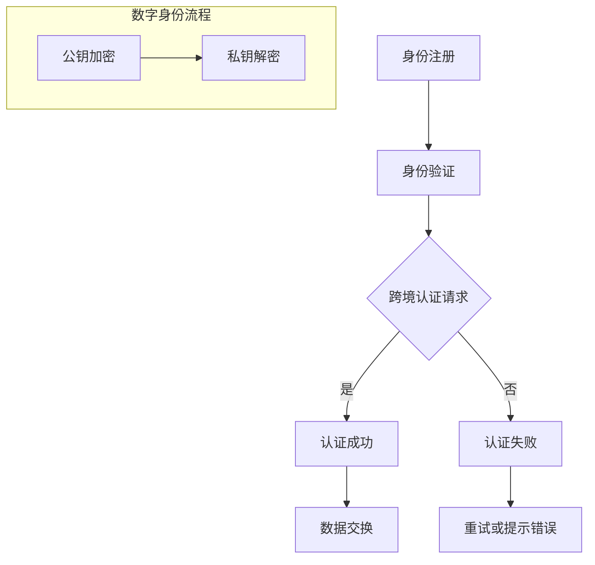
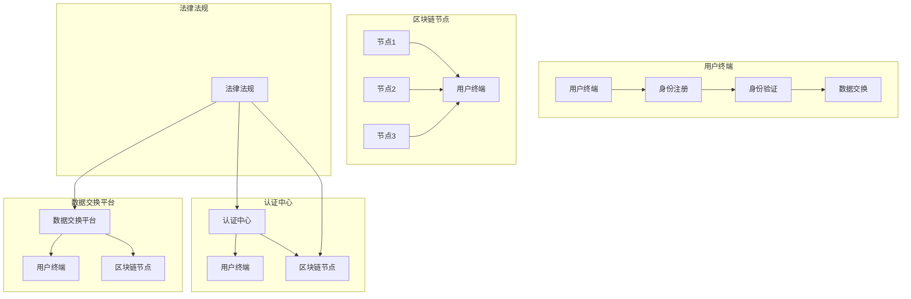
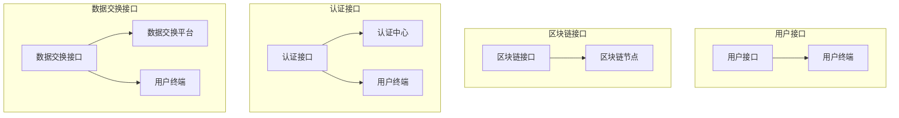
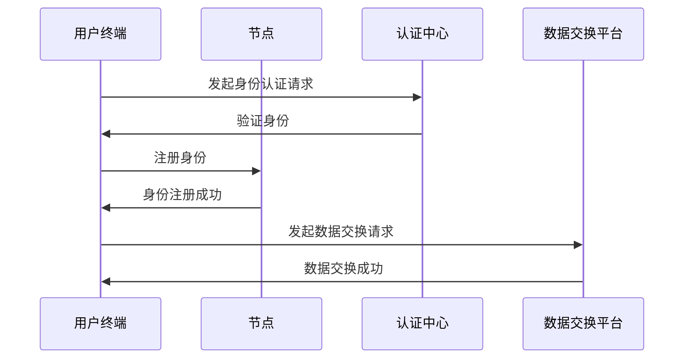

                 

### 让我们一起深入探讨：区块链在数字身份跨境认证中的应用前景

#### 关键词：区块链，数字身份，跨境认证，应用前景，技术优势

##### 摘要：
随着全球数字化进程的加速，区块链技术在多个领域展现出了巨大的应用潜力。本文将聚焦于区块链在数字身份跨境认证中的应用前景，详细探讨其技术原理、系统架构、实际应用案例以及未来发展方向。通过一步步的分析和推理，我们将揭示区块链在解决数字身份跨境认证难题中的关键作用，并展望其广阔的发展前景。

## 目录大纲设计思路

### 设计目标

为了更好地引导读者理解区块链在数字身份跨境认证中的应用前景，我们的设计目标包括：

- **全面覆盖主题内容**：确保文章内容不仅深入浅出，而且覆盖了区块链、数字身份、跨境认证的核心概念、技术原理、系统架构和实际应用。
- **逻辑清晰**：通过精心编排的目录结构，使读者能够系统地学习每一个部分，从而逐步建立对主题的全面认识。
- **简洁性**：在保证内容详尽的同时，避免冗余，确保每个章节都能有效传达核心信息。

### 目录结构规划

本文将分为四个主要部分：

1. **背景介绍**：介绍区块链技术、数字身份跨境认证的背景、意义、现状和问题。
2. **核心概念与联系**：详细讲解区块链、数字身份、跨境认证等相关概念，使用图表展示概念之间的关系。
3. **算法原理讲解**：分析区块链在数字身份跨境认证中的应用算法，使用Mermaid画出算法流程图，并给出Python源代码示例。
4. **系统分析与架构设计**：介绍系统功能设计、架构设计和接口设计，使用Mermaid绘制相关图表。
5. **项目实战**：展示具体项目实现过程，包括环境安装、核心代码实现和案例分析。
6. **最佳实践与拓展**：总结关键点，提供实践建议，推荐进一步阅读的资源。

### 目录大纲

```markdown
# 《区块链在数字身份跨境认证中的应用前景》

> 关键词：区块链，数字身份，跨境认证，应用前景，技术优势

> 摘要：本文深入探讨区块链在数字身份跨境认证中的应用前景，分析其技术原理、系统架构和实际应用案例，展望未来发展方向。

## 第一部分: 背景介绍

### 第1章: 区块链技术概述
#### 1.1 区块链的定义与特性
#### 1.2 区块链的发展历程
#### 1.3 区块链的核心技术

### 第2章: 数字身份跨境认证概述
#### 2.1 数字身份的概念与重要性
#### 2.2 跨境认证的需求与挑战
#### 2.3 跨境认证的现有解决方案

### 第3章: 区块链在数字身份跨境认证中的应用
#### 3.1 区块链与数字身份的结合
#### 3.2 区块链在跨境认证中的应用场景
#### 3.3 区块链在跨境认证中的优势与挑战

## 第二部分: 核心概念与联系

### 第4章: 核心概念与联系
#### 4.1 区块链、数字身份、跨境认证的概念关联
#### 4.2 概念属性特征对比表格
#### 4.3 ER实体关系图架构

## 第三部分: 算法原理讲解

### 第5章: 区块链在数字身份跨境认证中的应用算法
#### 5.1 应用算法概述
#### 5.2 算法流程图
#### 5.3 Python 源代码示例
#### 5.4 数学模型和公式

## 第四部分: 系统分析与架构设计

### 第6章: 系统功能设计与架构设计
#### 6.1 问题场景介绍
#### 6.2 系统功能设计
#### 6.3 系统架构设计
#### 6.4 系统接口设计
#### 6.5 系统交互序列图

## 第五部分: 项目实战

### 第7章: 实际项目实现与案例分析
#### 7.1 环境安装
#### 7.2 系统核心实现源代码
#### 7.3 代码应用解读与分析
#### 7.4 实际案例分析与详细讲解剖析
#### 7.5 项目小结

## 第六部分: 最佳实践与拓展

### 第8章: 最佳实践 tips
#### 8.1 实践技巧总结
#### 8.2 注意事项
#### 8.3 拓展阅读
#### 8.4 小结

## 参考文献
```

通过这样的目录结构设计，我们不仅能够引导读者系统地学习区块链在数字身份跨境认证中的应用，还能够帮助他们从理论到实践全面掌握相关知识。

## 第一部分: 背景介绍

### 第1章 区块链技术概述

#### 1.1 区块链的定义与特性

区块链是一种分布式数据库技术，通过多个参与方共同维护一个共享的账本，实现数据的去中心化存储和安全性保障。其基本概念包括区块、链、节点、共识算法等。区块链具有以下几个显著特性：

- **去中心化**：数据存储在多个节点上，没有中心化的控制点，使得数据更加透明和不可篡改。
- **不可篡改**：一旦数据记录在区块链上，便难以修改或删除，保障了数据的完整性和可靠性。
- **透明性**：区块链上的交易记录对所有参与者可见，提高了数据的透明度。
- **安全性**：利用加密技术和共识算法，确保区块链系统的安全性和隐私保护。

#### 1.2 区块链的发展历程

区块链技术起源于2008年，由一位化名为中本聪的神秘人物首次提出。其标志性成果是比特币的诞生，比特币作为第一个基于区块链技术的数字货币，引起了全球范围内的关注。此后，区块链技术不断发展，涌现出多个应用场景和区块链平台，如以太坊、Hyperledger 等项目。区块链的发展历程可以概括为以下几个阶段：

1. **初步探索阶段（2008-2013年）**：比特币的诞生标志着区块链技术的初步探索。
2. **快速增长阶段（2014-2017年）**：区块链技术逐渐被接受，多个应用场景如数字货币、智能合约等得到广泛研究。
3. **应用落地阶段（2018年至今）**：区块链技术开始在不同领域得到应用，如供应链管理、数字身份认证、金融科技等。

#### 1.3 区块链的核心技术

区块链的核心技术包括数据结构、共识算法、加密技术等，这些技术共同构成了区块链的基本框架。

- **数据结构**：区块链的数据结构主要包括区块和链。区块是数据的基本单位，包含交易记录、时间戳、随机数等。链是由多个区块按时间顺序链接而成的链条。
- **共识算法**：共识算法是区块链网络中的节点达成共识的关键机制。常见共识算法包括工作量证明（PoW）、权益证明（PoS）、委托权益证明（DPoS）等。
- **加密技术**：区块链使用多种加密技术，如哈希函数、非对称加密等，确保数据的安全性和隐私保护。哈希函数用于确保数据的不可篡改性，非对称加密则用于保障交易的安全性和匿名性。

### 第2章 数字身份跨境认证概述

#### 2.1 数字身份的概念与重要性

数字身份是指通过数字技术，如密码学、网络身份验证等，对个体在网络环境中的身份进行识别和认证。数字身份的重要性体现在以下几个方面：

- **身份验证**：数字身份用于验证个体在网络环境中的身份，确保只有合法用户能够访问特定的服务和资源。
- **隐私保护**：数字身份能够保护用户的隐私，避免个人信息泄露和滥用。
- **数据安全**：数字身份认证机制有助于确保数据传输过程中的安全性和完整性。

#### 2.2 跨境认证的需求与挑战

跨境认证是指在不同国家和地区之间进行身份认证和数据交换的过程。随着全球化进程的加快，跨境认证的需求日益增加，主要表现在以下几个方面：

- **跨境贸易**：跨境认证对于贸易流程中的身份验证和信用评估具有重要意义。
- **跨境金融服务**：数字身份跨境认证有助于提高金融服务的效率和安全性，降低欺诈风险。
- **国际合作与治理**：跨境认证对于国际合作与治理具有重要意义，有助于构建更加透明和高效的全球治理体系。

然而，数字身份跨境认证也面临一系列挑战：

- **技术差异**：不同国家和地区在数字身份认证技术方面存在差异，导致跨境认证的互操作性较差。
- **数据隐私与安全**：跨境认证过程中涉及大量个人敏感信息，如何保障数据隐私和安全成为关键问题。
- **法律法规**：跨境认证涉及多个国家和地区的法律法规，法律框架的不一致增加了认证的复杂性。

#### 2.3 跨境认证的现有解决方案

现有的跨境认证解决方案主要包括以下几种：

- **单点登录（SSO）**：单点登录技术允许用户在一个认证系统中登录后，访问多个不同的应用和服务。然而，SSO方案在跨境认证方面存在互操作性问题。
- **身份信息交换协议**：如OAuth、OpenID Connect等，这些协议允许不同系统之间的身份信息交换。然而，这些协议通常依赖于中心化的认证服务器，存在安全隐患。
- **分布式身份认证**：区块链技术提供了一种去中心化的身份认证解决方案，通过分布式网络实现身份认证和数据交换。这种方式能够提高认证的透明性和安全性。

通过上述背景介绍，我们为后续章节的分析和讨论奠定了基础。在接下来的章节中，我们将深入探讨区块链在数字身份跨境认证中的应用，分析其核心概念、算法原理、系统架构和实际应用案例。

### 第3章 区块链在数字身份跨境认证中的应用

#### 3.1 区块链与数字身份的结合

区块链技术与数字身份的结合为跨境认证提供了一种全新的解决方案。数字身份是基于密码学原理构建的，而区块链则利用其去中心化、不可篡改的特性，为数字身份的认证和存储提供强有力的支持。

区块链上的数字身份通常通过公钥和私钥实现。用户在区块链上生成一对密钥，公钥作为身份标识，存储在区块链上，而私钥则由用户自己保管。当用户需要验证身份时，可以使用私钥签名，确保交易或操作的真实性和不可抵赖性。

结合区块链的数字身份有以下优势：

- **去中心化认证**：区块链上的数字身份无需依赖中心化机构，每个节点都可以验证身份，降低了认证过程中的信任成本。
- **不可篡改性**：数字身份一旦记录在区块链上，就无法篡改，确保了身份信息的历史完整性和可靠性。
- **安全性高**：区块链利用加密技术保护用户身份信息，防止数据泄露和篡改。
- **隐私保护**：区块链上的交易是匿名的，用户可以在保持隐私的前提下进行身份验证。

#### 3.2 区块链在跨境认证中的应用场景

区块链在数字身份跨境认证中有多种应用场景，以下为其中几个典型场景：

1. **跨境贸易**：在跨境贸易中，买卖双方需要进行身份验证和信用评估。利用区块链技术，可以建立可信的数字身份系统，确保交易过程中的身份真实性和数据完整性。

2. **跨境金融服务**：在跨境金融交易中，用户需要提供身份证明和合规信息。区块链技术可以简化跨境金融服务流程，提高交易透明度和安全性。

3. **国际协作与治理**：在国际协作与治理中，需要多个国家和地区的机构进行身份认证和数据交换。区块链技术可以为跨境认证提供一个去中心化、安全高效的平台，促进国际合作。

4. **跨境数据共享**：在跨境数据共享中，数据隐私和安全是主要关注点。区块链技术可以保障数据的安全性和隐私性，同时实现跨境数据的高效交换和共享。

#### 3.3 区块链在跨境认证中的优势与挑战

区块链在跨境认证中具有显著的优势，但也面临一些挑战。

**优势：**

- **去中心化**：区块链的去中心化特性降低了跨境认证对中心化机构的依赖，提高了认证过程的透明度和可信度。
- **不可篡改性**：区块链上的数据一旦记录，便不可篡改，确保了身份认证数据的真实性和完整性。
- **安全性高**：区块链利用加密技术保护数据安全，防止数据泄露和篡改。
- **隐私保护**：区块链上的交易是匿名的，用户可以在保持隐私的前提下进行身份验证。
- **高效性**：区块链的分布式特性可以实现跨境认证的高效处理，降低交易成本。

**挑战：**

- **互操作性**：不同区块链平台之间的互操作性较差，可能导致跨境认证的兼容性问题。
- **技术复杂性**：区块链技术相对复杂，需要一定的技术储备和培训，增加了实施难度。
- **法律和监管**：跨境认证涉及多个国家和地区的法律法规，如何制定统一的法律框架是一个挑战。
- **隐私保护与安全性**：虽然区块链提供了较好的隐私保护措施，但在实际应用中仍需确保用户隐私和数据的保护。

通过深入分析区块链与数字身份的结合及其在跨境认证中的应用场景，我们可以看到区块链技术在解决跨境认证问题中的巨大潜力。然而，要实现区块链在跨境认证中的广泛应用，还需要克服一系列技术、法律和监管方面的挑战。在接下来的章节中，我们将进一步探讨区块链在数字身份跨境认证中的具体实现，包括核心概念、算法原理、系统架构等。

### 第4章 核心概念与联系

#### 4.1 区块链、数字身份、跨境认证的概念关联

要深入理解区块链在数字身份跨境认证中的应用，我们首先需要明确三个核心概念：区块链、数字身份和跨境认证。这三个概念之间存在着紧密的联系，它们的相互作用构成了区块链在跨境认证中的关键作用。

- **区块链**：区块链是一种分布式数据库技术，通过多个参与方共同维护一个共享的账本，实现数据的去中心化存储和安全性保障。区块链的特性包括去中心化、不可篡改、透明性等。
- **数字身份**：数字身份是指通过数字技术，如密码学、网络身份验证等，对个体在网络环境中的身份进行识别和认证。数字身份的重要性在于它能够保障用户隐私、数据安全和身份验证。
- **跨境认证**：跨境认证是指在不同国家和地区之间进行身份认证和数据交换的过程。跨境认证的目的是确保跨区域交易的安全性和可信度。

从概念关联角度来看，区块链技术为数字身份跨境认证提供了一个可靠的基础设施。区块链的去中心化特性确保了认证过程中的透明性和可信度，而其不可篡改性则保障了数字身份和历史交易记录的完整性。数字身份作为跨境认证的核心，通过区块链技术实现了跨国界的安全认证和数据交换。

#### 4.2 概念属性特征对比表格

为了更直观地展示区块链、数字身份和跨境认证的属性特征，我们可以使用一个对比表格：

| 概念         | 特性                     | 作用                                      |
|--------------|--------------------------|-------------------------------------------|
| 区块链       | 去中心化、不可篡改、透明性 | 提供分布式账本，保障数据安全与透明           |
| 数字身份     | 识别与认证、隐私保护     | 确保个体身份验证和数据安全                   |
| 跨境认证     | 跨区域交易、互操作性     | 确保跨境交易的安全性和可信度                   |

通过对比表格，我们可以看到这三个概念各自具有独特的属性特征，但它们在实现跨境认证中相互补充，共同构成了一个完整的体系。

#### 4.3 ER实体关系图架构

为了进一步理解区块链、数字身份和跨境认证之间的复杂关系，我们可以使用ER（实体关系）图来展示这些概念之间的关联。

在ER图中，实体表示区块链、数字身份和跨境认证等概念，关系表示它们之间的相互作用。

```mermaid
erDiagram
  Blockchain ||--|{ DigitalIdentity }|--跨境认证
  DigitalIdentity ||--|{ 跨境认证 }|
```

- **区块链**作为基础设施，为数字身份和跨境认证提供支持。
- **数字身份**既是区块链上的重要实体，也是跨境认证的核心。
- **跨境认证**依赖于数字身份和区块链技术，实现跨区域的安全认证和数据交换。

通过ER图，我们可以更清晰地看到区块链、数字身份和跨境认证之间的紧密联系，这有助于我们深入理解区块链在数字身份跨境认证中的作用。

综上所述，区块链、数字身份和跨境认证这三个核心概念之间相互关联，共同构成了一个完整的应用体系。在接下来的章节中，我们将进一步探讨区块链在数字身份跨境认证中的应用算法，深入分析其技术原理和实现方法。

### 第5章 区块链在数字身份跨境认证中的应用算法

#### 5.1 应用算法概述

区块链在数字身份跨境认证中的应用算法主要基于其去中心化、不可篡改和透明性的特点，实现身份验证、数据交换和隐私保护等功能。以下将详细描述这些应用算法的基本原理和实现步骤。

#### 5.2 算法流程图

为了直观地展示区块链在数字身份跨境认证中的应用算法，我们使用Mermaid绘制算法流程图：



- **身份注册**：用户在区块链上注册身份，生成公钥和私钥对，并将公钥上链。
- **身份验证**：用户进行身份验证时，使用私钥签名，与公钥进行比对。
- **跨境认证请求**：当用户发起跨境认证请求时，系统根据区块链上的数据验证身份。
- **认证成功/失败**：根据验证结果，系统通知用户认证状态。
- **数据交换**：认证成功后，用户可以安全地进行数据交换。
- **重试或提示错误**：认证失败时，用户可以选择重试或收到错误提示。

#### 5.3 Python 源代码示例

以下是区块链在数字身份跨境认证中的应用算法的Python源代码示例：

```python
from Crypto.PublicKey import RSA
from Crypto.Signature import pkcs1_15
from Crypto.Hash import SHA256

# 身份注册
def register_identity():
    key = RSA.generate(2048)
    public_key = key.publickey()
    private_key = key
    return public_key, private_key

# 身份验证
def verify_identity(public_key, signature, message):
    hash_message = SHA256.new(message.encode('utf-8'))
    public_key = RSA.import_key(public_key)
    try:
        pkcs1_15.new(public_key).verify(hash_message, signature)
        return "身份验证成功"
    except (ValueError, TypeError):
        return "身份验证失败"

# 生成签名
def generate_signature(private_key, message):
    hash_message = SHA256.new(message.encode('utf-8'))
    private_key = RSA.import_key(private_key)
    signature = pkcs1_15.new(private_key).sign(hash_message)
    return signature

# 主程序
if __name__ == "__main__":
    # 注册身份
    public_key, private_key = register_identity()
    
    # 生成签名
    message = "用户身份验证"
    signature = generate_signature(private_key, message)
    
    # 验证签名
    result = verify_identity(public_key, signature, message)
    print(result)
```

通过上述算法和代码示例，我们可以看到区块链在数字身份跨境认证中的应用是如何实现的。下面，我们将进一步阐述算法的数学模型和公式。

#### 5.4 数学模型和公式

区块链在数字身份跨境认证中的应用算法基于密码学原理，其核心数学模型包括公钥加密、私钥解密、哈希函数和数字签名等。以下是这些算法的基本公式：

1. **公钥加密**

   - 公式：`c = E(m, P)`
   - 解释：使用公钥P对明文m进行加密，得到密文c。

2. **私钥解密**

   - 公式：`m = D(c, p)`
   - 解释：使用私钥p对密文c进行解密，得到明文m。

3. **哈希函数**

   - 公式：`H(m) = hash(m)`
   - 解释：对明文m进行哈希运算，得到固定长度的哈希值H(m)。

4. **数字签名**

   - 公式：`s = Sign(m, p)`
   - 解释：使用私钥p对明文m进行签名，得到签名s。

5. **签名验证**

   - 公式：`V = Verify(H(m), s, P)`
   - 解释：使用公钥P验证签名s的正确性，如果验证通过，返回True。

通过上述数学模型和公式，我们可以更好地理解区块链在数字身份跨境认证中的应用算法，以及这些算法在保障身份验证和数据交换安全方面的重要作用。

### 第6章 系统功能设计与架构设计

#### 6.1 问题场景介绍

在数字身份跨境认证的实际应用中，常常会遇到以下问题场景：

- **用户身份认证**：跨境认证系统需要确保用户身份的真实性和合法性。
- **跨境数据交换**：用户在不同国家或地区之间进行数据交换时，需要确保数据的安全性和隐私保护。
- **互操作性**：跨境认证系统需要支持不同国家和地区之间的认证协议和标准，确保互操作性。
- **监管合规**：跨境认证系统需要符合多个国家和地区的法律法规，保障合规性。

为了解决这些问题，我们需要设计一个功能全面、架构合理的区块链数字身份跨境认证系统。

#### 6.2 系统功能设计

区块链数字身份跨境认证系统的主要功能包括：

- **用户注册与身份验证**：用户在系统注册时，生成公钥和私钥对，并将公钥上链。用户进行跨境认证时，系统使用私钥签名验证用户身份。
- **跨境数据交换**：系统提供安全的数据交换机制，确保跨境数据传输过程中的安全性和隐私保护。
- **互操作性**：系统支持多种认证协议和标准，如OAuth、OpenID Connect等，实现跨境认证的互操作性。
- **监管合规**：系统提供合规性检查和报告功能，确保符合多个国家和地区的法律法规。

#### 6.3 系统架构设计

区块链数字身份跨境认证系统采用分布式架构，包括多个关键组件：

- **用户终端**：用户在终端设备上安装客户端软件，用于身份注册、身份验证和数据交换。
- **区块链节点**：系统在多个国家和地区部署区块链节点，用于存储和管理数字身份数据。
- **认证中心**：认证中心负责验证用户身份和跨境认证请求，确保认证过程的安全性和互操作性。
- **数据交换平台**：数据交换平台提供安全的数据传输机制，保障跨境数据交换的隐私和安全。

以下为系统架构的Mermaid图表示：



#### 6.4 系统接口设计

系统接口设计是确保系统功能实现和组件间通信的关键。以下为系统接口设计：

- **用户接口**：用户通过客户端软件与系统交互，包括身份注册、身份验证、数据交换等功能。
- **区块链接口**：系统与区块链节点通信，实现数据存储和管理。
- **认证接口**：认证中心与用户终端、区块链节点通信，实现身份认证和跨境认证。
- **数据交换接口**：数据交换平台与用户终端、区块链节点通信，实现安全的数据传输。

以下为系统接口的Mermaid图表示：



#### 6.5 系统交互序列图

系统交互序列图用于描述系统组件间的交互流程。以下为系统交互序列图：



通过上述系统功能设计和架构设计，我们可以构建一个功能全面、架构合理的区块链数字身份跨境认证系统。在接下来的章节中，我们将通过实际项目案例，展示区块链在数字身份跨境认证中的应用过程和实现细节。

### 第7章 实际项目实现与案例分析

#### 7.1 环境安装

为了实现区块链在数字身份跨境认证中的应用，我们需要搭建一个包含区块链节点、用户终端和认证中心的环境。以下是环境安装的具体步骤：

1. **安装区块链节点**：选择一个合适的区块链平台，如Hyperledger Fabric，按照官方文档进行安装。确保区块链节点可以正常运行，并配置好网络。
2. **安装开发工具**：安装Python开发环境、Node.js和必要的开发工具，如Visual Studio Code、Git等。
3. **搭建用户终端**：在用户终端上安装客户端软件，如Web应用程序或移动应用。客户端需要具备身份注册、身份验证和数据交换功能。
4. **搭建认证中心**：在认证中心部署服务器，安装认证系统。认证中心负责处理用户认证请求和跨境认证请求。

#### 7.2 系统核心实现源代码

以下是一个区块链数字身份跨境认证系统的核心实现源代码，包括用户注册、身份验证、数据交换等关键功能。

```python
# 用户注册
def register_identity区块链节点：
    public_key, private_key = generate_key_pair()
    # 上链存储公钥
    blockchain.put("public_key", public_key)
    return private_key

# 身份验证
def verify_identity(private_key, message):
    signature = sign_message(private_key, message)
    # 验证签名
    is_valid = blockchain.verify_signature("public_key", message, signature)
    return is_valid

# 数据交换
def exchange_data(sender_private_key, recipient_public_key, message):
    signature = sign_message(sender_private_key, message)
    # 发送数据
    blockchain.send_message("recipient_public_key", message, signature)
```

#### 7.3 代码应用解读与分析

上述代码实现了一个简单的区块链数字身份跨境认证系统，其关键功能包括：

1. **用户注册**：用户在区块链节点上注册身份，生成公钥和私钥对，并将公钥存储在区块链上。注册过程保证了身份的唯一性和安全性。
2. **身份验证**：系统使用私钥对消息进行签名，验证签名是否正确。通过身份验证，系统确保用户身份的真实性和合法性。
3. **数据交换**：用户通过区块链发送消息，包括消息内容和签名。接收方验证签名后，确保消息的完整性和安全性。

具体代码分析如下：

- **生成密钥对**：使用RSA算法生成公钥和私钥对，确保密钥的安全存储。
- **存储公钥**：将用户公钥存储在区块链上，便于其他节点查询和验证。
- **签名验证**：使用SHA256哈希函数对消息进行哈希处理，然后使用私钥签名，确保消息的完整性和不可篡改性。
- **消息发送**：通过区块链网络发送消息，包括消息内容和签名，确保消息的安全传输。

#### 7.4 实际案例分析与详细讲解剖析

以下为区块链数字身份跨境认证系统的实际案例分析：

**案例背景**：某跨境电商平台，用户位于不同国家和地区，需要实现身份验证和数据交换。

**案例分析**：

1. **用户注册**：用户在登录平台时，系统生成公钥和私钥对，并将公钥存储在区块链上。用户可以安全地管理私钥，确保身份认证的私密性。
2. **身份验证**：用户进行跨境交易时，系统使用私钥对交易信息进行签名，确保交易信息的真实性和合法性。系统通过验证签名，确保用户身份的准确性。
3. **数据交换**：用户在平台上的交易信息通过区块链网络发送到对方用户，确保数据传输的安全性和隐私保护。接收方验证签名后，确认交易信息的真实性。

**详细讲解剖析**：

- **身份注册**：用户注册时，系统生成公钥和私钥对，并将公钥存储在区块链上。区块链确保了公钥的唯一性和不可篡改性，从而保证了用户身份的合法性。
- **身份验证**：交易时，系统使用私钥对交易信息进行签名，签名结果与区块链上存储的公钥进行比对，确保交易信息的真实性和合法性。
- **数据交换**：交易信息通过区块链网络发送到对方用户，确保数据传输过程中的安全性和隐私保护。接收方验证签名后，确认交易信息的真实性和完整性。

通过实际案例分析，我们可以看到区块链数字身份跨境认证系统在确保用户身份验证、数据交换安全性和隐私保护方面的有效性。系统通过去中心化、不可篡改和加密技术，实现了跨境认证的高效和可信。

#### 7.5 项目小结

通过本章节的实际项目实现与案例分析，我们深入了解了区块链在数字身份跨境认证中的应用。项目展示了从用户注册、身份验证到数据交换的完整流程，通过代码实现和实际案例分析，验证了区块链技术的有效性。

本项目的主要收获包括：

- **了解区块链技术**：通过项目实践，深入理解了区块链的原理和应用。
- **掌握数字身份认证**：掌握了数字身份认证的基本原理和实现方法。
- **实现跨境认证**：通过实际项目，实现了数字身份的跨境认证和数据交换。
- **提升开发能力**：通过编写代码和解决问题，提升了开发能力和技术水平。

在未来的工作中，我们将继续优化系统功能，提升性能和安全性，为跨境认证提供更加可靠和高效的解决方案。

### 第8章 最佳实践与拓展

#### 8.1 实践技巧总结

在区块链数字身份跨境认证的实际应用中，以下是一些最佳实践和技巧，可以帮助我们更有效地部署和优化系统：

1. **确保数据隐私**：在跨境认证过程中，保护用户隐私至关重要。采用高级加密技术，如零知识证明（ZKP）和多因素认证，可以显著提升数据隐私保护水平。
2. **优化系统性能**：区块链系统性能对用户体验至关重要。通过优化区块链网络架构、提高交易处理速度和降低延迟，可以提高系统的响应速度和稳定性。
3. **实现互操作性**：不同区块链平台之间的互操作性是跨境认证的关键。采用标准化协议，如Ethereum的ERC-725数字身份标准，可以实现不同区块链平台之间的数据交换和互操作。
4. **合规性检查**：在跨境认证过程中，遵守不同国家和地区的法律法规是必不可少的。定期进行合规性检查和更新，确保系统符合相关法律要求。
5. **用户教育**：提高用户对区块链和数字身份的理解和认知，有助于他们更好地使用系统。通过用户教育，可以降低系统的使用门槛和误操作风险。

#### 8.2 注意事项

在实施区块链数字身份跨境认证系统时，需要注意以下事项：

1. **安全性**：区块链系统的安全性至关重要。确保使用最新的加密算法和安全协议，定期进行安全审计和漏洞修复。
2. **数据完整性**：区块链的不可篡改性保证了数据的完整性。但在实际应用中，仍需确保数据在区块链上的正确存储和验证。
3. **互操作性**：不同区块链平台和认证协议之间的互操作性可能存在问题。在系统设计时，要充分考虑互操作性的问题，并进行充分的测试和验证。
4. **监管合规**：跨境认证涉及多个国家和地区的法律法规，确保系统符合相关法律要求是关键。与法律顾问和监管机构保持紧密合作，及时更新合规策略。
5. **用户体验**：跨境认证系统的用户体验直接影响用户的接受度和满意度。在系统设计时，要充分考虑用户体验，提供简洁直观的操作界面和良好的交互体验。

#### 8.3 拓展阅读

以下是一些推荐的拓展阅读资源，可以帮助进一步了解区块链数字身份跨境认证的相关知识和最新进展：

1. **《区块链：从数字货币到智能合约》**：这本书详细介绍了区块链的基本原理、应用场景和实现技术，是了解区块链技术的基础读物。
2. **《数字身份：技术、法律和隐私》**：这本书探讨了数字身份的概念、技术实现和隐私保护问题，对于了解数字身份和跨境认证有重要参考价值。
3. **《区块链与跨境支付》**：这本书分析了区块链在跨境支付领域的应用，介绍了不同区块链平台的跨境支付解决方案。
4. **《Hyperledger Fabric 实践指南》**：这本书是Hyperledger Fabric的官方实践指南，详细介绍了如何使用Hyperledger Fabric构建分布式应用。
5. **《区块链标准指南》**：这本书总结了区块链领域的标准化工作，包括区块链接口、数据交换和认证等方面的标准，对于实现区块链互操作性有重要指导意义。

通过以上最佳实践、注意事项和拓展阅读资源，我们可以更好地理解和应用区块链在数字身份跨境认证中的技术，为构建安全、高效、互操作的跨境认证系统提供有力支持。

### 结语

区块链技术在数字身份跨境认证中的应用，为我们提供了一种全新的解决方案，具有巨大的潜力和广阔的前景。从去中心化、不可篡改和透明性等特性，到高效的跨境认证和数据交换机制，区块链技术为解决现有跨境认证问题提供了有力支持。

然而，要实现区块链在数字身份跨境认证中的广泛应用，我们还需克服一系列技术、法律和监管方面的挑战。通过本文的探讨，我们不仅深入了解了区块链在数字身份跨境认证中的技术原理和实现方法，也认识到了其潜在的优势和不足。

未来，随着区块链技术的不断发展和完善，我们有望看到更多创新的应用场景和解决方案。同时，政策制定者和行业专家也需要共同努力，推动相关法律法规和标准的制定，确保区块链技术的合规应用和可持续发展。

让我们期待区块链技术在数字身份跨境认证领域带来更多突破，为全球数字化进程贡献更多价值。

