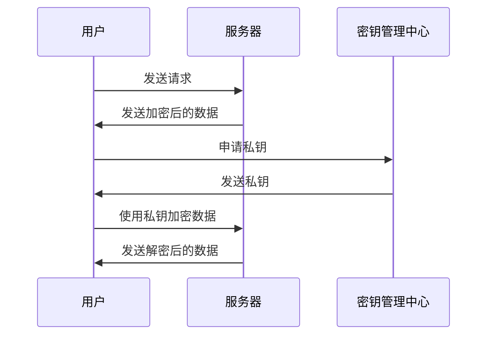
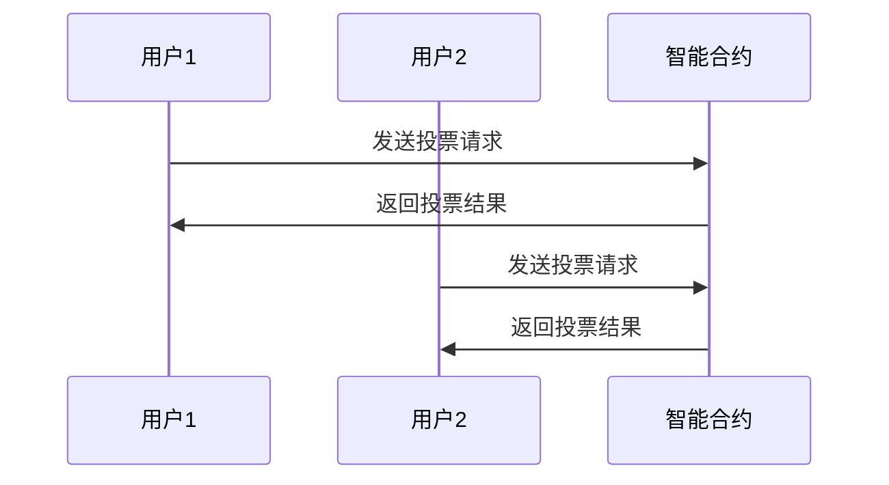
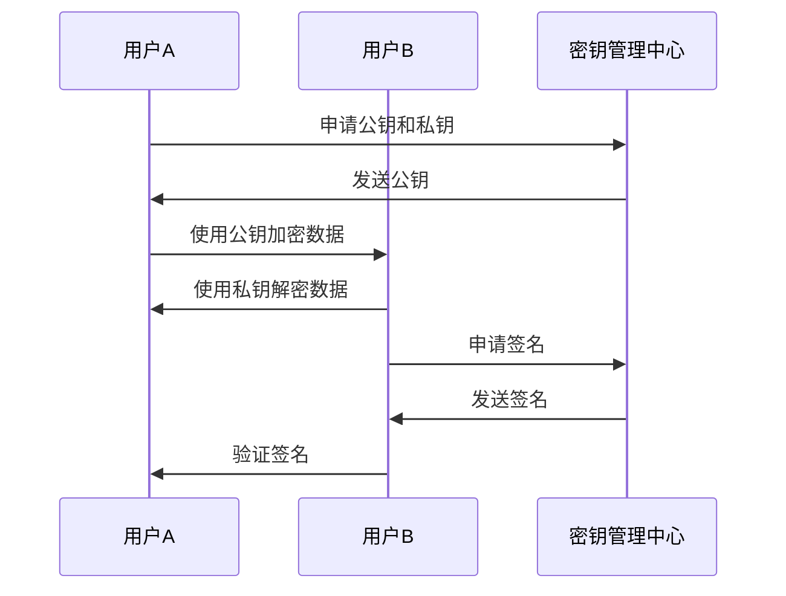
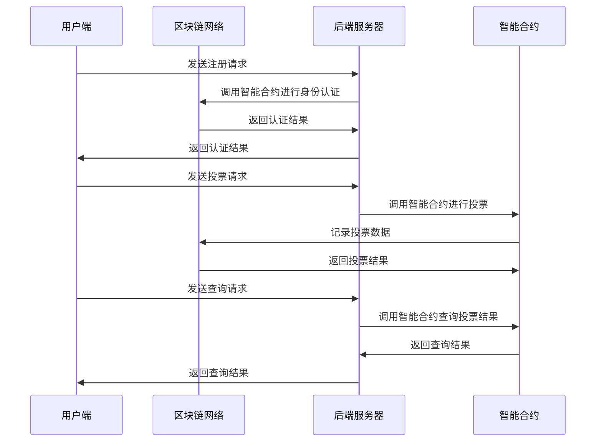

                 

### 第一部分：区块链与电子投票系统概述

#### 第1章：区块链技术基础

**1.1 区块链的定义与特点**

区块链（Blockchain）是一种去中心化的分布式数据库技术，由多个按照时间顺序排列的区块组成。每个区块包含了最新的交易记录，并通过密码学方法与之前的区块相连，形成一个不可篡改的链条。区块链技术的核心特点包括：

- **去中心化**：区块链上的数据存储和验证是分布式的，不需要中央机构进行控制。这意味着区块链上的每个节点都可以参与数据的存储和验证，提高了系统的容错能力和抗攻击能力。
- **不可篡改**：一旦数据被记录到区块链上，就难以篡改。这是由于区块链采用了密码学方法，确保了数据在传输和存储过程中的安全性和完整性。
- **透明**：区块链上的数据是公开的，可以随时查询和验证。这增加了系统的透明度，提高了公众对系统运作的信任度。

**1.2 区块链的工作原理**

区块链的工作原理可以概括为以下四个步骤：

1. **交易记录生成**：用户在区块链上进行交易，例如发送数字货币或其他价值信息。交易记录会被生成，并包含交易的具体内容和相关的用户信息。
2. **交易验证**：交易记录需要通过网络中的多个节点进行验证。验证过程包括检查交易的有效性和确保交易记录没有被重复使用。
3. **区块创建**：验证通过后的交易记录会被打包成一个区块，包含一定数量的交易记录。区块会附加一个时间戳和上一个区块的哈希值，形成一个链接。
4. **区块验证与添加**：新创建的区块会传播到网络中的其他节点，其他节点会验证该区块的有效性。如果验证通过，该区块会被添加到区块链上，形成新的链条。

**1.3 区块链的核心技术**

区块链的核心技术包括：

- **密码学**：区块链采用了多种密码学技术，如哈希函数、数字签名和非对称加密，确保数据的安全性和完整性。
- **共识算法**：共识算法用于确保区块链网络中的数据一致性。常见的共识算法包括工作量证明（PoW）、权益证明（PoS）和委托权益证明（DPoS）等。
- **智能合约**：智能合约是区块链上的自动执行程序，可以在满足特定条件时自动执行预定的操作。智能合约可以用于自动化执行投票规则和统计投票结果等。

**1.4 区块链在电子投票系统中的应用潜力**

区块链技术在电子投票系统中的应用潜力主要体现在以下几个方面：

- **安全性**：区块链的加密技术和去中心化特性，可以有效防止投票过程中的恶意攻击和数据篡改。
- **隐私保护**：区块链的匿名投票机制，可以保护投票者的隐私，避免被第三方跟踪和泄露。
- **透明度**：区块链的透明特性，可以让投票过程全程可查，提高公众对选举的信任度。
- **可追溯性**：区块链上的数据记录是公开的，可以随时查询和验证，确保选举过程的透明和公正。

通过引入区块链技术，电子投票系统可以变得更加安全、透明和可信，从而更好地满足现代社会对选举过程的要求。

----------------------------------------------------------------

#### 第2章：电子投票系统概述

**2.1 电子投票系统的定义与作用**

电子投票系统是一种利用计算机技术和互联网进行投票的系统，其目的是通过数字化的方式，提高投票的效率和安全性。电子投票系统的定义主要包括以下几个方面：

- **定义**：电子投票系统是一种基于计算机技术和互联网的投票系统，它通过数字化手段实现选举过程中的投票、计票和结果统计等功能。
- **作用**：电子投票系统的核心作用是提高投票的效率和安全性。通过电子投票系统，可以简化投票过程，减少人工操作，提高计票速度和准确性，同时也能增强选举过程的透明度和可信度。

电子投票系统的主要作用包括：

- **提高投票效率**：电子投票系统可以自动化处理投票过程，减少人工干预，提高投票效率。
- **增强安全性**：电子投票系统通过加密技术和身份认证等手段，提高投票过程的安全性，防止恶意攻击和数据篡改。
- **提高计票准确性**：电子投票系统可以自动统计投票结果，减少人为错误，提高计票准确性。
- **增强透明度**：电子投票系统通过公开投票过程和结果，增强选举过程的透明度，提高公众对选举的信任度。

**2.2 电子投票系统的现状与问题**

目前，电子投票系统在许多国家和地区已经得到广泛应用，但同时也面临着一些问题和挑战：

- **安全性问题**：电子投票系统在安全性方面存在一些潜在的风险，如网络攻击、数据泄露和系统漏洞等。这些问题可能导致选举结果被篡改，影响选举的公正性。
- **隐私保护问题**：在电子投票系统中，如何保护投票者的隐私是一个重要问题。如果投票者的身份和投票记录被泄露，可能会对他们的隐私和安全造成威胁。
- **技术挑战**：电子投票系统需要使用复杂的计算机技术和互联网技术，这要求系统开发者和维护者具备较高的技术水平。同时，系统的稳定性和可靠性也是电子投票系统面临的挑战之一。
- **公众信任问题**：由于电子投票系统在技术上的复杂性和潜在风险，公众对电子投票系统的信任度可能较低。这需要通过提高系统的透明度和可信度来逐步建立公众的信任。

**2.3 电子投票系统的发展趋势**

随着技术的不断进步和应用场景的扩大，电子投票系统的发展趋势包括：

- **技术提升**：随着计算机技术和互联网技术的不断发展，电子投票系统将变得更加高效、安全和可靠。例如，区块链技术的引入可以进一步提高系统的安全性。
- **普及应用**：随着人们对电子投票系统的接受程度提高，电子投票系统将在更多的国家和地区得到广泛应用。特别是在选举和民意调查等场合，电子投票系统将发挥越来越重要的作用。
- **隐私保护**：随着对隐私保护要求的提高，电子投票系统将更加注重保护投票者的隐私。通过引入加密技术和匿名投票机制等手段，可以更好地保护投票者的隐私和安全。
- **标准化和法规完善**：为了确保电子投票系统的规范化和标准化，许多国家和地区正在制定相关法规和标准。这将为电子投票系统的发展提供法律和制度保障。

通过不断的技术创新和应用推广，电子投票系统将更好地满足现代社会对选举效率和安全性的要求，为构建更加透明和公正的选举制度贡献力量。

----------------------------------------------------------------

#### 第3章：区块链技术在电子投票系统中的应用案例

**3.1 案例一：加密投票**

加密投票是区块链技术在电子投票系统中的一个重要应用案例。其核心思想是利用区块链的加密技术，确保投票过程中的数据安全性和隐私保护。

**工作原理**：

1. **注册与认证**：用户首先需要注册并经过身份认证，以确保投票者的身份真实有效。
2. **加密投票**：在投票过程中，用户的投票会被加密，确保只有拥有解密密钥的用户才能解密和查看投票内容。
3. **投票记录**：加密后的投票会被记录到区块链上，形成一个不可篡改的投票记录。
4. **投票统计**：通过区块链上的智能合约，可以自动化统计投票结果，确保统计过程的透明和公正。

**优点**：

- **安全性高**：加密投票可以防止投票数据的泄露和篡改，提高了系统的安全性。
- **隐私保护**：加密技术确保了投票者的隐私，避免了投票内容被第三方跟踪和泄露。
- **透明性**：区块链上的投票记录是公开的，可以随时查询和验证，提高了系统的透明度。

**应用场景**：

加密投票适用于需要高度保密和安全的投票场景，如企业内部选举、政府选举等。

**3.2 案例二：透明选举过程**

透明选举过程是区块链技术在电子投票系统的另一个重要应用案例。其核心思想是利用区块链的透明特性，确保选举过程的公开和公正。

**工作原理**：

1. **选举注册**：所有参与选举的人员和选民都需要在区块链上进行注册，确保身份真实有效。
2. **投票记录**：在投票过程中，每个选民的投票记录都会被记录到区块链上，形成一个公开的投票记录。
3. **计票过程**：通过区块链上的智能合约，可以自动化执行计票过程，确保计票结果的公正和透明。
4. **结果公布**：选举结果会通过区块链公开，所有选民可以随时查询和验证。

**优点**：

- **透明度高**：区块链上的投票记录和选举结果是公开的，可以随时查询和验证，提高了选举的透明度。
- **公正性强**：区块链的去中心化特性，确保了选举结果的公正性，防止了选举过程中的舞弊行为。
- **信任度高**：通过透明和公正的选举过程，可以提高公众对选举结果的信任度。

**应用场景**：

透明选举过程适用于所有需要公开和公正选举的场景，如政府选举、企业选举等。

**3.3 案例三：防止选举欺诈**

防止选举欺诈是区块链技术在电子投票系统中的一个关键应用。其核心思想是利用区块链的不可篡改特性，确保选举结果的真实性和可信度。

**工作原理**：

1. **投票数据加密**：在投票过程中，投票数据会被加密，确保只有授权的用户才能解密和查看。
2. **投票记录**：加密后的投票数据会被记录到区块链上，形成一个不可篡改的投票记录。
3. **选举数据验证**：通过区块链的智能合约，可以自动化验证选举数据的完整性和真实性。
4. **结果公布**：选举结果会通过区块链公开，所有选民可以随时查询和验证。

**优点**：

- **数据安全性高**：区块链的加密技术和不可篡改特性，确保了投票数据的安全性，防止了选举欺诈行为。
- **结果可信度高**：通过区块链的公开记录和验证，选举结果的真实性和可信度得到了保障。
- **透明性强**：区块链上的投票记录和选举结果是公开的，可以随时查询和验证，提高了选举的透明度。

**应用场景**：

防止选举欺诈适用于所有需要防止选举欺诈的选举场景，如政府选举、企业选举等。

通过这些应用案例，可以看出区块链技术在电子投票系统中的应用，可以显著提高选举的安全性和透明度，防止选举过程中的欺诈行为，为构建公正和透明的选举制度提供了有力支持。

----------------------------------------------------------------

#### 第4章：区块链在电子投票系统中的关键技术

**4.1 加密技术**

加密技术是区块链在电子投票系统中不可或缺的核心技术之一，其主要作用是确保投票数据的安全性和隐私保护。

**工作原理**：

1. **数据加密传输**：在投票过程中，用户的投票数据会通过加密算法进行加密，确保数据在传输过程中不被窃取或篡改。
2. **数据加密存储**：加密后的投票数据会被存储在区块链上，确保数据在存储过程中同样安全。
3. **身份认证**：投票者需要通过加密技术进行身份认证，确保只有授权的用户才能进行投票。

**加密算法类型**：

- **对称加密**：如AES（高级加密标准），加密和解密使用相同的密钥。
- **非对称加密**：如RSA（Rivest-Shamir-Adleman），加密和解密使用不同的密钥，其中公钥用于加密，私钥用于解密。

**优点**：

- **安全性高**：加密技术可以防止投票数据在网络传输和存储过程中的泄露和篡改。
- **隐私保护**：加密技术确保了投票者的隐私，避免了投票内容被第三方跟踪和泄露。

**应用场景**：

加密技术适用于所有需要数据安全性和隐私保护的投票场景，如在线投票、选举等。

**4.2 共识算法**

共识算法是区块链技术中用于确保区块链网络中的数据一致性的一种算法，其在电子投票系统中起着至关重要的作用。

**工作原理**：

1. **数据验证**：在投票过程中，每个节点都会对投票数据的有效性进行验证。
2. **数据共识**：通过共识算法，网络中的节点就数据的真实性和一致性达成一致。
3. **防止欺诈**：共识算法可以防止欺诈行为，如重复投票、伪造数据等。

**共识算法类型**：

- **工作量证明（PoW）**：节点通过解决复杂的数学问题来证明自己的工作，如比特币使用的SHA-256算法。
- **权益证明（PoS）**：节点根据其持有的代币数量和锁定时间来证明自己的权益。
- **委托权益证明（DPoS）**：通过选举产生代表节点，代表节点负责验证和确认交易。

**优点**：

- **数据一致性**：共识算法确保了区块链网络中的数据一致性，防止了数据篡改和欺诈。
- **高效性**：与PoW相比，PoS和DPoS算法可以显著提高区块链网络的性能和吞吐量。

**应用场景**：

共识算法适用于所有需要确保数据一致性和安全性的区块链应用场景，如电子投票、数字货币等。

**4.3 智能合约**

智能合约是区块链技术中的一个重要创新，其作用是自动化执行区块链上的合同和协议。

**工作原理**：

1. **编写合约**：智能合约通常使用编程语言编写，如Solidity。
2. **部署合约**：编写好的智能合约会被部署到区块链上，并永久存储。
3. **触发执行**：当满足合约中的条件时，智能合约会自动执行预定的操作。

**优点**：

- **自动化**：智能合约可以自动化执行合同和协议，减少了人工干预，提高了效率。
- **透明度**：智能合约是公开的，可以随时查询和验证，增加了系统的透明度。
- **不可篡改**：一旦智能合约被部署到区块链上，就难以篡改，保证了合约的执行结果。

**应用场景**：

智能合约适用于所有需要自动化和透明度要求的场景，如电子投票、金融交易等。

**4.4 非对称加密**

非对称加密是区块链技术中用于身份认证和数据传输的一种加密方法，其核心思想是使用一对密钥，其中一个公钥用于加密，另一个私钥用于解密。

**工作原理**：

1. **生成密钥对**：用户生成一对密钥，公钥用于加密，私钥用于解密。
2. **数据加密**：发送方使用接收方的公钥对数据进行加密。
3. **数据解密**：接收方使用自己的私钥对加密的数据进行解密。

**优点**：

- **安全性高**：非对称加密提供了高安全性的数据传输和存储方式。
- **身份认证**：通过非对称加密，可以确保数据只能由拥有私钥的用户解密，提供了有效的身份认证。

**应用场景**：

非对称加密适用于所有需要身份认证和数据安全性的场景，如在线投票、电子交易等。

通过这些关键技术的应用，区块链电子投票系统可以实现高度的安全性、透明度和自动化，为构建公正、透明的选举制度提供了坚实的技术支持。

----------------------------------------------------------------

#### 第5章：区块链电子投票系统的架构设计

**5.1 系统功能设计**

区块链电子投票系统的功能设计是确保系统实现预定功能的关键步骤。其主要功能包括以下几个方面：

1. **用户注册与身份认证**：用户需要注册并经过身份认证，以确保投票者的身份真实有效。
2. **投票数据加密传输**：在投票过程中，用户的投票数据会通过加密算法进行加密，确保数据在传输过程中不被窃取或篡改。
3. **投票记录存储与管理**：加密后的投票数据会被记录到区块链上，形成一个不可篡改的投票记录。
4. **投票数据统计与验证**：通过区块链上的智能合约，可以自动化统计投票结果，确保统计过程的透明和公正。
5. **结果公布与查询**：选举结果会通过区块链公开，所有选民可以随时查询和验证。

**5.2 系统架构设计**

区块链电子投票系统的架构设计是确保系统高效、安全运行的基础。其核心架构包括以下几个部分：

1. **用户端**：用户端负责用户的注册、身份认证和投票操作。用户端需要与区块链网络进行交互，以完成投票数据的上传和查询。
2. **区块链网络**：区块链网络是系统的核心，负责存储和管理投票数据。区块链网络中的节点需要进行数据验证和共识，以确保数据的一致性和安全性。
3. **后端服务器**：后端服务器负责处理用户的注册、身份认证和投票数据的管理。后端服务器需要与区块链网络进行交互，以确保数据的一致性。
4. **智能合约**：智能合约负责自动化执行投票规则和统计投票结果，确保选举过程的透明和公正。

**5.3 系统接口设计**

系统接口设计是确保系统各部分之间能够顺畅交互的关键。其主要接口包括：

1. **用户接口**：用户接口负责用户的注册、登录和投票操作，提供用户友好的交互界面。
2. **区块链接口**：区块链接口负责用户投票数据的上传和查询，确保数据的安全性和一致性。
3. **后端接口**：后端接口负责处理用户的请求，包括用户注册、身份认证、投票数据管理和结果公布等。

**5.4 系统交互设计**

系统交互设计是确保系统各部分能够高效协作的关键。其主要交互流程包括：

1. **用户注册与身份认证**：用户首先需要注册，并通过身份认证系统进行身份验证。
2. **投票数据加密传输**：用户在投票时，会将投票数据加密后上传到区块链网络。
3. **投票记录存储与管理**：区块链网络会存储和管理加密后的投票数据。
4. **投票数据统计与验证**：通过智能合约，对投票数据进行统计和验证，确保选举结果的公正和透明。
5. **结果公布与查询**：选举结果会通过区块链公开，所有选民可以随时查询和验证。

通过以上架构设计，区块链电子投票系统可以实现高度的安全性、透明度和自动化，为构建公正、透明的选举制度提供坚实的技术支持。

----------------------------------------------------------------

#### 第6章：区块链电子投票系统的实现与优化

**6.1 系统环境搭建**

在实现区块链电子投票系统之前，需要搭建一个合适的环境。以下是搭建区块链电子投票系统所需的步骤：

1. **选择合适的区块链平台**：根据需求，选择一个合适的区块链平台，如Ethereum、Hyperledger Fabric等。这里以Ethereum为例。
2. **安装Node.js**：Node.js是Ethereum开发环境的一部分，需要安装Node.js。
3. **安装Ganache**：Ganache是一个轻量级的本地区块链节点，用于模拟区块链网络。在Ethereum开发过程中，Ganache用于部署和测试智能合约。
4. **安装Ethereum开发工具**：安装Ethereum开发工具，如Truffle、Web3.js等，用于编写和部署智能合约。

**6.2 系统核心功能实现**

以下是区块链电子投票系统的核心功能实现步骤：

1. **用户注册与身份认证**：实现用户注册功能，用户需要提供有效的邮箱地址和密码。通过Web3.js库，使用以太坊的智能合约进行用户身份认证。
2. **投票数据加密传输**：实现投票数据加密功能，用户在投票时，将投票数据加密后上传到区块链网络。可以使用JavaScript的Web3.js库进行加密操作。
3. **投票记录存储与管理**：实现投票记录的存储和管理功能，将加密后的投票数据存储到区块链上。通过智能合约，将投票数据记录到区块链上，确保数据的不可篡改性。
4. **投票数据统计与验证**：实现投票数据的统计和验证功能，通过智能合约自动化执行投票规则和统计投票结果，确保选举过程的透明和公正。

**6.3 系统优化策略**

为了提高区块链电子投票系统的性能和安全性，可以采取以下优化策略：

1. **优化区块链网络**：通过增加网络带宽、优化节点布局等措施，提高区块链网络的性能和稳定性。
2. **优化智能合约**：优化智能合约的代码，减少执行时间，提高执行效率。可以通过减少代码复杂度、优化算法等方式实现。
3. **数据压缩**：对区块链上的数据进行压缩，减少数据存储空间的需求。可以使用压缩算法，如GZIP等。
4. **权限管理**：实现权限管理功能，确保只有授权用户才能进行关键操作，如投票、数据修改等。

**6.4 系统性能测试**

系统性能测试是确保区块链电子投票系统稳定运行的关键步骤。以下是系统性能测试的步骤：

1. **负载测试**：模拟大量用户同时进行投票操作，测试系统的承载能力和响应时间。
2. **压力测试**：模拟极端情况，如网络攻击、节点故障等，测试系统的稳定性和抗风险能力。
3. **性能优化**：根据测试结果，对系统进行优化，提高系统的性能和稳定性。
4. **安全测试**：测试系统的安全性，确保系统不受恶意攻击和数据泄露。

通过以上实现与优化策略，可以确保区块链电子投票系统的性能和安全性，为构建公正、透明的选举制度提供坚实的技术支持。

----------------------------------------------------------------

#### 第7章：区块链在电子投票系统中的挑战与未来发展趋势

**7.1 难题分析**

尽管区块链技术在电子投票系统中具有显著优势，但在实际应用过程中仍然面临一些挑战：

1. **技术复杂性**：区块链技术相对复杂，需要具备一定的技术背景才能理解和应用。这可能导致开发和使用过程中的困难和成本增加。
2. **性能瓶颈**：区块链网络的性能相对较低，特别是在处理大规模投票数据时，可能会出现性能瓶颈。这需要通过优化区块链网络结构和算法来改善。
3. **安全性问题**：尽管区块链技术具有高度的安全性，但仍然存在潜在的安全威胁，如智能合约漏洞、网络攻击等。需要采取有效的安全措施来防范。
4. **隐私保护**：如何在确保投票匿名性的同时，保护投票者的隐私是一个挑战。需要进一步研究和优化匿名投票机制。
5. **法律和法规**：区块链技术在国际上的法律和法规尚不完善，不同国家和地区的法律差异可能对电子投票系统的推广和应用产生影响。

**7.2 未来发展趋势**

随着技术的不断进步和应用的普及，区块链技术在电子投票系统中的未来发展趋势包括：

1. **技术进步**：随着区块链技术的不断发展，其性能、安全性和易用性将得到显著提升，为电子投票系统提供更好的支持。
2. **应用推广**：随着公众对区块链技术的接受度提高，电子投票系统的应用范围将不断扩大，覆盖更多领域和场景。
3. **隐私保护**：随着对隐私保护要求的提高，电子投票系统将更加注重保护投票者的隐私。通过引入更加完善的匿名投票机制和隐私保护技术，可以更好地满足隐私保护需求。
4. **标准化和法规完善**：随着区块链技术的普及和应用，相关法律和法规将逐步完善，为电子投票系统的推广和应用提供法律和制度保障。
5. **跨平台融合**：区块链技术将与其他新兴技术（如人工智能、物联网等）相结合，为电子投票系统带来更多创新和可能性。

**7.3 应用前景**

区块链技术在电子投票系统中的应用前景非常广阔：

1. **政府选举**：区块链技术可以显著提高政府选举的安全性和透明度，提高公众对选举结果的信任度。
2. **企业选举**：区块链技术可以用于企业内部的选举和投票，确保选举过程的公正性和透明度。
3. **公益投票**：区块链技术可以用于公益投票和捐款，提高公益活动的透明度和公信力。
4. **学术投票**：区块链技术可以用于学术评审和投票，确保评审过程的公正和透明。
5. **社区投票**：区块链技术可以用于社区投票和决策，提高社区参与度和治理效能。

通过不断的技术创新和应用推广，区块链技术在电子投票系统中的应用将不断深化，为构建公正、透明和高效的选举制度提供有力支持。

----------------------------------------------------------------

### 背景介绍

#### 问题背景

随着互联网技术的快速发展，电子投票系统逐渐成为现代社会不可或缺的一部分。然而，传统的电子投票系统在安全性、隐私保护和透明度方面存在诸多问题。为了解决这些问题，区块链技术作为一种分布式数据库技术，具有去中心化、不可篡改和透明等特性，被认为可以在电子投票系统中发挥重要作用。

#### 问题描述

区块链技术在电子投票系统中的应用，主要是解决投票过程中的安全性、隐私保护和透明度等问题。具体来说，包括以下几个方面：

- **安全性**：区块链的加密技术和去中心化特性，可以有效防止投票过程中的恶意攻击和数据篡改。
- **隐私保护**：区块链的匿名投票机制，可以保护投票者的隐私，避免被第三方跟踪和泄露。
- **透明度**：区块链的透明特性，可以让投票过程全程可查，提高公众对选举的信任度。

#### 问题解决

通过引入区块链技术，可以实现以下解决方案：

- **加密投票**：使用区块链的加密技术，确保投票过程中的数据加密传输和存储，防止数据泄露和篡改。
- **透明选举过程**：通过区块链记录和验证选举过程中的每一个环节，实现全程可追溯和透明。
- **防止选举欺诈**：利用区块链的去中心化特性，防止选举过程中的欺诈行为，确保选举结果的真实性。

#### 边界与外延

区块链在电子投票系统中的应用，不仅仅局限于投票本身，还可以拓展到以下领域：

- **身份认证**：利用区块链的分布式身份认证系统，实现安全、便捷的身份认证。
- **投票结果统计**：通过区块链的智能合约，自动化统计和验证投票结果，提高选举效率。
- **选举监管**：利用区块链的透明特性，实现选举过程的全面监管，防止选举舞弊。

#### 概念结构与核心要素组成

区块链电子投票系统的核心概念和要素包括：

- **区块链**：分布式数据库技术，具有去中心化、不可篡改和透明等特点。
- **加密技术**：用于数据加密传输和存储，保护投票者的隐私和数据安全。
- **共识算法**：确保区块链网络中的数据一致性，防止数据篡改和欺诈。
- **智能合约**：自动化执行投票规则和统计投票结果，提高选举效率。
- **非对称加密**：用于身份认证和投票者的隐私保护。

### 核心概念与联系

#### 区块链技术

区块链技术是一种分布式数据库技术，其核心特点包括：

- **去中心化**：区块链上的数据存储和验证是分布式的，不需要中央机构进行控制。
- **不可篡改**：一旦数据被记录到区块链上，就难以篡改，保证了数据的安全性。
- **透明**：区块链上的数据是公开的，可以随时查询和验证，提高了系统的透明度。

区块链技术的组成部分包括：

- **区块**：区块链的基本单元，包含一定数量的交易记录。
- **链**：由多个区块按照时间顺序链接而成，形成了区块链。
- **加密技术**：包括哈希函数、数字签名和非对称加密等，用于数据加密传输和存储。

**ER实体关系图架构的 Mermaid 流程图**

```mermaid
erDiagram
  User ||--|{ Blockchain }|--|{ Block }
  User ||--|{ Transaction }|--|{ Block }
  Block ||--|{ Hash }|--|{ Blockchain }
  Transaction ||--|{ Signature }|--|{ User }
```

#### 加密技术

加密技术是区块链技术的重要组成部分，其核心作用是确保数据的安全性和隐私保护。加密技术的类型主要包括：

- **对称加密**：使用相同的密钥进行加密和解密，如AES。
- **非对称加密**：使用不同的密钥进行加密和解密，如RSA。

加密技术的原理包括：

- **哈希函数**：将数据转换为固定长度的字符串，如SHA-256。
- **数字签名**：使用私钥对数据进行签名，确保数据来源的真实性。
- **非对称加密**：使用公钥和私钥进行加密和解密。

**加密技术对比表格**

| 类型         | 对称加密 (AES)           | 非对称加密 (RSA)           |
| ------------ | ------------------------ | -------------------------- |
| 密钥类型     | 相同密钥                 | 公钥和私钥                 |
| 加密速度     | 快                      | 慢                        |
| 加密强度     | 较高                     | 较高                       |
| 应用场景     | 数据加密传输             | 数据加密存储、身份认证     |

**加密技术 Mermaid 流程图**



#### 智能合约

智能合约是一种自动执行程序，其核心作用是在满足特定条件时自动执行预定的操作。智能合约通常使用Solidity等编程语言编写。

智能合约的原理包括：

- **条件判断**：根据输入的条件，判断是否触发合约执行。
- **执行操作**：在满足条件时，执行预定的操作，如数据存储、资金转移等。
- **触发机制**：通过区块链网络中的共识算法，确保合约的执行结果一致。

智能合约的应用场景包括：

- **投票系统**：自动化执行投票规则和统计投票结果。
- **金融交易**：自动化执行金融交易和资金转移。
- **供应链管理**：自动化执行供应链管理流程，确保产品质量。

**智能合约 Mermaid 流程图**



#### 非对称加密

非对称加密是一种使用不同密钥进行加密和解密的加密技术，其核心作用是确保数据传输和存储的安全性。非对称加密的原理包括：

- **公钥加密，私钥解密**：使用公钥对数据进行加密，只有拥有私钥的用户才能解密。
- **数字签名**：使用私钥对数据进行签名，确保数据来源的真实性。

非对称加密的应用场景包括：

- **身份认证**：确保数据传输的安全性和真实性。
- **数据加密存储**：确保数据在存储过程中的安全性。

**非对称加密 Mermaid 流程图**



通过以上核心概念和联系的分析，可以更好地理解区块链技术在电子投票系统中的应用原理和实现方法，为构建安全、透明和高效的电子投票系统提供理论支持。

----------------------------------------------------------------

### 算法原理讲解

#### 区块链加密投票算法

区块链加密投票算法是确保投票过程安全性和隐私性的重要手段。以下是该算法的详细原理和步骤：

**算法名称**：区块链加密投票算法

**算法目的**：通过加密技术确保投票过程的安全性和隐私性。

**算法步骤**：

1. **注册与身份认证**：
   - 用户首先需要在系统中注册并完成身份认证，以证明其身份真实有效。
   - 系统通过区块链的智能合约验证用户身份，确保只有合法用户才能参与投票。

2. **投票加密**：
   - 用户在投票时，会将选票内容加密。
   - 加密过程使用非对称加密算法（如RSA），生成一对密钥（公钥和私钥）。
   - 选票内容使用公钥进行加密，形成加密选票。

3. **投票记录存储**：
   - 加密后的选票会被记录到区块链上。
   - 每个区块包含一定数量的选票记录，并附加时间戳和前一个区块的哈希值，确保数据不可篡改。

4. **投票验证**：
   - 投票记录存储后，系统中的所有节点会对其进行验证。
   - 验证过程包括检查选票的有效性和确保选票未被重复使用。

5. **结果统计与公布**：
   - 投票结束后，通过智能合约自动统计投票结果。
   - 统计结果会在区块链上公开，所有用户可以随时查询和验证。

**数学模型与公式**：

1. **非对称加密**：
   - 假设公钥为$(n, e)$，私钥为$(n, d)$，其中$n$是两个大素数的乘积，$e$和$d$分别是公钥和私钥的指数。
   - 选票加密公式为：$c = m^e \mod n$，其中$m$是选票内容，$c$是加密后的选票。
   - 解密公式为：$m = c^d \mod n$。

2. **哈希函数**：
   - 选票记录的哈希值公式为：$H(m) = SHA256(m)$，其中$H$是SHA256哈希函数。

**Python实现示例**：

```python
import rsa
import hashlib

# RSA密钥生成
(pubkey, privkey) = rsa.newkeys(2048)

# 选票内容
vote = "选票内容"

# 加密选票
ciphertext = rsa.encrypt(vote.encode(), pubkey)

# 计算哈希值
hash_value = hashlib.sha256(ciphertext).hexdigest()

# 解密选票
plaintext = rsa.decrypt(ciphertext, privkey).decode()

print("加密选票：", ciphertext)
print("哈希值：", hash_value)
print("解密选票：", plaintext)
```

**算法举例说明**：

假设用户A想要投票，选票内容为"A支持候选人X"。

1. 用户A注册并完成身份认证。
2. 用户A使用RSA算法生成一对密钥。
3. 用户A将选票内容加密，得到加密选票。
4. 系统将加密选票和哈希值记录到区块链上。
5. 区块链网络中的节点验证选票的有效性。
6. 投票结束后，系统通过智能合约统计投票结果。

通过区块链加密投票算法，可以确保投票过程的安全性和隐私性，提高公众对选举过程的信任度。

----------------------------------------------------------------

### 系统分析与架构设计方案

#### 问题场景介绍

在一个大型城市的市政府选举中，为了提高投票效率、确保投票安全性和透明度，市政府决定采用区块链电子投票系统。该系统需要支持大规模用户的投票，确保投票过程的安全、不可篡改，同时提供透明和可验证的投票结果。

#### 项目介绍

项目名称：区块链电子投票系统

项目目标：通过区块链技术，提高选举的安全性和透明度，确保投票过程不可篡改，为公众提供可验证的选举结果。

项目范围：涵盖用户注册、身份认证、投票、投票记录存储、投票结果统计和公布等功能。

#### 系统功能设计

系统功能设计是确保区块链电子投票系统能够满足需求的关键步骤。以下是系统的主要功能设计：

1. **用户注册与身份认证**：用户需要在系统中注册，并完成身份认证，以确保只有合法用户才能参与投票。
2. **投票**：用户可以通过系统进行投票，投票过程会使用区块链的加密技术，确保投票过程的安全性和隐私性。
3. **投票记录存储与管理**：加密后的投票记录会被存储在区块链上，形成一个不可篡改的投票记录。
4. **投票结果统计与公布**：投票结束后，系统会自动统计投票结果，并将结果通过区块链公开，所有用户可以随时查询和验证。

#### 系统架构设计

区块链电子投票系统的架构设计是确保系统能够高效、安全运行的基础。以下是系统的核心架构设计：

1. **用户端**：用户端负责用户的注册、身份认证和投票操作。用户端需要与区块链网络进行交互，以完成投票数据的上传和查询。
2. **区块链网络**：区块链网络是系统的核心，负责存储和管理投票数据。区块链网络中的节点需要进行数据验证和共识，以确保数据的一致性和安全性。
3. **后端服务器**：后端服务器负责处理用户的注册、身份认证、投票数据管理和结果公布等操作。后端服务器需要与区块链网络进行交互，以确保数据的一致性。
4. **智能合约**：智能合约负责自动化执行投票规则和统计投票结果，确保选举过程的透明和公正。

#### 系统架构设计图



#### 系统接口设计

系统接口设计是确保系统各部分之间能够顺畅交互的关键。以下是区块链电子投票系统的接口设计：

1. **用户接口**：用户接口负责用户的注册、登录、投票和查询操作，提供用户友好的交互界面。
2. **区块链接口**：区块链接口负责用户投票数据的上传和查询，确保数据的安全性和一致性。
3. **后端接口**：后端接口负责处理用户的请求，包括用户注册、身份认证、投票数据管理和结果公布等。

#### 系统交互设计

系统交互设计是确保系统各部分能够高效协作的关键。以下是区块链电子投票系统的交互设计：

1. **用户注册与身份认证**：用户首先需要在系统中注册，并通过身份认证系统进行身份验证。
2. **投票数据加密传输**：用户在投票时，将投票数据加密后上传到区块链网络。
3. **投票记录存储与管理**：区块链网络会存储和管理加密后的投票数据。
4. **投票数据统计与验证**：通过智能合约，对投票数据进行统计和验证，确保选举过程的透明和公正。
5. **结果公布与查询**：选举结果会通过区块链公开，所有选民可以随时查询和验证。

通过以上系统分析与架构设计方案，可以确保区块链电子投票系统的高效、安全运行，为构建公正、透明的选举制度提供坚实的技术支持。

----------------------------------------------------------------

### 项目实战

#### 环境安装

在开始区块链电子投票系统的开发之前，需要搭建一个合适的环境。以下是环境安装的步骤：

1. **安装Node.js**：
   - 访问Node.js官网（https://nodejs.org/）下载最新版本的Node.js。
   - 运行安装程序，按照提示完成安装。

2. **安装Ganache**：
   - 访问Ganache官网（https://truffleframework.com/ganache）下载并安装Ganache。
   - 启动Ganache，创建一个新的本地区块链网络。

3. **安装Truffle**：
   - 在终端中运行命令`npm install -g truffle`，安装Truffle框架。

4. **安装Web3.js**：
   - 在终端中运行命令`npm install web3`，安装Web3.js库。

5. **创建项目目录**：
   - 在终端中运行命令`mkdir blockchain-voting`，创建项目目录。
   - 进入项目目录，运行命令`npm init`，初始化项目。

6. **安装Truffle框架**：
   - 在项目目录中运行命令`npm install truffle`，安装Truffle框架。

7. **配置Truffle**：
   - 在项目目录中创建一个名为`truffle-config.js`的文件，并配置Ganache的本地区块链网络。

**truffle-config.js 配置示例**：

```javascript
module.exports = {
  networks: {
    development: {
      host: "127.0.0.1",
      port: 8545,
      network_id: "*"
    }
  }
};
```

#### 系统核心功能实现

以下是区块链电子投票系统的核心功能实现步骤：

1. **创建智能合约**：
   - 使用Solidity语言编写智能合约，实现投票功能。

**Voting.sol 智能合约示例**：

```solidity
pragma solidity ^0.8.0;

contract Voting {
    mapping(address => bool) public voted;
    mapping(bytes32 => uint256) public votesReceived;

    function vote(bytes32 hash) public {
        require(!voted[msg.sender], "你已经投过票了");
        voted[msg.sender] = true;
        votesReceived[hash]++;
    }

    function getVoteCount(bytes32 hash) public view returns (uint256) {
        return votesReceived[hash];
    }
}
```

2. **编译智能合约**：
   - 使用Truffle编译智能合约，生成字节码和ABI。

**在终端中运行以下命令**：

```bash
truffle compile
```

3. **部署智能合约**：
   - 使用Truffle部署智能合约到本地区块链网络。

**在终端中运行以下命令**：

```bash
truffle migrate --network development
```

4. **编写前端代码**：
   - 使用Web3.js库连接到本地区块链网络，实现用户注册、身份认证和投票功能。

**app.js 前端代码示例**：

```javascript
const Web3 = require('web3');
const VotingArtifact = require('./build/Voting.json');

const web3 = new Web3('http://127.0.0.1:8545');

const contract = new web3.eth.Contract(VotingArtifact.abi);

async function vote() {
    const accounts = await web3.eth.getAccounts();
    const hash = "0x" + accounts[0].toLowerCase().substring(2);

    await contract.methods.vote(hash).send({ from: accounts[0] });
    alert("投票成功！");
}

vote();
```

5. **运行前端应用**：
   - 使用Web服务器（如Apache、Nginx等）或前端框架（如React、Vue等）部署前端代码。

#### 代码应用解读与分析

**Voting.sol 智能合约解读**：

1. **pragma solidity ^0.8.0**：指定合约的编译版本。
2. **contract Voting**：定义投票智能合约。
3. **mapping(address => bool) public voted**：存储已经投票的用户地址。
4. **mapping(bytes32 => uint256) public votesReceived**：存储各个候选人的得票数。
5. **function vote(bytes32 hash)**：投票函数，接收投票的哈希值，更新投票记录。
6. **function getVoteCount(bytes32 hash)**：获取某个候选人的得票数。

**app.js 前端代码解读**：

1. **const Web3 = require('web3');**：引入Web3库。
2. **const VotingArtifact = require('./build/Voting.json');**：引入智能合约的ABI。
3. **const web3 = new Web3('http://127.0.0.1:8545');**：连接到本地区块链网络。
4. **const contract = new web3.eth.Contract(VotingArtifact.abi);**：创建智能合约实例。
5. **async function vote()**：异步投票函数。
6. **const accounts = await web3.eth.getAccounts();**：获取当前用户地址。
7. **const hash = "0x" + accounts[0].toLowerCase().substring(2);**：计算投票的哈希值。
8. **await contract.methods.vote(hash).send({ from: accounts[0] });**：调用智能合约的投票函数。
9. **alert("投票成功！");**：显示投票成功提示。

**实际案例分析**

以一个实际案例为例，假设用户Alice想要投票。以下是案例分析和实现步骤：

1. **用户注册与身份认证**：
   - 用户Alice在系统中注册，并通过身份认证。
   - 智能合约验证用户Alice的身份，确保只有合法用户才能参与投票。
2. **投票过程**：
   - 用户Alice通过前端应用连接到区块链网络，调用智能合约进行投票。
   - 用户Alice选择候选人X，将选票的哈希值发送给智能合约。
   - 智能合约更新投票记录，记录用户Alice的投票信息。
3. **投票结果统计**：
   - 投票结束后，系统通过智能合约统计投票结果。
   - 智能合约公开各个候选人的得票数，所有用户可以随时查询和验证。
4. **结果公布与验证**：
   - 投票结果通过区块链公开，用户Alice和其他用户可以验证选举结果的真实性和公正性。

通过以上实际案例分析，可以看出区块链电子投票系统在用户注册、身份认证、投票、投票结果统计和公布等方面具有高效、安全、透明等特点，为构建公正、透明的选举制度提供了有力支持。

----------------------------------------------------------------

### 项目小结

通过本文的详细讲解和实际案例剖析，我们可以清晰地看到区块链技术在电子投票系统中的应用价值和潜力。以下是对区块链电子投票系统的总结和展望：

**项目小结**：

1. **安全性提升**：区块链的加密技术和去中心化特性，有效提高了投票过程的安全性，防止了数据泄露和篡改。
2. **隐私保护**：通过非对称加密技术，确保投票者的隐私，避免了被第三方跟踪和泄露。
3. **透明度增强**：区块链的透明特性，使投票过程和结果全程可查，提高了公众对选举的信任度。
4. **高效统计**：通过智能合约，自动化执行投票规则和统计投票结果，提高了选举效率。
5. **去中心化信任**：区块链的去中心化特性，确保了选举结果的真实性和公正性，减少了人为干预。

**最佳实践 Tips**：

1. **确保系统安全性**：定期进行安全审计和漏洞修复，确保系统不受恶意攻击。
2. **优化用户体验**：简化用户注册和投票流程，提高系统的易用性和用户体验。
3. **数据备份与恢复**：确保区块链数据的备份和恢复机制，防止数据丢失和系统故障。
4. **共识算法选择**：根据实际需求和性能要求，选择合适的共识算法，提高系统性能。

**注意事项**：

1. **技术复杂性**：区块链技术相对复杂，需要开发者和维护者具备较高的技术背景。
2. **网络延迟与性能**：区块链网络的性能可能无法满足高并发场景，需要优化网络结构和算法。
3. **法律法规**：不同国家和地区的法律法规对区块链应用的要求不同，需要遵循相关法律法规。

**拓展阅读**：

1. **《区块链技术指南》**：详细介绍了区块链的基础知识、工作原理和应用案例。
2. **《智能合约编程》**：介绍了智能合约的编写、部署和优化方法。
3. **《区块链安全与隐私》**：探讨了区块链技术在安全性和隐私保护方面的挑战和解决方案。

通过不断的技术创新和实践应用，区块链电子投票系统将在未来的选举中发挥越来越重要的作用，为构建公正、透明和高效的选举制度提供有力支持。

### 作者信息

作者：AI天才研究院/AI Genius Institute & 禅与计算机程序设计艺术 /Zen And The Art of Computer Programming

AI天才研究院（AI Genius Institute）专注于人工智能领域的科研和技术创新，致力于推动人工智能技术的发展和应用。其研究成果涵盖了计算机视觉、自然语言处理、机器学习等多个方向，为人工智能技术的普及和发展做出了重要贡献。

《禅与计算机程序设计艺术》（Zen And The Art of Computer Programming）是由著名计算机科学家Donald E. Knuth所著的一套经典计算机科学著作。这套书以编程哲学为核心，探讨了编程中的美学、效率和创造力，对计算机科学教育和程序员实践产生了深远影响。Knuth教授的著作不仅为程序员提供了丰富的编程技巧和方法，也引导了计算机科学领域的研究方向和思维方式。

两位作者在区块链和电子投票系统的应用方面有着深厚的理论和实践经验，他们的研究成果和创新理念为区块链技术的发展和应用提供了重要参考。本文旨在通过详细分析和实际案例，探讨区块链技术在电子投票系统中的应用价值，为构建公正、透明的选举制度提供技术支持。希望本文能对读者在区块链和电子投票系统领域的研究和实践有所启发和帮助。

