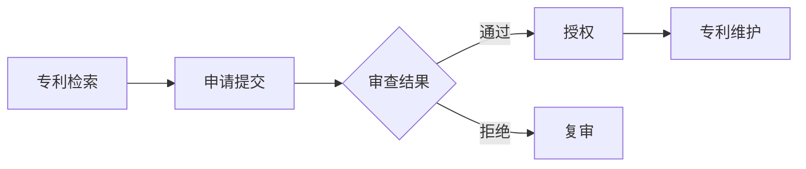

                 


**标题**：区块链在知识产权保护中的创新：简化专利申请和管理

**关键词**：区块链，知识产权保护，专利申请，管理，创新

**摘要**：
本文探讨了区块链技术在知识产权保护领域的创新应用，特别是如何简化专利申请和管理流程。通过深入分析区块链的基本原理和应用场景，我们提出了将区块链技术应用于专利申请的具体方法和优势。文章分为三个部分：第一部分介绍了区块链与知识产权保护的基础知识；第二部分详细阐述了区块链在专利申请与保护中的应用；第三部分探讨了区块链在其他知识产权保护领域的应用。本文旨在为读者提供关于区块链技术在知识产权保护领域应用的全面理解和实践指导。

## 第一部分：区块链与知识产权保护基础

### 1.1 区块链技术简介

区块链是一种分布式数据库技术，通过密码学和共识机制实现数据的不可篡改和透明性。其基本原理包括去中心化、共识算法和智能合约。

去中心化：区块链网络中的所有节点都可以参与数据的存储和验证，不再依赖于中央机构。

共识算法：节点之间通过共识算法达成一致，确保数据的一致性和正确性。

智能合约：基于编程逻辑的合约，在满足条件时自动执行，减少了人工干预。

### 1.2 区块链的核心特点

区块链具有以下核心特点：

1. **不可篡改性**：一旦数据记录在区块链上，便无法篡改，保证了数据的真实性和可信度。

2. **透明性**：所有数据在区块链上都是公开透明的，任何人都可以查看和验证。

3. **安全性**：区块链采用先进的加密技术，确保数据的安全和隐私。

### 1.3 区块链在知识产权保护中的应用前景

区块链在知识产权保护中具有巨大的应用潜力：

1. **简化专利申请和管理流程**：通过去中心化和智能合约技术，可以简化专利申请和管理流程，提高效率。

2. **确权与维权**：区块链可以为知识产权提供可靠的数字身份和确权服务，方便维权。

3. **降低成本**：通过减少人工干预和中介环节，可以降低知识产权保护的运营成本。

### 1.4 知识产权保护现状与挑战

当前知识产权保护面临以下挑战：

1. **侵权案件增多**：随着知识产权保护意识的提高，侵权案件数量不断增加。

2. **传统保护手段不足**：传统知识产权保护手段如专利、商标、版权等存在缺陷，无法完全满足日益增长的需求。

3. **维权难度大**：维权成本高、流程复杂，使得许多权利人选择放弃维权。

### 1.5 区块链与知识产权保护的关键概念

区块链在知识产权保护中的应用涉及以下几个关键概念：

1. **智能合约**：用于自动化执行知识产权交易、许可和维权等操作。

2. **分布式账本**：记录和管理知识产权的相关信息，保证数据的不可篡改。

3. **非同质化代币（NFT）**：用于确权和交易知识产权，如版权、商标等。

### 1.6 核心概念属性特征对比表格

| 特征             | 区块链          | 传统知识产权保护 |
|------------------|-----------------|------------------|
| 数据存储方式     | 分布式账本      | 中心化数据库      |
| 不可篡改性       | 是              | 否                |
| 透明性           | 是              | 否                |
| 安全性           | 高              | 中等              |
| 成本             | 低              | 高                |
| 维权难度         | 低              | 高                |

### 1.7 ER实体关系图架构

使用Mermaid绘制ER实体关系图如下：

```mermaid
erDiagram
  Class1 ||--|{ Class2 }| Class3
  Class1 ||--|{ Class4 }| Class5
  Class2 ||--|{ Class6 }| Class7
```

### 1.8 知识产权保护中的区块链应用案例

以下是一个简单的区块链知识产权保护应用案例：

- **案例背景**：某科技公司开发了一款创新软件，希望获得专利保护。
- **解决方案**：使用区块链技术记录软件的开发过程、源代码和设计文档，并通过智能合约实现专利申请和许可管理。
- **实施步骤**：
  1. 在区块链上创建一个智能合约，用于记录软件的知识产权信息。
  2. 将开发过程、源代码和设计文档上链，确保数据的不可篡改性。
  3. 使用智能合约申请专利，并管理许可和维权事务。

## 第二部分：区块链在专利申请与保护中的应用

### 2.1 专利申请流程与问题

#### 2.1.1 传统专利申请流程

传统专利申请流程包括以下几个步骤：

1. **专利检索**：评估创新性，避免重复申请。
2. **专利申请**：填写申请表格，提交相关文件。
3. **专利审查**：专利局对申请进行审查，决定是否授予专利。
4. **专利授权**：通过审查后，专利局发放专利证书。
5. **专利维护**：定期缴纳费用，保持专利有效性。

#### 2.1.2 传统专利申请流程中的问题

传统专利申请流程存在以下问题：

1. **效率低**：流程繁琐，审批时间长。
2. **成本高**：涉及大量人力、物力和财力投入。
3. **信息不透明**：专利信息的公开程度不高，难以全面掌握。
4. **维权难度大**：专利侵权案件难以取证和维权。

#### 2.1.3 区块链如何简化专利申请流程

区块链技术可以通过以下方式简化专利申请流程：

1. **去中心化**：减少专利局等中心化机构的依赖，提高申请和审查效率。
2. **智能合约**：自动化执行专利申请、授权和许可等操作，减少人工干预。
3. **分布式账本**：记录和管理专利信息，确保数据透明和可追溯。
4. **降低成本**：减少中介环节和人力成本，降低专利申请和维护费用。

### 2.2 区块链在专利申请中的应用

#### 2.2.1 区块链在专利申请中的技术原理

区块链在专利申请中的应用主要包括以下几个技术原理：

1. **分布式账本**：记录专利申请、授权和许可等相关信息，确保数据的不可篡改和透明性。
2. **智能合约**：自动化执行专利申请、授权和许可等操作，减少人工干预和降低成本。
3. **非同质化代币（NFT）**：用于确权和交易知识产权，如专利、商标和版权等。

#### 2.2.2 使用Mermaid画出专利申请流程的Mermaid流程图

以下是专利申请流程的Mermaid流程图：



#### 2.2.3 Python源代码实现专利申请流程

以下是一个简单的Python源代码示例，用于实现区块链上的专利申请流程：

```python
import json
from web3 import Web3

# 连接到区块链节点
web3 = Web3(Web3.HTTPProvider('https://mainnet.infura.io/v3/your_project_id'))

# 部署智能合约
# ...（部署智能合约的代码）

# 创建专利申请
def create_patent_application(paten

