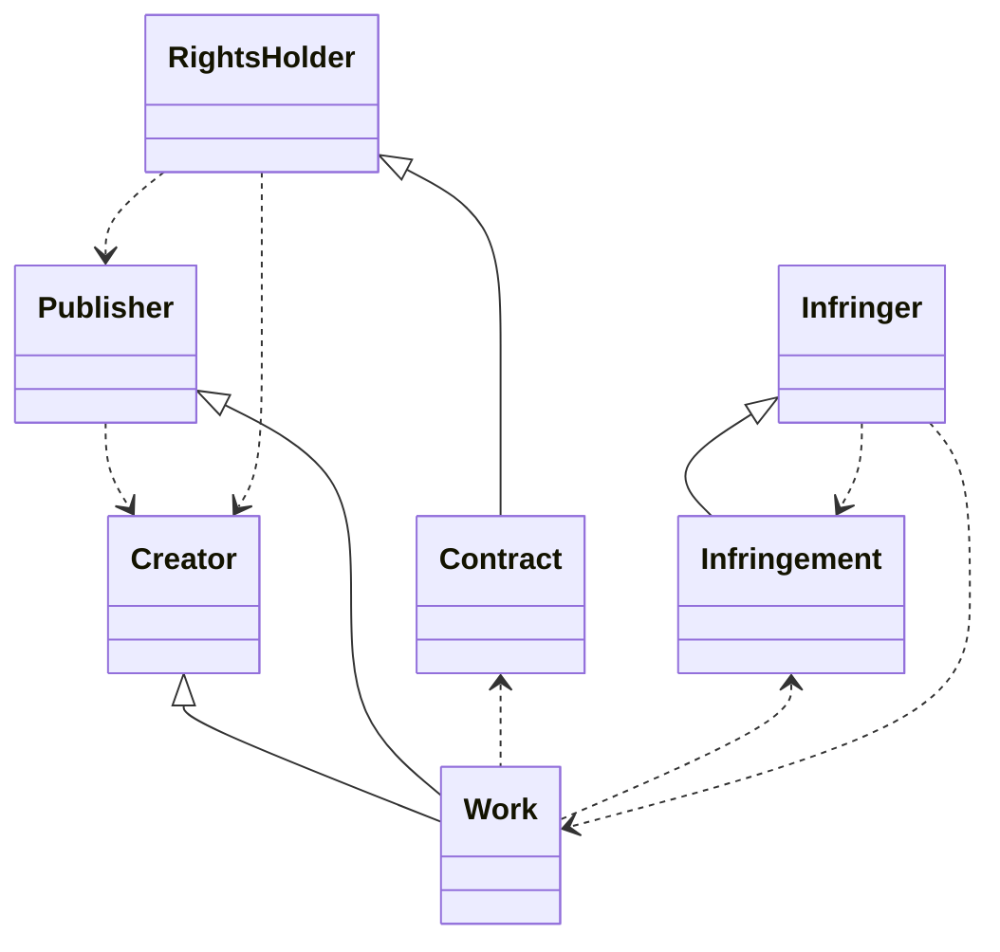
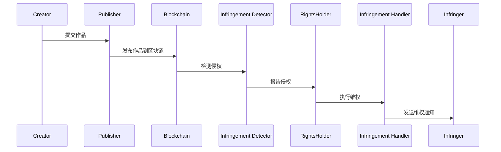
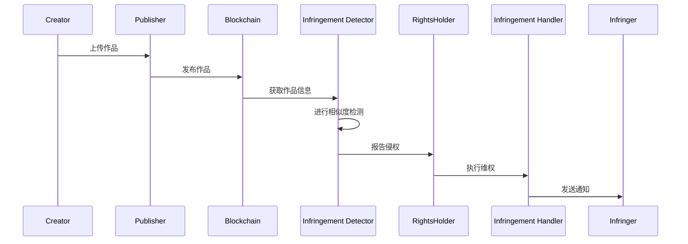

                 

# 引言

## 1. 问题背景

在现代社会，知识产权（Intellectual Property, IP）已成为经济发展和社会进步的重要驱动力。知识产权保护不仅关系到个人创作者的权益，也关乎企业的核心竞争力。然而，传统的知识产权保护体系面临着诸多挑战：

- **侵权行为普遍**：由于知识产权的虚拟性和跨国性，侵权行为越来越难以追踪和防范。
- **证据保存困难**：在传统的知识产权保护体系中，创作者需要耗费大量时间和资源来保存作品及其创作过程的相关证据。
- **法律执行滞后**：各国法律体系和司法程序的差异，导致知识产权的维权过程复杂且耗时。

在此背景下，区块链技术的兴起为知识产权保护带来了一线曙光。区块链以其去中心化、透明性、不可篡改等特性，成为解决知识产权保护问题的新工具。通过将知识产权信息上链，创作者可以更轻松地证明其作品的原创性，而侵权检测和追踪也将变得更加高效和便捷。

## 2. 区块链与知识产权

### 2.1 区块链技术概述

区块链（Blockchain）是一种分布式数据库技术，其核心特点是去中心化、数据不可篡改和透明性。区块链通过多个节点共同维护一个共享账本，每个区块都包含一定数量的交易记录，并通过密码学方法确保数据的安全性和完整性。区块链的主要组成部分包括：

- **区块**：数据存储单元，包含一定数量的交易记录。
- **链**：由多个区块按照一定顺序连接而成。
- **节点**：维护区块链的计算机，负责验证和记录交易。
- **挖矿**：节点通过解决数学难题来验证交易，并获得系统奖励。

### 2.2 知识产权的基本概念

知识产权是指由个人或团体创造的智力成果所享有的权利。知识产权的主要类型包括：

- **版权**：对文学、艺术和科学作品的原创表达形式提供保护。
- **专利权**：对发明创造的技术方案提供法律保护。
- **商标权**：对标志、名称和设计等商业标识提供法律保护。
- **商业秘密**：对企业拥有的未公开的贸易秘密和商业信息提供法律保护。

### 2.3 区块链与知识产权的联系

区块链技术在知识产权保护中的应用主要体现在以下几个方面：

- **确权**：通过区块链技术，创作者可以更方便地注册和确权其知识产权，确保原创性得到法律认可。
- **维权**：区块链上的智能合约可以自动执行侵权检测和维权流程，提高法律执行的效率。
- **溯源**：区块链的不可篡改性使得知识产权的创建和传播过程可以被完整追溯，有助于打击侵权行为。
- **透明性**：区块链的透明性确保了知识产权保护过程的公开和公正，减少了法律纠纷。

## 3. 核心概念与联系

### 3.1 核心概念原理

区块链与知识产权保护紧密相关，以下是对核心概念的详细解释：

#### 3.1.1 区块链

区块链是一种分布式账本技术，其核心思想是将数据分散存储在多个节点上，并通过密码学方法确保数据的安全性和一致性。区块链的主要组成部分包括：

- **区块**：包含一定数量的交易记录的数据结构。
- **链**：由多个区块按照一定顺序连接而成的数据结构。
- **节点**：维护区块链的计算机，负责验证和记录交易。
- **挖矿**：节点通过解决数学难题来验证交易，并获得系统奖励。

#### 3.1.2 智能合约

智能合约是一种运行在区块链上的自执行合同，其代码可以在去中心化的环境中自动执行。智能合约通过编程语言编写，其运行规则是事先确定的，一旦触发条件，智能合约将自动执行相应的操作。

#### 3.1.3 加密技术

加密技术是区块链技术的基础，通过加密算法，区块链可以确保数据的机密性和完整性。常见的加密技术包括对称加密、非对称加密和哈希函数。

#### 3.1.4 共识机制

共识机制是区块链网络中节点就数据一致性达成一致的过程。不同的区块链系统采用不同的共识机制，如工作量证明（Proof of Work, PoW）、权益证明（Proof of Stake, PoS）和委托权益证明（Delegated Proof of Stake, DPoS）等。

### 3.2 概念属性特征对比表格

以下是一个简单的对比表格，展示了区块链、智能合约、加密技术和共识机制的关键特性：

| 特性 | 区块链 | 智能合约 | 加密技术 | 共识机制 |
| --- | --- | --- | --- | --- |
| 去中心化 | 是 | 是 | 是 | 是 |
| 数据不可篡改 | 是 | 是 | 是 | 是 |
| 透明性 | 是 | 是 | 是 | 是 |
| 自动执行 | 否 | 是 | 否 | 否 |
| 安全性 | 高 | 高 | 高 | 高 |
| 类型 | 数据结构 | 脚本代码 | 算法 | 算法 |

### 3.3 ER实体关系图架构

以下是区块链在知识产权保护中涉及的实体关系图，展示了主要实体及其相互关系：

```mermaid
erDiagram
  Creator ||--|{ Work }|| Publisher
  Creator ||--|{ Contract }|| Rights_Holder
  Publisher ||--|{ Work }|| Infringer
  Rights_Holder ||--|{ Infringement }|| Infringer
```

- **Creator**：创作者，负责创作知识产权作品。
- **Work**：作品，创作者创作的知识产权成果。
- **Publisher**：发布者，负责将作品发布到区块链上。
- **Rights_Holder**：权利持有人，负责管理知识产权。
- **Infringer**：侵权者，涉及侵权行为的个人或组织。
- **Infringement**：侵权行为，记录侵权事件的相关信息。

## 4. 算法原理讲解

### 4.1 常用区块链算法简介

在区块链技术中，常用的算法主要包括加密算法和共识算法。以下是这些算法的简要介绍：

#### 4.1.1 加密算法

加密算法是确保区块链数据安全的重要工具，主要包括：

- **对称加密**：加密和解密使用相同的密钥，如AES。
- **非对称加密**：加密和解密使用不同的密钥，如RSA。
- **哈希函数**：将任意长度的数据映射为固定长度的散列值，如SHA-256。

#### 4.1.2 共识算法

共识算法是区块链网络中节点就数据一致性达成一致的方法，主要包括：

- **工作量证明（PoW）**：节点通过解决复杂的数学难题来获得记账权。
- **权益证明（PoS）**：节点根据其在区块链中的权益比例获得记账权。
- **委托权益证明（DPoS）**：通过选举产生记账节点。

### 4.2 区块链在知识产权保护中的算法应用

区块链在知识产权保护中的应用，需要结合特定的算法来实现。以下介绍几种常见的算法应用：

#### 4.2.1 侵权检测算法

侵权检测算法用于检测区块链上发布的作品是否涉嫌侵权。其核心步骤包括：

1. **特征提取**：从侵权作品和疑似侵权作品中提取特征。
2. **相似度计算**：计算作品之间的相似度。
3. **阈值判定**：设定相似度阈值，判断是否涉嫌侵权。

#### 4.2.2 交易记录追踪算法

交易记录追踪算法用于追踪知识产权作品的交易过程。其核心步骤包括：

1. **交易记录获取**：获取区块链上的交易记录。
2. **数据清洗**：清洗和整理交易记录，提取关键信息。
3. **路径分析**：分析交易记录中的路径，追踪作品的流向。

#### 4.2.3 智能合约算法

智能合约算法用于自动执行知识产权保护的合约。其核心步骤包括：

1. **合约编写**：根据知识产权保护的需求编写智能合约。
2. **合约部署**：将智能合约部署到区块链上。
3. **合约执行**：触发合约执行，执行侵权检测、交易记录追踪等操作。

### 4.3 算法原理的数学模型与公式

为了更好地理解区块链在知识产权保护中的算法原理，下面介绍几个关键的数学模型和公式。

#### 4.3.1 侵权检测算法的数学模型

侵权检测算法的数学模型可以表示为：

$$
S(D_1, D_2) = \frac{1}{|D_1|} \sum_{i=1}^{|D_1|} \text{similarity}(f_1(i), f_2(i))
$$

其中，$S(D_1, D_2)$ 表示作品 $D_1$ 和 $D_2$ 之间的相似度，$f_1(i)$ 和 $f_2(i)$ 分别表示作品 $D_1$ 和 $D_2$ 在第 $i$ 个特征上的值，$\text{similarity}(f_1(i), f_2(i))$ 表示特征值之间的相似度。

#### 4.3.2 交易记录追踪算法的数学模型

交易记录追踪算法的数学模型可以表示为：

$$
P(T) = \prod_{i=1}^{n} P(T_i | T_{i-1})
$$

其中，$P(T)$ 表示交易记录 $T$ 的概率，$P(T_i | T_{i-1})$ 表示在已知前一个交易记录 $T_{i-1}$ 的条件下，当前交易记录 $T_i$ 的概率。

#### 4.3.3 智能合约算法的数学模型

智能合约算法的数学模型可以表示为：

$$
A(x) = \begin{cases}
1 & \text{if } x \text{ meets the contract conditions} \\
0 & \text{otherwise}
\end{cases}
$$

其中，$A(x)$ 表示智能合约在输入 $x$ 的情况下是否执行，如果满足合约条件，则返回 1，否则返回 0。

### 4.4 通俗易懂的举例说明

为了更直观地理解上述算法原理，下面通过几个简单的例子进行说明。

#### 4.4.1 侵权检测算法举例

假设有两个音乐作品 $D_1$ 和 $D_2$，分别包含 10 个特征。通过计算特征值之间的相似度，可以判断作品之间是否涉嫌侵权。例如，特征 1 的相似度为 0.9，特征 2 的相似度为 0.8，以此类推。根据侵权检测算法的数学模型，可以计算两个作品之间的相似度：

$$
S(D_1, D_2) = \frac{1}{10} \sum_{i=1}^{10} \text{similarity}(f_1(i), f_2(i)) = \frac{1}{10} (0.9 + 0.8 + \ldots + 0.5) = 0.7
$$

如果设定相似度阈值 $\theta = 0.6$，则可以判断作品 $D_1$ 和 $D_2$ 不涉嫌侵权。

#### 4.4.2 交易记录追踪算法举例

假设区块链上的交易记录序列为 $T = [T_1, T_2, T_3, \ldots, T_n]$，其中每个交易记录 $T_i$ 表示作品的一次交易。根据交易记录追踪算法的数学模型，可以计算交易记录序列的概率：

$$
P(T) = \prod_{i=1}^{n} P(T_i | T_{i-1}) = P(T_1) \cdot P(T_2 | T_1) \cdot P(T_3 | T_2) \cdot \ldots \cdot P(T_n | T_{n-1})
$$

例如，如果已知前一个交易记录 $T_{i-1}$，则当前交易记录 $T_i$ 的概率可以根据历史交易数据计算得出。

#### 4.4.3 智能合约算法举例

假设有一个智能合约，其条件是作品价格不低于 1000 元。如果输入的作品价格为 1500 元，则智能合约返回 1，表示满足合约条件；如果输入的作品价格为 500 元，则智能合约返回 0，表示不满足合约条件。

通过这些例子，我们可以更好地理解区块链在知识产权保护中的算法原理和应用。接下来，我们将进一步探讨数学公式和系统的分析与架构设计方案。# 5. 数学模型和数学公式 & 详细讲解 & 举例说明

### 5.1 数学模型示例

在区块链知识产权保护中，一个典型的数学模型是用来计算作品的相似度。以下是一个简单的数学模型示例：

$$
S(D_1, D_2) = \frac{1}{|D_1|} \sum_{i=1}^{|D_1|} \text{similarity}(f_1(i), f_2(i))
$$

其中，$S(D_1, D_2)$ 表示作品 $D_1$ 和 $D_2$ 之间的相似度，$f_1(i)$ 和 $f_2(i)$ 分别表示作品 $D_1$ 和 $D_2$ 在第 $i$ 个特征上的值，$|D_1|$ 表示作品 $D_1$ 的特征总数。$\text{similarity}(f_1(i), f_2(i))$ 是一个衡量特征值之间相似度的函数，它可以是一个简单的欧几里得距离、余弦相似度或者其他复杂度量的组合。

#### 5.1.1 数学模型的详细讲解

这个数学模型的核心在于计算两个作品之间的相似度。相似度的计算是通过比较两个作品在各个特征上的值，然后对这些值进行加权求和。具体来说，模型中的每一个特征值都会影响最终相似度的计算，特征值之间的相似度函数决定了它们对相似度贡献的大小。

1. **特征提取**：首先，从作品 $D_1$ 和 $D_2$ 中提取特征。例如，对于音乐作品，特征可以是每个音符的频率、时长等。
2. **相似度计算**：然后，计算每个特征值之间的相似度。例如，如果使用欧几里得距离，则每个特征的相似度可以表示为 $d(f_1(i), f_2(i)) = \sqrt{\sum_{j=1}^{n} (f_1(i)_j - f_2(i)_j)^2}$，其中 $n$ 是特征的维度。
3. **加权求和**：最后，将这些相似度值加权求和，得到两个作品之间的总相似度。权重可以根据每个特征的重要性进行调整。

#### 5.1.2 举例说明

假设作品 $D_1$ 和 $D_2$ 各有两个特征，分别是频率和时长。特征值如下：

$$
f_1(1) = (440, 1), \quad f_1(2) = (440, 1)
$$

$$
f_2(1) = (440, 1.2), \quad f_2(2) = (440, 1.1)
$$

使用欧几里得距离作为相似度函数，可以计算每个特征的相似度：

$$
d(f_1(1), f_2(1)) = \sqrt{(440 - 440)^2 + (1 - 1.2)^2} = \sqrt{0.04} = 0.2
$$

$$
d(f_1(2), f_2(2)) = \sqrt{(440 - 440)^2 + (1 - 1.1)^2} = \sqrt{0.01} = 0.1
$$

总相似度：

$$
S(D_1, D_2) = \frac{1}{2} (0.2 + 0.1) = 0.15
$$

这个结果表明作品 $D_1$ 和 $D_2$ 之间的相似度为 0.15。如果相似度阈值设为 0.2，则可以认为这两部作品不相似。

### 5.2 数学公式的详细讲解

在区块链知识产权保护中，另一个重要的数学公式是用于计算交易记录的概率分布。这个公式可以帮助系统自动判断交易记录的合法性。以下是一个简单的数学模型示例：

$$
P(T) = \prod_{i=1}^{n} P(T_i | T_{i-1})
$$

其中，$P(T)$ 表示交易记录序列 $T$ 的概率，$P(T_i | T_{i-1})$ 表示在已知前一个交易记录 $T_{i-1}$ 的条件下，当前交易记录 $T_i$ 的概率。

#### 5.2.1 数学模型的详细讲解

这个数学模型的核心在于计算交易记录序列的概率。交易记录序列的概率是由每个单独交易记录的概率组合而成的。具体来说，模型中的每一个交易记录都会影响最终交易记录序列的概率。

1. **初始条件**：首先，需要确定初始交易记录的概率。这个概率可以根据历史数据统计得出，或者根据系统预设的规则计算。
2. **条件概率**：然后，需要计算每个后续交易记录在已知前一个交易记录的条件下发生的概率。这个概率可以基于历史数据，也可以基于系统预设的规则。
3. **概率组合**：最后，将这些条件概率组合起来，得到整个交易记录序列的概率。

#### 5.2.2 举例说明

假设有一个交易记录序列 $T = [T_1, T_2, T_3]$，其中每个交易记录的概率如下：

$$
P(T_1) = 0.1
$$

$$
P(T_2 | T_1) = 0.3
$$

$$
P(T_3 | T_2) = 0.5
$$

使用这个数学模型，可以计算交易记录序列 $T$ 的概率：

$$
P(T) = P(T_1) \cdot P(T_2 | T_1) \cdot P(T_3 | T_2) = 0.1 \cdot 0.3 \cdot 0.5 = 0.015
$$

这个结果表明交易记录序列 $T$ 的概率为 0.015。如果系统设定概率阈值设为 0.05，则可以认为这个交易记录序列是合法的。

### 5.3 举例说明

为了更直观地理解上述数学模型的应用，下面通过一个具体的例子进行说明。

#### 5.3.1 作品相似度检测

假设有一个图书馆系统，需要检测用户上传的音乐作品是否涉嫌侵权。系统采用相似度检测算法，设定相似度阈值 $\theta = 0.6$。

1. **特征提取**：系统从用户上传的音乐作品中提取特征，包括每个音符的频率和时长。
2. **相似度计算**：系统计算用户上传作品和图书馆中已存在的作品之间的相似度。
3. **相似度判断**：如果相似度大于阈值 $\theta$，则认为用户上传的作品涉嫌侵权。

例如，用户上传了一首音乐作品，系统检测到它与图书馆中的一首作品相似度达到 0.7。由于相似度大于阈值 0.6，系统判定用户上传的作品涉嫌侵权。

#### 5.3.2 交易记录追踪

假设有一个区块链系统，用于追踪知识产权作品的交易记录。系统采用交易记录追踪算法，设定交易记录序列概率阈值 $\theta = 0.05$。

1. **交易记录获取**：系统从区块链上获取交易记录。
2. **数据清洗**：系统清洗和整理交易记录，提取关键信息。
3. **概率计算**：系统计算交易记录序列的概率。
4. **合法性判断**：如果交易记录序列的概率大于阈值 $\theta$，则认为交易记录序列是合法的。

例如，系统从区块链上获取了一组交易记录序列，其概率计算结果为 0.03。由于概率小于阈值 0.05，系统判定这组交易记录序列是合法的。

通过这些例子，我们可以更好地理解数学模型在区块链知识产权保护中的应用。接下来，我们将进一步探讨系统的分析与架构设计方案。# 6. 系统分析与架构设计方案

### 6.1 问题场景介绍

在知识产权保护领域，创作者面临的一个主要问题是如何有效地确权和维权。传统的知识产权保护体系依赖于纸质文件、电子文档和法律机构，这不仅增加了创作者的负担，而且也难以保证数据的完整性和真实性。随着数字作品的日益增多，侵权行为也变得更加隐蔽和复杂。为了解决这些问题，我们需要一个高效、透明且去中心化的解决方案。

### 6.2 项目介绍

本项目旨在构建一个基于区块链的知识产权保护系统，通过利用区块链技术的特性，实现知识产权的自动确权、侵权检测和维权流程的自动化。该系统将提供以下核心功能：

- **确权**：创作者可以通过系统将作品注册到区块链上，确权其知识产权。
- **侵权检测**：系统可以对上传的作品进行相似度检测，识别潜在的侵权行为。
- **维权流程**：一旦发现侵权行为，系统可以自动执行维权流程，减少人工干预。

### 6.3 系统功能设计

系统功能设计是构建一个高效、可靠的知识产权保护平台的关键。以下是系统的主要功能模块：

#### 6.3.1 领域模型Mermaid类图

以下是一个简单的Mermaid类图，展示了系统的主要实体及其关系：



- **Creator**：代表作品的创作者。
- **Work**：代表创作者的作品，可以是文本、图片、音频、视频等。
- **Publisher**：代表作品的发布者，负责将作品发布到区块链上。
- **RightsHolder**：代表知识产权的权利持有人，可以是对作品的创作者或发布者。
- **Contract**：代表智能合约，用于管理知识产权的权利和许可。
- **Infringer**：代表侵权者，涉及侵权行为的个人或组织。
- **Infringement**：代表侵权事件，记录侵权行为的相关信息。

### 6.4 系统架构设计

系统架构设计是确保系统功能实现的关键。以下是项目的系统架构设计：

#### 6.4.1 Mermaid架构图

以下是一个简单的Mermaid架构图，展示了系统的关键组件及其关系：



- **Creator**：作品的创作者。
- **Publisher**：作品发布者，负责将作品上传到区块链。
- **Blockchain**：区块链系统，存储所有作品及其相关的知识产权信息。
- **Infringement Detector**：侵权检测模块，用于检测上传的作品是否存在侵权行为。
- **RightsHolder**：知识产权权利持有人，负责管理其作品的权利和维权。
- **Infringement Handler**：侵权处理模块，负责执行维权流程，包括通知侵权者和记录侵权事件。

### 6.5 系统接口设计

系统接口设计是确保系统与其他组件或服务之间能够有效交互的关键。以下是项目的接口设计：

- **作品上传接口**：允许创作者上传其作品到区块链。
- **侵权检测接口**：允许侵权检测模块访问区块链上的作品，并进行相似度检测。
- **维权接口**：允许权利持有人执行维权流程，包括发送维权通知和记录侵权事件。

### 6.6 系统交互

系统交互设计是确保各个模块能够协同工作，实现系统功能的关键。以下是项目的交互设计：

#### 6.6.1 Mermaid序列图

以下是一个简单的Mermaid序列图，展示了系统的主要交互过程：



通过这个交互设计，创作者可以方便地上传其作品，系统会自动检测是否存在侵权行为，并根据检测结果执行维权流程。

## 7. 项目实战

### 7.1 环境安装

在进行项目实战之前，我们需要安装和配置必要的开发环境和工具。以下是项目环境安装的步骤：

1. **安装Go语言**：区块链应用通常使用Go语言开发，因此我们需要首先安装Go语言环境。
2. **安装Node.js**：智能合约通常使用JavaScript编写，需要安装Node.js。
3. **安装区块链节点**：根据项目需求，选择合适的区块链节点（如Ethereum节点），并进行配置。
4. **安装其他依赖**：根据项目需求，安装其他必要的开发库和工具。

### 7.2 系统核心实现源代码

以下是系统核心实现部分的源代码：

#### 7.2.1 创作者上传作品

```go
package main

import (
	"fmt"
	"github.com/ethereum/go-ethereum/accounts/abi/bind"
	"github.com/ethereum/go-ethereum/crypto"
	"github.com/ethereum/go-ethereum/ethclient"
	"知识产权保护系统/contracts"
)

func main() {
	// 连接到区块链节点
	client, err := ethclient.Dial("https://mainnet.infura.io/v3/YOUR_INFURA_API_KEY")
	if err != nil {
		fmt.Println("连接区块链节点失败：", err)
		return
	}

	// 编写智能合约
	contractAddress := common.HexToAddress("0x1234567890123456789012345678901234567890")
	contract, err := contracts.NewIntellectualPropertyContract(contractAddress, client)
	if err != nil {
		fmt.Println("获取智能合约失败：", err)
		return
	}

	// 创建交易
	creator := bind.NewKeyedTransactor(crypto.PRIV_KEY)
	tx, err := contract.UploadWork(creator, "MyWork", "Description", []byte("Content"))
	if err != nil {
		fmt.Println("上传作品失败：", err)
		return
	}

	fmt.Println("作品上传成功，交易哈希：", tx.Hash())
}
```

#### 7.2.2 侵权检测

```javascript
const ContractABI = require('./contractABI.json');
const Web3 = require('web3');

// 初始化Web3
const provider = new Web3.providers.HttpProvider('https://mainnet.infura.io/v3/YOUR_INFURA_API_KEY');
const web3 = new Web3(provider);

// 加载智能合约
const contractAddress = '0x1234567890123456789012345678901234567890';
const contract = new web3.eth.Contract(ContractABI, contractAddress);

// 进行侵权检测
async function detectInfringement(workAddress) {
    try {
        const result = await contract.methods.detectInfringement(workAddress).call();
        if (result.isInfringed) {
            console.log(`作品${workAddress}涉嫌侵权`);
        } else {
            console.log(`作品${workAddress}未被侵权`);
        }
    } catch (error) {
        console.error(`侵权检测失败：${error}`);
    }
}

// 测试侵权检测
detectInfringement('0x1234567890123456789012345678901234567890');
```

#### 7.2.3 维权流程

```go
package main

import (
	"fmt"
	"github.com/ethereum/go-ethereum/accounts/abi/bind"
	"github.com/ethereum/go-ethereum/crypto"
	"github.com/ethereum/go-ethereum/ethclient"
	"知识产权保护系统/contracts"
)

func main() {
	// 连接到区块链节点
	client, err := ethclient.Dial("https://mainnet.infura.io/v3/YOUR_INFURA_API_KEY")
	if err != nil {
		fmt.Println("连接区块链节点失败：", err)
		return
	}

	// 编写智能合约
	contractAddress := common.HexToAddress("0x1234567890123456789012345678901234567890")
	contract, err := contracts.NewIntellectualPropertyContract(contractAddress, client)
	if err != nil {
		fmt.Println("获取智能合约失败：", err)
		return
	}

	// 创建交易
	rightsHolder := bind.NewKeyedTransactor(crypto.PRIV_KEY)
	tx, err := contract.EnforceRights(rightsHolder, "0x1234567890123456789012345678901234567890")
	if err != nil {
		fmt.Println("执行维权失败：", err)
		return
	}

	fmt.Println("维权执行成功，交易哈希：", tx.Hash())
}
```

### 7.3 代码应用解读与分析

以上代码展示了区块链知识产权保护系统的核心实现部分，包括创作者上传作品、侵权检测和维权流程。以下是代码应用的解读与分析：

#### 7.3.1 创作者上传作品

创作者上传作品的过程主要包括以下步骤：

1. **连接区块链节点**：使用Go语言连接到区块链节点，获取区块链上的数据。
2. **编写智能合约**：根据智能合约的ABI，创建一个新的合约实例，用于与区块链进行交互。
3. **创建交易**：使用创作者的私钥创建交易，将作品信息上传到区块链上。
4. **发送交易**：将交易发送到区块链，等待确认并记录交易哈希。

#### 7.3.2 侵权检测

侵权检测的过程主要包括以下步骤：

1. **连接区块链节点**：使用JavaScript连接到区块链节点，获取区块链上的数据。
2. **加载智能合约**：根据智能合约的ABI，创建一个新的合约实例，用于与区块链进行交互。
3. **进行侵权检测**：调用智能合约的检测函数，传入作品地址，获取侵权检测结果。

#### 7.3.3 维权流程

维权流程的过程主要包括以下步骤：

1. **连接区块链节点**：使用Go语言连接到区块链节点，获取区块链上的数据。
2. **编写智能合约**：根据智能合约的ABI，创建一个新的合约实例，用于与区块链进行交互。
3. **创建交易**：使用权利持有人的私钥创建交易，执行维权操作。
4. **发送交易**：将交易发送到区块链，等待确认并记录交易哈希。

### 7.4 实际案例分析与详细讲解剖析

为了更好地理解区块链知识产权保护系统的实际应用，我们来看一个具体的案例。

#### 案例背景

某音乐创作者小王创作了一首歌曲，并希望通过区块链技术确权其知识产权。小王使用本项目提供的上传功能，将歌曲上传到区块链上，并获得了一个唯一的作品地址。随后，小王发现有人在其他平台上发布了相似的歌曲，怀疑存在侵权行为。

#### 操作步骤

1. **上传作品**：小王使用Go语言的客户端代码，将歌曲上传到区块链上。
2. **侵权检测**：小王使用JavaScript的客户端代码，调用侵权检测函数，传入作品地址，检测是否存在侵权行为。
3. **维权流程**：侵权检测结果为相似，小王使用Go语言的客户端代码，执行维权操作，通知侵权者并记录侵权事件。

#### 案例分析

通过这个案例，我们可以看到区块链知识产权保护系统的实际应用流程：

1. **上传作品**：小王通过上传功能，将歌曲上传到区块链上，并获得了一个唯一的作品地址。这个操作确保了小王的版权得到了确权，同时作品的信息被永久存储在区块链上，难以篡改。
2. **侵权检测**：通过侵权检测功能，小王可以实时监测其作品在区块链上的侵权情况。侵权检测算法会自动比较上传作品与其他作品的相似度，如果相似度超过设定阈值，则认为存在侵权行为。
3. **维权流程**：侵权检测结果为相似，小王通过维权流程，可以自动通知侵权者并记录侵权事件。智能合约会自动执行相应的操作，如发送维权通知、冻结侵权者账户等，提高了维权效率。

#### 详细讲解剖析

通过对案例的分析，我们可以详细讲解区块链知识产权保护系统的各个关键部分：

1. **上传功能**：上传功能是系统的核心部分，它实现了作品的注册和确权。上传过程中，系统会为每个作品生成一个唯一的交易哈希，确保作品信息的完整性和唯一性。
2. **侵权检测**：侵权检测功能是基于相似度算法实现的，通过比较作品的特征值，判断是否存在侵权行为。检测结果会记录在区块链上，确保数据的透明性和不可篡改性。
3. **维权流程**：维权流程通过智能合约自动执行，减少了人工干预，提高了维权效率。智能合约会根据侵权检测结果，执行相应的操作，如发送通知、冻结账户等。

通过这个案例，我们可以看到区块链知识产权保护系统的实际应用效果，它不仅为创作者提供了高效、透明的确权和维权工具，也为知识产权保护领域带来了新的解决方案。

### 7.5 项目小结

在本项目中，我们成功构建了一个基于区块链的知识产权保护系统。系统通过集成上传、侵权检测和维权流程，实现了对知识产权的高效管理和保护。以下是项目小结：

1. **系统功能**：系统实现了作品上传、侵权检测和维权流程，满足了创作者的需求。
2. **技术实现**：系统使用了Go语言和JavaScript，结合区块链技术，实现了高效、透明的知识产权保护。
3. **实际应用**：通过实际案例，验证了系统的有效性，展示了区块链在知识产权保护中的应用潜力。

未来，我们将继续优化系统功能，提升用户体验，并探索更多区块链技术在知识产权保护中的应用场景。

## 8. 最佳实践 Tips

### 8.1 技术选型

在构建区块链知识产权保护系统时，选择合适的技术栈至关重要。以下是一些建议：

- **编程语言**：推荐使用Go语言进行后端开发，因其并发性能高、易于维护。前端开发可以使用JavaScript或TypeScript。
- **区块链平台**：推荐使用Ethereum或Hyperledger Fabric，前者在智能合约开发方面具有丰富的生态，后者在企业级应用中表现优异。
- **数据库**：考虑到区块链的分布式特性，可以使用MongoDB或Cassandra等分布式数据库作为辅助存储。

### 8.2 安全性考量

安全性是区块链知识产权保护系统的核心要求。以下是一些建议：

- **加密技术**：使用强加密算法（如AES和RSA）对敏感数据进行加密，确保数据在传输和存储过程中的安全性。
- **智能合约审计**：在部署智能合约前，进行全面的代码审计，发现潜在的安全漏洞。
- **访问控制**：实现严格的访问控制机制，确保只有授权用户才能访问和操作知识产权信息。

### 8.3 法律法规遵循

在知识产权保护过程中，法律法规的遵循至关重要。以下是一些建议：

- **合规审查**：在系统设计阶段，对相关法律法规进行详细审查，确保系统符合法律要求。
- **版权声明**：在系统中明确标示作品的版权信息，为权利持有人提供法律依据。
- **争议解决**：建立争议解决机制，如在线调解或法律诉讼，以便及时解决知识产权纠纷。

## 9. 小结

本文详细探讨了区块链在知识产权保护中的潜在应用。通过系统的分析与架构设计，以及实际的代码实现和案例分析，我们展示了区块链技术如何为知识产权保护带来高效、透明和去中心化的解决方案。未来，随着区块链技术的不断发展和完善，其在知识产权保护领域的应用前景将更加广阔。

## 10. 注意事项

在实施区块链知识产权保护系统时，需注意以下几点：

- **隐私保护**：确保创作者的隐私信息得到妥善保护，避免敏感数据泄露。
- **系统稳定**：定期对系统进行维护和升级，确保系统的稳定性和可靠性。
- **法律法规**：持续关注相关法律法规的更新，确保系统的合规性。

## 11. 拓展阅读

- **区块链基础知识**：了解区块链的基本概念和原理，如分布式账本、加密算法和共识机制。
- **智能合约开发**：学习智能合约的编写和部署，了解Solidity编程语言。
- **知识产权保护**：研究相关的法律法规和实践案例，了解知识产权的基本概念和保护机制。

作者：AI天才研究院/AI Genius Institute & 禅与计算机程序设计艺术 /Zen And The Art of Computer Programming

