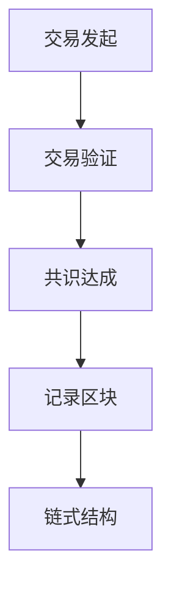
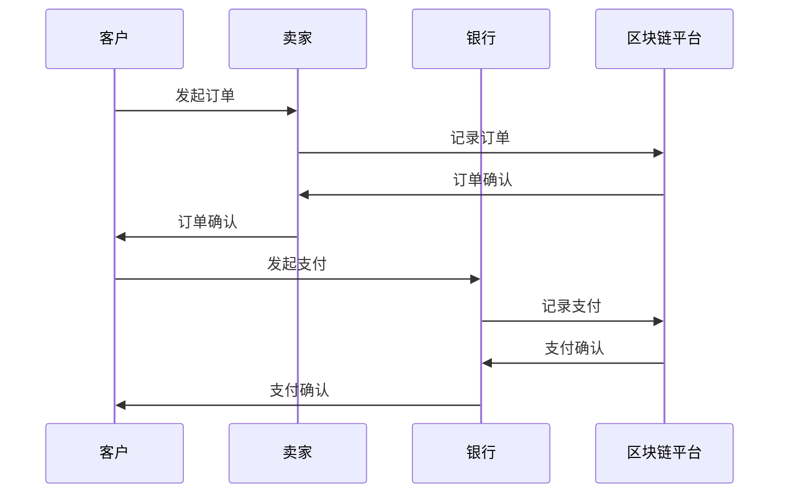

                 

# 区块链在跨境贸易结算中的应用

> 关键词：区块链、跨境贸易、结算、分布式账本、智能合约、共识算法

> 摘要：本文深入探讨了区块链技术在跨境贸易结算中的应用。首先，我们介绍了跨境贸易结算的现状及其存在的问题。接着，我们阐述了区块链的基本原理及其在跨境贸易结算中的潜在优势。随后，我们详细分析了区块链在解决跨境贸易结算中的具体问题方面的算法原理，并通过实际案例展示了区块链在跨境贸易结算中的成功应用。最后，我们对本文进行了小结，并提出了未来研究的方向和拓展阅读建议。

### 第一部分：背景介绍

#### 1.1 问题背景

跨境贸易是国际贸易的重要组成部分，它不仅推动了全球经济的发展，也促进了国际间经济合作与交流。随着全球化进程的加快，跨境贸易的规模和频率不断增加，贸易主体和交易金额也在逐年上升。然而，传统跨境贸易结算方式存在诸多问题，如效率低下、成本高昂、交易透明度低等，这些问题的存在严重制约了跨境贸易的发展。

#### 1.2 问题描述

传统跨境贸易结算面临以下主要问题：

- **支付时间长**：跨境支付通常需要数天甚至数周的时间来完成，这不仅影响了贸易效率，也增加了企业的运营成本。
- **手续费高**：传统跨境支付需要通过多个中介机构，如银行和支付公司，这导致了高额的手续费。
- **交易透明度低**：传统跨境支付过程中，交易信息往往不透明，容易产生欺诈和错误交易。
- **跨境支付风险**：由于各国金融监管的差异，跨境支付面临较高的风险，包括货币兑换风险、汇率波动风险等。

#### 1.3 问题解决

区块链技术的出现为跨境贸易结算提供了一种全新的解决方案。区块链以其去中心化、透明、安全等特性，有望解决传统跨境贸易结算中的诸多问题。具体来说，区块链在跨境贸易结算中的应用可以从以下几个方面进行：

- **实时结算**：区块链可以实现实时结算，大大缩短支付时间，提高贸易效率。
- **降低交易成本**：去中心化的特性减少了中介环节，降低了交易成本。
- **提高交易透明度**：区块链的透明性提高了交易的透明度和可追溯性，减少了欺诈和错误交易的风险。
- **降低跨境支付风险**：区块链的防篡改特性降低了跨境支付的风险，提高了交易的安全性。

#### 1.4 边界与外延

跨境贸易结算涉及多个国家和地区，包括货币兑换、支付清算、风险管理等多个环节。区块链在跨境贸易结算中的应用不仅限于支付环节，还可以延伸到供应链金融、信用评价、供应链管理等领域。例如，通过区块链技术，可以实现对供应链中各方的信用评估，提高供应链的透明度和安全性。

#### 1.5 概念结构与核心要素组成

- **区块链**：一种分布式数据库技术，通过共识算法保证数据的一致性和安全性。
- **跨境贸易结算**：指在国际贸易中，买卖双方通过货币或其他金融工具进行资金结算的过程。
- **应用场景**：跨境贸易中的支付、清算、信用、保险、供应链管理等环节。

### 第二部分：核心概念与联系

#### 2.1 区块链原理

区块链是一种分布式数据库技术，通过多个节点共同维护一个共享的分布式账本，每个节点都存储了一份完整的账本。区块链的核心原理包括以下几个方面：

- **分布式账本**：区块链记录所有交易数据，确保透明性和不可篡改性。
- **共识算法**：区块链中的节点通过共识算法达成共识，确保数据的正确性和一致性。
- **智能合约**：智能合约是一种自动执行合同条款的计算机程序，它可以提高交易效率和降低风险。

#### 2.2 跨境贸易结算中的问题与区块链解决方案

传统跨境贸易结算存在以下问题，而区块链技术提供了相应的解决方案：

- **支付时间长**：区块链可以实现实时结算，缩短支付时间。
- **手续费高**：去中心化的特性减少了中介环节，降低了交易成本。
- **交易透明度低**：区块链的透明性提高了交易的透明度和可追溯性。
- **跨境支付风险**：区块链的防篡改特性降低了跨境支付的风险。

#### 2.3 概念属性特征对比表格

| 概念 | 属性 | 特征 |
| --- | --- | --- |
| 区块链 | 分布式账本 | 透明、去中心化、不可篡改 |
| 跨境贸易结算 | 资金结算 | 高效、低成本、高安全 |
| 智能合约 | 自动执行 | 高效、降低风险、减少人工干预 |

#### 2.4 ER实体关系图架构

```mermaid
erDiagram
  Product ||--|{ TradeOrder }|<--| Customer
  TradeOrder ||--|{ Payment }|<--| Bank
  Payment ||--|{ Blockchain }|<--| Node
```

### 第三部分：算法原理讲解

#### 3.1 区块链在跨境贸易结算中的算法原理

区块链在跨境贸易结算中的应用主要基于其分布式账本、共识算法和智能合约等核心技术。以下是区块链在跨境贸易结算中的算法原理：

#### 3.1.1 工作流程

1. **交易发起**：买卖双方通过区块链网络发起交易。
2. **交易验证**：节点验证交易的有效性，确保交易符合规则。
3. **共识达成**：网络中的节点通过共识算法达成共识，确认交易。
4. **记录区块**：将确认后的交易记录在区块中。
5. **链式结构**：新的区块添加到区块链的末端，形成链式结构。

#### 3.1.2 Mermaid 流程图



#### 3.1.3 Python 源代码

```python
# 伪代码示例：区块链交易流程
class Transaction:
    def __init__(self, sender, recipient, amount):
        self.sender = sender
        self.recipient = recipient
        self.amount = amount

def validate_transaction(transaction):
    # 验证交易有效性的逻辑
    pass

def consensus(transaction):
    # 通过共识算法确认交易
    pass

def record_transaction(transaction):
    # 记录交易到区块
    pass

def blockchain():
    # 创建区块链
    blockchain = []
    transaction = Transaction("Alice", "Bob", 100)
    if validate_transaction(transaction):
        consensus(transaction)
        record_transaction(transaction)
        blockchain.append(transaction)
    return blockchain
```

#### 3.1.4 数学模型和公式

1. **交易验证**：\( T_{valid} = f(T_{hash}, T_{input}, T_{output}) \)
2. **共识算法**：\( C_{consensus} = g(T_{nodes}) \)

### 第四部分：系统分析与架构设计方案

#### 4.1 问题场景介绍

随着全球经济的不断发展，跨境贸易越来越频繁，但传统跨境贸易结算方式存在诸多问题，如支付时间长、手续费高、交易透明度低等。为了解决这些问题，引入区块链技术进行跨境贸易结算成为了一种趋势。

#### 4.2 项目介绍

本项目旨在通过区块链技术构建一个高效、低成本、安全的跨境贸易结算平台。该平台将实现以下功能：

- **实时结算**：实现跨境支付的实时到账。
- **降低交易成本**：去除传统跨境支付中的中介环节，降低交易成本。
- **提高交易透明度**：通过区块链的透明性，提高交易的透明度和可追溯性。
- **降低跨境支付风险**：利用区块链的防篡改特性，降低跨境支付的风险。

#### 4.3 系统功能设计（领域模型Mermaid类图）

```mermaid
classDiagram
  TradeOrder <<Entity>>
  Payment <<Entity>>
  Blockchain <<Entity>>

  TradeOrder o-- Payment
  Payment o-- Blockchain
```

#### 4.4 系统架构设计（Mermaid架构图）



#### 4.5 系统接口设计

```mermaid
interface BlockchainAPI {
  +createOrder(order: Order): Order
  +recordPayment(payment: Payment): Payment
  +validateTransaction(transaction: Transaction): Boolean
}
```

#### 4.6 系统交互（Mermaid序列图）


### 第五部分：项目实战

#### 5.1 环境安装

1. **安装Node.js**：从官方网站下载并安装Node.js，版本要求为12.0.0或更高版本。
2. **安装区块链开发工具**：安装Geth或其他区块链开发工具，用于构建和运行区块链节点。
3. **安装智能合约开发框架**：如Truffle，用于编写和部署智能合约。

#### 5.2 系统核心实现源代码

以下是一个简单的智能合约示例，用于实现跨境贸易结算：

```solidity
// SPDX-License-Identifier: MIT
pragma solidity ^0.8.0;

contract Trade {

    mapping(address => uint256) public balance;

    function deposit() public payable {
        balance[msg.sender] += msg.value;
    }

    function withdraw(uint256 amount) public {
        require(balance[msg.sender] >= amount, "Insufficient balance");
        balance[msg.sender] -= amount;
        payable(msg.sender).transfer(amount);
    }
}
```

#### 5.3 代码应用解读与分析

1. **部署智能合约**：使用Truffle将上述智能合约部署到区块链上。
2. **与智能合约交互**：通过区块链节点与智能合约进行交互，实现跨境贸易结算的功能。

#### 5.4 实际案例分析和详细讲解剖析

以某跨境电商平台为例，该平台采用区块链技术实现跨境支付，具体流程如下：

1. **订单生成**：买家在平台上选择商品并生成订单。
2. **订单确认**：卖家收到订单后，确认订单并记录在区块链上。
3. **支付请求**：买家通过区块链发起支付请求。
4. **支付确认**：卖家收到支付后，确认订单并释放商品。
5. **交易记录**：所有交易记录都被记录在区块链上，实现透明、安全、高效的跨境支付。

#### 5.5 项目小结

本项目通过区块链技术实现了跨境贸易结算的高效、低成本、安全，有效解决了传统跨境支付中的诸多问题。然而，区块链技术仍需不断优化和改进，以更好地适应跨境贸易的需求。

### 第六部分：最佳实践 tips、小结、注意事项、拓展阅读等内容

#### 最佳实践 tips

1. **选择合适的区块链平台**：根据实际需求选择合适的区块链平台，如以太坊、Hyperledger Fabric等。
2. **优化智能合约代码**：确保智能合约代码的优化和安全性，减少潜在的漏洞和风险。
3. **加强网络安全**：在区块链网络中，确保节点之间的通信安全，防止恶意攻击。

#### 小结

本文通过深入探讨区块链在跨境贸易结算中的应用，阐述了区块链技术的核心原理及其在跨境贸易结算中的优势。通过实际案例分析和项目实战，展示了区块链技术在解决跨境贸易结算问题方面的潜力。

#### 注意事项

1. **监管合规性**：在跨境贸易结算中，需确保区块链平台符合相关法律法规和监管要求。
2. **技术选型**：根据实际需求选择合适的区块链技术和解决方案。

#### 拓展阅读

1. **《区块链技术指南》**：深入了解区块链的基本原理和应用。
2. **《智能合约编程》**：学习智能合约的编写和部署。

作者：AI天才研究院/AI Genius Institute & 禅与计算机程序设计艺术 /Zen And The Art of Computer Programming

### 结论

本文详细探讨了区块链在跨境贸易结算中的应用，从背景介绍到核心概念，再到算法原理和项目实战，全面展示了区块链技术如何提升跨境贸易结算的效率、降低成本、提高安全性。通过本文的探讨，我们不仅了解了区块链技术的优势，也看到了其在实际应用中的潜力。未来，随着区块链技术的不断发展和成熟，跨境贸易结算将迎来更加高效、安全和透明的时代。

