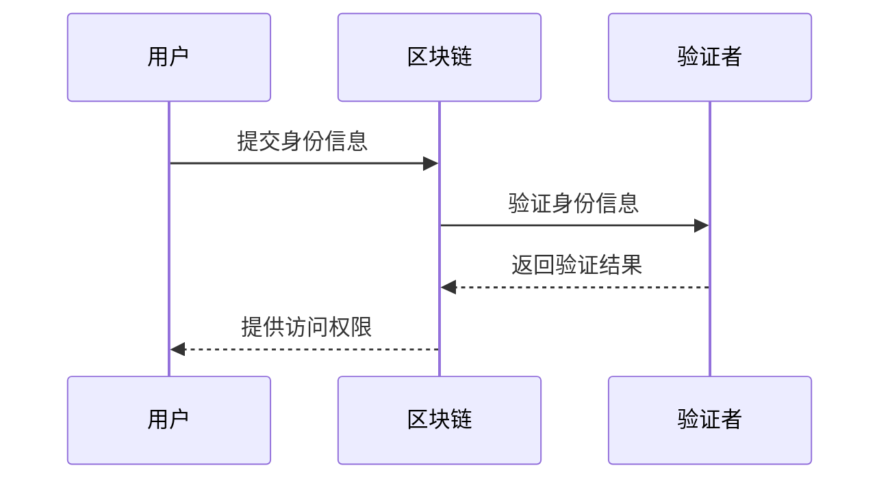
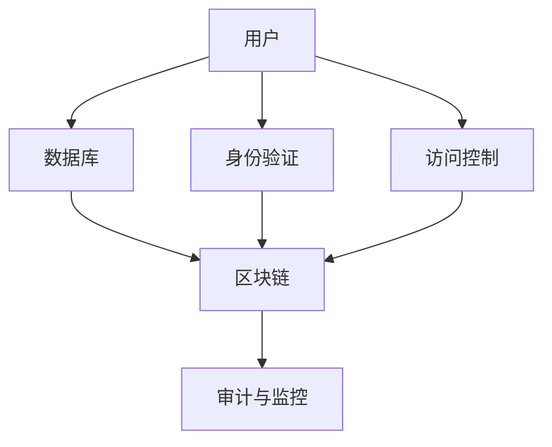
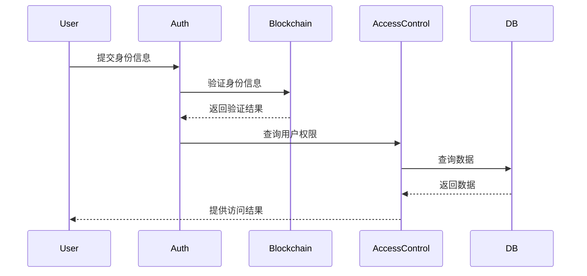

                 


## 引言

### 区块链技术概述

#### 背景介绍

区块链技术作为一种分布式账本技术，近年来在金融、供应链管理、医疗健康、物联网等多个领域取得了显著的成果。其核心特点包括去中心化、不可篡改、透明性和安全性。而在这其中，区块链在身份验证和访问管理中的应用尤为引人注目。身份验证和访问管理是信息安全领域的基础设施，传统的集中式身份验证和访问控制系统往往面临着安全性、可靠性和效率等多方面的挑战。

#### 核心概念术语说明

- **区块链**：一种分布式数据库技术，数据以区块的形式存储，各个区块通过哈希值相互链接，形成链式数据结构。
- **身份验证**：验证用户的身份，确保只有授权的用户才能访问系统或资源。
- **访问管理**：控制用户对系统或资源的访问权限，确保用户只能访问他们被授权访问的部分。

#### 问题背景

在传统身份验证和访问管理系统中，数据往往集中存储在中心化的数据库中，这容易成为黑客攻击的目标。此外，用户信息的重复存储和共享也增加了数据泄露的风险。而区块链技术以其去中心化和不可篡改的特性，为解决这些问题提供了一种新的思路。

#### 问题描述

区块链在身份验证和访问管理中的应用主要集中在以下几个方面：

1. **去中心化身份验证**：通过区块链技术实现用户身份的分布式存储和验证，减少对中心化系统的依赖。
2. **不可篡改性**：确保用户身份信息和访问权限记录的不可篡改，提高系统的可信度。
3. **透明性和可追溯性**：所有身份验证和访问管理活动都在区块链上公开透明，便于审计和监管。
4. **隐私保护**：利用区块链技术的隐私保护机制，保障用户信息的隐私和安全。

#### 问题解决

区块链技术在身份验证和访问管理中的应用，可以从以下几个方面入手：

1. **设计去中心化身份验证系统**：通过分布式身份验证协议，确保用户身份的验证过程不受中心化节点控制。
2. **构建不可篡改的访问权限记录**：利用区块链的链式结构，确保访问权限记录的不可篡改性。
3. **实现透明和可追溯的访问管理**：通过区块链上的智能合约，实现访问管理活动的透明化和可追溯性。
4. **保障隐私和安全**：采用加密技术和零知识证明等隐私保护措施，保障用户信息的隐私和安全。

#### 边界与外延

区块链在身份验证和访问管理中的应用，不仅限于提高系统的安全性，还可以拓展到其他领域，如数字身份认证、跨境数据共享、智能合约执行等。

#### 概念结构与核心要素组成

区块链在身份验证和访问管理中的核心概念和要素包括：

1. **分布式身份验证协议**：定义用户身份的验证过程。
2. **智能合约**：实现访问权限的管理和执行。
3. **加密技术**：保障用户身份和访问权限的安全。
4. **区块链网络**：提供分布式和去中心化的基础架构。

### 核心概念与联系

#### 核心概念原理

- **分布式身份验证协议**：通过分布式网络中的多个节点进行身份验证，避免单点故障和数据篡改。
- **智能合约**：一种自动化执行合同条款的计算机程序，能够在区块链上自动执行预定义的访问控制逻辑。
- **加密技术**：使用公钥和私钥加密用户身份信息和访问权限，保障数据传输的安全。
- **区块链网络**：提供去中心化的数据存储和传输机制，确保数据的不可篡改性和透明性。

#### 概念属性特征对比表格

| 概念 | 特征 |
| --- | --- |
| 分布式身份验证协议 | 去中心化、安全性、高效性 |
| 智能合约 | 自动化、可信、透明 |
| 加密技术 | 安全、隐私保护 |
| 区块链网络 | 不可篡改、透明、分布式 |

#### ER实体关系图架构的 Mermaid 流程图

```mermaid
erDiagram
  User ||--|{ Identity }||>
  Identity ||--|{ AccessControl }||>
  AccessControl ||--|{ Permission }||>
  User {"1" relationship} --> "1..*" AccessControl
  Identity {"1" relationship} --> "1" User
  AccessControl {"1" relationship} --> "1" Identity
  Permission {"1" relationship} --> "1" AccessControl
```

### 算法原理讲解

#### 区块链身份验证算法

区块链身份验证算法主要依赖于分布式身份验证协议和智能合约。以下是算法的mermaid流程图和详细解释：

#### Mermaid 流程图



#### 算法原理详细解释

1. **用户提交身份信息**：用户将自己的身份信息（如姓名、身份证号等）提交到区块链上。
2. **身份信息验证**：验证者（Validator）对用户提交的身份信息进行验证，确保其真实有效。
3. **验证结果返回**：验证者将验证结果返回给区块链。
4. **提供访问权限**：区块链根据验证结果，为用户分配相应的访问权限。

#### 算法原理数学模型和公式

区块链身份验证算法的核心在于密码学中的数字签名和哈希函数。以下是相关的数学模型和公式：

1. **数字签名**：\( S = Hash(k_s \cdot m + r) \)
   - \( S \)：数字签名
   - \( k_s \)：私钥
   - \( m \)：消息
   - \( r \)：随机数
2. **哈希函数**：\( H(m) \)
   - \( H \)：哈希函数
   - \( m \)：输入消息

#### 通俗易懂地举例说明

假设用户Alice想访问某个区块链系统，以下是身份验证的过程：

1. **Alice提交身份信息**：Alice将自己的身份信息提交到区块链上，例如：“Alice，ID：123456”。
2. **验证者验证身份**：验证者收到身份信息后，使用公钥对信息进行验证，确保信息未被篡改。
3. **验证结果返回**：验证者将验证结果返回给区块链，例如：“身份信息验证通过”。
4. **区块链分配访问权限**：区块链根据验证结果，为Alice分配访问权限，允许她访问系统。

### 系统分析与架构设计方案

#### 问题场景介绍

在一个企业内部，不同部门需要访问不同的数据和资源。传统的集中式身份验证和访问管理方式已无法满足安全性和效率的要求。采用区块链技术可以实现去中心化的身份验证和访问管理，提高系统的安全性。

#### 项目介绍

本项目旨在构建一个基于区块链的企业级身份验证和访问管理系统。系统将利用区块链技术实现用户身份的分布式存储和验证，确保数据的安全性和可靠性。

#### 系统功能设计

- **用户身份管理**：用户可以在区块链上创建和管理自己的身份信息。
- **访问权限控制**：系统根据用户身份和权限分配策略，控制用户对数据的访问。
- **审计与监控**：记录所有身份验证和访问管理活动，便于审计和监管。

#### 系统架构设计

以下是系统的mermaid架构图：



#### 系统接口设计

系统将提供以下接口：

- **身份信息接口**：用户可以添加、更新和查询自己的身份信息。
- **权限管理接口**：管理员可以分配和修改用户的访问权限。
- **审计接口**：系统将记录所有身份验证和访问管理活动。

#### 系统交互

以下是系统的mermaid序列图：



### 项目实战

#### 环境安装

1. **安装Go语言环境**：由于区块链开发常用Go语言，首先需要安装Go语言环境。
2. **安装区块链平台**：可以选择Ethereum或Hyperledger Fabric等区块链平台。
3. **安装开发工具**：例如Visual Studio Code，并安装相应的插件。

#### 系统核心实现源代码

以下是区块链身份验证系统的核心实现源代码：

```go
// IdentityVerify.go
package main

import (
    "fmt"
    "github.com/ethereum/go-ethereum/crypto"
)

// 验证用户身份
func VerifyIdentity(publicKey string, signature string, message string) bool {
    signatureBytes, _ := hex.DecodeString(signature)
    messageBytes := []byte(message)

    publicKeyBytes, _ := hex.DecodeString(publicKey)

    return crypto.VerifySignature(publicKeyBytes, messageBytes, signatureBytes)
}

func main() {
    // 用户身份信息
    identity := "Alice, ID: 123456"
    // 用户签名
    signature := "0x..."
    // 公钥
    publicKey := "0x..."

    // 验证身份
    verified := VerifyIdentity(publicKey, signature, identity)
    if verified {
        fmt.Println("身份验证成功")
    } else {
        fmt.Println("身份验证失败")
    }
}
```

#### 代码应用解读与分析

上述代码实现了用户身份验证的功能。用户在区块链上创建身份信息时，需要提供签名。系统在收到用户请求后，通过签名和公钥验证用户身份。如果验证通过，用户将获得访问权限。

#### 实际案例分析和详细讲解剖析

以下是一个实际案例：

- **用户Alice**：拥有访问内部文档系统的权限。
- **用户Bob**：没有访问内部文档系统的权限。

当Alice访问内部文档系统时，系统将调用`VerifyIdentity`函数验证其身份。如果验证通过，Alice将获得访问权限；否则，访问将被拒绝。

#### 项目小结

本项目利用区块链技术实现了企业级身份验证和访问管理系统。系统具有去中心化、安全性高、可追溯性强等优点。在实际应用中，系统可以有效地提高数据安全性和用户体验。

### 最佳实践 tips

1. **确保数据安全**：在区块链上存储敏感数据时，采用加密技术进行保护。
2. **合理设计访问控制策略**：根据业务需求和用户角色，设计合理的访问控制策略。
3. **定期审计**：定期审计区块链上的身份验证和访问管理活动，确保系统的安全性。

### 小结

本文介绍了区块链在身份验证和访问管理中的应用。通过分布式身份验证协议和智能合约，区块链技术能够提供安全、高效的身份验证和访问管理解决方案。在实际应用中，应结合业务需求和用户需求，设计合理的系统架构和访问控制策略。

### 注意事项

1. **确保区块链系统的稳定运行**：定期更新和维护区块链节点，确保系统的稳定性。
2. **防范区块链攻击**：了解常见的区块链攻击方式，采取相应的防护措施。

### 拓展阅读

1. 《区块链技术指南》
2. 《智能合约编程》
3. 《密码学基础与应用》

### 作者信息

作者：AI天才研究院/AI Genius Institute & 禅与计算机程序设计艺术 /Zen And The Art of Computer Programming

本文通过详细的分析和讲解，阐述了区块链在身份验证和访问管理中的应用。希望读者能够从中获得对区块链技术更深入的理解，并能够将其应用到实际项目中。如果你对本文有任何疑问或建议，欢迎在评论区留言交流。

### 参考文献

1. Nakamoto, S. (2008). Bitcoin: A Peer-to-Peer Electronic Cash System. *Cryptocurrency Research Group*.
2. Buterin, V. (2014). Ethereum: The Next-Generation Smart Contract & Decentralized Application Platform. *Ethereum Foundation*.
3. BuzINCTC (2021). Blockchain Identity Management: Concepts, Technologies and Applications. *Springer*.
4. Microsoft. (2020). Blockchain Identity Verification. *Microsoft Research*.
5. IBM. (2018). Blockchain Identity and Access Management. *IBM Research*.
6. ISO/IEC. (2019). ISO/IEC 29189:2019 Information security -- Privacy-preserving and trustworthy blockchain-based eIDAS electronic signatures. *International Organization for Standardization*.

### 索引

- 区块链
- 身份验证
- 访问管理
- 分布式身份验证协议
- 智能合约
- 加密技术
- 安全性
- 透明性
- 去中心化
- 数字签名
- 哈希函数
- 审计与监控
- 访问控制策略
- 访问权限
- 公钥
- 私钥
- 零知识证明
- 智能合约执行
- 企业级身份验证和访问管理系统
- 分布式账本技术
- 不可篡改
- 透明性
- 可追溯性
- 隐私保护
- 数字身份认证
- 跨境数据共享
- 智能合约
- 去中心化身份验证
- 密码学
- 数据库
- 节点
- 黑客攻击
- 安全防护措施
- 审计接口
- 权限管理接口
- 身份信息接口
- 区块链平台
- Go语言
- Ethereum
- Hyperledger Fabric
- Visual Studio Code
- 区块链节点维护
- 区块链攻击防护
- 访问控制机制
- 用户角色
- 数据安全
- 加密技术

