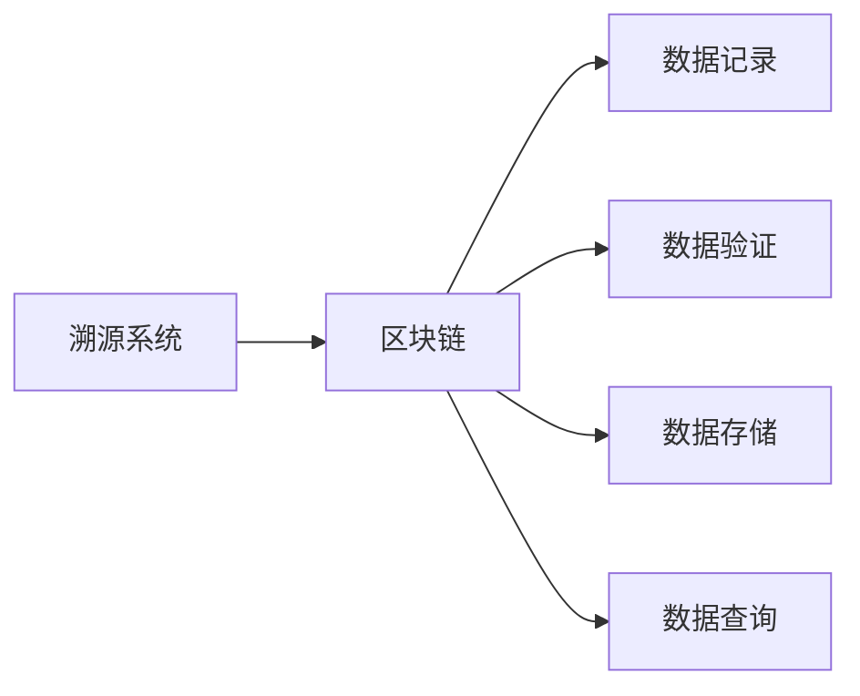
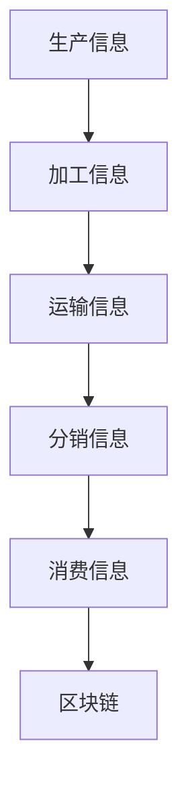
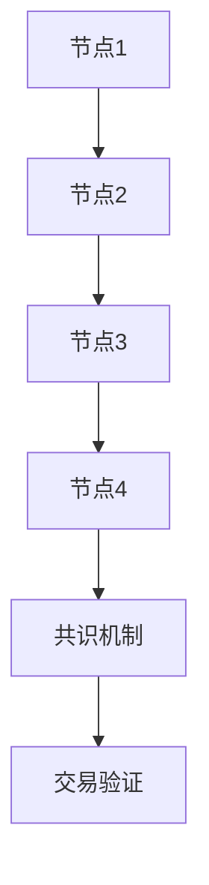
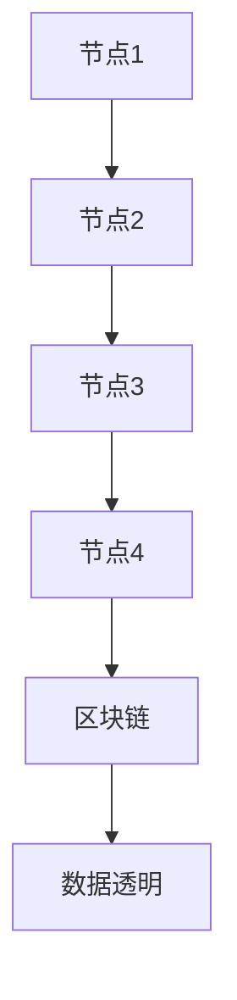
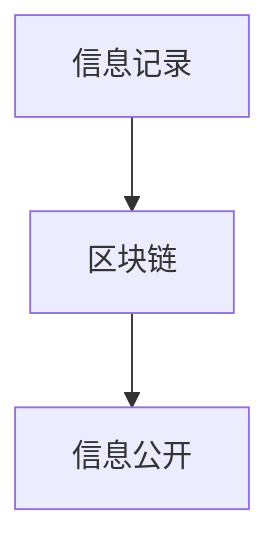
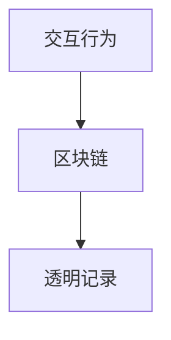
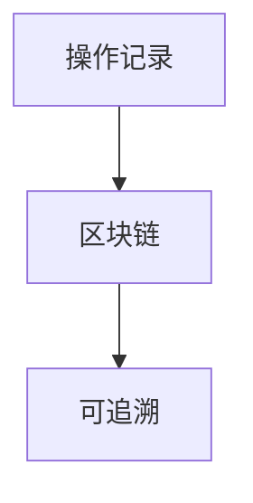

                 

### 第一部分：背景介绍

#### 1.1 问题背景

##### 1.1.1 食品安全问题现状

在当今全球化的背景下，食品安全问题日益凸显，成为影响公众健康和社会稳定的重大挑战。每年，因食品污染和食品安全问题引发的疾病和死亡人数惊人。例如，据世界卫生组织（WHO）统计，每年有近200万人死于食源性疾病，其中大部分发生在发展中国家。同时，消费者对食品安全的担忧也日益增加，导致信任危机。

##### 1.1.2 溯源需求分析

食品安全问题的复杂性要求我们必须具备高效的食品安全追溯系统，以便在问题发生时能够迅速找到源头，采取相应的措施，最大限度地减少危害。食品溯源系统需要能够记录食品的生产、加工、运输、分销和消费等全过程，确保每一个环节的数据透明和可追溯。

##### 1.1.3 区块链技术的潜力

区块链技术以其去中心化、数据不可篡改、透明公开等特性，被认为是解决食品溯源问题的理想工具。区块链技术可以确保食品溯源系统的数据真实可靠，不可篡改，从而提升消费者对食品安全的信任。

#### 1.2 问题描述

##### 1.2.1 溯源难题

传统的食品溯源系统存在诸多问题，如数据易篡改、数据不透明、追溯效率低等。这些问题严重制约了食品安全追溯的效能。

##### 1.2.2 透明化需求的提出

在食品安全问题日益严峻的背景下，对食品溯源系统的透明化需求愈发强烈。透明化不仅能够提升食品安全监管的效率，还能增强消费者对食品安全的信心。

#### 1.3 问题解决

##### 1.3.1 区块链在溯源中的应用

区块链技术可以在食品溯源中发挥关键作用，通过其独特的机制，确保数据的真实性和不可篡改性。

##### 1.3.2 透明化实现的路径

实现食品溯源的透明化需要从数据记录、验证、存储和查询等各个环节入手，确保每个环节的数据都透明、公开且可追溯。

#### 1.4 边界与外延

##### 1.4.1 溯源系统的关键要素

溯源系统的关键要素包括数据记录、验证、存储和查询等，每个环节都需要确保透明和可追溯。

##### 1.4.2 透明化应用的范围

透明化技术在食品溯源中的应用范围广泛，不仅涵盖生产、加工、运输、分销等环节，还可以延伸到消费环节，实现全过程的食品安全监控。

#### 1.5 概念结构与核心要素组成

##### 1.5.1 区块链的基本原理

区块链是一种分布式数据库技术，通过加密算法和共识机制确保数据的不可篡改性和透明性。

##### 1.5.2 食品溯源系统架构

食品溯源系统架构包括数据采集、验证、存储和查询等模块，每个模块都需要与区块链技术紧密结合。

##### 1.5.3 透明化技术实现

透明化技术实现需要从数据记录、验证、存储和查询等各个环节入手，确保数据的透明性和可追溯性。

## 第二部分：核心概念与联系

### 2.1 核心概念

区块链、食品溯源和透明化是本文讨论的核心概念。理解这些概念对于深入探讨区块链在食品溯源中的透明化应用至关重要。

#### 2.1.1 区块链

##### 2.1.1.1 区块链的定义

区块链是一种去中心化的分布式数据库系统，通过加密算法和共识机制确保数据的真实性和不可篡改性。

##### 2.1.1.2 区块链的特点

- 去中心化：不需要中央机构，所有节点都可以平等参与数据的记录和验证。
- 不可篡改：一旦数据记录在区块链上，就不可更改，确保数据的真实可靠。
- 透明公开：所有数据都对网络中的所有节点公开，确保数据的透明性。

##### 2.1.1.3 区块链的技术组成

区块链由多个区块组成，每个区块包含一定数量的交易记录，区块之间通过加密算法连接，形成一条链。区块链的核心技术包括加密算法、分布式网络和共识机制。

#### 2.1.2 食品溯源

##### 2.1.2.1 食品溯源的定义

食品溯源是指通过记录食品的生产、加工、运输、分销和消费等全过程信息，实现对食品来源的追溯和追踪。

##### 2.1.2.2 食品溯源的重要性

- 提升食品安全：通过溯源系统，可以迅速找到食品安全问题的源头，采取相应措施，防止问题扩散。
- 增强消费者信任：透明的溯源系统能够增加消费者对食品安全的信任，提升品牌形象。

##### 2.1.2.3 食品溯源的现状

目前，全球多个国家和地区都在积极推进食品溯源系统建设，但传统溯源系统存在数据易篡改、不透明等问题，无法满足现代食品安全的要求。

#### 2.1.3 透明化

##### 2.1.3.1 透明化的定义

透明化是指通过技术手段，使数据在记录、处理和存储等过程中公开、透明，便于查询和验证。

##### 2.1.3.2 透明化的作用

- 提升数据真实性：通过透明化，可以确保数据在记录和存储过程中不被篡改，提升数据真实性。
- 提高监管效率：透明化的数据便于监管机构进行监控和审计，提高监管效率。

##### 2.1.3.3 透明化的技术手段

透明化的实现需要多种技术手段，包括区块链、云计算、大数据等。其中，区块链因其去中心化、不可篡改等特性，成为实现透明化的关键技术。

### 2.2 概念属性特征对比表格

| 概念 | 定义 | 特点 | 技术手段 |
| --- | --- | --- | --- |
| 区块链 | 分布式数据库系统 | 去中心化、不可篡改、透明公开 | 加密算法、分布式网络、共识机制 |
| 食品溯源 | 记录食品全过程信息 | 提升食品安全、增强消费者信任 | 数据记录、验证、存储、查询 |
| 透明化 | 使数据公开、透明 | 提升数据真实性、提高监管效率 | 区块链、云计算、大数据 |

### 2.3 ER实体关系图架构

##### 2.3.1 食品溯源系统的ER图

食品溯源系统的ER图如下所示：

```mermaid
erDiagram
  食品实体 ||--|{ 生产者 }||  
  食品实体 ||--|{ 加工者 }||  
  食品实体 ||--|{ 运输者 }||  
  食品实体 ||--|{ 分销商 }||  
  食品实体 ||--|{ 消费者 }||  
  生产者 ||--|{ 食品 }||  
  加工者 ||--|{ 食品 }||  
  运输者 ||--|{ 食品 }||  
  分销商 ||--|{ 食品 }||  
  消费者 ||--|{ 食品 }||  
```

##### 2.3.2 区块链与溯源系统的关系图

区块链与溯源系统的关系图如下所示：



## 第三部分：区块链在食品溯源中的透明化应用原理

### 3.1 区块链在食品溯源中的应用原理

区块链技术为食品溯源系统带来了革命性的变化，其核心原理主要包括数据记录与存储、数据验证与安全性、数据透明性与不可篡改性。

#### 3.1.1 数据记录与存储

在区块链技术中，食品溯源信息被分散记录在多个区块中。每个区块包含一定数量的交易记录，这些记录在创建时就被加密并链接到区块链中，形成一个连续的、不可篡改的数据链。



#### 3.1.2 数据验证与安全性

区块链通过共识机制（如工作量证明、权益证明等）确保数据的验证和安全性。在共识机制下，多个节点共同验证交易记录，只有当大多数节点验证通过后，交易记录才能被添加到区块链中。



#### 3.1.3 数据透明性与不可篡改性

区块链的分布式特性确保了数据的透明性和不可篡改性。所有节点都可以访问区块链上的数据，并且一旦数据被记录，就不可更改。



### 3.2 透明化技术实现路径

区块链技术的透明化实现路径主要包括信息透明化、交互透明化和操作透明化。

#### 3.2.1 信息透明化

信息透明化是指通过区块链技术，使食品溯源信息对所有节点公开，便于查询和验证。



#### 3.2.2 交互透明化

交互透明化是指通过区块链技术，确保系统中的所有交互行为都公开透明，无法篡改。



#### 3.2.3 操作透明化

操作透明化是指通过区块链技术，确保系统中的所有操作都有记录，可以追溯。



### 3.3 数学模型和公式

区块链在食品溯源中的应用涉及多个数学模型和公式，以下为其中几个重要的模型和公式：

#### 3.3.1 区块链算法模型

区块链算法模型主要包括共识算法和数据加密算法。

##### 3.3.1.1 共识算法

共识算法用于确保区块链上的数据一致性。一个常见的共识算法是工作量证明（Proof of Work, PoW），其公式如下：

$$
PoW = f_{work}(n, prev_hash)
$$

其中，$f_{work}$ 是一个计算复杂度函数，$n$ 是当前区块的难度，$prev_hash$ 是前一个区块的哈希值。

##### 3.3.1.2 数据加密算法

数据加密算法用于确保区块链上的数据安全。一个常见的加密算法是SHA-256，其公式如下：

$$
SHA-256 = Hash(_{256}(M))
$$

其中，$Hash_{256}$ 是SHA-256哈希函数，$M$ 是待加密的数据。

#### 3.3.2 数学模型举例说明

##### 3.3.2.1 数据存储容量模型

区块链的数据存储容量模型可以通过以下公式表示：

$$
Capacity = BlockSize \times BlockInterval \times NumberOfBlocks
$$

其中，$BlockSize$ 是每个区块的数据容量，$BlockInterval$ 是区块生成的间隔时间，$NumberOfBlocks$ 是区块链上的区块数量。

##### 3.3.2.2 交易处理速度模型

区块链的交易处理速度模型可以通过以下公式表示：

$$
ProcessingSpeed = BlockInterval \times NodesPerSecond
$$

其中，$BlockInterval$ 是区块生成的间隔时间，$NodesPerSecond$ 是每秒参与交易的节点数量。

## 第四部分：系统分析与架构设计

### 4.1 问题场景介绍

#### 4.1.1 溯源系统需求

食品溯源系统的需求主要包括以下几个方面：

- **数据记录与存储**：系统需要能够记录食品的生产、加工、运输、分销和消费等全过程信息，并确保数据存储的安全性和可靠性。
- **数据验证与安全性**：系统需要采用加密算法和共识机制，确保数据的真实性和不可篡改性。
- **数据透明性与可追溯性**：系统需要确保所有数据对用户公开透明，便于查询和验证。
- **高效查询**：系统需要提供高效的查询接口，使用户能够快速检索到所需的信息。

#### 4.1.2 透明化目标

透明化目标是确保食品溯源系统中的所有数据都透明、公开，便于监管和用户查询。具体目标包括：

- **数据记录透明**：所有记录的数据都应在区块链上公开，用户可以随时查询。
- **数据验证透明**：所有验证过程都应在区块链上公开，用户可以查看验证结果。
- **数据存储透明**：所有存储的数据都应在区块链上公开，用户可以查看存储位置和内容。
- **数据查询透明**：所有查询过程都应在区块链上公开，用户可以查看查询结果。

### 4.2 系统功能设计

#### 4.2.1 领域模型

领域模型是系统功能设计的基础，用于定义系统中涉及的实体和实体之间的关系。食品溯源系统的领域模型主要包括以下实体和关系：

- **实体定义**：

  - **生产者**：记录食品的生产信息，包括生产日期、生产批次、生产地点等。
  - **加工者**：记录食品的加工信息，包括加工日期、加工批次、加工地点等。
  - **运输者**：记录食品的运输信息，包括运输日期、运输批次、运输地点等。
  - **分销商**：记录食品的分销信息，包括分销日期、分销批次、分销地点等。
  - **消费者**：记录食品的消费信息，包括消费日期、消费批次、消费地点等。

- **关系定义**：

  - **生产者与食品**：生产者是食品的生产者，每个生产者可以生产多个食品。
  - **加工者与食品**：加工者是食品的加工者，每个加工者可以加工多个食品。
  - **运输者与食品**：运输者是食品的运输者，每个运输者可以运输多个食品。
  - **分销商与食品**：分销商是食品的分销者，每个分销商可以分销多个食品。
  - **消费者与食品**：消费者是食品的消费者，每个消费者可以消费多个食品。

#### 4.2.2 系统功能模块

食品溯源系统功能模块包括数据采集模块、数据验证模块、数据存储模块和数据查询模块。

- **数据采集模块**：负责采集食品生产、加工、运输、分销和消费等全过程的信息，并将其记录到区块链上。

- **数据验证模块**：负责验证采集到的数据，确保数据的真实性和完整性，并将验证结果记录到区块链上。

- **数据存储模块**：负责存储经过验证的数据，确保数据的长期保存和可靠访问。

- **数据查询模块**：负责提供数据查询接口，用户可以通过该接口查询食品的溯源信息，包括生产、加工、运输、分销和消费等全过程信息。

### 4.3 系统架构设计

#### 4.3.1 系统架构

食品溯源系统架构包括客户端架构和服务端架构。

- **客户端架构**：客户端负责与用户交互，提供数据采集、验证、查询等功能。

- **服务端架构**：服务端负责处理客户端请求，包括数据采集、验证、存储和查询等。

#### 4.3.2 数据流

数据流是系统架构设计的重要组成部分，用于描述数据在系统中的流动过程。

- **数据采集流程**：用户通过客户端采集食品的生产、加工、运输、分销和消费等全过程信息，并将信息上传到服务端。

- **数据验证流程**：服务端接收到客户端上传的数据后，对数据进行验证，确保数据的真实性和完整性，并将验证结果记录到区块链上。

- **数据存储流程**：验证通过的数据被存储到区块链上，确保数据的长期保存和可靠访问。

- **数据查询流程**：用户通过客户端查询食品的溯源信息，服务端根据查询请求从区块链中获取数据，并将查询结果返回给用户。

### 4.4 系统接口设计

#### 4.4.1 接口定义

系统接口设计包括数据采集接口、数据验证接口、数据存储接口和数据查询接口。

- **数据采集接口**：用于客户端向服务端提交数据采集请求，服务端接收到请求后，处理并存储数据。

- **数据验证接口**：用于客户端向服务端提交数据验证请求，服务端接收到请求后，验证数据的真实性和完整性，并将验证结果返回给客户端。

- **数据存储接口**：用于服务端向区块链提交数据存储请求，区块链接收到请求后，存储数据。

- **数据查询接口**：用于客户端向服务端提交数据查询请求，服务端接收到请求后，从区块链中获取数据，并将查询结果返回给客户端。

### 4.5 系统交互

#### 4.5.1 交互流程

系统交互流程包括用户与系统交互和系统内部模块交互。

- **用户与系统交互**：用户通过客户端与系统交互，包括数据采集、验证、查询等功能。

- **系统内部模块交互**：系统内部模块之间通过接口进行交互，包括数据采集模块、数据验证模块、数据存储模块和数据查询模块之间的交互。

## 第五部分：项目实战

### 5.1 环境安装

在开始项目实战之前，我们需要搭建一个适合开发、测试和运行的区块链环境。以下是环境安装的步骤：

#### 5.1.1 安装Go语言环境

首先，我们需要安装Go语言环境。Go语言是区块链开发常用的编程语言之一，其高效的并发处理能力和简洁的语法使得开发者能够快速构建高性能的区块链应用。

- 访问 [Go官方下载页面](https://golang.google.cn/) 下载适用于您操作系统的Go安装包。
- 运行安装程序并按照提示完成安装。

安装完成后，在命令行中输入以下命令，检查Go环境是否安装成功：

```bash
go version
```

如果输出的是Go的版本信息，则表示Go环境安装成功。

#### 5.1.2 安装Docker和Docker-Compose

接下来，我们需要安装Docker和Docker-Compose。Docker是一个开源的应用容器引擎，用于打包、交付和运行应用。Docker-Compose则是一个用于定义和运行多容器Docker应用程序的工具。

- 访问 [Docker官方下载页面](https://www.docker.com/products/docker-desktop) 下载适用于您操作系统的Docker安装包。
- 运行安装程序并按照提示完成安装。

安装完成后，在命令行中输入以下命令，检查Docker是否安装成功：

```bash
docker --version
```

如果输出的是Docker的版本信息，则表示Docker安装成功。

- 安装Docker-Compose。首先，确保Docker已经正确安装，然后在命令行中执行以下命令：

```bash
sudo curl -L "https://github.com/docker/compose/releases/download/1.29.2/docker-compose-$(uname -s)-$(uname -m)" -o /usr/local/bin/docker-compose
```

执行完成后，输入以下命令，检查Docker-Compose是否安装成功：

```bash
docker-compose --version
```

如果输出的是Docker-Compose的版本信息，则表示Docker-Compose安装成功。

#### 5.1.3 启动区块链网络

安装完成后，我们使用Docker-Compose启动一个区块链网络。首先，创建一个文件夹，例如`blockchain-network`，然后在文件夹中创建一个名为`docker-compose.yml`的文件，内容如下：

```yaml
version: '3.8'
services:
  node1:
    image: hyperledger/fabric-orderer
    ports:
      - "8050:8050"
    environment:
      - ORDERER_GENERAL_LOGLEVEL=debug
      - ORDERER_GENERAL_LISTENADDRESS=0.0.0.0
      - ORDERER_GENERAL_CLUSTER_CLIENT_LISTENADDRESS=0.0.0.0
      - ORDERER_GENERAL_CLUSTER_SERVER_LISTENADDRESS=0.0.0.0
    command: orderer
      --logging-level "info"
      --tls-enabled=true
      --db="goleveldb"
      --raft=true
      --genesis-block=/etc/hyperledger/fabric/genesis.block
      --address "0.0.0.0:7050"
      --storage-type "goleveldb"
      --keep-marshalling-endpoint
      --peers=tcp://0.0.0.0:7051
    volumes:
      - /etc/hyperledger/fabric/genesis.block:/etc/hyperledger/fabric/genesis.block
    networks:
      - fabric-network

networks:
  fabric-network:
    driver: "bridge"
```

这个配置文件定义了一个名为`node1`的Orderer节点，监听在`0.0.0.0:7050`端口，同时通过`--peers`参数指定了监听链码容器网络中的其他节点。

在命令行中，切换到`blockchain-network`文件夹，执行以下命令启动区块链网络：

```bash
sudo docker-compose up -d
```

执行完成后，在命令行中输入以下命令，检查Orderer节点是否启动成功：

```bash
sudo docker ps
```

如果输出结果中包含`node1`容器，则表示区块链网络启动成功。

### 5.2 系统核心实现源代码

在区块链网络启动成功后，我们可以开始编写系统核心实现源代码。以下是系统核心实现的Python代码：

```python
import json
from hashlib import sha256
from time import time

class Block:
    def __init__(self, index, transactions, timestamp, previous_hash):
        self.index = index
        self.transactions = transactions
        self.timestamp = timestamp
        self.previous_hash = previous_hash
        self.hash = self.compute_hash()

    def compute_hash(self):
        block_string = json.dumps(self.__dict__, sort_keys=True)
        return sha256(block_string.encode()).hexdigest()

class Blockchain:
    def __init__(self):
        self.unconfirmed_transactions = []
        self.chain = []
        self.create_genesis_block()

    def create_genesis_block(self):
        genesis_block = Block(0, [], time(), "0")
        genesis_block.hash = genesis_block.compute_hash()
        self.chain.append(genesis_block)

    def add_new_transaction(self, transaction):
        self.unconfirmed_transactions.append(transaction)

    def mine(self):
        if not self.unconfirmed_transactions:
            return False

        last_block = self.chain[-1]
        new_block = Block(index=last_block.index + 1,
                          transactions=self.unconfirmed_transactions,
                          timestamp=time(),
                          previous_hash=last_block.hash)

        new_block.hash = new_block.compute_hash()

        self.chain.append(new_block)
        self.unconfirmed_transactions = []

        return new_block.index

    def is_chain_valid(self):
        for i in range(1, len(self.chain)):
            current = self.chain[i]
            previous = self.chain[i - 1]

            if current.hash != current.compute_hash():
                return False

            if current.previous_hash != previous.hash:
                return False

        return True

def main():
    blockchain = Blockchain()

    blockchain.add_new_transaction("Transaction 1")
    blockchain.add_new_transaction("Transaction 2")

    blockchain.mine()

    print("Block 1 mined:", blockchain.chain[1].__dict__)

    blockchain.add_new_transaction("Transaction 3")

    blockchain.mine()

    print("Block 2 mined:", blockchain.chain[2].__dict__)

    print("Blockchain valid?", blockchain.is_chain_valid())

if __name__ == "__main__":
    main()
```

这段代码定义了`Block`和`Blockchain`两个类，分别表示区块链中的区块和整个区块链。`Blockchain`类包含了创建创世区块、添加新交易、挖矿和验证区块链是否有效等方法。

### 5.3 代码应用解读与分析

#### 5.3.1 Block类

`Block`类表示区块链中的单个区块，包含以下属性：

- `index`：区块的索引，从0开始。
- `transactions`：区块包含的交易记录列表。
- `timestamp`：区块创建的时间戳。
- `previous_hash`：前一个区块的哈希值。
- `hash`：区块的哈希值，由区块内容计算得出。

`Block`类还包含一个`compute_hash`方法，用于计算区块的哈希值。计算哈希值的过程如下：

1. 将区块的属性转换为JSON字符串。
2. 对JSON字符串进行SHA-256哈希运算。

#### 5.3.2 Blockchain类

`Blockchain`类表示整个区块链，包含以下属性：

- `unconfirmed_transactions`：待确认的交易记录列表。
- `chain`：区块链本身，存储了所有区块。
- `genesis_block`：创世区块，用于初始化区块链。

`Blockchain`类的方法包括：

- `create_genesis_block`：创建创世区块。
- `add_new_transaction`：添加新交易到待确认列表。
- `mine`：挖矿，将待确认交易打包成新区块并添加到区块链。
- `is_chain_valid`：验证区块链是否有效。

`mine`方法的具体实现如下：

1. 检查待确认交易列表是否为空，若为空则返回False。
2. 获取最后一个区块，即当前区块链的顶部区块。
3. 创建一个新的区块，包含待确认交易列表、当前时间戳和前一个区块的哈希值。
4. 对新区块进行哈希计算，生成新区块的哈希值。
5. 将新区块添加到区块链中，清空待确认交易列表。

#### 5.3.3 main函数

`main`函数是程序的入口点，用于演示区块链的基本功能：

1. 创建一个新的区块链实例。
2. 向区块链添加两个交易。
3. 调用`mine`方法进行挖矿，创建新区块并验证区块链的有效性。

### 5.4 实际案例分析与详细讲解剖析

为了更好地理解区块链在食品溯源中的透明化应用，我们可以通过一个实际案例进行详细分析。以下是一个食品溯源系统的实际案例，展示了区块链如何确保数据的透明性和不可篡改性。

#### 5.4.1 案例背景

某食品公司生产了一批水果，从种植、采摘、加工、包装到运输，每个环节都记录了详细的信息。这些信息需要通过区块链进行透明化存储，以便消费者在购买时能够查询水果的溯源信息。

1. **种植阶段**：记录种植日期、种植地点、土壤质量、肥料使用情况等。
2. **采摘阶段**：记录采摘日期、采摘人员、采摘工具、采摘质量等。
3. **加工阶段**：记录加工日期、加工地点、加工工艺、加工设备等。
4. **包装阶段**：记录包装日期、包装地点、包装材料、包装规格等。
5. **运输阶段**：记录运输日期、运输方式、运输路线、运输温度等。

#### 5.4.2 区块链实现

使用区块链技术，上述每个环节的信息都可以记录在区块链上，确保数据的透明性和不可篡改性。

1. **种植阶段**：生产者将种植信息记录为区块链交易，并广播给网络中的其他节点。
2. **采摘阶段**：采摘人员将采摘信息记录为区块链交易，并广播给网络中的其他节点。
3. **加工阶段**：加工者将加工信息记录为区块链交易，并广播给网络中的其他节点。
4. **包装阶段**：包装者将包装信息记录为区块链交易，并广播给网络中的其他节点。
5. **运输阶段**：运输者将运输信息记录为区块链交易，并广播给网络中的其他节点。

每个节点都会对收到的交易进行验证，确保交易信息的真实性和完整性。一旦交易被大多数节点验证通过，就会被添加到区块链中。

#### 5.4.3 溯源查询

消费者可以通过区块链查询水果的溯源信息，确保信息的透明性和可追溯性。

1. **消费者查询**：消费者使用区块链客户端发送查询请求，查询水果的溯源信息。
2. **区块链响应**：区块链返回水果的溯源信息，包括种植、采摘、加工、包装和运输等环节的详细信息。

#### 5.4.4 案例分析

通过区块链实现食品溯源，可以确保以下优点：

1. **数据透明性**：所有环节的信息都公开透明，消费者可以随时查询。
2. **数据不可篡改性**：一旦信息被记录在区块链上，就不可更改，确保数据的真实性。
3. **提高食品安全**：通过溯源系统，可以迅速找到食品安全问题的源头，采取措施防止问题扩散。
4. **提升消费者信任**：透明的溯源系统可以增强消费者对食品安全的信任。

### 5.5 项目小结

在本项目中，我们通过实际案例展示了区块链在食品溯源中的透明化应用。通过区块链技术，我们实现了食品生产、加工、运输等环节的信息透明化存储，确保数据的真实性和不可篡改性。消费者可以随时查询食品的溯源信息，提高了食品安全监管的效率。

本项目的实施不仅有助于提升消费者对食品安全的信任，还可以为政府和企业提供有效的食品安全监管手段。未来，区块链技术在食品溯源领域的应用将更加广泛，为食品安全保驾护航。

### 5.6 最佳实践 Tips

1. **确保数据完整性**：在记录食品溯源信息时，要确保所有环节的信息都完整记录，避免数据丢失。
2. **优化区块链性能**：根据实际需求，适当调整区块链的性能参数，如区块大小、交易处理速度等，确保系统的高效运行。
3. **数据加密**：对敏感信息进行加密处理，确保数据在传输和存储过程中的安全性。
4. **权限管理**：根据不同的角色和权限，合理设置数据访问权限，确保数据的机密性和安全性。

### 5.7 小结与注意事项

在本项目中，我们深入探讨了区块链在食品溯源中的透明化应用，通过实际案例展示了区块链技术的优势。需要注意的是，在实际项目中，要充分考虑数据安全、性能优化和用户体验等因素，确保系统的稳定性和可靠性。

### 5.8 拓展阅读

- 《区块链技术指南》
- 《区块链与食品安全》
- 《食品安全溯源技术》

通过拓展阅读，您可以进一步了解区块链和食品安全领域的相关知识，为项目的实施提供更多思路和参考。

