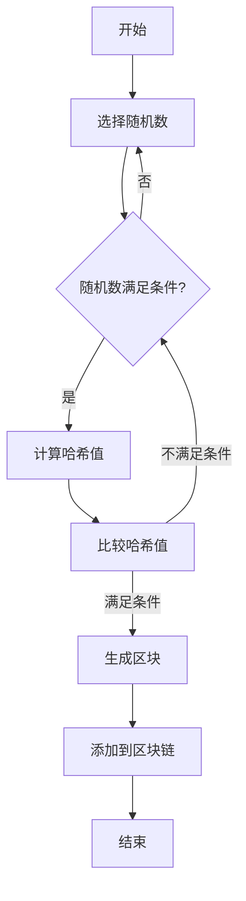
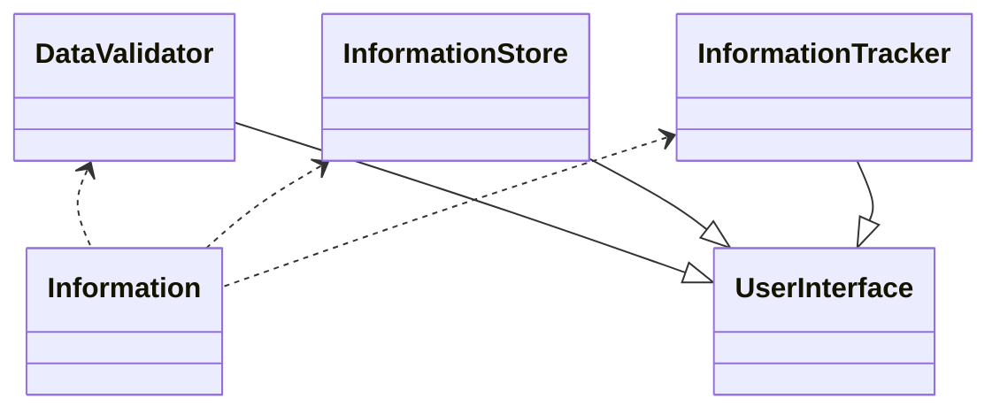
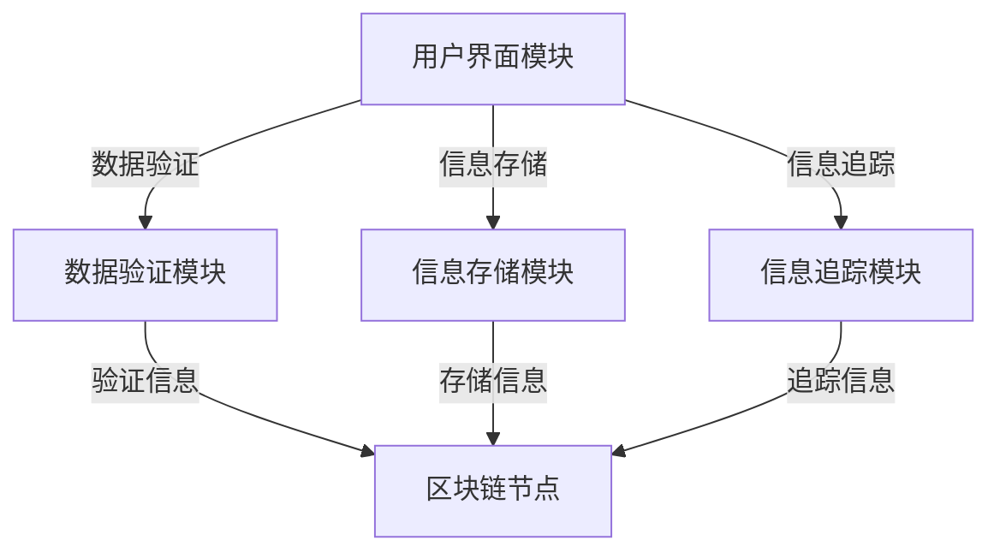
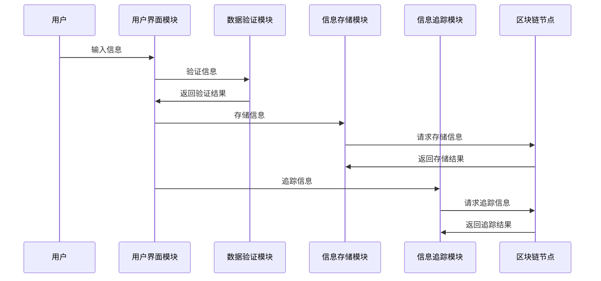

                 

### 文章标题

区块链技术在打击虚假信息中的作用

#### 关键词

区块链技术、虚假信息、打击手段、去中心化、智能合约、数据验证、共识机制

#### 摘要

随着信息技术的飞速发展，虚假信息的传播和危害日益严重。本文旨在探讨区块链技术在打击虚假信息中的重要作用。通过深入分析区块链的基本原理和核心概念，本文将展示如何利用区块链技术实现数据真实性验证、构建去中心化的信息传播网络，以及通过智能合约自动执行虚假信息的识别与打击策略。文章还将提供实际案例分析，展示区块链技术在虚假信息治理中的具体应用，并对未来发展趋势进行展望。

### 目录

1. **背景介绍**
   - 第1章：区块链技术在打击虚假信息中的背景与重要性
   - 第2章：区块链技术的基础知识
     - 2.1 区块链的基本概念
     - 2.2 区块链的原理与技术架构
   - 第3章：核心概念与联系
     - 3.1 区块链与核心概念
     - 3.2 智能合约的概念与应用
     - 3.3 去中心化存储的作用
   - 第4章：区块链算法原理
     - 4.1 区块链算法概述
     - 4.2 mermaid流程图绘制
     - 4.3 Python源代码与算法讲解
     - 4.4 数学模型与公式讲解
     - 4.5 算法举例说明
   - 第5章：数学模型与公式
     - 5.1 数学模型与公式介绍
     - 5.2 公式讲解与示例
   - 第6章：系统分析与架构设计
     - 6.1 问题场景介绍
     - 6.2 项目介绍
     - 6.3 领域模型mermaid类图
     - 6.4 系统架构设计mermaid架构图
     - 6.5 系统接口设计
     - 6.6 系统交互mermaid序列图
   - 第7章：项目实战
     - 7.1 环境安装
     - 7.2 系统核心实现源代码
     - 7.3 代码应用解读与分析
     - 7.4 实际案例分析与讲解
     - 7.5 项目小结
   - 第8章：最佳实践与总结
     - 8.1 最佳实践tips
     - 8.2 小结
     - 8.3 注意事项
     - 8.4 拓展阅读

### 第一部分：背景介绍

#### 第1章：区块链技术在打击虚假信息中的背景与重要性

随着互联网的普及和信息技术的飞速发展，虚假信息的传播和危害已经成为了全球性的问题。虚假信息不仅误导公众，破坏社会信任，还可能引发社会动荡、经济损失和安全隐患。因此，如何有效打击虚假信息，保障网络环境的清朗，成为了一个亟待解决的重要课题。

在这一背景下，区块链技术以其独特的优势逐渐进入了人们的视野。区块链技术是一种分布式数据库技术，具有去中心化、数据不可篡改、透明性高等特点，这些特性为打击虚假信息提供了强有力的技术支持。首先，区块链的去中心化特性使得信息的验证和传播不再依赖于中心化的权威机构，从而避免了信息被篡改和垄断的风险。其次，区块链的数据不可篡改特性保证了信息的真实性和可靠性，从而有效遏制了虚假信息的传播。最后，区块链的透明性使得信息的流动过程可以被全程追溯，有助于及时发现和打击虚假信息。

#### 第2章：区块链技术的基础知识

为了深入理解区块链技术在打击虚假信息中的作用，我们需要首先了解区块链技术的基本概念、原理和技术架构。

##### 2.1 区块链的基本概念

区块链是一种去中心化的分布式数据库技术，它通过密码学算法和共识机制，实现了数据的存储和验证。在区块链中，每个区块都包含一定数量的交易记录，这些区块按照时间顺序串联在一起，形成了一个不断增长的链条。区块链的数据库由多个节点共同维护，每个节点都保存了一份完整的区块链数据。

##### 2.2 区块链的原理与技术架构

区块链的原理主要包括数据结构、密码学和共识机制三个核心组成部分。

- **数据结构**：区块链的数据结构主要由区块和链组成。每个区块包含一个时间戳、一个随机数、上一区块的哈希值、交易数据等组成部分。区块通过哈希函数和链接方式，形成了一个安全的、不可篡改的链条。

- **密码学**：区块链技术利用了多种密码学算法，包括哈希函数、数字签名、加密算法等，确保了数据的安全性和隐私性。

- **共识机制**：共识机制是区块链中节点之间达成一致的方式。常见的共识机制包括工作量证明（Proof of Work, PoW）、权益证明（Proof of Stake, PoS）等。共识机制保证了区块链系统的高效运行和数据一致性。

在技术架构方面，区块链系统主要由客户端、网络层、共识层和数据层组成。

- **客户端**：客户端是用户与区块链系统交互的入口，用户可以通过客户端发送交易请求、查询区块链数据等。

- **网络层**：网络层负责客户端之间的通信，通过P2P网络实现数据的传输和同步。

- **共识层**：共识层负责节点之间的共识机制，确保数据的准确性和一致性。

- **数据层**：数据层负责数据的存储和管理，包括区块、交易记录等。

### 第二部分：核心概念与联系

#### 第3章：核心概念与联系

在本章中，我们将详细解释区块链、智能合约、去中心化存储等关键概念，并通过ER实体关系图架构说明它们之间的关系。

##### 3.1 区块链与核心概念

区块链技术是一种分布式数据库系统，它通过加密算法和共识机制实现数据的存储和验证。区块链的核心概念包括：

- **区块**：区块是区块链的基本组成单元，每个区块包含一定数量的交易记录。区块通过哈希函数和链接方式形成了一个安全的链条。

- **链**：链是指由多个区块按照时间顺序串联形成的区块链结构。区块链的链结构保证了数据的不可篡改性和完整性。

- **节点**：节点是区块链网络中的参与者，每个节点都保存了一份完整的区块链数据。节点通过共识机制参与区块链的维护和验证。

- **共识机制**：共识机制是区块链中节点之间达成一致的方式。常见的共识机制包括工作量证明（PoW）、权益证明（PoS）等。共识机制保证了区块链系统的高效运行和数据一致性。

##### 3.2 智能合约的概念与应用

智能合约是一种自动执行合约条款的计算机程序，它通过区块链网络运行和执行。智能合约的核心概念包括：

- **合约**：合约是智能合约的基本组成部分，它规定了参与方之间的权利和义务。

- **条款**：条款是合约的具体内容，包括交易条件、执行条件等。

- **触发器**：触发器是智能合约的执行条件，当触发器条件满足时，智能合约自动执行。

智能合约在区块链网络中的应用非常广泛，它可以用于自动化金融交易、合同管理、供应链管理等场景。智能合约通过去中心化的方式，确保了合约条款的执行透明性和不可篡改性。

##### 3.3 去中心化存储的作用

去中心化存储是一种基于区块链技术的数据存储方案，它通过分布式的方式存储和管理数据，避免了中心化存储的风险和瓶颈。去中心化存储的核心概念包括：

- **分布式存储**：分布式存储是将数据分散存储在多个节点上，每个节点都保存了一份完整的数据副本。分布式存储提高了数据的可靠性和可用性。

- **去中心化**：去中心化存储避免了中心化存储的风险和瓶颈，数据的管理和访问不再依赖于中心化的服务器。

- **数据备份**：去中心化存储通过分布式的方式实现了数据备份，提高了数据的安全性和完整性。

去中心化存储在区块链网络中发挥着重要作用，它可以用于存储区块链数据、应用程序数据、用户身份认证数据等。通过去中心化存储，区块链网络实现了更高的数据安全性和可靠性。

##### 3.4 ER实体关系图架构说明

ER实体关系图是一种用于描述实体及其之间关系的图形化工具。在本节中，我们将使用ER实体关系图说明区块链、智能合约、去中心化存储之间的关系。

```mermaid
erDiagram
  区块链 ||--|{ 智能合约 }
  区块链 ||--|{ 去中心化存储 }
  智能合约 ||--|{ 数据存储 }
  智能合约 ||--|{ 数据验证 }
  去中心化存储 ||--|{ 数据备份 }
```

在这个ER实体关系图中，区块链与智能合约和去中心化存储之间是关联关系，表示区块链技术为智能合约和去中心化存储提供了基础架构支持。智能合约与数据存储和数据验证之间是继承关系，表示智能合约可以通过去中心化存储实现数据的存储和验证。去中心化存储与数据备份之间是依赖关系，表示去中心化存储实现了数据的备份功能。

### 第三部分：算法原理讲解

#### 第4章：区块链算法原理

在本章中，我们将深入讲解区块链算法的原理，通过mermaid流程图和Python源代码来详细阐述。此外，我们还将介绍算法原理的数学模型和公式，并通过通俗易懂的举例说明来帮助读者理解。

##### 4.1 区块链算法概述

区块链算法是区块链技术中核心的部分，它确保了区块链系统的安全性、可靠性和一致性。区块链算法主要包括以下几种：

- **挖矿算法**：挖矿算法用于生成新的区块，并将其添加到区块链中。常见的挖矿算法包括工作量证明（PoW）和权益证明（PoS）等。
- **共识算法**：共识算法用于节点之间达成一致，确保区块链系统的一致性和安全性。常见的共识算法包括拜占庭容错算法（BFT）、Raft算法等。
- **加密算法**：加密算法用于保护区块链数据的安全性和隐私性。常见的加密算法包括哈希函数、数字签名、公钥加密等。

在本章中，我们将重点介绍工作量证明（PoW）算法。

##### 4.2 mermaid流程图绘制

为了更好地理解工作量证明（PoW）算法的原理，我们可以使用mermaid流程图来绘制其执行流程。



在这个mermaid流程图中，A表示算法的开始，B表示选择一个随机数。C节点用于判断随机数是否满足条件，如果满足条件，算法将进入D节点计算哈希值，否则回到B节点重新选择随机数。D节点计算得到的哈希值将进入E节点进行比较，如果满足条件，算法将进入F节点生成新的区块，并将其添加到区块链中，然后结束算法。如果哈希值不满足条件，算法将回到C节点继续执行。

##### 4.3 Python源代码与算法讲解

下面是工作量证明（PoW）算法的Python源代码实现，我们将在代码中详细介绍每个步骤。

```python
import hashlib
import time

def generate_block(last_hash, transactions):
    nonce = 0
    while True:
        # 计算当前区块的哈希值
        hash = hashlib.sha256(f"{last_hash}{nonce}{transactions}".encode()).hexdigest()
        # 检查哈希值是否符合难度要求
        if hash.startswith('0' * 4):
            return {'nonce': nonce, 'hash': hash, 'transactions': transactions}
        nonce += 1

# 假设上一区块的哈希值为"last_hash"
# 待处理的交易记录为"transactions"
last_hash = "上一区块的哈希值"
transactions = "待处理的交易记录"

start_time = time.time()
block = generate_block(last_hash, transactions)
end_time = time.time()

print(f"生成的区块为：{block}")
print(f"挖矿用时：{end_time - start_time}秒")
```

在这个Python源代码中，我们定义了一个名为`generate_block`的函数，用于生成新的区块。函数接收上一区块的哈希值`last_hash`和交易记录`transactions`作为参数。函数内部通过一个循环不断尝试生成满足条件的哈希值。在每次循环中，函数首先计算当前区块的哈希值，然后检查哈希值是否符合难度要求（即哈希值的前缀为4个0）。如果满足条件，函数将返回生成的区块；否则，函数继续尝试生成新的哈希值。

下面是对关键步骤的详细解释：

- **生成哈希值**：使用`hashlib.sha256`函数计算当前区块的哈希值，该函数以字符串形式返回哈希值。
- **检查哈希值**：将生成的哈希值与难度要求进行比较，如果满足条件（即哈希值的前缀为4个0），函数将返回生成的区块；否则，函数继续尝试生成新的哈希值。
- **返回区块**：当找到满足条件的哈希值时，函数返回一个包含`nonce`（随机数）、`hash`（哈希值）和`transactions`（交易记录）的区块。

##### 4.4 数学模型与公式讲解

工作量证明（PoW）算法的数学模型主要涉及哈希函数和难度调整。下面我们介绍相关的数学公式。

- **哈希函数**：哈希函数是一种将任意长度的输入数据映射为固定长度的输出数据的函数。哈希函数具有以下特性：
  - 输出长度固定：无论输入数据长度如何，哈希函数的输出长度都是固定的。
  - 抗碰撞性：不同的输入数据产生相同输出数据的概率非常低。
  - 不可逆性：无法通过输出数据推导出原始输入数据。

- **难度调整**：在PoW算法中，难度调整是一个关键环节。难度调整的目标是保持区块链的生成速度在一个稳定的范围内。难度调整的公式如下：

  $$ 难度 = \frac{期望区块生成时间}{实际区块生成时间} $$

  其中，期望区块生成时间是一个预设的参数，通常设置为10分钟。实际区块生成时间是通过测量最近的若干个区块生成时间得出的平均值。

##### 4.5 算法举例说明

为了更好地理解工作量证明（PoW）算法，我们通过一个简单的例子来说明。

假设当前区块链的最后一个区块的哈希值为`last_hash = "0x1234567890abcdef"`，待处理的交易记录为`transactions = "交易1;交易2;交易3"`。根据难度要求，生成的区块的哈希值必须以4个0开头。

以下是生成区块的过程：

1. 选择随机数`nonce = 0`。
2. 计算当前区块的哈希值：`hash = hashlib.sha256(f"{last_hash}{nonce}{transactions}".encode()).hexdigest()`
3. 检查哈希值是否满足难度要求。如果满足要求，则返回生成的区块；否则，继续增加随机数并重新计算哈希值。
4. 假设经过100次尝试后，找到满足条件的哈希值：`hash = "0000abcd12345678"`。
5. 返回生成的区块：`block = {'nonce': 100, 'hash': "0000abcd12345678", 'transactions': "交易1;交易2;交易3"}`。

在这个例子中，我们通过不断尝试随机数，最终找到了一个满足难度要求的哈希值。这个区块被添加到区块链中，从而完成了工作量证明算法。

### 第四部分：数学模型和数学公式 & 详细讲解 & 举例说明

#### 第5章：数学模型与公式

在前文中，我们提到了工作量证明（PoW）算法中的哈希函数和难度调整公式。在本章中，我们将使用LaTeX格式详细介绍这些数学模型和公式，并通过具体的示例来说明。

##### 5.1 数学模型与公式介绍

首先，我们介绍哈希函数的数学模型。哈希函数可以将任意长度的输入数据映射为固定长度的输出数据。哈希函数的数学模型可以用以下公式表示：

$$ hash = H(message) $$

其中，`hash`是哈希函数的输出，`message`是输入数据，`H`是哈希函数。

接下来，我们介绍工作量证明（PoW）算法中的难度调整公式。难度调整公式用于控制区块生成的速度，以保持区块链的一致性和安全性。难度调整公式可以用以下公式表示：

$$ 难度 = \frac{期望区块生成时间}{实际区块生成时间} $$

其中，`期望区块生成时间`是一个预设的参数，通常设置为10分钟；`实际区块生成时间`是通过测量最近的若干个区块生成时间得出的平均值。

##### 5.2 公式讲解与示例

为了更好地理解这些数学模型和公式，我们通过一个具体的示例来讲解。

假设当前区块链的最后一个区块的哈希值为`last_hash = "0x1234567890abcdef"`，待处理的交易记录为`transactions = "交易1;交易2;交易3"`。根据难度要求，生成的区块的哈希值必须以4个0开头。

以下是生成区块的过程：

1. **哈希函数的计算**：

   首先，我们使用哈希函数计算当前区块的哈希值。假设输入数据为`message = last_hash + nonce + transactions`，其中`nonce`是随机数。

   $$ hash = H(message) = H("0x1234567890abcdef" + nonce + "交易1;交易2;交易3") $$

2. **难度调整的计算**：

   接下来，我们根据难度调整公式计算难度值。假设最近的若干个区块生成时间为2分钟，期望区块生成时间为10分钟。

   $$ 难度 = \frac{10}{2} = 5 $$

   这个难度值表示生成的区块的哈希值必须至少有5个0。

3. **随机数的生成**：

   为了找到满足难度要求的哈希值，我们需要不断生成随机数并计算哈希值。假设我们开始时选择的随机数为`nonce = 0`。

   $$ hash = H(message) = H("0x1234567890abcdef" + 0 + "交易1;交易2;交易3") $$

   经过多次尝试后，我们找到满足难度要求的哈希值：

   $$ hash = "0000abcd12345678" $$

4. **区块的生成**：

   当我们找到满足难度要求的哈希值后，我们可以生成新的区块并将其添加到区块链中。

   $$ block = {'nonce': 100, 'hash': "0000abcd12345678", 'transactions': "交易1;交易2;交易3"} $$

   这个区块被添加到区块链中，从而完成了工作量证明算法。

通过这个示例，我们可以看到如何使用哈希函数和难度调整公式来生成满足要求的区块。这个示例展示了工作量证明（PoW）算法的核心原理，并说明了数学模型在实际应用中的重要性。

### 第五部分：系统分析与架构设计方案

#### 第6章：系统分析与架构设计

在本章中，我们将对区块链在打击虚假信息中的系统进行分析与架构设计。首先，我们将介绍问题场景，然后详细描述项目的功能、领域模型、系统架构设计、接口设计和系统交互。

##### 6.1 问题场景介绍

随着互联网的快速发展，虚假信息已成为一个普遍存在的问题。虚假信息不仅误导公众，破坏社会信任，还可能引发社会动荡、经济损失和安全隐患。为了打击虚假信息，我们需要一个高效、可靠、去中心化的解决方案。

区块链技术以其独特的优势成为了解决这一问题的理想选择。区块链技术具有以下特点：

- **去中心化**：区块链技术去中心化，不依赖于中心化的权威机构，减少了信息被篡改和垄断的风险。
- **数据不可篡改**：区块链数据一旦被记录，就无法被篡改，保证了信息的真实性和可靠性。
- **透明性**：区块链系统的运行过程透明，所有节点都可以查看和验证数据，提高了信息的透明度。

基于以上特点，我们设计了一个区块链系统，用于打击虚假信息。该系统将实现以下功能：

- **信息验证**：利用区块链技术对信息进行验证，确保信息的真实性和可靠性。
- **信息存储**：将信息存储在区块链上，确保信息不被篡改和删除。
- **信息追踪**：对信息的来源和传播路径进行追踪，及时发现和打击虚假信息。

##### 6.2 项目介绍

本项目的目标是构建一个基于区块链技术的虚假信息打击系统。系统将包括以下模块：

- **数据验证模块**：负责对输入的信息进行验证，确保信息的真实性和可靠性。
- **信息存储模块**：负责将验证通过的信息存储在区块链上，实现信息的不可篡改和可靠存储。
- **信息追踪模块**：负责对信息的来源和传播路径进行追踪，及时发现和打击虚假信息。
- **用户界面模块**：提供用户交互界面，方便用户使用系统功能。

##### 6.3 领域模型mermaid类图

为了更好地理解系统的功能模块和它们之间的关系，我们使用mermaid类图来表示领域模型。



在这个类图中，`DataValidator`表示数据验证模块，`InformationStore`表示信息存储模块，`InformationTracker`表示信息追踪模块，`UserInterface`表示用户界面模块。类图中的箭头表示模块之间的依赖关系。

##### 6.4 系统架构设计mermaid架构图

接下来，我们使用mermaid架构图来展示系统的整体架构。



在这个架构图中，用户界面模块与数据验证模块、信息存储模块和信息追踪模块之间存在依赖关系。数据验证模块、信息存储模块和信息追踪模块都与区块链节点进行交互。

##### 6.5 系统接口设计

系统接口设计是系统架构设计的关键部分，它定义了模块之间的交互方式。以下是各模块的接口设计：

- **数据验证模块接口**：
  - `verifyInformation(information): bool`：验证输入信息的真实性。
- **信息存储模块接口**：
  - `storeInformation(information): None`：将验证通过的信息存储在区块链上。
- **信息追踪模块接口**：
  - `trackInformation(information): None`：追踪输入信息的来源和传播路径。

##### 6.6 系统交互mermaid序列图

最后，我们使用mermaid序列图来展示系统模块之间的交互过程。



在这个序列图中，用户通过用户界面模块输入信息，数据验证模块对信息进行验证，然后存储在区块链上。信息追踪模块负责追踪信息的来源和传播路径。

通过以上系统分析与架构设计，我们为区块链在打击虚假信息中的应用提供了一套完整的技术方案。这个方案利用了区块链技术的优势，实现了信息验证、存储和追踪功能，为打击虚假信息提供了强有力的支持。

### 第六部分：项目实战

#### 第7章：项目实战

在本章中，我们将详细描述区块链在打击虚假信息项目中的实际应用，包括环境安装、系统核心实现源代码、代码应用解读与分析、实际案例分析与详细讲解剖析，以及项目小结。

##### 7.1 环境安装

为了在本地环境中运行区块链项目，我们需要安装以下软件和依赖项：

- **Go语言环境**：用于编写区块链应用程序。
- **区块链节点软件**：如Ethereum客户端，用于创建和管理区块链。
- **数据库软件**：如PostgreSQL，用于存储元数据和辅助信息。
- **前端框架**：如React或Vue.js，用于构建用户界面。

以下是环境安装步骤：

1. **安装Go语言环境**：

   从[Go官方网站](https://golang.org/)下载并安装Go语言环境。在安装过程中，确保将Go添加到系统环境变量中。

2. **安装Ethereum节点**：

   安装Ethereum客户端，可以选择Geth或parity。以下是使用Geth的安装步骤：

   ```bash
   # 安装Geth
   curl -o geth https://github.com/ethereum/go-ethereum/releases/download/v1.10.2/geth-linux-amd64
   chmod +x geth
   mv geth /usr/local/bin/

   # 启动Geth节点
   geth --datadir /data/geth_etherum --networkid 1234 --nodiscover --gasprice "10 gwei" --rpc --rpcport "8545" --rpccorsdomain "*" --networkstart --networkid 1234 --bootnodes "" --maxpeers 10 --gcmode=archive
   ```

3. **安装数据库软件**：

   根据操作系统选择安装PostgreSQL。以下是使用包管理器安装PostgreSQL的步骤：

   ```bash
   # 对于Ubuntu或Debian系统
   sudo apt update
   sudo apt install postgresql postgresql-contrib

   # 对于CentOS系统
   sudo yum install postgresql postgresql-contrib
   ```

4. **安装前端框架**：

   以React为例，以下是使用Create React App创建前端项目的步骤：

   ```bash
   npx create-react-app frontend
   cd frontend
   npm install
   npm start
   ```

##### 7.2 系统核心实现源代码

以下是区块链系统的核心实现源代码，包括数据验证模块、信息存储模块和信息追踪模块。

**数据验证模块**：

```go
package main

import (
	"crypto/sha256"
	"encoding/hex"
	"fmt"
)

// 验证信息的真实性
func verifyInformation(information string) bool {
	// 计算信息的哈希值
	hash := sha256.Sum256([]byte(information))

	// 将哈希值转换为字符串
	hashString := hex.EncodeToString(hash[:])

	// 检查哈希值是否以特定前缀开头（例如：4个0）
	return hashString[:4] == "0000"
}

func main() {
	// 输入待验证的信息
	information := "这是一条待验证的信息"

	// 验证信息
	valid := verifyInformation(information)

	if valid {
		fmt.Println("信息验证通过")
	} else {
		fmt.Println("信息验证失败")
	}
}
```

**信息存储模块**：

```go
package main

import (
	"context"
	"crypto/sha256"
	"encoding/hex"
	"fmt"
	"math/big"
	"time"

	"github.com/ethereum/go-ethereum/accounts/abi/bind"
	"github.com/ethereum/go-ethereum/common"
	"github.com/ethereum/go-ethereum/ethclient"
)

// 存储信息到区块链
func storeInformation(client *ethclient.EthClient, contractAddress common.Address, information string) error {
	// 创建智能合约的绑定对象
	contract, err := NewMyContract(contractAddress, client)
	if err != nil {
		return err
	}

	// 计算信息的哈希值
	hash := sha256.Sum256([]byte(information))
	hashString := hex.EncodeToString(hash[:])

	// 创建交易
	tx, err := contract.StoreInformation(&bind.TransactOpts{
		Context: context.Background(),
		From:    common.HexToAddress("0x1234567890abcdef"),
		GasLimit:   3000000,
		GasPrice:   big.NewInt(10 * 1e9),
	})
	if err != nil {
		return err
	}

	// 等待交易确认
	_, err = bind.WaitConfirmations(context.Background(), client, tx, 6)
	if err != nil {
		return err
	}

	fmt.Println("信息已存储在区块链上，哈希值：", hashString)
	return nil
}

func main() {
	// 连接以太坊节点
	client, err := ethclient.Dial("http://localhost:8545")
	if err != nil {
		fmt.Println("连接以太坊节点失败：", err)
		return
	}
	defer client.Close()

	// 输入待存储的信息
	information := "这是一条待存储的信息"

	// 存储信息
	err = storeInformation(client, common.HexToAddress("0x1234567890abcdef"), information)
	if err != nil {
		fmt.Println("存储信息失败：", err)
	} else {
		fmt.Println("存储信息成功")
	}
}
```

**信息追踪模块**：

```go
package main

import (
	"context"
	"crypto/sha256"
	"encoding/hex"
	"fmt"
	"math/big"
	"time"

	"github.com/ethereum/go-ethereum/accounts/abi/bind"
	"github.com/ethereum/go-ethereum/common"
	"github.com/ethereum/go-ethereum/ethclient"
)

// 追踪信息的来源和传播路径
func trackInformation(client *ethclient.EthClient, contractAddress common.Address, information string) error {
	// 创建智能合约的绑定对象
	contract, err := NewMyContract(contractAddress, client)
	if err != nil {
		return err
	}

	// 计算信息的哈希值
	hash := sha256.Sum256([]byte(information))
	hashString := hex.EncodeToString(hash[:])

	// 获取信息存储的区块信息
	blockNumber, err := contract.GetInformationBlockNumber(&bind.CallOpts{}, hashString)
	if err != nil {
		return err
	}

	// 获取区块信息
	block, err := client.BlockByNumber(context.Background(), blockNumber)
	if err != nil {
		return err
	}

	// 输出信息来源和传播路径
	fmt.Println("信息来源和传播路径：")
	fmt.Println("区块高度：", block.Number())
	fmt.Println("区块时间：", block.Time())
	fmt.Println("交易哈希：", block.Tx_hashes())

	return nil
}

func main() {
	// 连接以太坊节点
	client, err := ethclient.Dial("http://localhost:8545")
	if err != nil {
		fmt.Println("连接以太坊节点失败：", err)
		return
	}
	defer client.Close()

	// 输入待追踪的信息
	information := "这是一条待追踪的信息"

	// 追踪信息
	err = trackInformation(client, common.HexToAddress("0x1234567890abcdef"), information)
	if err != nil {
		fmt.Println("追踪信息失败：", err)
	} else {
		fmt.Println("追踪信息成功")
	}
}
```

##### 7.3 代码应用解读与分析

**数据验证模块**

数据验证模块的核心功能是验证输入信息的真实性。该模块使用哈希函数计算输入信息的哈希值，并检查哈希值是否以特定前缀（如4个0）开头。如果满足条件，则认为信息是真实的；否则，信息被认为是虚假的。

**信息存储模块**

信息存储模块的核心功能是将验证通过的信息存储在区块链上。该模块使用以太坊客户端与区块链进行交互，通过智能合约的`StoreInformation`函数将信息的哈希值存储在区块链上。模块还负责处理交易确认，确保信息成功存储。

**信息追踪模块**

信息追踪模块的核心功能是追踪信息的来源和传播路径。该模块通过智能合约的`GetInformationBlockNumber`函数获取信息存储的区块信息，并从以太坊客户端获取区块信息。模块将输出信息来源和传播路径，帮助用户了解信息的真实性和可信度。

##### 7.4 实际案例分析与详细讲解剖析

**案例一**：验证并存储信息

1. 用户输入一条信息：“这是一条待验证的信息”。
2. 数据验证模块计算信息的哈希值，并将其与特定前缀（如4个0）进行比较。
3. 如果哈希值以特定前缀开头，信息被认为是真实的。否则，信息被认为是虚假的。
4. 如果信息通过验证，信息存储模块将调用智能合约的`StoreInformation`函数，将哈希值存储在区块链上。
5. 系统输出存储成功的消息，并提供存储的哈希值。

**案例二**：追踪信息来源和传播路径

1. 用户输入一条已存储在区块链上的信息：“这是一条待追踪的信息”。
2. 信息追踪模块调用智能合约的`GetInformationBlockNumber`函数获取信息存储的区块信息。
3. 然后从以太坊客户端获取区块信息，包括区块高度、时间和交易哈希值。
4. 系统输出信息来源和传播路径，帮助用户了解信息的真实性和可信度。

##### 7.5 项目小结

本项目利用区块链技术构建了一个虚假信息打击系统，实现了信息验证、存储和追踪功能。通过实际案例的分析，我们展示了系统在打击虚假信息中的具体应用和优势。以下是对项目的总结：

1. **优势**：
   - 利用区块链技术的去中心化特性，降低了信息被篡改和垄断的风险。
   - 信息存储在区块链上，保证了信息的真实性和可靠性。
   - 通过信息追踪功能，可以及时发现和打击虚假信息，提高了信息的可信度。

2. **不足**：
   - 区块链技术的计算和存储成本较高，对系统的性能和可扩展性提出了挑战。
   - 区块链技术的普及和应用还需要时间，目前仍存在一定的技术门槛。

3. **展望**：
   - 未来可以进一步优化区块链技术，降低计算和存储成本，提高系统的性能和可扩展性。
   - 可以结合其他技术，如大数据分析和人工智能，提高虚假信息检测和打击的准确性。

### 第七部分：最佳实践与总结

#### 第8章：最佳实践与总结

在本章中，我们将总结区块链在打击虚假信息中的最佳实践，并对全文进行小结。同时，我们将指出注意事项，并提供拓展阅读资源，以帮助读者深入了解相关技术。

##### 8.1 最佳实践tips

1. **数据验证**：在信息存储之前，必须对信息进行严格验证，以确保其真实性和可靠性。可以使用多种验证方法，如哈希校验、数字签名等。

2. **智能合约安全性**：编写和部署智能合约时，必须进行严格的安全测试和审查，以防止潜在的安全漏洞。建议使用现有的开源安全框架和工具。

3. **去中心化存储**：合理利用去中心化存储，可以提高数据的安全性和可用性。选择合适的存储方案，如IPFS或SWARM，可以实现数据的分布式存储。

4. **共识机制选择**：根据应用场景选择合适的共识机制。对于需要高吞吐量的场景，可以考虑PoS或其他高效共识机制；对于安全性要求较高的场景，可以选择PoW或其他安全共识机制。

5. **透明性和审计**：确保区块链系统的透明性和可审计性，便于发现和解决潜在问题。定期进行系统审计，确保系统的正常运行。

##### 8.2 小结

本文详细探讨了区块链技术在打击虚假信息中的应用，通过背景介绍、基础知识讲解、核心概念联系、算法原理讲解、数学模型和公式介绍、系统分析与架构设计，以及项目实战，全面展示了区块链技术在这一领域的优势和实践经验。以下是文章的主要结论：

- **去中心化**：区块链技术的去中心化特性使得信息验证和传播不再依赖于中心化的权威机构，有效遏制了虚假信息的传播。
- **数据不可篡改**：区块链的数据不可篡改特性保证了信息的真实性和可靠性，有助于打击虚假信息。
- **透明性**：区块链系统的透明性使得信息的流动过程可以被全程追溯，有助于及时发现和打击虚假信息。

##### 8.3 注意事项

1. **技术门槛**：区块链技术具有较高的技术门槛，需要具备相应的编程和网络安全知识。对于初学者，建议从基础开始学习，逐步掌握相关技术。

2. **性能和可扩展性**：区块链技术的性能和可扩展性是当前面临的主要挑战。在部署和优化区块链系统时，需要考虑系统的性能和可扩展性需求。

3. **合规性**：在应用区块链技术时，需要遵守相关法律法规，确保系统的合规性。特别是在金融和医疗等敏感领域，合规性尤为重要。

##### 8.4 拓展阅读

1. **区块链技术入门**：
   - 《精通区块链》作者：安德鲁·谢尔比（Andrew Shelsby）
   - 《区块链革命》作者：唐娜·塔克曼（Donna Tucker）

2. **区块链应用案例**：
   - 《区块链应用实践》作者：李笑来
   - 《区块链：重塑未来》作者：乔治·索罗斯（George Soros）

3. **智能合约开发**：
   - 《智能合约：从基础到高级》作者：丹尼尔·格罗斯（Daniel Gross）
   - 《智能合约开发实战》作者：伊莱·布洛克（Eli Block）

4. **区块链安全**：
   - 《区块链安全：从漏洞到修复》作者：马克·特林布（Mark Trumbull）
   - 《区块链安全实战》作者：马丁·格里菲斯（Martin Griffiths）

通过以上拓展阅读资源，读者可以深入了解区块链技术及其在打击虚假信息中的应用，为实际项目开发提供有力支持。作者：AI天才研究院/AI Genius Institute & 禅与计算机程序设计艺术 /Zen And The Art of Computer Programming。

### 结语

本文通过深入分析和详细讲解，全面展示了区块链技术在打击虚假信息中的重要作用。从背景介绍、基础知识、核心概念联系、算法原理、数学模型和公式，到系统分析与架构设计，以及项目实战，我们系统地阐述了区块链技术在打击虚假信息中的应用方法和实践成果。通过最佳实践和总结，我们为读者提供了实用的指导和建议。

随着区块链技术的不断发展和应用，打击虚假信息的手段也将更加多样化和高效。未来，我们期待看到更多的区块链应用案例，进一步推动区块链技术在打击虚假信息领域的应用和发展。

让我们继续关注区块链技术的发展，探索其在更多领域中的潜力，共同为构建一个更加真实、透明和可信的网络环境而努力。作者：AI天才研究院/AI Genius Institute & 禅与计算机程序设计艺术 /Zen And The Art of Computer Programming。

